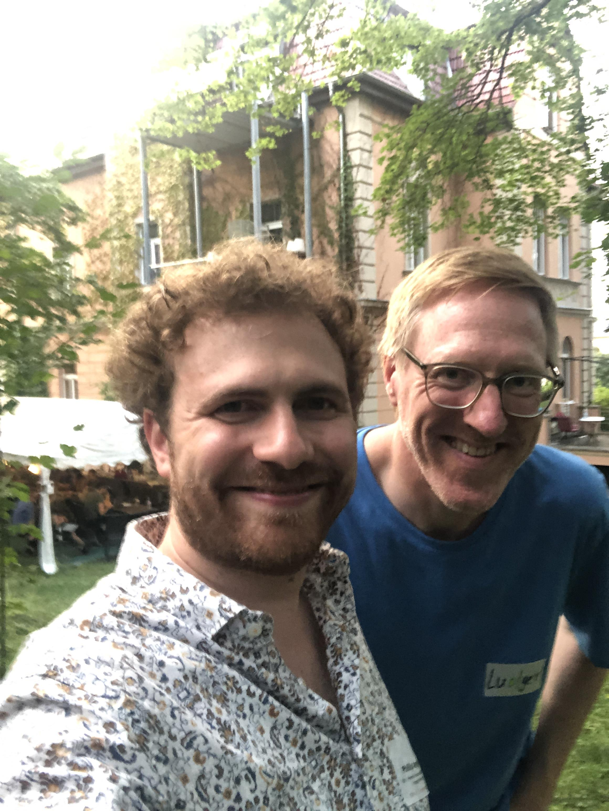
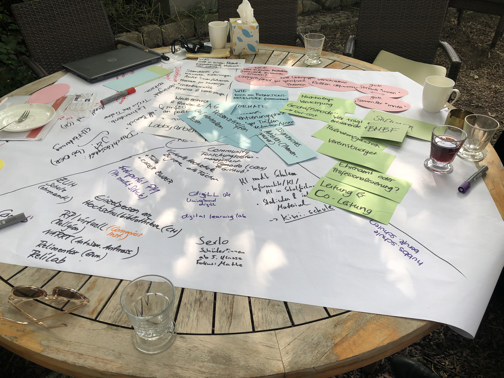
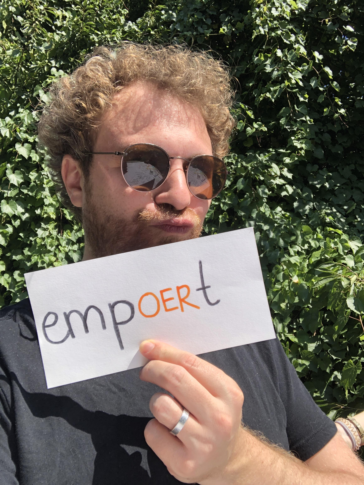

---

'@context': https://schema.org/
creativeWorkStatus: Draft
type: LearningResource
name: It's Jointly 2024 Rückblick
description: >-
  Das OER-/IT-Sommercamp "it's jointly 2024" fand zum neunten Mal in Folge in
  Weimar statt. Hier trafen sich ExpertInnen aus Bildung und der IT um
  gemeinsam an Strategien, Konzepten und Formaten zu arbeiten. Dabei wurde die
  Konferenz in einen Hackathon sowie ein Netzwerktreffen aufgeteilt. Zwei
  Mitglieder des FOERBICO Teams nahmen an den jeweiligen Campteilen vom
  19.08.-21.08.2024 teil.
license: https://creativecommons.org/publicdomain/zero/1.0/deed.de
creator:
  - givenName: Phillip
    familyName: Angelina
    type: Person
keywords:
  - Austausch
  - Konferenz
  - BMBF
  - OER-Strategie
  - OER
  - Networking
  - Vernetzung
  - Sommercamp
  - ''
inLanguage:
  - de
learningResourceType:
  - https://w3id.org/kim/hcrt/web_page
educationalLevel:
  - https://w3id.org/kim/educationalLevel/level_A
datePublished: '2024-09-02'

---

# It's jointly

Das OER-/IT-Sommercamp "it's jointly 2024" fand zum neunten Mal in Folge in Weimar statt. Hier trafen sich ExpertInnen aus Bildung und der IT um gemeinsam an Strategien, Konzepten und Formaten zu arbeiten. Dabei wurde die Konferenz in einen Hackathon sowie ein Netzwerktreffen aufgeteilt. Zwei Mitglieder des FOERBICO Teams nahmen an den jeweiligen Campteilen vom 19.08.-21.08.2024 teil.

Beim Campteil "Netzwerktreffen" wurden verschiedene Projekte und Ideen vorgestellt, wie mit *KI* in der Lehre umzugehen ist. Das seit Oktober 2022 neue Schlagwort KI wurde aus verschiedenen Perspektiven beleuchtet, um diese für verschiedene Bildungssektoren habhaft zu machen. *KI als ein Werkzeug* ist eine wichtige Erkenntnis aus der Tagung. 
Zusätzlich führten wichtige Themen wie Redaktionsnetzwerke, OER in der (Aus-)Bildung und Metadaten zu abendfüllenden Gesprächen.

Im Campteil "Hackathon" ging es auch um KI. Z. B. befasste sich ein Workshop damit, ob und wie sich mithilfe von Sprachmodellen aus (beschreibenden) Texten Metadaten erzeugen lassen. Diese sollen dann beim Erfassen und (Wieder-)Finden der Dokumente helfen. In einem anderen Workshop ging es um die Frage, wie sich Metadaten unabhängig von einer Plattform veröffentlichen und wiederverwenden lassen. An vielen weiteren Ideen und Konzepten wurde in den drei Tagen gehackt. Die TeilnehmerInnen suchten für verschiedenste Projekte nach neuen Antworten für aktuelle Probleme in der Digitalen Bildung.

Zum Abschluss wurden die Ergebnisse der einzelnen Workshops vor allen präsentiert. In einem internen (nicht ganz ernst gemeinten) "Wettbewerb" wurden die Beiträge prämiert. Sowohl im erstplatzierten als auch im zweitplatzierten Workshop waren wir mit dabei. Yeah! \o/

Sicherlich ein gutes Zeichen für den Start und den weiteren Projektverlauf von FOERBICO! Happy Hacking! <3