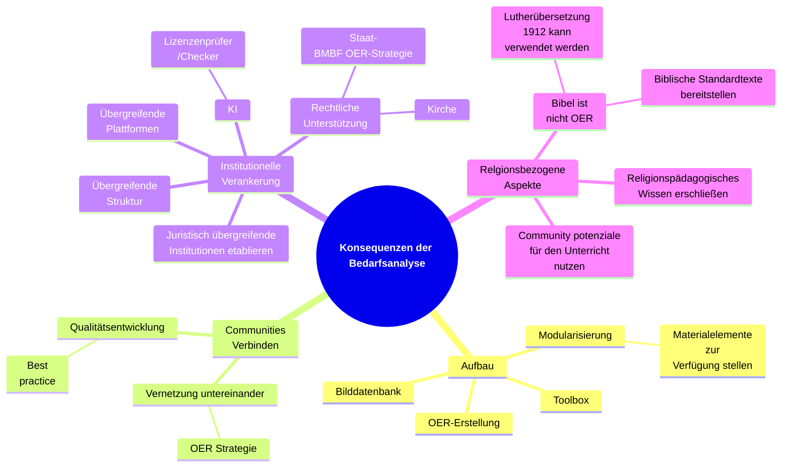

# Ergebnisse der Gruppendiskussion
Live-Editor: https://mermaid.live/edit

```mermaid
mindmap
  root((**Konsequenzen der Bedarfsanalyse**))
    Aufbau
        Modularisierung
            Materialelemente<br/>zur<br/>Verfügung stellen
        Toolbox
        Bilddatenbank
        OER-Erstellung
    Communities<br/>Verbinden
      Vernetzung untereinander
        OER Strategie
      Qualitätsentwicklung
           Best<br/>practice
    Institutionelle<br/>Verankerung
            KI
                Lizenzenprüfer<br/>/Checker
        Übergreifende<br/>Struktur
        Übergreifende<br/>Plattformen
        Rechtliche<br/>Unterstützung
            Staat-<br/>BMBF OER-Strategie
            Kirche
        Juristisch übergreifende<br/>Institutionen etablieren
    Relgionsbezogene<br/>Aspekte
        Bibel ist<br/>nicht OER
            Lutherübersetzung<br/>1912 kann<br/>verwendet werden
            Biblische Standardtexte<br/>bereitstellen
        Religionspädagogisches<br/>Wissen erschließen
        Community potenziale<br/>für den Unterricht<br/>nutzen
```
---
### Strukturelle Anfragen

```mermaid
flowchart TD
    A[Religionspädagogischer<br/>Aspekt] --> |Was ist das spezifisch religionspädagogische Merkmal?| B(Operationalisierung<br/>für das Material)
    B -->|Start Up Mentalität| C[-Nutzerorientiert<br/>-Kirchliche Bezug<br/>-Personal]
    B -->|Finanzen| D[-Strategie<br/>OER und OEP<br/>-Hinterfragung<br/>der klassischen<br/>Finanzierung<br/>-Offensives Auftreten]
    D -->|Problemstellungen| E[-Verlagswesen im Schulwesen<br/>-Kirchliche Prüfverfahren<br/>-Lern- und Lehrkultur]
    B -->|Prozessqualität von<br/>Communities| F[-Personelle Ressourcen<br/>-Aufgabenformate<br/>-Inspirative Impulse<br/>-Intentionaler Moment<br/>-Transparenter Workflow]
    F -->|Problemstellungen| E[-Verlagswesen im Schulwesen<br/>-Kirchliche Prüfverfahren<br/>-Lern- und Lehrkultur]
    F -->|Offene Fragen| G[Wie können sie sich erweitern?<br/>Welche personelle Ressourcen braucht es um die Ziele zu erreichen?]

    A:::primary
    B:::alternative
    C:::backgroundLight
    D:::highlight
    E:::alternative
    F:::backgroundLight
    G:::headline

    classDef primary fill:#203A8F,stroke:#002366,stroke-width:2px,color:#FFFFFF
    classDef alternative fill:#FFA500,stroke:#D3D3D3,stroke-width:2px,color:#333333
    classDef text fill:#333333,stroke:#D3D3D3,stroke-width:2px
    classDef headline fill:#002366,stroke:#D3D3D3,stroke-width:2px,color:#FFFFFF
    classDef border fill:#D3D3D3,stroke:#333333,stroke-width:2px
    classDef backgroundLight fill:#F0F8FF,stroke:#D3D3D3,stroke-width:2px
    classDef backgroundDark fill:#E6F2FF,stroke:#D3D3D3,stroke-width:2px
    style D stroke:#203A8F,fill:#FFA500,color:#FFFFFF
```