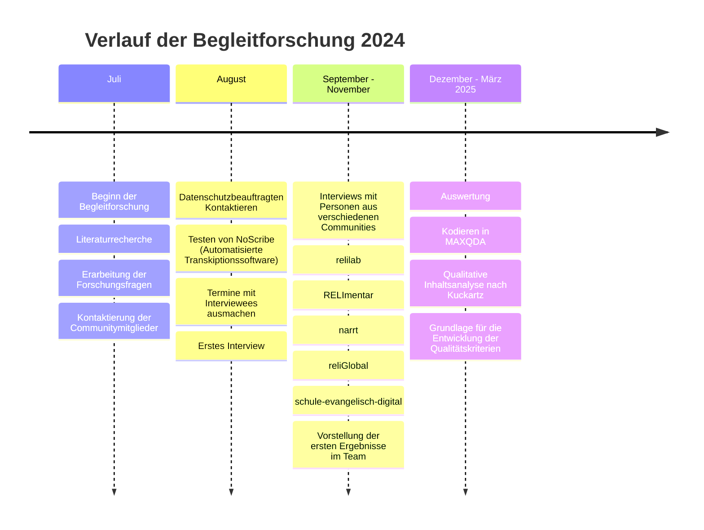
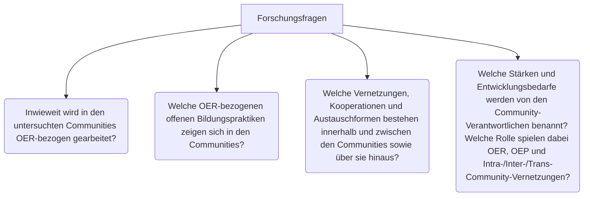
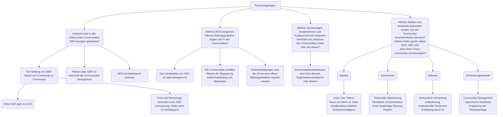

# Begleitforschung
Dieses Dokument zeigt den bisherigen Projektverlauf des FOERBICO Projekts. Es werden der Verlauf der Begleitforschung vorgestellt sowie die Zusammenfassung der wichtigsten Ergebnisse, welche auf der Zwischenfazittagung besprochen werden. Es ist noch nicht vollständig und befindet sich im Arbeitsprozess.
## Timeline

Die Timline zeigt den Verlauf der Begleitforschung im Jahr 2024 und Anfang 2025. [Weiteres Folgt]

### Literaturbericht
Die Begleitfroschung begann zunächst mit einem Kennenlernen des Forschungsfeldes zu OER und OEP durch eine Literaturrecherche. Die wichtigsten Erkenntnisse werden im Artikel ([Pirker & Pirner 2025](https://openjournals.fachportal-paedagogik.de/theo-web/article/view/51)) zusammengefasst:
>  Die Ergebnisse zeigen ambivalente Befunde: Sie weisen auf strategische, infrastrukturelle und kulturelle Herausforderungen hin, unterstreichen aber das perspektivische Potenzial von OER/OEP für eine partizipationsorientierte, digitale und pädagogisch wie theologisch verantwortete religionspädagogische Bildungslandschaft. (Pirker & Pirner, 2025, p. 151)
-  Im religionspädagogischen Kontext ist die Nutzung von OER sowie das Anwenden von OEP nicht eingehend erforscht (Pirker & Pirner, 2025, pp. 165).
    > Zur Verwendung von OER/OEP in der theologischen oder religionspädagogischen Hochschullehre gibt es ebenso wie zu religionsbezogener Bildungsarbeit in Schulen bislang keine wissenschaftlichen Studien (Pirker & Pirner, 2025, p. 167).
- Im Hochschulbereich gibt es vereinzelte Beteiligungen von OER in diversen Materialpools (Pirker & Pirner, 2025, p. 167).
- Es gibt eine religionspädagogische offene Bildungsbewegung, welche aber von wissenschaftlicher sowie institutioneller wenig Beachtung findet (Pirker & Pirner, 2025, p. 168).
- Die Erwartung das OER/OEP zu mehr Chancengleichheit führen, kann nur teilweise festgestellt werden (Pirker & Pirner, 2025, p. 168).
- Das Wechselverhältnis von OER und OEP, kann teilweise empirisch nachgewiesen werden (Pirker & Pirner, 2025, p. 168)
- Im deutschen religionspädagogischen Hochschulkontext ist OER im Internationalen Vergleich unterrepräsentiert (Pirker & Pirner, 2025, pp. 168)
- Hemmende Faktoren für die Implementierung und Qualitätsentwicklung sind: technische Unzulänglichkeiten, mangelnde Motivation und Kompetenzen, mangelnde Qualitätssicherung und -kommunikation, mangelnde institutionelle Unterstützung (Pirker & Pirner, 2025, p. 169).
    - Rechtliche Unsicherheiten werden in internationalen Studien kaum genannt.
- Unterstützende Faktoren sind Kooperation und Austausch (Pirker & Pirner, 2025, p. 169).
- Der religionspädagogische Bereich ist einerseits pionierhaft und innovativ durch das Engagement der Communities, aber wissenschaftlich wird dies kaum Wahrgenommen (Pirker & Pirner, 2025, p. 169).

### Interview Studie
Um das Desiderat des Literraturreviews zu füllen, wurden im Rahmen des FOERBICO-Projekts aktive Mitglieder aus verschiedenen Communities befragt. Diese Interviews fanden alle über Zoom statt. Es handelte sich hierbei um 12 Interviews mit 13 Personen. Da alle Interviewpartner:innen über ganz Deutschland verteilt leben und arbeiten und sie durch ihre Arbeit Erfahrung mit digitalen Tools haben, wurden die Interviews über Zoom durchgeführt und aufgezeichnet. Das Audiomaterial wurde mithilfe der KI-Transkriptionssoftware [NoScribe](https://noscribe.ai/de-DE) transkribiert. Alle Teilnehmer:innen wurden im Vorfeld über ihre Datenschutzrechte aufgeklärt und direkt vor der Aufnahme wurden diese nochmals kurz besprochen. 
Der gesamte Leitfaden ist anhand der folgenden vier Forschungsfragen entwickelt worden:

#### Leitfaden
<table>
<thead>
  <thead>
    <tr>
      <th>Fragen</th>
      <th>Zielrichtung</th>
    </tr>
  
</thead>
    <tr>
      <th>Einstieg</th>
          </tr>
  </thead>
  <tbody>
    <tr>
      <td> In welcher community halten Sie sich hauptsächlich auf? 
      - Wie würden Sie die Community beschreiben?
      - In welchen Communities halten Sie sich auf?
      - Was macht ihr konkret in eurer Community?
Was ist Ihre aktuelle Rolle in der Community und wie hat sich diese im Laufe der Zeit entwickelt?
- Was schätzen Sie an Ihrer Community? 
- Was motiviert Sie, in dieser Community mitzuarbeiten?
- Welche Ziele wollen Sie mit Ihrer Community erreichen?

*Beschreiben Sie, was Sie unter OER und OEP verstehen*
Erzählen Sie doch mal: Sind Sie schon mit OER in Kontakt gekommen; falls ja, was war Ihre erste Begegnung mit OER?
- Welche Eindrücke haben Sie dabei gewonnen?
- Wie würden Sie OER in eigenen Worten beschreiben?
- Hat sich Ihre Wahrnehmung von OER im Laufe der Zeit verändert?
- Was schätzen Sie an OER und was finden Sie schwierig an OER?
</td>
           <td> 

- Biografischer Bezug 
- Grundlegende Fragen zur Community. 
- Frage nach Schlüsselfiguren in der Community?
- Frage nach Organisation und Hierachien innerhalb der Community?
- Ggf. hier schon Frage nach Vernetzung zwischen den Communities?
- Frage nach einer Definition von Community/Was zeichnet eine Community Ihrer Meinung nach aus?
- Frage nach Verantwortung
- Frage nach Haupt- und Ehrenamt
- Frage nach Kommunikation innerhalb der Community
- Frage nach Kultur des Teilens: Was braucht es hierfür?
- Grundlegende Fragen zum persönlichen Einsatz von OER.
</td>
    </tr>
        <tr>
      <th>Leitfrage 1: Ist zustand.</th>
          </tr>
  </thead>
  <tbody>
    <tr>
      <td>Können Sie erzählen wann/ wo/ wie OER in ihrer Tätigkeit zum Einsatz kommt?
- Können Sie die Kriterien nennen, nachdem Sie Ressourcen erstellen oder vorhandene Ressourcen auswählen? 
- Unter einer OER-Perspektive, können Sie uns sagen, ob Sie eine gewisse Art von Material, beispielsweise Video oder Audio, bevorzugen und warum?
- Welche Tools sind für Sie zur Erstellung von OER am relevantesten?
- Wo und wie erfahren Sie Unterstützung bei rechtlichen Fragen im Zusammenhang mit OER?</td>
      <td>OER in der Praxis
- Gründe für OER in der Community
- Spielen die 5V Freiheiten eine Rolle
- Zu welchem Zweck OER?
- Communitystrukturierung
- Frage nach Verbesserung der rechtlichen Unterstützung
</td>
    </tr>
      <th>Leitfrage 2: Ist-Zustand OEP</th>
          </tr>
  </thead>
  <tbody>
    <tr>
      <td>Was verbinden Sie mit dem Begriff OEP?
Wie würden Sie das Verhältnis von OER zu OEP beschreiben?
- Erzählen Sie, welche Rolle offene Bildungspraktiken (OEP) in Ihrer Community spielen.
- In welchem Umfang spielen Fortbildungen innerhalb Ihrer Community eine Rolle? Wie offen sind diese?
- Welche Themenschwerpunkte werden in Fortbildungen gesetzt? Wie sind sie strukturiert?
</td>
           <td> 
Verhältnis OER-OEP
Bedeutung von OEP in der Community
</td>
 </tr>
      <th>Leitfrage 3: Vernetzung</th>
          </tr>
  </thead>
  <tbody>
    <tr>
      <td>Beschreiben Sie, wie die Mitglieder in Ihrer Community untereinander vernetzt sind.
- An welchen Kriterien machen Sie fest, dass sich ein Tool bewährt hat?
- Erzählen Sie, inwiefern Ihre Community mit anderen Communities (oder Gruppierungen, Institutionen) vernetzt sind.
- Welche Chancen und Hürden sehen Sie in der Vernetzungsarbeit?
- In welchem Maße sind sie mit Communities (oder Gruppierungen, Institutionen) außerhalb der religionsbezogenen vernetzt?
</td>
           <td> 
- Intra-Community-Vernetzung
- Inter- und Trans-Community-Vernetzung
</td>
</tr>
      <th>Leitfrage 4: Stärken und Entwicklungsbedarf (Transformative Potentiale)</th>
          </tr>
  </thead>
  <tbody>
    <tr>
      <td>Stellen Sie sich Ihre Community in 10 Jahren vor: Welche Veränderungen haben sich aufgrund von OER und OEP entwickelt?
Welche Träume haben Sie für die Zukunft Ihrer Community oder die communityübergreifende OER-/OEP-Arbeit?
Wie wünschen Sie sich eine zukunftsweisende Vernetzung zwischen den Communities? (national und international)
Mit Blick auf Ihre persönliche Arbeit und die Ihrer Community:
- Welche Chancen bieten Ihrer Meinung nach OER und OEP für die Bildungsinfrastruktur in den nächsten zehn Jahren?
- Wie könnte der Zugang zu Bildungs- und Lernmaterialien durch OER und OEP in den nächsten zehn Jahren verbessert werden, und welche Maßnahmen wären dafür aus Ihrer Sicht notwendig? 
 
Was bedarf es Ihrer Meinung nach, damit ihre Community das Potential von OER und OEP voll ausschöpfen kann?
- An welchen Stellschrauben müsste gedreht werden, um Ihrer Meinung nach, die Community zu verbessern?
- Wie gut funktionieren die Community Repositorien, Suchmaschinen u.ä., die Sie verwenden? Welche Entwicklungsbedarfe sehen Sie?
 
Welche Rolle wird aus Ihrer Sicht KI bei der Weiterentwicklung von OER und OEP sowie Ihrer Community spielen?
Welche Hoffnungen und Erwartungen verbinden Sie mit unserem Projekt (das auf die Stärkung und Vernetzung von OER-Communities zielt), sowohl für Ihre persönliche Arbeit als auch für die Entwicklung Ihrer Community? Was wünschen Sie sich an konkrete Fördermaßnahmen?
</td>
           <td> 

- Vision für die Zukunft
- Abfragen von Bedürfnissen
- Einfluss auf das Unterrichtsgeschehen
- Strukturelle Veränderun

</td>
  </tbody>
</table>

### Communities
Die verschiedenen Communities unserer Interview-Studie werden im folgenden Abschnitt kurz vorgestellt. Die Texte bestehen aus Zusammenfassungen der Websiten und einzelnen Aspekten aus den Interviews.

[rpi-virtuell](https://rpi-virtuell.de/) (2): 
Ist als religionspädagogischer Akteur seit Anfang der 2000er Teil der digitalen Bildung und Fortbildung tätig. Das rpi ist Teil der deutschen OER-Bewegung von Beginn an.
Als aktive Community hat sie sich in andere Communities disseminiert und bietet die technische Infrastruktur und Expertise für andere Communities im religionspädagogischen Bereich. 
Materialpool: Das rpi hosted einen Materialpool auf dem online Material für den elementar Bereich, den schulischen und außerschulischen Bereich zu finden ist.

[relilab](https://relilab.org/) (3):
Das relilab ist eine Community, die religionsbezogene Bildung ermöglicht. Dabei ist sie heterarchisch strukturiert und lädt alle Menschen zum teilnehmen ein. Als Community wird selbstgesteuertes Lernen unterstützt und die Erstellung sowie Verbreitung freier Bildungsmaterialien. Ein wichtiger Baustein der Community sind die Fortbildungen, welche vom relilab selbst oder von externen Anbietern über das relilab-Zoom stattfinden.

Gegründet: 2020 aus dem #relichat auf Twitter, als eigenständige Community.
Fortbildungen: Das relilab bietet Mini-Onlinefortbildungen an und ist auch eine Plattform auf der andere Fortbildungsinstitute ihre Fortbildungen zu bewerben und stellt den eigenen Zoomraum zur Verfügung.

[RELImentar](https://relimentar.de/) (2): 
RELImentar ist eine Community, die religionsbezogene Bildung im Elementar- und Primarbereich stärkt. Auf ihrer Website steht:
> RELImentar ist das religionspädagogisches Portal für alle, die mit Kindern in Krippe, Kita und Hort tätig sind.

RELImentar stellt einen qualitätsgeprüften Materialpool mit Praxismaterialien bereit. Die Materialien sind offen lizenziert und mit Metadaten wie beispielsweise Autor:innenschaft und Zielgruppe ausgewiesen.

Gegründet: Die Internetseite wurde Ende 2018 Anfang 2019 aufgesetzt. 

Cafés: Ein zentraler Baustein sind die RELImentar-Cafés. Die Cafés sind ein Raum für Fachimpulse, kollegialen Austausch und die gemeinsame Arbeit am Material. Die Teilnehmenden können nicht nur ausgewähltes Material für sich erschließen, sondern auch selbst Hand anlegen.

[narrt](https://narrt.de/) (1): 
> narrt vernetzt Menschen, die sich selbstreflexiv mit der Verstrickung von Religionspädagogik und Theologie in antisemitische und rassistische Verhältnisse auseinandersetzen. Wir wissen, dass dies ein ständiger Prozess ist, der auch Rückschläge kennt. Wir wollen dennoch gemeinsam nach alternativen Denkweisen, Handlungsformen und Materialien suchen, die sich der Aufgabe stellen, Antisemitismus und Rassismus in Kirche und Gesellschaft abzubauen.

Das Netzwerk narrt ist ein Kooperationsprojekt der Evangelischen Akademie zu Berlin, dem ComeniusInstitut in Münster und dem  Institut für Evangelische Theologie und Religionspädagogik an der Carl von Ossietzky Universität Oldenburg. Vernetzung und Aufklärung steht im Zentrum der Arbeit von narrt. Eine Kernaufgabe ist die Begleitung von schulischen Bildungsbereichen. Personen aus dem narrt Netzwerk erstellen OER und erarbeiten diese im Sinne von OEP in Projekten auch mit Schüler:innen.  

Gegründet: 2016
Cafés: Die Cafés sind der Ort an dem Interssierte und Mitglieder sich über aktuelle Fragen im Bereich der antisemitismus- und  rassismuskritische austauschen. Die Cafés bieten den Raum um Fragen zu stellen, Gedanken auszutauschen, aber auch über kirchenpolitische Themen zu reden.

[reliGlobal](https://religlobal.org/) (3): 
> reliGlobal ist die gemeinsame Fachstelle der ALPIKA, in der das Team aus fünf Mitarbeitenden aus fünf Instituten seit dem 01.09.2023 das Ziel verfolgt, Globales Lernen im Religionsunterricht zu verankern. Kern der Arbeit ist die Entwicklung von innovativen Unterrichtsvorhaben und von darauf aufbauenden Fortbildungen, die trotz der Unterschiede zwischen den Bundesländern passgenau an die Standards der jeweiligen Kernlehrpläne ausgerichtet sind. Denn Lehrkräfte sollen die OER-lizensierten Inhalte möglichst unmittelbar verwenden und in ihren Unterrichtsalltag integrieren können.

Das Projekt wird Gefördert von Brot für die Welt. reliGlobal legt den Fokus auf die Erstellung und Verbreitung von OER. Diese werden modularisiert und in verschiedenen Dateiformaten veröffentlicht. 
Gegründet: 2023
Arbeitsmethode: Ist die Scrum-Methode in denen Materialien in 6 Wochensprints erstellt und in einer zweiten Phase überarbeiten werden. 

[schule-evangelisch-digita](https://schule-evangelisch-digital.de/) (2):
Die Community schule-evangelisch-digital wurde gegründet um Lehrkräft in evangelischen Schulen deutschlandweit zu vernetzen. Das Projekt wird vom Comenius-Institut, rpi-Virtuell sowie der Barbara-Schadeberg-Stiftung getragen und gefördert. Neben der Vernetzung und des Austausches soll über diese Community Schulentwicklung vorangetrieben werden. Dabei sind die monatlichen Austauschrunden eine Möglichkeit, dass sich Lehrkräfte gegenseitig Impulse und Inspiration geben können.

[DiskursLab](https://www.eaberlin.de/themen/projekte/diskurslab/) (1): 
Das Diskurslab ist eine Laborumgebung der Evangelischen Akademie zu Berlin mit innovativen Formaten für Theologie und Religionspädagogik. Dabei handelt es sich hierbei nicht um eine klassische OER Community. Das Interview fand trotzdem statt, da das DiskursLab sich bei dem Versuch einer Community-Gründung vor vielen Herausforderungen stand.

### Auswertungsmethode: inhaltlich-strukturierende Inahltsanalyse nach Kuckartz
Die qualitative Inhaltsanalyse ermöglicht „die systematische und methodisch kontrollierte wissenschaftliche Analyse von Texten, Bildern, Filmen und anderen Inhalten von Kommunikation“ (Kuckartz & Rädler, 2024, S. 39). Ein Vorteil der von Kuckartz entwickelten Variante der inhaltlich-strukturierenden Inhaltsanalyse ist, dass sie recht flexibel ein deduktives (z.B. an den Leitfragen orientiertes) mit einem induktiven (aus dem Interviewmaterial heraus entwickelndes) Vorgehen bei der Kategorienbildung reflektiert zu verbinden erlaubt.

#### Codes
- Deduktiven Hauptcodes: OER - Allgemein, OEP - Allgemein, Community - Allgemein, Biografischer Bezug, Chancen, Hürden
- Induktive Hauptcodes: Qualität, Recht, Konkrete Erwartungen an FOERBICO, Materialpool und Metadaten, Kultur des Teilens
- Induktive Subcodes:
    OER-Allgmein: OER-Eigenschaften, Produktion ohne OER, Produktion von OER, Tools, Anwendbarkeit, Verständnis von OER, 
    OEP-Allgemein: OEP im Tun, Verständnis von OEP, Fortbildungen, OEP als Beziehungs-geschehen, 
    Community - Allgemein: Stellung von OER innerhalb der Community, Community Aufbau, Zugehörigkeit, Struktur, Netzwerke,
    Qualität: Feedback, Qualitätssicherung
    Hürden: Didaktische und inhaltliche Hürde, Technische Vorkenntnisse, Community-Ressourcen, Bedenken im Hinblick auf Openness, OER-Label, Strukturelle Hürden, Individuelle Ressourcen, Rechtliche Hürden.
    Chacen: Remix-Chancen, Didaktische und methodische Chancen, Kollaboratives Arbeiten, Technische Möglichkeitn/Chancen, Multiperspektivischer Blick, Strukturelle Chancen, Zukunftsperspektive
- Subcode der ausdifferenziert wurde: 
    Struktur: Community Ziele, Hierarchien, Arbeitsräume, Interne Zusammenarbeit, Interne Kommunikation

Die Genaue Auflistung von der Code-Definition und den Beispielen ist hier zu finden [Link einfügen] 

### Ergebnisse 

Dies Flowchart zeigt zusammengefasst die wichtigsten Ergebnisse aus der Interviewbefragung im Hinblick auf die vier Forschungsfragen. Hervorzuheben ist, dass die Aspekte von Unwissenheit über OER, besonders im Bezug auf rechtliche Fragen, sowie die Primärstellung des Teilens über der korrekten Lizenzierung sowie das Fehlen von Qualitätskriterien im religionspädagogischen Bereich, führte zu der Entwicklung von Qualitätskriterien. [ZITAT noch EINARBEITEN]
Ein weiterer wichtiger Aspekt ist, dass die gelebte Praxis von Community-Treffen sehr divergierend ist. Unter dem Code "Fortbildungen" lassen sich einerseits klassische Online-Fortbildungen finden, in denen entweder thematisch- oder an einem Material etwas beigebracht werden soll. Dann gibt es Communitytreffen, die ein Café oder Werkstattformat haben, in denen sich entweder über aktuelle Themen ausgetauscht wird oder an konkreten OER-Materialien, die Personen einbringen oder aus dem Materialpool entnommen werden, gemeinsam gearbeitet wird.
OEP ist in der theoretischen Reflexion vielen aktiven Community-Mitgliedern nicht bekannt. Diese offenen Praktiken werden in allen Communities gelebt. Um auf diese Diskrepanz aufmerksam zu machen, gibt es den Code *OEP im Tun*, um zu zeigen, dass OEP stattfindet, trotz der fehlenden Reflexion darüber.  

### [Qualitätskriterien](https://oer.community/qualitaet/)

Offene Bildungsmaterialien (OER) eröffnen zentrale Chancen für Lern- und Lehrsettings: Sie ermöglichen Teilhabe, fördern digitale Kompetenzen und stärken eine offene, kollaborative Bildungskultur. Auch in der Religionspädagogik wächst die Bedeutung offener Lehr- und Lernmaterialien, insbesondere vor dem Hintergrund digitaler Transformationsprozesse und KI-gestützter Erstellungsmethoden von religionsdidaktischen Materialien. Mit dieser Dynamik stellt sich immer dringlicher die Frage: Woran lässt sich gute Qualität in religionspädagogischen OER erkennen – und wie kann sie nachhaltig gesichert werden?

Während allgemeine OER-Qualitätsmodelle zentrale Standards formulieren und insgesamt eine wertvolle Orientierung bieten, berücksichtigen sie natürlich keine fachspezifischen Besonderheiten religiöser Bildungsprozesse. Hier haben wir mit dem FOERBICO-Projekt angesetzt und praxisnahe, wissenschaftlich fundierte und community-orientierte Qualitätskriterien entwickelt, die für den schulischen, hochschulischen und außerschulischen religionspädagogischen Kontext konzipiert wurden.

#### Die FOERBICO-Handreichung – Entstehung & Zielsetzung
Die Qualitätskriterien entstanden in einem mehrstufigen, iterativen Prozess:
- Analyse bestehender Qualitätssicherungsmodelle in OER-Communities
    Hier bei waren wichtige Ergebnisse aus verschiedenen Interviews wichtig. Beispielsweise hat RELImentar einen eigenen Kriterienkatalog. [Link einfügen] [Zitat aus dem Interview]
- Abgleich mit zentralen religionspädagogischen Forschungsdiskursen zu guter Qualität religiöser Bildung
    Hierbei wurde auf wissenschaftliche Standardlehrwerke in der religionspädagogischen und didaktischen Ausbildung zurückgegriffen. Diese wurden zusammengefasst und für Checklisten aufbereitet (siehe [Qualitätskriterien-Checkliste](https://oer.community/qualitaetskriterien-checkliste/)). 
    Wichtig war bei der Erstellung:
    > Dabei ist zu berücksichtigen, dass es den guten Unterricht nicht gibt (vgl. Gojny; Lenhard & Zimmermann, 2022, S. 164). Mit Helmke (2017) ist vielmehr zu fragen: Gut wofür, gut für wen, gemessen an welchen Bedingungen, aus welcher Perspektive und für welchen Zeitraum? Qualität erweist sich daher als vielschichtiges und kontextabhängiges Kriterium, das je nach Bildungsziel, Lerngruppe, institutionellem Rahmen oder Zeitpunkt unterschiedlich bestimmt wird (vgl. Adam & Rothgangel, 2012) ([Mößle 2025](https://oer.community/qualitaetskriterien-checkliste/)).

    Und das wir die Qualitätskriterien als etwas erstellen, welches nicht starr und unfelxibel ist, sondern sich weiterentwickelt.
    > Qualitätsfragen dürfen daher nicht eindimensional beantwortet werden, sondern müssen stets im Spannungsfeld verschiedener Perspektiven reflektiert werden. So plädiert Rothgangel (2021) für einen mehrdimensionalen Qualitätsbegriff, der fachübergreifende und fachspezifische Kriterien integriert ([Mößle 2025](https://oer.community/qualitaetskriterien-checkliste/)).

Interviews mit Expert:innen
    Verschiedene Expert:innen aus der hochschulwissenschaftlichen Landschaft sowie der praktischen Lehrkräfte Aus- & Weiterbildung wurden die Qualitätskriterien zugeschickt. Die daraus entstandenen Expert:innen Interviews wurden als Grundlage für die nächste Überarbeitungsschleife angesetzt.

Konkrete Qualitätsberatungen und Erprobung im Rahmen laufender Projekte, u.a. in den Projekten [TiRU – Tablets im Religionsunterricht](https://oer.community/digitale-offenheit-braucht-tiefe/) sowie [M@ps](https://oer.community/oer-beratung-und-qualit%C3%A4tskriterien/) der Professur für Religionspädagogik und Mediendidaktik der Goethe-Universität Frankfurt.
    Kontinuierliche Überarbeitung der Qualitätskriterien in Zusammenarbeit mit den Communities. Dies ist für unser Projekt, das weitere Vorgehen, damit die Qualitätskriterien, als Grundlage für OER dienen können.

Die Handreichung versteht Qualität nicht als starres Prüfschema, sondern als reflexiven Aushandlungsprozess. Sie soll Materialerstellende unterstützen, eigene OER qualitätsbewusst zu entwickeln, bestehende Materialien kritisch einzuschätzen und weiterzuentwickeln sowie religionspädagogische Kriterien transparent einfließen zu lassen.

### Community-Treffen
Wie bereits erwähnt gibt es verschiedene Arten von Community-Treffen. Im weiteren Verlauf von 2025 wurden verschiedene Treffen von FOERBICO-Mitarbeiter:innen besucht und diese teilnehmend beobachtet. Dabei stehen die Auswertung Treffen von reliLab, RELImentar und reliGlobal im Vordergrund. Die narrt Cafés wurden ebenfalls besucht, aber da es sich hier um teilweise sensible Inhalte handelt und diese Besuche neben den Interviews keine neuen Erkenntnisse gewinnen konnten, stützen sich die hier dargestellten Ausführungen primär auf die geführten Interviews. Das Netzwerk narrt bietet in einem vier- bis sechswöchigen Rhythmus offene Treffen in Form der sogenannten "narrt Cafés" an (vgl. Interview_000904, Pos. 29). Die narrt Cafés werden von den Beteiligten als "offener Denkraum" (ebd.) bezeichnet , in dem über verschiedene Aspekte und aktuelle Entwicklungen zu den Themen Antisemitismus und Rassismus gesprochen wird (ebd.). 

#### relilab
Die Interviews zeigen auf, dass das relilab sich stark auf Online-Fortbildungen konzentriert (vgl. Interview_000906, Pos.21; Interview_000801, Pos. 7; Interview_000907, Pos. 6). Diese unterscheiden sich inhaltlich und didaktisch, sind aber alle offen zugänglich und haben meist eine Dauer von 60 Minuten (Interview_000906, Pos.39). Ziel dieser Fortbildungen ist es, aktuelles Unterrichtsmaterial kollaborativ zu erarbeiten, vorzustellen und unmittelbar zur Weiterverwendung bereitzustellen (vgl. Interview_000801, Pos. 36; Interview_000907, Pos. 34). Es muss aber dazu gesagt werden, dass das relilab ihren Zoomraum weiteren Online-Fortbildungsanbietern zur Verfügung stellt, deswegen lassen sich auch Fortbildungen im Terminkalender finden, welche eine Anmeldung vorsehen. Diese sind explizit ausgeschrieben. Die besuchten Fortbildungen unterschieden sich thematisch sowie in ihrer Umsetzung. Von unterrichtspraktischen Fortbildungen bis hin zu Vorträgen war alles zu finden. 

#### RELImentar
RELImentar bietet auch ein Café an, welches aber eher als "kleine Online-Werkstatt" (Interview_000902, Pos. 14) verstanden werden kann. Innerhalb dieser Werkstatt wird gemeinsam mit den Teilnehmenden konkret an Materialien gearbeitet (vgl. ebd.). Die Cafés dauerten in der Regel 90 Minuten. In den besuchten Cafés wurde in Break-Out-Sessions an konkreten Material aus dem eigenen Materialpool gearbeitet. Hierbei konnte das gemeinsame Denken und Konzeptionieren von OER als didaktisches Prinzip verstanden werden.

#### reliGlobal
Das besuchte reliGlobal Community-Treffen war geprägt von Impulsvorträgen.

#### Erste Erkenntnisse
Onlinefortbildungen bieten viele Möglichkeiten haben jedoch ihre Grenzen. Sie bieten durch ihren niederschwelligen Zugang sowie ihre zeitliche Kürze von 60-90 Minuten die Möglichkeit, dass Praktiker:innen teilnehmen ohne einen Tag an der Schule bzw. der Kita aufzugeben. In diesen Formaten können Praxismaterialien durchgesprochen werden, sodass diese am Folgetag sofort angewendet werden. Zudem vernetzen sie Menschen überregional und innerhalb des Austausches können spannende Synergie-Effekte entstehen. Es ist aber auch wichtig festzuhalten, dass eine tiefergehende Beschäftigung mit den Fortbildungsthemen in der jeweiligen Eigenverantwortung der Teilnehmenden liegt. Technische Schwierigkeiten oder Unkenntnis von Vortragenden oder auch Teilnehmenden können mehr Raum einnehmen, als der Inhalt. Die Break-Out-Sessions können sehr produktiv sein, jedoch verlangt dies Eigeninitiative der Teilnehmenden. [Stichwort: Berieseln] Es ist auch schwierig zu erfahren, ob und wie die langfristige Wirkung der Besuche sich auswirken (Siehe Schweitzer et. al. 2026[LINK]). 
