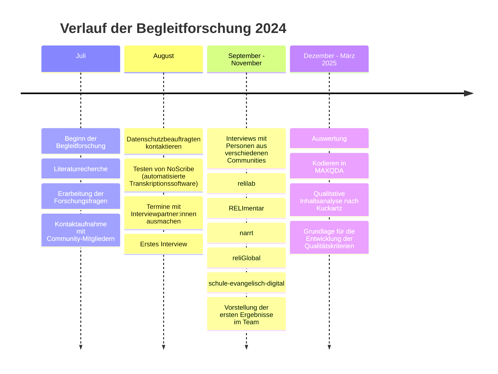
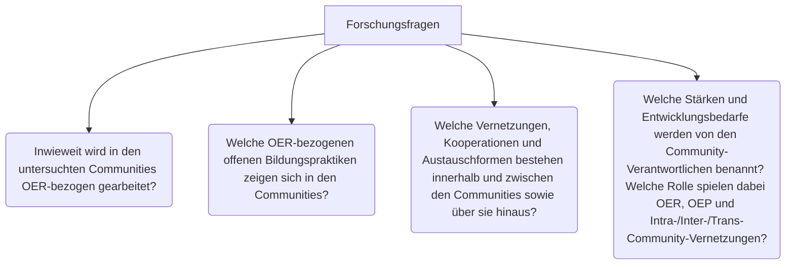
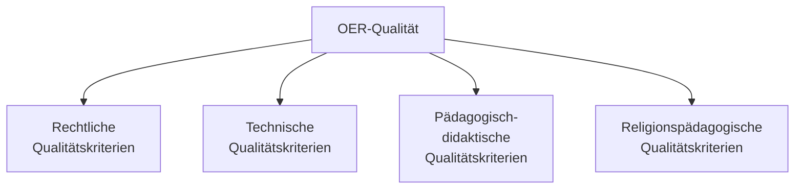
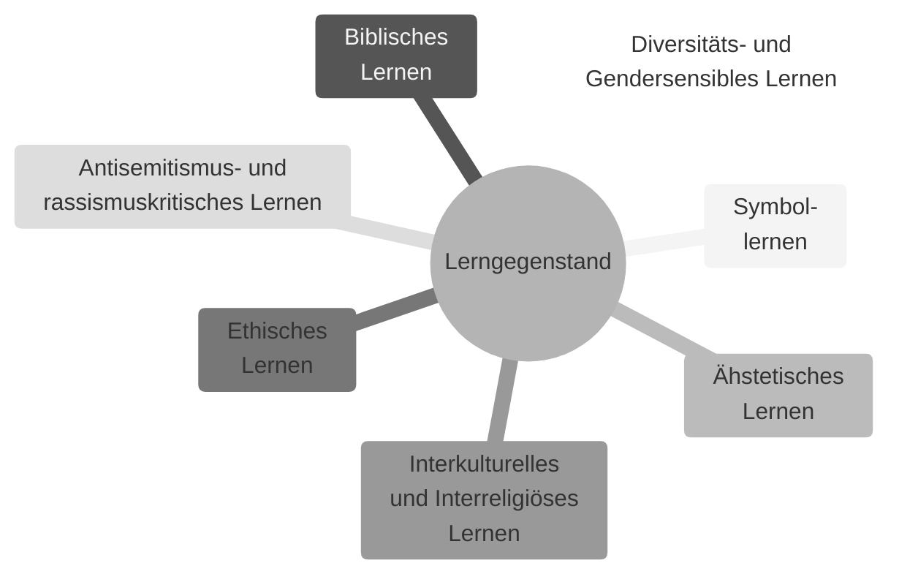

# Begleitforschung
Dieses Dokument zeigt den bisherigen Projektverlauf des FOERBICO-Projekts. Vorgestellt werden der Verlauf der Begleitforschung sowie die Zusammenfassung der wichtigsten Ergebnisse, die auf der Zwischenfazit-Tagung besprochen werden. Es ist noch nicht vollständig und befindet sich im Arbeitsprozess. 

Wir verstehen unter [OER](https://oer.community/oer-und-oep/):
> Open Educational Resources (OER) sind freie Lehr- und Lernmaterialien, die unter offenen Lizenzen veröffentlicht werden. Offene Lizenzen schaffen die Möglichkeit, dass die Lehr- und Lernmaterialien rechtssicher und kostenlos benutzt, bearbeitet und durch Dritte weiterverarbeitet werden können, ohne oder mit geringfügigen Einschränkungen. Die OER-Formate können von Texten, Videos, Präsentationen, Bildern, Podcasts und Planspielen bis hin zu kompletten Kursmaterialien und Lehrbüchern reichen. OER fördern den offenen Zugang zu Wissen und unterstützen die globale Bildungsgemeinschaft, indem sie eine flexible Nutzung und Anpassung von Inhalten ermöglichen. Ziel von OER ist es, den Zugang zu hochwertiger Bildung für alle zu fördern und den Bildungsprozess durch mehr Zusammenarbeit und Innovation zu bereichern. Material wird als OER bezeichnet wenn die 5V-Freiheiten verwahren, verwenden, verarbeiten, vermischen und verbreiten ermöglichen.

Wir verstehen unter [OEP](https://oer.community/oer-und-oep/):
> Open Educational Practices (OEP) beschreiben die dazugehörigen offenen Bildungspraktiken. OEP umfassen alle kollaborativen Methoden und Ansätze zur Erstellung, Nutzung und Weiterentwicklung von OER. Sie ermöglichen es den Nutzenden durch offene Lizenzen aktiv an den so genannten 5V-Freiheiten teilzuhaben. OEP greifen auf Technologien und soziale Netzwerke zurück, um Lernprozesse zu gestalten, in denen Lernende aktiv zusammenarbeiten, Wissen austauschen und voneinander lernen. Der Schwerpunkt liegt auf der Befähigung der Lernenden, selbst Wissen zu produzieren und ihren Bildungsweg aktiv zu gestalten. Darüber hinaus beziehen sich OEP auf pädagogische Ansätze, die auf Offenheit und Zusammenarbeit basieren. OEP fördert nicht nur die Nutzung von offenen Materialien, sondern auch die Praxis des gemeinsamen Lernens und der Kollaboration in offenen Netzwerken. Ziel ist es, Lehr- und Lernprozesse zu verbessern und Barrieren im Zugang zu Bildung abzubauen. Das Ziel von OEP ist es, die Qualität von Bildung durch eine offene, zugängliche und kollaborative Lernkultur zu verbessern und dadurch die Teilhabe und das Lernen für alle zu fördern.

## Timeline

Die Timeline zeigt den Verlauf der Begleitforschung im Jahr 2024 und Anfang 2025. [Weiteres folgt]

### Literaturbericht

Die Begleitforschung begann zunächst mit einem Kennenlernen des Forschungsfeldes zu OER und OEP durch eine Literaturrecherche. Die wichtigsten Erkenntnisse werden im Artikel (Pirker & Pirner 2025) zusammengefasst:
> Die Ergebnisse zeigen ambivalente Befunde: Sie weisen auf strategische, infrastrukturelle und kulturelle Herausforderungen hin, unterstreichen aber das perspektivische Potenzial von OER/OEP für eine partizipationsorientierte, digitale und pädagogisch wie theologisch verantwortete religionspädagogische Bildungslandschaft. (Pirker & Pirner, 2025, S. 151)

- Im religionspädagogischen Kontext ist die Nutzung von OER sowie das Anwenden von OEP nicht eingehend erforscht (Pirker & Pirner, 2025, S. 165).
    > Zur Verwendung von OER/OEP in der theologischen oder religionspädagogischen Hochschullehre gibt es ebenso wie zu religionsbezogener Bildungsarbeit in Schulen bislang keine wissenschaftlichen Studien (Pirker & Pirner, 2025, S. 167).
- Im Hochschulbereich gibt es vereinzelte Beteiligungen von OER in diversen Materialpools (Pirker & Pirner, 2025, S. 167).
- Es gibt eine religionspädagogische offene Bildungsbewegung, die aber von wissenschaftlicher sowie institutioneller Seite wenig Beachtung findet (Pirker & Pirner, 2025, S. 168).
- Die Erwartung, dass OER/OEP zu mehr Chancengleichheit führen, kann nur teilweise festgestellt werden (Pirker & Pirner, 2025, S. 168).
- Das Wechselverhältnis von OER und OEP lässt sich teilweise empirisch nachweisen (Pirker & Pirner, 2025, S. 168).
- Im deutschen religionspädagogischen Hochschulkontext ist OER im internationalen Vergleich unterrepräsentiert (Pirker & Pirner, 2025, S. 168).
- Hemmende Faktoren für die Implementierung und Qualitätsentwicklung sind: technische Unzulänglichkeiten, mangelnde Motivation und Kompetenzen, mangelnde Qualitätssicherung und -kommunikation, mangelnde institutionelle Unterstützung (Pirker & Pirner, 2025, S. 169).
    - Rechtliche Unsicherheiten werden in internationalen Studien kaum genannt.
- Unterstützende Faktoren sind Kooperation und Austausch (Pirker & Pirner, 2025, S. 169).
- Der religionspädagogische Bereich ist einerseits pionierhaft und innovativ durch das Engagement der Communities, aber wissenschaftlich wird dies kaum wahrgenommen (Pirker & Pirner, 2025, S. 169).

### Interview Studie
Um das Desiderat des Literaturreviews zu füllen, wurden im Rahmen des FOERBICO-Projekts aktive Mitglieder aus verschiedenen Communities befragt. Diese Interviews fanden alle über Zoom statt. Es handelte sich hierbei um 12 Interviews mit 13 Personen (n= 12). Wir haben solche Personen ausgewählt, die aktiv und verantwortlich in einer oder mehreren religionsbezogenen OER-Communities tätig sind, also in der Regel bereits selbst. OER-Inhalte erstellt oder bearbeitet haben, teilweise auch Fortbildungen geben und in der Netzwerkarbeit innerhalb ihrer Community engagiert sind. Da alle Interviewpartner:innen über ganz Deutschland verteilt leben und arbeiten und sie durch ihre Arbeit Erfahrung mit digitalen Tools haben, wurden die Interviews über Zoom durchgeführt und aufgezeichnet. Das Audiomaterial wurde mithilfe der KI-Transkriptionssoftware NoScribe transkribiert. Die Transkripte wurden im Nachhinein mit der Aufnahme geprüft und gegebenenfalls nachträglich verbessert. Alle Teilnehmer:innen wurden im Vorfeld über ihre Datenschutzrechte aufgeklärt und direkt vor der Aufnahme wurden diese nochmals kurz besprochen. 
Der gesamte Leitfaden ist anhand der folgenden vier Forschungsfragen entwickelt worden:

#### Leitfaden
<table>
<thead>
  <thead>
    <tr>
      <th>Fragen</th>
      <th>Zielrichtung</th>
    </tr>
  
</thead>
    <tr>
      <th>Einstieg</th>
          </tr>
  </thead>
  <tbody>
    <tr>
      <td> In welcher community halten Sie sich hauptsächlich auf? 
      - Wie würden Sie die Community beschreiben?
      - In welchen Communities halten Sie sich auf?
      - Was macht ihr konkret in eurer Community?
Was ist Ihre aktuelle Rolle in der Community und wie hat sich diese im Laufe der Zeit entwickelt?
- Was schätzen Sie an Ihrer Community? 
- Was motiviert Sie, in dieser Community mitzuarbeiten?
- Welche Ziele wollen Sie mit Ihrer Community erreichen?

*Beschreiben Sie, was Sie unter OER und OEP verstehen*
Erzählen Sie doch mal: Sind Sie schon mit OER in Kontakt gekommen; falls ja, was war Ihre erste Begegnung mit OER?
- Welche Eindrücke haben Sie dabei gewonnen?
- Wie würden Sie OER in eigenen Worten beschreiben?
- Hat sich Ihre Wahrnehmung von OER im Laufe der Zeit verändert?
- Was schätzen Sie an OER und was finden Sie schwierig an OER?
</td>
           <td> 

- Biografischer Bezug 
- Grundlegende Fragen zur Community. 
- Frage nach Schlüsselfiguren in der Community?
- Frage nach Organisation und Hierachien innerhalb der Community?
- Ggf. hier schon Frage nach Vernetzung zwischen den Communities?
- Frage nach einer Definition von Community/Was zeichnet eine Community Ihrer Meinung nach aus?
- Frage nach Verantwortung
- Frage nach Haupt- und Ehrenamt
- Frage nach Kommunikation innerhalb der Community
- Frage nach Kultur des Teilens: Was braucht es hierfür?
- Grundlegende Fragen zum persönlichen Einsatz von OER.
</td>
    </tr>
        <tr>
      <th>Leitfrage 1: Ist zustand.</th>
          </tr>
  </thead>
  <tbody>
    <tr>
      <td>Können Sie erzählen wann/ wo/ wie OER in ihrer Tätigkeit zum Einsatz kommt?
- Können Sie die Kriterien nennen, nachdem Sie Ressourcen erstellen oder vorhandene Ressourcen auswählen? 
- Unter einer OER-Perspektive, können Sie uns sagen, ob Sie eine gewisse Art von Material, beispielsweise Video oder Audio, bevorzugen und warum?
- Welche Tools sind für Sie zur Erstellung von OER am relevantesten?
- Wo und wie erfahren Sie Unterstützung bei rechtlichen Fragen im Zusammenhang mit OER?</td>
      <td>OER in der Praxis
- Gründe für OER in der Community
- Spielen die 5V Freiheiten eine Rolle
- Zu welchem Zweck OER?
- Communitystrukturierung
- Frage nach Verbesserung der rechtlichen Unterstützung
</td>
    </tr>
      <th>Leitfrage 2: Ist-Zustand OEP</th>
          </tr>
  </thead>
  <tbody>
    <tr>
      <td>Was verbinden Sie mit dem Begriff OEP?
Wie würden Sie das Verhältnis von OER zu OEP beschreiben?
- Erzählen Sie, welche Rolle offene Bildungspraktiken (OEP) in Ihrer Community spielen.
- In welchem Umfang spielen Fortbildungen innerhalb Ihrer Community eine Rolle? Wie offen sind diese?
- Welche Themenschwerpunkte werden in Fortbildungen gesetzt? Wie sind sie strukturiert?
</td>
           <td> 
Verhältnis OER-OEP
Bedeutung von OEP in der Community
</td>
 </tr>
      <th>Leitfrage 3: Vernetzung</th>
          </tr>
  </thead>
  <tbody>
    <tr>
      <td>Beschreiben Sie, wie die Mitglieder in Ihrer Community untereinander vernetzt sind.
- An welchen Kriterien machen Sie fest, dass sich ein Tool bewährt hat?
- Erzählen Sie, inwiefern Ihre Community mit anderen Communities (oder Gruppierungen, Institutionen) vernetzt sind.
- Welche Chancen und Hürden sehen Sie in der Vernetzungsarbeit?
- In welchem Maße sind sie mit Communities (oder Gruppierungen, Institutionen) außerhalb der religionsbezogenen vernetzt?
</td>
           <td> 
- Intra-Community-Vernetzung
- Inter- und Trans-Community-Vernetzung
</td>
</tr>
      <th>Leitfrage 4: Stärken und Entwicklungsbedarf (Transformative Potentiale)</th>
          </tr>
  </thead>
  <tbody>
    <tr>
      <td>Stellen Sie sich Ihre Community in 10 Jahren vor: Welche Veränderungen haben sich aufgrund von OER und OEP entwickelt?
Welche Träume haben Sie für die Zukunft Ihrer Community oder die communityübergreifende OER-/OEP-Arbeit?
Wie wünschen Sie sich eine zukunftsweisende Vernetzung zwischen den Communities? (national und international)
Mit Blick auf Ihre persönliche Arbeit und die Ihrer Community:
- Welche Chancen bieten Ihrer Meinung nach OER und OEP für die Bildungsinfrastruktur in den nächsten zehn Jahren?
- Wie könnte der Zugang zu Bildungs- und Lernmaterialien durch OER und OEP in den nächsten zehn Jahren verbessert werden, und welche Maßnahmen wären dafür aus Ihrer Sicht notwendig? 
 
Was bedarf es Ihrer Meinung nach, damit ihre Community das Potential von OER und OEP voll ausschöpfen kann?
- An welchen Stellschrauben müsste gedreht werden, um Ihrer Meinung nach, die Community zu verbessern?
- Wie gut funktionieren die Community Repositorien, Suchmaschinen u.ä., die Sie verwenden? Welche Entwicklungsbedarfe sehen Sie?
 
Welche Rolle wird aus Ihrer Sicht KI bei der Weiterentwicklung von OER und OEP sowie Ihrer Community spielen?
Welche Hoffnungen und Erwartungen verbinden Sie mit unserem Projekt (das auf die Stärkung und Vernetzung von OER-Communities zielt), sowohl für Ihre persönliche Arbeit als auch für die Entwicklung Ihrer Community? Was wünschen Sie sich an konkrete Fördermaßnahmen?
</td>
           <td> 

- Vision für die Zukunft
- Abfragen von Bedürfnissen
- Einfluss auf das Unterrichtsgeschehen
- Strukturelle Veränderun

</td>
  </tbody>
</table>

### Communities
Die verschiedenen Communities unserer Interview-Studie werden im Folgenden kurz vorgestellt. Die Texte bestehen aus Zusammenfassungen der Webseiten und einzelnen Aspekten aus den Interviews.

[rpi-virtuell](https://rpi-virtuell.de/) (2): 
Ist als religionspädagogischer Akteur seit Anfang der 2000er-Jahre in der digitalen Bildung und Fortbildung tätig. Das rpi-virtuell ist Teil der deutschen OER-Bewegung von Beginn an.
Als aktive Community hat sie sich in andere Communities disseminiert und bietet die technische Infrastruktur und Expertise für andere Communities im religionspädagogischen Bereich. 
Materialpool: Das rpi-virtuell hostet einen Materialpool, auf dem Online-Materialien für den Elementarbereich, den schulischen und den außerschulischen Bereich zu finden sind.

[relilab](https://relilab.org/) (3):
Das relilab ist eine Community, die religionsbezogene Bildung ermöglicht. Dabei ist sie heterarchisch strukturiert und lädt alle interessierten Menschen zur Teilname ein. Als Community unterstützt sie selbstgesteuertes Lernen sowie die Erstellung und Verbreitung freier Bildungsmaterialien. Ein wichtiger Baustein der Community sind die Fortbildungen, die vom relilab selbst oder von externen Anbietern über den relilab-Zoom stattfinden.

Gegründet: 2020 aus dem relichat auf Twitter, als eigenständige Community.
Fortbildungen: Das relilab bietet Mini-Online-Fortbildungen an und ist auch eine Plattform, auf der andere Fortbildungsinstitute ihre Fortbildungen bewerben; es stellt den eigenen Zoom-Raum zur Verfügung.

[RELImentar](https://relimentar.de/) (2): 
RELImentar ist eine Community, die religionsbezogene Bildung im Elementar- und Primarbereich stärkt. Auf ihrer Website steht:
> RELImentar ist das religionspädagogische Portal für alle, die mit Kindern in Krippe, Kita und Hort tätig sind.

RELImentar stellt einen qualitätsgeprüften Materialpool mit Praxismaterialien bereit. Die Materialien sind offen lizenziert und mit Metadaten wie beispielsweise Autor:innenschaft und Zielgruppe ausgewiesen.

Gegründet: Die Internetseite wurde Ende 2018/Anfang 2019 aufgesetzt. 

Cafés: Ein zentraler Baustein sind die RELImentar-Cafés. Die Cafés sind ein Raum für Fachimpulse, kollegialen Austausch und die gemeinsame Arbeit am Material. Die Teilnehmer:innen können nicht nur ausgewähltes Material für sich erschließen, sondern auch selbst Hand anlegen.

[narrt](https://narrt.de/) (1): 
> narrt vernetzt Menschen, die sich selbstreflexiv mit der Verstrickung von Religionspädagogik und Theologie in antisemitische und rassistische Verhältnisse auseinandersetzen. Wir wissen, dass dies ein ständiger Prozess ist, der auch Rückschläge kennt. Wir wollen dennoch gemeinsam nach alternativen Denkweisen, Handlungsformen und Materialien suchen, die sich der Aufgabe stellen, Antisemitismus und Rassismus in Kirche und Gesellschaft abzubauen.

Das Netzwerk narrt ist ein Kooperationsprojekt der Evangelischen Akademie zu Berlin, dem Comenius-Institut in Münster und dem Institut für Evangelische Theologie und Religionspädagogik an der Carl von Ossietzky Universität Oldenburg. Vernetzung und Aufklärung stehen im Zentrum der Arbeit von narrt. Eine Kernaufgabe ist die Begleitung von schulischen Bildungsbereichen. Personen aus dem narrt-Netzwerk erstellen OER und erarbeiten diese im Sinne von OEP in Projekten auch mit Schüler:innen.  

Gegründet: 2016
Cafés: Die Cafés sind der Ort, an dem Interessierte und Mitglieder sich über aktuelle Fragen im Bereich der antisemitismus- und rassismuskritischen Bildung austauschen. Die Cafés bieten Raum, um Fragen zu stellen, Gedanken auszutauschen, aber auch über kirchenpolitische Themen zu reden.

[reliGlobal](https://religlobal.org/) (3): 
> reliGlobal ist die gemeinsame Fachstelle der ALPIKA, in der das Team aus fünf Mitarbeitenden aus fünf Instituten seit dem 01.09.2023 das Ziel verfolgt, Globales Lernen im Religionsunterricht zu verankern. Kern der Arbeit ist die Entwicklung von innovativen Unterrichtsvorhaben und von darauf aufbauenden Fortbildungen, die trotz der Unterschiede zwischen den Bundesländern passgenau an die Standards der jeweiligen Kernlehrpläne ausgerichtet sind. Denn Lehrkräfte sollen die OER-lizenzierten Inhalte möglichst unmittelbar verwenden und in ihren Unterrichtsalltag integrieren können.

Das Projekt wird gefördert von Brot für die Welt. reliGlobal legt den Fokus auf die Erstellung und Verbreitung von OER. Diese werden modularisiert und in verschiedenen Dateiformaten veröffentlicht. 
Gegründet: 2023
Arbeitsmethode: die Scrum-Methode, in der Materialien in sechswöchigen Sprints erstellt und in einer zweiten Phase überarbeitet werden. 

[schule-evangelisch-digita](https://schule-evangelisch-digital.de/) (2):
Die Community schule-evangelisch-digital wurde gegründet, um Lehrkräfte in evangelischen Schulen deutschlandweit zu vernetzen. Das Projekt wird vom Comenius-Institut, rpi-virtuell sowie der Barbara-Schadeberg-Stiftung getragen und gefördert. Neben der Vernetzung und dem Austausch soll über diese Community Schulentwicklung vorangetrieben werden. Dabei sind die monatlichen Austauschrunden eine Möglichkeit, dass sich Lehrkräfte gegenseitig Impulse und Inspiration geben können.

[DiskursLab](https://www.eaberlin.de/themen/projekte/diskurslab/) (1): 
Das DiskursLab ist eine Laborumgebung der Evangelischen Akademie zu Berlin mit innovativen Formaten für Theologie und Religionspädagogik. Dabei handelt es sich nicht um eine klassische OER-Community. Das Interview fand trotzdem statt, da das DiskursLab beim Versuch einer Community-Gründung vor vielen Herausforderungen stand.

### Auswertungsmethode: inhaltlich-strukturierende Inahltsanalyse nach Kuckartz
Die qualitative Inhaltsanalyse ermöglicht „die systematische und methodisch kontrollierte wissenschaftliche Analyse von Texten, Bildern, Filmen und anderen Inhalten von Kommunikation“ (Kuckartz & Rädler, 2024, S. 39). Ein Vorteil der von Kuckartz entwickelten Variante der inhaltlich-strukturierenden Inhaltsanalyse ist, dass sie recht flexibel ein deduktives (z. B. an den Leitfragen orientiertes) mit einem induktiven (aus dem Interviewmaterial heraus entwickelndes) Vorgehen bei der Kategorienbildung reflektiert zu verbinden erlaubt.

#### Codes
- Deduktiven Hauptcodes: OER - Allgemein, OEP - Allgemein, Community - Allgemein, Biografischer Bezug, Chancen, Hürden
- Induktive Hauptcodes: Qualität, Recht, Konkrete Erwartungen an FOERBICO, Materialpool und Metadaten, Kultur des Teilens
- Induktive Subcodes:
    OER-Allgmein: OER-Eigenschaften, Produktion ohne OER, Produktion von OER, Tools, Anwendbarkeit, Verständnis von OER, 
    OEP-Allgemein: OEP im Tun, Verständnis von OEP, Fortbildungen, OEP als Beziehungs-geschehen, 
    Community - Allgemein: Stellung von OER innerhalb der Community, Community Aufbau, Zugehörigkeit, Struktur, Netzwerke,
    Qualität: Feedback, Qualitätssicherung
    Hürden: Didaktische und inhaltliche Hürde, Technische Vorkenntnisse, Community-Ressourcen, Bedenken im Hinblick auf Openness, OER-Label, Strukturelle Hürden, Individuelle Ressourcen, Rechtliche Hürden.
    Chacen: Remix-Chancen, Didaktische und methodische Chancen, Kollaboratives Arbeiten, Technische Möglichkeitn/Chancen, Multiperspektivischer Blick, Strukturelle Chancen, Zukunftsperspektive
- Subcode der ausdifferenziert wurde: 
    Struktur: Community Ziele, Hierarchien, Arbeitsräume, Interne Zusammenarbeit, Interne Kommunikation

Die Genaue Auflistung von der Code-Definition und den Beispielen ist hier zu finden [Link einfügen] 

### Ergebnisse 

#### FF 1: Inwieweit wird in den untersuchten Communities OER-bezogen gearbeitet?

*   **Alle Interviewpartner wissen, was OER ist und können auch verschiedene Aspekte von OER benennen:**
    1.  “Den Grundgedanken von OER den finde ich einfach genial, weil es im Prinzip der Gedanke der offene/ Klassentür ist. Also das heißt, ich kann hineingucken, was macht jemand anders, wie macht er das, kann das für mich/eventuell bestenfalls adaptieren” (Interview\_000909, Pos. 17)
    2.  “Im Prinzip haben wir mit offenen Bildungsmaterialien eine Möglichkeit, auf Steinbrüche für Materialien zuzugreifen und die immer neu zu remixen und meinen Standards anzupassen.” (Interview\_000907, Pos. 10)
    3.  “Ich teile, was ich mache. Also ich, ich, ich teile meine guten Ideen, von denen ich selber davon überzeugt bin, dass sie gut sind und wo es sich lohnt, mir auch die Mühe zu machen, das in einen Raster zu bringen, dass es anderen nützt...” (Interview\_000906, Pos. 17)
*   **Communities sind der Ort, an dem OER bzw. Material gemeinsam entstehen kann.**
*   **Community-Struktur wirkt sich auf die Zusammenarbeit aus:**
    1.  **“**Also die Nachfrage ist höher an den Fortbildungsangeboten und sozusagen so mit, wie es so heißt, mit den Füßen abstimmen, ist, glaube ich, auch die Entwicklung des relilabs stark abhängig von den Benutzerbedarfen.” (Interview\_000906, Pos. 21)
    2.  “Aber in Bezug auf die pädagogischen Fachkräfte ist es so, dass wir tatsächlich als einzige Begegnungsmöglichkeit bisher die Community-Treffen haben. In den Community-Treffen tauchen dann häufig die Personen auf, die auch in unseren präsentischen Fortbildungen sind.” (Interview\_000902, Pos. 50)
*   **Stellung von OER in der Community:**
    1.  Es liegt ein breites Spektrum vor: von "Ohne OER geht es nicht" (Interview\_000902, Pos. 12), bis hin zu, das OER eigentlich keine besondere Rolle innerhalb einer Community spiele (Interview\_000905).
    2.  In gewissen Communities ist OER ein Ziel, welches nur zum Teil oder bis jetzt gar nicht erreicht wird (Interview\_000904; Interview\_000909).
    3.  In wiederum einer anderer Community spielt der Grundgedanke von OER eine wichtige Rolle, jedoch verhindern die lizenzrechtlichen Bedingungen von kollaborativen Tools die Veröffentlichung von erstelltem Material als OER (Interview\_000906; Interview\_000801).
*   Wissen über OER ist innerhalb der Communities divergierend
*   OER hat didaktische Grenzen
*   **Thematische Schwierigkeiten**
    1.  Vertreter:innen von Communities, die sensible Themen zum Schwerpunkt haben, weißen darauf hin, dass nicht jedes Thema für OER geeignet sei, da die Missbrauch Gefahr zu hoch sei. 
    2.  Zudem müssten gewisse Materialien mit einem deutlichen Mehraufwand didaktisch und kontextuell eingebettet werden, um diese als OER zu veröffentlichen. 
    3.  Es besteht auch die Gefahr, dass inhaltlich verändertes Material, bei sensiblen Themen, somit unter der ursprünglichen Autor:innenschaft veröffentlicht wird.

#### FF 2: Welche OER-bezogenen offenen Bildungspraktiken zeigen sich in den Communities?

*   **Das** **Konzept** **OEP**
    1.  Nicht allen befragten Personen bekannt gewesen.
    2.  Das Spektrum reichte von einer klaren Definition von OEP bis hin zu einem klaren nicht-Kennen.
*   **Räume der Begegnung**
    1.  Alle Communities schaffen Räume für eine kollaborative Zusammenarbeit.
    2.  Online-Fortbildungen; Online-Werkstätten oder auch Räume für den Austausch sowie die Reflexion von Material.
    3.  Je nach Community wird OEP unterschiedlich ausgelebt.

#### FF 3: Welche Vernetzungen, Kooperationen und Austauschformen bestehen innerhalb und zwischen den Communities sowie über sie hinaus?

*   **Kommunikation innerhalb** **der Communities**
    1.  Die Kommunikationsformen und Kommunikationswege ähneln sich in den Communities. 
    2.  Zoom, Element-Matrix und E-Mail sind die gängigsten Kommunikationswege
*   **Community-Struktur**
    1.  Die Community-Struktur variiert je nach Community. 
    2.  Es gibt Communities mit einer sehr flachen Hierarchie bis hin zu einer klar hierarchisch aufgebauten Community. 
*   **Netzwerke**
    1.  Communities sind unterschiedlich stark miteinander vernetzt.
    2.  Gewisse Themen eignen sich für eine internationale Vernetzung, während andere Themen diese im Weg stehen.

#### FF 4: Welche Stärken und Entwicklungsbedarfe werden von den Community-Verantwortlichen benannt? Welche Rolle spielen dabei OER, OEP und Intra-/Inter-/Trans-Community-Vernetzungen?

*   **Stärken**
    1.  „Kultur des Teilens“ als eines der größten Mehrwerte die in Communities gelebt werden.
    2.  Praxisnahe und niedrigschwellige Angebote.
    3.  Communities bieten Raum zur Entfaltung.
    4.  Wertschätzende Haltung, welche innerhalb der Communities praktiziert wird.
    5.  Bündelung von Expertisen.
*   **Schwächen**
    1.  Finanzielle Absicherung wird als eine Schwäche von den Expert:innen gesehen. 
    2.  Volatilität der Community-Mitglieder, denn diese beteiligen sich meist Ehrenamtlich.
    3.  Rechtliches Unwissen ist in Communities weit verbreitet.
*   **Visionen**
    1.  Vision einer „Dach-Community“, welche Vernetzung stärkt, Communities unterstützt und eine Plattform bildet, auf der Räume der Begegnung ermöglicht werden.
    2.  Stärkere Etablierung von OER in der deutschen Bildungslandschaft 
    3.  Veränderung der kirchlichen Strukturen durch die Community-Arbeit.
*   **Entwicklungsbedarfe**
    1.  Es bedarf Optimierung im Community-Management. Prozesse sind nicht immer gut geregelt und führen zu Mehrarbeit.
    2.  Es fehle aktuell an Tools, die kollaboratives Arbeiten ermöglichen und zugleich eine OER-Lizensierung zulassen.
    3.  Erstellung von Qualitätskriterien und Metadatenstandards zur Orientierung 

#### Rechtliche Hürden

*   **Das Thema Recht und die damit verbundenen Hürden nahmen in jedem Interview viel Raum ein.**
    1.  OER wurden teilweise auf der Grundlage ihrer rechtlichen Merkmale definiert.
    2.  Grundsätzliche rechtliche Fragen beschäftigen die Communities.
    3.  Rechtlicher Aspekte stehen häufig einer Veröffentlichung als OER im Weg.
*   **Rechtliche Hürden**
    1.  Kommen bei Bildmaterialien und Grafiken häufig zum Tragen. 
    2.  Es besteht eine Angst, einen rechtlichen Fehler zu begehen und haftbar gemacht zu werden.
    3.  Rechtliche Klärungen sind zeit- und ressourcenaufwändig. 

Zusammengefasst zeigen die Ergebnisse aus der Interviewbefragung im Hinblick auf die vier Forschungsfragen: Hervorzuheben ist, dass Aspekte von Unwissenheit über OER, besonders in Bezug auf rechtliche Fragen, sowie die Primärstellung des Teilens über der korrekten Lizenzierung und das Fehlen von Qualitätskriterien im religionspädagogischen Bereich zur Entwicklung von Qualitätskriterien geführt haben. 

> „Und dann wäre das ja auch wieder eine Aufgabe von FOERBICO, denke ich, dass man einerseits die Didaktik sich erschließen kann, die Pädagogik und einen Praxisentwurf, der bestimmte Kriterien transparent macht, die dann ich wieder übertragen kann in mein eigenes Handling und sagen kann, so und so ist gerade der Sachstand, die und die Erfahrungen, die und die Erkenntnisse kann ich anwenden“ (Interview\_01, Pos. 79).

Zudem wurden in den Interviews wenige konkrete religionspädagogische Kriterien von den befragten Personen genannt. 

Ein weiterer wichtiger Aspekt ist, dass die gelebte Praxis von Community-Treffen sehr divergierend ist. Unter dem Code Fortbildungen lassen sich einerseits klassische Online-Fortbildungen finden, in denen entweder thematisch oder an einem Material etwas beigebracht werden soll. Dann gibt es Community-Treffen, die ein Café- oder Werkstattformat haben, in denen entweder über aktuelle Themen ausgetauscht wird oder am konkreten OER, das Personen einbringen oder aus dem Materialpool, gemeinsam gearbeitet wird. OEP ist in der theoretischen Reflexion vielen aktiven Community-Mitgliedern nicht bekannt. Sie wird in allen Communities gelebt. Um auf diese Diskrepanz aufmerksam zu machen, gibt es den Code OEP im Tun, um zu zeigen, dass OEP stattfindet, trotz der fehlenden Reflexion darüber. 

### [Qualitätskriterien](https://oer.community/qualitaet/)

Offene Bildungsmaterialien (OER) eröffnen zentrale Chancen für Lern- und Lehrsettings: Sie ermöglichen Teilhabe, fördern digitale Kompetenzen und stärken eine offene, kollaborative Bildungskultur. Auch in der Religionspädagogik wächst die Bedeutung offener Lehr- und Lernmaterialien, insbesondere vor dem Hintergrund digitaler Transformationsprozesse und KI-gestützter Erstellungsmethoden von religionsdidaktischen Materialien. Mit dieser Dynamik stellt sich immer dringlicher die Frage: Woran lässt sich gute Qualität in religionspädagogischen OER erkennen – und wie kann sie nachhaltig gesichert werden?

Während allgemeine OER-Qualitätsmodelle zentrale Standards formulieren und insgesamt eine wertvolle Orientierung bieten, berücksichtigen sie natürlich keine fachspezifischen Besonderheiten religiöser Bildungsprozesse. Hier haben wir mit dem FOERBICO-Projekt angesetzt und praxisnahe, wissenschaftlich fundierte und community-orientierte Qualitätskriterien entwickelt, die für den schulischen, hochschulischen und außerschulischen religionspädagogischen Kontext konzipiert wurden.

*Abbildung 1: Vier Dimensionen der OER-Qualität*
 

#### Die FOERBICO-Handreichung – Entstehung & Zielsetzung
Die Qualitätskriterien entstanden in einem mehrstufigen, iterativen Prozess:
- Analyse bestehender Qualitätssicherungsmodelle in OER-Communities  
  Hierbei waren wichtige Ergebnisse aus verschiedenen Interviews relevant. Beispielsweise hat RELImentar einen eigenen [Kriterienkatalog](https://relimentar.de/qualitaetskriterien-2025/). 
- Abgleich mit zentralen religionspädagogischen Forschungsdiskursen zu guter Qualität religiöser Bildung  
  Hierbei wurde auf wissenschaftliche Standardlehrwerke in der religionspädagogischen und didaktischen Ausbildung zurückgegriffen. Diese wurden zusammengefasst und für Checklisten aufbereitet (siehe [Qualitätskriterien-Checkliste](https://oer.community/qualitaetskriterien-checkliste/)). 
  Wichtig war bei der Erstellung:
    > Dabei ist zu berücksichtigen, dass es den guten Unterricht nicht gibt (vgl. Gojny; Lenhard & Zimmermann, 2022, S. 164). Mit Helmke (2017) ist vielmehr zu fragen: Gut wofür, gut für wen, gemessen an welchen Bedingungen, aus welcher Perspektive und für welchen Zeitraum? Qualität erweist sich daher als vielschichtiges und kontextabhängiges Kriterium, das je nach Bildungsziel, Lerngruppe, institutionellem Rahmen oder Zeitpunkt unterschiedlich bestimmt wird (vgl. Adam & Rothgangel, 2012) ([Mößle 2025](https://oer.community/qualitaetskriterien-checkliste/)).

Und dass wir die Qualitätskriterien als etwas erstellen, das nicht starr und unflexibel ist, sondern sich weiterentwickelt.
    > Qualitätsfragen dürfen daher nicht eindimensional beantwortet werden, sondern müssen stets im Spannungsfeld verschiedener Perspektiven reflektiert werden. So plädiert Rothgangel (2021) für einen mehrdimensionalen Qualitätsbegriff, der fachübergreifende und fachspezifische Kriterien integriert ([Mößle 2025](https://oer.community/qualitaetskriterien-checkliste/)).
- Interviews mit Expert:innen  
  Verschiedene Expert:innen aus der hochschulwissenschaftlichen Landschaft sowie der praktischen Lehrkräfteaus- und -weiterbildung wurden die Qualitätskriterien zugeschickt. Die daraus entstandenen Expert:innen-Interviews wurden als Grundlage für die nächste Überarbeitungsschleife angesetzt.
- Konkrete Qualitätsberatungen und Erprobung im Rahmen laufender Projekte, u. a. in den Projekten [TiRU – Tablets im Religionsunterricht](https://oer.community/digitale-offenheit-braucht-tiefe/) sowie [M@ps](https://oer.community/oer-beratung-und-qualit%C3%A4tskriterien/) der Professur für Religionspädagogik und Mediendidaktik der Goethe-Universität Frankfurt.  
  Kontinuierliche Überarbeitung der Qualitätskriterien in Zusammenarbeit mit den Communities. Dies ist für unser Projekt das weitere Vorgehen, damit die Qualitätskriterien als Grundlage für OER dienen könne

#### Beispiel der [Checkliste](https://git.rpi-virtuell.de/Comenius-Institut/FOERBICO_und_rpi-virtuell/_edit/main/qualitaetskriterien/handreichung-qualitaetskriterien.md):
4.3 Lerngegenstand

##### Symbollernen
- [ ] Das Material verhilft Lernenden dazu, religiöse Symbole zu erkennen und zu beschreiben.
- [ ] Das Material eröffnet den Lernenden verständlich weitere Ebenen der Tiefenstruktur von Wirklichkeit.
- [ ] Das Material macht eine individuelle Glaubensvertiefung und das religiöse Lernen mit Symbolen möglich.
- [ ] Das Material fördert die religiöse Kommunikation der Lernenden mit Hilfe von Symbolen (Texte, Musik, Bilder, Architektur, Riten etc.).

##### Biblisches Lernen
- [ ] Die Auslegung biblischer Texte im Material ist wissenschaftlich fundiert und berücksichtigt historische, literarische und theologische Kontexte.
- [ ] Das Material eröffnet den Blick für die Lebenswelt und Entstehungskontexte biblischer Texte.
- [ ] Das Material stärkt ein respektvolles Verständnis des Judentums und fördert die Sensibilität für antijüdische Deutungsmuster.
- [ ] Das Material zeigt auf, dass biblische Zeugnisse anschlussfähig an heutige Fragen sind.
- [ ] Das Material verwendet eine lizenzfreie oder OER-lizenzierte Bibelübersetzung, (z.B. die [Offene Bibel](https://https://offene-bibel.de/wiki/Willkommen_bei_der_Offenen_Bibel) oder die [diffBibel](https://http://www.diffbibel.de/). Auch eigene Übersetzungen sowie gemeinfreie Übersetzungen wie die Lutherbibel von 1912 oder die Schlachter-Bibel von 1951 sind zulässig. Weiterführende Informationen [hier](https://https://oer.community/ist-die-bibel-eigentlich-open/).)

Die Handreichung versteht Qualität nicht als starres Prüfschema, sondern als reflexiven Aushandlungsprozess. Sie soll Materialerstellende unterstützen, eigene OER qualitätsbewusst zu entwickeln, bestehende Materialien kritisch einzuschätzen und weiterzuentwickeln sowie religionspädagogische Kriterien transparent einfließen zu lassen.

### Community-Treffen
Wie bereits erwähnt, gibt es verschiedene Arten von Community-Treffen. Im weiteren Verlauf von 2025 wurden verschiedene Treffen von FOERBICO-Mitarbeiter:innen besucht und teilnehmend beobachtet. Dabei stehen die Auswertung der Treffen von relilab, RELImentar und reliGlobal im Vordergrund. Die narrt-Cafés wurden ebenfalls besucht, aber da es sich hier um teilweise sensible Inhalte handelt und diese Besuche neben den Interviews keine neuen Erkenntnisse gewinnen konnten, stützen sich die hier dargestellten Ausführungen primär auf die geführten Interviews. Das Netzwerk narrt bietet in einem vier- bis sechswöchigen Rhythmus offene Treffen in Form der sogenannten "narrt Cafés" an (vgl. Interview_000904, Pos. 29). Die narrt-Cafés werden von den Beteiligten als "offener Denkraum" (ebd.) bezeichnet, in dem über verschiedene Aspekte und aktuelle Entwicklungen zu den Themen Antisemitismus und Rassismus gesprochen wird (ebd.). 

#### relilab
Die Interviews zeigen auf, dass das relilab sich stark auf Online-Fortbildungen konzentriert (vgl. Interview_000906, Pos. 21; Interview_000801, Pos. 7; Interview_000907, Pos. 6). Diese unterscheiden sich inhaltlich und didaktisch, sind aber alle offen zugänglich und haben meist eine Dauer von 60 Minuten (Interview_000906, Pos. 39). Ziel dieser Fortbildungen ist es, aktuelles Unterrichtsmaterial kollaborativ zu erarbeiten, vorzustellen und unmittelbar zur Weiterverwendung bereitzustellen (vgl. Interview_000801, Pos. 36; Interview_000907, Pos. 34). Es muss aber dazu gesagt werden, dass das relilab seinen Zoom-Raum weiteren Online-Fortbildungsanbietern zur Verfügung stellt; deswegen lassen sich auch Fortbildungen im Terminkalender finden, die eine Anmeldung vorsehen. Diese sind explizit ausgeschrieben. Die besuchten Fortbildungen unterschieden sich thematisch sowie in ihrer Umsetzung. Von unterrichtspraktischen Fortbildungen bis hin zu Vorträgen war alles zu finden. 

#### RELImentar
RELImentar bietet auch ein Café an, das eher als "kleine Online-Werkstatt" (Interview_03, Pos. 14) verstanden werden kann. Innerhalb dieser Werkstatt wird gemeinsam mit den Teilnehmer:innen konkret an Materialien gearbeitet (vgl. ebd.). Die Cafés dauerten in der Regel 90 Minuten. In den besuchten Cafés wurde in Breakout-Sessions an konkretem Material aus dem eigenen Materialpool gearbeitet. Hierbei konnte das gemeinsame Denken und Konzeptionieren von OER als didaktisches Prinzip verstanden werden.

#### reliGlobal
Das besuchte reliGlobal-Community-Treffen war geprägt von Impulsvorträgen.

#### Erste Erkenntnisse
Online-Fortbildungen bieten viele Möglichkeiten, haben jedoch ihre Grenzen. Sie bieten durch ihren niederschwelligen Zugang sowie ihre zeitliche Kürze von 60–90 Minuten die Möglichkeit, dass Praktiker:innen teilnehmen, ohne einen Tag an der Schule bzw. der Kita aufzugeben. In diesen Formaten können Praxismaterialien durchgesprochen werden, sodass diese am Folgetag sofort angewendet werden. Dies wurde auch von einer interviewten Person als ein Anspruch für die eigenen Fortbildungen angegeben.
> Drittens, es sollte ein Output haben, den man möglichst am nächsten Tag direkt mit im Unterricht sein muss. Warum sollte ich meinen Kollegen Zeit stehlen, wenn ich die einfach zuschwalle mit irgendwas, was sie nicht brauchen und es nicht anmelden können? Und ich habe tatsächlich aus den Fortbildungen, die wir haben, habe ich auch teilweise abends dann die Rückmeldung, geil, ich habe das jetzt vorbereitet, ich kann das direkt morgen mit meinen Schülern machen. Aber wenn das nicht der Fall ist, dann weiß ich, ich habe scheiß Arbeit gemacht  (Interview_08, Pos. 36). 

Online-Fortbildungen erlauben eine überregionale Vernetzung und durch den Austausch können Synergie-Effekte entstehen. Es ist aber auch wichtig festzuhalten, dass eine tiefergehende Beschäftigung mit den Fortbildungsthemen in der jeweiligen Eigenverantwortung der Teilnehmer:innen liegt. Technische Schwierigkeiten oder Unkenntnis von Vortragenden oder auch Teilnehmer:innen können mehr Raum einnehmen als der Inhalt. Die Breakout-Sessions können sehr produktiv sein, jedoch verlangt dies Eigeninitiative der Teilnehmer:innen. [Stichwort: Berieseln] Es ist auch schwierig zu erfahren, ob und wie sich die langfristige Wirkung der Besuche auswirkt (siehe Schweitzer et al. 2025 [LINK]). 
Wichtige Erkenntnisse aus der teilnehmenden Beobachtung sowie den Interviews:

##### Rollenverteilung
Alle besuchten Fortbildungen werden von mehreren Personen gestaltet. Meist hat eine Person die Moderation übernommen und den Chat in Zoom im Auge behalten. Die Beobachtung des Chats konnte in gewissen Fällen auch eine weitere Person übernehmen. Währenddessen kümmerte sich eine Person um den Vortrag bzw. um die Impulse. Diese Rollenverteilung war je nach didaktischem Konzept starr oder fluide. Fortbildungen, die in der Form einer Online-Fortbildungen stattfanden, waren dahingehend starr. Fortbildungen, die eher auf Partizipation aufgebaut waren oder mit mehreren Redner:innen, hatten meist einen Rollenwechsel integriert. 
Die Rollenverteilung hat den Vorteil, dass, wenn eine teilnehmende Person technische Probleme hat, wie z. B. den Wechsel in den Breakout-Raum nicht schafft, sich nicht die vortragende Person darum kümmern muss. Zudem hilft eine Moderation, im Sinne einer didaktischen Rahmung, durch die verschiedenen Phasen der Fortbildung zu führen.
Es ist aber essenziell, dass die Verteilung klar besprochen ist, und es hilft, bei einem Wechsel der Rolle im Laufe einer Fortbildung dies den Teilnehmer:innen transparent zu machen. Gerade durch die Funktion des privaten Chats ist es hilfreich für Teilnehmer:innen, immer zu wissen, an wen sie sich wenden können.

##### Technische Unkenntnis
Es ist wichtig zu bedenken, dass Menschen an Online-Fortbildungen teilnehmen, die in der Regel keinen Umgang mit Zoom und anderen technischen Tools pflegen. Es bedarf in der Konzeptionierung von Einheiten Zeit für das Heranführen an Tools oder auch den Raumwechsel in Zoom. Das Erklären von "Basics" kann in gewissen Fällen bis zu fünf Minuten dauern.

##### Methodenwechsel
> Das Digitale hat die, aus meiner Sicht, eine große Versuchung, dass man nämlich so ein bisschen in das Dozieren verfällt, auch weil häufig, ich sage mal, man wenig Reaktionen merkt, ja, wenn man erzählt. (..) Oder das Gefühl hat, dass vielleicht die Leute, also ich meine, es liegt ja auch manchmal an den Teilnehmern, die dann tatsächlich auch noch andere Dinge im Hintergrund machen, sodass, das ist ja alles, das ist ja auch legitim, ja, aber dadurch hat man nicht so eine Resonanz, wie wenn ich jetzt einen Vortrag oder eine Fortbildung mache und ich kommuniziere direkt mit den Leuten. Diese Versuchung gibt es und deswegen versuchen wir in der reli-Werkstatt, die wir dienstags machen, immer eine Dreiteilung aufrechtzuerhalten. Nicht immer dann 20 Minuten, 20 Minuten, 20 Minuten, aber dass es eine Dreiteilung gibt zwischen einem Impuls, wo ich etwas reingebe, dann einer Resonanz, wo ich dann wieder was rauskriege und einer Praxisphase, die eben, bei denen wirklich die Leute auch selber gerade tätig werden, zum Beispiel in einem Tool. (interview_06, Pos. 39)

Solche im Interview avisierten Orientierungsrahmen können helfen, vor allem die Teilnehmenden aus dem Modus des Zuhörens in die Aktivität zu bringen. Dadurch kann der Gefahr des Berieselns ein wenig entgegengewirkt werden. Dabei zeigte sich in jeder Fortbildung, dass es nach aktiven Phasen von Teilnehmer:innen immer auch eine Reflexionsphase gegeben hat.
