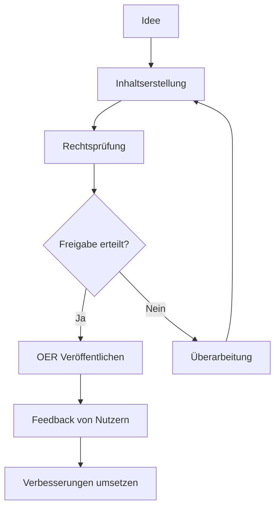
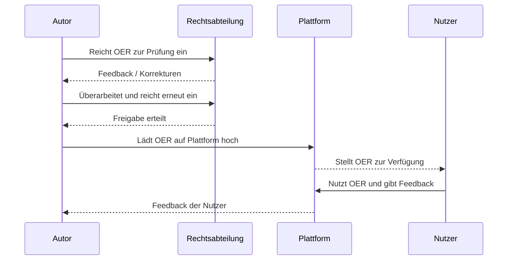
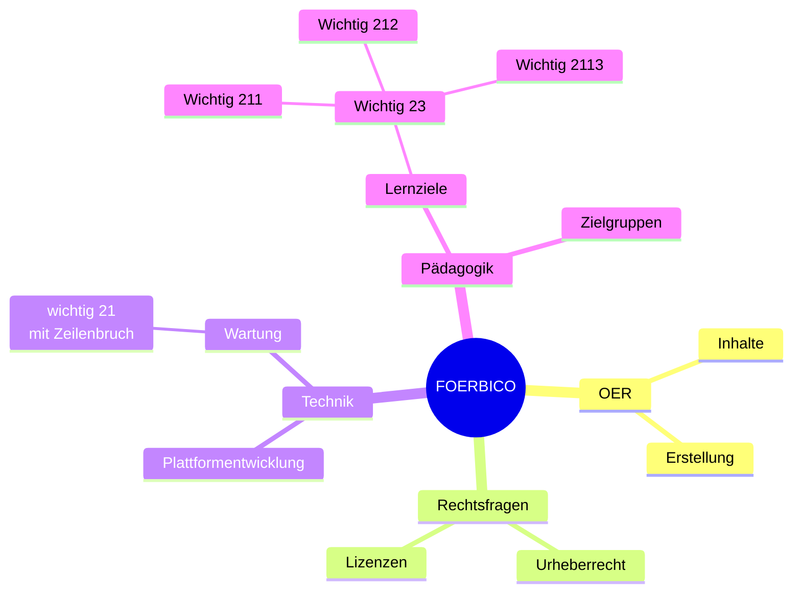
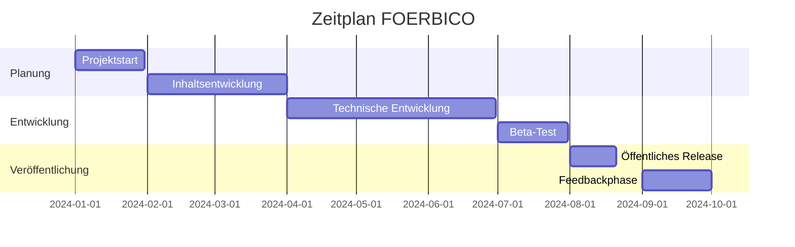

# Vorlage
Ich habe Angefangen ein Vorlagendokument zu erstellen um nicht immer nach gewissen Coodierungen googlen zu müssen. Bitte gerne ergänzen.

## Links im Dokument
Siehe [Fußnoten](#Fußnoten) für mehr Details

## Bild einbetten

## Tabelle
<table>
  <thead>
    <tr>
      <th>Spalte 1</th>
      <th>Spalte 2</th>
      <th>Spalte 3</th>
    </tr>
  </thead>
  <tbody>
    <tr>
      <td>Inhalt</td>
      <td>Inhalt</td>
      <td>Inhalt</td>
    </tr>
    <tr>
      <td>Inhalt</td>
      <td>Inhalt</td>
      <td>Inhalt</td>
    </tr>
  </tbody>
</table>

### Spaltenbündig
| Linksbündig | Zentriert | Rechtsbündig |
| :---         |     :---:      |          ---: |
| Inhalt  | Inhalt     | Inhalt    |
| Inhalt   | Inhalt      | Inhalt      |

## Textformatierung

**Fett**  
*kursiv*  
~~Durchgestrichen~~  
_**Fett und Kursiv**_
> Dies ist ein Zitat.

Ein Emoji :smile: und noch eines :rocket:.

## Checklisten
- [x] Erledigte Aufgabe
- [ ] Unerledigte Aufgabe

## Fußnoten
Ein Beispieltext mit einer Fußnote[^1].

## Mermaid-Chart

Live-Editor: https://mermaid.live/edit

### Flowchart

### Beispiel: Sequenz Diagramm

### Beispiel: Mindmap

### Gantt-Diagramm

### Beispiel Hinweisbox
| :zap:        Hinweisbox  |
|-|

[^1]: Hier ist die Fußnote.