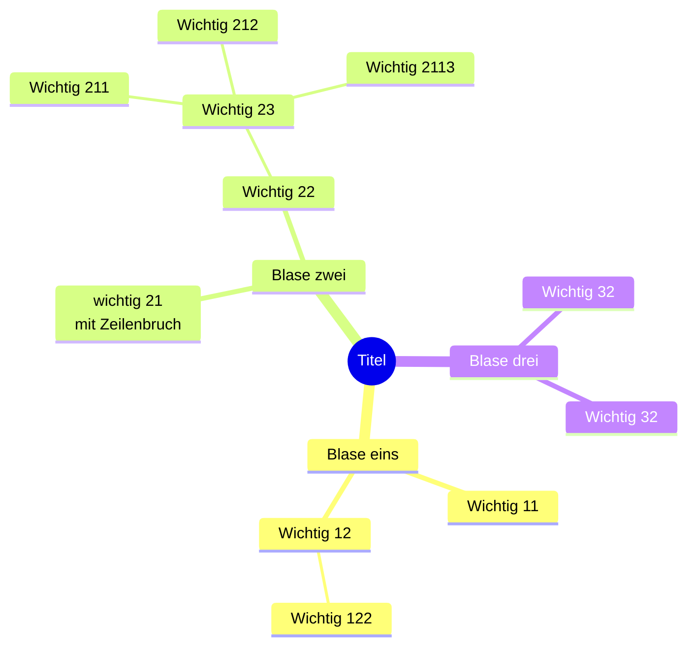

# Vorlage
Ich habe Angefangen ein Vorlagendokument zu erstellen um nicht immer nach gewissen Coodierungen googlen zu müssen. Bitte gerne ergänzen.

## Tabelle
<table>
  <thead>
    <tr>
      <th>Spalte 1</th>
      <th>Spalte 2</th>
      <th>Spalte 3</th>
    </tr>
  </thead>
  <tbody>
    <tr>
      <td>Inhalt</td>
      <td>Inhalt</td>
      <td>Inhalt</td>
    </tr>
    <tr>
      <td>Inhalt</td>
      <td>Inhalt</td>
      <td>Inhalt</td>
    </tr>
  </tbody>
</table>

### Spaltenbündig
| Linksbündig | Zentriert | Rechtsbündig |
| :---         |     :---:      |          ---: |
| Inhalt  | Inhalt     | Inhalt    |
| Inhalt   | Inhalt      | Inhalt      |

## Mermaid-Chart

Live-Editor: https://mermaid.live/edit

### Flowchart

### Beispiel: Sequenz Diagramm

### Beispiel: Mindmap
