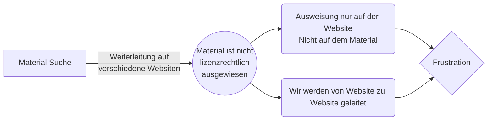
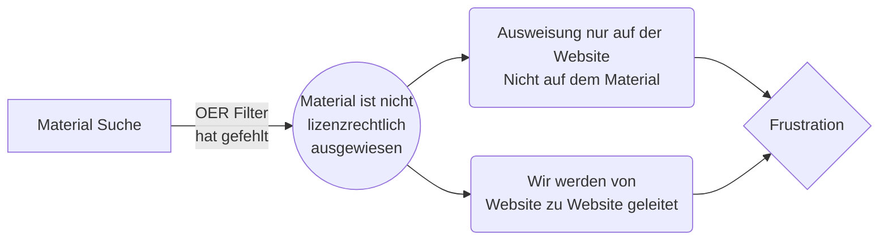
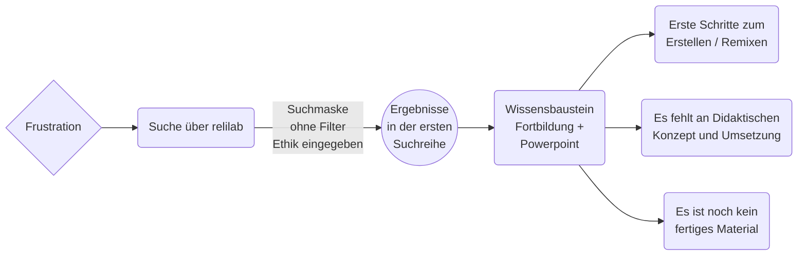
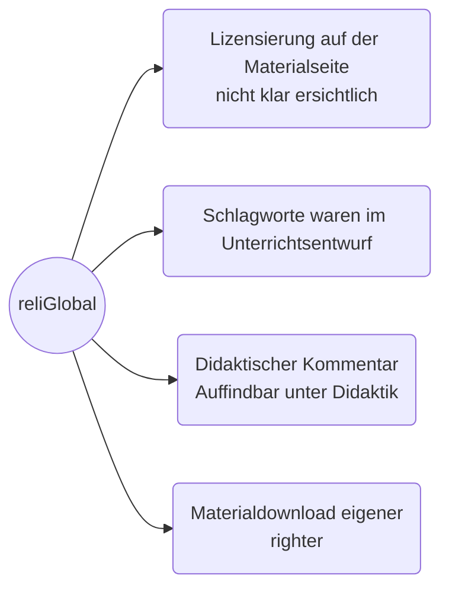
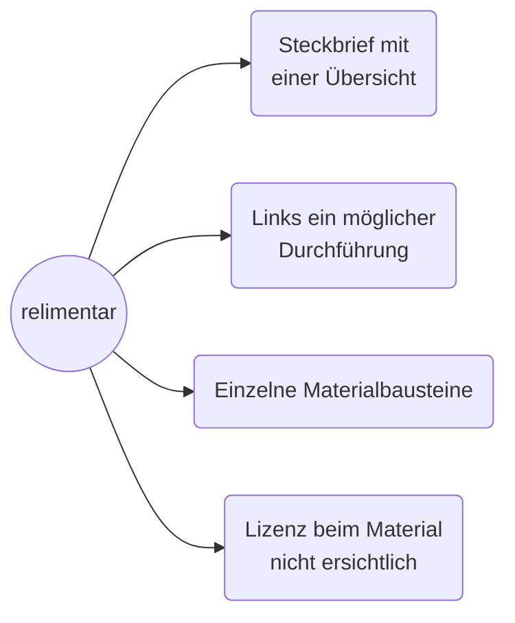
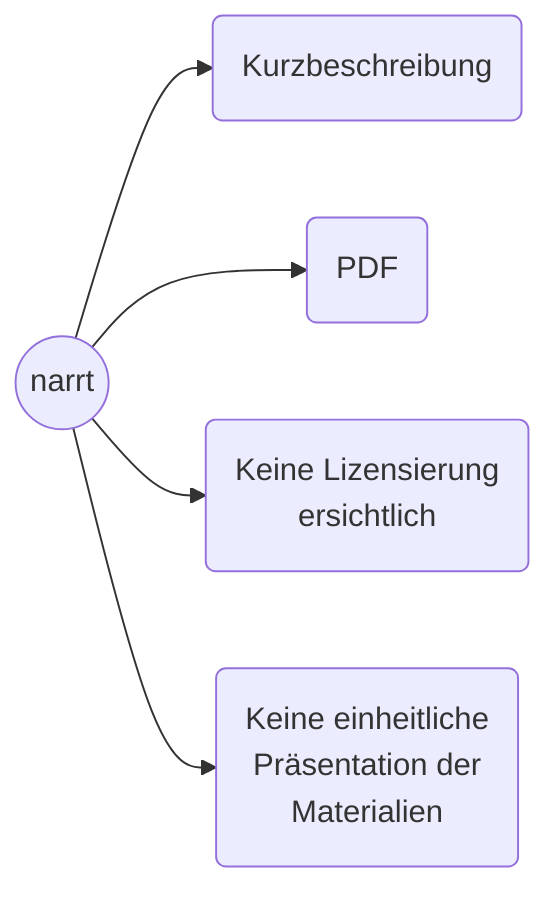

# OER Remixen

## WLO und OERSI
Das Edusharingsystem durch das verlinken von Drittanbietern, versträrkt die frustration, da nicht direkt mit der Lernressource gearbeitet werden kann, sondern ein Plattformhopping entsteht.

## RPI Materialpool
Ergebnisse können mit den **großen Playern* mithalten, die Materialreferenzsammlung führt den Suchenenden direkt zum Material, daraus ergibt sich weniger Plattform Hopping.

## OER-Communities
### reliLab
Nach der **ständigen Frustration** sind wir direkt zu einer Community gegangen, reliLab.org, und haben Ethik in die Suchmaske eingegeben und sind beim Berufsschuleintrag gelandet und sind sofort an ein Wissensbaustein gelandet.

Kleinere Datenbank und fachspezifische Ausrichtung führen zu einer schnelleren Orientierung und Findung von Material.

### Religglobal
Bei reliGlobal hat bei sich einen writer zur *Unterrichtsheinheiten* der auf eine Seite mit verschiedenen Entwürfen über die man zum Material gelangt.
Es fehlen Schlagworte auf der Übersichtsseite, nur weil wir Materialien bereits kennen, war eine Zuordung möglich. 
Jedes Material hat seine eigene Unterlizensierung.

### reliMentar
Bei reliMentar in die Suche wurde Ethik eingegeben. Die Ergebnisseite, führte sofort zu Materialvorschlägen, mit bereits ersichtlicher Lizensierung. Wir sind auf Material zwei, Was der Baum des Zachhäus erzählt. Rechts der Steckbrief bietet eine Übersicht über die Materialressource, links ist ein Einblick in die Durchführung. Materialbausteine sind einzel ansteuerbar aber die Lizensierung ist nicht auf den Materialien vorhanden.
Die Quellennachweis lässt nicht nachvollziehen auf welche Bildmaterialien sich die Lizenz bezieht. 

### narrt
In die Suchmaske Praxismaterialien eingegeben, bei Materialart. Klickt man auf ein Material, in diesem Beispiel Multiple Identitäten für die Sekundarstufe I und II.
Eine Kontaktmailadresse, eine Kurzbeschreibung und eine PDF, klickt man auf die PDF bekommt man Arbeitsblätter, kein Verlaufsplan und keine Lizenzierung.
Lizensierung ist allgemein nicht ersichtlich.

