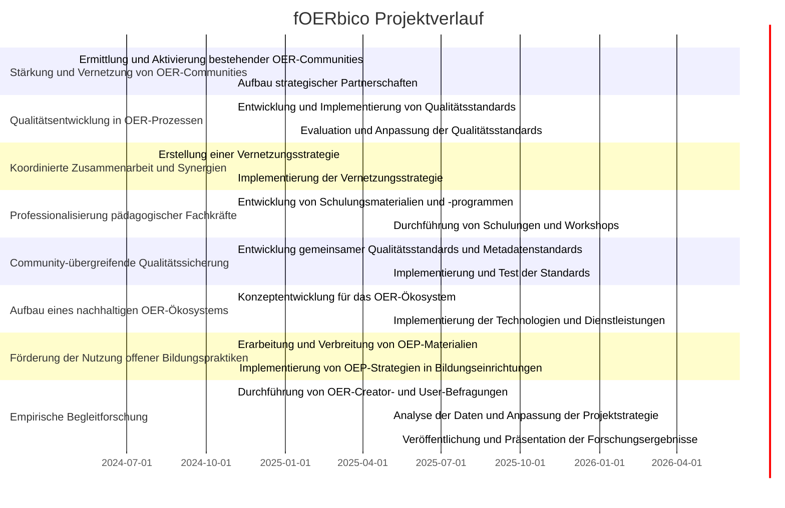
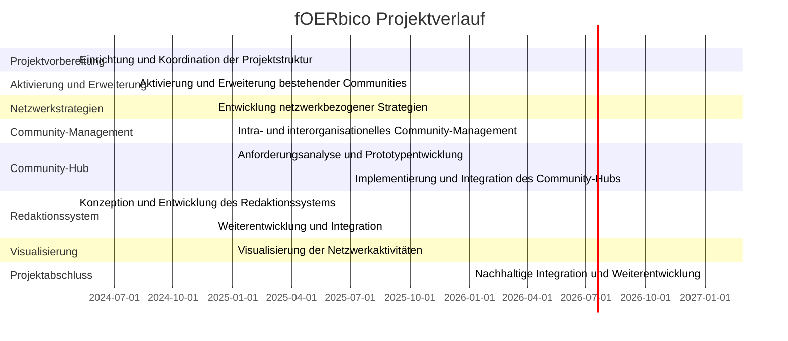

# Meilensteine

## Geamtschau

1. **Stärkung und Vernetzung von OER-Communities**
   - **M1:** Ermittlung und Aktivierung bestehender OER-Communities (Monate 1-6)
   - **M2:** Aufbau strategischer Partnerschaften (Monate 6-12)

2. **Qualitätsentwicklung in OER-Prozessen**
   - **M3:** Entwicklung und Implementierung von Qualitätsstandards (Monate 6-18)
   - **M4:** Evaluation und Anpassung der Qualitätsstandards (Monate 18-24)

3. **Koordinierte Zusammenarbeit und Synergien**
   - **M5:** Erstellung einer Vernetzungsstrategie (Monate 3-6)
   - **M6:** Implementierung der Vernetzungsstrategie (Monate 6-12)

4. **Professionalisierung pädagogischer Fachkräfte**
   - **M7:** Entwicklung von Schulungsmaterialien und -programmen (Monate 6-12)
   - **M8:** Durchführung von Schulungen und Workshops (Monate 12-24)

5. **Community-übergreifende Qualitätssicherung**
   - **M9:** Entwicklung gemeinsamer Qualitätsstandards und Metadatenstandards (Monate 6-12)
   - **M10:** Implementierung und Test der Standards (Monate 12-24)

6. **Aufbau eines nachhaltigen OER-Ökosystems**
   - **M11:** Konzeptentwicklung für das OER-Ökosystem (Monate 6-12)
   - **M12:** Implementierung der Technologien und Dienstleistungen (Monate 12-36)

7. **Förderung der Nutzung offener Bildungspraktiken**
   - **M13:** Erarbeitung und Verbreitung von OEP-Materialien (Monate 6-18)
   - **M14:** Implementierung von OEP-Strategien in Bildungseinrichtungen (Monate 18-36)

8. **Empirische Begleitforschung**
   - **M15:** Durchführung von OER-Creator- und User-Befragungen (Monate 6-12)
   - **M16:** Analyse der Daten und Anpassung der Projektstrategie (Monate 12-24)
   - **M17:** Veröffentlichung und Präsentation der Forschungsergebnisse (Monate 24-36)

## Gantt-Diagramm fOERbico Projektverlauf

## Meilensteine aus technischer Perspektive 

1. **Einrichtung und Koordination der Projektstruktur (Monate 1-2)**
    
    - **Ziel:** Aufbau der grundlegenden Infrastruktur und Koordination des Projekts.
    - **Aktivitäten:** Installation und Konfiguration der Entwicklungsumgebungen, Einführung eines Projektmanagement-Systems und Einrichtung von Kommunikationskanälen.
2. **Aktivierung und Erweiterung bestehender Communities (Monate 3-6)**
    
    - **Ziel:** Integration und Vernetzung bestehender OER-Communities.
    - **Aktivitäten:** Erste Implementierung von Schnittstellen zu rpi-virtuell und WLO, sowie Aktivierung der Community-Mitglieder zur intensiveren Nutzung der Plattform.
3. **Entwicklung netzwerkbezogener Strategien (Monate 7-8)**
    
    - **Ziel:** Erarbeitung von Konzepten für eine effektive Zusammenarbeit zwischen den OER-Communities.
    - **Aktivitäten:** Erstellung technischer Spezifikationen, strategische Planung der Netzwerkarbeit und Dokumentation der Prozesse.
4. **Intra- und interorganisationelles Community-Management (Monate 9-36)**
    
    - **Ziel:** Kontinuierliche Unterstützung und Erweiterung der Community-Aktivitäten.
    - **Aktivitäten:** Laufende technische Unterstützung, Implementierung neuer Features basierend auf Nutzerfeedback und Förderung der Zusammenarbeit zwischen den Communities.
5. **Entwicklung und Implementierung des Community-Hubs (Monate 8-36)**
    
    - **Ziel:** Aufbau eines zentralen Hubs zur Vernetzung und Visualisierung der Community-Aktivitäten.
    - **Aktivitäten:** Anforderungsanalyse, Prototypentwicklung, Integration mit bestehenden OER-Plattformen und kontinuierliche Verbesserung basierend auf Nutzerfeedback.
6. **Aufbau eines plattformunabhängigen Redaktionssystems (Monate 1-4, 7-13)**
    
    - **Ziel:** Entwicklung eines flexiblen und interoperablen Systems zur Qualitätsprüfung und Verwaltung von OER.
    - **Aktivitäten:** Ermittlung der Anforderungen, Entwicklung von Metadatenstandards und technische Umsetzung des Redaktionssystems.
7. **Visualisierung der Netzwerkaktivitäten (Monate 8-36)**
    
    - **Ziel:** Transparente Darstellung der Aktivitäten und Interaktionen innerhalb der OER-Communities.
    - **Aktivitäten:** Datensammlung, Analyse und Entwicklung von Tools zur Visualisierung im Community-Hub.
8. **Nachhaltige Integration und Weiterentwicklung (Monate 34-36)**
    
    - **Ziel:** Sicherstellung der langfristigen Nutzung und Weiterentwicklung der Projektergebnisse.
    - **Aktivitäten:** Abschließende Evaluation, Entwicklung einer Nachhaltigkeitsstrategie und Übergabe der Systeme an die dauerhaften Strukturen des Comenius-Instituts.

### Gantt Diagramm 
