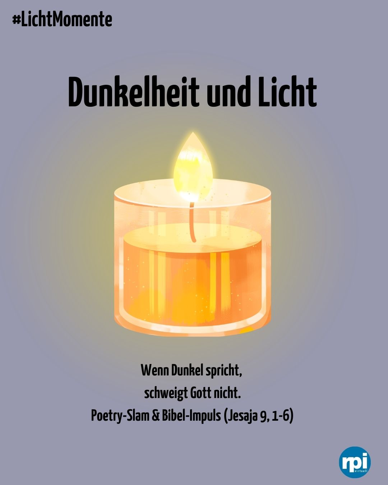
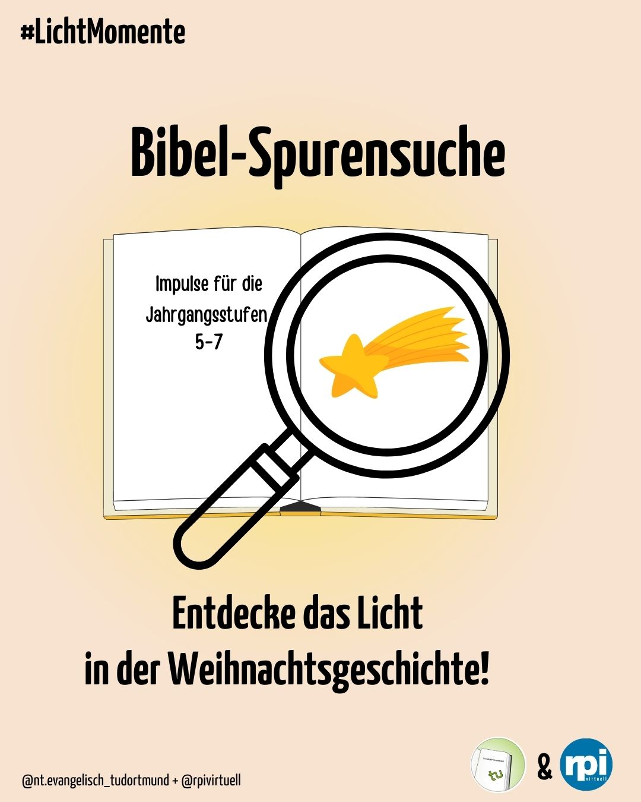
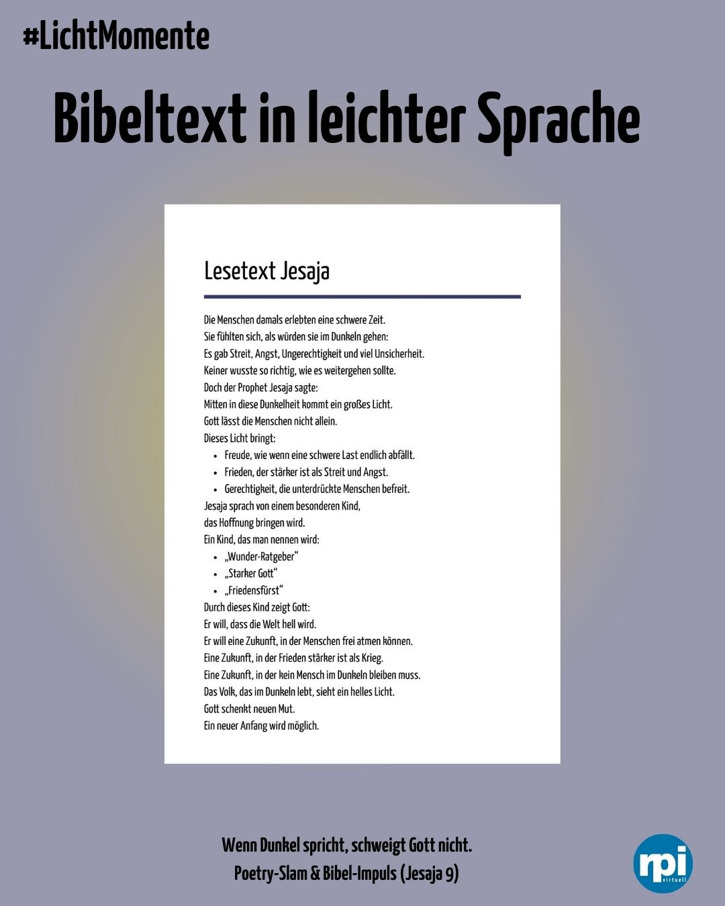
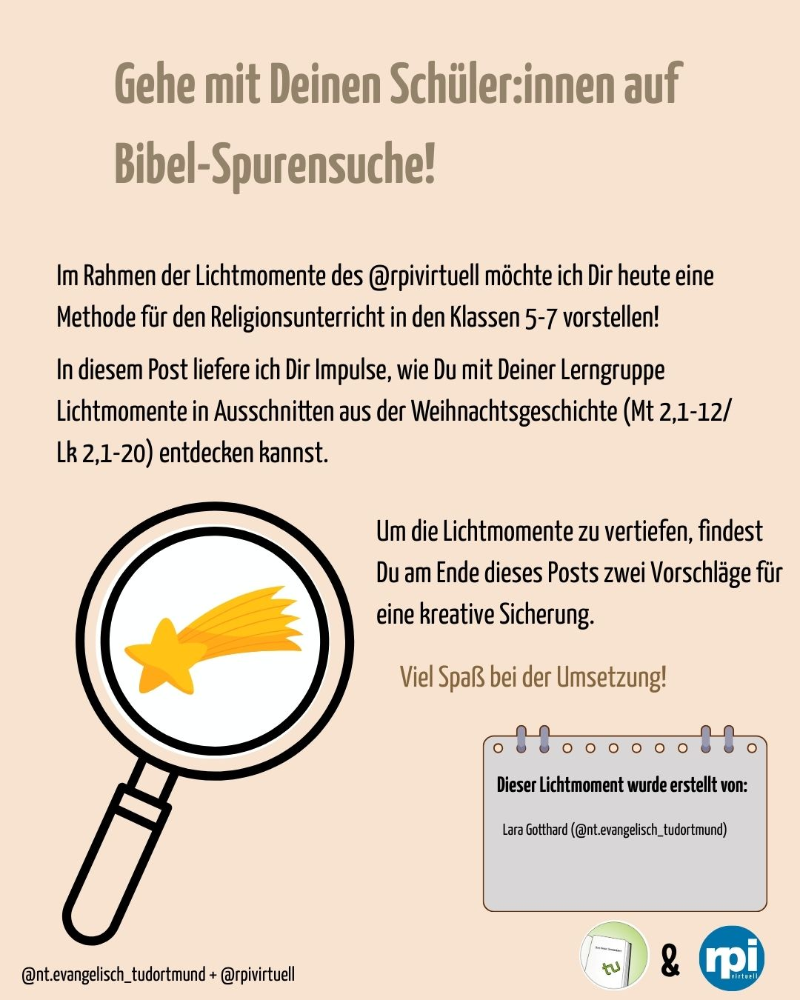
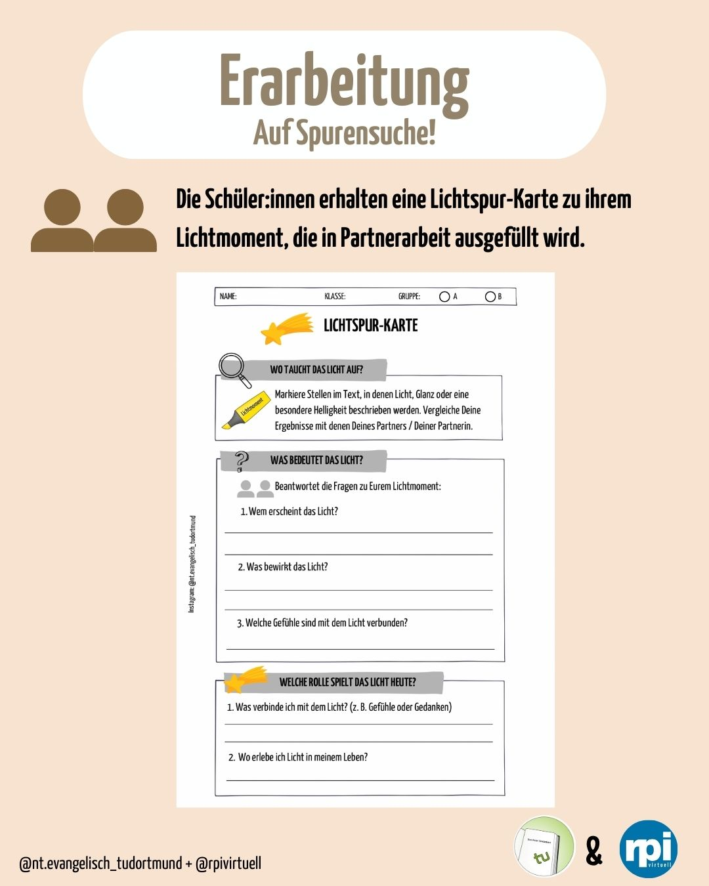

---
#commonMetadata:
'@context': https://schema.org/
'@type': LearningResource
creativeWorkStatus: Published
name: Instagram als religionspädagogischer Lernort
description: Lichtmomente im Advent- Digitale Erfahrungsräume als Schnittstelle von Religionspädagogik, Wissenschaft und Praxis gestaltet von Corinna Ullmann (Comenius-Institut) und Lara Gotthard (ETH - TU Dortmund) im Instagramformat.
license: https://creativecommons.org/licenses/by/4.0/deed.de
id: https://oer.community/lichtmomente
creator:
  - givenName: Corinna
    familyName: Ullmann
    type: Person
    affiliation:
      name: Comenius-Institut
      id: https://ror.org/025e8aw85
      type: Organization
  - givenName: Phillip
    familyName: Angelina
    type: Person
    affiliation:
      name: FAU
      id: https://ror.org/025e8aw85
      type: Organization
keywords:
  - OER
  - OEP
  - OER-Community
inLanguage:
  - de
about:
  - https://w3id.org/kim/hochschulfaechersystematik/n02
  - https://w3id.org/kim/hochschulfaechersystematik/n08
image: ima_22a17d4.jpeg 
learningResourceType:
  - https://w3id.org/kim/hcrt/web_page
educationalLevel:
  - https://w3id.org/kim/educationalLevel/level_A
datePublished: '2025-12-08'
#staticSiteGenerator
author:
  - Corinna Ullmann
  - Phillip Angelina
title: 'LichtMomente'
cover:
  relative: true
  hiddenInSingle: true
  image: ima_22a17d4.jpeg 
summary: |
  Erkenntnisse aus dem Gespräch von Corinna Ullmann (Comenius-Institut) und Lara Gotthard (ETH - TU Dortmund) über religiöse Kommunikation in digitalen Räumen.
url: instagram-als-lernort
tags:
  - Instagram
  - Open Educational Practices (OEP)
  - Religionspädagogik
---

## #LichtMomente im Advent

Digitale Erfahrungsräume als Schnittstelle von Religionspädagogik, Wissenschaft und Praxis
Im Advent suchen Menschen traditionell nach Momenten, die Wärme, Orientierung und Hoffnung vermitteln, sie suchen nach Licht. Diese Suchbewegung vollzieht sich heute jedoch nicht mehr ausschließlich in analogen Raum. Dies zeigt sich auch in der Recherche nach Unterrichtsmaterialien. Gerade im digitalen Raum greifen Lehrkräfte zunehmend auf Impulse zurück, die ihnen theologisch fundierte und zugleich praxisnahe Anregungen bieten. Plattformen wie Instagram, Blogs oder kurze audiovisuelle Formate eröffnen dabei neue Zugänge für religiöse Bildungsprozesse.
Mit der Reihe #Lichtmomente entwickeln rpi-virtuell, das NT Dortmund und religlobal drei kompakte Adventsimpulse im Instagram-Format. Die Impulse begegnen dieser Suche und bieten zudem didaktische Reduktion, ästhetische Zugänge und digitale Narration.
Somit wird *LichtMomente im Advent* zu einem exemplarischen Ort des Transfers:
zwischen wissenschaftlicher Reflexion und schulischer Praxis,
zwischen biblischer Tradition und gegenwärtigen Medienformen,
zwischen religiöser Kompetenzentwicklung und ästhetischem Lernen im digitalen Raum.

## Warum digitale Räume für Religionspädagogik wichtig sind

Religionspädagogische Ideen verbreiten sich heute nicht mehr nur analog, sondern hybrid:
Texte, Methoden und Beiträge wandern zwischen Präsenzunterricht, digitalen Sammlungen, Materialplattformen und sozialen Medien. Sie werden in der Wissenschaft und Praxis digital gespeichert, bearbeitet und geteilt.
rpi-virtuell bietet dafür seit Jahren eine verlässliche Struktur:
- offen zugängliche Materialien
- theologische Inhalte
- didaktische Unterstützungen
- Austausch und Community

Es ist ein digitaler Ort, an dem Fachwissen geteilt, weitergedacht und gemeinsam gestaltet werden kann – gerade im Advent, wenn viele Lehrkräfte schnell nach Ideen greifen, die zugleich fachlich belastbar und ästhetisch ansprechend sind.
nt.evangelisch_tudortmund zeigt: Der digitale Raum kann Lernort sein, ästhetische Werkstatt, spiritueller Impuls und Austauschfeld zugleich. 
Mehr dazu im Blogbeitrag [Instagram als Lernort](https://oer.community/instagram-als-lernort)

## Drei Posts – Drei #LichtMomente

Die Reihe umfasst drei kurze Instagram-Impulse, die jeweils ein klassisches Advent-/Weihnachtsthema aufgreifen und als kreative, offene Lernanregung gestaltet sind.
Jeder Post funktioniert als Story-Starter:
ein Element, das Funken schlägt — und das Kinder, Jugendliche oder auch Erwachsene weiterdenken, remixen, kommentieren oder im Unterricht aufgreifen können.
Die Reihe umfasst drei Impulse:
1. einen Poetry-Slam zu [Jes 9,1–6](https://www.die-bibel.de/bibel/LU12/ISA.9)

mit Canva erstellt

2. eine Bibel-Spurensuche in [Mt 2](https://www.die-bibel.de/bibel/LU12/MAT.2) und [Lk 2](https://www.die-bibel.de/bibel/LU12/LUK.2)

mit Canva erstellt

3. einen globalen Weihnachtsimpuls zu [Joh 8,12](https://www.die-bibel.de/bibel/LU12/JHN.8)

## **Lichtmoment 1**: Jesaja 9,1–6 – Wenn Dunkel spricht, schweigt Gott nicht

Der erste Impuls beginnt mit einem für die Adventszeit zentralen Text: [Jes 9,1–6](https://www.die-bibel.de/bibel/LU12/ISA.9).
Der Prophet spricht in eine Zeit politischer Unsicherheit, sozialer Spannungen und kollektiver Angst hinein. Die Menschen, an die er sich richtet, „wandeln im Finstern“.
Aus diesem Grund entfaltet seine Verheißung eine besondere Kraft:
„Das Volk, das im Finstern wandelt, sieht ein helles Licht.“

mit Canva erstellt

Diese Zusage ist kein Vertröstungsversprechen, sondern eine theologische Gegenrede zur Erfahrung von Bedrängnis. Sie markiert den Beginn einer Hoffnung, die nicht von stabilen äußeren Bedingungen ausgeht, sondern von Gottes Zuwendung.
In der religionspädagogischen Umsetzung wird der Text zum Ausgangspunkt für einen Poetry-Slam  :
er Text Jesaja 9,1ff. spricht genau in solche Situationen hinein. 
Die Adressaten des Propheten erleben politische Bedrängnis 
und gesellschaftliche Unsicherheit. 
Die Zusage eines „hellen Lichts“ steht als Gegenbild zu Angst und Finsternis. Für die Schüler:innen wird deutlich: 
Die biblische Hoffnung entsteht nicht abseits der Realität, sondern inmitten einer dunklen Situation. Sie eröffnet Perspektiven von Befreiung, Gerechtigkeit und Frieden – Themen, die für Jugendliche im Übergang zur Adoleszenz von hoher emotionaler Relevanz sind. 
Schau dir den ganzen Stundenentwurf auf Instagram an bei rpi-virtuell an 
## **Lichtmoment 2**: Bibel-Spurensuche – Dem Licht auf der Spur in [Mt 2,1-12](https://www.die-bibel.de/bibel/LU12/MAT.2) und [Lk 2,1-20](https://www.die-bibel.de/bibel/LU12/LUK.2)

mit Canva erstellt

Im zweiten Impuls begeben sich die Lernenden bewusst auf Spurensuche: Wo taucht Licht in den Weihnachtsgeschichten auf – und welche Funktion hat es dort? 
Dafür werden zwei Textausschnitte gegenübergestellt und in Einzelarbeit in zwei Gruppen (A und B) erarbeitet.
Mit der Methode der Bibel-Spurensuche markieren die Lernenden zunächst ihren jeweiligen „Lichtmoment“ im Text. 
Mt 2,9-11; LUT 2017 
Lk 2, 9; LUT 2017
Anschließend füllen sie in Partnerarbeit die LICHTSPUR-KARTE  aus:
  - Wo taucht das Licht auf?
  - Was bedeutet das Licht?
  - Welche Rolle spielt das Licht heute?

Es erfolgt ein weiterer Austausch zwischen einem Pärchen aus Gruppe A und einem Pärchen aus Gruppe B.

mit Canva erstellt

Schau dir den ganzen Stundenentwurf auf Instagram an bei nt.evangelisch_tudortmund 

## **Lichtmoment 3**:„Ich bin das Licht der Welt“ – Weihnachten global denken (Joh 8,12)

Der dritte Impuls „Ich bin das Licht der Welt.“ ([Joh 8,12](https://www.die-bibel.de/bibel/LU12/JHN.8)) soll den Lernenden verdeutlichen, Weihnachten ist kein lokales Ereignis, sondern ein globales Lichtgeschehen.
Die Lernenden betrachten eine Weltkarte analog (Kontinente im Raum auslegen) oder digital (Whiteboard) und markieren Orte, an denen heute Licht aufscheint:
    - Initiativen für Frieden
    - Orte, an denen Menschen für Gerechtigkeit eintreten
    - internationale Gemeinden, die Weihnachten unter schwierigen Bedingungen feiern
    - persönliche Bezüge (Herkunft, Reisen, Begegnungen), die „Lichtmomente“ tragen
In kurzen Stichworten benennen sie, warum dieser Ort für sie ein Lichtpunkt ist:
Mut, Zusammenhalt, Trost, Hoffnung, Würde, Schutz …

Anschließend werden diese Markierungen in ein gemeinsames Ritual überführt.

In kurzen Fürbitten oder Segenssätzen bringen die Lernenden ihre Lichtworte zur Sprache:

      „Wir denken an die Menschen in …“
      „Schenke Licht, wo Dunkelheit ist.“
      „Christus, Licht der Welt – leuchte in diese Welt.“

So entsteht ein globales Bild von Weihnachten:

    - Licht, das Menschen verbindet.
    - Licht, das Grenzen überschreitet.
    - Licht, das im Sinne Jesu allen gilt – nicht nur einem Ort, einer Kultur oder einer Zeit.

## Zwischen Tradition und medialer Kultur

Die Reihe #LichtMomente zeigt, wie digitale Medien ein theologisches Thema nicht oberflächlich verkürzen, sondern didaktisch und ästhetisch vertiefen können. Instagram wird zum Lernort, der Bilder, Worte und Symbole zusammenführt. Die Verbindung von biblischer Tradition, wissenschaftlicher Theologie, didaktischer Reduktion und digitaler Narration eröffnet neue Wege für religionspädagogische Prozesse.

Was hier sichtbar wird, ist ein exemplarischer Transferraum:
Wissenschaftliche Inhalte werden für die Praxis aufbereitet, ohne inhaltliche Tiefe einzubüßen. Lehrkräfte erhalten Impulse, die sie unmittelbar in ihren Lerngruppen einsetzen können. Und Lernende erfahren religiöse Sprache in einer Form, die ihre Lebenswelt ernst nimmt.

## Toolinfo: Audio mit Schüler:innen aufnehmen
Audioaufnahmen bieten eine kreative Möglichkeit, Unterricht lebendig zu gestalten: Podcasts, Hörspiele, Interviews oder Reflexionen lassen sich schnell produzieren und machen Lerninhalte nachhaltig erlebbar. Gleichzeitig müssen Lehrkräfte beim Umgang mit Schülerdaten die DSGVO beachten und Tools mit klaren Lizenzbedingungen einsetzen.
| Tool                                  | Plattform           | Lizenz / Kosten       | Besonderheiten                                             |
| ------------------------------------- | ------------------- | --------------------- | ---------------------------------------------------------- |
| **Audacity**                          | Windows, Mac        | Open Source (GPL)     | Offline, umfangreiche Bearbeitungsmöglichkeiten            |
| **GarageBand**                        | Mac, iOS            | Kostenlos             | Multitrack, einfache Bedienung, nur Apple-Geräte           |
| **Smartphone-Recorder / Sprachmemo**  | iOS / Android       | Kostenlos             | Schnell & unkompliziert für kurze Audioaufnahmen

Eine kleine Arbeitshilfe ist es, wenn die Aufnahmen mit einem Handy gemacht werden, um im Anschluss diese dann in **Audacity** nachträglich bearbeiten. Für eine kleine Einführung in Audicity siehe diesen [Artikel](https://www.medien-in-die-schule.de/werkzeugkaesten/werkzeugkasten-freie-software/werkzeugportraits-freie-software/freie-software-im-portrait-audacity/) und diese [Video-Reihe](https://vimeo.com/showcase/45014). 
Weitere Möglichkeiten:
| Tool             | Plattform / Geräte         | Zielgruppe / Einsatz                               | Audiofunktion                                        | Vorteile                                                         | Datenschutz / DSGVO                                                                                |
| ---------------- | -------------------------- | -------------------------------------------------- | ---------------------------------------------------- | ---------------------------------------------------------------- | -------------------------------------------------------------------------------------------------- |
| **TaskCards**    | Browserbasiert, PC, Tablet | Gruppenarbeit, Lernstationen, ältere Schüler:innen | Audio-Dateien hochladen / aufnehmen (je nach Lizenz) | Kollaborativ, interaktive Lernboards, Links/QR-Codes für Audio   | Inhalte bleiben im geschützten Raum, Zugriff kontrollierbar, DSGVO-konform bei geschützter Nutzung |
| **ChatterPix**   | iOS / Android App          | Grundschule, kreative Projekte, Storytelling       | Direktaufnahme über App, Mundbewegung animieren      | Spielerisch, motivierend, ideal für Storytelling / Fremdsprachen | Audio lokal auf Gerät gespeichert (30 Sekunden), Einwilligung erforderlich für Teilen/Veröffentlichung           |
| **Book Creator** | Browser, iOS / Android App | Alle Altersgruppen, Projektarbeit, E-Portfolios    | Direktaufnahme in Buch / Seite einfügen              | Multimedial, individuelles Portfolio, Feedback möglich           | Speicherung lokal oder schulinterne Cloud → DSGVO-konform; Veröffentlichung nur mit Einwilligung   |

## Good to know für Lehrende

**Datenschutz & DSGVO: Was Lehrkräfte wissen müssen**

- Stimmen gelten als personenbezogene Daten.
- Einwilligung der Schüler:innen bzw. Erziehungsberechtigten ist erforderlich.
- Aufnahmen dürfen nur für den angegebenen Zweck verwendet werden.
- Speicherung muss sicher und begrenzt erfolgen.
- Zugriffsrechte müssen klar geregelt sein.

**Praxis-Tipps:**
- Einwilligung einholen (schriftlich oder digital).
- Zweck und Nutzung klar kommunizieren.
- Aufbewahrungsdauer festlegen.
- Dateien sicher ablegen (z.B. schulischer Server oder DSGVO-konforme Cloud).
- Veröffentlichung regeln: Nur mit erneuter Zustimmung.

Audioaufnahmen sind ein kraftvolles Werkzeug im Unterricht, um Kreativität, Sprache und Reflexion zu fördern. Mit den richtigen Tools, klaren Regeln und Beachtung der DSGVO können Lehrkräfte Projekte sicher und datenschutzkonform durchführen.

## Ausblick

Die drei Lichtmomente laden dazu ein, sowohl biblische Texte als auch ästhetische Lernformen neu zu entdecken.
Ob in poetischen Sprachen, in visueller Spurensuche oder in liturgischen Symbolhandlungen – das Lichtmotiv des Advents erweist sich als besonders geeignet, die Frage nach Hoffnung, Orientierung und Deutungskraft religiöser Tradition in die Gegenwart zu übertragen.
Der Account [@nt.evangelisch_tudortmund](https://www.instagram.com/nt.evangelisch_tudortmund/) zeigt beispielhaft, wie Theologie digital sichtbar wird - niedrigschwellig, inspirierend, partizipativ. 

## Weiterführende Materialien

### Texte mit der Methode Poetry
**Poetry-Slam** 
https://www.cornelsen.de/_Resources/Persistent/a/b/9/2/ab928cca676fa095db8f2bcde2f8d2f283319bca/0001100000220%20KEMNMI_190717_001_9783060976739_Magazin_Poetry-Slam.pdf

### Stimmaufnahme

**Audioaufnahmen** 

https://digitale-lehre.fau.de/digital-lehren/umsetzen/lehrformate-digitalisieren/audio-aufnahme

**Audacity**

https://www.uni-hamburg.de/elearning/anleitungen/audacity.html

https://digileb.phbern.ch/medien-gestalten-und-nutzen/medien-gestalten/audio-bearbeiten

### Weitere Tools mit Audiofunktion

**Chatterpix**

https://www.medien-in-die-schule.de/tools/apps/chatterpix

**Book Creator** 

https://lehrerfortbildung-bw.de/st_digital/medienwerkstatt/fortbildungen/lern2/2_werk/3_mmtext/book_creator_anleitung.pdf

https://www.biss-sprachbildung.de/btools/erstellen-von-e-books-z-b-mit-dem-book-creator

### Weihnachten global

**Brot für die Welt Weltkarte** 

Actionbound https://www.brot-fuer-die-welt.de/material/projektbesuche-gerechtigkeit/ 

**Weltkarte Engagement global**

https://www.das-weltspiel.com/de/links-detail/weltkarte-perspektiven-wechseln/

**Weltverteilungsspiel**

https://bne-sachsen.de/app/uploads/2020/04/Weltverteilungsspiel_2020.pdf

