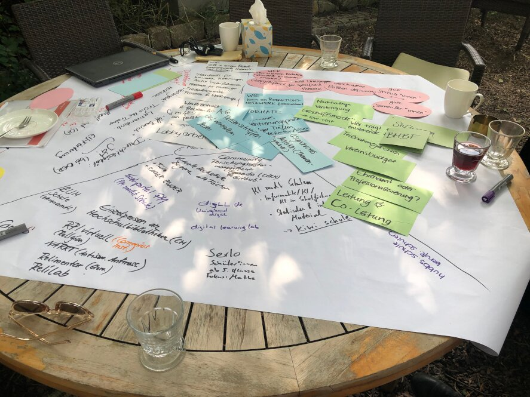
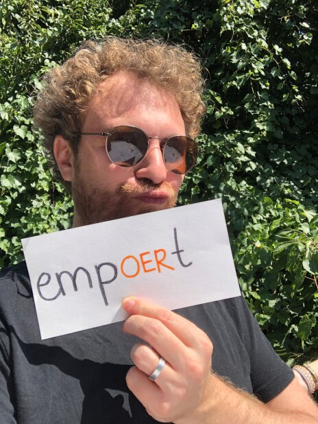

---
# commonMetadata
'@context': https://schema.org/
creativeWorkStatus: Published
type: LearningResource
name: It's Jointly 2024 Rückblick
description: Das OER-/IT-Sommercamp "it's jointly 2024" fand zum neunten Mal in Folge in Weimar statt. Hier trafen sich ExpertInnen aus Bildung und der IT um gemeinsam an Strategien, Konzepten und Formaten zu arbeiten. Dabei wurde die Konferenz in einen Hackathon sowie ein Netzwerktreffen aufgeteilt. Zwei Mitglieder des FOERBICO Teams nahmen an den jeweiligen Campteilen vom 19.08.-21.08.2024 teil.
license: https://creativecommons.org/licenses/by/4.0/deed.de
id: https://oer.community/einblicke-zum-oer-it-sommercamp-its-jointly-2024
creator:
  - givenName: Phillip
    familyName: Angelina
    type: Person
    id: https://orcid.org/0000-0002-6905-5523
    affiliation:
      name: Friedrich-Alexander-Universität Erlangen-Nürnberg
      id: https://ror.org/00f7hpc57
      type: Organization
inLanguage:
  - de
image: https://oer.community/einblicke-zum-oer-it-sommercamp-its-jointly-2024/phillip-und-ludger.jpg
datePublished: 2024-09-02

# staticSiteGenerator
author:
  - Phillip Angelina
title: It's Jointly 2024 Rückblick
cover:
  relative: true
  image: phillip-und-ludger.jpg
  hiddenInSingle: true
summary: Das OER-/IT-Sommercamp "it's jointly 2024" fand zum neunten Mal in Folge in Weimar statt. Hier trafen sich ExpertInnen aus Bildung und der IT um gemeinsam an Strategien, Konzepten und Formaten zu arbeiten. Dabei wurde die Konferenz in einen Hackathon sowie ein Netzwerktreffen aufgeteilt. Zwei Mitglieder des FOERBICO Teams nahmen an den jeweiligen Campteilen vom 19.08.-21.08.2024 teil.
url: einblicke-zum-oer-it-sommercamp-its-jointly-2024
tags:
  - FOERBICO in Kontakt
  - Event
  - OER-Strategie
  - Open Educational Resources (OER)
  - Vernetzung
  - Sommercamp
# bilder  (Konvention: bildattribution.md · Schlüssel = Dateiname oder Hash-URL)
# Lizenz nach Footer von oer.community: CC BY FOERBICO, soweit nicht anders angegeben.
bilder:
  phillip-und-ludger.jpg:
    alt: 'Foto von Phillip und Ludger vom FOERBICO-Team beim OER-/IT-Sommercamp "It´s jointly" 2024 in Weimar.'
    title: Ludger und Phillip beim It´s jointly OER-/IT-Sommercamp 2024
    sourceUrl: https://oer.community/einblicke-zum-oer-it-sommercamp-its-jointly-2024/
    author: FOERBICO
    authorUrl: https://oer.community
    licence: CC BY 4.0
    licenceUrl: https://creativecommons.org/licenses/by/4.0/
  brainstorming.jpg:
    alt: 'Ideensammlung auf Karten und Papier beim It´s jointly OER-/IT-Sommercamp 2024 in Weimar'
    title: Brainstorming beim it´s jointly OER-/IT-Sommercamp 2024 in Weimar
    sourceUrl: https://oer.community/einblicke-zum-oer-it-sommercamp-its-jointly-2024/
    author: FOERBICO
    authorUrl: https://oer.community
    licence: CC BY 4.0
    licenceUrl: https://creativecommons.org/licenses/by/4.0/
  empoert.jpg:
    alt: 'Phillip vom FOERBICO-Team hält einen Zettel in der Hand mit der Aufschrift "empOERt".'
    title: Phillip ist empOERt
    sourceUrl: https://oer.community/einblicke-zum-oer-it-sommercamp-its-jointly-2024/
    author: FOERBICO
    authorUrl: https://oer.community
    licence: CC BY 4.0
    licenceUrl: https://creativecommons.org/licenses/by/4.0/
---

Beim Campteil "Netzwerktreffen" wurden verschiedene Projekte und Ideen vorgestellt, wie mit *KI* in der Lehre umzugehen ist. Das seit Oktober 2022 neue Schlagwort KI wurde aus verschiedenen Perspektiven beleuchtet, um diese für verschiedene Bildungssektoren habhaft zu machen. *KI als ein Werkzeug* ist eine wichtige Erkenntnis aus der Tagung. 
Zusätzlich führten wichtige Themen wie Redaktionsnetzwerke, OER in der (Aus-)Bildung und Metadaten zu abendfüllenden Gesprächen.

Im Campteil "Hackathon" ging es auch um KI. Z. B. befasste sich ein Workshop damit, ob und wie sich mithilfe von Sprachmodellen aus (beschreibenden) Texten Metadaten erzeugen lassen. Diese sollen dann beim Erfassen und (Wieder-)Finden der Dokumente helfen. In einem anderen Workshop ging es um die Frage, wie sich Metadaten unabhängig von einer Plattform veröffentlichen und wiederverwenden lassen. An vielen weiteren Ideen und Konzepten wurde in den drei Tagen gehackt. Die TeilnehmerInnen suchten für verschiedenste Projekte nach neuen Antworten für aktuelle Probleme in der Digitalen Bildung.

Zum Abschluss wurden die Ergebnisse der einzelnen Workshops vor allen präsentiert. In einem internen (nicht ganz ernst gemeinten) "Wettbewerb" wurden die Beiträge prämiert. Sowohl im erstplatzierten als auch im zweitplatzierten Workshop waren wir mit dabei. Yeah! \o/

Sicherlich ein gutes Zeichen für den Start und den weiteren Projektverlauf von FOERBICO! Happy Hacking! <3
