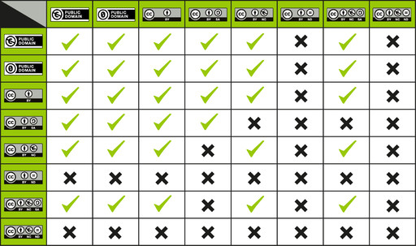

---
# commonMetadata
'@context': https://schema.org/
creativeWorkStatus: Published
type: LearningResource
name: 'OER-Materialien: Welche Lizenz nehme ich?'
description: Bei der OER-Erstellung ist die Wahl der passenden CC-Lizenz ein komplexes Unterfangen und schreckt leider viele davor ab, ihre Materialien mit freien Lizenzen zu versehen. In diesem Blogbeitrag wollen wir euch einen Überblick über die verschiedenen CC-Lizenzen geben und zeigen, wie ihr sie auch beim Remix von OER-Materialien einsetzen könnt.
license: https://creativecommons.org/publicdomain/zero/1.0/
id: https://oer.community/oer-remix
creator:
  - givenName: Corinna
    familyName: Ullmann
    type: Person
    affiliation:
      name: Comenius-Institut
      id: https://ror.org/025e8aw85
      type: Organization
  - givenName: Gina
    familyName: Buchwald-Chassée
    type: Person
    affiliation:
      name: Comenius-Institut
      id: https://ror.org/025e8aw85
      type: Organization
  - givenName: Niels
    familyName: Winkelmann
    type: Person
inLanguage:
  - de
learningResourceType:
  - https://w3id.org/kim/hcrt/text
  - https://w3id.org/kim/hcrt/web_page
educationalLevel:
  - https://w3id.org/kim/educationalLevel/level_A
# TODO: Bild "Open_Educational_Resources.png" nicht im Verzeichnis vorhanden — redaktionelle Prüfung nötig
datePublished: 2025-01-12

# staticSiteGenerator
author:
  - Corinna Ullmann
  - Gina Buchwald-Chassée
  - Niels Winkelmann
title: 'OER-Materialien: Welche Lizenz nehme ich?'
cover:
  relative: true
  image: Open_Educational_Resources.png
  hiddenInSingle: true
summary: Bei der OER-Erstellung ist die Wahl der passenden CC-Lizenz ein komplexes Unterfangen und schreckt leider viele davor ab, ihre Materialien mit freien Lizenzen zu versehen. In diesem Blogbeitrag wollen wir euch einen Überblick über die verschiedenen CC-Lizenzen geben und zeigen, wie ihr sie auch beim Remix von OER-Materialien einsetzen könnt.
url: oer-remix
tags:
  - Open Educational Resources (OER)
  - Creative Commons
  - Lizenzen
  - Rechtsfragen
---

Bei der OER-Erstellung ist die Wahl der passenden CC-Lizenz ein komplexes Unterfangen und schreckt leider viele davor ab, ihre Materialien mit freien Lizenzen zu versehen. Die Konsequenz: Andere können das Material nicht rechtssicher weiterverwenden oder verbreiten! Wenn ihr also eure Materialien mit anderen teilen wollt, geht noch den letzten Schritt und veröffentlicht das Material mit einer offenen Lizenz, damit andere wissen, wie sie das Material nutzen können (z.B. nur unter Namensnennung, für nicht-kommerzielle Zwecke usw.).

**Vorschlag:** Offene Bildungsmaterialien bieten zahlreiche Möglichkeiten, um Unterricht und Projekte, flexibel und kreativ zu gestalten. Doch eine der größten Herausforderungen beim Erstellen von OER ist die Wahl der richtigen Lizenz. Keine Sorge, wir wollen euch Schritt für Schritt die Grundlagen der Creative Commons (CC)-Lizenzen näher bringen und haben einige Tipps erarbeitet, die euch bei eurem Remix helfen können.

**Warum ist die Lizenzierung so wichtig?**

Wenn Materialien keine klare Lizenz haben, ist unklar, wie sie verwendet oder geteilt werden dürfen. Gerade die Creative Commons stellt Bildungsakteure immer wieder vor Herausforderungen. Täglich werden von Lehrkräften eine viel zahl an Lehr- und Lernmaterialien erstellt. Was wäre, wenn jeder euer Werk nutzen, bearbeiten und teilen könnte - natürlich unter euren festgelegten Bedingungen.
Ein großer Pluspunkt von OER: Materialien können weiterverwendet werden.
Deine Kollegen und Kolleginnen Inhalte legal und unkompliziert teilen, anpassen und weiterverwenden. Profitiert von gegenseitiger Inspiration und nutzt die Vorzüge:

- Zeit sparen durch Zusammenarbeit
- Rechtssicherheit: Dank klarer Lizenzen ist immer geregelt, wie Materialien genutzt werden dürfen. Gemeinsame Nutzung erleichtert den Lehrer*innenalltag ungemein.
- Gemeinschaft stärken: Jeder und jede kann etwas beitragen und vom Wissen anderer profitieren.

**Die wichtigsten Lizenzbedingungen bei [Creative Commons](https://creativecommons.org/share-your-work/cclicenses/) sind:**

**BY:** Namensnennung erforderlich.

**NC:** Nicht-kommerzielle Nutzung.

**SA:** Weitergabe unter gleichen Bedingungen.

**ND:** Keine Bearbeitungen erlaubt.

Wir können euch die Entscheidung über die Auswahl der richtigen CC-Lizenz nicht abnehmen, aber wir wollen euch bei dem Prozess unterstützen und haben [hier](https://oer.community/oer-und-oep/) eine Übersicht über die Creative Commons Lizenzen erstellt und eine Entscheidungshilfe für euch als [Handout](/oer-und-oep/handout-cc-lizenzen.pdf) zusammengestellt.

## OER-Remix: Wie kombiniere ich CC-Lizenzen? 🔀

Jetzt wird es tricky: Was passiert, wenn ich OER-Materialien von anderen mit verschiedenen CC-Lizenzen verwende und daraus ein neues Lernmaterial zusammenbastle und unter freier Lizenz veröffentlichen möchte? Welche Lizenz nehme ich dann für das neu entstandene Material?
Ihr könnt euch den [Remix von OER-Materialien](https://certificates.creativecommons.org/cccertedu/chapter/4-4-remixing-cc-licensed-work/) wie einen Smoothie vorstellen: Ihr mischt ganz viele verschiedene Früchte zu einem neuen Saft zusammen. 🍹  
Doch du kannst nicht alle Früchte miteinander kombinieren, um bei dem Smoothie-Beispiel zu bleiben: Beispielsweise sind Werke mit der Einschränkung ND (keine Bearbeitungen) generell nicht für Remixe geeignet!

**Hier eine Übersicht:**

  
Created by Kennisland published under a CC0 license, vgl. https://wiki.creativecommons.org/wiki/Wiki/cc_license_compatibility

**Hier sind Beispiele, wie du CC-Lizenzen beim Remix berücksichtigen kannst:**

*Beispiel 1: Material mit CC BY + CC BY-SA*
(Namensnennung erforderlich, Weitergabe unter gleichen Bedingungen)  
Erlaubt: Du kannst diese Materialien remixen, musst aber das Ergebnis unter CC BY-SA veröffentlichen (wegen der SA-Bedingung).

Anforderungen: Nennung aller Urheber und Angabe der ursprünglichen Lizenzen.

*Beispiel 2: Material mit CC BY-NC + CC BY-NC-SA*
(Nutzung nur für nicht-kommerzielle Zwecke, Weitergabe unter gleichen Bedingungen)  
Erlaubt: Der Remix ist nur unter CC BY-NC-SA möglich (wegen der SA-Bedingung und NC-Einschränkung).

Anforderungen: Keine kommerzielle Nutzung, Weitergabe unter denselben Bedingungen.

*Beispiel 3: Material mit CC BY-NC + CC BY*
(Nutzung für nicht-kommerzielle Zwecke)  
Nicht erlaubt: Da CC BY die kommerzielle Nutzung erlaubt, ist eine Kombination mit CC BY-NC (nicht-kommerziell) unzulässig.

**Wichtig: Dokumentiere die Quellen**

Liste dazu alle verwendeten Materialien auf und gib die ursprünglichen Lizenzen, die Urheber:innen und Links zu den Originalmaterialien an.
Erkläre, unter welcher Lizenz dein Remix veröffentlicht wird. Beachte dabei, dass die Lizenz deines Werks den Lizenzanforderungen der verwendeten Materialien entsprechen:

**BY:** Du kannst jede kompatible Lizenz wählen.

**SA:** Deine Lizenz muss dieselbe SA-Bedingung enthalten.

**NC:** Dein Werk muss ebenfalls die NC-Bedingung enthalten.

Weitere Infos, was es beim Remixen zu beachten gilt, erfährst du [hier](https://irights.info/artikel/kombinieren-bearbeiten-remixen-oer-richtig-verwenden/28560).

## Hands on: OER-Werkstatt im relilab 🛠️

Trotz der Komplexität der CC-Lizenzen möchten wir euch zur OER-Erstellung ermutigen und laden euch herzlich ein gemeinsam ins Tun zu kommen, in der OER-Werkstatt mit Corinna Ullmann (Comenius-Institut/relilab) und Niels Winkelmann (WirlernenOnline). Arbeitet mit uns an Praxismaterialien und erkundet gemeinsam mit uns Fallstricke und macht euch mit uns auf Lösungssuche. Denn OER-Entwicklung schafft Freiräume, kollaborative Zusammenarbeit und macht die Bildungslandschaft vielfältiger. Beim [Auftakttreffen am 9. Januar 2025](https://relilab.org/oer-werkstatt-backe-dein-eigenes-lernmaterial-zum-thema-glueck/) ging es beispielsweise um die Materialentwicklung zum Thema Glück, aber auch wenn ihr nicht dabei wart, könnt ihr jederzeit dazukommen und mitgestalten!

**Nächster Termin: 06. Februar 2025 von 10 bis 10.45 Uhr zum Thema Schöpfung 📅**

Weitere Infos und Themen findet ihr [hier](https://relilab.org/oerwerkstatt/) sowie im [Blogbeitrag](https://digilog.blog/2025/01/20/remix-im-dschungel-der-lizenzen/) von Niels Winkelmann.
