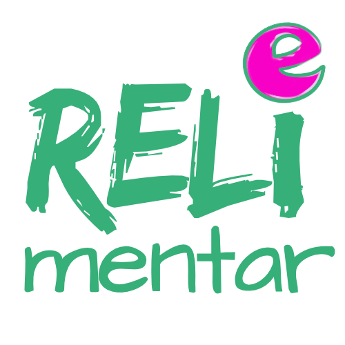
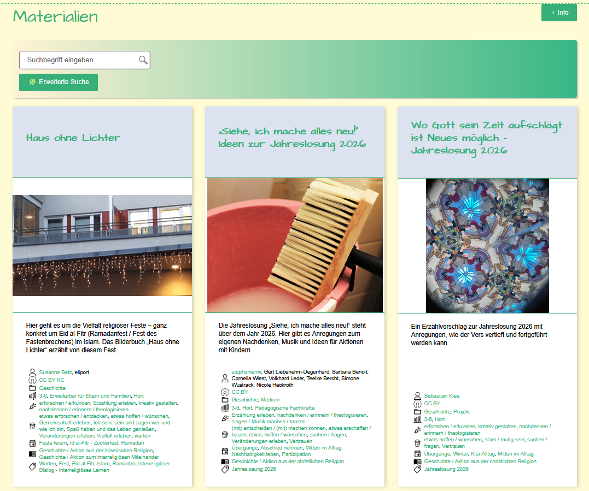

---
#commonMetadata:
'@context': https://schema.org/
'@type': Text
creativeWorkStatus: Published
name: Interview RELImentar
description: In der Vorbereitung auf die Zwischenfazit-Tagung haben wir uns vom FOERBICO-Team mit Simone Wustrack aus dem RELImentar-Team getroffen.
license: https://creativecommons.org/licenses/by/4.0/deed.de
id: https://oer.community/interview-relimentar
creator:
  - givenName: Simone
    familyName: Wustrack
    type: Person
    affiliation:
      name: Comenius-Institut
      id: https://ror.org/025e8aw85
      type: Organization
  - givenName: Phillip
    familyName: Angelina
    id: https://orcid.org/0000-0002-6905-5523
    type: Person
    affiliation:
      name: Friedrich-Alexander-Universität Erlangen-Nürnberg
      id: https://ror.org/00f7hpc57
      type: Organization
keywords:
  - OER
  - OEP
  - OER-Community
inLanguage:
  - de
about:
  - https://w3id.org/kim/hochschulfaechersystematik/n02
  - https://w3id.org/kim/hochschulfaechersystematik/n08
image: https://oer.community/interview-relimentar/RELImentarInterviewTitelpage.png
learningResourceType:
  - https://w3id.org/kim/hcrt/web_page
educationalLevel:
  - https://w3id.org/kim/educationalLevel/level_A
datePublished: '2026-01-28'
#staticSiteGenerator
author:
  - Simone Wustrack
  - Phillip Angelina
title: 'Interview RELImentar'
cover:
  relative: true
  hiddenInSingle: true
  image: RELImentarInterviewTitelpage.png
summary: |
  In der Vorbereitung auf die Zwischenfazit-Tagung haben wir uns vom FOERBICO-Team mit Simone Wustrack aus dem RELImentar-Team getroffen.
url: interview-relimentar
tags:
  - Tagung
  - OER
  - Open Educational Practices (OEP)
  - Religionspädagogik
--- 
# Interview RELImentar

## Steckbrief
[RELImentar](https://relimentar.de/) ist eine Community, die religionsbezogene Bildung im Elementar- und Primarbereich stärkt. Auf ihrer Website steht:
> RELImentar ist das religionspädagogisches Portal für alle, die mit Kindern in Krippe, Kita und Hort tätig sind.

RELImentar stellt einen qualitätsgeprüften Materialpool mit Praxismaterialien bereit. Die Materialien sind offen lizenziert und mit Metadaten wie beispielsweise Autor:innenschaft und Zielgruppe ausgewiesen. 

Ein zentraler Baustein sind die RELImentar-Cafés. Die Cafés sind ein Raum für Fachimpulse, kollegialen Austausch und die gemeinsame Arbeit am Material. Die Teilnehmenden können nicht nur ausgewähltes Material für sich erschließen, sondern auch selbst Hand anlegen. Niedrigschwellig und praxisnah wird das in den Materialien liegende Potenzial sichtbar und nutzbar gemacht, inklusive gemeinsamer Übungen zur Anpassung an die eigene Gruppe und den jeweiligen Kontext.

RELImentar wird nicht nur im Rahmen der [Zwischenfazit-Tagung](www.evrel.phil.fau.de/foerbico-tagung-2026/) am 24. und 25. Februar 2026 in Nürnberg vorgestellt, sondern stellt sich selber in diesem Interview vor. Simone Wustrack wird am zweiten Tag einen Workshop zu RELImentar geben. Zur Einstimmung auf den Workshop konnten wir mit Simone vorher sprechen.

## Interview
1. Frage: Was genau ist RELImentar?

RELImentar ist eine Plattform für alle, die mit Kindern und Familien in Kindertageseinrichtungen religiöse Bildung gestalten. RELImentar bietet Praxismaterialien als OER, online Fortbildungen und Zugänge zu regionalen Ansprechpersonen und Angeboten.

2. Frage: Was macht RELImentar für dich besonders?

RELImentar wird durch ein Fachnetzwerk ständig weiterentwickelt. Die Menschen, die das Netzwerk gestalten, kommen aus ganz Deutschland. Einige treffen sich für eine kontinuierliche Arbeit an RELImentar ein Mal in der Woche. Dadurch ist eine sehr intensive Zusammenarbeit gewachsen. Was brauchen die Fachkräfte? Welche Entwicklungen zeichnen sich im Kontext früher religiöser Bildung in Kindertageseinrichtungen ab? Wie kann RELImentar unterstützen? Diese Fragen werden miteinander bewegt und sie wirken sich auf RELImentar konkret aus. Damit können wir mit der Plattform relativ schnell auf neue Herausforderungen reagieren.

3. Frage: Das Thema Qualität ist auf eurer Website sehr präsent. Was zeichnet Qualität bei OER für dich aus?

Für mich zeichnet diese Qualität aus, dass wir sie ebenfalls kontinuierlich im Netzwerk beraten. Das Nachdenken über Qualität bleibt nicht stehen und so werden auch die Qualitätskmerkmale, mit denen Materialien auf RELImentar eingeschätzt werden, fortlaufend weiterentwickelt. Dieser Prozesscharakter ist für mich im Rahmen von RELImentar sehr besonders. Alle, die an RELImentar aktiv mitwirken, gestalten damit auch das Nachdenken über Qualität aktiv mit. Dieses gemeinsame Ringen trägt nach meiner Einschätzung zu einer Profilierung und Professionalisierung aller bei, die sich daran beteiligen.

4. Frage: Was können wir von euch auf der Zwischenfazit-Tagung erwarten?

Wir möchten konkrete Einblicke in die Arbeit mit Qualitätsmerkmalen geben, die wir auf RELImentar nutzen, um Praxismaterialien einzuschätzen. Dabei geht es zu einem Teil um die Merkmale selbst, zum anderen Teil aber um die Arbeitsweisen, in denen sie entstehen und aus denen sich Hinweise für andere OER-Communities ableiten lassen.

## Mit OER zu einer Kultur des Teilens

Unter diesem Titel steht unsere Tagung und darin sollen die Ergebnisse nicht nur diskutiert, sondern auf deren Grundlage dieser Überlegungen angestellt werden, wie die Arbeit an OER OEP fördern kann.
Wir laden herzlich dazu ein, einen Einblick in die Alltagsrealität von OER-Communities zu gewinnen und gegebenenfalls eigene Erfahrungen oder Forschungsbefunde beizusteuern:
Wie wird dort konkret zusammengearbeitet? Welche unterschiedlichen Formen von Communities existieren? Und welche Rolle spielen Institutionen wie Schulen oder Kirchen bei ihrer Entwicklung und Verstetigung?

Gemeinsam – und mit einer Haltung der Offenheit – möchten wir uns diesen Fragen nähern und das Phänomen OER-Community aus unterschiedlichen Blickwinkeln beleuchten. Wir wollen den Wünschen und Bedürfnissen der Communities Raum geben und gemeinsam überlegen, wie Hürden abgebaut werden können. Damit eine kollaborative Arbeit an OER noch stärker gefördert wird und OEP eine Grundlage für die Communities bildet.  

Anmeldemöglichkeit und das vorläufige Programm finden Sie hier: 

Für Rückfragen wenden Sie sich gerne an Phillip Angelina: tagung-foerbico2026@fau.de.