---
# commonMetadata
'@context': https://schema.org/
type: LearningResource
creativeWorkStatus: Published
id: https://oer.community/recap-foerbico-tagung-2026
name: 'Mit OER zu einer Kultur des Teilens – Zwischenfazit-Tagung vom FOERBICO-Projekt'
description: >-
  Die Bekanntheit von OER ist in den letzten Jahren gestiegen, doch Fragen zur
  Zusammenarbeit von OER-Communities, zur kollaborativen Materialentwicklung und
  zu einer gelebten Kultur des Teilens bleiben. Die FOERBICO Zwischenfazit-Tagung
  2026 in Nürnberg widmete sich diesen Themen mit Impulsen aus Forschung, Praxis
  und interaktiven Formaten.
license: https://creativecommons.org/licenses/by/4.0/deed.de
inLanguage:
  - de
creator:
  - givenName: Jörg
    familyName: Lohrer
    id: https://orcid.org/0000-0002-9282-0406
    type: Person
    affiliation:
      name: Comenius-Institut
      id: https://ror.org/025e8aw85
      type: Organization
  - givenName: Gina
    familyName: Buchwald-Chassée
    type: Person
    affiliation:
      name: Comenius-Institut
      id: https://ror.org/025e8aw85
      type: Organization
  - givenName: Laura
    familyName: Mößle
    id: https://orcid.org/0000-0001-5255-8063
    type: Person
    affiliation:
      name: Johann Wolfgang Goethe-Universität Frankfurt
      id: https://ror.org/04cvxnb49
      type: Organization
  - givenName: Phillip
    familyName: Angelina
    id: https://orcid.org/0000-0002-6905-5523
    type: Person
    affiliation:
      name: Friedrich-Alexander-Universität Erlangen-Nürnberg
      id: https://ror.org/00f7hpc57
      type: Organization
  - givenName: Manfred
    familyName: Pirner
    id: https://orcid.org/0000-0002-6641-4690
    type: Person
    affiliation:
      name: Friedrich-Alexander-Universität Erlangen-Nürnberg
      id: https://ror.org/00f7hpc57
      type: Organization
  - givenName: Viera
    familyName: Pirker
    id: https://orcid.org/0000-0002-6971-8905
    type: Person
    affiliation:
      name: Johann Wolfgang Goethe-Universität Frankfurt
      id: https://ror.org/04cvxnb49
      type: Organization
  - givenName: Ludger
    familyName: Sicking
    type: Person
    affiliation:
      name: Comenius-Institut
      id: https://ror.org/025e8aw85
      type: Organization
  - givenName: Jens
    familyName: Dechow
    id: https://orcid.org/0009-0003-1657-4631
    type: Person
    affiliation:
      name: Comenius-Institut
      id: https://ror.org/025e8aw85
      type: Organization
image: https://oer.community/recap-foerbico-tagung-2026/Team.JPG
learningResourceType:
  - https://w3id.org/kim/hcrt/text
  - https://w3id.org/kim/hcrt/web_page
educationalLevel:
  - https://w3id.org/kim/educationalLevel/level_A
about:
  - https://w3id.org/kim/hochschulfaechersystematik/n02
  - https://w3id.org/kim/hochschulfaechersystematik/n052
  - https://w3id.org/kim/hochschulfaechersystematik/n053
datePublished: '2026-03-16'
keywords:
  - FOERBICO in Kontakt
  - Event
  - Community
  - Qualitätskriterien
  - Open Educational Practices (OEP)
  - Open Educational Resources (OER)
  - Vernetzung

# staticSiteGenerator
author:
  - Jörg Lohrer
  - Gina Buchwald-Chassée
  - Laura Mößle
  - Phillip Angelina
  - Manfred Pirner
  - Viera Pirker
  - Ludger Sicking
  - Jens Dechow
title: 'Mit OER zu einer Kultur des Teilens – Zwischenfazit-Tagung vom FOERBICO-Projekt'
cover:
  relative: true
  image: Team.JPG
  hiddenInSingle: true
  alt: 'FOERBICO-Team (CC BY 4.0)'
summary: >-
  Die Bekanntheit von OER ist in den letzten Jahren gestiegen, doch Fragen zur
  Zusammenarbeit von OER-Communities, zur kollaborativen Materialentwicklung und
  zu einer gelebten Kultur des Teilens bleiben. Die FOERBICO Zwischenfazit-Tagung
  2026 in Nürnberg widmete sich diesen Themen mit Impulsen aus Forschung, Praxis
  und interaktiven Formaten.
url: recap-foerbico-tagung-2026
tags:
  - FOERBICO in Kontakt
  - Event
  - Community
  - Qualitätskriterien
  - Open Educational Practices (OEP)
  - Open Educational Resources (OER)
  - Vernetzung
---

Offene Bildungsressourcen (OER) und offene Bildungspraktiken (OEP) gewinnen mit der fortschreitenden Digitalisierung der Bildung und dem Ziel größerer Chancengleichheit zunehmend an Bedeutung. Mit seiner OER-Strategie fördert der Bund daher Projekte, die Antworten auf zentrale offene Fragen entwickeln, u.a. wie arbeiten OER-Communities zusammen? Wie entstehen Materialien wirklich kollaborativ? Und wie kann eine Kultur des Teilens gelebt werden? Diesen Fragen widmete sich die FOERBICO Zwischenfazit Tagung 2026 in Nürnberg. Mit Impulsen aus der Forschung, Stimmen aus der Praxis und interaktiven Formaten wurde die Zusammenarbeit von OER-Communities – bislang ein selten beleuchtetes Thema – in den Fokus gerückt.

👉 Das Programm und die Präsentationen findet ihr auch in einem [Tagungsboard](https://s.edufeed.org/zwischenfazit).

## Begrüßung & Vorstellung der Zwischenergebnisse aus FOERBICO

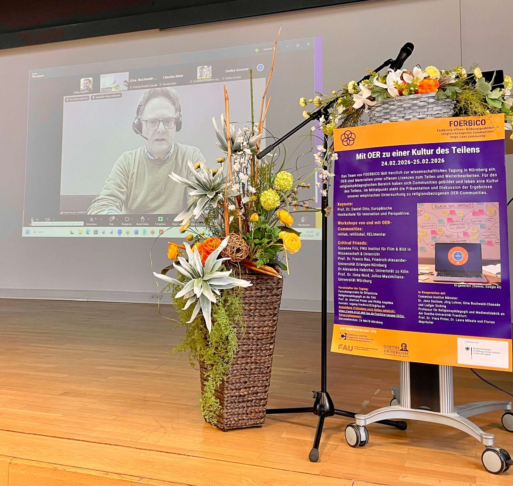

„Im OER-Kosmos ist FOERBICO gut vernetzt“ - mit diesen freundlichen Worten begrüßte uns Detlef Reuter vom Bundesministeriums für Bildung, Familie, Senioren, Frauen und Jugend ([BMBFSFJ](https://www.bmbfsfj.bund.de/)) und gab Einblicke in die [OER-Strategie](https://www.oer-strategie.de/) des Bundes. In seiner Begrüßung machte Herr Reuter deutlich, dass FOERBICO kreativ, kollaborativ und transparent arbeitet. Dies zeigt sich für ihn durch den Aufbau des innovativen Nostr-Protokolls, da hier mit der klassischen Plattformlogik gebrochen wird hin zu einer offenen, dezentralen und interoperablen Datenstruktur. Zugleich würde FOERBICO auch mit den Communities zusammenarbeiten und professionelle Lerngemeinschaften bzw. Community of Practices unterstützen und fördern. 

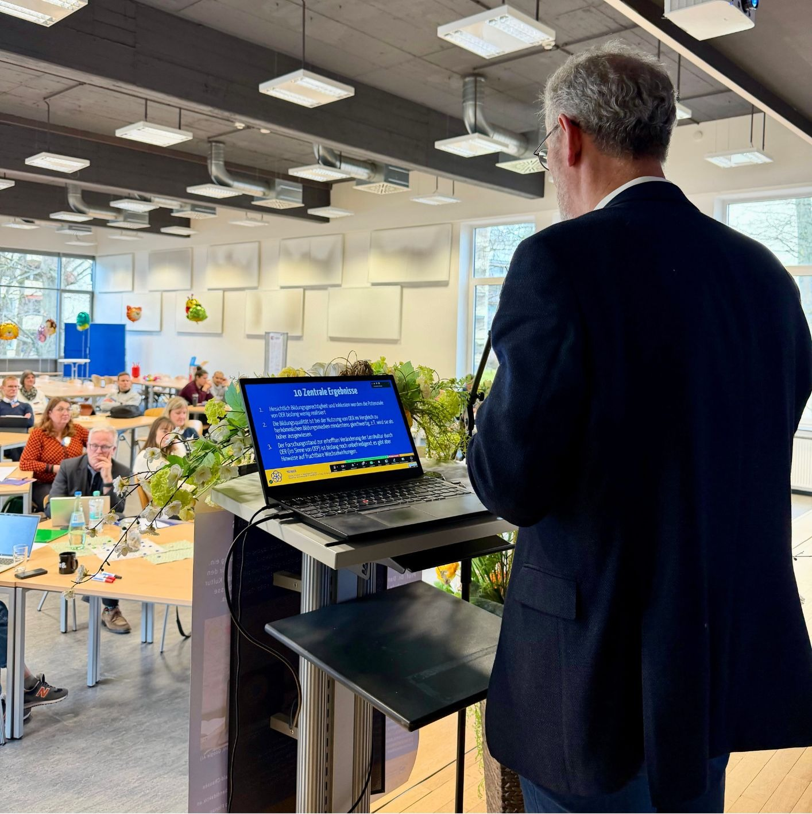

Zu Beginn führten Manfred Pirner ([Professur am Lehrstuhl für Religionspädagogik und Didaktik des Evangelischen Religionsunterrichts der FAU Erlangen-Nürnberg](https://www.evrel.phil.fau.de/)) und Viera Pirker ([Professur für für Religionspädagogik und Mediendidaktik an der Goethe-Universität Frankfurt](https://www.uni-frankfurt.de/78330411/Religionsp%C3%A4dagogik_und_Mediendidaktik)) in den Forschungsstand zu Open Educational Resources (OER) und Open Educational Practices (OEP) ein und teilten zentrale Einsichten aus ihrem Literaturbericht: [„Open Educational Resources und Open Educational Practices – ein systematischer Literaturbericht im religionspädagogischen Horizont“](https://oer.community/oer-oep-literaturbericht/). Ihr Fazit: Open Educational Resources und Open Educational Practices gewinnen in Deutschland zunehmend an Bedeutung und weisen großes Potenzial für eine partizipationsorientierte, digitale, pädagogische wie theologisch verantwortete religionspädagogische Bildungslandschaft auf. Dennoch herrscht ein Forschungsdefizit für die Nutzung von OER und die Praxis von OEP in religionspädagogischen Kontexten.  

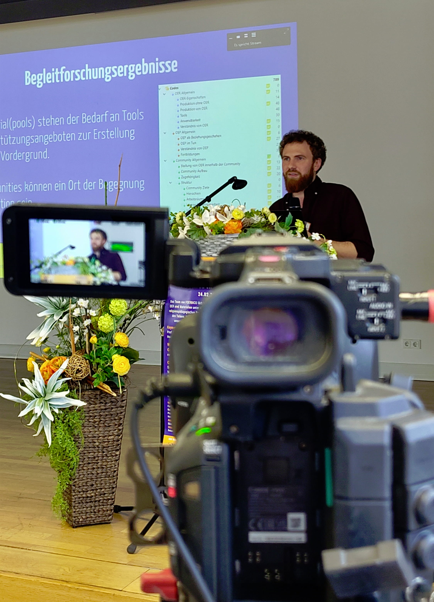

Seit August 2024 erforscht das FOERBICO-Team OER-Communities im religionsbezogenen Bildungsbereich, insbesondere ihre Strukturen, Dynamiken und Formen der Zusammenarbeit. Auf der Tagung präsentierte Phillip Angelina (wiss. Mitarbeiter an der FAU Erlangen-Nürnberg) die Ergebnisse aus Interviewbefragungen mit verschiedenen religionsbezogenen Communities. Grundlegend konstatiert er, dass Open Educational Resources bekannt sind, die Erstellung allerdings insbesondere aufgrund rechtlicher Hürden und fehlender zeitlicher Ressourcen für die Communities oft herausfordernd ist. Open Educational Practices ist als Begriff hingegen weniger geläufig, obwohl alle Communities offene Bildungspraktiken umsetzen.

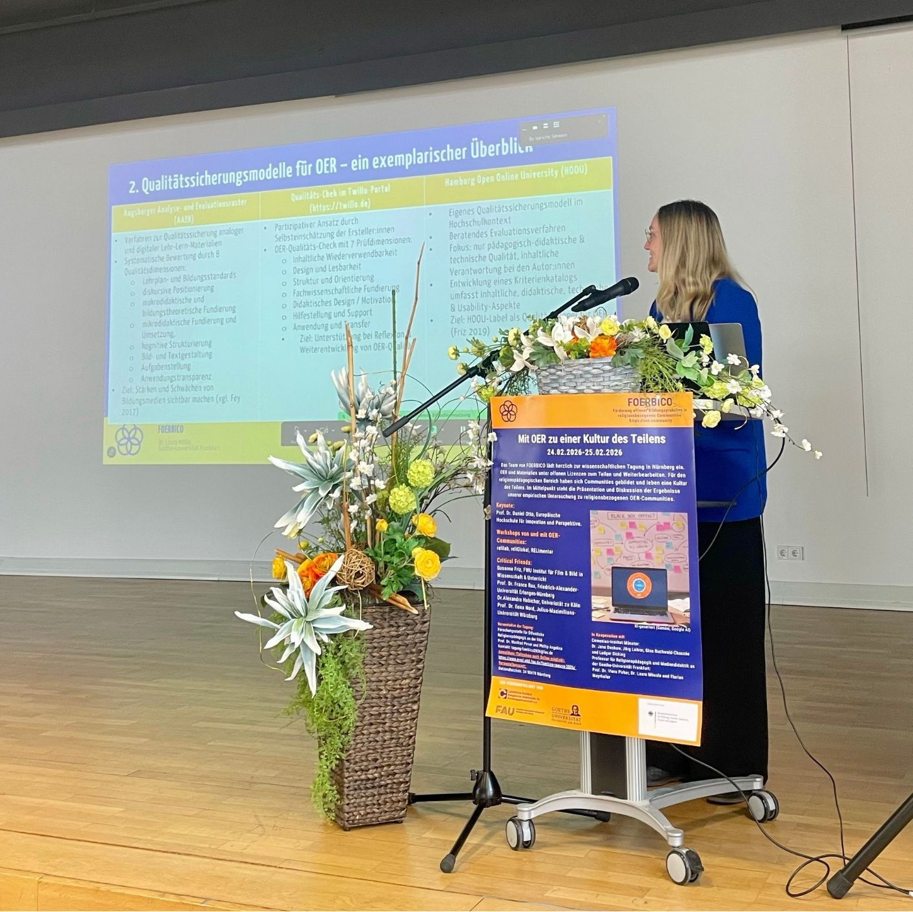

Im Anschluss daran stellte Laura Mößle (wiss. Mitarbeiterin der Goethe-Universität) die im Rahmen eines iterativen Prozesses entwickelten [Qualitätskriterien](https://oer.community/qualitaet/) insbesondere mit religionspädagogischem Schwerpunkt vor. Die Qualitätskriterien sollen Orientierung und Unterstützung bieten und zur Selbstreflexion anregen. Sie kommen bereits in Beratungsprozessen, Forschungsprojekten und in der praktischen OER-Materialerstellung bereits zum Einsatz und werden auf Basis der Rückmeldungen stetig weiterentwickelt.

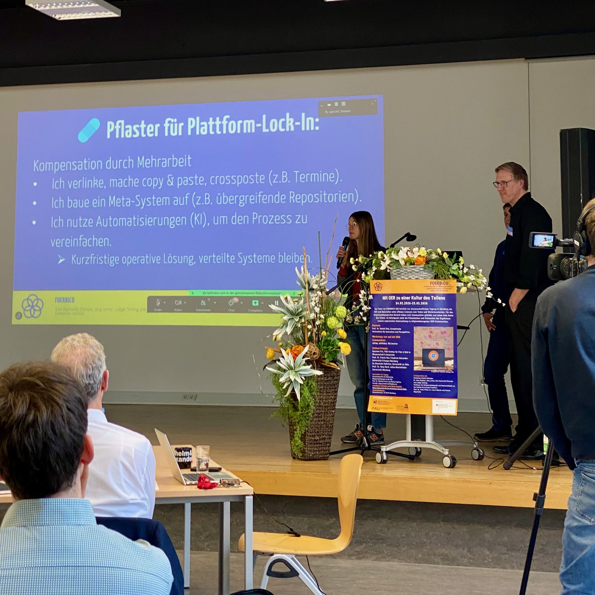

Abschließend veranschaulichte das Team des Comenius-Institutes die ersten Schritte auf dem Weg zum Community-Hub als Kommunikations- und Kollaborationsumgebung im Sinne einer Community of Communities. Dabei wurden verschiedene „Schmerzpunkte“ der Communities aufgegriffen, doch anstatt mit Behelfslösungen „Pflaster“ darauf zu kleben, soll nun mit einer dezentralen, kompatiblen und offenen Dateninfrastrukturlösung zu einem nachhaltigen OER-Ökosystem und damit zur "Heilung" beigetragen werden.

Die Begrüßung sowie die Ergebnispräsentation zum Nachschauen findet ihr im [Stream](https://www.fau.tv/series/mit-oer-zu-einer-kultur-des-teilens-w25?sortField=episode) 📹

Passend dazu gab es auch thematische Workshops zum Austauschen und Ausprobieren, die Folien sind frei verfügbar: 
- [Community Hub](https://s.edufeed.org/hub)
- [Qualitätskriterien](https://nextcloud.comenius.de/s/LHfAJBjgEgtYANC) 
- [Community of Praxis](https://nextcloud.comenius.de/s/fbMEmzkrzXeZEck)

## Keynote von Daniel Otto: Aktuelle Herausforderungen und Perspektiven für OER und OEP

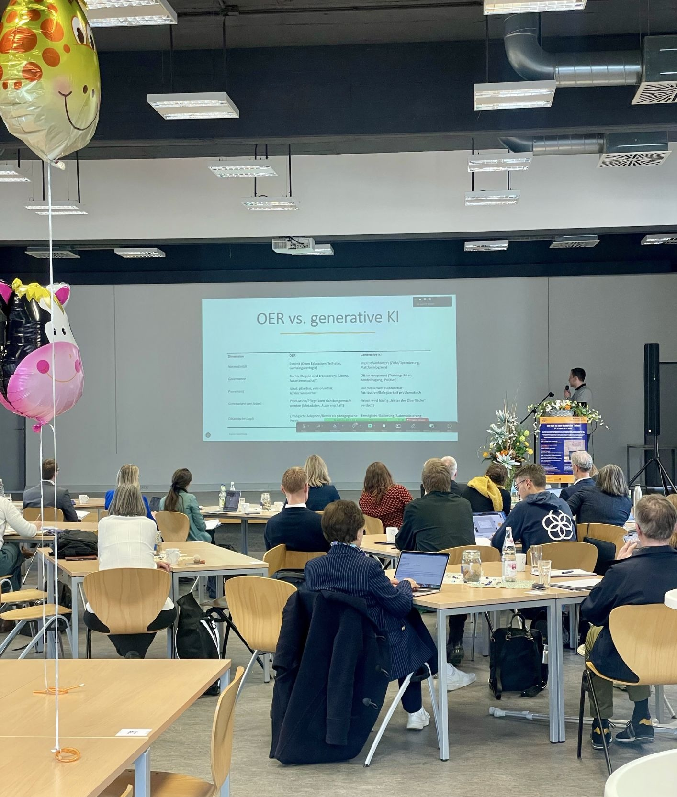

### Unterscheidung von OER und OEP
Daniel Otto begann seine Keynote mit der These, dass OEP und OER sich überlappen, aber es sich dennoch um zwei getrennte Konzepte handle. OER rein von Material her zu bestimmen greife zu kurz, denn die Subjekte und eine Praxis sind immer schon mitgedacht. Es geht um ein Arrangement aus Lizensierung, Standards und Infrastruktur, also die *Fähigkeiten* der Ressource und nicht die Ressource an sich. Dies speist sich aus der normativen Idee (vgl. [Angelina & Buchwald-Chasée 2025](https://oer.community/interview-daniel-otto/)), dass Bildung als öffentliches Gut zugänglich, anpassbar und teilbar sein sollte. Leider ist die globale Umsetzung empirisch ernüchternd. OER sind somit nicht neutral und es kann Zielkonflikte geben welche aufgrund von Offenheit und Transparent nach außen getragen werden. OEP ist dagegen definitorisch und analytisch schwer zu greifen und es fehle an theoretischer Unterfütterung (vgl. [Thompson 2023](https://doi.org/10.2139/ssrn.4595912)). Dies decke sich auch mit den Ergebnissen aus dem Literaturbericht von Pircker und Pirner ([2025](https://oer.community/oer-oep-literaturbericht/)). Daraus schließt Otto, dass OEP ein deskriptiver Begriff sei, welches die Nutzung von OER mit einschließt, aber darüber hinaus geht.

### KI als eine Herausforderung von OER und OEP
KI spielt dabei eine Herausforderung für OER, da diese von ihrer Logik her anders aufgebaut ist und funktioniert. Die normative Ideen von OER beispielsweise haben sich in einem Rechtsgerüst der CC-Lizenzen operationalisiert. OER zeichnet sich durch die transparente Angabe von Quellen und Versionierungen aus und ist dabei nachvollziehbar sowie zitierbar. Demgegenüber ist die Anwendung von generativer KI in Rechtsfragen noch unbestimmt zugleich handelt es sich hierbei um eine Blackbox in der weder der Input noch der Output für Nutzende nachvollziehbar sei. Die KI erzeuge, so Otto, eine *eschatologische Spannung* von jetzt schon und noch nicht, also ein Heilsversprechen das auf die Zukunft vertröstet. Trotz dessen wird die KI nicht verworfen, sondern Otto entwickelt durch Gurndsätze der OER-enabled Pedagogy ([Wiley & Hilton III 2018](https://doi.org/10.19173/irrodl.v19i4.3601)) einen konstruktiven Umgang. Je offener und deligierbarer Aufgaben sind, desto eher kann KI eine Unterstützung sein. 

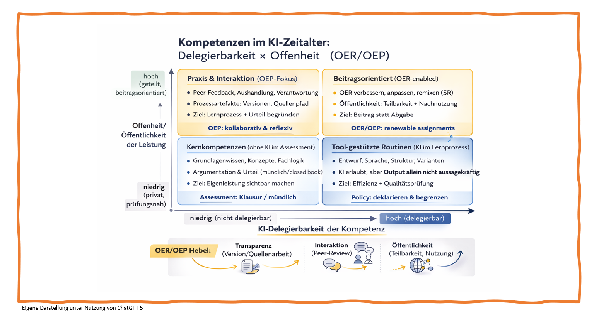

Dies führt für die Hochschullehre zu der Ermöglichung von beitragsorientierten Beteiligung, neben der klassischen prüfungsorientierten Abfrage. Der Fokus wird dabei stärker auf dem Lernprozess gelegt, als auf das Endprodukt. 

### Dark Reuse
Ein weiteres Problem im Bezug auf OER ist die institutionelle Geringschätzung für die Entwicklung von OER. Da im deutschen universitären Kontext Lehre zweitrangig ist, wird wenig als OER veröffentlicht. Material wird geteilt, aber nicht als OER veröffentlicht oder als solche Lizensiert. Hierbei spricht man von der *Dark Reuse Hypothese* ([vgl. Beaven 2018](https://openpraxis.org/articles/10.5944/openpraxis.10.4.889) und [vgl. Mößle & Angelina 2024](https://oer.community/ist-die-bibel-eigentlich-open/)), also es gibt mehr, als das was erfassbar ist. Dies deckt sich auch mit der empirischen Forschung von FOERBICO. In der deutschen Forschungslandschaft ist das erheben von Daten zu OER schwierig, da wenig OER produziert wird. Es wird innerhalb der Hochschullandschaft als *nice to have* angesehen und dementsprechend nicht gewürdigt. Dies ist beispielsweise anders in den USA indem Studierende finanziell von OER und Open Textbooks abhängig sind. 

### Motive zur Nutzung von OER und OEP
In einer Studie von Klar et. al ([2024](https://10.0.218.174/openpraxis.16.3.679)) wird empirisch aufgezeigt, dass die wichtigste Rolle für die Nutzung von OER, das Wissen über die Existenz von OER, sei. Erst wenn Menschen innerhalb der Bildungslandschaft über OER Wissen erlangen, suchen sie danach. Weitere wichtige Faktoren sind, das Wissen über die Lizenzen, die Kultur des Teilens und Kooperation. Die letzteren beiden Motive geben einen Aufschluss darüber, dass OER über die Ressource hinaus geht und für ihre Etablierung innerhalb von Hochschule sowie der Schule bedarf es eine institutionelle Anerkennung für die Erstellung und Anwendung von OER (vgl. [Otto 2022](https://doi.org/10.3217/zfhe-17-02/12)).

Die Keynote zum Nachschauen findet ihr im [Stream](https://www.fau.tv/series/mit-oer-zu-einer-kultur-des-teilens-w25/1-aktuelle-herausforderungen-und-perspektiven-fur-oer-und-oep-w25) 📹

## Community-Workshops mit relilab, reliGlobal & RELImentar

In verschiedenen Community-Workshops konnten die Teilnehmenden die Communities kennenlernen und sich gemeinsam über Community-Arbeit austauschen sowie Herausforderungen und Möglichkeiten - insbesondere mit Fokus auf OER und OEP - diskutieren.

### relilab - Gemeinsam religionsbezogene Bildung ermöglichen

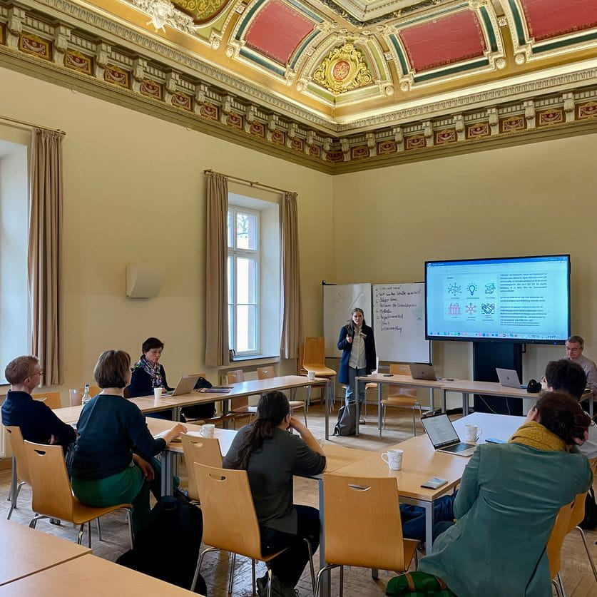

[relilab](https://relilab.org/) ist kein klassisches Projekt, mit festen Laufzeiten. Es ist eine Community mit einer heterarchischen Netzwerkstruktur und besteht aus Einzelpersonen, Teams und Institutionen, die sich flexibel einbringen können - je nach Talenten und Interessen. relilab verbindet Akteur:innen über Konfessionen, Institutionen und Ländergrenzen hinweg, schafft Austauschräume und regt Kooperation an - offen für Lehrkräfte, Fortbildende, Studierende, Forschende und Praktizierende. Corinna Ullmann (Mitarbeiterin vom Comenius-Institut) und Olav Richter (Studienleiter Medienpädagogik der Ev. Landeskirche in Baden) diskutierten gemeinsam mit den Teilnehmenden, wie Communityarbeit in einem fluiden Netzwerk gelingen kann und wie man Communities mit offenen Fortbildungsangeboten stärken kann.

Weitere Informationen zu relilab findet ihr in unserem [Interview](https://oer.community/interview-relilab/) mit Corinna Ullmann.

👉 Die relilab-Folien findet ihr [hier](https://nextcloud.comenius.de/s/gBde64YdXRgSDG9).
    
### reliGlobal - Fachstelle für Globales Lernen im Religionsunterricht

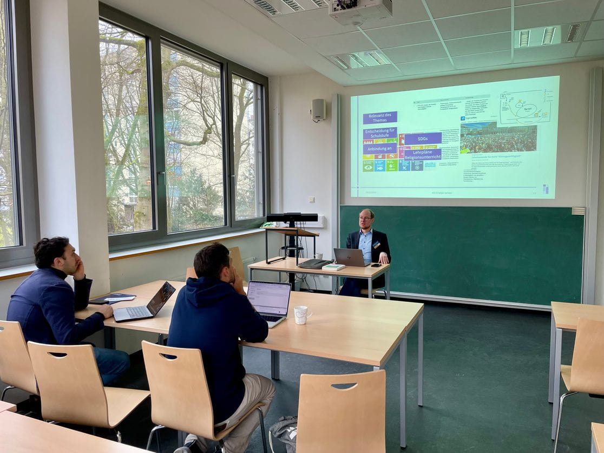

[reliGlobal](https://religlobal.org/) ist eine gemeinsame Fachstelle der ALPIKA (Arbeitsgemeinschaft der Leiterinnen und Leiter der Pädagogischen Institute und Katechetischen Ämter) mit dem Ziel, Globales Lernen nachhaltig im evangelischen Religionsunterricht zu verankern. Das Projekt wird seit September 2023 vom Comenius-Institut und weiteren pädagogisch-theologischen Instituten getragen und von Brot für die Welt gefördert. Jens Palkowitsch-Kühl brachte den Teilnehmenden insbesondere die Arbeitsweise in Sprint-Teams und den didaktischen Dreischritt bestehend aus Erkennen, Begreifen und Handeln näher.

Weitere Informationen zu reliGlobal findet ihr in unserem [Interview](https://oer.community/interview-reliGlobal/) mit Frank Behr.

👉 Die reliGlobal-Folien findet ihr [hier](https://nextcloud.comenius.de/s/4w75Qd7dfYLeNcf).
    
### RELImentar - religionspädagogisches Portal für den Elementarbereich

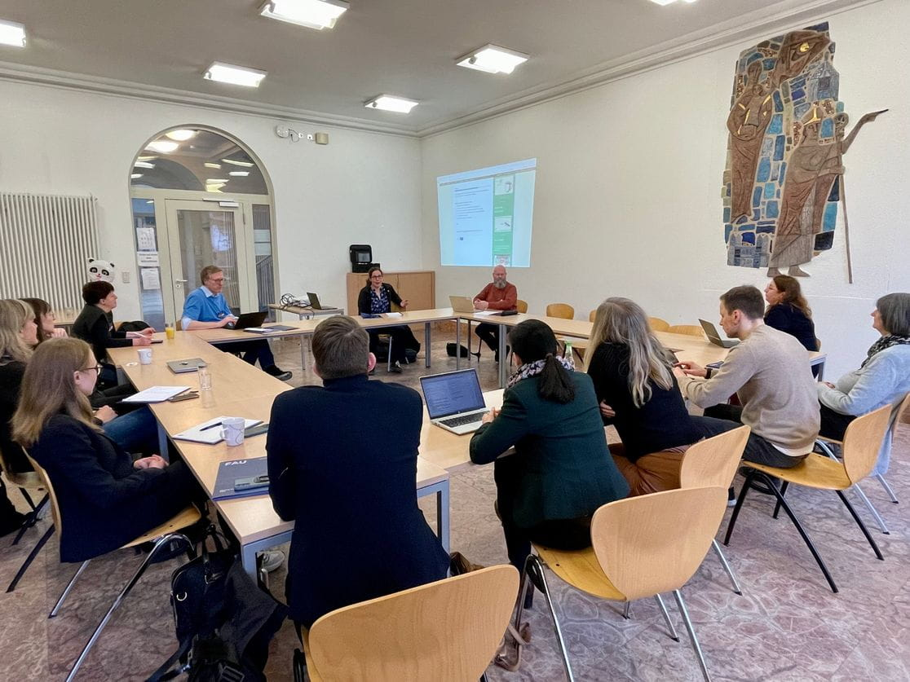

[RELImentar](https://relimentar.de/) ist eine digitale Plattform und ein fachliches Netzwerk für religionsbezogene Bildung in früher Kindheit und Familie. Sie stellt qualitätsgeprüfte Praxisideen und Materialien bereit, die auf einer theologisch reflektierten und wissenschaftlich fundierten Grundlage beruhen. Simone Wustrack (Mitarbeiterin des Comenius-Institutes) und Frank Ritthaler (Dozent für Religionspädagogik im Elementarbereich beim PTZ Stuttgart) stellten das Netzwerk vor: vom Entstehungskonzept, über den Aufbau von Fortbildungsformaten und Community-Building bis hin zur (Weiter-)Entwicklung der [Qualitätsmerkmale](https://relimentar.de/qualitaetskriterien-2025/) speziell für den religionspädagogischen Elementarbereich vor.

Weitere Informationen zu RELImentar findet ihr in unserem [Interview](https://oer.community/interview-relimentar/) mit Simone Wustrack.

👉 Die RELImentar-Folien findet ihr [hier](https://nextcloud.comenius.de/s/EpZKDqBNdwF9ro2).

## Podiumsdiskussion mit Critical Friends

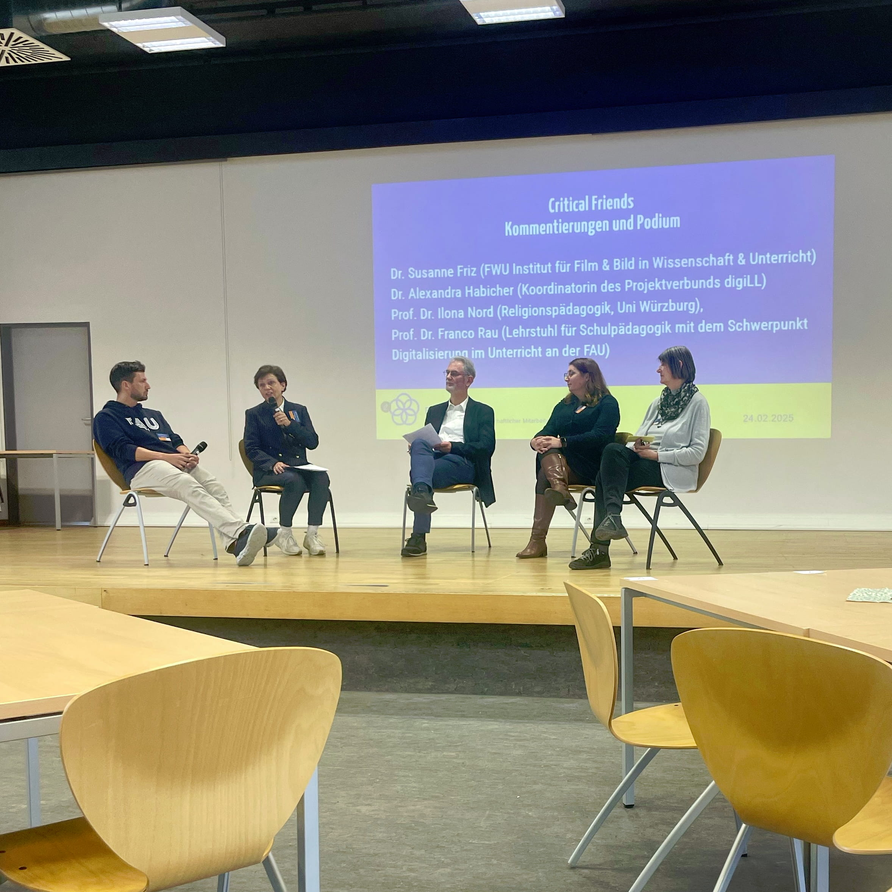

Zum Abschluss der Tagung gab es eine Podiumsdiskussion mit Critical Friends moderiert von Manfred Pirner. Die FOERBICO-Ergebnisse dienten als Grundlage und es wurde aus verschiedenen Perspektiven überlegt, welche weiteren Forschungsmöglichkeiten auf Grundlage der Ergebnisse möglich wären.

### Dr. Susanne Friz (FWU Institut für Film & Bild in Wissenschaft & Unterricht):

Frau Friz beschäftigt sich am FWU über mehrere Jahre hinweg und intensiv mit digitalen Medien und ist als Mitglied des OER-Beirates mit der Thematik vertraut. Aktuell arbeitet sie im Projekt [MOERFI](https://www.oer-strategie.de/vernetzen/moerfi/) zum Austausch verschiedener Projekte zu OER-Bildungsinfrastrukturen. Aus ihrer Erfahrung heraus findet sie es wichtig, den Leuten nicht nur OER und Lizenzen zu erklären, sondern sie auch ins Produzieren bringen und OER mit inhaltlichen Themen wie Schulentwicklung oder Medienpädagogik zu verbinden. 

> Ich finde es ganz toll, dass man OER und OEP zusammen denkt und miteinander verbindet. In Projekten wird ja immer alles Mögliche gefördert, aber Forschung meistens nicht. Von daher finde ich es gut, dass es in FOERBICO auch mal eine Begleitforschung gibt. Ich würde mir noch mehr Forschung wünschen, damit man genauer sagen kann, was bringt uns das OER und was machen die mit OEP.

### Dr. Alexandra Habicher (Koordinatorin des Projektverbunds digiLL):

Der Universitätsverbund für digitales Lehren und Lernen in der Lehrer/-innenbildung kurz [digiLL](https://digill.de/) wurde 2016 gegründet und hat aktuell 11 Standorte zur Stärkung der digitalen Lehre in der Lehrkräftebildung. Alexandra Habicher ist Gründungsmitglied und aktuell Teil des [digiLL_COM-Projektes](https://www.oer-strategie.de/projects/digill_com-projektsteckbrief/) als zentrale Anlaufstelle für innovative Lehrmethoden und eine gemeinschaftliche Lernumgebung in der phasen- und lernortübergreifenden Lehrkräftebildung zu schaffen. Dabei zielen sie darauf ab, Studierende partizipativ und ko-kreativ als Erstellende zu stärken und sie so aus der konsumierenden Haltung im Digitalen rauszubekommen. 

> Es gibt relativ wenig Daten, die abbilden, dass sich Bildungsgerechtigkeit verändert durch den Einsatz von OEP und das ist schon ein klares Desiderat, was aufgezeigt wurde. Vielleicht würde es helfen, Forschungsfragen mehr mit dem Fokus auf Transfer auszurichten, um letztendlich dann die großen Fragen von Bildungsgerechtigkeit weiter runterbrechen zu können. 

### Prof. Dr. Ilona Nord (Religionspädagogik, Uni Würzburg): 

An der Universität Würzburg beschäftigt sich Ilona Nord beispielweise mit Forschungen zu Kirche in Zeiten von Corona sowie digitalitätsbezogene Projekte zu AI in Religious Leadership oder das Projekt Soulmate, in dem erforscht wird, wie KI-gestützte Chatbots junge Erwachsene in ihrer Religiosität und im Umgang mit existenziellen Fragen unterstützen können. 

OER sei nicht im systematischen und projektbezogenen Sinne bei ihr aufgebaut, es finde aber eine zunehmende Öffnung der Formate und Plattformen statt. Aber es seien nie die technischen Möglichkeiten für OER ausgeschöpft worden. Sie sieht Vorteile von OER z.B. für die inklusive Pädagogik, wenn man das spezifisch ausarbeiten würde.  

> Das Projekt ist deshalb so außerordentlich und hervorragend, weil wir in dem Sinne noch keine Gelegenheit hatten innerhalb eines strukturierten Projekts die Informationen zu sammeln und zu reflektieren. Ich glaube, dass das für die aktuelle Lage des Standes und für die Nachhaltigkeit des Fachs von großer Bedeutung ist. Die Realität ist, dass OER-Formate wachgehalten werden müssen und Partizipierende angesprochen werden müssen. 

### Prof. Dr. Franco Rau (Lehrstuhl für Schulpädagogik mit dem Schwerpunkt Digitalisierung im Unterricht an der FAU):

Franco Rau Teil des Leitungsteams im Projekt [TOBIS](https://www.oer-strategie.de/projects/tobis-projektsteckbrief/) zur transprofessionellen Organisationsentwicklung zur Zusammenarbeit von Schulträgern zum digitalen Wandel und OER/OEP. Dabei treiben ihn Fragen um, wie Lehrkräfte mit Wissen umgehen und man müsse die Frage zu stellen, was müssten Lehramtsstudierende darüber wissen, wie ihre Lernenden damit umgehen, was können sie selbst mitgestalten und für wen machen sie das Material. Wichtig sei es, sich mit einer Qualitätsbrille nicht nur die Produkte anzuschauen, sondern auch z.B. mit Methoden des lauten Denkens auf einer mikro-didaktischen Ebene, um so eine Form der Qualitätsevolution hervorzurufen, die sich eher an Prozessen orientiert und Menschen zum Nachdenken anregt.   

> Ich glaube OEP um der OEP-Willen oder OER um der OER-Willen zu betreiben hat nicht so gut funktioniert in den letzten 20 Jahren. Wenn man es mit einem übergeordneten Ziel verknüpft, sei es Schul- oder Unterrichtsentwicklung, dann funktioniert das deutlich besser. Ich erlebe die Debatte so, dass bei OER die Frage gestellt wird, wie stelle ich möglichst viel Material zur Verfügung und wie machen wir es, dass es Menschen finden. Wenn man dann eher in einer Praxislogik denkt, stellt sich eher die Frage, welche Anwendungen digitaler Art haben wir, um Material anschlussfähig zu bearbeiten, also Offenheit nicht nur als Mindset-Frage, sondern auch als Infrastruktur- und Organisationsfrage.

Die Podiumsdiskussion zum Nachschauen im [Stream](https://www.fau.tv/series/mit-oer-zu-einer-kultur-des-teilens-w25/1-critical-friends-kommentierungen-und-podium-w25) 📹

## Fazit

Mit OER zu einer Kultur des Teilens - unter diesem Motto haben wir nicht nur unsere bisherigen Erkenntnisse und Schritte aus dem FOERBICO-Projekt mit euch geteilt, sondern zusammen mit den Teilnehmenden auch gegenseitig Einblicke in die Community-Arbeit gegeben und somit quasi Open Educational Practices und Vernetzung auf der Tagung gelebt! Was uns besonders gefreut hat: Die Verknüpfung von Wissenschaft und Praxis sowie der Blick über den eigenen (religionsbezogenen) Tellerrand hinaus - Forschung erhielt wichtige Erfahrungsberichte aus der gelebten Communityarbeit und die Communities erhielten spannende Forschungseinblicke. 

Wir hoffen alle konnten etwas mitnehmen ❤️ Eine Anleitung zum #hOERz als OER zur Weiterverwendung gibt's unter https://s.edufeed.org/hoerz 

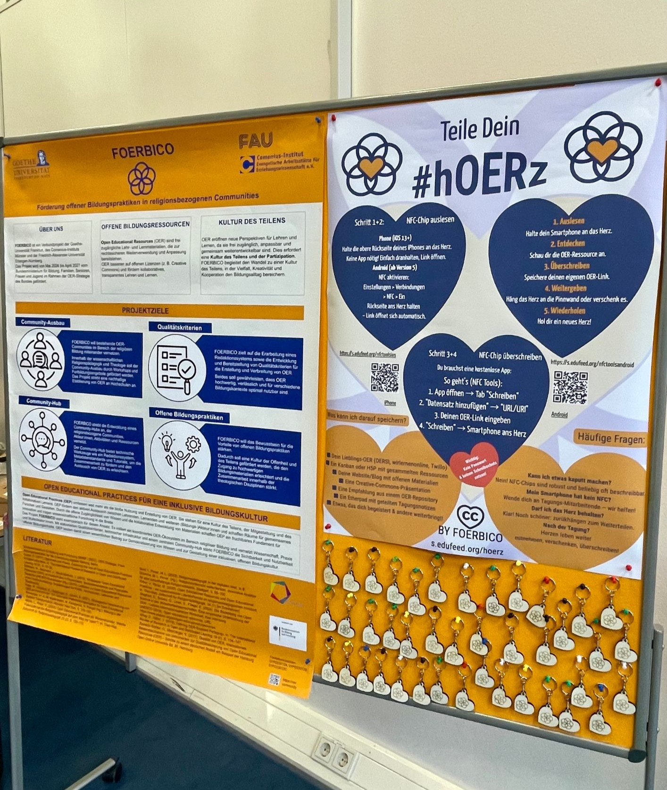

Lecker Essen, Tierluftballons und OER-Wortspiele durften natürlich auch nicht fehlen 😋

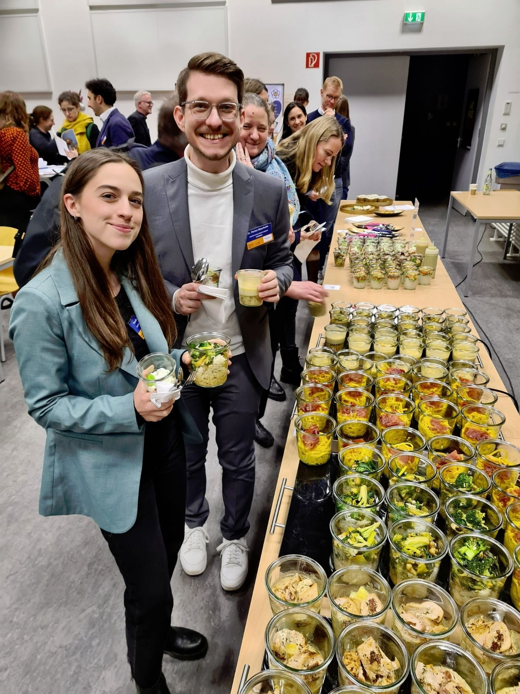

Wir bedanken uns bei allen für die Teilnahme, den inspirierenden Austausch und natürlich auch nochmal bei unseren fleißigen Hilfskräften, ohne die wir das alles nicht gestemmt bekommen hätten 🙏

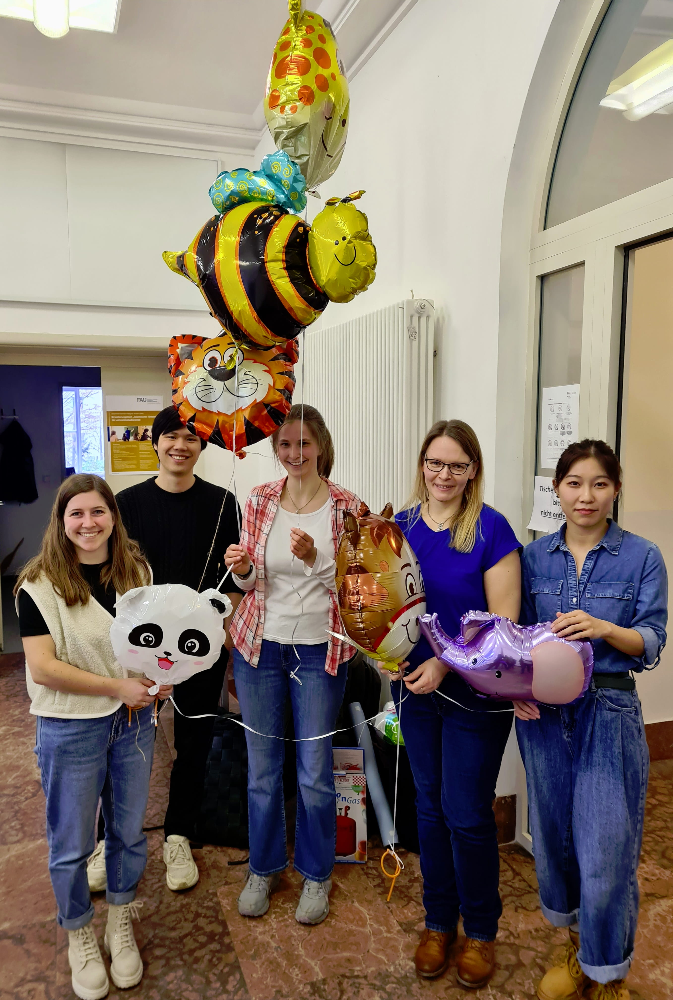

Wir hoffen, ihr hattet alle so viel Spaß wie wir und wir freuen uns, euch nächstes Jahr in Frankfurt zu unserer Abschlusstagung (LINK Anmeldung/Infoseite?) wieder zu begrüßen! 

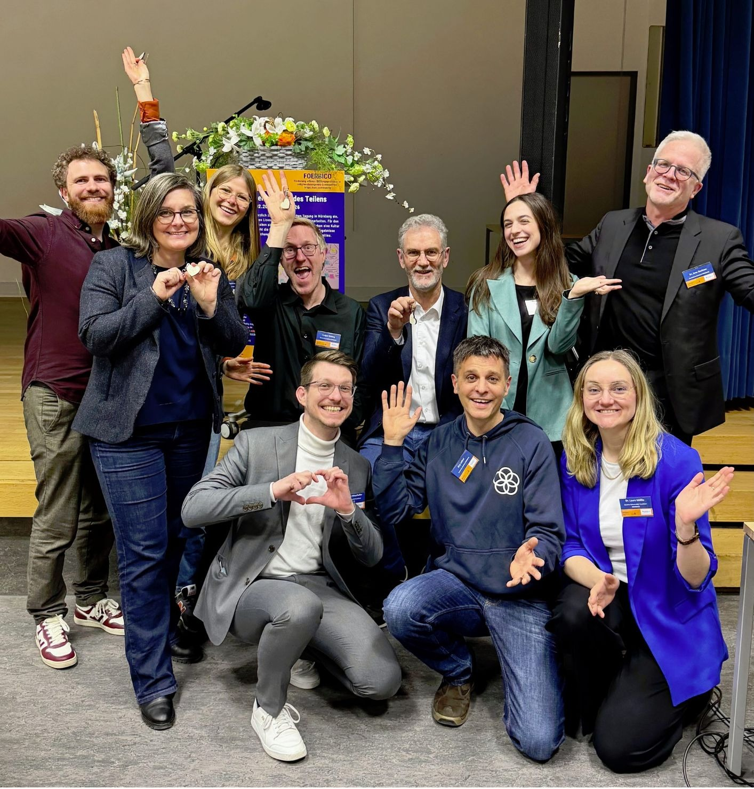