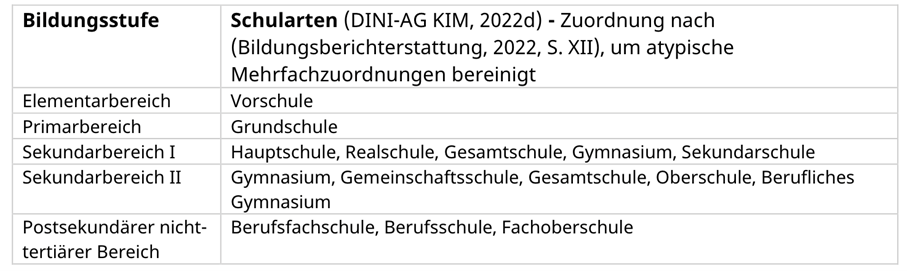
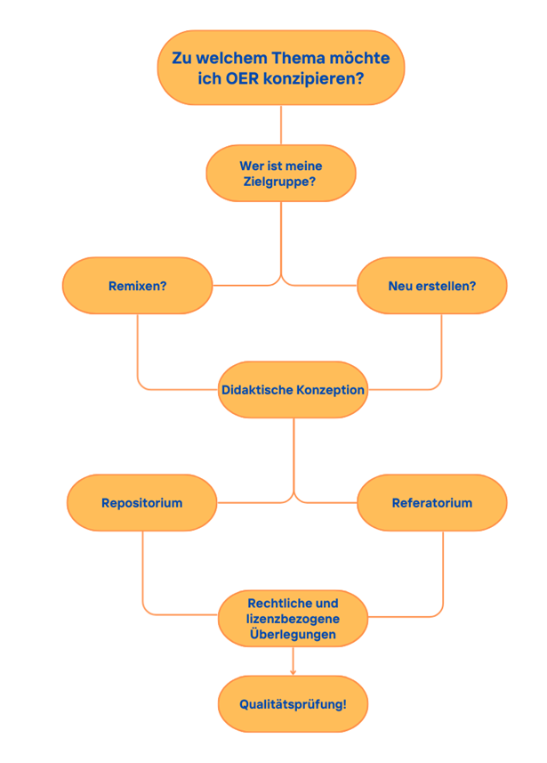

---
#commonMetadata:
'@context': https://schema.org/
creativeWorkStatus: Published
type: LearningResource
name: >-
  'OER erstellen – wie fange ich an?'
description: >-
  Der Einstieg in die Erstellung von OER ist oft mit Unsicherheiten verbunden. Die FOERBICO-Qualitätskriterien bieten zwar eine hilfreiche Orientierung, sind jedoch sehr umfangreich. Der Beitrag stellt daher eine niedrigschwellige Einführung mit Best-Practice-Beispielen bereit, um den Einstieg zu erleichtern.
license: https://creativecommons.org/licenses/by/4.0/deed.de
id: https://oer.community/oer-erstellen
creator:
  - givenName: Paula
    familyName: Paschke
    id: https://orcid.org/0009-0003-1857-2883
    type: Person
    affiliation:
      name: Johann Wolfgang Goethe-Universität Frankfurt
      id: https://ror.org/04cvxnb49
      type: Organization
inLanguage:
  - de
about:
  - https://w3id.org/kim/hochschulfaechersystematik/n02
  - https://w3id.org/kim/hochschulfaechersystematik/n03
learningResourceType:
  - https://w3id.org/kim/hcrt/text
  - https://w3id.org/kim/hcrt/web_page
educationalLevel:
  - https://w3id.org/kim/educationalLevel/level_A
datePublished: '2026-03-04'
#staticSiteGenerator:
author:
  - Paula Paschke
title: 'OER erstellen – wie fange ich an?'
cover:
  relative: true
  image: OER-Erstellung.png
  hiddenInSingle: false
summary: |
    Der Einstieg in die OER-Erstellung ist oft mit Unsicherheiten verbunden. Der Beitrag bietet eine niedrigschwellige Orientierung mit Best-Practice-Beispielen für einen erleichterten Einstieg.
url: oer-erstellen
tags:
  - Open Educational Resources (OER)
  - Open Educational Practices (OEP)
  - Creative Commons
  - Rechtsfragen
  - Lizenzen
  
---

Möchte man mit der Erstellung von OER beginnen, geht das zu Beginn oftmals mit Unsicherheiten einher: Wo beginne ich? Welche Schritte sind sinnvoll? Und wie lassen sich Qualität, Offenheit, rechtliche Sicherheit und fachliche Dimensionen kohärent miteinander verknüpfen?
Um von Anfang an die Qualität der OER sicherzustellen, ist eine Orientierung an den [Qualitätskriterien](https://oer.community/qualitaet/), die im Projekt FOERBICO entwickelt wurden, hilfreich. Diese sind jedoch sehr ausführlich und können zu Beginn möglicherweise überfordernd sein. Daher bietet der folgende Beitrag eine niedrigschwellige Orientierung und Best-Practice Beispiele, um den Anfang zu erleichtern.

## Themenfeld eingrenzen

Zu Beginn der OER-Erstellung gilt es eine inhaltliche und thematische Eingrenzung vorzunehmen: Zu welchem Thema soll Material entwickelt werden? Hilfreich ist es, das Themenfeld nicht zu breit anzulegen und sich an fachlichen und curricularen Standards zu orientieren, um eine Anschlussfähigkeit für andere Nutzende zu gewährleisten.

## Zielgruppe präzisieren

Dann gilt es die anvisierte Zielgruppe einzugrenzen. Eine Orientierung zur Einteilung bieten sogenannte Wertelisten, die unter anderem nach Bildungsstufen differenzieren. Orientieren sich Erstellende bereits zu Beginn an dieser Unterteilung, ist eine spätere Einsortierung auf OER-Plattformen leichter möglich. OER-Plattformen nutzen oftmals standardisierte Metadaten, sodass eine klare Zielgruppenangabe die Auffindbarkeit in Repositorien erhöhen kann.

 
Abbildung 1 Tabelle: Zusammenhänge zwischen Bildungsstufen und Schularten (Oellers & Rötgen, 2024, S. 88), CC-BY 4.0

## Inspiration einholen

Bevor eigenes Material konzipiert wird, empfiehlt sich eine explorative Phase. Gerade zu Beginn kann der Anspruch, etwas Eigenes entwickeln zu müssen, überfordernd sein. Eine explorative Sichtung des Feldes kann daher die konzeptionelle Orientierung unterstützen. Hilfreiche Leitfragen können sein:
-	Wie strukturieren andere OER-Erstellende ihre Materialien?
-	Welche methodischen und didaktischen Elemente werden eingesetzt (beispielsweise Reflexionsfragen, Differenzierungsangebote, Interaktionsmöglichkeiten)?
-	Wie werden Lernziele, Kompetenzen und Lizenzangaben eingebettet?
-	Welche Gestaltung gefällt mir/gefällt mir nicht und was entspricht den Vorstellungen, die ich für die eigene Konzeption vor Augen habe?

Das bewusste Betrachten gelungener OER kann Unsicherheiten zu Beginn des Konzeptionsprozesses abbauen und bei der Konkretisierung der eigenen Planung und Gestaltung unterstützend wirken.
Folgendes Vorgehen empfiehlt sich:
-	Nach OER im eigenen Fach suchen (mit spezifischer Zielgruppe)
-	Einzelne Materialien genauer anschauen
-	Kolleg*innen nach bewährten Beispielen oder eigenen Erfahrungen bei der Erstellung von OER fragen.

An folgenden Best-Practice Beispielen können sich Erstellende orientieren:
|---|---|
|Für den Elementarbereich|[Menzke, Susanne (2026). Impuls zum Fastenmonat Ramadan, CC-0-Lizenz](https://relimentar.de/materialien/impuls-zum-fastenmonat-ramadan/)|
|Für die Sekundarstufe I|[Schön, Sabrina (2022). M@PS – Medienkompetenz erweitern, Persönlichkeit stärken, CC-BY-SA 4.0-Lizenz](https://moodle-connect.s.studiumdigitale.uni-frankfurt.de/moodle/course/view.php?id=57)|
|Für die Hochschullehre|[Xue Paschke, Paula & Pirker, Viera (2025). Fachdidaktik Bibel mit Tablets, CC-BY-4.0-Lizenz](https://moodle-connect.s.studiumdigitale.uni-frankfurt.de/moodle/course/view.php?id=39)|

## Neu erstellen oder remixen?

Um OER zu erstellen, gibt es verschiedene Möglichkeiten, die auch von den eigenen zeitlichen Ressourcen und dem Themenfeld abhängig sein können. Erstellende sollten daher klären, ob sie:

-	Vollständig neue OER erstellen wollen
-	Bestehende OER adaptieren (z.B. aktualisieren oder didaktisch umstrukturieren)
-	Mehrere Materialien kombinieren (remixen)
-	Oder vorhandene Ressourcen kuratieren und kontextualisieren

Diese Entscheidung ist auch davon abhängig, ob und wie viel Material in dem Feld vorhanden ist. Ist dies nicht der Fall, so kann die Erstellung originärer OER notwendig sein.

## Didaktische Konzeption

Nach der Klärung von Zielgruppe und Erstellungsmöglichkeiten ist die Planung der didaktischen Konzeption notwendig. Dies kann sich zwar mit der Zeit entwickeln und weiter konkretisieren, doch sind einige grundlegende Fragen zu Beginn zu klären:

-	Welche Art der OER sind vorgesehen? Bereits Arbeitsblätter, Bilder, Grafiken oder Präsentationsfolien können eine niedrigschwellige Form von OER sein. Das Erstellen von interaktiven Lernkursen ist hingegen vergleichsweise umfangreicher.
-	Welches Themenfeld soll bearbeitet werden und in welchem curricularen Zusammenhang steht es?
-	Welche Lernziele sollen erreicht werden? Ist eine Differenzierung vorgesehen?
- Welche Kompetenzen werden adressiert?
-	Welche Methoden können bei dem anvisierten Format der OER berücksichtigt werden? Ein Lernkurs mit H5P Elementen bietet andere Möglichkeiten als ein Video.

Hier empfiehlt es sich, nicht ausschließlich materialzentriert zu denken. Eine Orientierung an Open Educational Practices (OEP) kann eine didaktische „Übersetzung“ von Unterricht- oder Seminarkonzepten ermöglichen.

-	Walk & Talk (Lernende gehen mit dem eigenen Handy-Aufnahmegerät oder am Telefon spazieren und tauschen sich über gelernte Inhalte aus)
-	Reflexionsformate, bei denen der Lern- und der Entwicklungsprozess der Lernenden einen Schwerpunkt bildet
-	Peer-Feedback durch offene Feedback- und Austauschmöglichkeiten, beispielsweise in Kommentarfeldern (Achtung: hier ist ggf. eine Moderation des digitalen Raumes notwendig!)

Auf der Plattform [twillo](https://www.twillo.de/edu-sharing/components/collections?mainnav=true&id=20c80ff4-856d-49a4-8c0f-4b1c2632a7f5
) stehen didaktische Templates für den Hochschulkontext zur Verfügung, die bei der Erstellung von Lehr- und Lernszenarien entlang didaktischer Lehrkonzepte (Problembasiertes Lernen, Forschendes Lernen, Inverted Classroom) für unterschiedliche Systeme (Moodle, Illias, Stud.IP und LiaSkript) genutzt werden können.

## Distributionsformen

Beretis früh sollte die Frage, wie, wo und in welcher Form die OER distribuiert werden sollen, gestellt werden. Je nach Plattformkonzeption ist lediglich eine Verlinkung möglich. Nicht jede Plattform ermöglicht die direkte Erstellung oder Bearbeitung. Hier ist zu unterscheiden zwischen:

### Repositorien (Speicher- und Veröffentlichungsplattformen)

Repositorien ermöglichen das Hochladen eigener Materialien, bei denen die OER dauerhaft gespeichert, archiviert und zitierfähig gemacht werden. Je nach Plattform ist eine Nutzung von H5P Elementen zur didaktischen und interaktiven Aufarbeitung unmittelbar möglich. Bei der Auswahl ist die Zielgruppe, das Fach sowie das Medienformat zu berücksichtigen:
-	Moodle oder Illias (Lernmanagementsysteme)
-	[WirLernenOnline](https://wirlernenonline.de/fachportale/) (einzelne Dateien)
-	[Rpi-virtuell](https://rpi-virtuell.de/) (Anlegen eines Blogs nach Registrierung)

> [!Important]
> Wichtig ist hierbei, dass beispielsweise im Kontext von Moodle oder Illias zwar umfangreiche Lernmanagementsysteme erstellt werden können, diese jedoch nicht unmittelbar öffentlich zugänglich sind und als OER nutzbar. Hierfür müssen sie mit einem Gastzugang und einer offenen Lizenz zugänglich gemacht werden. Auch sollte bei der Auswahl die Barrierefreiheit berücksichtigt werden.

### Referatorium (Referenz- und Verzeichnisplattformen)

Andere Plattformen fungieren in erster Linie als Aggregatoren. Sie verlinken auf bereits extern veröffentlichte Materialien, ohne selbst Hosting-Strukturen bereitzustellen. In solchen Fällen muss das Material zuvor auf einer anderen Plattform bzw. einem Repositorium veröffentlicht werden. Mögliche Referenz- und Verzeichnisplattformen sind:

-	[Rpi-virtuell](https://rpi-virtuell.de/)
-	[Twillo](https://www.twillo.de/)
- [HessenHub](https://www.hessenhub.de/)
-	[WirLernenOnline](https://wirlernenonline.de/fachportale/)
- [OERSI](https://oersi.org/)

## Rechtliche und lizenzbezogene Überlegungen

Um Materialien als OER ausweisen zu können, ist eine offene Lizenzierung notwendig. In dieser Hinsicht sind verschiedene Formate möglich; eine Übersicht findet sich ➡️ [hier](https://oer.community/oer-und-oep/)!

Es ist sinnvoll die Rechtssicherheit von Anfang an mit zu bedenken, das heißt:

-	Offen-lizensierte Elemente zu nutzen (Bilder, Grafiken, Videos, Schrift, Logos)
-	Nutzungsrechte für geschützte Inhalte einholen

## Fazit

Mit der Erstellung von OER zu beginnen kann zunächst herausfordernd erscheinen, doch man muss nicht unmittelbar mit der Erstellung umfangreicher Lernkurse beginnen. Auch ein gut strukturiertes Arbeitsblatt oder eine adaptierte Sammlung bestehender Materialien kann einen Beitrag in der OER-Community darstellen.
Nach der Fertigstellung der ersten OER können sie mit den eingangs genannten Qualitätskriterien abgeglichen werden, bevor sie dann veröffentlicht werden.
Hierfür spielt auch der Aspekt der Nachhaltigkeit eine Rolle. Nach einem möglichen Projektende können folgende Aspekte die langfristige Zugänglichkeit ermöglichen:

-	Eine stabile technische Infrastruktur
-	Langfristig erreichbare Speicherorte
-	Transparente Lizenzierung
-	Editierbare Formate, die Weiterentwicklung ermöglichen

Abbildung 2: Pfad für OER-Erstellung <!-- wer hat diese Grafik erstellt? Quelle noch angeben-->

