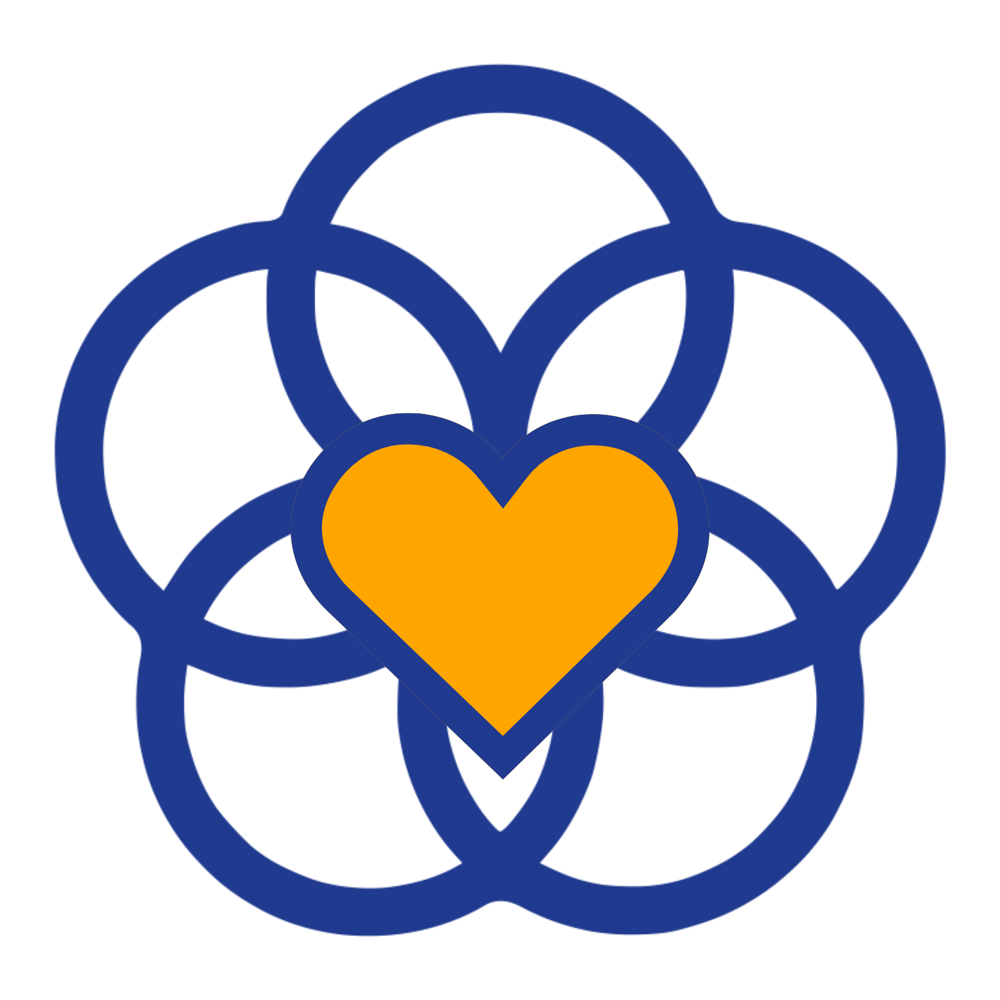
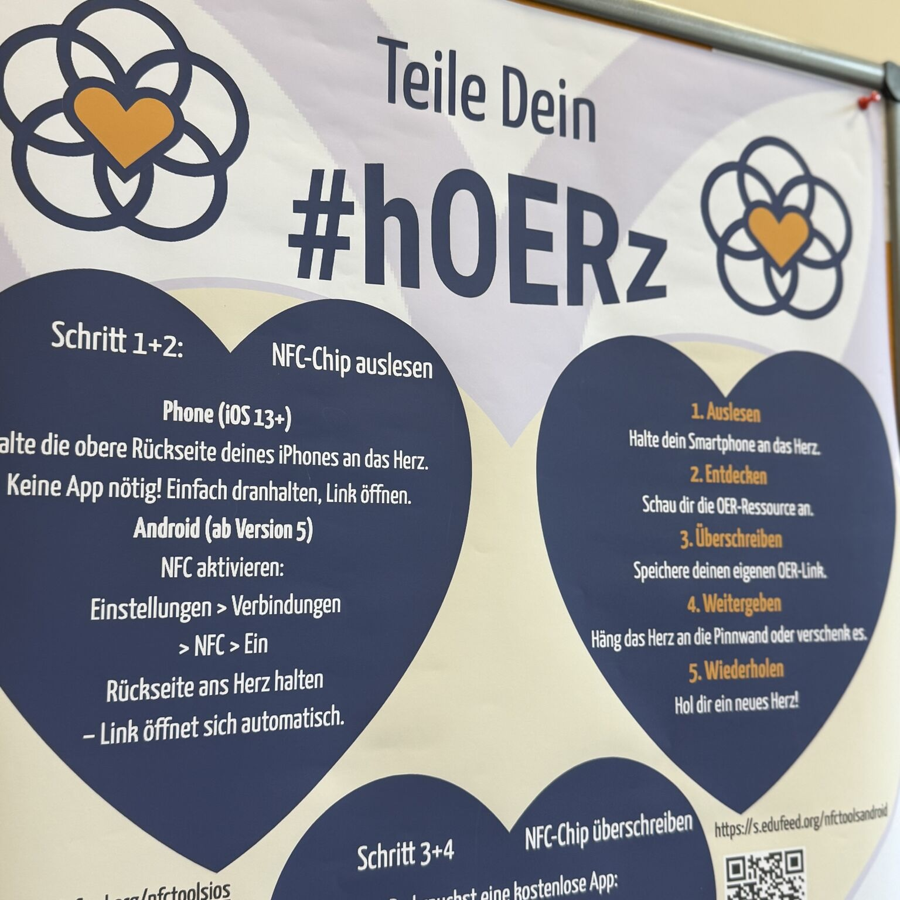

---
# commonMetadata
'@context': https://schema.org/
creativeWorkStatus: Published
type: LearningResource
name: 'Teile dein #hOERz'
description: Rückblick auf die hOERz-Aktion bei der FOERBICO-Zwischenfazit-Tagung 2026 in Nürnberg. Holzherzen mit NFC-Chips, die ausgelesen, überschrieben und weitergegeben werden – und eine Einladung, das Format nachzunutzen.
license: https://creativecommons.org/licenses/by/4.0/
id: https://oer.community/hoerz
creator:
  - givenName: Jörg
    familyName: Lohrer
    id: https://orcid.org/0000-0002-9282-0406
    type: Person
    affiliation:
      name: Comenius-Institut
      id: https://ror.org/025e8aw85
      type: Organization
inLanguage:
  - de
about:
  - https://w3id.org/kim/hochschulfaechersystematik/n052
  - https://w3id.org/kim/hochschulfaechersystematik/n053
image: https://oer.community/hoerz/cover.jpg
learningResourceType:
  - https://w3id.org/kim/hcrt/text
  - https://w3id.org/kim/hcrt/web_page
educationalLevel:
  - https://w3id.org/kim/educationalLevel/level_A
datePublished: 2026-04-17
keywords:
  - FOERBICO in Kontakt
  - Event
  - Open Educational Practices (OEP)
  - Open Educational Resources (OER)
  - Gamification
  - Community

# staticSiteGenerator
author:
  - Jörg Lohrer
title: 'Teile dein #hOERz'
cover:
  relative: true
  image: cover.jpg
  hiddenInSingle: true
  alt: hOERz – Holzherzen mit NFC-Chips auf der FOERBICO-Tagung (CC BY 4.0)
summary: Rückblick auf die hOERz-Aktion bei der FOERBICO-Zwischenfazit-Tagung 2026 in Nürnberg. Holzherzen mit NFC-Chips, die ausgelesen, überschrieben und weitergegeben werden – und eine Einladung, das Format nachzunutzen.
url: hoerz
tags:
  - FOERBICO in Kontakt
  - Event
  - Open Educational Practices (OEP)
  - Open Educational Resources (OER)
  - Gamification
  - Community
---

[SDG17-Herz](https://oer.community/hoerz), [Deutsche Unesco-Kommision](https://www.unesco.de/themen/bildung/globale-bildungsagenda/bildung-und-die-sdgs/), [CC BY-SA 4.0](https://creativecommons.org/licenses/by-sa/3.0/), mit hOERz-Ergänzung durch FOERBICO

> **TL;DR** – Auf der FOERBICO-Zwischenfazit-Tagung haben wir ein kleines Experiment gewagt: Holzherzen mit NFC-Chips, die ausgelesen, überschrieben und weitergegeben werden. Aus einem Gimmick wurde ein Format, das OEP nicht erklärt, sondern fühlbar macht. Und: Du kannst es nachmachen. Alles offen, alles CC BY.

---

## Eine Pinnwand, die lebt

Am ersten Tagungsmorgen hing sie noch fast leer da: unsere **Herzens-Pinnwand**. Ein Brett, ein paar Nägel, dazwischen baumelten Holzherzen, jedes mit einem kleinen NFC-Chip im Inneren. Auf jedem Chip: ein Link zu einer offenen Bildungsressource. Zum Einstieg von uns bestückt, aber explizit zum Überschreiben gedacht.

Was dann passierte, hat uns selbst überrascht.

Schon in der ersten Kaffeepause standen Menschen vor dem Brett, hielten ihre Handys an die Herzen, zeigten sich gegenseitig, was auftauchte. Ein H5P zur Bibeldidaktik. Ein Etherpad mit einer Methodensammlung. Ein OERSI-Fund, den jemand seit Wochen teilen wollte. Bis zum Nachmittag hatten sich erste Teilnehmende getraut, ein Herz **mitzunehmen**, zu überschreiben und zurückzuhängen. Bis zum Abend war die Pinnwand ein Ort offener Bildungspraxis geworden: Herzen kamen, Herzen gingen, und keiner wusste mehr so genau, welcher Link jetzt wo hing. Genau so war's gedacht.

[hOERz-Aktion auf der FOERBICO-Tagung](https://oer.community/hoerz), [Franco Rau](https://orcid.org/0000-0003-0327-4704), [CC BY 4.0](https://creativecommons.org/licenses/by/4.0/)

## Was da eigentlich passiert ist

Auf den ersten Blick: Gamification, Mitmach-Aktion, nette Idee. Auf den zweiten Blick werden die **V-Freiheiten** offener Bildung zu einer realen Erfahrung, die zu Herzen geht:

- **Verwenden** – du hältst das Handy dran und entdeckst, was jemand für dich hinterlassen hat.
- **Verarbeiten** – du überschreibst mit etwas, das dir gerade wichtig ist.
- **Verbreiten** – du hängst das Herz zurück oder schenkst es weiter.

Das ist die eigentliche Pointe. OEP kann man als Folie zeigen, in einer Keynote einbauen, in einem Workshop durchdeklinieren – oder eben **in die Hand geben**. Wer einmal ein Herz überschrieben und weitergegeben hat, braucht keine Definition mehr. Die Hürde „Ich teile jetzt mal was" wird kleiner, weil das Teilen nicht digital-abstrakt passiert, sondern als Geste.

Eine Teilnehmerin sagte am zweiten Tag: „Ich habe heute Morgen drei Herzen geschenkt bekommen und jetzt will ich unbedingt vor Tagungsende selbst auch noch einige verschenken." Genau diese Erlebnisse sind es, die unsere Idee initialisieren wollte.

## Was gut funktioniert hat

Ein paar Beobachtungen, die wir gerne weitergeben:

Die **niedrige Einstiegsschwelle** hat gezogen. Auslesen funktioniert auf aktuellen iPhones ohne App, auf Android mit aktiviertem NFC ebenfalls. Wer einmal ein Herz ausgelesen hat, probiert meistens auch das Überschreiben.

Die **Pinnwand als physischer Ort** war zentral. Kein Slack-Channel, kein Padlet, sondern ein Brett in der Tagungshalle an dem sich Gespräche ergaben. Mehrmals habe ich erlebt, dass zwei Leute vor der Pinnwand standen und sich plötzlich über Ressourcen unterhielten, die sie beide nicht kannten.

Das **Nicht-Tracken** war eine bewusste Entscheidung. Wir wissen nicht, welches Herz welchen Weg gegangen ist. Kein Logging, keine Analytics, kein „wer hat was überschrieben". Das entspannt. Es entsteht keine Performance-Situation, sondern eine Gaben-Ökonomie im kleinen Maßstab.

## Was wir beim nächsten Mal anders machen

Ehrlich gesagt: Die **Anleitung** hätte noch niederschwelliger sein können. Die Landingpage hat gut funktioniert, aber das A3-Plakat an der Pinnwand war der eigentliche Türöffner. Wer den QR-Code scannen musste, um überhaupt zu wissen, was zu tun ist, war schon einen Schritt zu weit weg.

Außerdem: Ein **Korb mit Ersatz-Herzen** neben der Pinnwand wäre sinnvoll gewesen. Einige Teilnehmende wollten ein Herz mitnehmen, ohne eines zurückzuhängen und das ist völlig okay. Die Ökonomie der Herzen ist keine Tauschbörse, sondern eine Einladung den Spirit des Teilens in Welt hinaus zu tragen.

## So machst du es nach

Alles, was du brauchst, ist überraschend wenig:

**Material:** Holzherz-Schlüsselanhänger mit eingelassenem NTAG213-Chip. Gibt es in Bastel- und NFC-Shops in 25er- bis 100er-Packs. Kalkuliere grob mit 1–2 Euro pro Stück. Für eine Tagung mit 50 Leuten reichen 30–40 Herzen – mehr ist auch mal zu viel.

**Vorbereitung:** Beschreibe die Herzen vorab mit URLs, die zu guten, frei zugänglichen Ressourcen führen. Mit der App **NFC Tools** (iOS/Android) geht das in Serie in unter einer Stunde. Wichtig: **kein Passwort**, **kein Schreibschutz**. Die Herzen sollen frei bleiben.

**Aufbau:** Eine Pinnwand an einem Ort, an dem Menschen sowieso vorbeikommen – Kaffee-Ecke, Foyer, Pausenbereich. Dazu ein Plakat mit den fünf Schritten (auslesen, entdecken, überschreiben, weitergeben, wiederholen) und eine Landingpage mit ausführlicher Anleitung. Das [hOERz-Plakat (PDF, CC BY)](hOERz-Plakat.pdf) kannst du direkt übernehmen.

**Kommunikation:** Ein Hashtag hilft. Wir haben **#hOERz** genommen - funktioniert auf Nostr, Mastodon, Bluesky und LinkedIn gleichermaßen.

Die vollständige Landingpage mit Schritt-für-Schritt-Anleitung, App-Empfehlungen und FAQ liegt offen unter:

**[s.edufeed.org/hoerz](https://s.edufeed.org/hoerz)**

## Warum wir das erzählen

Wir haben das Format nicht entwickelt, um es als FOERBICO-Marke zu etablieren. Im Gegenteil: Die Herzen-Idee ist genau dann erfolgreich, wenn sie woanders auftaucht, bei einer Fortbildung, im Schulkollegium, einem Vernetzungstreffenm Hochschule, freie Träger: überall, wo Menschen zusammenkommen, die ohnehin Ressourcen im Kopf haben und sie nur selten teilen.

Wenn du es ausprobierst: Erzähl davon. Hashtag **#hOERz**, gerne auch eine kurze Rückmeldung an uns. Und wenn du das Format weiterentwickelst – andere Formen, andere Chips, andere Zielgruppen – dann umso besser. OEP lebt davon, dass etwas weitergereicht wird.

---

*Mehr zur FOERBICO Zwischenfazit-Tagung gibt es im [ausführlichen Tagungsbericht](https://oer.community/recap-foerbico-tagung-2026/). Die hOERz-Anleitung als OER findet sich unter [s.edufeed.org/hoerz](https://s.edufeed.org/hoerz).*
