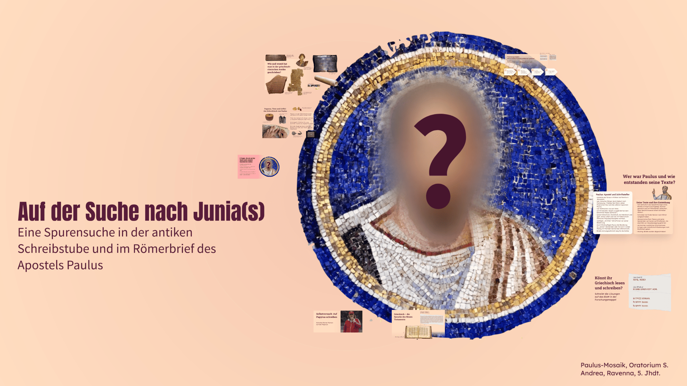
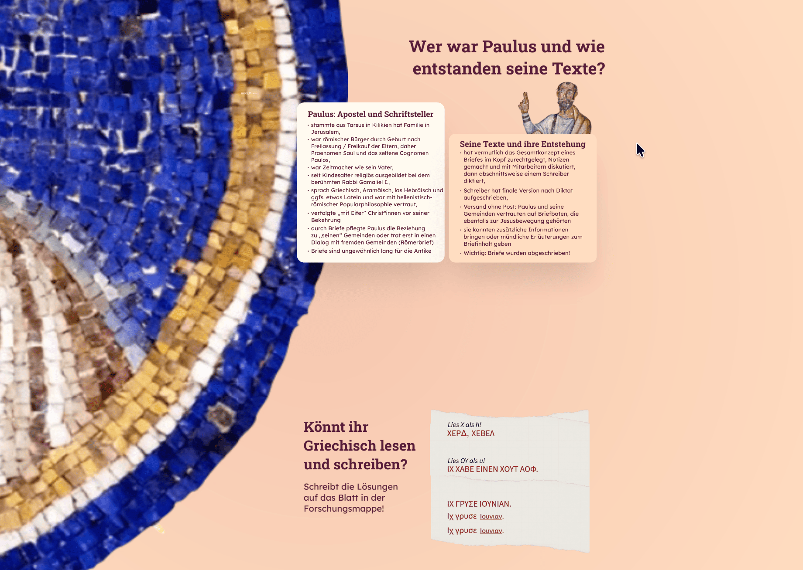
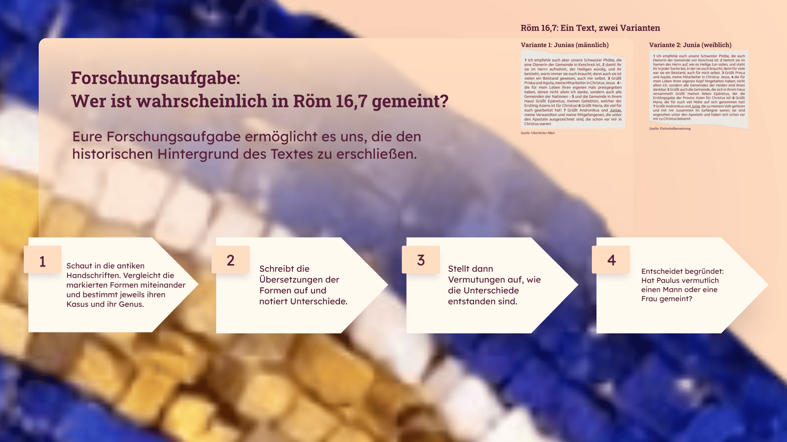

---
# commonMetadata
'@context': https://schema.org/
creativeWorkStatus: Published
type: LearningResource
name: 'Auf der Suche nach Junia(s)'
description: >-
  Das Material beschäftigt sich mit der textkritischen Frage, welche Person Paulus in Röm 16,7 als Apostel grüßt (eine Frau? einen Mann?) und vermittelt dabei Grundlagen zur antiken Schreibkultur und wissenschaftlicher Textarbeit. Das Material wurde für einen 90-minütigen Workshop (ab Klasse 8) vom Institut für Katholische Theologie an der Universität Vechta entwickelt und kann im Religionsunterricht zu den Themen Nachfolge oder Ämter im Frühchristentum eingesetzt werden. Es steht als frei nutzbares Lehrmaterial (OER) zur Verfügung.
license: https://creativecommons.org/licenses/by/4.0/deed.de
id: https://oer.community/junia
creator:
  - givenName: Jonas
    familyName: Breuer
    type: Person
    affiliation:
      name: Universität Vechta
      id: https://ror.org/045y6d111
      type: Organization
inLanguage:
  - de
about:
  - https://w3id.org/kim/hochschulfaechersystematik/n0
  - https://w3id.org/kim/hochschulfaechersystematik/n01
image: https://oer.community/junia/Titelbild-Copyright-Institut-Katholische-Theologie-Uni-Vechta.png
learningResourceType:
  - https://w3id.org/kim/hcrt/text
educationalLevel:
  - https://w3id.org/kim/educationalLevel/level_A
datePublished: '2026-04-30'
keywords:
  - OER
  - Religionspädagogik
  - Theologie
  - Didaktik
  - Religionsunterricht
  - Bildungsmedien

# staticSiteGenerator
author:
  - Jonas Breuer
title: 'Auf der Suche nach Junia(s)'
cover:
  relative: true
  image: Titelbild-Copyright-Institut-Katholische-Theologie-Uni-Vechta.png
  hiddenInSingle: true
summary: >-
  Das Material beschäftigt sich mit der textkritischen Frage, welche Person Paulus in Röm 16,7 als Apostel grüßt (eine Frau? einen Mann?) und vermittelt dabei Grundlagen zur antiken Schreibkultur und wissenschaftlicher Textarbeit. Das Material wurde für einen 90-minütigen Workshop (ab Klasse 8) vom Institut für Katholische Theologie an der Universität Vechta entwickelt und kann im Religionsunterricht zu den Themen Nachfolge oder Ämter im Frühchristentum eingesetzt werden. Es steht als frei nutzbares Lehrmaterial (OER) zur Verfügung.
url: junia
tags:
  - OER
  - Religionspädagogik
  - Theologie
  - Didaktik
  - Religionsunterricht
  - Bildungsmedien
---

Das Material für den Workshop „Auf der Suche nach Junia(s)“ wurde für ein Kinder-Uni-Programm am [Institut für Katholische Theologie an der Universität Vechta](https://www.uni-vechta.de/katholische-theologie) zusammengestellt, an dem Studierende des Seminars ,,Einführung in die Methoden der neutestamentlichen Wissenschaft‘‘ teilgenommen haben. Denkbar ist ein Einsatz im Religionsunterricht im Themenbereich ,,Christologie‘‘ unter dem Stichwort ,,Nachfolge‘‘ oder im Themenbereich ,,Ekklesiologie‘‘ unter dem Stichwort ,,Ämter‘‘.

Die Materialien werden unter einer [CC BY-SA 4.0-Lizenz](https://creativecommons.org/licenses/by/4.0/deed.de) vom Institut für Katholische Theologie Universität Vechta / TheoHub zur Verfügung gestellt, damit Lehrkräfte Teile entnehmen, anpassen und für ihre Lerngruppen nutzen können. Open Educational Resources wie diese eröffnen nicht nur die Möglichkeit, Bildungsmaterialien nachhaltig zu nutzen. Sie tragen auch dazu bei, dass wissenschaftliches Arbeiten Eingang in außeruniversitäre Bildungsräume wie Schulen und die religiöse Bildung an Kirchen findet. So wird das Vertrauen in wissenschaftliche Methoden gestärkt und die Hochschullehre lernt, sich zugänglicher zu machen.

## 📅 Veranstaltungshinweis

Am 12. Mai findet um 17 Uhr im relilab ein [Online-Werkstattgespräch](https://relilab.org/werkstattgespraech-auf-der-suche-nach-junias-oer/) zu Projekt und Material statt - herzliche Einladung dabei zu sein!

## Lernziele

Die Schüler:innen (im Folgenden abgekürzt mit SuS) kennen...

•	antike Schreibmaterialien und den kulturhistorischen Kontext des Schreibens in der griechisch-römisch-frühjüdischen Antike,

•	biographische Basisinformationen über Paulus als Theologen und Autor in seiner Zeit,

•	Griechisch als Sprache des Neuen Testaments in Grundzügen,

•	die in der neutestamentlichen Forschung häufig diskutierte Frage nach dem Geschlecht der Person ΙΟΥΛΙΑΝ (Röm 16,7), Hypothesen zu ihrer Beantwortung zu formulieren und ihre Relevanz für die Frage von weiblichen Personen in der Ämterhierarchie im Frühchristentum 

## Zielgruppe

ab Klasse 8, Gymnasium

## Dauer

90 Minuten

## Bereitgestelltes Material 

Materialmappe mit...

•	 Lese- und Schreibaufgaben, 

•	 dem griechischen Alphabet,

•	 einem textkritischen Arbeitsauftrag,

•	 basaler griechischer Grammatik, 

•	 Scans antiker Majuskel-Handschriften von Röm 16,

•	Text- und Bildmaterial mit Quellenangaben bzw. Links zur Erstellung eigener Arbeitsblätter, eines Padlets bzw. TaskCards oder einer Präsentation

•	Audiodatei zu Röm 16,1-7, auf Griechisch gelesen,

•	Gestaltungsvorschlag einer Präsentation

👉 Zum gesamten [Material](#material)

Lizenz: [CC BY-SA 4.0](https://creativecommons.org/licenses/by-nc-sa/4.0/deed.de), Institut für Katholische Theologie Universität Vechta / TheoHub 

## Ggf. zu ergänzendes Material

- Papyrusblätter

- Calamus (Schreibrohr)

- Rußtinte

- Siegelwachs

- Schnur

## Gestaltungsvorschlag für eine Lerneinheit

### Einstieg 

Zum Einstieg kann Röm 16,7 in zwei Übersetzungen gelesen werden, z. B. die Elberfelder Bibel und die Einheitsübersetzung. 

Copyright: Institut für Katholische Theologie an der Universität Vechta

Anschließend wird gemeinsam nach Unterschieden in den Übersetzungen gesucht: Während die Elberfelder Bibel mit ,,Junias’’ (maskulin) übersetzt, nennt die Einheitsübersetzung ,,Junia’’ (feminin). 

Der Kontext von Vers 7 wird fokussiert: Welcher Personengruppe wird Junia von Paulus zugeordnet? Der (erweiterte) Apostelbegriff nach Paulus (in Abgrenzung zu Lukas, der den Titel auf die Zwölf als Augenzeugen des irdischen Jesus und des Auferstandenen) wird definiert und Junia(s) Geschlecht in diesem Kontext problematisiert. Vier Leitfragen (die Fragen 2-4 sind aus Frage 1 ableitbar) werden vorgestellt und ihre Relevanz für die Einheit erläutert:

1.	Warum ist Junia(s) heute noch interessant für uns?
2.	Wie und womit hat man in der griechisch-römischen Antike geschrieben?
3.	Wer war Paulus und wie entstanden seine Texte?
4.	Wen hat Paulus wahrscheinlich in Röm 16,7 gemeint – Junia oder Junias?

Copyright: Institut für Katholische Theologie an der Universität Vechta

Die SuS erhalten jeweils eine [Materialmappe](https://sync.academiccloud.de/index.php/s/KiS2oh4LJqxP0cO?path=%2FMaterial%20zum%20Download#/) mit dem griechischen Alphabet, drei Majuskel-Handschriften inkl. Datierung, Informationen zur Deklination des Namens Ἰουνία (Junia) und einer Aufgabenstellung für die Arbeit in Kleingruppen ausgehändigt.

### Arbeitsphase

#### Wie und womit hat man in der griechisch-römischen Antike geschrieben?

Schreibunterlagen der griechisch-römischen Antike (Ostrakon, Papyrus, Holz, Wachstafel und Pergament) werden vorgestellt und, sofern vorhanden, Exemplare herumgereicht. Die Herstellung von Papyrus wird gezeigt und erklärt. Vertiefung: Die Beschaffenheit von Papyrus als schnell kompostierendes Material wird und die Relevanz des Materials für seltene Funde von Textzeugen neutestamentlicher Texte werden erklärt.

#### Wer war Paulus und wie entstanden seine Texte?

Basale biographische Informationen zu Paulus, seinen Texten und ihrer Entstehung werden vorgetragen oder alternativ aus einem Sekundärtext erarbeitet und anschließend gesichert. Anschließend wird die Beschaffenheit der Schreibmaterialien (Rußtinte (flüssig oder getrocknet als Block), Tintenfass, Schreibrohr, Papyrus und Siegelwachs, ggfs. Öllampe) zur Zeit des Paulus vertiefend besprochen und Exemplare herumgereicht; die Technik der Dokumentenfaltung (z. B. für den Briefversand) wird anhand eines Papyrusblattes illustriert oder mit einem Video gezeigt.

🎥 Zum [Video der Papyrus-Faltung](https://sync.academiccloud.de/index.php/s/KiS2oh4LJqxP0cO?path=%2FMaterial%20zum%20Download#/files_mediaviewer/Papyrus-Faltung.mp4)

Lizenz: [CC BY-NC 4.0](https://creativecommons.org/licenses/by-nc/4.0/deed.de), Jana Dambrogio and Massachusetts Institute of Technology (M.I.T)

#### Schreibübung mit Calamus (Schreibrohr), Rußtinte und Papyrus

Die SuS können ihren eigenen Namen zunächst in lateinischen Buchstaben mit Schreibrohren und Rußtinte auf das Papyrus bringen. Anschließend transkribieren die SuS ihren Namen in das Griechische mittels des in der Materialmappe abgedruckten Alphabets (S. 2) und der Angaben für diejenigen Buchstaben, die im griechischen Alphabet fehlen. Optional können die Papyrusblätter gerollt und mit Schnur und Siegelwachs verschlossen werden.

#### Griechisch – die Sprache des Neuen Testaments

Der Text Röm 16,1-7 wird auf Griechisch zum Mitlesen vorgetragen. Alternativ kann die in unseren Materialien bereitgestellte Audio-Datei abgespielt werden. Es können Details des Textes, z. B. Ἰουνίαν, gemeinsam gesucht und die Bedeutung einzelner Wörter mithilfe der Einheitsübersetzung erschlossen werden. 

🎧 Zum [Audio](https://sync.academiccloud.de/index.php/s/KiS2oh4LJqxP0cO/download?path=%2FMaterial%20zum%20Download&files=R%C3%B6m%2016%2C1-7%20vorgelesen%20von%20Silvia%20Pellegrini.m4a) 

Lizenz: [CC BY-SA 4.0](https://creativecommons.org/licenses/by-nc-sa/4.0/deed.de), Institut für Katholische Theologie Universität Vechta / TheoHub

#### Griechisch lesen und schreiben

Die in der Materialmappe enthaltenen Lese- und Schreibübungen (S. 1) werden in Einzelarbeit mithilfe der angeführten Erläuterungen durchgeführt und gemeinsam kontrolliert. Die dritte Teilaufgabe zielt darauf ab, das Fehlen von Akzenten bei Majuskel-Handschriften einzuführen und die Arbeit mit der Tabelle (S. 3) einzuüben, indem für die Minuskel-Form Iουνιαν die Akzente für beide Genera von den SuS ergänzt werden.

Copyright: Institut für Katholische Theologie an der Universität Vechta

#### Wen hat Paulus wahrscheinlich in Röm 16,7 gemeint – Junia oder Junias?

Die Klasse wird in Kleingruppen aufgeteilt. Jede Kleingruppe soll drei Majuskel-Handschriften von Röm 16,7 aus den ersten drei nachchristlichen Jahrhunderten (S. 4-6) vergleichen. Da es sich um die bis zum Frühmittelalter üblichen Majuskel-Handschriften handelt, fehlen die Akzente über dem Namen ΙΟΥΝΙΑΝ und damit auch Hinweise über das Genus der gemeinten Person, d. h. sowohl Junia (feminin) als auch Junias (maskulin) sind grammatisch möglich.

Die SuS sollen sie grammatisch bestimmen, Unterschiede auflisten und die Formen übersetzen (mithilfe von S. 3). Die Gruppen sollen dann Hypothesen formulieren, wie die Varianten der Namen in den Handschriften entstanden ist. Die markierten Formen sind 

•	ΙΟΥΛΙΑΝ (eindeutige Namensänderung, aber feminin), 

•	ΙΟΥΝÍΑΝ (im Codex Vaticanus wurde durch den zweiten Korrektor (B²) der Akutakzent auf IΟΥΝÍΑΝ = Ἰουνίαν gesetzt, womit die feminine Form des Namens markiert wird) und

•	 ΙΟΥΝΙΑ(N) (das fehlende „N" wird im Sinaiticus durch die sogenannte linea superposita dargestellt — einen Strich oberhalb des „A" am Zeilenende. Dies ist eine typische Schreibkonvention des Sinaiticus). 

Die SuS tragen ihre Hypothesen vor. Diese werden diskutiert. 

Copyright: Institut für Katholische Theologie an der Universität Vechta

### Ergebnisse:

•	Wenn Papyrus 46 von ΙΟΥΛΙΑΝ (Akkusativ von Julia) spricht, handelt sich (weniger wahrscheinlich) um einen Fehler beim Abschreiben oder Diktieren oder (am wahrscheinlichsten) aber um eine substantielle Veränderung im Text und damit eine Variante des Textes. Diese Variante (Julia/Ἰουλία) in Papyrus 46 entstand wahrscheinlich durch Verwechslung mit der Julia aus Röm 16,15. Die Tatsache, dass es sich um ein Femininum handelt, ist aber bedeutsam: Ein Maskulinum wird schwerlich mit einem Femininum verwechselt!

•	Der Codex Sinaiticus enthält einen Akkusativ (ΙΟΥΝΙΑΝ) allerdings ohne Akzent: So könnte es Maskulin oder Feminin sein.

•	Der Codex Vaticanus gibt durch den nachträglich hinzugefügten Akzent einen klaren Hinweis auf die feminine Form.

•	Die von Paulus erwähnte Person ist in allen frühen belegbaren Textzeugen immer weiblich.

•	Paulus spricht von einer Apostelin, während spätere Handschriften ab dem 8./9. Jhdt. aus Junia einen Mann (Junias) machten und damit unterschlugen, dass auch Frauen neben Männern Autoritäten in den Gemeinden zur Zeit des Paulus waren.

•	Für die frühen Kopisten und Leser*innen des Textes war es trotz Majuskeln anscheinend verständlich, dass die gemeinte Person weiblich zu lesen war.

### Materialliste {#material}

#### Material zum [Download](https://sync.academiccloud.de/index.php/s/KiS2oh4LJqxP0cO?path=%2FMaterial%20zum%20Download#/)

•	[Materialmappe](https://sync.academiccloud.de/index.php/s/KiS2oh4LJqxP0cO?path=%2FMaterial%20zum%20Download#/) mit Text- und Bildmaterial sowie Aufgabenstellung (CC BY-SA 4.0, Institut für Katholische Theologie Universität Vechta / TheoHub, Link zur Lizenz: https://creativecommons.org/licenses/by-nc-sa/4.0/deed.de)

•	[Collage](https://sync.academiccloud.de/index.php/s/KiS2oh4LJqxP0cO?path=%2FMaterial%20zum%20Download#/files_mediaviewer/Collage.png): Paulus-Mosaik mit Fragezeichen, Oratorium S. Andrea, Ravenna, 5. Jhdt. (CC BY-SA 4.0, Institut für Katholische Theologie Universität Vechta / TheoHub, Link zur Lizenz: https://creativecommons.org/licenses/by-nc-sa/4.0/deed.de)

•	Pergamentrolle, erfunden im 2. Jhdt. v. Chr. wegen Exportverbots für Papyrus durch Pharao Ptolemäus Epiphanes (KI-generiert)

•	[Porträt einer jungen Frau](https://sync.academiccloud.de/index.php/s/KiS2oh4LJqxP0cO?path=%2FMaterial%20zum%20Download#/files_mediaviewer/Frau%20mit%20Stilus,%20Pompeji.png) (sogenannte Sappho), Pompeji, 1 Jhdt. n. Chr. (Museo Archeologico Nazionale di Napoli, gemeinfrei)

•	[Vorderseite (verso) des Papyrus 37 (Mt 26)](https://sync.academiccloud.de/index.php/s/KiS2oh4LJqxP0cO?path=%2FMaterial%20zum%20Download#/files_mediaviewer/Papyrus%2037.png), ca. 300 n. Chr. (gemeinfrei)

•	[Paulus-Fresko](https://sync.academiccloud.de/index.php/s/KiS2oh4LJqxP0cO?path=%2FMaterial%20zum%20Download#/files_mediaviewer/Paulus-Fresko,%20Ephesus.png), Ephesus, 6. Jhdt. n. Chr. (gemeinfrei)

•	[Gummi Arabicum](https://sync.academiccloud.de/index.php/s/KiS2oh4LJqxP0cO?path=%2FMaterial%20zum%20Download#/files_mediaviewer/Gummi%20Arabicum.png), Baumharz von afrikanischen Akazienbäumen (CC BY-SA 3.0, Simon A. Eugster, Link zu Lizenz: https://creativecommons.org/licenses/by-sa/3.0/)

•	[Person schreibt auf Papyrus](https://sync.academiccloud.de/index.php/s/KiS2oh4LJqxP0cO?path=%2FMaterial%20zum%20Download#/files_mediaviewer/Papyrus%20Beschriftung%20(KI).png) (KI-generiert) 

•	[Video einer Papyrus-Faltung](https://sync.academiccloud.de/index.php/s/KiS2oh4LJqxP0cO?path=%2FMaterial%20zum%20Download#/files_mediaviewer/Papyrus-Faltung.mp4) (CC BY-NC 4.0, Jana Dambrogio and Massachusetts Institute of Technology (M.I.T), Link zur Lizenz: https://creativecommons.org/licenses/by-nc/4.0/deed.de)

•	[Rückseite (recto) des Papyrus 46 (Röm 16)](https://sync.academiccloud.de/index.php/s/KiS2oh4LJqxP0cO?path=%2FMaterial%20zum%20Download#/files_mediaviewer/Papyrus%2046.png), ca. 300 n. Chr. (The University of Michigan Library, gemeinfrei)

•	[Codex Sinaiticus, ca. 350 n. Chr., Seite 267](https://sync.academiccloud.de/index.php/s/KiS2oh4LJqxP0cO?path=%2FMaterial%20zum%20Download#/files_mediaviewer/Codex%20Sinaiticus%20Seite%20267.png) (CC BY-SA 3.0, Codex-Sinaiticus-Projekt, Link zu Lizenz: https://creativecommons.org/licenses/by-sa/3.0/)

•	[Audiodatei Röm 16,1-7](https://sync.academiccloud.de/index.php/s/KiS2oh4LJqxP0cO/download?path=%2FMaterial%20zum%20Download&files=R%C3%B6m%2016%2C1-7%20vorgelesen%20von%20Silvia%20Pellegrini.m4a), vorgelesen von Prof.in Silvia Pellegrini (CC BY-SA 4.0, Institut für Katholische Theologie Universität Vechta / TheoHub, Link zur Lizenz: https://creativecommons.org/licenses/by-nc-sa/4.0/deed.de)

#### Externe Materialien mit Links

• Römische Holztafel mit Notizen, England, 1. Jhdt. n. Chr. (Daniel Leal-Olivas / AFP, Link: https://u.afp.com/SaUf)

• Wachstafel aus Pompeji, Scavi Pompeji, Inv. 14372 (TH Köln – CICS – Robert Fuchs, Link: https://www.th-koeln.de/kulturwissenschaften/cics---forschungsprojekt---schreiben-auf-wachs-im-alten-rom_99637.php)

• Ostrakon mit sechs Zeilen griechischer Aufschrift, 2.–3. Jh. n. Chr. (Kunsthistorisches Museum Wien, Ägyptisch-Orientalische Sammlung, Link: https://www.khm.at/kunstwerke/ostrakon-mit-sechs-zeilen-griechischer-aufschrift-323272)

• Standbilder aus der Dokumentation ,,Die letzten Papyrus-Macher Ägyptens erhalten ein 5000 Jahre altes Handwerk am Leben’’ (Business Insider Deutschland, Link: https://youtu.be/fe0-o4ROnq8?si=RD_SwMxmH7hZIzds)

• Codex Vaticanus Graecus (Unzial-Handschrift), ca. 350 n. Chr., Seite 1460 (Bibliotheca Apostolica Vaticana, Link: https://digi.vatlib.it/view/MSS_Vat.gr.1209)

## Literatur

•	Aland, Kurt / Aland, Barbara u. a. (Hg.), Nestle-Aland. Novum Testamentum Graece, 27. Auflage, 2. überarbeitete Fassung, Stuttgart 2013 (abrufbar unter: https://www.die-bibel.de/bibel/NA28/ROM.16)

•	Horn, Friedrich (Hg.), Paulus Handbuch (Handbücher Theologie), Tübingen 2013, 409f. (Apostel-begriff); 136-141 (Schreibmaterialien, Entstehung der Briefe und Briefversand)

•	Jacobi, Christine, Art. Junia, in: WiBiLex (2016), abrufbar unter: https://bibelwissenschaft.de/stichwort/51888/

•	Katholisches Bibelwerk (Hg), Die Bibel. Einheitsübersetzung der Heiligen Schrift. Gesamtausgabe, im Auftrag der Deutschen Bischofskonferenz, der Österreichischen Bischofskonferenz, der Schweizer Bischofskonferenz u. a., Stuttgart 2016.

•	Stiftung Christlicher Medien Rudolf Brockhaus (Hg.), Elberfelder Bibel, 4. Auflage, Witten 2006.

### Erstellt von

Mag. theol. Jonas Benedict Breuer und Prof.in Dott. Dr. Silvia Pellegrini

### Weiterführende Links

- [Institut für Katholische Theologie an der Universität Vechta](https://www.uni-vechta.de/katholische-theologie) 

- [TheoHub – Netzwerkstelle für Theologische Kommunikation](https://www.uni-vechta.de/katholische-theologie/theohub)

- [TikTok Kanal theologie.univechta](https://www.tiktok.com/@theologie.univechta?lang=de-DE)

- [Instagram-Kanal @theologie.univechta](https://www.instagram.com/theologie.univechta/) 

