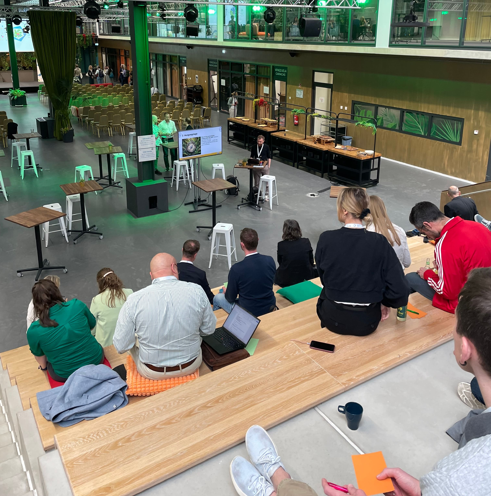
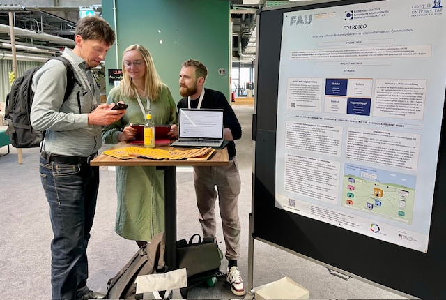

---
# commonMetadata
'@context': https://schema.org/
creativeWorkStatus: Published
type: LearningResource
name: 'OER im Blick 2026 - Welcome to the Jungle'
description: >-
  Am 28. und 29. April 2026 fand in Köln die Statuskonferenz „OER im Blick“ im Rahmen der OER-Strategie des Bundes statt. Wie in den Vorjahren wurde sie an einem besonderen Ort veranstaltet – diesmal im smartvillage mit lateinamerikanischem Flair.
license: https://creativecommons.org/licenses/by/4.0/deed.de
id: https://oer.community/oer-im-blick-2026
creator:
  - givenName: Gina
    familyName: Buchwald-Chassée
    type: Person
    affiliation:
      name: Comenius-Institut
      id: https://ror.org/025e8aw85
      type: Organization
  - givenName: Laura
    familyName: Mößle
    id: https://orcid.org/0000-0001-5255-8063
    type: Person
    affiliation:
      name: Johann Wolfgang Goethe-Universität Frankfurt
      id: https://ror.org/04cvxnb49
      type: Organization
  - givenName: Phillip
    familyName: Angelina
    id: https://orcid.org/0000-0002-6905-5523
    type: Person
    affiliation:
      name: Friedrich-Alexander-Universität Erlangen-Nürnberg
      id: https://ror.org/00f7hpc57
      type: Organization
inLanguage:
  - de
about:
  - https://w3id.org/kim/hochschulfaechersystematik/n0
image: https://oer.community/oer-im-blick-2026/OER-im-Blick-2026-Titelbild.jpeg
learningResourceType:
  - https://w3id.org/kim/hcrt/text
educationalLevel:
  - https://w3id.org/kim/educationalLevel/level_A
datePublished: '2026-05-05'
keywords:
  - KI
  - OER-Strategie
  - FOERBICO in Kontakt
  - Community

# staticSiteGenerator
author:
  - Gina Buchwald-Chassée
  - Laura Mößle
  - Phillip Angelina
title: 'OER im Blick 2026 - Welcome to the Jungle'
cover:
  relative: true
  image: OER-im-Blick-2026-Titelbild.jpeg
  hiddenInSingle: true
summary: >-
  Am 28. und 29. April 2026 fand in Köln die Statuskonferenz „OER im Blick“ im Rahmen der OER-Strategie des Bundes statt. Wie schon in den Vorjahren wurde die Veranstaltung an einem besonderen Ort durchgeführt – diesmal im smartvillage mit lateinamerikanischem Flair. Im Blogbeitrag teilen wir Eindrücke vom FOERBICO-Team mit euch.
url: oer-im-blick-2026
tags:
  - KI
  - OER-Strategie
  - FOERBICO in Kontakt
  - Community
---

Am 28. und 29. April 2026 fand die Statuskonferenz „[OER im Blick](https://www.oer-strategie.de/konferenz/)“ der [OER-Strategie](https://www.oer-strategie.de/) des Bundes in Köln statt. Wie bei der letztjährigen Konferenz in der Imaginata in Jena (siehe [Blogbeitrag](https://oer.community/oer-im-blick-2025/)) und der Auftaktkonferenz 2024 im EXPERIMINTA ScienceCenter in Frankfurt a.M. (siehe [Blogbeitrag](https://oer.community/rueckblick-auftaktkonferenz-oer-im-blick/)) wurde auch dieses Mal ein außergewöhnliches Ambiente gewählt: das smartvillage mit seinem lateinamerikanischen Flair. In inspirierender Umgebung sind wir auf eine gemeinsame Expedition durch das vielfältige OER-Ökosystem gegangen und nehmen euch in diesem Blogbeitrag mit auf die Reise. 

## KI in der Bildung weiterhin zentrales Thema

Nach der Begrüßung von Bettina Schwertfeger vom Bundesministerium für Bildung, Familie, Senioren, Frauen und Jugend (BMBFSFJ) über die bedeutende Rolle digitaler Bildung und dahingehend auch von Open Educational Practices (OEP) sowie Open Educational Resources (OER) ging es nach der Keynote von Prof. Daniel Otto bei der [OER im Blick 2025](https://www.oer-strategie.de/konferenz/dokumentation-der-statuskonferenz-2025/) auch in diesem Jahr um das "hot topic" KI. Am ersten Konferenztag stellten Dr. Steffen Schneider (KI macht Schule) und Joscha Falck (Mittelschule Rednitzhembach) in ihrer Keynote "OER und KI: Was, warum, wozu und wie – Praxisperspektive Schule?" [AIS Schule](https://ais.schule/) als Plattform zur Vernetzung aller Akteur:innen im Bildungssystem und zeigten die Ambivalenz zwischen unreflektierter KI-Adoption und den Chancen für individualisiertes Lernen. KI könne Basiskompetenzen sichern und Future Skills fördern – entscheidend sei jedoch die didaktische Einbettung, die ein Umdenken erfordere: weg von starrer Aufgabenlogik hin zu offeneren Lernprozessen mit KI  als Lernbegleiter zur Reflexion. Gleichzeitig werde es wichtiger, das *Warum* des Lernens zu vermitteln. Herausforderungen liegen in der Trägheit des Systems, fehlendem Austausch unter Lehrkräften und der Tatsache, dass KI als Querschnittsthema alle Fächer betrifft. Als Perspektive wurde betont, dass OER und Community-Initiativen Lücken schließen können, die staatliche Strukturen (noch) offen lassen. Voraussetzung für sinnvolle KI-Nutzung ist AI Literacy. Offene Frage bleibt, wie alle Akteure besser vernetzt werden können – mögliche Ansätze sehen die Vortragenden in Plattformen wie AIS Schule.

Auch am zweiten Konferenztag griff Prof. Stefan Wölwer, Hochschule für angewandte Wissenschaft und Kunst – Hildesheim/Holzminden/Göttingen in seiner Keynote "OER und KI: Was, warum, wozu und wie – Praxisperspektive Hochschulnetzwerk HAWKI?" das Thema auf und beleuchtete die Hochschulperspektive. Mit [HAWKI](https://hawki-info.hawk.de/de) als kostenfreies Open-Source-Interface für generative KI soll Hochschulen ein datenschutzkonformer und niedrigschwelliger Zugang zu aktuellen KI-Modellen ermöglicht werden. Neben Studierenden sollen perspektivisch auch Schulen von der KI-Lösung profitieren.

Auch in den Workshops, Vorträgen sowie vorgestellten OE_Space-Pitchprojekten wurden Ansätze, Tools oder Ideen präsentiert, um OER und OEP im Zeitalter von KI zu gestalten und weiterzuentwickeln. 

👉 Wenn ihr auch an dem Thema interessiert seid und euch mit anderen dazu austauschen möchtet, laden wir euch herzlich in unserem offenen Element Raum "[OER + KI](https://matrix.to/#/#oer-ki:rpi-virtuell.de)" ein! Falls ihr noch kein Element habt, erhaltet ihr hier eine [Anleitung](https://rpi-virtuell.de/bei-element-anmelden/).

## Ohne Kompass durchs Gestrüpp? – Workshop zu Qualitätskriterien für Orientierung im OER-Dschungel

Open Educational Resources stehen für Offenheit, Vielfalt und Gestaltungsfreiheit, zugleich aber auch für Unübersichtlichkeit, Unsicherheit und Orientierungslosigkeit. Im Workshop stellten Laura und Phillip die im FOERBICO Projekt entwickelten Qualitätskriterien für OER vor und beleuchteten deren Entstehung, Anwendung und Weiterentwicklung. 

Zu Beginn wurden die Teilnehmenden gebeten, eine konkrete Herausforderung bzw. „Stolperstelle“ zu benennen, die ihnen im Umgang mit OER begegnet ist. Nach einer kurzen Sammlung und ersten Einordnung dieser Aspekte führten Phillip und Laura in die OER-Qualitätskriterien ein. Diese umfassen vier Dimensionen – didaktisch-pädagogische, rechtliche, technische sowie religionspädagogische Aspekte – und dienen als strukturierender Orientierungsrahmen für Reflexion und Qualitätsentwicklung.
Dabei wurde auch auf Expert:inneninterviews Bezug genommen, die im Zuge des Entwicklungsprozesses unterschiedliche Qualitätsverständnisse aus Wissenschaft und Praxis sichtbar machten. Die Qulitätskriterien wurden nicht nur theoretisch besprochen, sondern mit den Teilnehmenden auf ihre jeweilige "Stolperstelle" angewandt. Die Rückmeldungen und Impressionen halfen Chancen und Grenzen dieser aufzuzeigen und zugleich fand eine Anwendung der Qualitätskriterien als „wachsendes Dokument“ innerhalb der Workshopgruppe statt. 

Eine zentrale Frage steht weiterhin im Raum: Wie können Qualitätskriterien nachhaltig in OER-Communities und in der Bildungspraxis verankert werden? Die Gespräche während und im Nachgang des Workshops haben deutlich gemacht, dass die entwickelten Qualitätskriterien als ein tragfähiger Orientierungsanker wahrgenommen werden, der je nach Kontext adaptiert und produktiv genutzt werden kann.
Die Aufgabe der Communities besteht daher nicht nur darin, diese Kriterien zu verbreiten, sondern sie aktiv in konkrete Praxiszusammenhänge zu übersetzen, d.h. durch Erprobung, kontextsensible Weiterentwicklung und die Integration in bestehende Arbeitsprozesse. Entscheidend ist es, Räume zu schaffen, in denen Qualitätsfragen gemeinsam ausgehandelt und anhand konkreter Materialien erprobt werden können. 

👉 Zu den [Qualitätskriterien](https://oer.community/qualitaet/) und zur [Präsentation](https://git.rpi-virtuell.de/Comenius-Institut/FOERBICO_und_rpi-virtuell/src/branch/add-blogpost-oer-im-blick-2026/Website/content/de/posts/2026-05-04-OER-im-Blick-2026/2026_04_28_Ohne%20Kompass%20durchs%20Gestru%CC%88pp%20-%20Qualita%CC%88tskriterien%20fu%CC%88r%20Orientierung%20im%20OER%20-Dschungel.pdf)

## Dezentrale OER-Vernetzung mit Nostr

Die OER-Landschaft ist stark fragmentiert. Der plattformübergreifende Austausch von Bildungsmaterialien erfordert hohen technischen Aufwand, wodurch vor allem kleine Bildungsakteure auf Hürden stoßen. Kollaboration und Open Educational Practices (OEP) bleiben aufgrund fehlender technischer Grundvoraussetzungen oft theoretisch. Als Lösung wurde der Ansatz diskutiert, Lernplattformen über das dezentrale Social-Media-Protokoll Nostr miteinander zu vernetzen. Daraus entstanden im Rahmen eines HackathOERns erste Konzepte, aus der dank der Sprint-Förderung die Kalender-App ComCal hervorging, die später zu EduFeed weiterentwickelt wurde. EduFeed ermöglicht neben dem Erstellen von Communities und dem Teilen von Terminen auch das Hochladen, Teilen und Finden von Bildungsmaterialien. Im Workshop probierten Teilnehmende EduFeed direkt aus, gründeten Communities, teilten Termine und Materialien und diskutierten anschließend Potenziale, Grenzen und notwendige Voraussetzungen für die Umsetzung von OEP in der Praxis.

Im Rahmen von FOERBICO möchten wir darauf aufbauend einen Community-Hub im Sinne einer *Community of Communities* dezentral auf dem Nostr-Protokoll aufbauen. Uns freut daher sehr, dass der Grundgedanke bei den Workshopteilnehmenden aus verschiedenen OER-Communities auf positive Resonanz gestoßen ist!

👉 Jeden Mittwoch findet außerdem von 10:30 bis ca. 11:30 Uhr ein offener Austausch für alle Interessierten unter comenius.de/zoom statt - herzliche Einladung dabei zu sein und auch dem [Edufeed-Elementraum](https://matrix.to/#/#edufeed:rpi-virtuell.de) beizutreten. 

## OE_COMmunity Forum – Projekte, Perspektiven, Partnerschaften

Als Rundgang konnten sich die verschiedenen Projekte der Förderrichtlinie OE_COM vom BMBFSFJ vorstellen. Wir von FOERBICO sind eines der geförderten Projekte und haben uns sehr darüber gefreut, unser Projekt vorstellen zu dürfen. Unser Ziel ist die Stärkung offener Bildungspraktiken in religionsbezogenen Communities. Neben der Entwicklung eines Community-Hub zur Verntzung verschiedener bereits vorhandener Communities, wie [relilab](https://relilab.org/), [reliGlobal](https://religlobal.org/), [narrt](https://narrt.de/), [RELImentar](https://relimentar.de/) und viele mehr, wurden auch die [Qualitätskriterien](https://oer.community/qualitaet/) sowie die wichtigsten Erkenntnisse der empirischen Begleitforschung vorgestellt. 

👉 Weitere Einblicke zu den Ergebnissen der Begleitforschung findet ihr im [Blogbeitrag zur FOERBICO-Zwischenfazittagung](https://oer.community/recap-foerbico-tagung-2026/).

[Austausch mit Co-Woerk](https://www.co-woerk.de/)

## Fazit - Impulsreich, inspirierend und ein bisschen slOERkig

Wie auch in den vorherigen Jahren haben wir bei der Konferenz viel Neues lernen dürfen, spannende Impulse erhalten und dank [Jöran Muuß-Meerholz](https://joeran.de/joeran/) wissen wir jetzt endlich, was slOERken bedeutet (= besserwisserisches Nörgeln von Menschen, die unter Openess-Vorzeichen arbeiten, dass etwas, was offen gemeint ist, nicht offen genug sei) 😉. Zudem hat er uns ermutigt, trotz Brüchen und Inkonsequenzen aufgrund von Plattformlogiken oder Zugänglichkeitsproblemen Offenheit im Sinne von Zugänglichkeit zu verstehen. Mit diesen und neuen Ideen sowie Ansätzen für unsere Weiterarbeit im Gepäck ging es dann für uns zurück in den Alltagsdschungel 🐒

