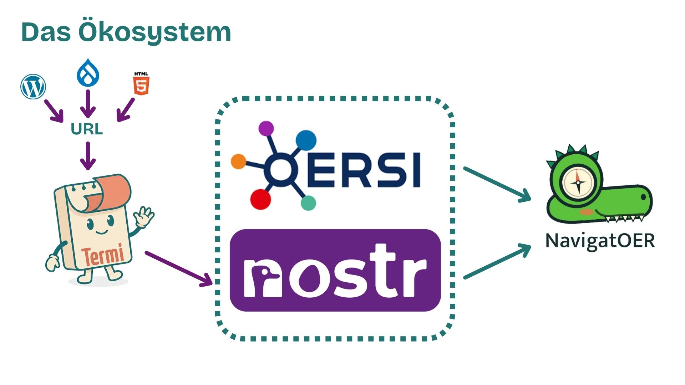
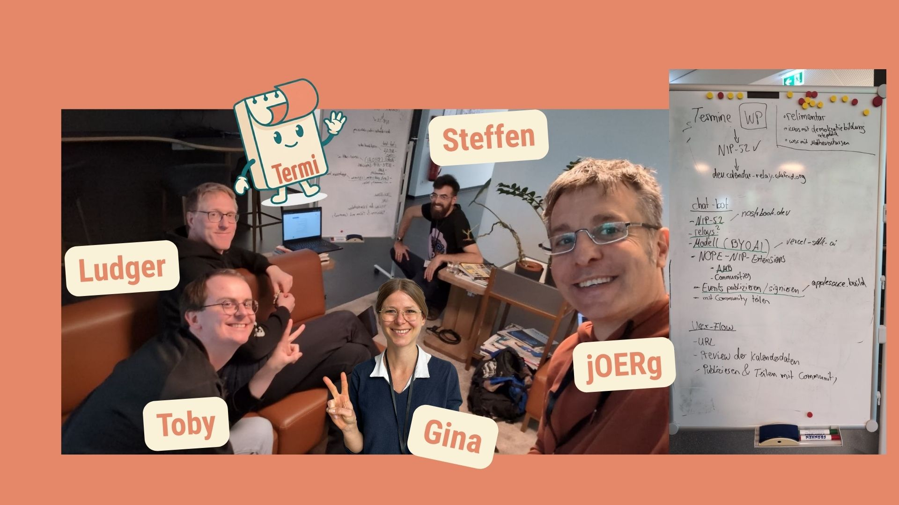
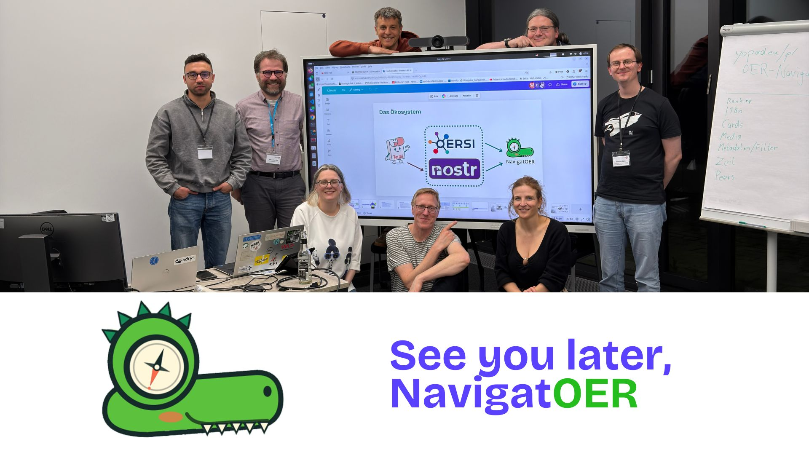

# HackathOERn 2026 in Göttingen – Zwischen KI-Editoren, OER-Navigation und offenen Events

Vom 11. bis 13. Mai 2026 kamen in den Räumen der [GWDG - Gesellschaft für wissenschaftliche Datenverarbeitung](https://gwdg.de/) in Göttingen zahlreiche Open-Education-Enthusiast:innen, Entwickler:innen, Bildungspraktiker:innen und Forschende zusammen, um im Rahmen des [HackathOERn-Projekts](https://edu-sharing-network.org/projekt-hackathoern/) gemeinsam an offenen Bildungsinfrastrukturen zu tüfteln.

Ziel des Hackathons war es, Bedarfe, Herausforderungen und konkrete Lösungsansätze rund um Open Educational Resources (OER) und Open Educational Practices (OEP) zu identifizieren und in kollaborativen Arbeitsprozessen weiterzuentwickeln. Auch wir vom FOERBICO-Team waren vor Ort vertreten und haben uns in unterschiedliche Projektgruppen eingebracht.

## Die Projektideen im Überblick

- [AI Content Editor – Generierung und Überarbeitung von Inhalten per AI](https://edu-sharing-network.org/wp-content/uploads/sites/3/2026/04/01_Steckbrief.pdf)
- [fAIr – Indikatoren für OER und ihre Integration in technische Infrastrukturen](https://edu-sharing-network.org/wp-content/uploads/sites/3/2026/04/02_Steckbrief.pdf)
- [poEtree: Der digitale Lernentwicklungsbaum – Ein offenes Lernökosystem für die Schule von morgen](https://edu-sharing-network.org/wp-content/uploads/sites/3/2026/04/03_Steckbrief.pdf)
- [Meine Termine mit MCP, Chatbot und Nostr befreien](https://edu-sharing-network.org/wp-content/uploads/sites/3/2026/04/04_Steckbrief.pdf)
- [Dateiorganisation komplexer zusammenhängender OER](https://edu-sharing-network.org/wp-content/uploads/sites/3/2026/04/05_Steckbrief.pdf)
- [Q&A AI-Chatbot – Intelligenter Zugang zu OER-Wissen](https://edu-sharing-network.org/wp-content/uploads/sites/3/2026/04/06_Steckbrief.pdf)
- [OER-Navigator – Passende Materialien besser finden](https://edu-sharing-network.org/wp-content/uploads/sites/3/2026/04/07_Steckbrief.pdf)
- [FAQ im Metadatendialog – Hilfe im Metadatenworkflow](https://edu-sharing-network.org/wp-content/uploads/sites/3/2026/04/08_Steckbrief.pdf)

## Gruppenfindung & erster Austausch

Bereits zu Beginn zeigte sich, dass viele der eingereichten Projektideen ähnliche Fragestellungen adressierten. Deshalb wurden mehrere Ansätze thematisch gebündelt und in gemeinsamen Arbeitsgruppen weiterentwickelt. So taten sich AI Content Generator, fAIr und Dateiorganisation komplexer OER zusammen, ebenso die Termin-Befreiung mit Nostr und der OER-Navigator.

Das FOERBICO-Team verteilte sich auf beide großen Stränge: Gina war Teil der Editor-Gruppe rund um KI-gestützte OER-Erstellung, Ludger, Steffen und Jörg arbeiteten mit Toby von der GWDG am verschränkten Block aus „Termi" (Termine über MCP/Nostr) und OER-Navigation.

## Block A: KI-gestützte OER-Erstellung – Zwischen Editor, Assistenzsystem und Qualitätssicherung

In diesem Strang flossen drei eng verwandte Projektideen zusammen: die Frage nach **Qualitätsmerkmalen guter OER**, die Entwicklung eines **KI-gestützten Editor-Interfaces** sowie die **Dateiorganisation komplexer OER**. Im Folgenden werden diese drei Themen nacheinander vorgestellt.

### Qualitätsmerkmale guter OER

Zu Beginn stellte sich die Gruppe die grundlegenden Fragen: Was macht OER attraktiv und qualitativ gut? Dazu stellte das Schweizer Team der ZHAW die im Forschungsprojekt „[Fostering AI & recognition in Open Education](https://www.zhaw.ch/en/research/project/77303)" entwickelten Indikatoren aus einer Literaturrecherche vor:

Anschließend wurden die Indikatoren sowie die Fragen gemeinsam diskutiert. Auf Basis der Gruppendiskussion wurden folgende Kernpunkte festgehalten:

1. **Niedrigschwellige / intuitive Nutzung**: Attraktivität entsteht durch geringe kognitive Last und schnelle Orientierung.
2. **Anpassbarkeit / Editierbarkeit**: Attraktive Systeme sind nicht statisch, sondern modular aufgebaut und flexibel personalisierbar bzw. anpassbar.
3. **Zeitersparnis & Entlastung**: Attraktivität durch weniger organisatorischen Aufwand, indem beispielsweise nicht alles manuell eingetragen werden muss.
4. **Kollaboration / Teilen / Community**: Attraktivität entsteht sozial – durch sichtbare Nutzung, Austausch und Kooperation.
5. **Vertrauen / Qualitätssicherung**: Attraktivität hängt eng mit nachvollziehbarer Qualität und Vertrauen durch Transparenz zusammen (Stichworte: „Human in the Loop", „Circle of Trust" und „Peer Review").
6. **Übersichtlichkeit & Struktur**: Attraktivität durch Komplexitätsreduktion und ansprechende Aufbereitung.
7. **Offenheit „closed → open"**: Attraktivität entsteht durch Offenheit, (plattformübergreifende) Anschlussfähigkeit und Wiederverwendbarkeit.

### KI-Interface von Kulla

Im Anschluss wurde es kreativ: Mit der „[Crazy-8-Methode](https://kreativitätstechniken.info/methode/crazy-8/)" wurden Interface-Ideen skizziert. Ziel der Methode war es, in kurzer Zeit möglichst viele unterschiedliche Ansätze zu visualisieren.

Trotz der Vielfalt zeigten sich einige wiederkehrende Gestaltungsmuster:

- chatbasierte Einstiege ähnlich bekannter KI-Interfaces
- Drag-&-Drop- und Baukastenprinzipien
- kollaborative Bearbeitung wie in Google Docs
- KI-Assistenten mit transparentem Feedback
- Variantenmanagement für unterschiedliche Lernniveaus
- Sprachsteuerung und tabletorientierte Bedienung
- digitale Schreibtisch-Metaphern für kreative Arbeitsprozesse

Besonders spannend war die Diskussion darüber, wie digitale Werkzeuge kreatives Arbeiten nicht nur funktional unterstützen, sondern auch räumlich und visuell erfahrbar machen könnten. Mehrere Konzepte griffen die Idee eines „digitalen Schreibtischs" auf, bei dem Materialien, Notizen und Entwürfe ähnlich wie auf einem physischen Arbeitsplatz organisiert werden können – ein Gedanke, der gut zum [Reli-Desk-Konzept](https://comenius.de/2026/02/06/ein-digitaler-schreibtisch-fuer-religioese-bildung/) aus dem Comenius-Institut passt.

Auch die Frage nach barrierearmen Zugängen spielte eine wichtige Rolle: Statt klassischer Tastatur-Workflows wurden verstärkt sprachbasierte Interaktionen, Touch-Bedienung und Smartpen-Konzepte diskutiert.

### Dateiorganisation komplexer OER

Im Projekt „Dateiorganisation komplexer OER" widmete sich Ute Rühling vom Institut für Didaktik der Physik der Universität Münster der Frage, wie OER durch eine technische Lösung einen höheren pädagogischen Wert erreichen können.

Den Ausgangspunkt bildet das **Reusability Paradox**: Die Nachnutzbarkeit von OER ist umso geringer, je höher ihr didaktischer Wert ist. Das etwas neuere **Revisability Paradox** trifft eine ähnliche Aussage: Je leichter ein Lernobjekt verändert und angepasst werden kann, desto geringer ist seine pädagogische Wirksamkeit ([Wiley, David: The Revisability Paradox](https://opencontent.org/blog/the-revisability-paradox)). Aus diesem Grund wurden bislang häufig granulare OER veröffentlicht – mit einer ernüchternden Schlussfolgerung: Granulare, theoretisch leicht nachnutzbare OER können nur eine geringe pädagogische Wirksamkeit entfalten.

Eine deutschlandweite Befragung von Physiklehrkräften durch Ute Rühling ergab jedoch, dass sich Lehrkräfte zur Verbesserung ihres Unterrichts und zur Entlastung im Arbeitsalltag OER-Materialpakete mit hohem didaktischem Wert wünschen – etwa komplette Unterrichtsreihen oder Lernbausteine für selbstorganisiertes Lernen.

In diesem HackathOERn wechselte die Gruppe daher die Perspektive und machte aus einem scheinbar unlösbaren Paradox eine technische Herausforderung: Das Nachnutzbarkeitsproblem komplexer Materialpakete wird zu einer Aufgabe für ein anspruchsvolles User-Experience-Design. Gemeinsam mit der Expertise der anwesenden OER-Community, einer UX-Designerin sowie zwei Programmierer:innen entstanden eine Anforderungsbeschreibung, eine Visualisierung und ein klickbarer Prototyp für ein Programm, das die „5R-Freiheiten" (verwahren, verwenden, verarbeiten, vermischen, verbreiten) ([Muuß-Merholz, Jöran: 5 R-Freiheiten nach David Wiley](https://open-educational-resources.de/5rs-auf-deutsch/)) auch von komplexen Materialpaketen für zeitlich stark belastete Lehrkräfte ermöglicht.

Der nächste Schritt besteht darin, den Prototypen entsprechend des Design-Based-Research-Ansatzes den interviewten Physiklehrkräften vorzustellen und auf Grundlage ihres Feedbacks weiterzuentwickeln. Darüber hinaus wurden auf dem HackathOERn bereits drei mögliche Kooperationen für die Umsetzung eines Programms zur Dateiorganisation vereinbart: mit dem Projekt [Relidesk](https://comenius.de/2026/02/06/ein-digitaler-schreibtisch-fuer-religioese-bildung/) der Nordkirche, mit der Plattform [MIKA-Do](https://mika-do.leando.de/) für die berufliche Bildung sowie mit der OER-Plattform [WirLernenOnline](https://wirlernenonline.de/).

## Block B: Offene Veranstaltungsdaten und OER-Navigation

Der zweite Strang verband zwei eng verwandte Projektideen: „Meine Termine mit MCP, Chatbot und Nostr befreien" (kurz **Termi**) und den **OER-Navigator** (**NavigatOER**). Beide Gruppen arbeiteten verschränkt, weil sie dieselbe Grundfrage adressierten: Wie machen wir verstreute Bildungsinformationen – Materialien wie Veranstaltungen – auffindbar, teilbar und interoperabel?

Ausgangspunkt war die Beobachtung, dass viele Bildungsangebote zwar öffentlich zugänglich sind, ihre Informationen jedoch häufig in schwer weiterverarbeitbaren Webseiten oder PDFs „eingesperrt" bleiben. Die Vision dahinter: ein offenes Ökosystem, in dem klassische Web-Quellen über offene Protokolle in standardisierte, weiterverwendbare Strukturen überführt werden.

### Termi – Termine aus Webseiten befreien

Termi soll als Chatbot eine URL einer Veranstaltungsankündigung entgegennehmen und daraus einen [NIP-52-konformen](https://github.com/nostr-protocol/nips/blob/master/52.md) Kalender-Event (Kind 31923, time-based) bauen, der nach Bestätigung durch die Nutzer:in auf einem offenen Nostr-Calendar-Relay (`dev.calendar-relay.edufeed.org`) publiziert wird. Optional kann der Termin zusätzlich in einer Community (z.B. dem Lehrer:innenzimmer) geteilt werden.

Der Workflow gliedert sich in sechs Schritte:

1. **Quelle laden** – Webseite abrufen und auf den relevanten Textinhalt reduzieren.
2. **Termin extrahieren** – Ein LLM identifiziert Termin-Felder; das Modell wird vom User selbst mitgebracht (Bring Your Own AI).
3. **Preview & Bestätigung** – Der Entwurf wird angezeigt, unsichere Felder werden hervorgehoben, Korrekturen möglich.
4. **NIP-52-Event bauen** – Aus dem Entwurf entsteht ein Nostr-Event; passende [AMB-Tags](https://nostrhub.io/) (Resource Types, Subjects, Educational Levels) werden ergänzt.
5. **Signieren & Publizieren** – Das Event wird über die NIP-07-Browser-Extension signiert und auf das Calendar-Relay publiziert.
6. **Community-Sharing** (optional) – Ein Hinweis-Event in einer Community verweist auf den Termin.

Technisch baut Termi auf dem Chatbot-Frontend [nope-chatbot](https://github.com/edufeed-org/nope-chatbot) auf und nutzt zwei MCP-Server in klar getrennten Rollen: [nostrbook.dev/mcp](https://nostrbook.dev/mcp) als Protokoll-Wissensquelle (NIP-/Kind-/Tag-Spezifikationen) sowie [amb-mcp](https://git.edufeed.org/edufeed/amb-mcp) für Bildungsmetadaten und das Publish-Handling. Als Modelle wurden u.a. die GWDG-eigenen [Chat-AI-Modelle](https://docs.hpc.gwdg.de/services/ai-services/chat-ai/models/index.html) (GLM-4.7, Qwen) verwendet – ein gutes Beispiel dafür, wie offene Bildungsinfrastruktur und souveräne KI-Dienste zusammenspielen können.

### NavigatOER – Kontextbasiert OER finden

Parallel beschäftigte sich der OER-Navigator mit der Frage, wie Bildungsressourcen künftig stärker kontextbasiert gefunden werden können. Statt reiner Schlagwortsuche sollen **Intentionen**, **Zielgruppen**, **Bildungskontexte**, **Community-Interaktionen** und **Metadatenstrukturen** in die Suche einbezogen werden.

Die Gruppe arbeitete entlang von **Personas** – Consumer, Content-Creator, Curator, Reviewer, Maintainer – und sammelte typische Such-Intentionen:

- **Inspiration**: „Materialien zu Statistik für Einsteiger"
- **Problemorientierung**: „Ich will, dass Studierende aktiv mit Daten arbeiten"
- **Eigenschaftssuche**: „CC-BY-Videos zu Machine Learning auf Deutsch"
- **Recherche**: „Alles zu ‚Künstliche Intelligenz' inkl. ‚AI', ‚maschinelles Lernen'"
- **Problemlösung**: „Wie erkläre ich den pH-Wert verständlich?"
- **Überblick**: „Meine Studierenden sind so inaktiv im Seminar – wie kann ich sie aktivieren?"

Diskutiert wurden außerdem:

- Community-Empfehlungen
- kuratierte Sammlungen
- Persona-basierte Suchzugänge
- Graph-Visualisierungen
- zeitbasierte Relevanz und Aktualitätssignale
- Verknüpfungen zwischen Materialien, Personen und Veranstaltungen

Eine erste Demo der Suche samt Cards, Filtern und Graph-Exploration ist unter [jh-488.github.io/oer-navigator](https://jh-488.github.io/oer-navigator/) erreichbar.

### Warum Termi und NavigatOER zusammengehören

Im gemeinsamen Ökosystem-Bild wird der Zusammenhang deutlich: Termi überführt Veranstaltungsseiten aus WordPress, Drupal oder reinem HTML in offene Nostr-Events. NavigatOER greift sowohl auf klassische OER-Daten (über [OERSI](https://oersi.org)) als auch auf diese Nostr-Events zu und stellt sie zusammen mit Personen, Communities und Materialien in einer kontextbasierten Suche dar. So entstand am Ende des Hackathons das Bild einer offenen, sozialen Bildungsinfrastruktur, in der OER, Communities und Veranstaltungen stärker miteinander verbunden werden.

## Das große Finale – die Ergebnispräsentationen

Die Zeit mit inspirierenden Gesprächen, konzentriertem Hacking und spannenden inhaltlichen Diskussionen verging wie im Fluge und schon stand die Vorstellung der Ergebnisse an. Zuvor wurden noch Einblicke in MOERFI als übergreifendes Bildungsinfrastrukturprojekt gegeben (siehe [Präsentation](https://docs.google.com/presentation/d/1f_hMqf_MdiUq3nrRhtmvCPldJns2K2DW/edit?slide=id.p1#slide=id.p1)).

Vorgestellt wurden die Ergebnisse der fünf Gruppen:

- AI Editor + fAIr
- OER-Datenstrukturen
- PoEtree
- Termi + NavigatOER
- Metadatenflow

👏 **Applausometer**: Mit der Lautstärke des Applauses vom Publikum wurde gemessen, welche Projektidee am meisten überzeugen konnte.

Uns hat es wie immer viel Spaß gemacht und wir finden, die Ergebnisse können sich sehen lassen 🚀
Interesse geweckt und Lust mitzuhacken? Dann schaut beim OER-/IT-Sommercamp vom 24. – 26. August 2026 in Weimar vorbei 🗓️