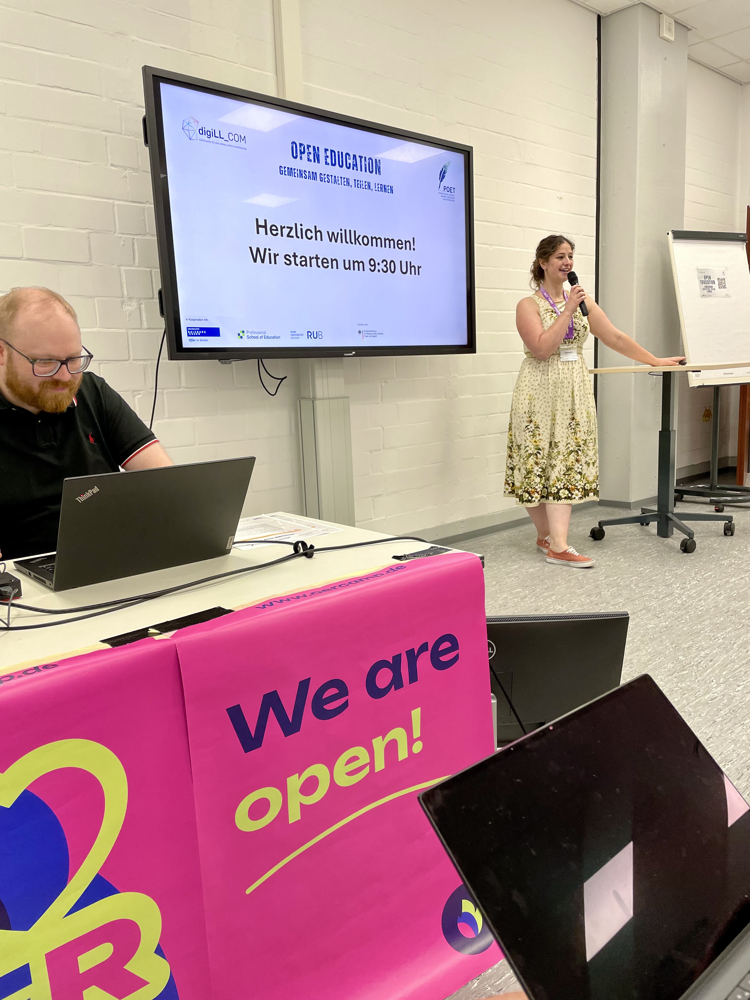
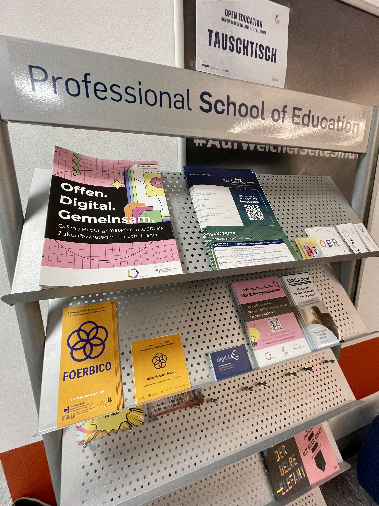
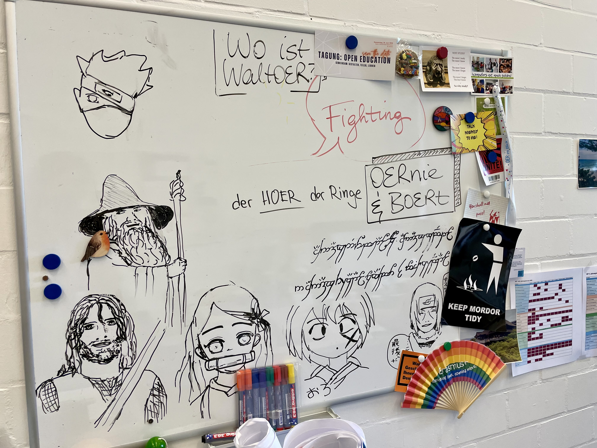

---
# commonMetadata
'@context': https://schema.org/
creativeWorkStatus: Published
type: LearningResource
name: 'Open Education – Gemeinsam gestalten, teilen, lernen: Eindrücke von der digiLL_COM-Tagung'
description: >-
  Am 18. Juni 2026 waren wir von FOERBICO bei der Tagung "Open Education – Gemeinsam gestalten, teilen, lernen" an der Professional School of Education der Ruhr-Universität Bochum (RUB) dabei, um die aktuellen Entwicklungen zum Community-Hub des FOERBICO-Projekts vorzustellen und mit weiteren Open-Education-Akteur:innen ins Gespräch zu kommen.
license: https://creativecommons.org/licenses/by/4.0/deed.de
id: https://oer.community/tagung-open-education
creator:
  - givenName: Gina
    familyName: Buchwald-Chassée
    type: Person
    affiliation:
      name: Comenius-Institut
      id: https://ror.org/025e8aw85
      type: Organization
inLanguage:
  - de
about:
  - https://w3id.org/kim/hochschulfaechersystematik/n0
image: https://oer.community/tagung-open-education/digiLL-Tagung-Beginn.jpeg
learningResourceType:
  - https://w3id.org/kim/hcrt/text
educationalLevel:
  - https://w3id.org/kim/educationalLevel/level_A
datePublished: '2026-07-08'
keywords:
  - Open Educational Resources (OER)
  - Open Educational Practices (OEP)
  - FOERBICO in Kontakt
  - Community

# staticSiteGenerator
author:
  - Gina Buchwald-Chassée
title: 'Open Education – Gemeinsam gestalten, teilen, lernen: Eindrücke von der digiLL_COM-Tagung'
cover:
  relative: true
  image: digiLL-Tagung-Beginn.jpeg
  hiddenInSingle: true
summary: >-
  Am 18. Juni 2026 präsentierte FOERBICO auf der Tagung „Open Education – Gemeinsam gestalten, teilen, lernen“ an der Professional School of Education der Ruhr-Universität Bochum die aktuellen Entwicklungen des Community-Hubs. Die Veranstaltung bot zudem die Gelegenheit, sich mit Akteur:innen der Open-Education-Community auszutauschen und neue Impulse für die weitere Projektarbeit zu gewinnen.
url: tagung-open-education
tags:
  - Open Educational Resources (OER)
  - Open Educational Practices (OEP)
  - FOERBICO in Kontakt
  - Community
---

Am 18. Juni 2026 fand an der Ruhr-Universität Bochum (RUB) sowie online die Tagung „[Open Education – Gemeinsam: gestalten, teilen, lernen](https://digill.de/tagung-open-education-gemeinsam/)“ statt. Aus der digiLL_COM-Community heraus entstanden und gemeinsam mit dem Projekt [POET](https://www.oer-strategie.de/projects/poet-projektsteckbrief/) (OE_Struktur-Förderrichtlinie) und der Universität Duisburg-Essen durchgeführt, brachte die Veranstaltung Vertreter:innen der OE_COM- und OE_Struktur-Förderrichtlinien, Hochschule, Lehrkräfte, Studierende, Schulträger sowie weitere Akteur:innen aus Forschung, Praxis und Bildungsadministration zusammen.

Passend zum Tagungsthema stand dabei eine zentrale Dimension von Open Education im Mittelpunkt: das Gemeinsame. Diese Perspektive zog sich durch die vielfältigen Vorträge, Diskussionen und Workshops des Tages und eröffnete spannende Einblicke in die Herausforderungen und Chancen offener Bildungspraktiken. Die gesamten Beiträge sowie der Live-Stream werden demnächst auf der [digiLL-Communityplattform](https://community.digill.de/) veröffentlicht!

Bei hochsommerlichen Temperaturen von nahezu 40 Grad erwiesen sich die Kellerräume der Professional School of Education der RUB dabei als hervorragende Wahl und boten den passenden Rahmen für einen intensiven Austausch über die Zukunft offener Bildung.

*Eröffnung von Joana Kadir & Matthias Kostrzewa vom digiLL-Team der Ruhr-Universität Bochum*

## „Raus aus den Bubbles“ – Vernetzung als Herausforderung und Chance

Auch das FOERBICO-Projekt war vertreten und stellte im Rahmen des Vortrags „Raus aus den Bubbles – Vernetzung als Herausforderung und Chance für offene Bildungspraktiken in Communities“ erste Erkenntnisse und Entwicklungen vor.

Ausgangspunkt war dabei eine scheinbar einfache Frage: Was brauchen OER-Communities eigentlich – und was wollen sie ausdrücklich nicht?
Die Erhebung der FAU Erlangen-Nürnberg hat gezeigt, dass viele Communities aktuell in voneinander getrennten „Bubbles“ agieren. Zahlreiche Plattformen und Netzwerke leisten wertvolle Arbeit, bleiben jedoch oft isoliert voneinander. Dadurch gehen Synergien verloren, Überschneidungen werden nicht sichtbar und Materialien erreichen häufig nur einen begrenzten Nutzendenkreis.

### Keine neuen Plattformsilos, sondern Verbindungen

Ein zentrales Ergebnis der Interviews: Die Communities wünschen sich ausdrücklich keine weiteren Plattform-Silos.
Stattdessen stehen andere Bedürfnisse im Vordergrund: kuratierte und vertrauensbasierte Empfehlungen, niedrigschwellige Zugänge, nachhaltige und dezentrale Infrastrukturen sowie bessere Vernetzung bestehender Angebote. Besonders deutlich wurde dabei der Wunsch nach einer stärkeren Verzahnung bereits vorhandener Plattformen und Communities. Nicht immer neue Projekte aufzubauen, sondern Bestehendes miteinander zu verbinden, wurde mehrfach als wichtiger Zukunftsweg beschrieben.

### Der Pain Point: Ressourcen

Ein weiteres zentrales Thema war der enorme Aufwand, der mit der Verbreitung offener Bildungsressourcen verbunden ist.
Wer heute ein neues OER-Material veröffentlicht, muss es häufig auf mehreren Plattformen separat eintragen. Änderungen müssen anschließend ebenfalls an verschiedenen Stellen gepflegt werden. Dieser Mehraufwand betrifft nicht nur Materialien, sondern auch Veranstaltungen, Fortbildungen oder Newsbeiträge. In nahezu allen Interviews wurde derselbe Engpass genannt: fehlende Zeit.

Die Erstellung von Materialien kostet Zeit. Die Verbreitung kostet zusätzliche Zeit. Für die Aktualisierung von Materialien bleibt keine Zeit. Und gerade in Projekten fehlen nach dem Förderzeitraum oft die personellen Ressourcen, um erfolgreiche Ansätze dauerhaft weiterzuführen. Oder wie es eine interviewte Person treffend formulierte:
„Das ist doch schade um die Ergebnisse, die eigentlich da sind und die nutzbar gemacht werden könnten für alle.“

### Orientierung, Beratung und Qualität

Neben technischen Fragen wurde auch deutlich, dass viele Menschen Unterstützung bei der Erstellung und Nutzung von OER wünschen.
Genannt wurden insbesondere: Wissensvermittlung rund um OER, Qualitätssicherung, Orientierungshilfen und transparente Qualitätsstandards. Aus diesem Bedarf heraus wurden im FOERBICO-Projekt gemeinsam Qualitätskriterien für offene religiöse Bildungsressourcen entwickelt. Diese berücksichtigen nicht nur rechtliche, technische sowie didaktische Aspekte, sondern auch religionspädagogische Perspektiven. Mehr dazu: https://oer.community/qualitaet/ 

### Kollaboration braucht passende Infrastruktur

Eine weitere Erkenntnis aus den Interviews lautet: Kollaboration braucht geeignete Werkzeuge.
Communities nutzen heute eine Vielzahl unterschiedlicher Tools für Kommunikation, Zusammenarbeit und Veröffentlichung. Vieler dieser Tools erlauben keine OER veröffentlichung. Gleichzeitig zeigt sich, dass keine einzelne Plattform alle Anforderungen erfüllen kann. Was für die einen gut funktioniert, passt nicht unbedingt zu den Arbeitsweisen anderer.

Deshalb wurden im Vortrag Kriterien vorgestellt, die eine zukünftige Infrastruktur erfüllen sollte:

•	Niedrigschwelligkeit,

•	Anschlussfähigkeit,

•	Anpassbarkeit,

•	Offenheit,

•	Plattformunabhängigkeit

### Von der Vision zur Wirklichkeit

Wie könnte eine solche Infrastruktur aussehen?
Vorgestellt wurde ein Ansatz auf Basis des dezentralen Social-Media-Protokolls Nostr. Die Idee: Inhalte werden nur einmal angelegt und können anschließend an unterschiedlichen Orten ausgespielt werden. Änderungen werden automatisch übernommen. Dadurch sinkt der Pflegeaufwand erheblich.
Gleichzeitig stehen nicht die Plattformen, sondern die Menschen im Mittelpunkt:

•	Communities können sich vernetzen und gegenseitig folgen.
•	Materialien können gemeinsam erstellt und geteilt werden.
•	Veranstaltungen lassen sich übergreifend sichtbar machen.
•	Soziale Interaktionen wie Kommentieren, Teilen oder Liken fördern Austausch und Feedback.
•	Kollaborative Werkzeuge unterstützen die gemeinsame Arbeit.

So entsteht schrittweise eine sozio-technische Infrastruktur, in der technische Lösungen und soziale Beziehungen zusammengedacht werden.
Besonders gefreut hat uns, dass das im Schwesterprojekt [Co-WOERK](https://www.co-woerk.de/) entwickelte [Schichtenmodell](https://media.licdn.com/dms/image/v2/D4E22AQFlpi_du0tdbA/feedshare-shrink_1280/B4EZ9BJcvmIwAM-/0/1783504424325?e=1785369600&v=beta&t=K_32w6YUPKCfMqR2hTu_7vU2RjwW-e7OS4UAyC7NUa0) unseren praxisorientierten Ansatz um wichtige theoretische Perspektiven ergänzen konnte.

Die gesamte Präsentation findet ihr [hier](https://git.rpi-virtuell.de/Comenius-Institut/FOERBICO_und_rpi-virtuell/src/branch/add-blogpost-digill-tagung/Website/content/de/posts/2026-06-19-digiLL-Tagung/Raus%20aus%20den%20Bubbles%20Vernetzung%20als%20Herausforderung%20und%20Chance%20f%C3%BCr%20offene%20Bildungspraktiken%20in%20Communities.pdf)!

Der Community-Hub wird bei unserer Abschlusstagung am 2. und 3. Februar an der Goethe-Universität in Frankfurt gelauncht – jetzt anmelden [hier](https://www.uni-frankfurt.de/de/fachbereich-7/professuren/mediendidaktik-und-religionspaedagogik/news/foerbico-abschlusstagung)! 

## Gemeinsames Storytelling als offene Lehr- und Lernpraxis

Weitere spannende Impulse kamen aus der Keynote von Celestine Kleinesper (Deutsche Kinder- und Jugenstiftung), die die Bedeutung von Storytelling für Bildungsprozesse in den Fokus rückte. Geschichten erzählen ist eine der ältesten Form von OEP: wir erzählen sie weiter, verändern und vermischen sie usw. - der Kreativität sind oft keine Grenzen gesetzt!

Besonders interessant war dabei die Frage, wie unterschiedliche Rollenperspektiven und Diversität in Geschichten und Bildungsangeboten berücksichtigt werden können. Außergewöhnlich für eine Keynote: In einem kleinen Hands-on-Teil entwickelten wir gemeinsam eine offene Geschichte. Anhand von Fragen wurden die Antworten nach Mehrheitsprinzip zum Teil der Geschichte, auf die mit Sicherheit niemand gekommen wäre: Wir waren ein zeitreisendes Gehirn im Jahr 1648 und hatten einen inneren Konflikt, daraufhin haben wir erstmal ein Eis gegessen - letzteres entsprach der Realitiät, danke an das digiLL-Team für die Abkühlung!

Ein Nebensatz aus der Keynote blieb besonders hängen:
**„It's a feature and a bug.“**

Zwar bezog sich die Aussage ursprünglich auf einen anderen Kontext, doch sie beschreibt auch viele Herausforderungen offener Bildungspraktiken erstaunlich treffend: Offenheit schafft Möglichkeiten, bringt aber zugleich neue Komplexitäten mit sich.

Passend dazu ging Matthias Kostrzewa (Ruhr-Universität Bochum) in seinem Beitrag zu "Eine kleine Geschichte der Offenheit - Narrative Konzeptionen von OEP" auf Zukunftsutopien offener Bildungspraktiken ein. Sein Fazit: Nicht nur beschweren und Pessimismus, sondern nach Vorne schauen und gemeinsam Zukunft denken. Das scheint das digiLL-Team bereits sehr kreativ und fantasievoll zu tun, wie das Whiteboard im Büro zeigt.

## Fazit

Die Tagung hat eindrucksvoll gezeigt, dass Open Education weit mehr ist als die Bereitstellung offener Materialien. Im Zentrum stehen Menschen, Beziehungen und gemeinsame Lernprozesse. Wer offene Bildung nachhaltig gestalten möchte, muss deshalb nicht nur über Inhalte und Technologien sprechen, sondern auch über Vertrauen, Vernetzung und Gemeinschaft. 

Ein herzliches Dankeschön an das digiLL-Team für die gelungene Organisation und die vielen inspirierenden Gespräche vor Ort und online. Wir freuen uns auf die weitere Zusammenarbeit und den gemeinsamen Weg hin zu einer vernetzten Open-Education-Landschaft.

