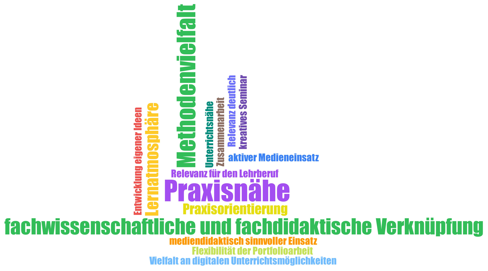

---
# commonMetadata
'@context': https://schema.org/
creativeWorkStatus: Published
type: LearningResource
name: 'Personal Learning Environments in der Hochschulbildung – Nachhaltige Lernräume für eine offene Bildungskultur in der Religionspädagogik'
description: >-
  Die Gestaltung zukunftsfähiger Hochschulbildung erfordert neue Konzepte von
  Lernräumen, die über physische Infrastrukturen hinausgehen. Angesichts des
  gesellschaftlichen Wandels hin zu einer Kultur der Digitalität wird im
  vorliegenden Beitrag das Konzept der Personal Learning Environments (PLE) als
  individuell gestaltbare, hybride Lernräume für die Religionslehrkräftebildung
  erörtert. Anhand praktischer Beispiele der Professur für Religionspädagogik und
  Mediendidaktik der Goethe-Universität Frankfurt werden pädagogische, digitale
  und soziale Bedingungen erfolgreicher PLE-Gestaltung beleuchtet und didaktische
  Perspektiven für eine lernendenzentrierte Hochschullehre entwickelt.
license: https://creativecommons.org/licenses/by/4.0/deed.de
id: https://oer.community/personal-learning-environments-in-der-hochschulbildung
creator:
  - givenName: Paula
    familyName: Xue Paschke
    id: https://orcid.org/0009-0003-1857-2883
    type: Person
    affiliation:
      name: Johann Wolfgang Goethe-Universität Frankfurt
      id: https://ror.org/04cvxnb49
      type: Organization
  - givenName: Laura
    familyName: Mößle
    id: https://orcid.org/0000-0001-5255-8063
    type: Person
    affiliation:
      name: Johann Wolfgang Goethe-Universität Frankfurt
      id: https://ror.org/04cvxnb49
      type: Organization
  - givenName: Florian
    familyName: Mayrhofer
    id: https://orcid.org/0000-0003-1900-3052
    type: Person
    affiliation:
      name: Johann Wolfgang Goethe-Universität Frankfurt
      id: https://ror.org/04cvxnb49
      type: Organization
inLanguage:
  - de
about:
  - https://w3id.org/kim/hochschulfaechersystematik/n545
  - https://w3id.org/kim/hochschulfaechersystematik/n544
  - https://w3id.org/kim/hochschulfaechersystematik/n052
image: https://oer.community/personal-learning-environments-in-der-hochschulbildung/Wortwolke.jpg
learningResourceType:
  - https://w3id.org/kim/hcrt/text
  - https://w3id.org/kim/hcrt/web_page
educationalLevel:
  - https://w3id.org/kim/educationalLevel/level_C
datePublished: '2026-06-25'
keywords:
  - Hochschuldidaktik
  - Hochschulen
  - Religionspädagogik
  - Open Educational Practices (OEP)
  - Open Educational Resources (OER)
  - Offenheit
  - Didaktik
  - Vernetzung
  - Community

# staticSiteGenerator
author:
  - Paula Xue Paschke
  - Laura Mößle
  - Florian Mayrhofer
title: 'Personal Learning Environments in der Hochschulbildung – Nachhaltige Lernräume für eine offene Bildungskultur in der Religionspädagogik'
cover:
  relative: true
  image: Wortwolke.jpg
  alt: Wortwolke aus den seminarbegleitenden Evaluationen mit wiederkehrend genannten Stärken der Seminarkonzeption, u.a. Methodenvielfalt, Lernatmosphäre, Praxisnähe und die Verknüpfung von Fachwissenschaft und Fachdidaktik
  hiddenInSingle: true
summary: >-
  Die Gestaltung zukunftsfähiger Hochschulbildung erfordert neue Konzepte von
  Lernräumen, die über physische Infrastrukturen hinausgehen. Angesichts des
  gesellschaftlichen Wandels hin zu einer Kultur der Digitalität wird im
  vorliegenden Beitrag das Konzept der Personal Learning Environments (PLE) als
  individuell gestaltbare, hybride Lernräume für die Religionslehrkräftebildung
  erörtert. Anhand praktischer Beispiele der Professur für Religionspädagogik und
  Mediendidaktik der Goethe-Universität Frankfurt werden pädagogische, digitale
  und soziale Bedingungen erfolgreicher PLE-Gestaltung beleuchtet und didaktische
  Perspektiven für eine lernendenzentrierte Hochschullehre entwickelt.
url: personal-learning-environments-in-der-hochschulbildung
tags:
  - Hochschuldidaktik
  - Hochschulen
  - Religionspädagogik
  - Open Educational Practices (OEP)
  - Open Educational Resources (OER)
  - Personal Learning Environment
  - Lifelong Learning
  - Offene Lernkulturen
  - Mediendidaktik
  
---

Der vorliegende Beitrag ist zuerst erschienen in: Mrohs, L./ Herrmann, C./ Brodel, H./ Franz, J./ Herrmann, D./ Hess, M./ Lindner, K. (Hg.): Räume der Hochschullehre. Bildungsorte für die Zukunft, Bielefeld 2026. 

# Personal Learning Environments in der Hochschulbildung

## Nachhaltige Lernräume für eine offene Bildungskultur in der Religionspädagogik

> **Zusammenfassung**: Die Gestaltung zukunftsfähiger Hochschulbildung erfordert neue Konzepte von Lernräumen, die über physische Infrastrukturen hinausgehen. Angesichts des gesellschaftlichen Wandels hin zu einer Kultur der Digitalität wird im vorliegenden Beitrag das Konzept der Personal Learning Environments (PLE) als individuell gestaltbare, hybride Lernräume für die Religionslehrkräftebildung erörtert. Dieses vernetzt digitale Tools, soziale Netzwerke und formale wie informelle Lernressourcen. Im Fokus steht die Frage, wie Hochschulen Studierende befähigen können, ihre PLE nachhaltig im Sinne des Lifelong Learnings (LLL) zu gestalten. Anhand praktischer Beispiele der Professur für Religionspädagogik und Mediendidaktik der Goethe-Universität Frankfurt werden pädagogische, digitale und soziale Bedingungen erfolgreicher PLE-Gestaltung beleuchtet und didaktische Perspektiven für eine lernendenzentrierte Hochschullehre entwickelt.
>
> *Schlüsselwörter: Personal Learning Environment, Lifelong Learning, Offene Lernkulturen, Mediendidaktik, Religionspädagogik*

---

## 1. Lernräume

### 1.1 Hinführung

Die Gestaltung zukunftsfähiger Bildungsprozesse an Hochschulen ist untrennbar mit der Frage nach geeigneten Räumen verbunden, die Lernen fördern und ermöglichen. Der Anspruch, den vielfältigen Lebens- und Ausgangslagen der Lernenden gerecht zu werden und ein nachhaltiges Lernen zu fördern, wirft Fragen nach adäquaten Raumkonzepten auf (Van Note Chism, 2006). Räume sind nicht nur infrastrukturelle Gegebenheiten, sondern auch Ausdruck didaktischer Haltungen und soziotechnologischer Entwicklungen. Löw (2015) definiert mit ihrer raumsoziologischen Theorie den Raum nicht als Territorium, sondern vielmehr als Produkt, das durch eine Dynamisierung des Raumbegriffs konstruiert und durch soziale Prozesse hervorgebracht wird. Erst durch das Zusammenspiel von Struktur und Handlung werden Räume gebildet. Oblinger (2006) hält fest, dass Räume – sowohl physisch als auch virtuell – stets einen Einfluss auf das Lernen haben. Unterstrichen wird dies durch die Überlegungen von Stalder (2016) zur »Kultur der Digitalität«, die – auf Bildungsprozesse übertragen – digitale Räume als kollaborative, dialogische und kreative Orte des Lernens verstehen lassen. Hochschulen stehen vor der Herausforderung, flexible, hybride und offene Lernumgebungen zu schaffen, die Studierende befähigen, über das Studium hinaus selbstorganisiert und kritisch-reflektiert ihre Bildungsprozesse zu gestalten. Insbesondere der »schnelle technologische Wandel und kurze Innovationszyklen« (KMK, 2016, S. 21) rücken individuelle Lernwege und das Konzept des Lifelong Learning (Lebenslanges Lernen, [LLL]) in den Fokus.

Vor diesem Hintergrund wird im vorliegenden Beitrag das Konzept der Personal Learning Environments (PLE) in der Hochschulbildung angehender Religionslehrkräfte dargestellt. PLE beschreiben hybride, individuell gestaltete Lernräume, in denen Studierende Lernressourcen, digitale Werkzeuge und soziale Netzwerke sowie Communitys zu einer persönlichen Lernarchitektur vernetzen (Attwell, 2023). Diese Lernräume sind Ausdruck einer offenen Bildungskultur, wie sie bspw. durch partizipative Lehrkonzepte wie der Open Pedagogy vertreten werden (Paskevicius & Irvine, 2019). Die Frage des vorliegenden Beitrags lautet daher: *Wie kann Hochschulbildung Studierende in der Religionslehrkräftebildung dazu befähigen, ihr PLE im Sinne des LLL zu gestalten?*

### 1.2 Lifelong Learning und Personal Learning Environments für eine nachhaltige Hochschulbildung

LLL beschreibt die Fähigkeit, sich informell, non-formal und formell angesichts der Beschleunigung des Wissenszuwachses durch kontinuierliches Lernen in unterschiedliche Problemlagen einarbeiten zu können (Kuhlenkamp, 2010; Jarvis, 2024). Das Konzept des LLL gewinnt zunehmend an Bedeutung für die Hochschulbildung (Velázquez, 2020; Jarvis, 2024) und wird durch gesellschaftliche und technologische Transformationen stetig gefordert (Divjka et al., 2004). Aoki (2020) sieht daher digitale Technologien als Partner für LLL.

Laut der Europäischen Kommission (o.J.) umfasst LLL »all learning activities undertaken throughout life with the aim of improving knowledge, skills and competences within personal, civic, social or employment-related perspectives.« Darauf aufbauend wurde in der European Universities' Charter for Lifelong Learning der European University Association (2008) die Zielsetzung formuliert, die Hochschullehre verstärkt am Konzept des LLL auszurichten und entsprechende Bildungspraktiken systematisch zu fördern.

Angesichts einer zunehmend komplexen und dynamischen Welt wird LLL zu einer zentralen Voraussetzung für gesellschaftliche Teilhabe sowie für berufliche Anschlussfähigkeit (Håkansson Lindqvist et al., 2024). Dabei ist es essenziell, Lernen nicht nur auf bestimmte Lebensphasen zu beschränken, sondern als kontinuierliche Entwicklung über die gesamte Lebensspanne hinweg zu verstehen, unabhängig von Ort, Kontext oder institutionellen Rahmenbedingungen (Cendon, 2021).

Die Notwendigkeit einer Anpassung der Hochschulkultur an LLL wird durch die verändernden Bildungsbiografien deutlich: Lernende kehren potenziell auch nach mehrjähriger Berufstätigkeit wieder an die Universität zurück oder beginnen während des Erwerbslebens ein (zweites) Studium. Hochschulen müssen daher ihre Perspektive auf Lernprozesse erweitern und deren Vielfalt sowie die unterschiedlichen Lebenskontexte der Lernenden anerkennen. Die unterschiedlichen Lebens- und Studienbedingungen der Lernenden an Hochschulen erfordern nicht nur eine Öffnung in struktureller und curricularer Hinsicht, sondern auch pädagogischen und politischen Weitblick. Hochschulbildung im 21. Jahrhundert muss darauf zielen, nicht nur fachliche Kompetenzen zu vermitteln, sondern Studierende auch zu befähigen, eigene Lernprozesse zu initiieren, zu steuern und kritisch zu reflektieren (Cendon, 2021; KMK, 2016).

García-Martínez et al. (2023) heben hervor, dass LLL und PLE eine produktive Symbiose bilden. Was genau unter PLE verstanden wird, kann dabei variieren: »For some, a PLE is a specific tool or defined tool collection used by a learner to organize his or her own learning processes. For others, the PLE simply acts as a metaphor to describe the activities and milieu of a modern online learner« (Martindale & Dowdy, 2010, S. 179).

Allen Verständnisweisen von PLE ist jedoch gemein, dass diese den Lernenden Kontrolle über den eigenen Lernprozess ermöglichen. Vor diesem Hintergrund bilden PLE eine Kombination personeller, hybrider, technologischer und sozialer Lernressourcen, die gemeinsam einen imaginären *Lernraum* bilden. In dieser Form sollen PLE die Lernenden dazu befähigen, auch über die Zeit der Hochschulbildung hinaus selbstständig und eigenverantwortlich im Sinne des LLL zu lernen.

## 2. Personal Learning Environments – praktische Einblicke in Lehr- und Projektpraxis

Die theoretische Auseinandersetzung mit den Konzepten des PLE und des damit verbundenen Anspruchs des LLL wirft Fragen angesichts der praktischen Umsetzung in der Hochschullehre auf. Werden die theoretischen Konzepte ernstgenommen und in die Praxis übersetzt, ergeben sich nicht nur Anfragen an die Rolle der Hochschullehrenden und der Lernenden, sondern auch insgesamt an die Lehr- und Lernkultur, die strukturelle Umgebung und die Bedeutung von Netzwerken. Im Folgenden sollen Praxis- und Projektbeispiele an der Professur für Religionspädagogik und Mediendidaktik der Goethe-Universität Frankfurt vorgestellt werden, die sich an Ansätzen zur Förderung eines PLE im Sinne einer nachhaltigen Hochschullehre orientieren, um Impulse für eine zukunftsfähige Lehrkräftebildung abzuleiten.

*Tabelle 1: Übersicht der PLE-Projekte an der Professur für Religionspädagogik und Mediendidaktik der Goethe-Universität Frankfurt (eigene Darstellung).*

| Projekt | Laufzeit | Zielgruppe / Beteiligte | Tools / Formate | Ziele | Lessons Learned |
|---|---|---|---|---|---|
| **TiRU** | 2022–2025 | Lehramtsstudierende im Fach Kath. Religion | OEP durch hybride Lehr-Lernformate, Peer-Feedback, e-Portfolio, Begleitung und Gestaltung individueller Lernprozesse; zeitliche und räumliche Erweiterung | Fachdidaktisch reflektierte Digitalkompetenz bei Studierenden fördern; durch OER auch über die Seminargrenzen hinweg | PLE durch technische Ausstattung, Peer-Feedback und individuelle Begleitung ist insbesondere in kleinen Seminargruppen umsetzbar |
| **relilab** | kontinuierlich | Studierende, Lehrkräfte, Referendar:innen, Fachdidaktiker:innen | Virtuelle Lernumgebung relilab, Community of Practice, Peer-Feedback | Vernetzung und Fortbildung zu religiöser Bildung in einer Kultur der Digitalität | Community und Peer-Learning gelingen; Vernetzung zwischen den Phasen dennoch schwierig |
| **FOERBICO** | 2024–2027 | Hochschullehrende, Multiplikator:innen, Community-Akteur:innen | Community-Hub, Repositorien, OER-Infrastruktur | OEP-Communityaufbau in der wissenschaftlichen Theologie und Religionspädagogik | Bereits bestehende zentrale und dezentrale OER-Infrastrukturen ausbauen, Redaktionssystem und Qualitätskriterien entwickeln |

### 2.1 Hybride Lehrformate als PLE zur Flexibilisierung im Lehrprojekt TiRU

#### 2.1.1 Reflexive und selbstgesteuerte Lernprozesse in einer neuen Hochschulkultur

Die Digitalisierung von Hochschullehre birgt das Potential, Lernprozesse und Lerninhalte zeit- und ortsunabhängig zu gestalten und damit zu einer »Öffnung und Flexibilisierung von Bildungswegen« (KMK, 2021, S. 4) beizutragen.

Zur Gestaltung eines dafür notwendigen Kulturwandels an Hochschulen plädieren Petschenka et al. (2020) in ihrem »Baukasten für Veränderungsprozesse« für einen paradigmatischen Wandel in der Hochschuldidaktik: Im Zentrum steht der *Shift from Teaching to Learning*, der die aktive Lernprozessgestaltung der Studierenden fokussiert und Lehre als Ermöglichungsraum versteht.

Sie nennen Formen des kollaborativen Lernens, selbstorganisierte Lernprozesse und Experimentierräume für innovative Lehr-Lernformate als wichtige Elemente einer zukunftsfähigen Hochschuldidaktik, ebenso wie Kompetenzerwerb durch Kommunikation, das Einbinden digitaler, mobiler Medien sowie die Gestaltung durch Methodenvielfalt (Petschenka et al., 2020). Wie auch die KMK (2021) nennen Petschenka et al. (2020) als zentrale Gelingensbedingungen ein neues Verständnis der Lehrpersonen: die professionelle Expertise im Feld digitaler Bildung sowie das flankierende Begleiten der Lehr-Lernprozesse. Diese kann nach der KMK (2021) durch die Etablierung regelmäßiger Feedbackprozesse umgesetzt werden. Neben der individuellen Begleitung durch Lehrende kann dies auch Peer-Feedbackprozesse beinhalten, um ein Verständnis für kooperative Lernformate in einer offenen Hochschulkultur zu fördern. Dadurch können sowohl der Lernprozess als auch die Lernumgebung den individuellen Bedürfnissen der Studierenden angepasst werden. Das Ziel besteht darin, Studierende zu befähigen, eigene Lernprozesse zu gestalten, zu organisieren und kritisch zu reflektieren (Cendon, 2021; KMK, 2016; KMK, 2021; Petschenka et al., 2020). Der didaktische Rahmen der Hochschullehre soll als ein Raum der Ermöglichung und des Experiments verstanden werden. In diesem Raum werden Wissen und Kompetenzen durch Kommunikation generiert, sodass ein Wandel vom Konsum zur Produktion angestrebt wird (Petschenka et al., 2020).

Ein Instrument zur Förderung individueller und personalisierter Lernwege kann das e-Portfolio sein. Nach Häcker (2006) ist ein Portfolio ein Konzept zur Darstellung individueller Entwicklungs- und Lernprozesse, um Kompetenzen und Leistungen sichtbar zu machen. Dies wird in Form einer systematischen Zusammenstellung von kuratierten Dokumenten und Reflexionen durch Studierende zusammengestellt. Dabei ist ein individueller und lernendenzentrierter Arbeitsprozess der Kerngedanke eines solchen Produkts (Münte-Goussar, 2019). Ein e-Portfolio kann somit Erfahrungen des reflexiven und selbstgesteuerten Lernens ermöglichen sowie kollaboratives und vernetztes Arbeiten in der Hochschulbildung der Zukunft fördern (Wannemacher et al., 2020).

#### 2.1.2 Die Verknüpfung des analogen und digitalen Bildungsraums

Neben der Öffnung der Lernprozesse in Lehrveranstaltungen selbst stellt sich auch die Frage nach der Zugänglichkeit über den Seminarkontext hinaus. Die KMK (2016) plädiert dafür, das Potential digitaler Lernformate zu nutzen, um unterschiedlichen Gruppen einen offenen Zugang zu Bildungsinhalten zu ermöglichen. Doch eine direkte Übertragung der analogen Seminarmaterialien und -methoden ist oftmals nicht unmittelbar umsetzbar: »Lehr- und Lernszenarien in digitalen Lernumgebungen verändern Anforderungen an die Kompetenzen von Lehrenden und Entwicklern von Inhalten« (KMK, 2016, S. 56). Digitale Formate können flexible zeitliche und räumliche Zugänge sowie Möglichkeiten individueller Vertiefung und berufsbegleitende Weiterarbeit eröffnen. Auch nach Petschenka et al. (2020) sind Fortbildungsaktivitäten wichtige Elemente einer zukunftsfähigen Hochschuldidaktik. Vor diesem Hintergrund soll im Folgenden das Lehrprojekt TiRU (Tablets im Religionsunterricht) vorgestellt werden, das die Verknüpfung des analogen und digitalen Bildungsraums in einer neuen, hybriden Hochschulkultur auch über zeitliche und räumliche Grenzen des Seminarraums anstrebt, um individuelle Lernwege zu ermöglichen.

#### 2.1.3 Etablierung einer neuen Bildungskultur in der Hochschuldidaktik

Die Förderung eines reflexiven Lernprozesses und der Gestaltung offener Lernumgebungen ist zentral verankert im Lehrprojekt TiRU. Das Projekt hat zum Ziel, hybride und flexible Lehre in digitalgestützten Settings zu ermöglichen (Paschke & Pirker, 2024) und damit einen Beitrag zu einer offenen Lern- und Bildungskultur mit partizipativen Lernelementen an Hochschulen zu leisten (Petschenka et al., 2020). In TiRU entsteht seit 2022 ein auf sechs Semester angelegtes fachdidaktisches Laboratorium, in dem Studierende die digitalgestützte Gestaltung individualisierter Lernumgebungen fachdidaktisch konzentriert für den Religionsunterricht in Tabletklassen einüben. Lehramtsstudierende mit dem Fach Kath. Religion entwickeln in den Seminaren eine fachdidaktisch reflektierte Digitalkompetenz. Dabei setzen sie sich zum einen mit zentralen Themenfeldern der religiösen Bildung sowie mit grundlegenden Fragen der Medienpädagogik und den sich ergebenden Veränderungen für die schulische Bildungslandschaft auseinander. Zum anderen werden die Inhalte der Seminare selbst als Open Educational Resources (OER) auch für den erweiterten hochschuldidaktischen Einsatz verfügbar gemacht. Ziel des Projekts ist es, Lernprozesse, -inhalte und -umgebungen durch den Baustein der Lehre sowie den Baustein der veröffentlichten OER zeitlich und räumlich flexibel zu gestalten und somit für Personen mit unterschiedlichsten Bedarfen zugänglich zu machen.

Der Schwerpunkt der im Projekt verankerten Seminare liegt auf der Förderung individueller Lernprozesse im Rahmen eines kompetenzorientierten Lehr-Lern-Ansatzes. Durch eine bewusst klein gehaltene Gruppengröße von max. zehn Teilnehmenden ist eine individuelle Begleitung der Studierenden möglich. Ziel ist es, die gemeinsame Seminarzeit so zu strukturieren, dass theoretische Reflexion und praktische Anwendung miteinander verzahnt werden, individuelle Lernpfade unterstützt und durch Peer-Feedback ergänzt sowie Erfahrungen in kollaborativen, vernetzten Lernsettings ermöglicht werden.

Durch das Sammeln eigener Bildungserfahrung in einer neuen Hochschulkultur werden die Lernenden an das Konzept des PLE herangeführt. Die Studierenden gestalten ihre Lernumgebungen aktiv mit, arbeiten kooperativ und kollaborativ mit vernetzten digitalen mobilen Medien, erarbeiten fachdidaktische Inhalte und haben Raum für persönliche Reflexionen in einem hybriden Raum des Lernens zwischen Seminar und e-Portfolio. Die online als OER veröffentlichten Seminarinhalte ermöglichen auch in den späteren Phasen der Lehrkräftebildung eine Nutzung der Lehr-Lerninhalte.

Das Seminar zielt darauf ab, eine zyklische Bewegung zwischen Hochschulbildung und Schulpraxis zu ermöglichen. Die erprobten mediendidaktischen und religionspädagogischen Konzepte, die die Lehramtsstudierenden in den Seminaren erlernen, können später in der Schulpraxis angewendet werden. Diese zirkuläre Bewegung zwischen Hochschule und Schule verweist auf das langfristige Potenzial einer nachhaltigen Bildungskultur. Hochschulen wirken nicht nur in Schulen hinein, sondern werden umgekehrt auch von den Lernhaltungen kommender Generationen geprägt.

Ein Auszug aus der Auswertung der seminarbegleitenden Evaluationen im Zeitraum von Wintersemester 2022/2023 bis Sommersemester 2025 zeigt, dass die Studierenden insbesondere die Verknüpfung von Fachdidaktik und Fachwissenschaft, die praxisnahe Gestaltung, den Erprobungs- und Experimentierraum für mediendidaktische Methoden und Tools sowie die Individualisierung und Flexibilisierung durch die e-Portfolioarbeit als wertvolle Elemente der Lehrveranstaltung schätzen.

*Abbildung 1: Auszug aus seminarbegleitenden Evaluationen im Zeitraum WiSe 2022/23–SoSe 2025, in denen Studierende die Stärken der Seminarkonzeption nennen (eigene Darstellung).*

Angesichts der zeitlichen und räumlichen Erweiterung durch die veröffentlichten Seminarinhalte als OER ist zugleich kritisch zu fragen, inwiefern sich die didaktische Konzeption der Seminare und die praktische Erprobung auch digital abbilden lassen und inwiefern Lernende die durchaus aufwändig erstellten und online-distribuierten Inhalte tatsächlich selbst als Angebot eines PLE im Sinne des LLL verstehen. Es bleibt zudem abzuwarten, ob andere Standorte der Lehrkräftebildung, sei es der ersten, zweiten oder dritten Phase, auf die Materialien zugreifen und sie in ihr jeweiliges Lehrangebot integrieren werden.

### 2.2 Das relilab in der Phasenvernetzung religionspädagogischer Lehrkräftebildung

#### 2.2.1 Die phasenvernetzte Lehrkräftebildung

Lehrkräftebildung wird in der Regel in drei Phasen unterteilt (Pasternack et al., 2017): Die Grundlegung bildet das Lehramtsstudium an den jeweiligen Hochschulstandorten. Anschließend durchlaufen die angehenden Lehrkräfte in der zweiten Phase die praktische Einführung in den Lehrberuf durch das Referendariat. Die dritte Phase bildet die kontinuierliche Weiterbildung der Lehrkräfte während der Zeit ihrer Berufsausübung. Phasenvernetzung versucht die Übergänge zwischen diesen Phasen fließender zu gestalten, insbesondere zwischen der ersten und zweiten Phase, die von angehenden Lehrkräften als besonders herausfordernd wahrgenommen wird (Braun, 2017; Keller-Schneider & Hericks, 2019; Stokking et al., 2003).

Zur phasenvernetzten Lehrkräftebildung im Sinne des LLL stellt sich die Frage nach der Vernetzung in Fachcommunitys und die Community of Practices (CoP) der Lehrpersonen, die bereits in der Hochschule gefördert werden kann.

> Die LLL-Hochschule ist eine Organisation, die auf jeder Ebene – von der Hochschulleitung bis zu den einzelnen Lehrstühlen und Lehrenden – die Idee der Vernetzung aktiv vorantreibt. Sie öffnet Studierenden, Lehrenden, Forschenden und allen Interessierten Räume, um sich auszutauschen; bevor nur noch *Google*, *Apple* und *LinkedIn* den Takt vorgeben. (Ehlers, 2020, S. 256)

Im Rahmen der Lehrkräftebildung plädiert die KMK (2021) für einen Ausbau der Phasenvernetzung zwischen Studium, Referendariat und berufsbegleitender Fortbildung, um Lernräume zu schaffen, »die digitales und analoges sowie individualisiertes, interdisziplinäres und kooperatives Lernen und Arbeiten ermöglichen« (S. 29).

In einem solchen Kontext können digitale und hybride (Fort-)Bildungsformate zur phasenvernetzten Lehrkräftebildung orts- und zeitunabhängige Teilnahme ermöglichen, um den Anspruch einer lebensbegleitenden Professionalisierung zu erfüllen (KMK, 2021).

#### 2.2.2 Das relilab als PLE

Eine solche digitale Vernetzungsmöglichkeit über den eigentlichen Raum fachdidaktischer Lehrveranstaltungen in der Religionslehrkräftebildung bietet das relilab (relilab.org) (Pirker, 2024). Als ökumenisch und dezentral organisiertes Netzwerk im DACH-Raum verbindet es Lehrende, Praktiker:innen, Studierende und Interessierte, um religiöse Bildung in der Kultur der Digitalität gemeinsam zu gestalten. Das relilab ermöglicht regionale wie überregionale Vernetzungen von Individuen oder Teams und stellt dafür eine digitale Infrastruktur bereit.

Zeichnen sich klassische Bildungsplattformen v.a. dadurch aus, dass sie didaktische Materialien zur Verfügung stellen, geht das relilab als onlinebasierte Lernumgebung über eine reine distributive Plattform hinaus. Dort finden sich freie Bildungsmaterialien sowie religionspädagogische und -didaktische Impulse und selbstorganisierte Fortbildungsveranstaltungen für Religionslehrkräfte. In unterschiedlichen synchronen und asynchronen Online-Formaten werden ganz unterschiedliche Angebote zur Verfügung gestellt und über einen wöchentlichen Newsletter an die Community kommuniziert. Das relilab bietet einen Rahmen und bündelt weit verstreute Angebote, die größeren Kreisen offenstehen. Es versteht sich als Labor, in dem in einem eigenen Bereich (my-relilab) selbsterstellte Bildungsmaterialien für Peer-Feedback konzipiert und weiterentwickelt werden können. Die flache und offene Struktur des Netzwerkes ermöglicht es, sich jederzeit zu beteiligen, auf aktuelle Themen zu reagieren und in kollaborativer Weise Angebote zu entwickeln.

#### 2.2.3 Einführung der Studierenden in das relilab

Vor dem Hintergrund der Frage, wie Hochschulbildung Studierende dazu befähigen kann, ihr PLE im Sinne des LLL zu gestalten, stellt sich bei einem Vernetzungsraum wie dem relilab die Frage, wie Studierende diesen gezielt für ihr eigenes PLE nutzen können. In fachdidaktischen Seminaren werden Studierende dabei begleitet, sich in die Community des relilabs einzubringen. Ziel ist es, dass sie bereits während ihres Studiums in Kontakt mit einer CoP der Religionslehrkräfte kommen. Darunter verstehen Wenger-Trayner und Wenger-Trayner (2015, o. S.) »groups of people who share a concern or a passion for something they do and learn how to do it better as they interact regularly.« Das relilab will Studierende, Praktiker:innen und Fachdidaktiker:innen nicht nur vernetzen, sondern auch dazu animieren, sich um ein gemeinsames Anliegen zu versammeln. Im gegenseitigen Austausch lernen sie diese Anliegen voranzutreiben.

Didaktisch wird die Einführung ins relilab nicht nur als technischer Zugang vermittelt, sondern als Reflexionsprozess darüber, wie digitale Vernetzung die eigene Professionalisierung beeinflusst und wie Unterrichtsgestaltung als Laboratorium verstanden werden kann. In die Lehrveranstaltung sind Reflexionsaufgaben integriert, in denen sich die Studierenden bspw. mit folgenden Fragen auseinandersetzen: Wie verstehe ich mich als Teil einer professionellen Community? Welche Rolle spielen digitale Räume für meine fachliche Weiterentwicklung? Wie kann ich kollegialen Austausch für meine spätere Unterrichtspraxis sinnvoll nutzen?

Lernen wird dabei nicht als konsumierbarer Input, sondern als kontextgebundene, relationale und selbstgesteuerte Praxis verstanden, die sich aus verschiedenen Quellen (Personen, Netzwerken, Plattformen, Materialien) speist und kontinuierlich weiterentwickelt.

Die Einführung in das relilab zielt folglich nicht auf eine kurzfristige Nutzung, sondern auf die langfristige Etablierung einer selbstverantworteten, netzwerkbasierten und partizipativen Lernkultur. Zugleich benennen die Studierenden in den Seminarevaluationen neben den bereits genannten positiven Aspekten ebenso die Schwierigkeit, sich in einem dezentralen Netzwerk, das sich nicht auf universitäre Interessen beschränkt, für sich gewinnbringend zurecht zu finden.

### 2.3 Open Pedagogy für eine offene Hochschulkultur – das Projekt FOERBICO

#### 2.3.1 Offene Lehrpraktiken als Kulturwechsel

Wie in den vergangenen Abschnitten aufgezeigt werden konnte, lohnt es sich, den Grundstein einer soliden Architektur, in der PLEs errichtet werden können, in der Lehrpraxis an Hochschulen zu legen.

Hierzu wird ein didaktischer Kulturwechsel hin zu offenen Formen der Lehr- und Lernkultur, bspw. mit Hilfe von OER und Open Educational Practices (OEP) benötigt. Unter OER sind Bildungsmaterialien jeglicher Art zu verstehen, die Lehrende oder Materialerstellende unter offener Lizenz veröffentlichen. Offene Lizenzen schaffen die Möglichkeit, Bildungsmaterialien rechtssicher kostenlos zu nutzen, zu bearbeiten und durch Dritte weiterzuverarbeiten, ohne oder mit geringfügigen Einschränkungen (UNESCO, 2019). Dies ist insbesondere für den Lehrkontext bedeutsam, da auf diese Weise Bildungsmaterialien wie Arbeitsblätter, Präsentations-Folien, Onlinekurse, Videos oder Podcasts rechtssicher aufbewahrt, bearbeitet oder weiterverbreitet werden können. Dadurch haben Studierende die Möglichkeit, Lehrmaterialien auch außerhalb des Kurses in ihrem PLE aktiv zu integrieren und mit anderen gelernten Inhalten zu vernetzen und weiterzubearbeiten.

Der umfassendere Begriff, der sich hier bereits abzeichnet, ist OEP, da dieser die dazugehörigen offenen Bildungspraktiken miteinschließt. Nach Cronin sind OEP

> kollaborative Praktiken, die die Produktion, den Gebrauch und die Weiterentwicklung von OER umfassen, sowie pädagogische Praktiken, die partizipative Technologie und soziale Netzwerke der Interaktion, des Peer-Learning, der Wissensproduktion und ein Empowerment der Lernenden betreffen. (Cronin, 2017, S. 4, eigene Übersetzung)

Demnach bedeutet *open* in OER zunächst, dass Bildungsmaterialien mit Urheberrechtslizenzen, den sog. Creative Commons-Lizenzen (kurz: CC-Lizenzen) ausgestattet werden. Die verschiedenen offenen Lizenzierungsmöglichkeiten wahren die geistigen Eigentumsrechte der Urheberrechtsinhaber:innen und erlauben es den Nutzer:innen, die Materialien in der Nachnutzung entlang der sog. 5V-Freiheiten (engl.: 5R activities), nämlich Verwahren, Verwenden, Verarbeiten, Vermischen und Verbreiten zu gebrauchen (Wiley & Hilton, 2018). Diese *open* Praxis der OEP schafft neben der rechtlichen Sicherheit eine insgesamt höhere Nutzungs- und Verbreitungsfreiheit sowohl für Lehrende als auch Lernende über lokale und fachliche Grenzen hinweg und kann zu einer an Teilhabe orientierten und auf Transparenz hin geöffneten Bildungskultur beitragen.

#### 2.3.2 Open Pedagogy als offenes Bildungskonzept in der Hochschullehre

Die strukturelle Verankerung offener Bildungspraktiken sowie die Bereitstellung von Lehrmaterialien als OER erfordern didaktische Konzepte, die den reflektierten und nachhaltigen Einsatz solcher Praktiken in der Hochschullehre unterstützen. Ein zentrales Modell bietet die Open Pedagogy bzw. OER-orientierte Pädagogik (Wiley & Hilton, 2018), die Lehrenden konkrete Ansätze zur Gestaltung offener, partizipativer Lernräume vermittelt. Offenheit in der Hochschullehre zeigt sich dabei nicht nur in der Nutzung frei zugänglicher Materialien, sondern insbesondere in kollaborativen Lehr- und Lernprozessen, die die didaktische Gestaltung grundlegend verändern (Paskevicius & Irvine, 2019).

Zentrales Element der Open Pedagogy ist die aktive Beteiligung der Lernenden an der Gestaltung und Weiterentwicklung von Lerninhalten. Studierende werden befähigt, bestehende OER kritisch zu prüfen, zu überarbeiten und eigenständig weiterzuentwickeln. Dadurch übernehmen sie Verantwortung für ihren Lernprozess, während Lehrende verstärkt eine begleitende Rolle einnehmen (Paskevicius & Irvine, 2019). Bildungsressourcen entstehen so mit dem Ziel, nicht nur im Seminar selbst, sondern auch darüber hinaus auf Plattformen wie dem relilab, im PLE und öffentlichen Bildungsräumen Relevanz zu entfalten. Werden die Inhalte auf offenen Plattformen wie Blogs, Webseiten oder frei zugänglichen Lernmanagementsystemen veröffentlicht, können auch andere davon profitieren.

Darüber hinaus bietet Open Pedagogy vielfältige Möglichkeiten zur Förderung partizipativer Lernformen. Ko-Kreation, Peer-Feedback sowie kollaborative Lernprozesse, etwa mithilfe offener Annotationstools, können gezielt in die Lehre integriert werden. Zudem eröffnet dieser Ansatz die Möglichkeit, die Entstehung und Verteilung von Wissen kritisch zu hinterfragen und bestehende hierarchische Strukturen der Wissensproduktion anzufragen.

Open Pedagogy verlangt von Lehrenden ein hohes Maß an didaktischem Engagement, insbesondere im Bereich der Rückmeldung, Betreuung und Qualitätssicherung (Paskevicius & Irvine, 2019), um Unsicherheit im Umgang mit offenen Formaten, insbesondere bei der Bewertung kreativer Leistungen zu vermeiden.

#### 2.3.3 Community of Practice

Das Projekt FOERBICO steht für die Förderung offener Bildungspraktiken in religionsbezogenen Communtys durch die Entwicklung eines koordinierten OER-Ökosystems ([oer.community](https://oer.community)) und blickt vorrangig auf die Förderung einer offenen Bildungskultur im religionspädagogischen Kontext.[^1] Das Projekt zielt darauf ab, OER-CoP im Bereich der Religionspädagogik zu etablieren, stärker zu vernetzen, ihre Zusammenarbeit auf den unterschiedlichen Ebenen zu intensivieren und offene Bildungsressourcen insgesamt bekannter zu machen. Dadurch soll die Qualität und Sichtbarkeit von religionspädagogischen Lehr- und Unterrichtsmaterialien nachhaltig verbessert werden (Mößle & Pirker, 2024).

In der wissenschaftlichen Religionspädagogik im deutschsprachigen Raum zeigt sich bislang eine uneinheitliche, oft individuelle Praxis im Umgang mit OER. Das Teilprojekt der Goethe-Universität arbeitet darauf hin, die Nutzung und Erstellung von OER insbesondere im religionspädagogischen und theologischen Hochschulkontext systematisch zu fördern. Studierende und Lehrende sollen gleichermaßen von einer verbesserten OER-Infrastruktur profitieren, etwa durch den Ausbau dezentraler Plattformen, die Entwicklung redaktioneller Standards und Qualitätskriterien. Ein besonderer Schwerpunkt liegt dabei auf dem Aufbau einer offenen, konfessionsübergreifenden Fachcommunity, die über die Grenzen der Hochschulen hinauswirkt. FOERBICO vernetzt dazu OER-erfahrene Netzwerke, die im engeren Umfeld von rpi-virtuell ([rpi-virtuell.de](https://rpi-virtuell.de)) angesiedelt sind, mit universitären, kirchlichen und bildungspolitischen Akteur:innen zu einer CoP. Grundlegend für die Entwicklung einer solchen CoP ist die Bereitstellung einer technischen Infrastruktur. FOERBICO unterstützt dezentrale Organisationsformen, so dass etablierte Strukturen, z.B. Repositorien an Universitäten, über Metadatenstandards miteinander verknüpft und leicht auffindbar werden. Um Kooperationen zu ermöglichen, Termine und gegenseitig nutzbare Ressourcen sichtbar und zugänglich zu machen, zielt das Projekt auf die Entwicklung eines Community-Hubs. Dieser unterstützt bei der Erfassung von religionsbezogenen Communitys, Akteur:innen, Aktivitäten, Kooperationen sowie deren Verknüpfung mit fachübergreifenden Communitys. Auf diese Weise erhalten Akteur:innen an Hochschulen, anderen Institutionen und darüber hinaus die Möglichkeit zur Vernetzung mit anderen Expert:innen und OER-Communitys, z.B. durch die Zusammenarbeit mit wirlernenonline.de und OER.info.

## 3. Perspektiven

Zu der eingangs gestellten Frage, wie Hochschulbildung Studierende dazu befähigen kann, ihr PLE im Sinne des lebenslangen Lernens zu gestalten, konnte in diesem Beitrag aufgezeigt werden, dass ein Zusammenspiel technologischer, pädagogischer und sozialer Faktoren notwendig ist, um wirksames, selbstbestimmtes Lernen zu begleiten und zu ermöglichen.

Das Konzept des PLEs hat auch Grenzen: Die Einübung in eine Haltung des Lernens und dessen Selbstregulation kollidiert mit zahlreichen machtvollen Rahmungen universitärer Hochschullehre wie der Notengebung in Lehrveranstaltungen oder der notwendigen Erfüllung bestimmter Lehrveranstaltungen, um Module und Studiengänge überhaupt abschließen zu können.

In der Praxis erweist sich auch das Thema Selbstdisziplin und -regulation als Herausforderung bei Studierenden wie Lehrenden. Es wird zwar der Bedarf des Erwerbs dieser Kompetenzen gesehen, allerdings kann nicht automatisch von einer Übertragung der Kompetenzen aus der Lehre in eine eigene Praxis der Open Pedagogy geschlossen werden. Ein altes Problem nicht nur der hochschulischen Bildung bleibt akut:

> Empirisch belegen lassen sich vielmehr einfache Strategien des Auswendiglernens, mangelhafte Reflexivität des Lernens, fehlende metakognitive Kontrolle des Lernens und motivational-affektive Probleme bei einem erheblichen Teil der Klientel. (Forneck, 2002, S. 255)

Dies stellt nicht nur die Studierenden vor Herausforderungen, sondern zugleich die Lehrenden, die geeignete Maßnahmen in der Lehre umsetzen müssen, um dem vorzubeugen.

Dabei sollte die Frage nach dem Umgang mit Unsicherheit in offenen Formaten nicht unberücksichtigt bleiben. Das Konzept der PLE als persönlicher und offener Raum kann verunsichern und einschüchtern, insbesondere, wenn klare Strukturen und Vorgaben fehlen. Hochschullehrende dürfen sich diesem Umstand nicht verschließen, sondern müssen unterstützende Rahmenbedingungen schaffen. Dies gilt insbesondere für »Lernende mit prekären Bildungsbiographien« (Buddenberg, 2010, S. 5), die bspw. durch negative Schulerfahrungen oder eine unsichere sozioökonomische Lebenslage belastet sind. Sie sind oft weniger vertraut mit selbstgesteuerten Lernprozessen und benötigen gezielte Begleitung, bspw. durch strukturierende Elemente, transparente Erwartungen oder kontinuierliches Feedback, um sich in offenen Lernsettings sicher bewegen zu können. Dies ist insbesondere mit Blick auf das Thema Bildungsgerechtigkeit – religionspädagogisch (Grümme, 2015) wie sozialethisch (Kruip, 2022) – ein zentrales Thema und sollte in Diskursen zu offenen Lernformaten nicht vernachlässigt werden.

Ungeachtet aller Einschränkungen sind PLEs letztlich keine abstrakten Gebilde, sondern müssen sich am jeweiligen Bildungsort und für die jeweiligen Akteur:innen konkretisieren. PLEs sind individuelle Räume, welche idealerweise im Zuge der Hochschulbildung erweitert und angereichert werden: Sei es durch Lehrende und deren Lehrveranstaltungen, kollaboratives und kooperatives Arbeiten mit Kommiliton:innen und Lehrkräften im Referendariat, OERs und OEPs, die Einübung in Peer-Feedback und einer Haltung des LLL über die universitäre Bildungszeit hinaus. Die vielfältigen Ausprägungen zur Förderung eines PLE kommen in den beschriebenen Projekten zum Ausdruck. Die Praxiserfahrungen aus den TiRU- und relilab-Seminaren zeigen, dass eine Förderung von PLEs nur innerhalb einer CoP, wie sie im Projekt FOERBICO gefördert wird, nachhaltig im Sinne des LLL verankert werden kann. Um diesen Transfer in die Breite der Hochschullandschaft und in die Bildungsverwaltung zu stärken, bedarf es jedoch auch struktureller Weichenstellungen, etwa durch gezielte Ressourcen für den Ausbau von OER-Infrastrukturen sowie durch Fortbildungsprogramme für Lehrende, die offene und individuelle Lernprozesse aktiv unterstützen wollen.

Darüber hinaus besteht weiterhin Bedarf an belastbaren empirischen Daten zur Wirksamkeit und nachhaltigen Verankerung von PLEs im Hochschulkontext. Empirische Studien zu PLE-Interventionen oder zur langfristigen Entwicklung studentischer Lernumgebungen könnten nicht nur die Resonanz in der empirischen Bildungsforschung stärken, sondern auch zur fundierten Weiterentwicklung des Konzepts beitragen.

---

## Literaturverzeichnis

Aoki, K. (2020). Technologies for Lifelong and Lifewide Learning and Recognition: A Vision for the Future. In S. Yu, M. Ally & A. Tsinakos (Hg.), *Bridging Human and Machine: Future Education with Intelligence* (S. 41–52). Springer. https://doi.org/10.1007/978-981-15-0618-5_3

Attwell, G. (2023). Personal Learning Environments: looking back and looking forward. *Revista de Educación a Distancia (RED), 23*(71). http://dx.doi.org/10.6018/red.526911

Braun, A. (2017). *Erleben Lehrkräfte und Referendare berufsbezogene Belastungen anders? Berufs(phasen)spezifische Präventionsansätze zur Gesundheitsförderung.* Verlag Julius Klinkhardt.

Buddenberg, V. (2010). Vermittlung von Selbstlernkompetenzen. Theoretische Aspekte und ein praktisches Modell. *Magazin erwachsenenbildung.at,* 1–10. https://doi.org/10.25656/01:7516

Cendon, E. (2021). Lebenslanges Lernen an Hochschulen. Beiträge zur Durchlässigkeit. In D. Kuhn & C. Schulz (Hg.), *Bildungsaufstieg ermöglichen durch Flexibilisierung und Kompetenzanrechnung. Entwicklungsschritte an Hochschulen* (S. 16–18). Beltz.

De Witt, C. & Gloerfeld, C. (2018). Mobile Learning and Higher Education. In D. Kergel, B. Heidkamp, P. Telléus, T. Rachwal & S. Nowakowski (Hg.), *The Digital Turn in Higher Education* (S. 61–79). Springer. https://doi.org/10.1007/978-3-658-19925-8_6

Ehlers, U.-D. (2020). *Lernen der Zukunft – Zukunft der Hochschule.* Springer. https://doi.org/10.1007/978-3-658-29297-3

European Commission (o.J.). *Glossary: Lifelong learning (LLL).* https://ec.europa.eu/eurostat/statistics-explained/index.php?title=Glossary:Lifelong_learning_(LLL)

European University Association (2008). *European Universities' charter on lifelong learning.* European University Association (EUA). https://www.eua.eu/downloads/publications/european%20universities%20charter%20on%20lifelong%20learning%202008.pdf

García-Martínez, J. A., González-Sanmamed, M. & Muñoz-Carril, P.-C. (2023). Lifelong learning and personal learning environments: A productive symbiosis in higher education. *Revista Complutense de Educación, 34*(1), 167–177. https://doi.org/10.5209/rced.77232

Grümme, B. (2015). Bildungsgerechtigkeit. In *WiReLex. Das wissenschaftlich-religionspädagogische Lexikon im Internet.* https://doi.org/10.23768/wirelex.Bildungsgerechtigkeit_.100090

Häcker, T. (2006). *Portfolio: Ein Entwicklungsinstrument für selbstbestimmtes Lernen. Eine explorative Studie zur Arbeit mit Portfolios in der Sekundarstufe I.* Schul- und Unterrichtsforschung. Schneider-Verlag.

Håkansson Lindqvist, M., Mozelius, P., Jaldemark, J. & Cleveland Innes, M. (2024). Higher education transformation towards lifelong learning in a digital era – a scoping literature review. *International Journal of Lifelong Education, 43*(1), 24–38. https://doi.org/10.1080/02601370.2023.2279047

Jarvis, P. (2024). *Adult Education and Lifelong Learning: Theory and Practice* (5. Aufl.). Routledge. https://doi.org/10.4324/9781003540892

Keller-Schneider, M. & Hericks, U. (2019). Professionalisierung von Lehrpersonen – Berufseinstieg als Gelenkstelle zwischen Aus- und Weiterbildung. *BzL – Beiträge zur Lehrerinnen- und Lehrerbildung, 35*(2), 301–317. https://doi.org/10.25656/01:18106

Kruip, G. (2022). Bildung. In M. Heimbach-Steins, M. Becka, J. J. Frühbauer & G. Kruip (Hg.), *Christliche Sozialethik: Grundlagen – Kontexte – Themen. Ein Lehr- und Studienbuch* (S. 387–399). University of Muenster, Institutional Repository MIAMI. https://doi.org/10.17879/55069716034

Kuhlenkamp, D. (2010). *Lifelong Learning: Programmatik, Realität, Perspektiven.* Waxmann Verlag.

Kultusministerkonferenz (KMK) (2016). *Bildung in der digitalen Welt. Strategie der Kultusministerkonferenz,* Fassung vom 07.12.2017. https://www.kmk.org/fileadmin/Dateien/veroeffentlichungen_beschluesse/2016/2016_12_08-Bildung-in-der-digitalen-Welt.pdf

Kultusministerkonferenz (KMK) (2021). *Lehren und Lernen in der digitalen Welt. Die ergänzende Empfehlung zur Strategie »Bildung in der digitalen Welt«,* 09.12.2021. https://www.kmk.org/fileadmin/veroeffentlichungen_beschluesse/2021/2021_12_09-Lehren-und-Lernen-Digi.pdf

Löw, M. (2015). *Raumsoziologie.* Suhrkamp Taschenbuch.

Martindale, T. & Dowdy, M. (2010). Personal Learning Environments. In G. Veletsianos (Hg.), *Emerging Technologies in Distance Education* (S. 177–193). Athabasca University Press.

Mößle, L. & Pirker, V. (2024). Open Educational Practices als Wissenstransfer. Welche Potenziale hat die Religionspädagogik auf dem Weg ins »open«? *Theo-Web. Zeitschrift für Religionspädagogik, 23*(2), 159–170. https://doi.org/10.23770/tw0356

Münte-Goussar, S. (2019). *(e)Portfolio: Eine pädagogische Technologie des Selbst.* Zentrale Hochschulbibliothek Flensburg. https://nbn-resolving.org/urn:nbn:de:101:1-2020071410132675072090

Oblinger, D. (2006). Space as a Change Agent. In D. Oblinger (Hg.), *Learning spaces* (S. 1.1–1.3). Educause.

Paschke, P. & Pirker, V. (2024). Das Potenzial von OER für eine diversitätssensible Hochschullehre: Modellprojekt TiRU. In T. Witt, C. Herrmann, L. Mrohs, H. Brodel, K. Lindner & I. Maidanjuk (Hg.), *Diversität und Digitalität in der Hochschullehre: Innovative Formate in digitalen Bildungskulturen* (S. 217–226). transcript. https://doi.org/10.1515/9783839469385-017

Paskevicius, M. & Irvine, V. (2019). Open Education and Learning Design: Open Pedagogy in Praxis. *Journal of Interactive Media in Education, 10*(1), 1–10. https://doi.org/10.5334/jime.512

Pasternack, P., Baumgarth, B., Burkhardt, A., Paschke, S. & Thielemann, N. (2017). *Drei Phasen: Die Debatte zur Qualitätsentwicklung in der Lehrer:innenbildung.* wbv. https://doi.org/10.3278/6001599W

Petschenka, A., Stang, R., Becker, A., Franke, F., Gläser, C., Weckmann, H. & Zulauf, B. (2020). Die Zukunft der Lernwelt Hochschule gestalten. Ein Baukasten für Veränderungsprozesse. In R. Stang & A. Becker (Hg.), *Zukunft Lernwelt Hochschule: Perspektiven und Optionen für eine Neuausrichtung* (S. 213–256). Otto-Friedrich-Universität. https://doi.org/10.20378/irb-47927

Pirker, V. & Pirner, M. (2025). Open Educational Resources und Open Educational Practices – ein systematischer Literaturbericht im religionspädagogischen Horizont. *Theo-Web. Zeitschrift für Religionspädagogik, 24*(1), 150–185. https://doi.org/10.58069/theow.2025.1.51

Pirker, V. (2024). »Das relilab ist, was du daraus machst.« Religiöse Bildung in einer Kultur der Digitalität. *Katechetische Blätter, 149*(2), 143–145.

Stokking, K., Leenders, F., De Jong, J. & Van Tartwijk, J. (2003). From student to teacher: Reducing practice shock and early dropout in the teaching profession. *European Journal of Teacher Education, 26*(3), 329–350. https://doi.org/10.1080/0261976032000128175

UNESCO (2019). *Open educational resources.* https://www.unesco.org/en/open-educational-resources

Van Note Chism, N. (2006). Challenging Traditional Assumptions and Rethinking Learning Spaces. In D. Oblinger (Hg.), *Learning spaces* (S. 2.1–2.12). Educause.

Velázquez, S. L. (2020). University Education: Leadership Development In and Outside the Classroom. In M. London (Hg.), *The Oxford Handbook of Lifelong Learning* (S. 146–182). https://doi.org/10.1093/oxfordhb/9780197506707.013.8

Wenger-Trayner, E. & Wenger-Trayner, B. (2015). *Introduction to communities of practice. A brief overview of the concept and its uses.* https://www.wenger-trayner.com/introduction-to-communities-of-practice/

Wiley, D. & Hilton, J. (2018). Defining OER-Enabled Pedagogy. *International Review of Research in Open and Distributed Learning, 19*(4), 134–147. https://doi.org/10.19173/irrodl.v19i4.3601

---

*Dieser Beitrag ist die Online-Fassung des gleichnamigen Buchkapitels von Paula Xue Paschke, Laura Mößle und Florian Mayrhofer, erschienen in: Räume der Hochschullehre (transcript Verlag, 2026, S. 207–224). Der Text steht unter der Lizenz [CC BY 4.0](https://creativecommons.org/licenses/by/4.0/deed.de).*

[^1]: Das vom BMBFSFJ im Rahmen der OER-Strategie des Bundes »OE_COM« geförderte Projekt ist ein Verbundprojekt des Comenius-Instituts Münster, der Goethe-Universität Frankfurt und der Friedrich-Alexander-Universität Erlangen-Nürnberg. Förderkennzeichen: 01PO23012C.
