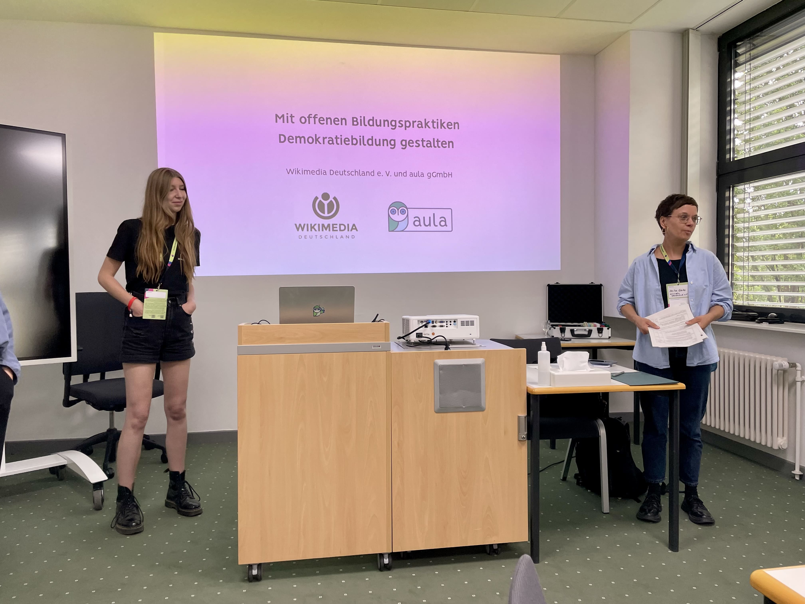
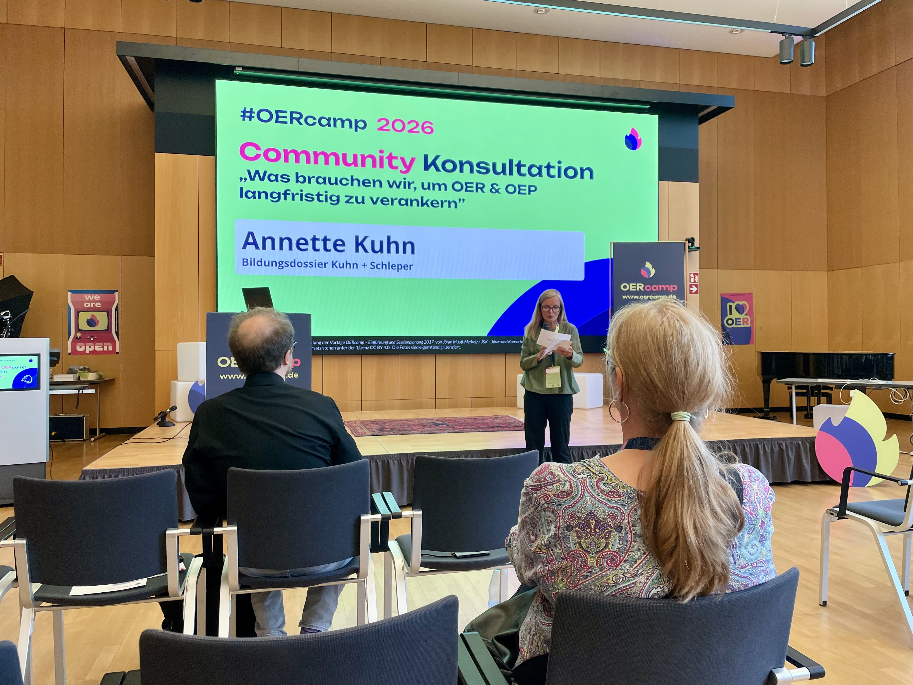
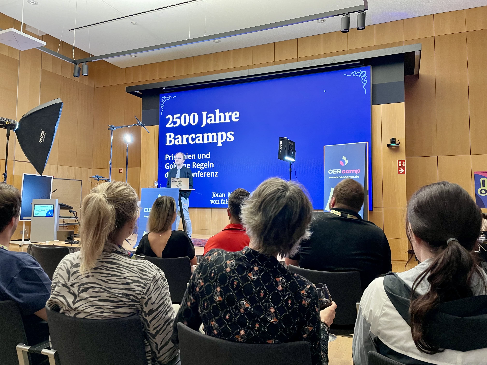
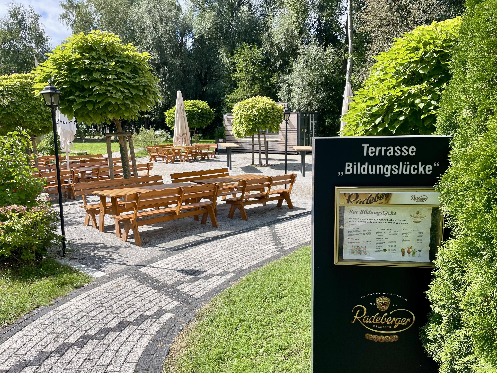
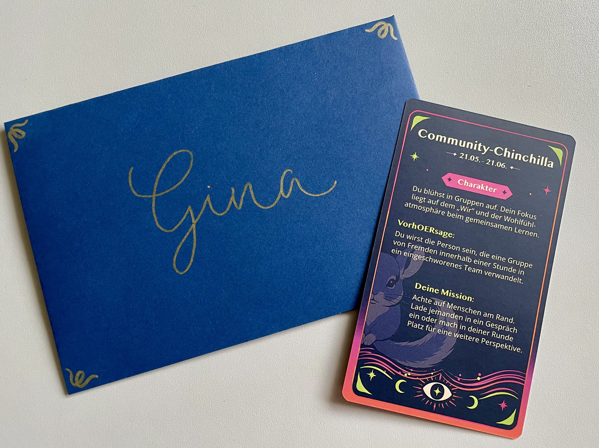

---
# commonMetadata
'@context': https://schema.org/
creativeWorkStatus: Published
type: LearningResource
name: 'Zwischen OER, Demokratie und Pirat:innen – Eindrücke vom OERcamp 2026'
description: 'Ein Wochenende voller Impulse, Diskussionen und neuer Ideen und dazwischen ganz viel schöne Natur: Das OERcamp 2026 in Erkner hatte einiges zu bieten. Auch das FOERBICO-Team war vertreten: Gina war mit dabei und nimmt euch in diesem Blogbeitrag mit auf ihre Eindrücke, Diskussionen und die Fragen, die sie vom Wochenende mitgenommen hat.'
license: https://creativecommons.org/licenses/by/4.0/deed.de
id: https://oer.community/OERcamp-2026
creator:
  - givenName: Gina
    familyName: Buchwald-Chassée
    type: Person
    affiliation:
      name: Comenius-Institut
      id: https://ror.org/025e8aw85
      type: Organization
inLanguage:
  - de
about:
  - https://w3id.org/kim/hochschulfaechersystematik/n0
learningResourceType:
  - https://w3id.org/kim/hcrt/text
  - https://w3id.org/kim/hcrt/web_page
image: https://oer.community/Gina-OERcamp.jpeg
educationalLevel:
  - https://w3id.org/kim/educationalLevel/level_A
datePublished: 2026-09-01
tags:
  - Open Educational Resources (OER)
  - Open Educational Practices (OEP)
  - Barcamp
  - FOERBICO in Kontakt
  - OER-Community
  - OERcamp

# staticSiteGenerator
author:
  - Gina Buchwald-Chassée
title: 'Zwischen OER, Demokratie und hOERoskop – Eindrücke vom OERcamp 2026'
cover:
  relative: true
  image: Gina-OERcamp.jpeg
  hiddenInSingle: false
summary: >-
  Ein Wochenende voller Impulse, Diskussionen und neuer Ideen und dazwischen ganz viel schöne Natur: Das OERcamp 2026 in Erkner hatte einiges zu bieten. Als Teil des FOERBICO-Teams war Gina vom Comenius-Institut vor Ort und hat nicht nur an verschiedenen Sessions teilgenommen, sondern auch selbst einen Einblick in das Projekt und die Arbeit an offenen Bildungsinfrastrukturen gegeben. Im Blogbeitrag schildert sie ihre Eindrücke und die Fragen, die sie vom OERcamp mitgenommen hat.
url: OERcamp-2026
keywords:
  - Open Educational Resources (OER)
  - Open Educational Practices (OEP)
  - Barcamp
  - FOERBICO in Kontakt
  - OER-Community
  - OERcamp
---

Ein Wochenende voller Impulse, spannender Diskussionen, neuer Ideen und dazwischen viel schöne Natur: Das OERcamp 2026 in Erkner hatte einiges zu bieten. Auch das FOERBICO-Team vom Comenius-Institut war vor Ort und brachte eigene Perspektiven auf offene Bildungspraktiken und Bildungsinfrastrukturen mit. Dabei zeigte sich schnell: Beim OERcamp ging es um weit mehr als die Frage, wo gute freie Bildungsmaterialien zu finden sind. Es ging um Beteiligung, Lernkultur, Community, technische Infrastrukturen und um die Frage, welche Rahmenbedingungen es eigentlich braucht, damit Offenheit funktionieren kann.

## Let the OERcamp begin 🚀

Seit 2012 bringen die OERcamps Menschen aus der Welt der Offenen Bildung zusammen. Das Besondere: Ein OERcamp ist kein klassischer Kongress mit fertig geplantem Programm. Es ist ein Barcamp, bei dem die Teilnehmenden gleichzeitig Teilgebende sind und das Programm selbst gestalten. Nach einer kurzen Eröffnung ging es deshalb direkt ans gemeinsame Machen, Diskutieren und Ausprobieren.

## Mit offenen Bildungspraktiken Demokratiebildung gestalten 💬

Wann ist Bildung tatsächlich offen und wann sieht sie nur so aus? Mit dieser Frage beschäftigte sich ein Workshop von [Wikimedia](https://www.wikimedia.de/) und [Aula](https://www.aula.de/) zu Open Educational Practices (OEP) und Demokratiebildung. Im Mittelpunkt standen zwei konkrete Szenarien aus dem Schulalltag und einem Projekttag.

Beim Szenario Schulalltag wurde deutlich: Wenn Schüler:innen zwar scheinbar mitentscheiden dürfen, die Grenzen und Möglichkeiten ihrer Beteiligung aber nicht transparent sind, kann schnell der Eindruck von Scheinbeteiligung entstehen. **Partizipation braucht also Offenheit, aber auch klare Rahmenbedingungen.** Moderation und fachliche Impulse können dabei helfen, einen offenen Prozess zu gestalten.

Beim Projekttag zeigte sich ein weiteres Problem: Obwohl OER-Materialien verwendet wurden, war der Lernprozess vollständig hierarchisch vorgegeben, sogar bis hin zu den erwarteten Ergebnissen. Ein bisschen erinnerte das an „Verteidigung gegen die dunklen Künste“ aus *Harry Potter und der Orden des Phönix*: Alles wird theoretisch gelernt, aber eigene Erfahrungen und echtes Ausprobieren sind nicht vorgesehen. Oder, für alle Nicht-Harry-Potter-Fans, an die berühmte Umgehungsstraßen-Szene aus *Per Anhalter durch die Galaxis*: Die Menschen hätten theoretisch die Möglichkeit gehabt, die Pläne einzusehen, wussten aber gar nicht, dass diese Möglichkeit bestand. Daran zeigt sich: 

**Offenheit auf dem Papier ist eben noch keine echte Beteiligung. Der Einsatz von OER-Materialien allein macht noch keine offene Bildungspraxis.**

## Community-Konsultation: Was brauchen wir, um OER & OEP langfristig zu verankern? 🤔

Was würde passieren, wenn OER-Projekte nicht mehr gefördert werden? Wo würden wir in zehn Jahren stehen? Mit diesen Reflexionsfragen startete die von Anette Kuhn moderierte Community-Konsultation. An verschiedenen Posterwänden wurde darüber diskutiert, was es braucht, damit OER und OEP langfristig Wirkung entfalten können.

Dabei ging es unter anderem um das Zusammenspiel von **Technik und Didaktik**, um bessere Rahmenbedingungen für Lehrkräfte, rechtliche Beratung und professionelle Community-Strukturen. Auch die Frage, wie aus Nutzenden Mitwirkende werden können, spielte eine wichtige Rolle. Ein weiterer Schwerpunkt war die Nachhaltigkeit: Wer kümmert sich um veraltete Materialien, kaputte Links oder notwendige Aktualisierungen? Diskutiert wurden unter anderem Kümmerpersonen für Materialien, Community-Redaktionen und KI-gestützte Werkzeuge zur Qualitätssicherung.

Eine vielleicht noch grundlegendere Frage stand am Ende: **Muss OER überhaupt das Ziel sein?** Oder sollte es vielmehr darum gehen, welche Bildungsprobleme gelöst werden sollen – und OER dafür als Werkzeug einzusetzen?

## „2500 Jahre Barcamp“ 🎤

Danach wurde es historisch – zumindest auf den ersten Blick.
Jöran Muuß-Merholz nahm die Teilnehmenden in seinem Vortrag „2500 Jahre Barcamp“ mit auf eine humorvolle Reise durch die zehn goldenen Regeln des Barcamps. Unterstützt wurde das Ganze von wunderbar zweckentfremdeten Zitaten von Aristoteles, Britney Spears, Angela Merkel und vielen weiteren Prominenten. Natürlich alles mit einem Augenzwinkern.

Der Vortrag wurde aufgezeichnet und soll demnächst veröffentlicht werden. Reinschauen lohnt sich!

## Nächster Tag: Sessions, Sessions, Sessions 🤯

Der zweite Tag startete mit Grußworten. Detlef Reuter vom Bundesministerium für Bildung, Familie, Senioren, Frauen und Jugend (BMBFSFJ) brachte dabei einen Gedanken auf den Punkt, der auch für viele Diskussionen des Tages relevant war:

> „Es geht nicht um mehr Materialien, sondern um eine Veränderung von Lernen und Lehren.“

Auch Lutz Möller von der UNESCO würdigte die [OER-Strategie](https://www.oer-strategie.de/) des Bundes und benannte KI als internationalen Brennpunkt für Chancen und Herausforderungen von OER. Außerdem gab es bereits eine Einladung zum nächsten [OERcamp.global](https://oercamp.de/veranstaltungen/global-2027/) am 23. & 24. Februar 2027, das online stattfinden wird. Danach ging es in die Sessions und davon gab es reichlich!

## Die „verbotene OER“ - Was können wir von Pirat:innen lernen?🏴‍☠️

Die Ausgangsthese der Session: „Gute OER“ sind korrekt lizenziert, sauber kuratiert und auf offiziellen Plattformen zu finden. Trotzdem greifen Menschen im Alltag häufig lieber auf Google-Bilder, Screenshots aus Büchern oder geteilte Dateien zurück. Warum? Weil diese Wege schnell und unkompliziert sind.

**Die Praxis ist schneller als die offizielle OER-Infrastruktur.**

Genau hier liegt eine zentrale Herausforderung: Wenn der offene und legale Weg komplizierter ist als der nicht ganz legale, wird er im Alltag kaum die erste Wahl sein. Diskutiert wurde deshalb, wie Usability, Rechtssicherheit und Qualität verbessert werden können. Könnte beispielsweise eine automatische Quellenfunktion beim Copy & Paste helfen? Wie lässt sich mit KI-generierten oder veränderten Materialien umgehen? Und wie viel Aufwand darf die Veröffentlichung eines Materials verursachen?

Vielleicht braucht es nicht immer mehr Materialien, sondern solche, die wirklich gut nutzbar, schnell auffindbar und direkt einsetzbar sind.

## Teilen ist keine Charakterfrage, sondern eine Strukturfrage 🏫

Wie lässt sich eine Kultur des Teilens im Schulalltag etablieren?
Gerade in Schulen wird häufig hinter verschlossenen Türen gearbeitet. Jede:r erstellt eigene Materialien, das Rad wird immer wieder neu erfunden. Gleichzeitig ist die OER-Welt für viele Lehrkräfte so groß und unübersichtlich, dass der Einstieg schwerfällt. Vertrauen, Zeit, Wertschätzung, Rechtssicherheit und eine positive Fehlerkultur können dabei helfen, Hemmungen abzubauen. Ein spannender Ansatz waren pädagogische Tage, an denen Kolleg:innen gemeinsam OER entwickeln. So entstehen Materialien nicht allein, und auch die Veröffentlichung wird zur gemeinsamen Aufgabe. Vielleicht braucht es deshalb weniger den Appell **„Teilt mehr!“** und mehr Räume, in denen gemeinsames Erstellen und Teilen selbstverständlich werden.

## Was tun, wenn’s extrem wird? ⚠️

Offene Bildung bringt viele Chancen mit sich. Aber Offenheit kann auch ausgenutzt werden. In der Session „Was tun, wenn’s extrem wird?“ ging es deshalb um den Umgang mit Extremismus in offenen Bildungsräumen. Diskutiert wurde, wo Moderation und Qualitätskriterien notwendig sind, wie Lehrkräfte geschützt werden können und wie mit dem Vorwurf der „Zensur“ umzugehen ist. Für offene Communities ist das eine schwierige Balance. Offenheit bedeutet nicht, alles unwidersprochen stehen lassen zu müssen.

Neben Community-Regeln und How-tos für Demokratiebildung wurde auch über eine stärkere Zusammenarbeit mit der Zivilgesellschaft gesprochen.

## OER-Community informieren, motivieren und erreichen 📨

Wie erreicht man Menschen nicht nur mit Informationen, sondern mit Lust aufs Mitmachen? Auch Newsletter, offene Sprechstunden und Blogbeiträge waren Thema. Dabei zeigte sich: Zu viele Informationen können schnell überfordern, zu wenige gehen unter. Offene Formate bieten dagegen die Möglichkeit, gleichzeitig Wissen zu vermitteln und neue Verbindungen innerhalb der Community zu schaffen. Ein Gedanke aus der Diskussion: **Eigentlich braucht es eine Community-Management-Community.** Denn Vernetzen, Moderieren, Informieren und Motivieren will gelernt und gemeinsam weiterentwickelt werden.

## Von der Forschung ins Klassenzimmer 🧑‍🏫

Wie werden aus wissenschaftlichen Erkenntnissen Materialien, die im Schulalltag tatsächlich funktionieren? Das Transferproblem zwischen Wissenschaft und Praxis ist bekannt: Es entstehen gute Module und Fortbildungen, die aber nicht unbedingt zum Alltag von Lehrkräften passen. Vielleicht lautet die entscheidende Frage deshalb nicht immer: **„Wie können wir das Material noch besser machen?“**, sondern vielmehr: **„Welche Räume brauchen Menschen, damit sie damit arbeiten können?“**

Statt immer mehr und immer perfektere Materialien zu produzieren, könnte es sinnvoller sein, stärker auf kleine Impulse und gemeinsames Weiterentwickeln zu setzen – beispielsweise über Mikrofortbildungen im Kollegium.

## Just calling it open is not enough 🌐

Natürlich durfte auch FOERBICO nicht fehlen. In der Session zu öffentlichen Bildungsinfrastrukturen und ersten Lösungsansätzen mit Nostr ging es um die Frage, wie sich die bestehenden Plattform- und Infrastruktursilos überwinden lassen.

FOERBICO beschäftigt sich mit der Förderung offener Bildungspraktiken in religionsbezogenen Communities. Eine zentrale Idee ist dabei ein **dezentraler Community-Hub im Sinne einer „Community of Communities“**.

Denn viele OER-Angebote sind aktuell auf unterschiedliche Plattformen und Hubs verteilt. Edufeed setzt hier auf das offene Nostr-Protokoll: Profile, Inhalte und Speicherorte können voneinander getrennt werden. So sollen Informationen plattformübergreifend auffindbar und teilbar werden.

Damit entstehen allerdings auch neue Fragen: Wie kommen Informationen zu Edufeed? Wer entscheidet, welche Inhalte vertrauenswürdig sind? Was passiert, wenn Inhalte auf der ursprünglichen Plattform verschwinden? Und wie lässt sich Qualität in einer dezentralen Infrastruktur sichern?

Mehr zum Thema gibt es im [Blogbeitrag auf OERinfo](https://open-educational-resources.de/oeffentliche-bildungsinfrastrukturen-huerden-und-erste-loesungsansaetze-mit-nostr/).

Weitere Informationen zu FOERBICO gibt es unter [oer.community](https://oer.community/). Der Austausch zu Edufeed findet außerdem im offenen [Element-Raum](https://matrix.to/#/#edufeed:rpi-virtuell.de) statt.

Da es unmöglich ist, bei einem OERcamp alle Sessions gleichzeitig zu besuchen, lohnt sich auch ein Blick in das vollständige [Programm des OERcamp 2026](https://go.oercamp.de/berlin-2026/schedule/).

## Get together, Networking & Funtime 🎉

Bei all den spannenden Diskussionen darf ein entscheidender Teil des OERcamps nicht fehlen: **die Menschen.**

Was solche Veranstaltungen besonders macht, ist nicht nur das Programm. Es sind die Gespräche auf dem Flur, spontane Diskussionen, bekannte Gesichter und neue Kontakte.

Auch das Team von Jöran & Konsorten hatte wieder allerlei kreative Aktionen vorbereitet: Makramee, eine eigene Buttonstation, ein persönliches HOERoskop und vieles mehr.

So ging es am Ende nicht nur mit neuen Ideen nach Hause, sondern vielleicht auch mit einem selbst bedruckten T-Shirt, einem Button und jeder Menge neuer Kontakte.

## Ausblick: Nächste Veranstaltungen 🗓️

Wer jetzt Lust auf mehr OERcamp bekommen hat, kann sich direkt die nächsten Termine vormerken:

* **[OERcamp How-to-Barcamp (auch für Schule!)](https://oercamp.de/veranstaltungen/howto-barcamp-hamburg-2026/)** – 19. September 2026, 9–17 Uhr in Hamburg
* **[OERcamp bei der TUN-Konferenz](https://oercamp.de/veranstaltungen/dortmund-2026/)** – 2. Dezember 2026, 9–16 Uhr in Dortmund
* **[OERcamp.global](https://oercamp.de/veranstaltungen/global-2027/)** – 23. und 24. Februar 2027, online

Diese und weitere Veranstaltungen gibt es auf der Seite des [OERcamp](https://oercamp.de/veranstaltungen/). Weitere Informationen zu Offenen Bildungsmaterialien finden sich bei [OERinfo](https://open-educational-resources.de/).

Weitere Einblicke von Teilnehmenden gibt es unter **#OERcamp**, vor allem auf Mastodon und LinkedIn sowie im [Blogbeitrag vom OERcamp](https://oercamp.de/2026/09/02/drei-tage-offene-bildung-rueckblick-auf-das-oercamp-2026-in-berlin/).

Vielen Dank an das Organisationsteam für ein inspirierendes Wochenende, wir freuen uns schon aufs nächste Mal 💞

