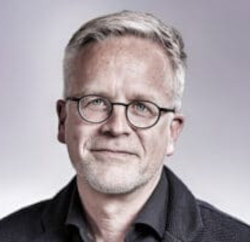
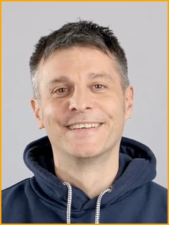
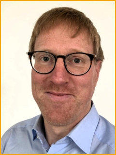
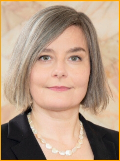
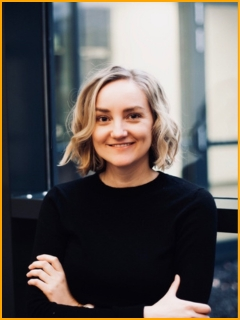
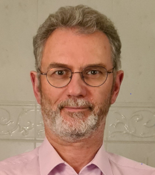
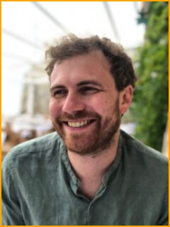

---
# commonMetadata
'@context': https://schema.org/
creativeWorkStatus: Published
license: https://creativecommons.org/licenses/by/4.0/
id: https://oer.community/en/our-team
inLanguage:
  - en
learningResourceType:
  - https://w3id.org/kim/hcrt/text
  - https://w3id.org/kim/hcrt/web_page
educationalLevel:
  - https://w3id.org/kim/educationalLevel/level_A

# staticSiteGenerator
title: Our team
url: en/our-team
weight: 100
---

## Comenius Institute

The Comenius Institute, Protestant Centre for Educational Science, promotes education and training based on Protestant principles. It sees itself as a scientific and research institution, as well as a centre for inspiration and services regarding fundamental questions of Protestant educational practice.

Further Information: [Comenius-Institut](https://comenius.de/)

**Dr. Jens Dechow**

Dr. Jens Dechow is the director of the Comenius Institute and oversees FOERBICO. He is also responsible for the communication with the funding commission.

Contact: [dechow@comenius.de](mailto:dechow@comenius.de)

**Jörg Lohrer**

Jörg Lohrer is the project coordinator and supports community management. Through his experience in the leadership team of rpi-virtuell and reliab, he has gained knowledge in networking.

Contact: [lohrer@comenius.de](mailto:lohrer@comenius.de)

**Gina Buchwald-Chassée**

Gina Buchwald-Chassée studied communications science and supports the project in community management and is responsible for public relations. She previously coordinated the network schule-evangelisch-digital.

Contact: [buchwald-chassee@comenius.de](mailto:buchwald-chassee@comenius.de)

**Ludger Sicking**

Ludger Sicking studied mathematics and special needs education and works as a software engineer in the automobile industry. He supports FOERBICO in technical and digital processes.

Contact: [sicking@comenius.de](mailto:sicking@comenius.de)

## Goethe-University Frankfurt

The Professorship for Religious Education and Media Didactics from the Goethe University Frankfurt is dedicated to researching and teaching religious education in schools and other educational institutions. It combines traditional approaches to religious education with modern media didactics to improve the teaching of religious content in a digitalized world. The focus is on developing new didactic concepts and promoting reflective media use in the context of religious education.

Further information: [Chair of Religious Education and Media Didactics](https://www.uni-frankfurt.de/78330411/Professur_f%C3%BCr_Religionsp%C3%A4dagogik_und_Mediendidaktik) at the Goethe University

**Prof. Dr. Viera Pirker**

Prof. Dr. Viera Pirker researches, teaches, and heads the Professorship for Religious Education and Media Didactics, focusing on the fields of religious education, interfaith learning, media education, and media didactics. Her work focuses on how religion can be taught in an increasingly digitalised and media-driven world. Prof. Dr. Pirker is also actively involved in numerous research projects and publications.

**Dr. Laura Mößle**

Dr. Laura Mößle holds a doctorate in Religious Education and serves as a research assistant to Prof. Dr. Viera Pirker at the Professorship for Religious Education and Media Didactics, focusing on the fields of religious education, interfaith learning, media education, and media didactics at Goethe University Frankfurt. Her focus in FOERBICO is networking and implementing OER within the scientific community.

Contact: [moessle@em.uni-frankfurt.de](mailto:moessle@em.uni-frankfurt.de)

## Friedrich-Alexander-Universität Erlangen-Nuremberg

The Department of Religious Education and Didactics of Protestant Religious Education at Friedrich-Alexander University Erlangen-Nuremberg (FAU) focuses on the theory and practice of Protestant religious education, as well as questions related to religious education. The focus is on teaching religious content in schools, developing pedagogical models and methods, and researching the processes of religious learning. The aim is to prepare students for reflective and practical work in religious education and to contribute to the further development of this area of education.

Further infromation: [Department of Religious Education](https://www.evrel.phil.fau.de/english-pages/) at the University of Erlangen-Nuremberg

**Prof. Dr. Manfred Pirner**

Prof. Dr. Manfred Pirner is Professor of Religious Education and Didactics of Protestant Religious Education at FAU. His research focuses on religious education, religious socialisation, and intercultural and interreligious education. He extensively addresses questions of religious education in pluralistic societies and the role of religion in the public sphere. He is also involved in the development of innovative didactic approaches for religious education.

Contact: [manfred.pirner@fau.de](mailto:manfred.pirner@fau.de)

**Phillip Angelina**

Phillip is a research assistant to Prof. Dr. Manfred Pirner at the Department of Religious Education and Didactics of Protestant Religious Education / Research Centre for Public Religious Education. His focus in the FOERBICO project is empirical accompanying research.

Contact: [phillip.angelina@fau.de](mailto:phillip.angelina@fau.de)