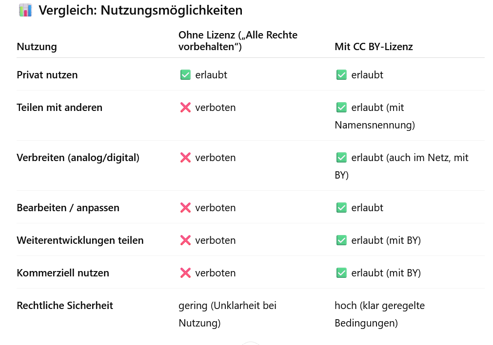
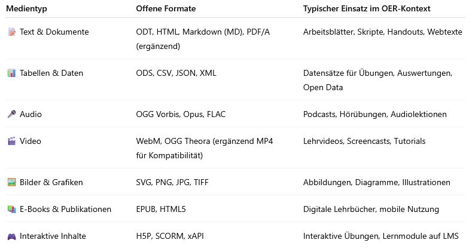

# Das OER-Grundrezept - mit wenigen Zutaten zum offenen Material

Das OER-Grundrezept zeigt dir, wie du mit wenigen, gut verständlichen Schritten eigene offene Lehr- und Lernmaterialien (Open Educational Resources, kurz OER) erstellen kannst. OER sind frei verfügbare Materialien, die du rechtssicher nutzen, anpassen und teilen darfst – ein Gewinn für alle, die Bildung zugänglich und gemeinschaftlich gestalten möchten.

In diesem Selbstlernmodul erfährst du:

➡️ was OER sind und warum sie für Lehre, Schule und Weiterbildung so wertvoll sind,

➡️ welche grundlegenden „Zutaten“ es braucht, um ein Material in ein OER zu verwandeln,

➡️ wie du Schritt für Schritt von der Lizenz über das Format bis zur Veröffentlichung dein eigenes OER backst.

Das OER-Grundrezept richtet sich an Lehrende, Bildungsverantwortliche und Interessierte, die lernen möchten, wie sie ihre Materialien offen teilen und dabei rechtliche Sicherheit, kreative Freiheit und nachhaltige Nutzung verbinden können.

Egal, ob du neu in der OER-Welt bist oder bereits erste Erfahrungen hast – hier bekommst du die wichtigsten Grundlagen, praxisnahe Tipps und hilfreiche Werkzeuge, um dein eigenes OER „nach Rezept“ zu gestalten.

## Was sind eigentlich Open Educational Resources (OER)? 🤔

Open Educational Resources (OER) = freie Lehr- und Lernmaterialien, die unter offenen Lizenzen veröffentlicht werden, um sie rechtssicher und kostenlos benutzen, bearbeiten und durch Dritte weiterzuverarbeiten - ohne oder mit geringfügigen Einschränkungen. 

OER bieten eine verlässliche Basis, die individuell angepasst und kreativ verändert werden kann. Sie sind frei teilbar und bleiben durch Weitergabe und Anpassung aktuell, sodass Wissen und Traditionen nicht verloren gehen. Durch ihre klare Struktur geben sie Sicherheit und erleichtern den Einstieg – wie ein Rezept, das immer gelingt.

## Was beudetet das für OER - die 5 Vs:

„5 V-Freiheiten für Offenheit“ , Grafik von Mark Mulfinger - BadWolfDesign im Auftrag der DHBW in Anlehnung an Julia Eggestein (Grafik), Jöran Muuß-Merholz (inhaltliche Übersetzung, Anpassung und vorsichtige Erweiterung) und Jörg Lohrer (Wortschöpfer)
online abrufbar unter: https://open-educational-resources.de/5rs-auf-deutsch/ 
Lizenz: [CC BY 4.0](https://creativecommons.org/licenses/by/4.0/)

## Wie lautet das Grundrezept von OER, welche Zutaten braucht es?

Damit ein Lern- und Lehrmaterial wirklich offen, rechtssicher und nachnutzbar ist, braucht es ein paar grundlegende „Zutaten“. Genau diese zeigt das OER-Grundrezept.

Das Grundrezept hilft dir, dein Material so aufzubereiten, dass andere es verwenden, anpassen und weiterentwickeln können – und du selbst von der Arbeit anderer profitierst. Du lernst, worauf es bei Lizenzen, Struktur, Formaten, Metadaten und Veröffentlichung ankommt und wie daraus ein rundes, „gelingsicheres“ OER entsteht.

## Das OER-Rezept zum Nachbacken 🍰

🌾 **Mehl: CC-Lizenz**

🧈 **Fett: Modularisierung**

🍯 **Süßungsmittel: Offenes Format**

🥛 **Milch: Metadaten**

🧂 **Backpulver + Prise Salz: Veröffentlichung**

## 🌾 Ohne Mehl keinen Kuchen, ohne Lizenz kein OER! 

Wie das Mehl beim Backen ist die Lizenz die wichtigste Grundlage für jedes OER: Ohne sie hält nichts zusammen und niemand weiß, was erlaubt ist.

In diesem Modul lernst du, warum Lizenzen so wichtig sind und wie du dein Material rechtssicher öffnest. Du erfährst, welche Creative-Commons-Lizenzen (CC-Lizenzen) es gibt, was sie erlauben – und wo Fallstricke lauern können. Außerdem bekommst du praktische Tipps, wie du dein Material korrekt kennzeichnest und so anderen die Nachnutzung erleichterst.

Copyright: [Canva-Lizenz](https://www.canva.com/de_de/richtlinien/onedesign-2/)

### Schritt 1: Rechte & Lizenzen klären 🧑‍⚖️

1. Warum Lizenzen wichtig sind?
2. Welche Lizenzen gibt es?
3. Fallstricke & Tipps
4. Hands-On: Vom Material zum OER mit der richtigen Lizenz

#### 1. Warum sind Lizenzen wichtig?

- **Klarheit & Rechtssicherheit:** CC-Lizenzen regeln Nutzungsmöglichkeiten und erleichtern legales Teilen & Weiterverwenden.

- **Kollaboration:** Sie fördern gemeinsames Arbeiten und den Austausch von Materialien. Form der Netiquette!

- **Teilhabe & Bildungsgerechtigkeit:** Materialien sind frei zugänglich und unabhängig von finanziellen Mitteln nutzbar.

- **Verbreitung & Effizienz:** Vorhandene Inhalte können genutzt und angepasst werden, statt alles neu zu erstellen.

#### 2. Welche Lizenzen gibt es?

Bild Übersicht

CC-Lizenzen im Überblick: https://creativecommons.org

#### 3. Achtung - Fallstricke ⚠️

- **Bild- & Textlizenz getrennt betrachten:** Bildlizenzen können anders sein als Gesamtmaterial (z.B. Gesamtmaterial unter CC-by-Lizenz, aber das Bild unter CC-by-NC-Lizenz) => einzeln ausweisen. Zu beachten: [Schöpfungshöhe bei KI-Generierung](https://open-educational-resources.de/ki-und-oer/) & vertragliche Regelung mit Grafikern zur Bildnutzung unter CC-Lizenzen. 

- **Achtung bei Canva, Pixabay etc.:** Bilder stehen unter Anbieter-Lizenz (z.B. Canva-Lizenz), nicht kompatibel mit OER bzw. CC-Lizenz! Mehr dazu in unserem [Blogbeitrag zu Canva für OER](https://oer.community/canva/).

- **Wirklich CC?** Freie Verfügbar- & Nutzbarkeit ≠ CC-Lizenz. Sie muss extra ausgewiesen werden, ansonsten besteht weiterhin Copyright und Urheber:in muss angefragt werden (schriftliche Freigabe)!

- **Datenschutz & Persönlichkeitsrechte:** Marken- & Persönlichkeitsrechte, Datenschutz oder Patente können zusätzliche Genehmigungen erfordern.

- **Padlet & Task-Cards**: Ein urheberrechtlich geschütztes PDF darf nicht ohne Erlaubnis des Rechteinhabers öffentlich zugänglich gemacht werden – auch nicht in einer TaskCard, wenn diese von anderen eingesehen werden kann! Wenn die TaskCard öffentlich (als ab 2 Personen) zugänglich ist, braucht man eine ausdrückliche Erlaubnis des Rechteinhabers. Für dich privat darfst du ein solches PDF natürlich speichern und nutzen. Auch die TaskCard / Padlet darf nicht-öffentlich verwendet werden.

#### 3. Tipps & Tricks 💡

- **Offene Bilddatenbanken oder eigene Bilder verwenden:** z.B. Openverse, CocoMaterial, Wikimedia Commons oder Google-Suchfilter → Nutzungsrechte → Creative Commons

- **Freie Schriftarten nutzen:** Auch Schriftarten können rechtlich geschützt sein, daher [offene Schriftarten](https://open-educational-resources.de/texte-und-schriftarten/) nutzen z.B. unter [Fontsquirrel](https://www.fontsquirrel.com/)

- **Bild- & Lizenzgenerator** als Unterstützungstools, z.B. https://lizenzhinweisgenerator.de/

- **Unsicher? Rechtsberatung suchen:** z.B. [Rechtsinformationsstelle ORCA.nrw](https://www.orca.nrw/oer/oer-erstellen/rechtsinformation/), [Rechtsfragen-Workshops von twillo](https://www.twillo.de/veranstaltungen/) oder [twillo-Blogbeiträge](https://www.twillo.de/blog/?_blog-filter-cat=rechtliches), [irights.info](https://irights.info/kategorie/themen/bildung-open-educational-resources) oder unser offener Element-Raum “[OER-Rechtsfragen](https://matrix.to/#oer-rechtsfragen:rpi-virtuell.de)” für Fragen & Antworten aus den (religionsbezogenen) Communities

- **Padlet & Task Cards**: Statt das PDF hochzuladen, den offiziellen Link oder die Quelle angeben, wenn es legal online verfügbar ist. Noch besser/sicherer: Nur eigene Materialien oder OER unter offene Lizenzen (z. B. Creative Commons) öffentlich nutzen.

#### 4. Hands-On: Konkret am Material 📝

**Beispielmaterial ohne CC-Lizenz:**

Bild

❌ Ich darf das Material verwahren & vervielfältigen.

❌ Ich darf das Material in verschiedenen Lernsituationen verwenden.

❌ Ich darf das Material weiter verarbeiten & anpassen.

❌ Ich darf das Material mit anderen Inhalten kombinieren & vermischen.

❌ Ich darf das Material weitergeben & verbreiten.

👉 **Fazit:**

- Privatnutzung ist erlaubt (lesen, anschauen, im Unterricht für sich selbst verwenden).

- Keine Weitergabe – weder im Kollegium noch online oder in einer Cloud etc.

- Keine Bearbeitung – selbst wenn man ein Arbeitsblatt anpasst oder aktualisiert, darf man die veränderte Version nicht verbreiten.

- Kein offener Zugang – das Material bleibt im „lokalen Setting“ gefangen.

**Beispielmaterial mit CC-Lizenz:**

Bild

✅ Ich darf das Material verwahren & vervielfältigen.

✅ Ich darf das Material in verschiedenen Lernsituationen verwenden.

✅ Ich darf das Material weiter verarbeiten & anpassen.

✅ Ich darf das Material mit anderen Inhalten kombinieren & vermischen.

✅ Ich darf das Material weitergeben & verbreiten.

👉 **Fazit:**

Ich darf das Material unter Angabe der Lizenz weiterverwenden anpassen & verbreiten.

⚠️ Wichtig bei CC BY: 

Namensnennung: Ich muss immer die Urheber:innen nennen.

**Aufgabenkarte: Mit Lizenz zum OER**

Prüft eure Materialien & haltet Herausforderungen, Gedanken & Ideen fest:

Welche Lizenz würdet ihr vergeben und warum?

Sind Bild- und Textlizenz einzeln ausgewiesen? Muss die z.B. die Bildquelle noch hinzugefügt werden? 

#### Tools - CC-Lizenzen 🛠️

- **Welche CC-Lizenz nehme ich:** Hier können z.B. der [License Chooser von Creative Commons](https://creativecommons.org/chooser/), die [Infografik vom wb-web](https://wb-web.de/material/medien/die-cc-lizenzen-im-uberblick-welche-lizenz-fur-welche-zwecke-1.html) oder unsere [Entscheidungshilfe](https://oer.community/oer-und-oep/handout-cc-lizenzen.pdf) bei der Lizenzauswahl unterstützen. 

- **Wie weise ich CC-Lizenz aus:** Wichtig ist vor allem, DASS eine CC-Lizenz überhaupt ausgewiesen wird. Wo du diese bei deinem OER-Material platzierst – oben, unten, links oder rechts – spielt keine Rolle. Entscheidend ist, dass für (Weiter-)Nutzende klar erkennbar ist, unter welcher Lizenz das Material steht und auf welchen Teil (z. B. Bild, Text oder Gesamtmaterial) sie sich bezieht. Um eine CC-Lizenz auszuweisen, nennen Sie den Urheber, den Titel des Werkes, die spezifische CC-Lizenz und fügen einen Link zum Lizenztext hinzu, also z.B. Selbstlernmodul "OER-Grundrezept", Comenius-Institut e.V. Münster, Lizenz: CC BY 4.0, Lizenztext: https://creativecommons.org/licenses/by/4.0/. Hierbei können der [CC-Stamper von edu-sharing](https://ccstamper.edu-sharing.org) und speziell für den Ausweis von Bildlizenzen der [Bildlizenzgenerator von Jörg Lohrer](https://joerglohrer.github.io/bildmetagenerator/bildlizenzgenerator.html) helfen.

- **Wie nutze ich Canva für OER:** Eine Entscheidungshilfe, wie ich Canva für die OER-Erstellung nutzen kann, findet ihr u.a. im Blogbeitrag "[Canva für OER?](https://oer.community/canva/)".

## 🧈 Fett im Gebäck, einzelne Elemente miteinander verbinden für flexible OER

Du hast nun das „Mehl“ (die Lizenz) als Basis, nun kommt das Fett ins Gebäck: die Modularisierung. Sie sorgt dafür, dass dein Material flexibel, kombinierbar und wiederverwendbar wird.

In diesem Modul lernst du, wie du dein OER in kleine, in sich geschlossene Bausteine zerlegst, die unabhängig voneinander genutzt oder mit anderen Modulen kombiniert werden können. Du erfährst, warum Modularisierung für Anpassbarkeit, Nachnutzbarkeit und kreative Freiheit so entscheidend ist – und worauf du achten musst, damit der „rote Faden“ erhalten bleibt.

Copyright: [Canva-Lizenz](https://www.canva.com/de_de/richtlinien/onedesign-2/)

### Schritt 2: Modularisierung 🧩

1. Warum Modularisierung für OER wichtig ist?
2. Merkmale der Modularisierung bei OER
3. Fallstricke & Tipps
4. Hands-On: Zerlege ein Material in einzelne OER-Bausteine 

#### 1. Warum Modularisierung für OER wichtig ist?

Modularisierung bei OER (Open Educational Resources) bedeutet, dass Bildungsmaterialien so aufbereitet und strukturiert werden, dass sie aus einzelnen, wiederverwendbaren Bausteinen (Modulen) bestehen, anstatt nur als fertige, geschlossene Gesamteinheiten vorzuliegen.

Kernidee: Lehr- und Lernmaterial wird in kleinere, klar abgegrenzte Einheiten zerlegt, die unabhängig voneinander genutzt, kombiniert, angepasst oder weiterentwickelt werden können.

#### 2. Merkmale der Modularisierung bei OER

**Granularität:** Materialien werden in kleine, in sich geschlossene Einheiten aufgeteilt (z.B. ein Arbeitsblatt, ein Video, Bild oder Quiz)
**Wiederverwendbarkeit:** Jedes Modul kann in unterschiedlichen Kontexten eingesetzt werden 
**Flexibilität & Adaptierbarkeit:** Lehrende und Lernende können die Module nach Bedarf zusammenstellen oder anpassen. Die Module lassen sich leicht verändern (z. B. übersetzen, kürzen, erweitern).

#### 3. Achtung - Fallstricke ⚠️

- **Roter Faden/Kontext:** Werden Lerninhalte in zu kleine Fragmente zerlegt, geht ggf. der inhaltliche Zusammenhang verloren. Lernende verlieren die Orientierung, Lehrende müssen Arbeit investieren, um wieder Struktur herzustellen.

- **Metadaten/Beschreibung:** Ohne Angaben zu Thema, Kompetenzen, Zielgruppe oder Niveau sind Module schwer auffindbar und einzuordnen.

- **Didaktische Kohärenz:** Unterschiedliche Sprache, Layouts oder Ansätze der Module verwirren Lernende; ggf. lohnt sich eine Anpassung (sofern die Lizenz das erlaubt).

#### 3. Tipps & Tricks 💡

- **Kompetenzen definieren:** Jedes Modul sollte Kompetenzen ausweisen („Nach Abschluss können Lernende …“). 

- **Einheitlicher Aufbau:** Wiederkehrende Elemente z.B. Einführung – Inhalt – Übung – Reflexion für mehr Konsistenz.

- **Klare Lizenzierung & Beschreibung:** Offene CC-Lizenzen (möglichst CC-BY/CC-BY-SA) & kurze Angaben zu Inhalt/Zielgruppe für eine einfache Nachnutzung.

- **Offene Formate verwenden:** Editierbare Dateiformate (z.B. ODT, H5P, Markdown) bei der Erstellung nutzen, um die Anpassung zu erleichtern.

#### 4. Hands-On: Konkret am Material 📝

**Beispielmaterial PDF ohne CC-Lizenz:**

❌ Ich kann die einzelnen Bausteine/Arbeitsblätter herunterladen.

❌ Das Material ist mit einer CC-Lizenz gekennzeichnet.

❌ Beschreibung, was einzelne Lerneinheiten beinhalten

👉 **Fazit:**
 Ich darf das Material nicht weiterverwenden und habe keinen Zugriff auf die Einzelmodule, nur auf das Gesamtmaterial. 

**Beispielmaterial Einzelmaterialien als Doc mit CC-Lizenz:**

✅ Ich kann die einzelnen Bausteine/Arbeitsblätter herunterladen.

✅ Das Material ist mit einer CC-Lizenz gekennzeichnet.

✅ Beschreibung, was einzelne Lerneinheiten beinhalten

👉 **Fazit:** 
Ich darf das Material weiterverwenden, ich habe Zugriff auf die Einzelmodule und das Gesamtmaterial sowie Beschreibungen, was die jeweiligen Materialien beinhalten.

**Aufgabenkarte: Modularisierung**

Zerlegt ein Material in einzelne OER-Bausteine & haltet Herausforderungen, Gedanken & Ideen fest:

Sind einzelne Module im Material vorhanden? Wie könnte man sie als einzelne Einheiten anbieten und inhaltlich beschreiben?

Welche CC-Lizenz für welche Einheit (Bild, Quiz, Arbeitsblatt...)?

#### Tools - Modularisierung 🛠️

Noch hinzufügen! 

## 🍯 Ohne Süße schmeckt der Kuchen nicht, ohne offenes Format macht die Weiterentwicklung sauer

Nachdem dein Material lizenziert und modular aufgebaut ist, kommt die Süße ins Gebäck: das offene Format. Nur in offenen Formaten kann dein OER wirklich bearbeitet, angepasst und weitergegeben werden – sonst bleibt es starr wie ein trockener Kuchen.

In diesem Modul lernst du, warum offene Formate (z. B. ODT, Markdown, H5P) so wichtig für OER sind und wie sie die Nachnutzung, Barrierefreiheit und Flexibilität erleichtern. Du erfährst, welche Formate sich eignen, welche Fallstricke es gibt und wie du bestehende geschlossene Materialien in offene Formate überführst.

Copyright: [Canva-Lizenz](https://www.canva.com/de_de/richtlinien/onedesign-2/)

### Schritt 3: Offenes Format 📃

1. Warum sind offene Formate für OER wichtig?
2. Welche Möglichkeiten gibt es?
3. Fallstricke & Tipps
4. Hands-On: Vom geschlossenen ins offene Format

#### 1. Warum offene Formate für OER wichtig sind?

**Barrierefreiheit und Zugänglichkeit:** Offene Formate (z. B. ODT, ODS, Markdown etc.) können ohne teure Software genutzt und unabhängig vom Betriebssystem oder Gerät geöffnet werden.

**Nachnutzbarkeit & Bearbeitbarkeit:** OER lebt davon, dass Materialien angepasst, kombiniert und weiterentwickelt werden können, offene Formate erlauben eine einfache Bearbeitung.

**Kompatibilität & Austauschbarkeit:** Offene Formate erleichtern den Austausch von Materialien zwischen unterschiedlichen Plattformen und Tools.

#### 2. Welche Möglichkeiten gibt es?

#### 3. Achtung - Fallstricke ⚠️

- **Komfort & Gewohnheit:** Viele Lehrende sind an proprietäre Formate gewöhnt (z. B. .docx, .pptx). Offene Alternativen wie .odt sind vorhanden, werden aber weniger unterstützt und erfordern Umgewöhnung. 

- **Kompatibilitätsprobleme:** Beim Öffnen in verschiedenen Programmen kann es zu Layoutverschiebungen oder Funktionsverlusten kommen. Besonders komplexe Inhalte (interaktive Elemente, Multimedia) sind in offenen Formaten oft schwieriger abbildbar.

- **Fehlende Kenntnis & Akzeptanz:** Offene Formate sind nachhaltiger, aber kurzfristig ist es einfacher, mit verbreiteten proprietären Formaten zu arbeiten, weil sie “reibungslos” funktionieren.

#### 3. Tipps & Tricks 💡

- **Bearbeitbarkeit ggf. durch “Doppelformat” sichern:** Wenn PDFs veröffentlicht werden auch die Quelldateien (z.B. ODT, ODP, SVG) mitgeben. So können andere wirklich remixen, statt nur „lesen“.

- **Usability bedenken:** Offene Formate können fremd wirken, deshalb klare Hinweise geben, wie sie geöffnet werden & evtl. kurze Anleitungen oder Links zu kostenlosen Programmen hinzufügen.

- **Konvertierung vereinfachen:** Bestenfalls gibt es gemeinsame Absprachen & Standards für die Nutzung von offenen Formaten, sonst kann man mit Konvertierungstools geschlossene in offene Formate überführen (ggf. allerdings mit Layoutproblemen)!

#### 4. Hands-On: Konkret am Material 📝

**Beispiel geschlossen**

👉 **Fazit:** 

**Beispiel offenes Format**

👉 **Fazit:** 

**Aufgabenkarte: Offenes Format**

Wandelt ein geschlossenes Material in ein offenes Format um und haltet Herausforderungen, Gedanken & Ideen fest:

Gibt es bereits Materialien in offenen Fomaten? Wie könnte man die anderen umwandeln?

Wie könnte man Module direkt im offenen Format anbieten?

#### Tools - Offenes Format 🛠️

- **Converter**, z.B. : https://www.freeconvert.com/, https://tools.pdf24.org/de/pdf-converter, https://www.online-convert.com/de => ggf. Formatierungsprobleme
- **Markdown**: Doku zum Workshop beim Projekt KlimaOER: https://oer.community/markdown-einfuehrung-klimaoer/, wer ausprobieren mag: https://t1p.de/MDAusprobieren

## 🥛 Milch macht den Kuchen saftig, Metadaten machen OER reichhaltig

Nach Lizenzierung, Modularisierung und offenen Formaten kommt die Milch ins Gebäck: die Metadaten. Sie geben deinem OER Struktur, Kontext und Auffindbarkeit – ohne sie bleibt dein Material zwar offen, aber schwer nutzbar.

In diesem Modul lernst du, was Metadaten sind, warum sie für OER so wichtig sind und wie du sie richtig anlegst. Du erfährst, welche Standards existieren (z. B. Dublin Core, LOM, schema.org), welche Pflicht- und optionale Angaben sinnvoll sind und wie Metadaten die Suche, Nutzung und Weitergabe deiner Materialien erleichtern.

Copyright: [Canva-Lizenz](https://www.canva.com/de_de/richtlinien/onedesign-2/)

### Schritt 4: Metadaten 🏷️

1. Was sind Metadaten & warum sind sie für OER wichtig?
2. Welche Metadatenstandards gibt es? 
3. Fallstricke & Tipps
4. Hands-On: Füge den Materialien Metadaten hinzu

#### 1. Was sind Metadaten?

**Metadaten** = strukturierte Informationen über den Inhalt, um ihn auffindbar zu machen (quasi „Daten über Daten“). 
Man unterscheidet häufig:

**Formale Metadaten:** Beschreiben eher technische und organisatorische Eigenschaften. Beispiele: Titel, Autor:in, Medientyp (Video, Arbeitsblatt), Sprache, Datum, usw.

**Inhaltliche Metadaten:** Beziehen sich auf die Didaktik & Pädagogik. Beispiele: Lernziele, Zielgruppe, Einsatzszenario, didaktisch-pädagogische Qualitätskriterien, Grad der Interaktivität.

#### 2. Warum sind Metadaten für OER wichtig?

**Auffindbarkeit & Transparenz:** Nur durch Metadaten (z.B. Titel, Autor:in...) können OER in Suchmaschinen, Repositorien oder Plattformen gezielt gefunden werden. Nutzer:innen können einschätzen, ob ein Material aktuell, vertrauenswürdig & passend ist und wie es verwendet werden kann.

**Interoperabilität & Wiederverwendung:** Einheitliche Metadatenstandards ermöglichen Austausch zwischen Plattformen. Dadurch können Materialien leichter kombiniert, angepasst oder in neue Kontexte eingebettet werden.

#### 2. Welche Metadatenstandards gibt es?

- **[Dublin Core (DCMI)](https://www.dublincore.org/):** Einer der ältesten Metadatenstandards mit 15 Basisfeldern (z. B. Titel, Autor:in...).

- **[LOM (Learning Object Metadata)](https://de.wikipedia.org/wiki/Learning_Objects_Metadata):** Für Bildungsressourcen entwickelt mit Kategorien wie Allgemein, Technische Angaben, Pädagogik.

- **[schema.org](https://schema.org/):** Allgemeiner Web-Standard, von Suchmaschinen unterstützt.

- **[Allgemeines Metadatenprofil für Bildungsressourcen (AMB)](https://open-educational-resources.de/tag/allgemeines-metadatenprofil-fuer-bildungsressourcen-amb/):** Für den deutschsprachigen Bildungsbereich entwickeltes Metadatenprofil. Definierte Pflicht- & optionale Felder für formale  & didaktische Metadaten.

#### 3. Achtung - Fallstricke ⚠️

- **Aufwand & Motivation:** Viele Lehrende sehen es als Zusatzarbeit und geben nur das Nötigste an → dadurch sinkt die Qualität und Nachnutzbarkeit.

- **Uneinheitliche Standards:** Metadaten sind durch verschiedene Standards schwer zwischen Systemen austauschbar (Interoperabilitätsproblem).

- **Technische Barrieren & Unvollständigkeit:** Nicht alle Plattformen machen die Eingabe von Metadaten benutzerfreundlich. Teilweise gibt es keine Pflichtfelder oder zu komplexe Eingabemasken.

- **Konsistenz:** Freitextfelder (z.B. Schlagworte) werden unterschiedlich befüllt. Ohne einheitliches Vokabular entsteht „Wildwuchs” & erschwert die Suche.

#### 3. Tipps & Tricks 💡

- **Vorlagen & Checklisten nutzen:** Fertige Metadaten-Templates helfen, nichts zu vergessen. Z.B: https://projekt.oer.community/foerbicometa/metadata-generator.html

- **Automatisierung einsetzen:** Viele Tools (z.B. H5P) erzeugen automatisch Basis-Metadaten wie Erstellungsdatum, Dateiformat...

- **Copy & Paste aus bestehenden OER:** Bei ähnlichen Materialien kann man die Metadaten übernehmen & anpassen. Das spart Zeit und sorgt für Konsistenz.

- **Metadaten im Arbeitsprozess integrieren:** Pflichtangaben wie Titel, Autor:in, Jahr, Lizenz etc. nicht vergessen, damit OER nicht nur offen liegt, sondern auch nutzbar ist.

#### 4. Hands-On: Konkret am Material 📝

**Beispiel ohne Metadaten**

❌ Keine Angabe der Metadaten: 
*Formal:* Autor:in, Medientyp, Datum...
*Didaktisch:* Zielgruppe, Lernzeit, Schwierigkeitsgrad...

❌ Keine Angabe der CC-Lizenz, Weiterverarbeitung &-verbreitung nicht möglich!

👉 **Fazit:** 
Du darfst das Material nur privat nutzen und kannst es ohne Angabe der Metadaten nicht finden & zitieren!

**Beispiel mit Metadaten**

👉 **Fazit:** 

**Aufgabenkarte: Metadaten**

Fügt eurem Material Metadaten hinzu und haltet Herausforderungen, Gedanken & Ideen auf einer roten Karte fest:

Welche Pflichtmetadaten braucht es? Auf welchen Standard sollte man sich einigen?

Wie könnte man die Angabe von Metadaten gut im Arbeitsprozess implementieren?

#### Tools - Metadaten 🛠️

hinzufügen!

## 🧂 Ohne Backpulver geht der Teig nicht auf, ohne Veröffentlichung von OER keine Verbreitung

Nachdem dein OER lizenziert, modular aufgebaut, offen formatiert und mit Metadaten angereichert ist, fehlt nur noch das Backpulver: die Veröffentlichung. Sie sorgt dafür, dass dein Material wirklich genutzt, geteilt und weiterentwickelt wird – sonst bleibt dein OER im „Ofen“ stecken.

In diesem Modul lernst du, wie du dein OER sicher und sichtbar veröffentlichst. Du erfährst, welche Plattformen, Repositorien und Formate sich eignen, welche Fallstricke es bei rechtlicher Sicherheit, Metadaten und Barrierefreiheit gibt und wie du die Verbreitung deiner Materialien langfristig sicherstellst.

Copyright: [Canva-Lizenz](https://www.canva.com/de_de/richtlinien/onedesign-2/)

### Schritt 5: Veröffentlichung 🌐

1. Wie veröffentliche ich mein OER-Material?
2. Wo veröffentliche ich mein Material? Welche Plattformen/OER-Repositorien gibt es? 
3. Fallstricke & Tipps
4. Hands-On: Veröffentliche ein Material auf einer OER-Plattform

#### 1. Wie veröffentliche ich mein OER-Material?

1. **Materialprüfung:** Material inhaltlich, didaktisch & rechtlich prüfen. Fremdmaterial nur mit Lizenzhinweis nutzen, korrekt zitieren.
2. **Lizenzhinweis:** Empfohlen: CC-BY (Namensnennung, sonst freie Nutzung). Eher vermeiden: ND (keine Bearbeitung), sonst Nachnutzung stark eingeschränkt.
3. **Technische Aufbereitung:** Offene, verbreitete Formate nutzen (z.B. ODT). Möglichst barrierearm gestalten (Alt-Texte, klare Struktur).
4. **Plattform/Repositorium auswählen:** Je nach Zielgruppe und Reichweite, über die eigene Homepage hinaus.
5. **Metadaten & Beschreibung hinzufügen:** Mind. Pflichtangaben (z.B. Titel) & kurze Einführung ins Material (Worum geht’s, wofür?).
6. **Verbreitung:** z.B. auf Social Media, im Newsletter oder im Rahmen von Events

#### 2. Wo veröffentliche ich mein OER-Material?

**Deutschsprachige OER-Repositorien:**
*Schule:* z.B. [edu-sharing](https://oer-contentbuffet.info/edu-sharing/components/search) / [WirLernenOnline](https://wirlernenonline.de/), [Mundo](https://mundo.schule)
*Hochschule:* z.B. [OERSI](https://oersi.org/), [twillo](https://www.twillo.de/), Landes- oder Hochschulrepositorien z.B. [ZOERR](https://www.oerbw.de/)
*Fachbezogen:* z.B. [rpi-virtuell](https://rpi-virtuell.de/), [relilab](https://relilab.org/) oder [religionsunterricht.net](https://religionsunterricht.net/) mit Fokus auf Religionspädagogik

**Weitere Möglichkeiten:** 
*Repositorien:* z.B. GitHub/GitLab für Materialien mit Versionierung
*Selbstveröffentlichung:* Eigene Plattform/Webseite, [Moodle-Instanz](https://moodle.org/) oder Nextcloud (wenn frei zugänglich, dann als Share-Link teilbar)
*Dezentraler Datenraum:* auf Basis des Social Media Protokolls [Nostr](https://nostr.com/) / [Edufeed](https://www.edufeed.org/), mehr dazu unter https://oer.community/edufeed-pitch/

#### 3. Achtung - Fallstricke ⚠️

- **Rechtliches:** Fehlende CC-Hinweise & Quellenangaben.

- **Fehlender Kontext & Metadaten:** Materialien ohne Beschreibung oder Einführung wirken schwer nutzbar & ohne Metadaten schwer auffindbar.

- **Nachhaltigkeit & Aktualität:** Materialien werden hochgeladen, aber nie aktualisiert (veraltete Inhalte).

- **Unsicherheit:** Viele Lehrende kennen Lizenzen und Plattformen nicht → Angst vor Fehlern.

- **Zeitaufwand:** Da Plattformen kaum miteinander vernetzt sind, müssen Materialien überall manuell eingetragen werden.

#### 3. Tipps & Tricks 💡

- Materialien mit klarer Beschreibung & in offenen Formaten veröffentlichen + „Didaktische Hinweise“ mitgeben: Wofür eignet sich das Material, wie kann es eingesetzt werden?
- Gleich beim Erstellen darauf achten, nur frei lizenzierte Inhalte zu verwenden → später viel Aufwand gespart.
- Versionierungen nutzen, damit Änderungen nachvollziehbar sind.
- Publikation auf langfristig gesicherten Plattformen (z.B. rpi-virtuell) statt nur auf der eigenen Homepage.
- Materialien explizit als OER kennzeichnen → Vorbildfunktion.
- Verbreitung an relevante Akteur:innen (z.B. über Newsletter/Social Media)

#### 4. Hands-On: Konkret am Material 📝

**Beispiel nur bei sich**

👉 **Fazit:** 

**Beispiel in relilab -> OERSI...**

👉 **Fazit:** 

**Aufgabenkarte - Veröffentlichung**

Wo würdet ihr Materialien veröffentlichen und haltet Herausforderungen, Gedanken & Ideen fest:

Welche Plattformen fallen euch ein? Wie könnte man für die weitere Verbreitung sorgen?

Wie könnte man gut zusammenarbeiten & über die eigene Plattform hinaus denken?

#### Tools - Veröffentlichung 🛠️

## 🎉 Herzlichen Glückwunsch – du hast das OER-Grundrezept geschafft!

Du weißt jetzt, welche grundlegenden Zutaten es braucht, um aus einem Material ein offenes, nachnutzbares OER zu machen: von der Lizenz über Modularisierung und offene Formate bis zu Metadaten und Veröffentlichung.

Wie beim Backen gilt: Je öfter du es ausprobierst, desto leichter und intuitiver wird es. Mit jedem OER, das du erstellst, wächst deine Sicherheit und Kreativität – und du trägst dazu bei, Wissen offen und zugänglich zu machen.

Wenn du Rückfragen hast oder Feedback geben möchtest, melde dich gerne bei:

📧 [Gina Buchwald-Chassée / buchwald-chassee@comenius.de]

💬 Wir freuen uns über deine Ideen, Erfahrungen und Anregungen!