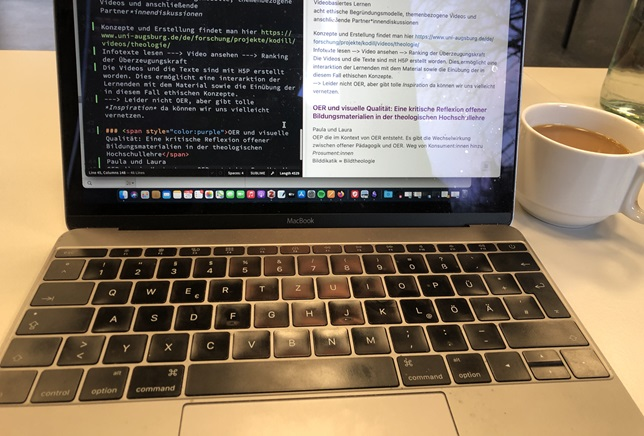
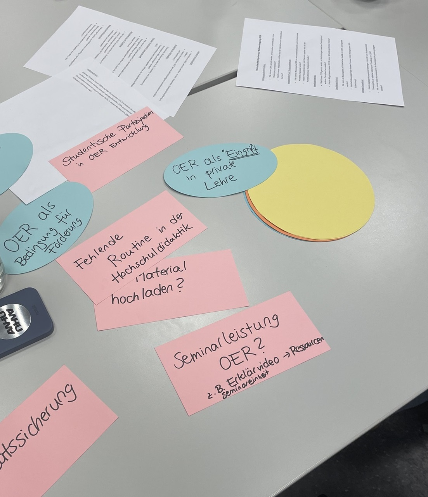

---
#commonMetadata:
'@context': https://schema.org/
creativeWorkStatus: Draft
type: LearningResource
name: 'OER meets Fachdidaktik – Konferenz  Theologie im offenen Raum: OER als Katalysator für Innovation in der Hochschullehre'
description: >-
  Tagungsbericht: Theologie im offenen Raum: OER als Katalysator für Innovation
  in der Hochschullehre. Jahrestagung des Netzwerks Theologie und
  Hochschuldidaktik im Februar 2025
license: https://creativecommons.org/licenses/by/4.0/deed.de
creator:
  - givenName: Laura
    familyName: Mößle
    id: https://orcid.org/0000-0001-5255-8063
    type: Person
    affiliation:
      name: Johann Wolfgang Goethe-Universität Frankfurt
      id: https://ror.org/04cvxnb49
      type: Organization
  - givenName: Paula
    familyName: Paschke
    type: Person
    affiliation:
      name: Johann Wolfgang Goethe-Universität Frankfurt
      id: https://ror.org/04cvxnb49
      type: Organization
  - givenName: Phillip
    familyName: Angelina
    id: https://orcid.org/0000-0002-6905-5523
    type: Person
    affiliation:
      name: Friedrich-Alexander-Universität Erlangen-Nürnberg
      id: https://ror.org/00f7hpc57
      type: Organization
keywords:
  - OER
  - OEP
  - Hochschuldidaktik
  - Theologie
inLanguage:
  - de
about:
  - https://w3id.org/kim/hochschulfaechersystematik/n02
  - https://w3id.org/kim/hochschulfaechersystematik/n03
learningResourceType:
  - https://w3id.org/kim/hcrt/text
educationalLevel:
  - https://w3id.org/kim/educationalLevel/level_A
#staticSiteGenerator:
author:
  - Laura Mößle
  - Paula Paschke
  - Phillip Angelina
title: 'OER meets Fachdidaktik – Konferenz  Theologie im offenen Raum: OER als Katalysator für Innovation in der Hochschullehre'
cover:
  relative: true
  image: Gruppenarbeit_Tagung.jpg
  hiddenInSingle: false
summary: |
  Tagungsbericht: Theologie im offenen Raum: OER als Katalysator für Innovation
  in der Hochschullehre. Jahrestagung des Netzwerks Theologie und
  Hochschuldidaktik im Februar 2025
url: oer-meets-fachdidaktik
---

## Jahrestagung des Netzwerks [Theologie und Hochschuldidaktik](https://www.uni-muenster.de/FB2/aktuelles/OER_Tagung_Netzwerk_Theologie_und_Hochschuldidaktik_2025.html) am 24. und 25. Februar 2025

© KTF | Dekanat

In der Fahrradstadt, in der die Glocken läuten und es fast immer regnet (Münster), kamen Laura Mößle aus dem Projekt FOERBICO (GU-Frankfurt), Paula Paschke aus dem Projekt [TiRU](https://www.uni-frankfurt.de/133803251/Forschungsprojekte_Religionsp%C3%A4dagogik#a_0d817d3d-60a14121) (GU-Frankfurt) und Phillip Angelina aus dem Projekt FOERBICO (FAU Erlangen-Nürnberg) zusammen, um gemeinsam an der Jahrestagung des Netzwerks *Theologie und Hochschuldidaktik* vom 24. bis 25. Februar 2025 teilzunehmen. Grundidee der Veranstaltung war es, mit Fachdidaktiker:innen verschiedener theologischer Disziplinen über die Themen OER und OEP aus hochschuldidaktischer Perspektive zu diskutieren.
Das Spektrum an Vorkenntnissen zu OER der Tagungsteilnehmer:innen war breit: Von OER-Ersteller:innen bis hin zu OER-Neulingen waren Fachdidaktiker:innen verschiedener theologischer Disziplinen aus ganz Deutschland und Österreich angereist.

Die Tagungsgestaltung reichte von einer Einführung in die OER/OEP-Thematik ([ORCA.nrw](https://www.orca.nrw/)), Projektvorstellungen, ([KodiLL](https://www.uni-augsburg.de/de/forschung/projekte/kodill/),[Diskursives Lehren – nachhaltiges Lernen](https://www.ktf.uni-bonn.de/faecher/alt-neues-testament-alt/aktuelles/aktuelles-ressourcen/diskursives-lehren-nachhaltiges-lernen), [TiRu](https://www.uni-frankfurt.de/133803251/Forschungsprojekte_Religionsp%C3%A4dagogik#a_0d817d3d-60a14121), [FOERBICO](https://oer.community)), inhaltlichen Fragestellungen aus der OER-Praxis bis hin zu intensiven Gruppenarbeitselementen, in denen unterschiedliche Zugänge, Perspektiven und Fragen zu OER und OEP zur Sprache kamen.

## OER und Visuelle Qualität

Auch wir durften einen Beitrag mit dem Titel *OER und visuelle Qualität: Eine kritische Reflexion von Open Educational Resources in der theologischen Hochschullehre* präsentieren. Dabei haben wir Fragen aufgeworfen, die sich in unseren Projekten TiRU und FOERBICO ergeben haben und die insbesondere im Hinblick auf die theologische Auseinandersetzung mit Bildkulturen diskutiert werden sollten. Unser Anliegen war: Wie kann eine kritische Auseinandersetzung mit bildbasierten OER in der theologischen Hochschullehre gelingen? 
Unsere Erkenntnisse aus den Projekten FOERBICO und TiRU sind, dass digitale Bildkulturen neue Herausforderungen für die ästhetische Bildung im Kontext von OER darstellen. Enge Lizenzbedingungen für die Erstellung von OER verleiten dazu, auf KI-generierte Bilder oder Stockfotografie zurückzugreifen. Zentrales Anliegen einer neuen Bilddidaktik, die sich an diesen digitalen Transformationsprozessen orientiert, sollte die Entdeckung von Mehrdeutigkeit und Raum für theologische Tiefe ermöglichen. Welche Impulse die theologischen Disziplinen für die Erweiterung einer solchen Bilddidaktik geben können, ist auch in Zukunft noch auszuloten.
Des Weiteren wurde im weiteren Verlauf der Tagung insbesondere mit Blick auf die Hochschullehre diskutiert, ob Kosten-Nutzen von OER-Erstellung in Relation stehen und die Erwartungen mit Blick auf Bildungsverständnis und -gerechtigkeit an OER erfüllt werden können. Immer wieder kehrten wir zu der Kernfrage zurück: *Welchen didaktischen Mehrwert haben OER für die theologische Hochschullehre?*

## Impulse zur Weiterarbeit

Folgende Impulse aus der Tagung haben uns für unsere Weiterarbeit inspiriert:
- OER brauchen weitere didaktische Ausgestaltung. OER allein revolutionieren die Lehrkultur nicht.
- Hier kommt OEP ins Spiel: OEP kann bereits in Seminaren erprobt werden und beginnt nicht erst mit der Veröffentlichung von OER-Materialien.
- OER können auch in kleineren Einheiten gedacht werden, z.B. eine Grafik oder ein Arbeitsblatt, um eine Veröffentlichung und Weiterverarbeitung niedrigschwelliger umzusetzen.   

## OEP als Haltung – Online-Fortbildungsreihe zu OER in der Hochschullehre

In den Gesprächsgruppen kristallisierte sich zunehmend heraus, dass OER allein die Hochschullehre nicht verändern kann. Vielmehr braucht es OEP als Haltung der Lehrenden, die in einer Community of Practice eingeübt und weiterentwickelt werden muss. Diese Erkenntnis deckt sich mit den Ergebnissen der empirischen Begleitforschung im Projekt FOERBICO. Dies wollen wir ernst nehmen und gemeinsam in den verschiedenen Communities angehen! In OEP steckt viel Potenzial, das in Form von Workshops geübt werden kann. 
An dieser Stelle möchten wir direkt auf unsere bald *anstehende Workshop-Reihe zu OER in der theologischen Hochschullehre* verweisen, die sich in drei aufeinander aufbauenden Workshops [Einblick in die Welt von OER](https://relilab.org/oer-werkstatt-fuer-hochschulen-einblick-in-die-welt-von-oer/), [OER finden und bewerten](https://relilab.org/oer-werkstatt-fuer-hochschulen-oer-finden-und-bewerten/) sowie [OER selbst erstellen und teilen](https://relilab.org/oer-werkstatt-fuer-hochschulen-oer-selbst-erstellen-und-teilen/) genau diesem Anliegen widmet. Wir freue uns auf rege Teilnahme und entsprechende Vernetzung in der Fachcommunity!