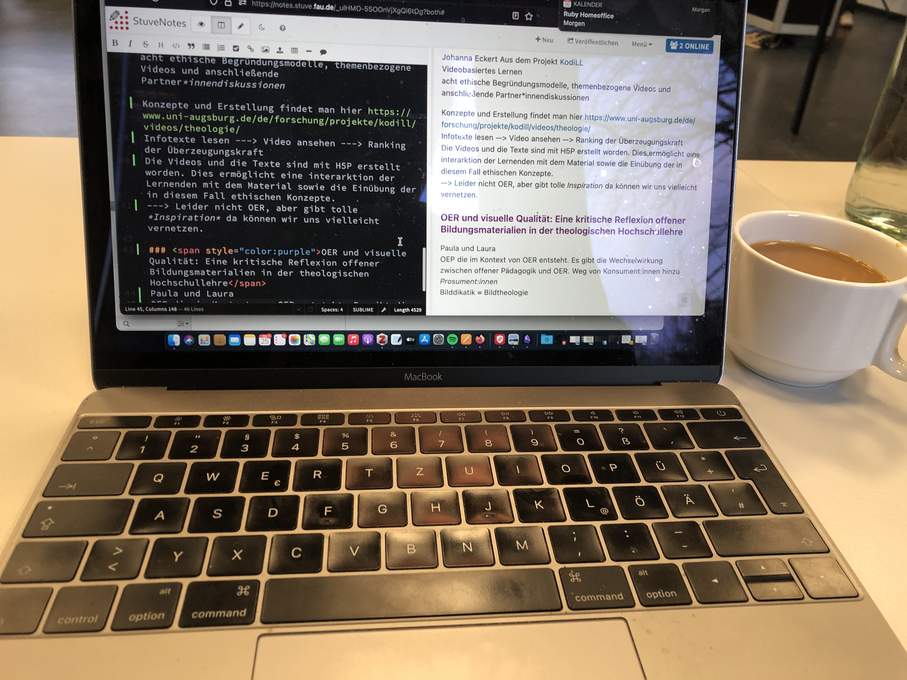
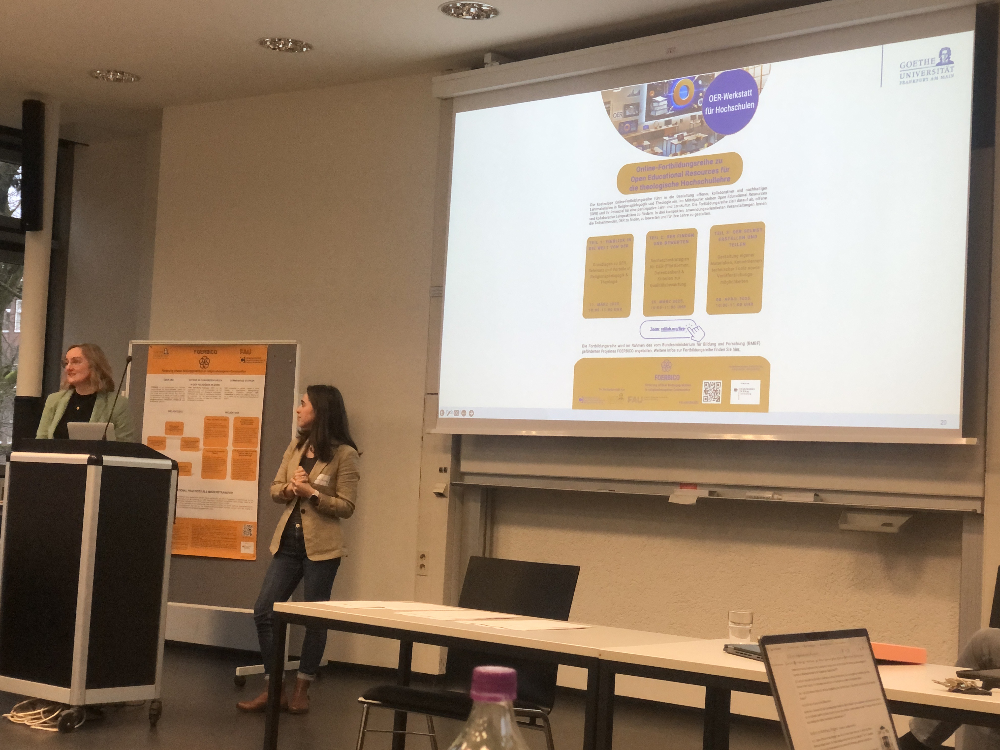
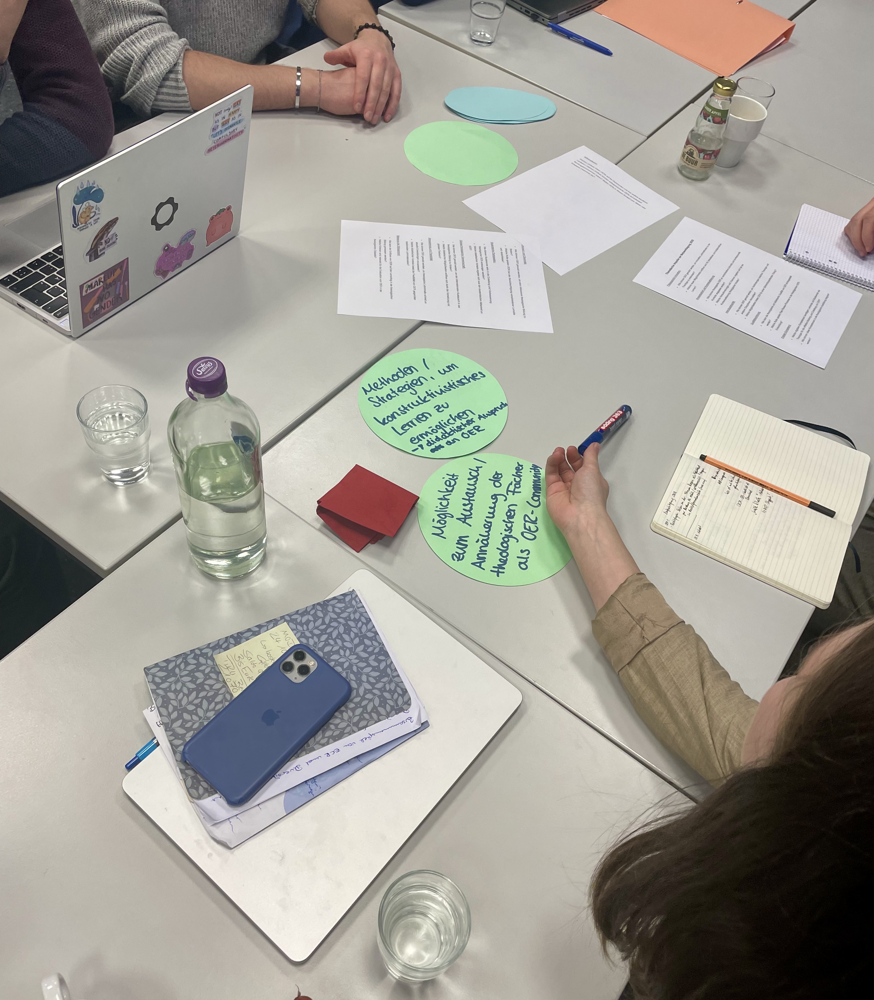

---
#commonMetadata:
'@context': https://schema.org/
creativeWorkStatus: Draft
type: LearningResource
name: 'OER meets Fachdidaktik '
description: >-
  Tagungsbericht: Theologie im offenen Raum: OER als Katalysator für Innovation
  in der Hochschullehre. Jahrestagung des Netzwerks Theologie und
  Hochschuldidaktik im Februar 2025
license: https://creativecommons.org/licenses/by/4.0/deed.de
creator:
  - givenName: Laura
    familyName: Mößle
    id: https://orcid.org/0000-0001-5255-8063
    type: Person
    affiliation:
      name: Johann Wolfgang Goethe-Universität Frankfurt
      id: https://ror.org/04cvxnb49
      type: Organization
  - givenName: Paula
    familyName: Paschke
    type: Person
    affiliation:
      name: Johann Wolfgang Goethe-Universität Frankfurt
      id: https://ror.org/04cvxnb49
      type: Organization
  - givenName: Phillip
    familyName: Angelina
    id: https://orcid.org/0000-0002-6905-5523
    type: Person
    affiliation:
      name: Friedrich-Alexander-Universität Erlangen-Nürnberg
      id: https://ror.org/00f7hpc57
      type: Organization
keywords:
  - OER
  - OEP
  - Hochschuldidaktik
  - Theologie
  - ''
inLanguage:
  - de
about:
  - https://w3id.org/kim/hochschulfaechersystematik/n02
  - https://w3id.org/kim/hochschulfaechersystematik/n03
learningResourceType:
  - https://w3id.org/kim/hcrt/text
educationalLevel:
  - https://w3id.org/kim/educationalLevel/level_A
---
# OER meets Fachdidaktik – Konferenz  Theologie im offenen Raum: OER als Katalysator für Innovation in der Hochschullehre 
## Jahrestagung des Netzwerks [Theologie und Hochschuldidaktik](https://www.uni-muenster.de/FB2/IBET/forschung/projekte/oer-netzwerktagung2025.html) am 24. und 25. Februar 2025

In der Fahrradstadt, in der die Glocken läuten und es fast immer regnet (Münster), kamen Laura Mößle aus dem Projekt FOERBICO (GU-Frankfurt), Paula Paschke aus dem Projekt TiRU (GU-Frankfurt) und Phillip Angelina aus dem Projekt FOERBICO (FAU Erlangen-Nürnberg) zusammen, um gemeinsam an der Jahrestagung des Netzwerks *Theologie und Hochschuldidaktik* vom 24. bis 25. Februar 2025 teilzunehmen. Grundidee der Veranstaltung war es, mit Fachdidaktiker:innen verschiedener theologischer Disziplinen über die Themen OER und OEP aus hochschuldidaktischer Perspektive zu diskutieren.
Das Spektrum an Vorkenntnissen zu OER der Tagungsteilnehmer:innen war breit: Von OER-Ersteller:innen bis hin zu OER-Neulingen waren Fachdidaktiker:innen verschiedener theologischer Disziplinen aus ganz Deutschland und Österreich angereist.

Die Tagungsgestaltung reichte von einer Einführung in die OER/OEP-Thematik ([ORCA.nrw](https://www.orca.nrw/)), Projektvorstellungen, ([KodiLL](https://www.uni-augsburg.de/de/forschung/projekte/kodill/),[Diskursives Lehren – nachhaltiges Lernen](https://www.ktf.uni-bonn.de/faecher/alt-neues-testament-alt/aktuelles/aktuelles-ressourcen/diskursives-lehren-nachhaltiges-lernen), [TiRu](https://www.uni-frankfurt.de/133803251/Forschungsprojekte_Religionsp%C3%A4dagogik#a_0d817d3d-60a14121), [FOERBICO](https://oer.community)), inhaltlichen Fragestellungen aus der OER-Praxis bis hin zu intensiven Gruppenarbeitselementen, in denen unterschiedliche Zugänge, Perspektiven und Fragen zur Sprache kamen.
Wir durften auch einen Beitrag vorstellen mit dem Titel *OER und visuelle Qualität: Eine kritische Reflexion offener Bildungsmaterialien in der theologischen Hochschullehre*. Dabei haben wir Fragen zur Sprache gebracht, die aus unseren Projekten hervorkamen und insbesondere im Hinblick auf theologische Auseinandersetzung mit Bildkulturen diskutiert werden sollten. Unser Anliegen war es: Wie gelingt eine kritische Auseinandersetzung mit bildgestützten OER in der theologischen Hochschullehre? Unsere Erkenntnisse aus den Projekten FOERBICO und TiRu sind, dass digitale Bildkulturen neue Herausforderungen für die ästhetische Bildung im Kontext von OER darstellen: Enge Lizenzbedingungen für die Erstellung von OER verleiten auf das Zurückgreifen von KI-generiertem Bildmaterial oder Stock-Fotografie. Zentrales Anliegen einer neuen Bilddidaktik, die auf diese digitalen Transformationsprozesse hin ausgerichtet ist, sollte die Entdeckung der Vieldeutigkeit und Raum für theologische Tiefe ermöglichen. Welche Impulse theologische Fächer für die Erweiterung einer solchen Bilddidaktik liefern können, gilt es weiterhin zu explorieren.

Des Weiteren wurde im weiteren Verlauf der Tagung insbesondere mit Blick auf die Hochschullehre diskutiert, ob Kosten-Nutzen von OER-Erstellung in Relation stehen und die Erwartungen mit Blick auf Bildungsverständnis und -gerechtigkeit an OER erfüllt werden können. Immer wieder kehrten wir zu der Kernfrage zurück: *Welchen didaktischen Mehrwert haben OER für die theologische Hochschullehre?*

Folgende Impulse aus der Tagung haben uns für unsere Weiterarbeit inspiriert:
- OER brauchen weitere didaktische Ausgestaltung. OER alleine revolutionieren noch keine Lehrkultur.
- Hier kommt OEP ins Spiel: OEP kann schon in den Seminaren erprobt werden und beginnt nicht erst mit der Veröffentlichung von OER-Materialien.
- OER können auch in kleineren Einheiten gedacht werden, wie beispielsweise eine Grafik oder ein Arbeitsblatt, um eine Veröffentlichung und Weiterverarbeitung niedrigschwelliger umzusetzen.  

In den Gesprächsgruppen kristallisierte sich zunehmend heraus, dass OER alleine nicht eine Transformation der Hochschullehre leisten kann. Vielmehr braucht es OEP als Haltung der Dozierenden, die in einer Community of Practice eingeübt und weiter ausgestaltet werden muss. Diese Erkenntnis deckt sich mit den Ergebnissen der empirischen Begleitforschung im FOERBICO-Projekt. Dies wollen wir ernst nehmen und gemeinsam in den verschiedenen Communities angehen! In OEP liegt viel Potenzial, das in Form von Werkstätten praktisch eingeübt werden kann.