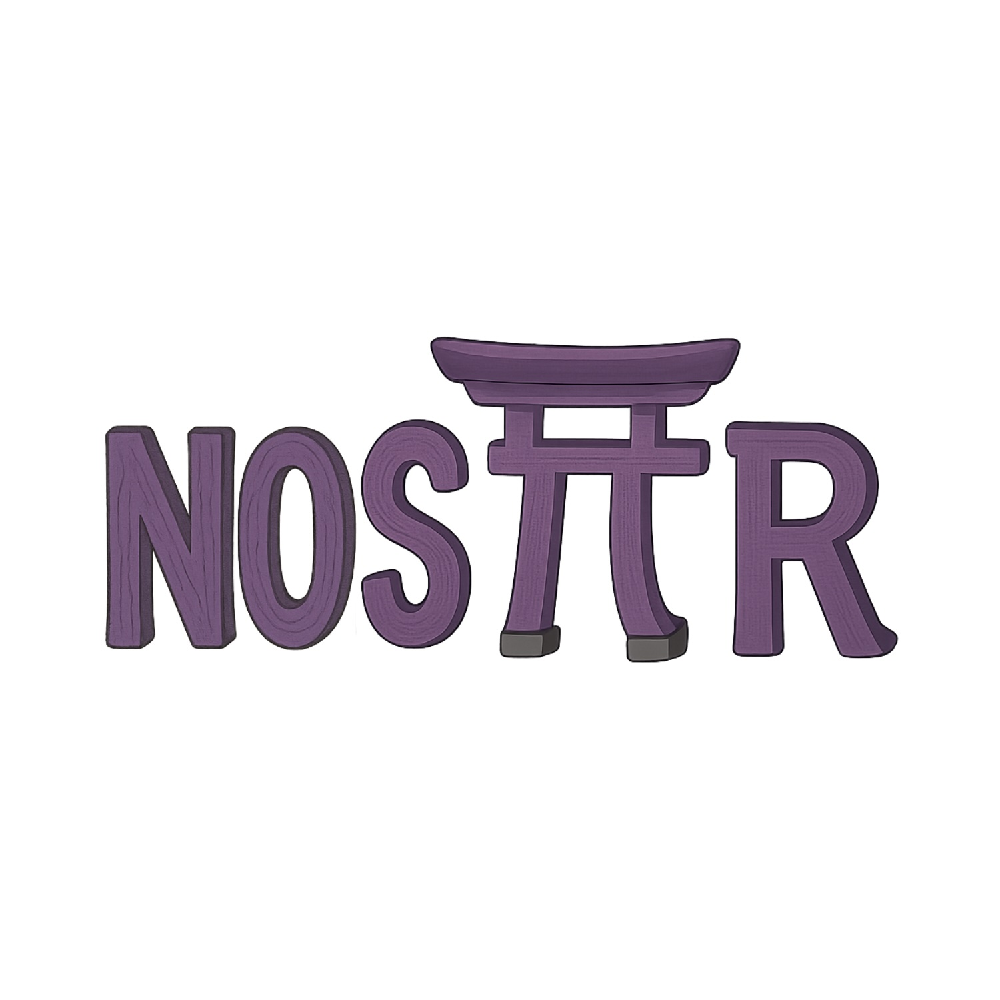

# Die Kraft der Gemeinschaft: Wahre Stärke liegt nicht in Strukturen, sondern in Prozessen

Zur Entwicklung unseres Community-Hubs untersuchen wir im FOERBICO-Projekt, wie langfristig erfolgreiche Kooperationsmodelle gelingen können. Eine wichtige Erkenntnis, die wir bisher gewinnen konnten: Die  Robustheit eines Systems hängt weniger von seinen organisatorischen oder technischen Strukturen ab, sondern vor allem von der Kontinuität und  Anpassungsfähigkeit seiner zugrunde liegenden Prozesse. Wenn wir mit einer Hub-Entwicklung die Bildungscommunities dabei unterstützen wollen, dass ihre Prozesse der OEP (Open Educational Practice) "[alles tragen, allem standhalten und niemals zu Fall kommen](https://offene-bibel.de/wiki/1_Korinther_13#l7)", brauchen wir eine Technik, die die zyklischen Erneuerungsprozesse dieser Communities nachhaltig unterstützt. Lasst uns einen Blick über den Tellerrand wagen und uns Inspiration aus jahrtausendealten Traditionen und Open-Source-Prinzipien schöpfen:

## Prozess statt Bauwerk – Die Kraft der Gemeinschaft am Beispiel des Ise-Schreins

Stell dir vor, du würdest alle 20 Jahre dein Haus abreißen und identisch wieder aufbauen. Verrückt? In Japan passiert genau das seit 1.300 Jahren mit dem Großen Schrein von Ise, dem heiligsten Ort des Landes. Das Geheimnis seiner Beständigkeit liegt also nicht im Bauwerk selbst, sondern im gemeinsamen Ritual seiner Erneuerung.

Nicht das solide Gebäude selbst stiftet  hier die Gemeinschaft, sondern die Zuverlässigkeit ihres kontinuierlichen Bauprozesses. Die Manifestation und Struktur des Schreins unterliegt also einem  steten Wandel, während die Qualität und Verlässlichkeit im Prozess  seiner Erneuerung durch die ritualisierten Abläufe über Generationen hinweg erhalten bleibt.

## Open Source: Liebe als erneuerbares Baumaterial

Clay Shirky beschreibt Open-Source-Projekte wie das Betriebssysten Linux als moderne Entsprechung zum Ise-Schrein: Ihre Beständigkeit beruhe nicht auf kommerzieller Unterstützung, sondern resultiere aus einem "Akt der Liebe" – sie sei getragen von Menschen, die sich umeinander kümmerten und gemeinsam etwas schaffen würden. 

Die entscheidende Frage für die Langlebigkeit eines Systems sei daher nicht die nach dem das Geschäftsmodell, sondern vielmehr: "Kümmern sich die Menschen, die es lieben, umeinander?" Dieser Indikator könnte sich als ein überlegener Prädiktor für nachhaltige Kooperationserfolge und die Langlebigkeit eines Community-Hubs erweisen.

## Unsere digitalen Kathedralen der Bildung
Schauen wir auf unsere Bildungslandschaft, sehen wir oft das Gegenteil: abgeschlossene Plattformen und getrennte Datensilos. Wir bauen digitale Festungen statt lebendige Gemeinschaften.

Anstatt Materialien gemeinsam zu ***v***erwenden, zu ***v***erarbeiten, zu ***v***ermischen, zu ***v***ervielfältigen und zu ***v***erbreiten, bleiben Bildungsmedien in Plattformen gefangen und ***v***erwahrt. Statt offener Kollaboration haben wir Insellösungen. 

## Eine Infrastruktur, die atmet

Was wäre, wenn wir Bildungsinfrastruktur wie den Ise-Schrein denken würden? 
Protokolle wie [Nostr](https://nostr.how/de/what-is-nostr) eigen, wie das technisch möglich wird: dezentral, offen und von der Gemeinschaft getragen.

Das Resultat wäre eine Infrastruktur, die nicht von einzelnen Plattformen, Institutionen oder "Internet-Gebäuden" abhängig ist, sondern von der kollektiven Fürsorge und dem Engagement der Community getragen werden kann – resilient, erneuerbar und offen für alle.

## Mach mit beim Bauen!

Die Geschichte des Ise-Schreins lehrt uns: Das beständigste Fundament sind die Menschen, die sich umeinander kümmern. Lasst uns gemeinsam ein lebendiges Ökosystem für die Bildung schaffen, das uns miteinander in Verbindung bringt!

Hier kannst du mitmachen: 
- Im Matrix [Space OERcommunity](https://matrix.to/#/#oercommunity:rpi-virtuell.de) Offene Räume für Austausch und Experimente
    - vor allem [im Raum "edufeed"](https://matrix.to/#/#edufeed:rpi-virtuell.de), wo wir OER & NOSTR zusammendenken
- auf Nostr
    - [hier eine Starthilfe zur Profilerstellung](https://nstart.me/de?an=Primal&am=light&aa=203a8f&asb=yes&s=npub1k85m3haymj3ggjknfrxm5kwtf5umaze4nyghnp29a80lcpmg2k2q54v05a)
    - Hier ein paar Accounts z.B. von [Jörg](https://njump.me/npub1f7jar3qnu269uyx5p0e4v24hqxjnxysxudvujza2ur5ehltvdeqsly2fx9) oder [Steffen](https://njump.me/npub1r30l8j4vmppvq8w23umcyvd3vct4zmfpfkn4c7h2h057rmlfcrmq9xt9ma)
- GitHub [Edufeed](https://github.com/edufeed-org): Wo wir gemeinsam an der Zukunft bauen

**Inspirationen:**
- [Clay Shirky: Love, Internet Style](https://www.youtube.com/watch?v=Xe1TZaElTAs)
- [Steffen Rörtgen: Just calling it Open is not enough](https://habla.news/u/laoc42@getalby.com/h-k72fOoZmf_SOC3cUpqc)
- [Ise-Schrein – Japanliebe](https://japanliebe.de/alltaegliches/ise-jingu-schrein-neubau-alle-20-jahre/)