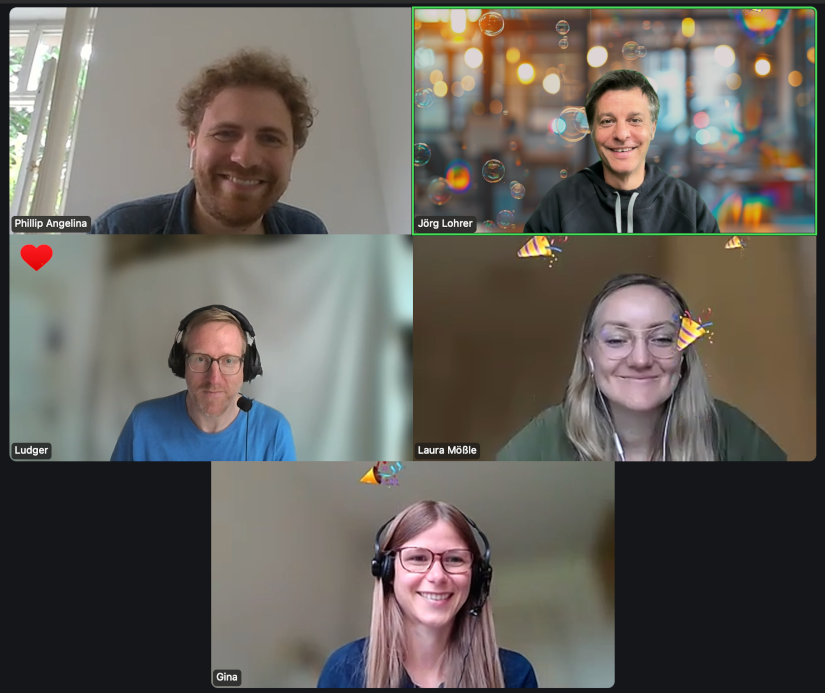
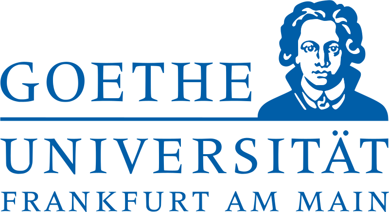

---
#commonMetadata:
'@context': https://schema.org/
creativeWorkStatus: Published
name: Hello World!
description: >-
  Seit 1. Mai 2024 ist das Projekt FOERBICO zur Vernetzung religionsbezogener
  Communities und zur Förderung offener Bildungspraktiken gestartet. Nun ist
  unser interdisziplinäres Team vollständig und wir freuen uns, gemeinsam
  durchzustarten!
license: https://creativecommons.org/publicdomain/zero/1.0/deed.de
creator:
  - givenName: Gina
    familyName: Buchwald-Chassée
    type: Person
    affiliation:
      name: Comenius-Institut
      type: Organization
keywords:
  - Communityaufbau
  - OER
  - Netzwerkbildung
  - Open Education
  - Professionalisierung
  - Qualitätssicherung
  - Religionspädagogik
inLanguage:
  - de
learningResourceType:
  - https://w3id.org/kim/hcrt/text
  - https://w3id.org/kim/hcrt/web_page
datePublished: '2024-08-05'
#staticSiteGenerator:
author:
  - Gina Buchwald-Chassée
title: Hello World!
cover:
  relative: true
  image: FOERBICO-Team.png
  alt: Das FOERBICO Team
  caption: 'Das FOERBICO Team: Phillip, Jörg, Ludger, Laura und Gina'
  hiddenInSingle: true
summary: |
  Seit 1. Mai 2024 ist das Projekt FOERBICO zur Vernetzung religionsbezogener
  Communities und zur Förderung offener Bildungspraktiken gestartet. Nun ist
  unser interdisziplinäres Team vollständig und wir freuen uns, gemeinsam
  durchzustarten!
url: hello-world
tags:
  - Communityaufbau
  - OER
  - Netzwerkbildung
  - Open Education
  - Professionalisierung
  - Qualitätssicherung
  - Religionspädagogik
---

Wir stellen uns vor, wir sind das Team von FOERBICO 👋

FOERBICO ist ein Verbundprojekt des [Comenius-Instituts in Münster](https://comenius.de), der [Goethe-Universität in Frankfurt am Main](https://www.uni-frankfurt.de/de) und der [Friedrich-Alexander-Universität Erlangen-Nürnberg (FAU)](https://www.fau.de/). Das Projekt wird von Mai 2024 bis Ende April 2027 vom [Bundesministerium für Bildung und Forschung (BMBF)](https://www.bmbf.de/bmbf/de/home/home_node.html) im Rahmen der [OER-Strategie](https://www.oer-strategie.de/foerdern/gefoerderte-projekte/foerbico-projektsteckbrief/) des Bundes gefördert.

## Das sind wir:

Unser interdisziplinäres Team ist nun komplett und wir freuen uns, gemeinsam durchzustarten 💪

Erstes Treffen mit dem gesamten FOERBICO-Team am 5. August 2024

## Mit dabei:

### Jörg Lohrer

Jörg ist Projektkoordinator und unterstützt das Community-Management.

### Gina Buchwald-Chassée

Gina unterstützt das Projekt im Community-Management und ist für die Öffentlichkeitsarbeit verantwortlich.

### Ludger Sicking

Ludger hat Mathematik und Sonderpädagogik studiert und arbeitet u. a. als Softwareentwickler im Automobilbereich. Im FOERBICO Projekt
 unterstützt er bei der technischen Umsetzung.

### Dr. Laura Mößle

Laura ist promovierte Religonspädagogin und ist als wissenschaftliche Mitarbeiterin bei Prof. Dr. Viera Pirker an der Professur für Religionspädagogik und Mediendidaktik am Fachbereich Katholische Theologie an der Goethe-Universität tätig. Sie unterstützt FOERBICO bei der Vernetzung und im Community-Aufbau in der Wissenschaft.

### Phillip Angelina

Philipp ist wissenschaftlicher Mitarbeiter bei Prof. Dr. Manfred Pirner am Lehrstuhl für Religionspädagogik und Didaktik des evangelischen Religionsunterrichts / Forschungsstelle für Öffentliche Religionspädagogik. Sein Schwerpunkt im FOERBICO-Projekt ist die Empirische Begleitforschung.

## Gemeinsam möchten wir offene Bildungspraktiken in religionsbezogenen Communities fördern - und zwar so:

- Entwicklung eines Community-Hubs zur Vernetzung bestehender und entstehender religionsbezogener OER-Communities vom Elementarbereich bis zur Erwachsenenbildung

- Experimentier- und Vernetzungsräume zum Erfahrungsaustausch und zur gemeinsamen Entwicklung von Qualitätsstandards & Metadaten

- Entwicklung fachportalübergreifender Daten- & Rdeaktionssysteme, um isolierte Aktivitäten zu verhindern und Anschlussfähigkeit sowie Verbreitung von OER zu fördern

- OER-Entwicklung  an Hochschulen vorantreiben durch Förderung einer OER-Community in der wissenschaftlichen Religionspädagogik & Theologie

- Empirische OER-Creator- & User-Befragungen zur Erhebung von Bedarfen und zur Qualitätsentwicklung von Fortbildungsformaten

## Neugierig geworden?

Wir laden dich herzlich ein, unserem offenen oer.community-Chatraum beizutreten:

Zum [Matrix Space (Raumübersicht)](https://matrix.to/#/#oercommunity:rpi-virtuell.de)

Zum [Matrix Raum (offener Austausch)](https://matrix.to/#/#oer.community:rpi-virtuell.de)

Dazu brauchst du ein Konto bei rpi-virtuell. Wenn du eins hast, kannst du dich einfach mit deinen Zugangsdaten einloggen. Falls nicht, zeigen wir dir hier deinen Weg in die Matrix!
