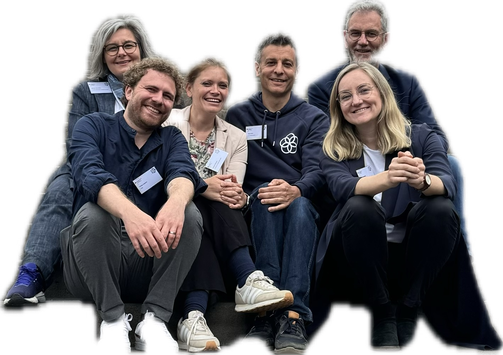
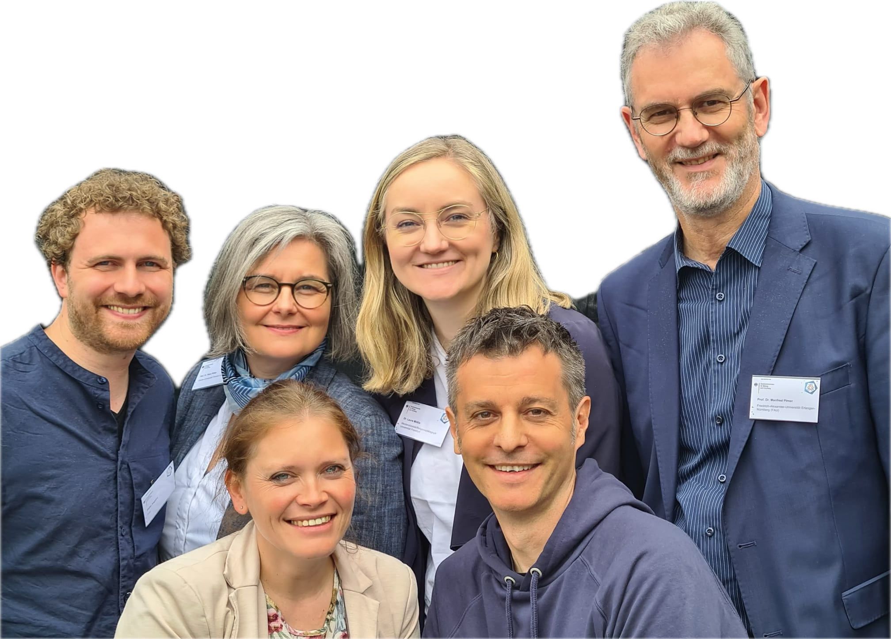

---
#commonMetadata:
'@context': https://schema.org/
creativeWorkStatus: Published
name: 'Rückblick: Auftaktkonferenz „OER im Blick“'
description: >-
  Die Konferenzreihe "OER im Blick" präsentiert alle Aktivitäten rund um die
  Umsetzung der OER-Strategie des Bundes. Dazu kommen einmal im Jahr Beteiligte
  aus den verschiedenen Projekten, dem Kreis der Gutachtenden, den Gremien zur
  Fortentwicklung der Strategie und zusätzliche Impulsgeber zum gemeinsamen
  Austausch zusammen. Das FOERBICO-Team war am 15. und 16. Mai 2024 in Frankfurt
  a.M. mit dabei!
license: https://creativecommons.org/publicdomain/zero/1.0/deed.de
id: >-
  https://git.rpi-virtuell.de/Comenius-Institut/fOERbico/src/branch/main/Blog/2024-08-15-OER-im-Blick.md
creator:
  - givenName: Gina
    familyName: Buchwald-Chassée
    type: Person
    affiliation:
      name: Comenius-Institut
      id: https://ror.org/025e8aw85
      type: Organization
inLanguage:
  - de
about:
image: OER-im-Blick.jpg
datePublished: '2024-08-15'
#staticSiteGenerator:
author:
  - Gina Buchwald-Chassée
title: 'Rückblick: Auftaktkonferenz „OER im Blick“'
cover:
  relative: true
  image: OER-im-Blick.jpg
  hiddenInSingle: true
summary: |
  Die Konferenzreihe "OER im Blick" präsentiert alle Aktivitäten rund um die
  Umsetzung der OER-Strategie des Bundes. Dazu kommen einmal im Jahr Beteiligte
  aus den verschiedenen Projekten, dem Kreis der Gutachtenden, den Gremien zur
  Fortentwicklung der Strategie und zusätzliche Impulsgeber zum gemeinsamen
  Austausch zusammen. Das FOERBICO-Team war am 15. und 16. Mai 2024 in Frankfurt
  a. M. mit dabei!
url: rueckblick-auftaktkonferenz-oer-im-blick
tags:
  - FOERBICO in Kontakt
  - Event
  - OER-Strategie
  - Vernetzung
  - Vernetzung
---

Die Auftaktkonferenz fand am 15. und 16. Mai 2024 in Frankfurt am Main statt und wir von FOERBICO waren frisch zum Start unseres Projektes im Mai 2024 mit dabei 🚀 Erstmals kamen rund 130 Akteurinnen und Akteure aus allen Bildungsbereichen zusammen und es war eine tolle Gelegenheit sich kennenzulernen, unser Projekt vorzustellen und Einblicke in die Projekte der anderen beim Networking zu erhalten. Auch ein Teil unseres FOERBICO-Teams konnte sich das erste Mal persönlich treffen und wir würden sagen, die Chemie stimmt 😉

Einen Rückblick zur Konferenz findet ihr [hier](https://www.oer-strategie.de/konferenz/) oder im [Blogbeitrag](https://ebildungslabor.de/blog/oer-im-blick-ein-buntes-kaleidoskop/) von Nele Hirsch (eBildungslabor). Auch Dr. Manfred Pirner teilte seine Eindrücke bei [Instagram](https://www.instagram.com/p/C7EADFWNrfu/) und [TikTok](https://www.tiktok.com/@mapi_l16/video/7369661151216520480). 

Wir freuen uns schon auf die Konferenz im nächsten Jahr!
