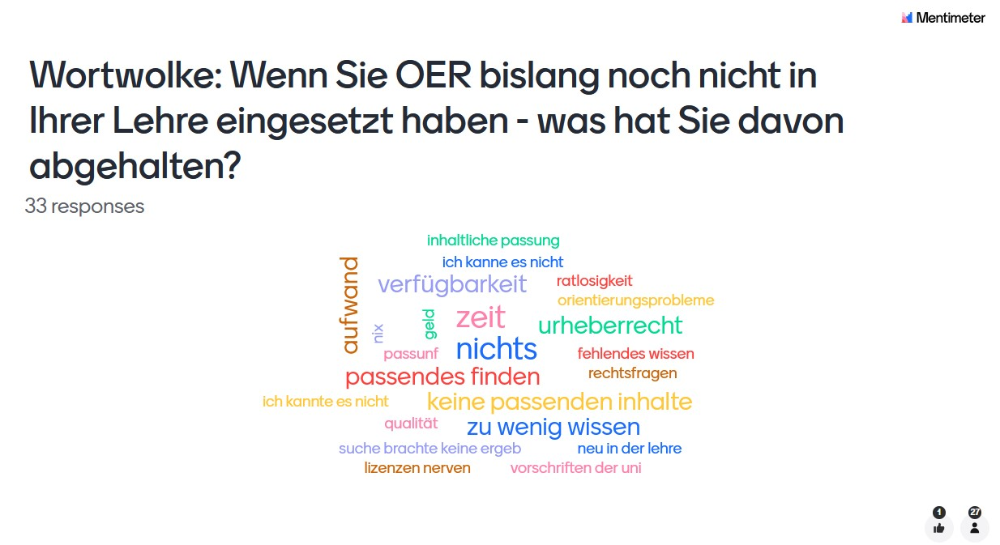
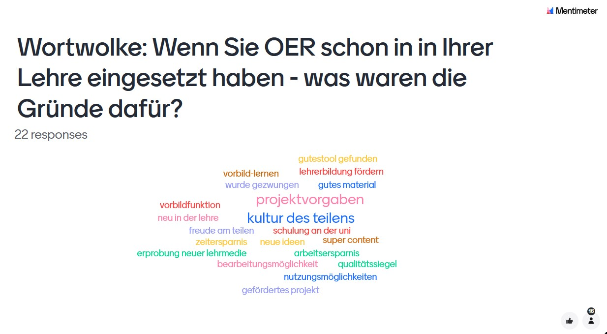

---
#commonMetadata:
'@context': https://schema.org/
creativeWorkStatus: Published
type: LearningResource
name: OER-Fachtag 2024 von ORCA.nrw
description: >-
  Der OER-Fachtag 2024 am 29. August 2024 von ORCA.nrw diente als Treffpunkt für
  OER-Interessierte aus dem Hochschulbereich, um sich über Open Educational
  Resources (OER) auszutauschen. Etwa 100 Personen nahmen teil, darunter auch
  das FOERBICO-Team. Präsentationen und eine detaillierte Dokumentation werden
  bald veröffentlicht. Einen Rückblick zum Fachtag gibt es im Blog von
  oer.community.
license: https://creativecommons.org/publicdomain/zero/1.0/deed.de
id: >-
  https://git.rpi-virtuell.de/Comenius-Institut/fOERbico/src/branch/main/Blog/2024-09-03-OER-Fachtag-Orca.NRW.md
creator:
  - givenName: Gina
    familyName: Buchwald-Chassée
    type: Person
    affiliation:
      name: Comenius-Institut
      id: https://ror.org/025e8aw85
      type: Organization
inLanguage:
  - de
about:
  - https://w3id.org/kim/hochschulfaechersystematik/n0
image: https://cdn.midjourney.com/ca6cf8d4-56c4-46fe-8667-605bdd799cfc/0_0.png
learningResourceType:
  - https://w3id.org/kim/hcrt/text
educationalLevel:
  - https://w3id.org/kim/educationalLevel/level_A
datePublished: '2024-09-03'
#staticSiteGenerator:
author:
  - Gina Buchwald-Chassée
title: OER-Fachtag 2024 von ORCA.nrw
cover:
  relative: false
  image: https://cdn.midjourney.com/ca6cf8d4-56c4-46fe-8667-605bdd799cfc/0_0.png
  hiddenInSingle: true
summary: |
  Der OER-Fachtag 2024 am 29. August 2024 von ORCA.nrw diente als Treffpunkt für
  OER-Interessierte aus dem Hochschulbereich, um sich über Open Educational
  Resources (OER) auszutauschen. Etwa 100 Personen nahmen teil, darunter auch
  das FOERBICO-Team. Präsentationen und eine detaillierte Dokumentation werden
  bald veröffentlicht. Einen Rückblick zum Fachtag gibt es im Blog von
  oer.community.
url: oer-fachtag-2024-von-orca-nrw
tags:
  - FOERBICO in Kontakt
  - Event
  - Open Educational Resources (OER)
  - Hochschulen
  - Gamification
  - Inklusion
  - KI
  - Vernetzung
  - Storytelling
---

*Ein Treffpunkt für Fachcommunities, um sich über Open Educational Resources auszutauschen und voneinander zu lernen. Spannende Einblicke von engagierten OER-Akteuren aus NRW in ihre aktuellen Projekte aus der Praxis.* 

Der OER-Fachtag 2024 wurde von der Geschäftsstelle Landesportal [ORCA.nrw](https://www.orca.nrw/) in Zusammenarbeit mit dem [Netzwerk Landesportal ORCA.nrw](https://www.orca.nrw/vernetzung/community/netzwerk-landesportal/) erstmalig virtuell und fachgebietsübergreifend organisiert. In den vergangenen Jahren haben bereits sechs OER-Fachtage in NRW stattgefunden, allerdings immer nur zu einem Fachgebiet. Einen Rückblick zum Fachtag findet ihr auch im [Blog von ORCA.nrw](https://www.orca.nrw/blog/geschftsstelledeslandesportalsorcanrw/gelungene-premiere-ueber-100-teilnehmende-beim-oer-fachtag-orca-nrw/). Die Präsentationen sowie eine detaillierte Dokumentation wird in Kürze [hier](https://www.orca.nrw/vernetzung/veranstaltungen/oer-fachtag/) veröffentlicht.

Insgesamt haben rund 100 Personen beim diesjährigen Fachtag teilgenommen. Laura und Gina aus dem FOERBICO-Team waren ebenfalls mit dabei und geben euch Einblicke, wie sie den Fachtag erlebt haben:

## Einführung

Nach einer freundlichen Begrüßung eröffnete Dr. Markus Deimann (Geschäftsführer von ORCA.nrw) mit einem Grußwort die Tagung und betonte, dass Open Education eine Schlüsselrolle für die Lehre der Zukunft spielen wird und auch die Vernetzung fördert. Um einen kleinen Eindruck über die Teilnehmenden zu gewinnen, wurde eine kurze Mentimeter-Umfrage durchgeführt. Wenig überraschend war, dass die meisten Personen aus NRW stammten, aber auch aus Süddeutschland und Österreich waren vereinzelt Teilnehmende dabei. Besonders erfreulich war für uns die hohe Beteiligung von Teilnehmenden aus den Geisteswissenschaften, das Interesse an Open Educational Resources (OER) scheint hier groß zu sein!

Besonders spannend waren die Antworten auf die Fragen, was für oder gegen den Einsatz von OER in der Lehre aus Sicht der Teilnehmenden spricht:

Diese Ergebnisse spiegelten sich auch in der anschließenden Keynote „Die Rolle der Communities für die (Weiter-)Entwicklung von OER“ von Prof. Dr. Daniel Otto (EHIP – Europäische Hochschule für Innovation und Perspektive) wider. Die erste Idee von Open Educational Resources und Practices kam erst Anfang der 2000er auf, 2012 fand dann das erste [OER-Camp](https://www.oercamp.de/) statt. Das zeigt: Deutschland beschäftigte sich anfangs schleppend mit dem Thema OER und hat erst seit 2016 Bemühungen in die Richtung intensiviert. Gerade in den letzten Jahren haben OER und OEP aber an Fahrt aufgenommen und an Relevanz gewonnen. Er ging der Frage nach, was OER-Gemeinschaft antreibt und warum sich Leute mit dem Thema beschäftigen, obwohl man sich erstmal ganz schön einarbeiten muss. Seine Erkenntnisse in a nutshell: Weniger die Einstellung, sondern vielfach die mangelnde Verbreitung von OER stellt für viele ein Hindernis dar. Die meisten Gemeinschaften verbindet eine starke Überzeugung der Kernideen von Teilen, Kollaboration etc. und OER als Materialien seien nur ein Vehicle für diese Werte. Das bestätige auch die [Studie](https://www.twillo.de/edu-sharing/components/render/89bad355-8af3-48c3-bf15-aa6163127039) von ORCA.nrw. Für alle Interessierten gibt es dort auch einen [Selbsttest](https://www.orca.nrw/starker-start-ins-studium/fuer-studierende/motivation-und-lernstrategien/moveo/). Zur Frage "Was sollte / kann die Community tun?" nennt er drei Wege:

1. Communities of Practices für Vernetzung und Austausch ([OER World Map](https://oerworldmap.org/) als Beispiel)
2. Scholarship of Teaching & Learning (SoTL) (Beispiel [Publikation](https://www.wbv.de/shop/Partizipative-und-wissenschaftskommunikative-Chancen-der-Digitalisierung-Eine-Mixed-Method-Studie-zu-studentischen-Motiven-in-der-eigenen-Produktion-von-Open-Educational-Resources-HSL2410W))
3. Marsch durch die Institutionen, um strategisch Werbung für OER zu machen (Beispiel: [Bündnis freie Bildung](https://buendnis-freie-bildung.de/))

## Projekt-Spotlights

Im Anschluss folgten Projekt-Spotlights als Parallelsessions mit Einblicken aus der Praxis. Dabei wurden das Projekt „[eKommMed.nrw](https://www.ekommmednrw.uni-bonn.de/)“ von Dr. Jennifer Willms (Universität Bonn) aus dem Bereich Gesundheit & Medizin, das Projekt „AventuraLing: Social Media in der Akademie“ von Dr. Giselle Valman (Universität Bielefeld) aus dem Bereich Sprachwissenschaften & Fremdsprachendidaktik sowie das Projekt „[GamBLe EduCache](https://lwt.mb.tu-dortmund.de/lehre/lehrprojekte/gamble-educache/) – Game-based Learning im strukturierten Selbststudium mit EduCaching “ von Henrik Ulitzka (TU Dortmund) aus dem Bereich Ingenieurswissenschaften vorgestellt. 

### Gina hat sich für das Lernspiel GamBLe EduCache entschieden und teilt hier ihre Eindrücke aus der Session:

Das Lernspiel begleitet Studierende unterschiedlicher Fachdisziplinen in der Studieneingangsphase im strukturierten Selbststudium und der Selbstreflexion sowie in höheren Fachsemestern in der Erstellung studentischer Themen-Caches im Rahmen von Pflichtveranstaltungen. Das Spiel ist somit ein Zusatzangebot und wird ergänzend zur klassischen Lehre mit Vorlesungen etc. angeboten. Ziel ist es, durch den spielerischen Ansatz und dem unmittelbaren Praxisbezug die Studierenden zum kontinuierlichen Lernen zu motivieren. GamBLe EduCache als freiwilliges Angebot mit dem Wettbewerb verschiedener Teams (z.B. "Schlag den Professor") und einer Siegerehrung / Urkundenverleihung wurde bislang gut angenommen und die Studierenden meldeten zurück, dass Inhalte besser verstanden wurden und miteinander verknüpft werden konnten.

Kern des Spiels ist der Erhalt von Ortskoordinaten im Ruhrgebiet über Moodle, z.B. von einem Hochofen in Dortmund. Die Lerninhalte werden dann auf diesen Ort angepasst. Wenn man diesen Hochofen besucht, können durch unterschiedliche Formate wie Podcasts etc. und durch die Wiederholung und Vertiefung von Lerninhalten, die Beantwortung von Fachfragen und die Vorort-Analyse von Werkstoffen, eingesetzten Techniken, räumlichen und historischen Gegebenheiten bis zu fünf Zusatzpunkte für die Klausur erspielt werden. Die Grundidee wurde aus dem Geocaching übernommen. Als Tool wurde das kostenpflichtige Programm [Actionbound](https://de.actionbound.com/) genutzt, davon wolle man sich nun lösen, um dem OER-Gedanken nachzukommen und hat ein Plugin für Moodle entwickelt. Nun können Studierende auch selbst Caches und Materialien erzeugen und so nähre sich das Konzept selbst. Außerdem sollen die Inhalte weniger ortsbezogen sein (z.B. Einführung Hochofen in Dortmund soll auch in Bochum funktionieren, damit Studierende nicht hin- und herfahren müssen). Barrierefreiheit soll sowohl bei der Anreise als auch bei der Materialerstellung (z.B. Schriftgröße) weitergedacht werden. Die erste Praxisphase des weiterentwickelten Lernspiels startet im Wintersemester ab Oktober, die Ergebnisse werden dann nächstes Jahr vorgestellt. 

In der nächsten Session wurden das Projekt „[inklud.nrw](https://www.orca.nrw/oer/oer-finden/oer-bibliothek/inklusion-2-2/kk-inklusion-inklud-nrw/): Verknüpfung von Inklusion und Digitalisierung in der Lehrer:innenbildung“ von Jana Herding, Moritz Knurr (beide Universität Paderborn) und Mona Stets (Universität Bielefeld) aus dem Bereich Lehrkräftebildung, das Projekt „[INNO4S](https://cris.uni-muenster.de/portal/de/project/80502762?lang=de) – Digital Innovation for Sustainable Development“ von Prof. Dr. Tobias Brandt und Dr. Lea Püchel (Universität Münster) aus dem Bereich Wirtschaftswissenschaften sowie das Projekt „Durchblick im Labor: Echtzeit OER-Content im Praktikum ([SmartLabOER](https://www.smartlaboer.de/))“ von Prof. Dr. Joachim Fensterle (Hochschule Rhein-Waal) aus dem Bereich Naturwissenschaften vorgestellt. 

### Gina hat sich für das Projekt inklud.nrw entschieden und teilt hier ihre Eindrücke aus der Session:

Das Projekt inklud.nrw verknüpft mit den Themen Inklusion und Digitalisierung zwei aktuelle Querschnittsaufgaben der Lehrer:innenbildung und führt sie synergetisch über Fallarbeit anhand von Kinder & Jugendlichenportraits in einem hochschuldidaktischen Lehr-/Lernkonzept zusammen. Diese Portraits sind immer gleich aufgebaut und folgen dem "[Vielfaltstableau](https://vielfaltstableau.uni-paderborn.de/)" als Basis für die Materialentwicklung (Tableau wird derzeit weiterentwickelt!). Im Projekt wurden die interdisziplinären Kompetenzen der Mitarbeitenden aus verschiedenen Fachbereichen verzahnt, um inhaltlichen, hochschuldidaktischen, technischen und medienpädagogischen Herausforderungen zu begegnen. Eigene Erfahrungen und Usability-Studien mit Lehrenden und Studierenden haben gezeigt: Die OER-Materialien sind kein Selbstläufer und es bedarf enger und gut begleiteter Seminardiskussionen und Reflexionen (auch innerhalb der eigenen Community). Das Projekt sollte nicht das Ende sein, damit nicht nur ein Materialschrank entstanden ist und so sind die Projekte [InDigO](https://www.uni-paderborn.de/forschungsprojekte/indigo) und nun ganz aktuell das Projekt [PrimOER](https://www.uni-paderborn.de/projekt/1309) entstanden.

inklud.nrw wurde möglichst pluginfrei in Moodle konzipiert (sieht etwas langweilig aus, aber ist fast mit jeder Moodle-Version kompatibel). In den Folgeprojekten werden aber auch andere Lernplattformen wie ILIAS mitgedacht. 

Der Kurs sowie die Materialien sind mit Lesezugang einsehbar unter https://komo.uni-paderborn.de/course/view.php?id=499. 

## Praxisorientierte Kurz-Workshops

**Session 1: Workshop „Transformative Hochschullehre gestalten“ von Frank Wistuba (bne:digital.nrw | FernUniversität in Hagen) & Silke Newig (bne:digital.nrw | FernUniversität in Hagen)**

**Session 2: Workshop „Einführung in die Welt der Open Educational Resources: Offene Bildungsmaterialien suchen, finden und nachnutzen“ von Daniel Diekmann (OER-Referent | Geschäftsstelle Landesportal ORCA.nrw)**

**Session 3: Workshop „Storytelling, KI und OER“ von Sarah Görlich (Netzwerk Landesportal ORCA.nrw | Ruhr Universität Bochum) und Sabine Römer (eLearning RUBeL | Ruhr Universität Bochum)**

**Session 4: Open Mic-Space von Irina Hörmann (Netzwerk Landesportal ORCA.nrw |Hochschule Niederrhein)**

### Laura entschied sich für Session 2 und teilt hier ihre Eindrücke:

Der Enführungs-Workshop zu OER von Daniel Diekmann begann mit einer Abfrage der Standorte und Vorerfahrungen der Teilnehmenden im Bereich OER. Der Workshop hatte verschiedene Blöcke:

OER-Konzept und Quellen für OER: Zu Beginn gab es eine Einführung in das Konzept der OER. Das [YouTube-Video zu OER] (https://www.youtube.com/watch?v=dpjrmx513wk) erklärte kurz „Was sind OER?“. Danach wurde die Definition der UNESCO vorgestellt. Zudem wurde erläutert, was "Open" bedeutet, insbesondere im Hinblick auf die „5V-Freiheiten“, die Offenheit in fünf Bereichen (Verwendung, Veränderung, Vervielfältigung, Verbreitung und Veröffentlichung) garantieren.

Creative Commons Lizenzen und die TuLLu(BA)-Regel: Hier wurden die verschiedenen Creative-Commons-Lizenzen vorgestellt und erklärt, wie diese rechtssicher genutzt werden können. Die „TuLLu(BA)-Regel“ (Titel, Urheber, Lizenz, Link, Urheber der Bearbeitung und Anmerkungen) wurde als einfaches Hilfsmittel zur korrekten Lizenzierung und Nennung der Urheber vorgestellt und im Anschluss an einem praktischen Beispiel mit den Teilnehmenden geübt. 

Selbst aktiv werden: Die Teilnehmenden wurden ermutigt, selbst OER-Materialien zu suchen und zu verwenden. Hierbei wurden verschiedene Plattformen vorgestellt, auf denen OER-Materialien zu finden sind, darunter ORCA.nrw, OERsi.de, die Google Bildersuche (mit Filter „Creative Commons-Lizenzen“) sowie Openverse, eine Plattform für Bilder, Musik und Videos unter offenen Lizenzen.

Nachnutzungstipps: Zuletzt erhielten wir praktische Tipps, wie OER im Alltag effizient genutzt werden können. Es wurde beispielsweise auf die Möglichkeiten hingewiesen, OER-Materialien zu aktualisieren und anzupassen, um sie innovativ und modern zu gestalten. Wie unterschiedliche CC Lizenzen miteinander kombinierbar sind, kann man mit dem [CC Mixer] (https://ccmixer.edu-sharing.org) herausfinden. 

### Gina entschied sich für Session 3 und teilt hier ihre Eindrücke:

Stories bzw. Erzählungen sind allgemein bekannt, z.B. Märchen. Der Vorteil: Man kann sie sich merken, obwohl man gar nicht die Aufgabe bekommen hat, da man sich in die Geschichte reinfindet und sich mit Rollen identifizieren kann. Es gibt verschiedene Formate:

**Interactive Storytelling**: nicht nur rezipieren, sondern partizipieren => Nutzende erfahren Selbstwirksamkeit, was meist für eine höhere Motivation sorgt. Nicht-lineare, sondern verschiedene Lern- bzw. Erzählpfade im Sinne von "choose your own adventure stories" sind möglich.

**Escape Rooms**: kommt ursprünglich aus digitalen Spielewelt und Konzept wurde auf die Realität übertragen. Sie sind durch eine thematische Zuspitzung sowie meist zeitliche Begrenzung und Gruppenaktivität gekennzeichnet. Sie sind jedoch aufwändig in der Erstellung, daher in der Hochschullehre meist eher Break-out-Boxes verwendet (Rätsel im Raum verteilt, meist in Box Belohnung), man braucht zur Lösung Vorwissen => Assesment Test in anderer Form, Studierendengruppen können auch selbst Esacpe-Räume erstellen und gegeneinander antreten (welcher Raum war besser?, welches Rätsel kreativer usw.).

KI ist nicht perfekt, aber bringt gute Impulse (nimmt die Angst vor dem leeren Blatt). KI-generierte Bilder sind nicht im rechtlichen Sinne urheberrechtlich geschützt, sondern gemeinfrei, wenn menschlicher Einfluss auf das Werk gering ist. Die Schöpfungshöhe sei hierbei entscheidend. Wenn KI als Hilfsmittel eingesetzt wird, um das eigene Werk zu verbessern oder zu überarbeiten, dann gilt das Recht des Ursprungsbildes. Das gilt auch bei Texten: Wenn der ChatGPT-Text z.B. nicht übernommen, sondern angepasst und stark verändert wird, dann kann der Text urheberrechtlich geschützt werden. Wenn KI-Tools eingesetzt werden, können Werkteile eines Originals enthalten sein => rechtliche Grauzone, da wir als Nutzende meist keine Einblicke in die Trainingsdaten der KI haben.

Wenn ich KI-generierte Materialien in OER erstellen möchte, muss der KI-generierte Inhalt entsprechend gekennzeichnet sein.
=> Nutzungsbedingungen der KI-Tools beachten: Freie Tools geben oft vor, dass Materialien unter gewisser Lizenz stehen müssen. Pixabay muss z.B. kein OER sein, daher besser CC-lizensierte Materialien nutzen. Wenn man Pixabay-Material in OER verwendet entsprechend Pixabay-Lizenz angeben.

Tipp: Bei Rechtsfragen an Rechtsinformationsstelle wenden: https://www.orca.nrw/oer/oer-erstellen/rechtsinformation/

## Fazit:

Es war ein spannender Fachtag mit vielen neuen Impulsen und interessanten Einblicken in verschiedene Projekte! Wir sind gespannt, wie es weitergeht!
 
