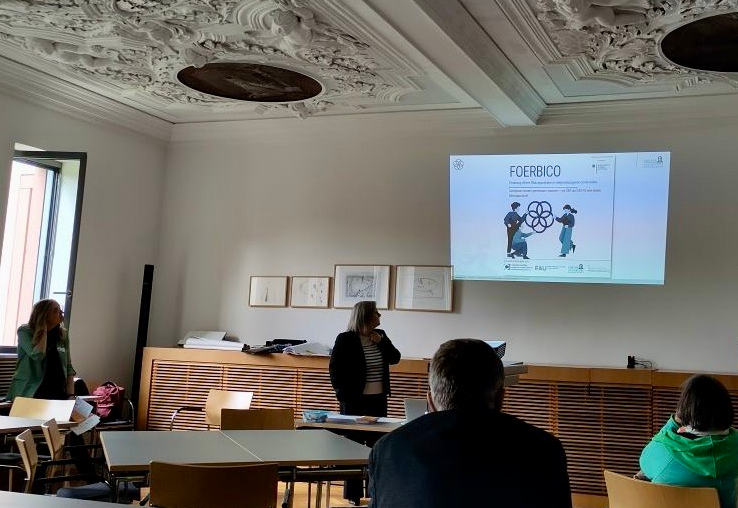
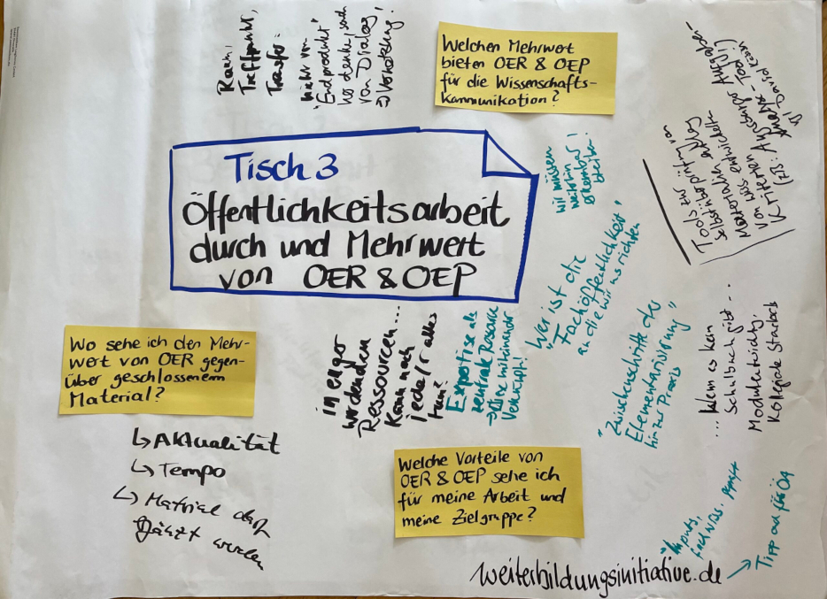

---
#commonMetadata:
'@context': https://schema.org/
creativeWorkStatus: Published
type: LearningResource
name: >-
  Sichtbarkeit und Netzwerk durch OER stärken: FOERBICO auf der GwR-Tagung in
  Würzburg zum Thema Öffentlichkeitsarbeit 
description: >-
  Unter dem spannenden Motto „...hier sollte eigentlich ein Titel stehen“ fand
  die diesjährige GwR-Tagung vom 13. bis 15. September 2024 in Würzburg statt
  und widmete sich dem Thema „Wissenschaftskommunikation in der
  Religionspädagogik“. Die Tagung bot eine Vielzahl bereichernder Vorträge, die
  aktuelle Trends in der Wissenschaftskommunikation, Erfahrungsberichte von
  universitären Akteur*innen, Aspekte der öffentlichen Theologie sowie wirksame
  Formen der Wissenschaftskommunikation beleuchteten. Auch Themen wie
  Internationalisierungsbestrebungen in der wissenschaftlichen
  Religionspädagogik fanden ihren Platz im Programm.
license: https://creativecommons.org/licenses/by-nc-sa/4.0/deed.de
creator:
  - givenName: Laura
    familyName: Mößle
    type: Person
    affiliation:
      name: Goethe-Universität Frankfurt
      type: Organization
inLanguage:
  - de
about:
  - https://w3id.org/kim/hochschulfaechersystematik/n0
image: IMG_3850-scaled.jpg
learningResourceType:
  - https://w3id.org/kim/hcrt/text
educationalLevel:
  - https://w3id.org/kim/educationalLevel/level_A
datePublished: '2024-09-17'
#staticSiteGenerator:
author:
  - Laura Mößle
title: 'Sichtbarkeit und Netzwerk durch OER stärken: FOERBICO auf der GwR-Tagung in Würzburg zum Thema Öffentlichkeitsarbeit'
cover:
  relative: true
  image: foerbico-flyer.png
  hiddenInSingle: false
summary: |
  Unter dem spannenden Motto „...hier sollte eigentlich ein Titel stehen“ fand
  die diesjährige GwR-Tagung vom 13. bis 15. September 2024 in Würzburg statt
  und widmete sich dem Thema „Wissenschaftskommunikation in der
  Religionspädagogik“. Die Tagung bot eine Vielzahl bereichernder Vorträge, die
  aktuelle Trends in der Wissenschaftskommunikation, Erfahrungsberichte von
  universitären Akteur*innen, Aspekte der öffentlichen Theologie sowie wirksame
  Formen der Wissenschaftskommunikation beleuchteten. Auch Themen wie
  Internationalisierungsbestrebungen in der wissenschaftlichen
  Religionspädagogik fanden ihren Platz im Programm.
url: sichtbarkeit-und-netzwerk-durch-oer-staerken-foerbico-auf-der-gwr-tagung-in-wuerzburg-zum-thema-oeffentlichkeitsarbeit
tags:
  - Event
  - Wissenschaftskommunikation
  - FOERBICO in Kontakt
  - Religionspädagogik
  - Theologie
  - Öffentlichkeitsarbeit
  - Vernetzung
---

Auch wir, Viera und Laura vom FOERBICO-Team Frankfurt trugen mit einem eigenen Workshop zur Veranstaltung bei. Unser Ziel war es, ein ansprechendes und interaktives 60-minütiges Workshop-Programm zu entwickeln, das sowohl der Zielgruppe der wissenschaftlichen evangelischen Religionspädagogik als auch dem Tagungsmotto der Wissenschaftskommunikation gerecht wird. Im Mittelpunkt stand die Vorstellung unseres Projekts zur Förderung offener Bildungspraktiken in religionsbezogenen Communities. Gleichzeitig legten wir Wert darauf, aktivierende Elemente einzubauen, um einen Austausch zwischen den Teilnehmenden zu ermöglichen. 

## Kennenlernen und Vernetzen: Erste Einblicke in OER und OEP

Eines unserer Anliegen war es, das Thema Open Educational Resources (OER) und Open Educational Practices (OEP) so zu gestalten, dass sowohl Einsteiger:innen als auch erfahrene Expert:innen in einen Dialog treten konnten. Unser übergeordnetes Ziel war es, den Teilnehmenden die Bedeutung und das Potenzial von OER und OEP in der wissenschaftlichen Religionspädagogik zu verdeutlichen und aufzuzeigen, wie sie sich aktiv an FOERBICO beteiligen können. Dieser Aufgabe waren wir uns bewusst. Also legten wir mit einem kleinen Kennenlern-Impuls los, bei dem die Teilnehmenden einen Lückentext-Satz so vervollständigen sollen, damit er zu ihren bisherigen Erfahrungen im Umgang mit OER passt. 

„Ich bin _____. Ich beziehe meine Lehrmaterialien gerne aus ____.“  
„Ich bin _____. Meine Erfahrungen mit Lizenzen sind bisher ____.“  
„Ich bin _____. Ich habe Lehrmaterialien, die für eine Distribution geeignet sind, und diese sind ____.“  

Nachdem alle Teilnehmenden die von ihnen gewählten Sätze vervollständigt und mit ihrem Sitznachbar:in ausgetauscht hatten, stellten sie sich im Plenum anhand dieser Sätze vor. So hatten wir direkt einen ersten wertvollen Eindruck von der Gruppe.

## „5V-Freiheiten“ und der Mehrwert von OER für die Öffentlichkeitsarbeit

Anschließend gaben wir einen - zugegebenermaßen etwas theoretischen - Einblick in die Welt der OER. Anhand der „[5V-Freiheiten](https://open-educational-resources.de/5rs-auf-deutsch/)“ konnten wir anschaulich darstellen, welche Rechte und Freiheiten OER bieten. Daran anschließend haben wir die Vorteile und Potenziale von OER hervorgehoben. Der Fokus lag darauf, den Teilnehmenden, die ja größtenteils in der Hochschullehre tätig sind, zu vermitteln, dass OER neue Impulse für ihre Arbeit in Forschung und Lehre geben können, da sie die Materialien flexibel anpassen und nutzen können. Darüber hinaus hat das Teilen von Lehrmaterialien als OER die Chance, eine erhöhte Sichtbarkeit sowie einen intensiveren fachlichen Austausch zu ermöglichen.

Dieser Aspekt war insbesondere im Hinblick auf das Tagungsmotto Öffentlichkeitsarbeit von großer Relevanz, denn OER bieten vielfältige Möglichkeiten zur Vernetzung mit Fachkolleg:innen. Durch die öffentliche Bereitstellung von Bildungsmaterialien besteht nicht nur die Chance, die Sichtbarkeit der eigenen Arbeit zu erhöhen, sondern auch die Qualität der Materialien durch das Feedback anderer zu verbessern. Dieser kollaborative Ansatz trägt wesentlich zur Weiterentwicklung von Lehr- und Lerninhalten bei.

Darüber hinaus war es uns ein Anliegen, den größeren bildungspolitischen Kontext von OER zu beleuchten, insbesondere im Hinblick auf die OER-Strategie der Bundesregierung. Mit der im Juli 2022 veröffentlichten [OER-Strategie](https://www.oer-strategie.de/) hat sich das Bundesministerium für Bildung und Forschung (BMBF) zum Ziel gesetzt, die digitale Bildung in Deutschland durch den Einsatz freier Bildungsmaterialien maßgeblich voranzubringen. Ein zentrales Anliegen der Strategie ist der Aufbau eines nachhaltigen OER-Ökosystems, das sowohl technologische Infrastrukturen als auch Dienstleistungen und Vernetzungsangebote umfasst. Dieses Ökosystem soll das deutsche Bildungssystem langfristig stärken und modernisieren.

## FOERBICO im Fokus 

Im Rahmen dieser OER-Förderstrategie konnte das Projekt FOERBICO in der ersten Förderlinie (OE-COM) verankert werden, die einen besonderen Fokus auf die Förderung von Communities legt. Hervorzuheben ist das Alleinstellungsmerkmal von FOERBICO als einziges religionsbezogenes Projekt innerhalb dieser Förderlinie. Dies unterstreicht die Relevanz des Projekts im weiteren Kontext der Förderung offener Bildungspraktiken. Weitere geförderte Projekte können [hier](https://www.oer-strategie.de/foerdern/gefoerderte-projekte/) eingesehen werden.

Aber was genau ist eigentlich FOERBICO? Und wie lässt sich dieses Projekt der wissenschaftlichen Community der evangelischen Religionspädagog:innen auf ansprechende und verständliche Weise vermitteln? Ein Vorteil unseres Workshops war, dass die Teilnehmenden bereits mit den zentralen OER-Akteuren in der religiösen Bildung vertraut waren. Plattformen wie rpi-virtuell, reliGlobal, relilab, narrt und schule-evangelisch-digital sind vielen bekannt. Auf dieser Basis konnten wir die Ziele von FOERBICO verdeutlichen: Es geht um die Vernetzung dieser Akteure, sowohl innerhalb der wissenschaftlichen Religionspädagogik und Theologie als auch darüber hinaus mit anderen OER-Communities wie OERinfo oder WLO.

## Themen-Speed-Dating: Impulse für OER-Standards, Bedarfe und Wissenschaftskommunikation

Im Anschluss an unseren theoretischen Input fand ein interaktives Themen-Speed-Dating statt, das wir an drei Tischen zu den Themen ‚Religionspädagogische Standards für OER‘, ‚Bedarfe an OER und OEP‘ sowie ‚Wissenschaftskommunikation‘ vorbereitet hatten. Die Teilnehmenden hatten die Möglichkeit, sich zu diesen Fragen auszutauschen und ihre Perspektiven aus ihren jeweiligen Wirkungsorten einzubringen.

Bei Tisch 1 zu Religionspädagogischen Standards für OER betonten die Teilnehmenden, dass Studierende im Umgang mit offenen Bildungsmaterialien lernen sollten, die Angemessenheit und Qualität von Materialien zu beurteilen zu können. Darüber hinaus war es ihnen wichtig, umfassend über die Zugänglichkeit und stufenweise Anwendbarkeit von OER informiert zu werden. Vor diesem Hintergrund formulierten sie klare Erwartungen an religionspädagogische Materialien und wünschten sich insbesondere folgende Standards: Prüfsiegel bzw. Gütesiegel, Qualitätsmanagement, Redaktionspool, Klarheit bei der Lizenzierung, aktuelle Repositorien, die namentliche Nachvollziehbarkeit der Ersteller:innen, und umfassende Metadaten. Besonderen Wert legten die Teilnehmenden auch auf die Wahrung des Urheberrechts bei der Erstellung und Verbreitung von OER. Dies unterstreicht die Notwendigkeit, sowohl rechtliche als auch didaktische Aspekte bei der Entwicklung und Nutzung von OER in der Religionspädagogik sorgfältig zu berücksichtigen.

Spannende Diskussionen gab es auch an Tisch 2, der sich mit den Bedürfnissen rund um OER und OEP beschäftigte. Zunächst ging es um die Frage, was alles zu OER gehört und um die Vorstrukturierung von Materialien für formale und non-formale Bildungssettings. Gefordert wurde eine Qualitätssicherung, die auch das Alter der Materialien berücksichtigt. Wichtige Bedarfe waren ein Qualitätskriterium für didaktische Metakommunikation, Schulungen zur Bewertung und Anpassung von OER sowie die Klärung rechtlicher Unklarheiten. Als Hindernisse für die Veröffentlichung von OER wurden fehlende Infrastrukturen, paradoxe Nutzungseffekte und didaktische Unsicherheiten genannt. Um Materialien „offen“ zu gestalten, brauche es mehr Ressourcen (Personal, Geld, Plattformen) sowie mögliche Anreize wie Vergütung oder Anerkennung für die wissenschaftliche Karriere. Bislang, so stellte sich in der Diskussion heraus, wird das Bereitstellen von OER im Wissenschaftskontext noch wenig wertgeschätzt. Zudem sollten OER in der Hochschuldidaktik gestärkt und das Selbstvertrauen im Umgang mit Peer-Feedback gefördert werden.

Bereichernden Austausch gab es auch an Tisch 3, der sich mit der Öffentlichkeitsarbeit und dem Mehrwert von OER und OEP beschäftigte. Unter anderem wurde die Frage diskutiert, wer die „Fachöffentlichkeit“ sei, an die sich OER richte. In Zeiten knapper werdender Ressourcen wurde Expertise als Schlüsselressource für Einzelthemen identifiziert, die stärker bekannt gemacht und vernetzt werden sollte. Für die eigene Arbeit und die Zielgruppen bieten OER zahlreiche Vorteile, darunter Plattformen wie weiterbildungsinitiative.de, fachlich geprüfte Impulse sowie die Entwicklung kollegialer Standards in der Praxis, insbesondere wenn keine Lehrbücher zur Verfügung stehen. Darüber hinaus schaffen OER Raum für Dialog und Vernetzung, was insbesondere für die Wissenschaftskommunikation sehr wertvoll ist.

Insgesamt war der Workshop ein großer Erfolg und bot eine gute Gelegenheit, mit der Scientific Community der evangelischen Religionspädagogik in Austausch zu treten. Die gewonnenen Impulse werden eine wichtige Rolle bei der OER-Transformation in der wissenschaftlichen Religionspädagogik und Theologie spielen.
