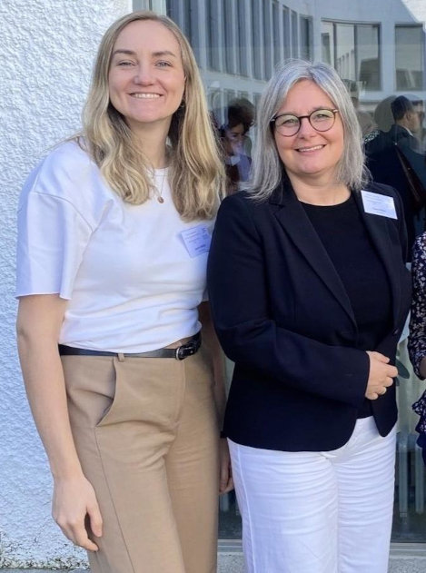
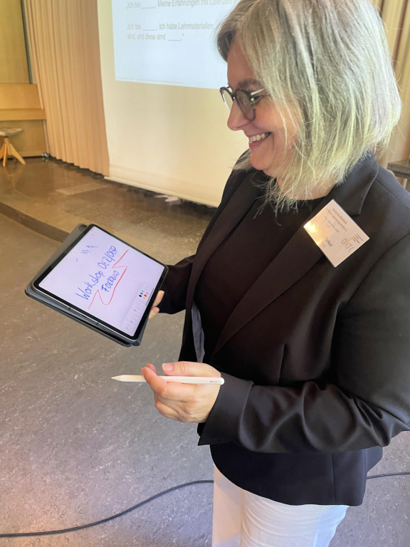
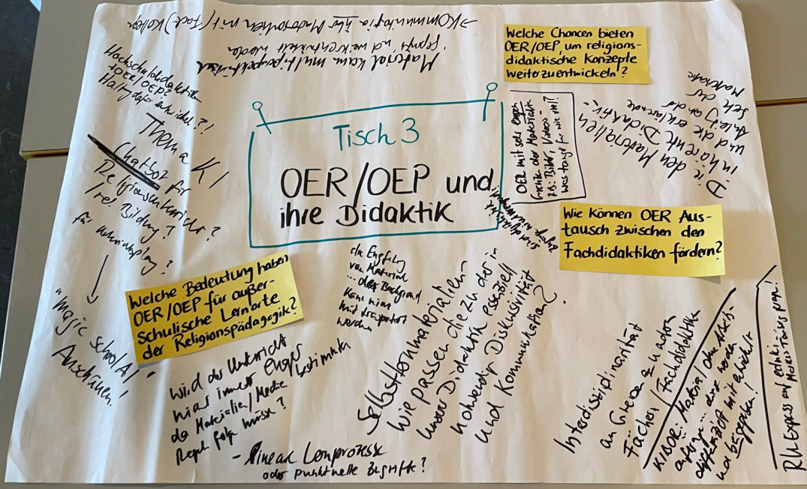
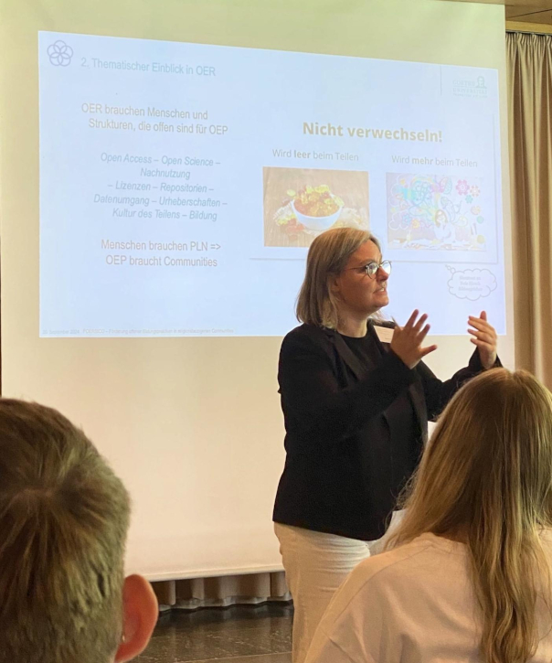

---
#commonMetadata:
'@context': https://schema.org/
creativeWorkStatus: Published
type: LearningResource
name: >-
  Welche Impulse setzt OER für die Religionsdidaktik? Ein Einblick in die
  AKRK-Tagung in Leitershofen von 19.-21.9.2024
description: >-
  Vom 19. bis 21. September traf sich die AKRK (Arbeitsgemeinschaft Katholische
  Religionspädagogik und Katechese) zu ihrer Jahrestagung in Leitershofen bei
  Augsburg – ein Event, das auch für FOERBICO von besonderem Interesse war.
  Unter dem übergreifenden Thema „Religionsdidaktik in ihren Spannungsfeldern“
  ergaben sich anregende Anknüpfungspunkte, z.B. wie verändern Open Educational
  Resources die Religionsdidaktik? Wie können KI-generierte OER in der
  Religionspädagogik eingesetzt werden und was gilt es dabei zu beachten? Welche
  Antworten und weiterführenden Debatten wir gefunden haben, könnt ihr in diesem
  Blogbeitrag lesen!
license: https://creativecommons.org/licenses/by/4.0/deed.de
id: >-
  https://oer.community/welche-impulse-setzt-oer-fuer-die-religionsdidaktik-ein-einblick-in-die-akrk-tagung-in-leitershofen-von-19-21-9-2024/
creator:
  - givenName: Laura
    familyName: Mößle
    id: https://orcid.org/0000-0001-5255-8063
    type: Person
    affiliation:
      name: Johann Wolfgang Goethe-Universität Frankfurt
      id: https://ror.org/04cvxnb49
      type: Organization
keywords:
  - Didaktik
  - KI
  - Open Educational Resources (OER)
  - Religionspädagogik
inLanguage:
  - de
about:
  - https://w3id.org/kim/hochschulfaechersystematik/n02
  - https://w3id.org/kim/hochschulfaechersystematik/n03
  - https://w3id.org/kim/hochschulfaechersystematik/n053
  - https://w3id.org/kim/hochschulfaechersystematik/n086
  - https://w3id.org/kim/hochschulfaechersystematik/n544
  - https://w3id.org/kim/hochschulfaechersystematik/n545
image: AKRK-Tagung_OER-standards.jpg
learningResourceType:
  - https://w3id.org/kim/hcrt/text
educationalLevel:
  - https://w3id.org/kim/educationalLevel/level_A
datePublished: '2024-10-02'
#staticSiteGenerator:
author:
  - Laura Mößle
title: Welche Impulse setzt OER für die Religionsdidaktik? Ein Einblick in die AKRK-Tagung in Leitershofen von 19.-21.9.2024
cover:
  relative: true
  image: AKRK-Tagung_OER-standards.jpg
  hiddenInSingle: true
summary: |
  Vom 19. bis 21. September traf sich die AKRK (Arbeitsgemeinschaft Katholische
  Religionspädagogik und Katechese) zu ihrer Jahrestagung in Leitershofen bei
  Augsburg – ein Event, das auch für FOERBICO von besonderem Interesse war.
  Unter dem übergreifenden Thema „Religionsdidaktik in ihren Spannungsfeldern“
  ergaben sich anregende Anknüpfungspunkte, z.B. wie verändern Open Educational
  Resources die Religionsdidaktik? Wie können KI-generierte OER in der
  Religionspädagogik eingesetzt werden und was gilt es dabei zu beachten? Welche
  Antworten und weiterführenden Debatten wir gefunden haben, könnt ihr in diesem
  Blogbeitrag lesen!
url: welche-impulse-setzt-oer-fuer-die-religionsdidaktik-ein-einblick-in-die-akrk-tagung-in-leitershofen-von-19-21-9-2024
tags:
  - Didaktik
  - KI
  - Open Educational Resources (OER)
  - Religionspädagogik
---

## Religionsdidaktik im Verhältnis

But first things first: Warum sollte man sich eigentlich so genau mit Religionsdidaktik auseinandersetzen, und welchen Mehrwert liefert eine Verhältnisbestimmung zur Religionspädagogik? 
Dieser Frage ging Prof. Dr. Ulrike Witten am ersten Tagungstag in ihrem anschaulichen Vortrag zu „Lernorte, Lebenslauf oder Lehrplanbezug? 
Zum Verhältnis von Religionspädagogik und Religionsdidaktik“ auf den Grund. 
Auch die Frage, in welchem Verhältnis die Pastoraltheologie und die Religionspädagogik zueinander stehen, haben wir im Rahmen der [AKRK](https://www.akrk.eu)-Tagung diskutiert.. 
Neben Impulsen aus der allgemeinen Fachdidaktik und internationalen Einblicken aus Finnland zum Thema „Worldview education“ gab es auch Workshop Angebote, in denen sich Viera und Laura vom Frankfurter FOERBICO-Team beteiligten.

## OER in der Religionspädagogik: Austausch und Impulse beim Themenspeed-Dating

Ähnlich wie bei der [GwR-Tagung](https://oer.community/sichtbarkeit-und-netzwerk-durch-oer-staerken-foerbico-auf-der-gwr-tagung-in-wuerzburg-zum-thema-oeffentlichkeitsarbeit/) starteten wir mit dem Abfragen der Vorerfahrungen zu OER, gaben Input zu OER und Lizenzen und erklärten das Projekt FOERBICO im Gesamtzusammenhang der [Förderstrategie des BMBF]( https://www.bmbf.de/SharedDocs/Publikationen/de/bmbf/3/691288_OER-Strategie.pdf?__blob=publicationFile&v=6).
Beim Themenspeed-Dating kamen wir rege mit den Teilnehmenden ins Gespräch und konnten Erfahrungen, Erwartungen und Voraussetzungen für die Arbeit mit OER in der katholischen Religionspädagogik an Hochschulen näher diskutieren. 
Wir tauschten uns darüber aus, wie OER im Religionsunterricht **pädagogischen Standards** entsprechen.
Dabei ging es z. B. um inhaltliche Kohärenz von OER-Materialien. 
Hier kam der Vorschlag, nach didaktischen Begleitkommentaren auf. 
Diese sollte den Lehrenden direkt aufzeigen, wie und in welchem Kontext die Materialien sinnvoll eingesetzt werden können - aber auch, wo die Grenzen des Materials liegen. 
Ein weiteres Thema war die Qualitätssicherung. Diese sollte am besten durch die Community mit Hilfe von Peer-Feedback erfolgen. 
Darüber hinaus befassten sich die Teilnehmenden mit Richtlinien für die Erstellung und Verbreitung von OER. Dabei standen neben der fachlichen und pädagogischen Qualität auch die praktische Nutzbarkeit und die kritische Reflexion der Materialien im Vordergrund.

## Bedarfe und Hürden bei der Erstellung von OER

Außerdem konnten wir im Workshop auch die **Bedarfe** bei der Erstellung und Verwendung von OER mit den Teilnehmenden diskutieren. 
Um Materialien wirklich „offen“ zugänglich zu machen, sind aus Sicht der Teilnehmenden verschiedene Dinge notwendig: 
Es braucht ausreichende finanzielle Unterstützung, das Thema muss stärker in die Hochschullehre integriert werden und sichere Datenbanken müssen ausreichend zur Verfügung gestellt werden. 
Auch klare Roadmaps und Checklisten sind hilfreich, um den Prozess der Erstellung zu erleichtern. 
Darüber hinaus nannten die Teilnehmenden auch KI-basierte Tools zur Qualitätsprüfung, eine kollegiale Feedbackkultur und leicht verständliche Lizenzierungsoptionen, um die Erstellung und Nutzung von OER in der Hochschullehre zu erleichtern. 
Die Teilnehmenden sprachen aber auch Hindernisse an: Vor allem rechtliche Unsicherheiten und der zusätzliche Arbeitsaufwand wurden als Einwände gegen OER genannt und damit der Bedarf in der Hochschullandschaft aufgezeigt.

## Didaktik neu denken: Chancen von OER, OEP und KI in der Religionsdidaktik

Sehr spannende Themenfelder debattierten die Teilnehmenden beim dritten Themenfeld zu **Didaktik und OER & OEP**. 
Sie sahen die Debatte zu OER und Open Educational Practices (OEP) als Chance, da sie Möglichkeiten bieten, religionsdidaktische Konzepte an die jeweiligen Bedarfe und Kontexte anzupassen und weiterzuentwickeln.
OEP ermöglichen laut Teilnehmenden eine multiperspektivische und interdisziplinäre Erprobung und Weiterentwicklung der Materialien durch den Austausch mit (Fach-)Kolleg:innen. 
Dies wurde insbesondere im Hinblick auf den interdisziplinären Austausch diskutiert, da OER und OEP Schnittstellen zu anderen Fächern und weiteren Themen eröffnen. 
Außerdem diskutierten wir darüber, inwieweit OER und der Einsatz von generativer KI wie Chatbots für die Unterrichtsvorbereitung eine gelungene Ergänzung darstellt und wie diese digitalen Ansätze mit der notwendigen Diskursivität der Religionspädagogik verbunden werden können.
In diesem Zusammenhang lohnt sich ein Blick auf den [Vortrag von David Wiley](https://www.youtube.com/watch?v=WpcE7ihlUDo), der das transformative Potenzial von generativer KI für OER und Bildungsprozesse insgesamt hervorhebt. 
Wiley schlägt vor, dass OER in Zukunft verstärkt durch KI erstellt werden sollten.
Generative KI bietet seiner Ansicht nach nicht nur die Möglichkeit, Inhalte schnell und passgenau an unterschiedliche Lernbedürfnisse der Lernenden anzupassen, sondern kann auch dazu beitragen, ungleiche Bildungszugänge zu verringern und damit eine Demokratisierung von Bildung voranzutreiben. 
Dabei muss jedoch **kritisch reflektiert** werden, ob KI die Rolle der Community im Erstellungs- und Evaluierungsprozess von OER-Materialien ersetzen könnte - indem sie Aufgaben übernimmt, die bisher von Community-Mitgliedern geleistet wurden. 
KI generierte OER werfen aber auch neue Fragen auf: Zum Beispiel, wie es mit der Lizenzierung solcher Materialien aussieht - ein wichtiger Punkt in der Open Education Culture, auf den Wiley in seinem Beitrag nicht weiter eingeht.
Auch im FOERBICO-Workshop auf der AKRK-Tagung wurden interessante Überlegungen zur Qualität von KI-generierten Materialien, wie z.B. Bildmaterial angestoßen. 
Einige Teilnehmende wiesen darauf hin, dass vielen Bildern in OER die ästhetische Tiefe fehle - eine wesentliche Anforderung an religionsdidaktische Materialien. In der Diskussion stand die Frage im Mittelpunkt, welche Bilder in OER und OEP verwendet werden sollten. Die Religionspädagogik hat eine Bilddidaktik entwickelt, die sich stark am kunstwissenschaftlichen Diskurs orientiert und komplexe, theologisch fundierte Medien voraussetzt. Diese Tiefe können KI-generierte Bilder nicht bieten, so dass sie in diesem Kontext nur bedingt einsetzbar sind. Zudem erschweren enge Lizenzbedingungen die Verfügbarkeit dieser Bilder in OER.
Darüber hinaus erreichen Digitalisate nicht die Tiefe von gemalten Werken. Aus religionsdidaktischer Sicht berührt das Thema zentrale Anliegen der Bilddidaktik: Verlangsamung, Vertiefung und theologische Tiefe. Es bleibt eine spannende Herausforderung, wie OER und KI eingesetzt werden können, ohne diese religionsdidaktischen Prozesse zu verkürzen.

## OER und offene Pädagogik: Lernende als aktive Mitgestalter:innen

Wie OER insgesamt didaktische Prozesse verändern können und die Perspektive auf die Lernenden richten, beleuchtet auch die Forschung von [Eric Werth und Katherine Williams](https://doi.org/10.1080/02680513.2021.1970520). 
Sie verstehen unter einer von OER geprägten Didaktik eine offene Pädagogik, oder OER-gestützten Pädagogik, definiert als Lehr- oder Lernpraktiken, die die [5V-Freiheiten](https://open-educational-resources.de/5rs-auf-deutsch/) berücksichtigt. 
Als Teilbereich der offenen Pädagogik folgt die OER-gestützte Pädagogik dem sozialkonstruktivistischen Ansatz der Bildung vor allem auf den Prozess des Lernens fokussiert.
Dieses didaktische Konzept ist sowohl für Lehre in Schul- als auch Hochschulsettings interessant und zielt auf die Entwicklung der Selbstwirksamkeit auf Seiten der Lernenden, indem Wissen durch selbstständiges Tun konstruiert wird. 
Diese Form der didaktischen Vermittlung kann sich sowohl auf die Selbstregulation, als auch auf die Motivation der Lernenden auswirken. 
Doch wie zeichnen sich offenere pädagogische Praktiken in Bildungsprozessen aus?
Eine OER-orientierte Pädagogik setzt auf die aktive Einbeziehung der Lernenden in den Gestaltungsprozess. Das bedeutet 
1. Dass die Autor:innen die bestehende OER-Materialien remixen oder eigene Inhalte erstellen.
2. Es entsteht ein Mehrwert, der über den Nutzen für den Einzelnen im Schul- oder Seminarkontext hinausgeht - die Materialien sind für eine größere Gemeinschaft relevant.
3. Die erstellten Inhalte werden öffentlich zugänglich gemacht, so dass auch andere davon profitieren können.
4. Werden die Lernenden ermutigt, ihre Werke unter Creative-Commons-Lizenzen zu veröffentlichen, um die Idee der freien Bildung weiterzutragen [Wiley & Hilton, 2018](https://doi.org/10.19173/irrodl.v19i4.3601 ).

## Chancen und offene Fragen

Nach dem Workshop sind für uns viele neue Impulse und Debatten dazugekommen, auch die didaktische Diskussion um OER mit Blick auf generative KI  die in jedem Fall weitergeführt werden muss. Die Chancen und das transformative Potenzial stehen [außer Frage](https://open-educational-resources.de/oer-und-ki-eine-vielversprechende-verbindung/). Generative KI kann in jedem Fall das Prinzip einer OER-orientierten, offenen Pädagogik unterstützen, indem Lernende aktiv in den Entstehungs- und Schaffensprozess eingebunden werden. Gleichzeitig stellt sich aber die Frage, wie die Eigenleistung im Lernprozess weiterhin eingefordert werden kann. Zusammenfassend lässt sich sagen, dass die Kombination von OER und KI ein enormes Potenzial für die Demokratisierung von Bildung und die Förderung kreativer Lernprozesse bietet, gleichzeitig aber auch wichtige pädagogische und ethische Fragen aufwirft, die für die (Religions-)Didaktik dringend weiter diskutiert werden müssen.
