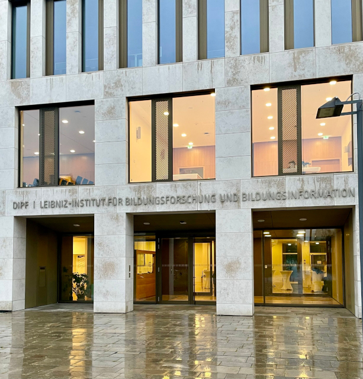
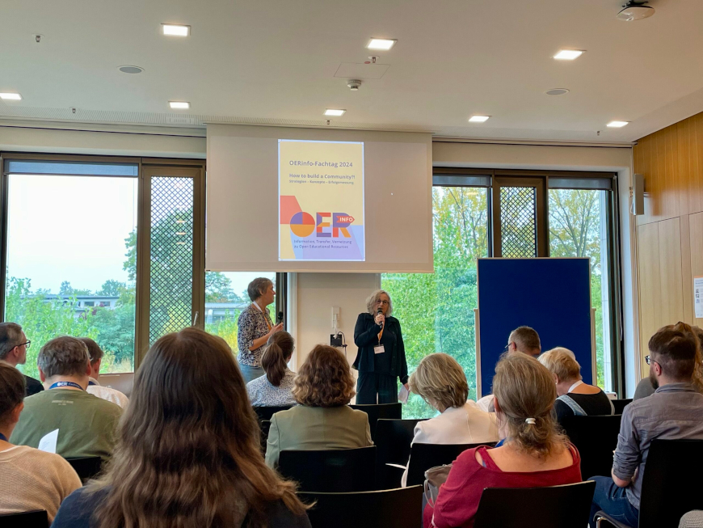
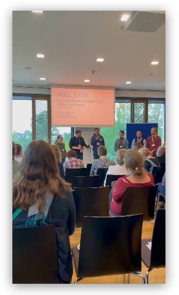
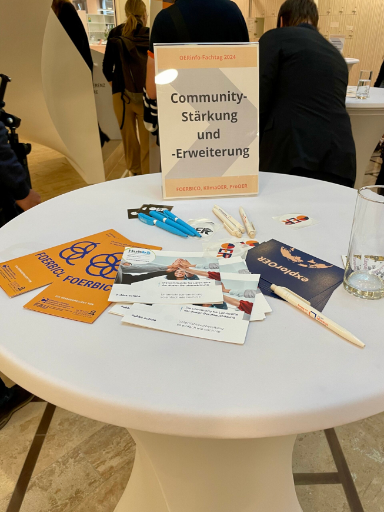

---
#commonMetadata:
'@context': https://schema.org/
creativeWorkStatus: Published
type: LearningResource
name: 'OERinfo-Fachtag am 7.10.2024 in Frankfurt: "How to build a Community?!"'
description: >-
  Mit dem jährlich stattfindenden OERinfo-Fachtag als Format zum Austausch und
  zur Vernetzung der wachsenden OER-Community sollen Wissenschaft und Praxis,
  etablierte und neue OER-Initiativen sowie OER-Befürworter*innen und
  Interessierte zusammenkommen. Der OERinfo-Fachtag fand am 07.10.2024 am DIPF |
  Leibniz-Institut für Bildungsforschung und Bildungsinformation in Frankfurt am
  Main statt. Unser FOERBICO-Team war mit dabei und hat das Projekt vorgestellt.
license: https://creativecommons.org/licenses/by/4.0/deed.de
id: >-
  https://git.rpi-virtuell.de/Comenius-Institut/FOERBICO/src/branch/main/Blog/2024-10-14-OERinfo-Fachtag.md
creator:
  - givenName: Gina
    familyName: Buchwald-Chassée
    type: Person
    affiliation:
      name: Comenius-Institut
      id: https://ror.org/025e8aw85
      type: Organization
keywords:
  - FOERBICO in Kontakt
  - Community
  - Vernetzung
  - Open Educational Resources (OER)
  - OER-Strategie
  - Vernetzung
inLanguage:
  - de
image: OERinfo-Fachtag-FOERBICO-Team.jpg
learningResourceType:
  - https://w3id.org/kim/hcrt/text
datePublished: '2024-10-16'
#staticSiteGenerator:
author:
  - Gina Buchwald-Chassée
title: 'OERinfo-Fachtag am 7.10.2024 in Frankfurt: "How to build a Community?!"'
cover:
  relative: true
  image: OERinfo-Fachtag-FOERBICO-Team.jpg
  hiddenInSingle: true
summary: |
  Mit dem jährlich stattfindenden OERinfo-Fachtag als Format zum Austausch und
  zur Vernetzung der wachsenden OER-Community sollen Wissenschaft und Praxis,
  etablierte und neue OER-Initiativen sowie OER-Befürworter*innen und
  Interessierte zusammenkommen. Der OERinfo-Fachtag fand am 07.10.2024 am DIPF |
  Leibniz-Institut für Bildungsforschung und Bildungsinformation in Frankfurt am
  Main statt. Unser FOERBICO-Team war mit dabei und hat das Projekt vorgestellt.
url: oerinfo-fachtag-am-7-10-2024-in-frankfurt-how-to-build-a-community
tags:
  - FOERBICO in Kontakt
  - Community
  - Vernetzung
  - Open Educational Resources (OER)
  - OER-Strategie
  - Vernetzung
---

## Gemeinsam die Community stärken!

So lautete das Motto des [OERinfo-Fachtages 2024](https://open-educational-resources.de/oerinfo-fachtag/) mit dem Schwerpunktthema "Community Buliding". Im Fokus standen Erfahrungsaustausch und Vernetzung der Projekte der [OE_COM Förderrichtlinie](https://www.oer-strategie.de/foerdern/foerderrichtlinien/) untereinander sowie mit weiteren etablierten Initiativen aktiver Communities.

Nach einer Begrüßung von Prof. Dr. Marc Rittberger (Direktor des Informationszentrums Bildung am DIPF) sowie von Katja Stamm (BMBF) und Dr. Steffi Widera (Geschäftsführerin der Virtuellen Hochschule Bayern) als Vertreterinnen von Bund und Länder erfolgte eine Kurzvorstellung der geförderten [Projekte](https://www.oer-strategie.de/foerdern/gefoerderte-projekte/):

- **CO-WOERK:** Das zentrale Ziel des Projekts CO-WOERK ist die Etablierung einer bundesländerübergreifenden OER-Community für die Bereiche Hochschullehre und berufliche Bildung.

- **digiLL_COM:** Das Projekt digiLL_COM zielt darauf ab, eine zentrale Anlaufstelle für innovative Lehrmethoden und eine gemeinschaftliche Lernumgebung in der phasen- und lernortübergreifenden Lehrkräftebildung zu schaffen.

- **KlimaOER:** Der Klimawandel ist eines der drängendsten Probleme unserer Zeit. Das Verbundvorhaben verfolgt das Gesamtziel, das Bewusstsein für die Ursachen und Auswirkungen des Klimawandels bei Studierenden, Lehrenden und der interessierten Öffentlichkeit auf einer inhaltlich-sachlichen Ebene zu erhöhen.

- **moreBNE:** Das Projekt moreBNE zielt darauf ab, eine OER-Community of Practice (CoP) im Bereich Bildung für nachhaltige Entwicklung (BNE) an Schulen zu etablieren.

- **OERLe:** Das Projekt OERLe zielt darauf ab, OER und OEP in der zweiten Phase der Lehrkräftebildung anhand des Themenschwerpunktes BNE zu etablieren.

- **Ombrella:** Im Rahmen des Projektes Ombrella streben die Beteiligten eine nachhaltige Verankerung von OER und OEP in der Dualen Hochschule Baden-Württemberg an.

- **PrimOER:** Im Projekt PrimOER wird die OER-Fachcommunity der „Inklusiven Grundschulpädagogik“ in NRW zu einem bundesweiten, interdisziplinären Netzwerk ausgebaut.

- **ProOER:** ProOER strebt an, Non-Profit-Organisationen und Sozialunternehmen im schulischen Bildungssektor zu motivieren, ihre hochwertigen Bildungsprogramme und -materialien unter freien Lizenzen zu veröffentlichen.

- **VEStOR:** In der Rechtswissenschaft stellen OER weiterhin die Ausnahme dar. Die Implementierung und Gestaltung eines nachhaltigen Ökosystems erforderten ein breites Spektrum an Angeboten auch für die juristische Fachgemeinschaft.

- **WODL:** Das Projekt vernetzt zwei Communities grundlegend unterschiedlicher Expertise miteinander: Der Schulverbund BüZ e.V. widmet sich der Gestaltung zukunftsfähiger Schulen und offener Lernformate.

Und natürlich unser Projekt **FOERBICO** zur Förderung offener Bildungspraktiken in religionsbezogenen Communities, hier für euch zum Nachschauen 📹😉

Im Anschluss fanden weitere Gespräche an Thementischen zu den Projekten statt. Außerdem wurden noch die Plattformen Plattform [ComPleTT](https://complett.bildungsserver.de/) und [HubbS](https://hubbs.schule/) präsentiert. 

## Parallele Workshops zu Strategien, Konzepten und Erfolgsfaktoren

### Zielgruppe erkennen - Community erweitern

Dr. Johannes Appel (DIPF)

Wie erkennt man seine Zielgruppe und erweitert eine OER-Community? Dieser Frage widmete sich der Workshop *Zielgruppe erkennen – Community erweitern* im Rahmen des OERinfo-Fachtags. Um eine OER-Community erfolgreich zu erweitern, müssen verschiedene Elemente berücksichtigt werden, die eine funktionierende Gemeinschaft ausmachen. Dazu gehören geteilte Ziele, ein starkes Identitäts- und Gemeinschaftsgefühl, Kommunikation und Beziehungen, Engagement sowie aktive Beteiligung und Zusammenarbeit. Viele dieser Aspekte erfordern intrinsische Motivation und Überzeugung. Um diese Motivation zu fördern, ist es entscheidend, die Menschen dort abzuholen, wo sie stehen, und ihre Bedürfnisse und Bedarfe gezielt anzusprechen.

Doch wie versteht man die eigene Zielgruppe? Im OER-Bereich überschneiden sich Ziel- und Interessensgruppen oft, weshalb eine klare Definition der Zielgruppe zentral ist. Besonders in der Bildung lassen sich Gemeinsamkeiten in Grundproblemen erkennen, wie etwa strukturelle Bedingungen oder der Zugang zu Ressourcen. Allerdings variieren die Details je nach Kontext: Lehrende haben unterschiedliche Freiheitsgrade, technische Ausstattungen und institutionelle Regelungen, die ihre Motivation zur Nutzung von OER beeinflussen. Auch die Rolle der Lernenden und ihre Verpflichtungen spielen eine Rolle. Um gezielt an diese Menschen heranzukommen, muss ihre Situation genau analysiert werden.

Eine systematische Stakeholder-Analyse [vgl. Wang 2018](http://universitypublications.net/jte/0802/pdf/H8V237.pdf), ein ursprünglich aus dem strategischen Management stammendes Werkzeug, kann dabei helfen, die Zielgruppe zu identifizieren und zu verstehen. Im Workshop haben wir dieses Instrument ganz praktisch angewandt, um die für uns relevante Zielgruppen besser zu erfassen. Diese Analyse ermöglicht es, mit Blick auf die jeweilige Zielgruppe Widerstände und Hürden bzgl. OER zu identifizieren,  Vorteile durch OER und das jeweilige Interesse an OER zu elaborieren. Die Analysie zielt darauf ab, Zielgruppen gezielt anzusprechen und maßgeschneiderte Strategien zu entwickeln, um sie effektiv zu erreichen.

Zusätzlich gab es konkrete Tipps, um OER in der Bildungslandschaft besser zu verankern: Lehrkräfte sollten etwa die Integration von OER in ihre Ausbildung als persönlichen Vorteil begreifen. Außerdem helfen Gespräche mit der Zielgruppe, um ihre Wünsche und Bedürfnisse besser zu verstehen. Letztlich schafft diese Nähe zu den Zielgruppen die Grundlage für eine aktive, wachsende und engagierte OER-Community. Weitere Informationen und Anregungen bietet der [Blogbeitrag](https://open-educational-resources.de/ein-systematisches-mapping-von-communities-in-der-bildung/) von OERinfo, der systematische Methoden zur Analyse von Communities durch Systematisches Mapping erläutert. 

### Wirksame Wege des Dialogs und Transfers

Ana Schenk (DIPF)

Der Workshop von Ana Schenk befasste sich mit der Frage, wie evidenzbasierte Methoden des Wissenstransfers und des Dialogs auf den Bereich des Community Buildings übertragen werden können. Dazu stellte sie das Projekt "[ReTransfer](https://retransfer.digital/)" vor, um digitale Fachkonzepte für anwendungsfähige digitale Lehrkräftefortbildungen im Bereich der Gesellschaftswissenschaften länderübergreifend zu entwickeln und zu beforschen.

Neben einer umfassenden Literaturrecherche stützen sie sich methodisch auf die evidenzbasierte Medizin, die wissenschaftlich geprüfte Informationen zu den verschiedenen medizinischen Untersuchungs- und Behandlungsmöglichkeiten bereitstellt , um die ärztlichen Entscheidungsgrundlagen zu verbessern und die Qualität bei Diagnose und Therapie zu erhöhen. Generell ist das Ziel evidenzbasierter Forschung vorherige Forschungsergebnisse systematisch und transparent für neue Studien zu nutzen, sodass wichtige Fragen auf gültige, effiziente und zugängliche Weise beantwortet werden. Im Workshop wurde diskutiert, inwieweit sich das Konzept evidenzbasierter Forschung auf den Bildungsbereich und die heterogenen Communities übertragen lässt.

### Sammeln, Kuratieren und Verbreiten von hochwertigen Bildungsmaterialien

Niels Winkelmann (WirLernenOnline)

Der Workshop von Niels Winkelman ([@aen_weh](https://bildung.social/@aen_weh)) gab einen Überblick zur Community-Beteiligung bei WLO (https://www.wirlernenonline.de/). Die vorgestellte Redaktionsumgebung dient dabei zum Sammeln, Kuratieren, Ergänzen durch Metadaten, Freischalten und Einsortieren von #OER-Materialien und wird zunehmend durch KI-basierte Werkzeuge unterstützt. Eine Vielzahl von Plugin-Angeboten macht dabei die offene Technik anschlussfähig in unterschiedliche Systeme, wie Moodle oder WordPress. Ein definierter Qualitätsprozess am Inhalte-Buffet ermöglicht dabei eine Verschränkung maschineller Checks mit menschlicher Redaktion bis zur Freischaltung durch die Mitarbeitenden. 
🚢🌊🎣 Illustriert wurden die Tätigkeiten der Plattform-Community durch das Bild einer Fangflotte, die im Meer der Angebote die Inhalte abfischt. Aktuelle Weiterentwicklungen sollen das Community-basierte Training von KI, sowie adaptive Themenseiten sein. 

Die Präsentation von Niels zu WLO gibt's [hier als Google-Slides](https://docs.google.com/presentation/d/1LQm3TXCwy3xT1idMCUAxWYuWqv9YeJt5SCvn5QU_vhg/edit?usp=sharing)

## Fazit:

Es war eine tolle Möglichkeit die Menschen hinter den Projekten kennenzulernen! Teilweise treiben uns ähnliche Fragen um, z.B. zu Qualitätskriterien, rechtlichen Fragen, zeitlichen Ressourcen sowie Partizipations- und Aktivierungsmöglichkeiten. Gleichzeitig waren die spezifischen Themen und verschiedenen Herangehensweisen der Projekte spannend. Was uns alle vereint: Das Ziel der Weiterentwicklung von offenen BLehr- und Lernmaterialien und vor allem offenen Bildungspraktiken - wir freuen uns weiterhin, auf die gemeinsame Reise!
