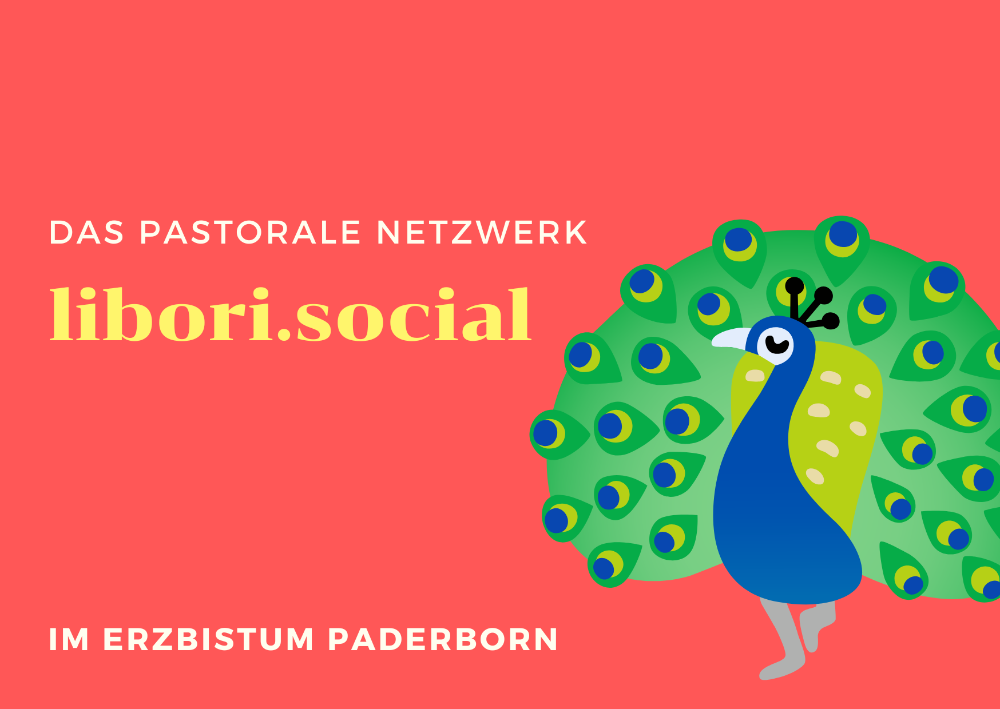

---
#commonMetadata:
'@context': https://schema.org/
creativeWorkStatus: Published
type: LearningResource
name: Ein Starterkit für Mastodon-Instanzen vom pastoralen Netzwerk libori.social
description: >-
  Alexander hat die Mastodon-Instanz libori.social mit dem Ziel aufgebaut,
  katholische und pastorale Akteure im Erzbistum Paderborn zu vernetzen.
license: https://creativecommons.org/publicdomain/zero/1.0/deed.de
id: https://oer.community/libori-social
creator:
  - givenName: Gina
    familyName: Buchwald-Chassée
    type: Person
    affiliation:
      name: Comenius-Institut
      id: https://ror.org/025e8aw85
      type: Organization
  - givenName: Jörg
    familyName: Lohrer
    id: https://orcid.org/0000-0002-9282-0406
    type: Person
    affiliation:
      name: Comenius-Institut
      id: https://ror.org/025e8aw85
      type: Organization
inLanguage:
  - de
about:
  - https://w3id.org/kim/hochschulfaechersystematik/n02
  - https://w3id.org/kim/hochschulfaechersystematik/n03
  - https://w3id.org/kim/hochschulfaechersystematik/n053
  - https://w3id.org/kim/hochschulfaechersystematik/n079
  - https://w3id.org/kim/hochschulfaechersystematik/n086
  - https://w3id.org/kim/hochschulfaechersystematik/n121
  - https://w3id.org/kim/hochschulfaechersystematik/n544
  - https://w3id.org/kim/hochschulfaechersystematik/n545
image: https://oer.community/libori-social/liboriSocial_postcard.png
learningResourceType:
  - https://w3id.org/kim/hcrt/text
  - https://w3id.org/kim/hcrt/web_page
educationalLevel:
  - https://w3id.org/kim/educationalLevel/level_A
  - https://w3id.org/kim/educationalLevel/level_C
datePublished: '2024-12-10'
#staticSiteGenerator:
author:
  - Gina Buchwald-Chassée
  - Jörg Lohrer
title: Ein Starterkit für Mastodon-Instanzen vom pastoralen Netzwerk libori.social
cover:
  relative: true
  image: liboriSocial_postcard.png
  hiddenInSingle: false
summary: |
  Alexander hat die Mastodon-Instanz libori.social mit dem Ziel aufgebaut hat,
  katholische und pastorale Akteure im Erzbistum Paderborn zu vernetzen.
url: libori-social
tags:
  - Open Educational Practices (OEP)
  - Mastodon
  - Codeberg
  - Community
---

Gina und Jörg im Gespräch mit Alexander, der die Mastodon-Instanz libori.social mit dem Ziel aufgebaut hat, katholische und pastorale Akteure im Erzbistum Paderborn zu vernetzen.

## Motivationen, Haltungen und Ethische Intentionen

Ausgelöst durch den Twitter-Crash entstand bei Alexander die Intention eine Plattform für die pastorale Arbeit zu entwickeln. Sein Ziel ist es trotz der digitalen Distanz eine Nähe auf regionaler Ebene spürbar zu machen und ein "digitales Zuhause" zu ermöglichen: 
> Da ist erst mal ganz viel technisches Interesse, Hobby, Freude am Ausprobieren ausschlaggebend gewesen, zu sagen, es ist eine eigene Instanz. Und dieses Ideal, damit einen Gewinn für den Kontext, in dem ich auch tätig bin, zu bringen.

Ein weiteres wichtiges Anliegen ist die digitale Nachhaltigkeit, die durch die Verwendung der Open-Source-Software Mastodon und der Zusammenarbeit in der gemeinsamen Entwicklung auf Codeberg gefördert wird.

## Von der Einstiegsseite zur Vision: Wie libori.social das kirchliche Mastodon-Netzwerk stärken will

Die Idee einer Einstiegsseite für Mastodon entstand aus dem Bedürfnis heraus, den Zugang zur Plattform für katholische und pastorale Akteure zu vereinfachen. Alexander, der Gründer von [libori.social](https://libori.social), erkannte die Hürden, die Neueinsteiger oft von Mastodon abschrecken. Eine leere Timeline, die Schwierigkeit, interessante Accounts zu finden und die ungewohnte Benutzeroberfläche können dazu führen, dass sich Nutzer schnell wieder von der Plattform abwenden. Um dieser Problematik zu begegnen, entwickelte Alexander die Idee einer Einstiegsseite im Blick auf das Erzbistum Paderborn, die den Nutzern den Start in die "katholische Theo-Bubble" auf Mastodon erleichtern soll.

>  "Ich bin mir natürlich auch bewusst, dass Mastodon einfach eine Plattform ist, die erst mal noch sehr in der Nische ist. Aber in meinen Augen bietet sie den Vorteil, dass, sie erst mal eine offene Bubble darstellt. Man kann einfach verlinken und es erst mal niederschwellig zur Verfügung stellen. Soweit man Lust hat, sich da mal reinzuklicken, geht's dann weiter."

### Die libori.social-[Einstiegsseite](https://start.libori.social/):

[Dieses "Starterkit](https://start.libori.social/)", inspiriert von [ähnlichen Ansätzen auf BlueSky](https://steadyhq.com/de/eulemagazin/posts/8936e046-d69e-4cd5-8122-72332e1ae27e), soll den Nutzenden ein erstes Gefühl für die "katholische Theo-Bubble" auf Mastodon vermitteln und ihnen den Einstieg in die Plattform erleichtern.
Es

* bietet eine kurze Begrüßung und erklärt, wofür die Instanz steht
* enthält Weiterleitungslinks zu relevanten Ressourcen
* erläutert die ersten Schritte und die App-Installation
* stellt vor allem eine Sammlung von aktiven Accounts aus dem katholischen und ökumenischen Bereich bereit, denen Nutzer:innen direkt folgen können.

>“Wenn etwas auf Interesse stößt, hat man auch wieder ganz viel Kraft.”

Die Pflege der Instanz ist mit einem nicht unerheblichen Zeitaufwand verbunden, den Alexander zum Großteil ehrenamtlich in seiner Freizeit leistet. Er berichtet jedoch von überwiegend positiven Erfahrungen und betont, dass das positive Feedback und die Begeisterung der Nutzer ihn motivieren die Community zu unterstützen.

## Die Vision eines größeren kirchlichen Netzwerks

> “Wenn man es nicht vorlebt, kann es nicht nachgemacht werden.”

Alexander denkt bereits weiter: Er möchte die Idee der Einstiegsseite nutzen, um ein größeres, kirchliches Mastodon-Netzwerk zu schaffen, das verschiedene Instanzen miteinander verbindet und als zentraler Anlaufpunkt für Interessierte dient:

> "Wie wäre es, ein eigenständiges Portal zu schaffen, das - getragen von befreundeten Instanzen - nicht nur die katholische, sondern die kirchliche Bubble insgesamt anspricht? Mit Funktionen wie Account-Filterung und Kategorisierung könnten Institutionen, Pastorale und Gläubige besser vernetzt werden. So ließen sich neue Anknüpfungspunkte schaffen und das Netzwerk nachhaltig erweitern."

Diese Vision eines "Hubs" für kirchliche Mastodon-Instanzen auch im Kontext religionsbezogener Bildung teilen auch Jörg und Gina vom Comenius-Institut und wir tüfteln bereits an den nächsten wichtigen Schritten der Zusammenarbeit in Richtung der Realisierung.

Ein Netzwerk im Sinne eines "Hubs" könnte:

* mehrere befreundete Instanzen umfassen, die gemeinsame Ziele und Werte teilen.
* eine Filterfunktion für Accounts bieten, um die Suche nach relevanten Inhalten zu vereinfachen.
* Kategorisierung von Accounts ermöglichen, um z.B. zwischen Institutionen, Bildungseinrichtungen und Einzelpersonen zu unterscheiden.

### Konkrete Schritte zur Umsetzung

Um diese Idee zu verwirklichen, schlägt Alexander folgende konkrete Schritte vor:

* Die Integration von "Instanzempfehlungen" auf der Einstiegsseite, um die Vielfalt des religionsbezogenen Fediverse sichtbar zu machen.
* Die Zusammenarbeit mit anderen Instanzen, wie z.B. [reliverse.social](https://reliverse.social/), um einen gemeinsamen Mastodon-Hub zu entwickeln, der als zentraler Anlaufpunkt für Interessierte dient und die Vernetzung zwischen den Instanzen fördert.
* Die Nutzung von Plattformen wie [Synod.im](https://web.synod.im), um die Idee eines kirchlichen Mastodon-Netzwerks zu diskutieren und weitere Akteure einzubinden.

## Ausblick

Die Initiative von libori.social zeigt, wie aus einer einfachen Idee ein bedeutendes Projekt entstehen kann. Die Vision eines größeren kirchlichen Mastodon-Netzwerks ist ambitioniert, aber realistisch. Durch Zusammenarbeit, Offenheit und Engagement kann dieses Netzwerk zu einem lebendigen und wertvollen Ort für kirchliche Gemeinschaft, religionsbezogene Bildung und den überkonfessionellen Austausch werden.

Wir haben uns von Alexander inspirieren lassen, sein Starterpaket als Einstiegsseite für unseren Mastodon-Server anzupassen und gemeinsam an der Weiterentwicklung zu arbeiten.

Unter https://startodon.oer.community gibt es einen Einstieg mit Empfehlungen zur religionsbezogenen Bildung und die herzliche Einladung an Religionslehrkräfte, Ehrenamtliche oder Fortbildende sich auf https://reliverse.social zu registrieren, anzumelden und mit uns in den offenen Austausch zu kommen.

Wir sehen uns im Fediverse!

(Und wer mag, darf gerne [mitentwickeln auf Codeberg](https://codeberg.org/kirche-im-netz/Startodon))