---
#commonMetadata:
'@context': https://schema.org/
creativeWorkStatus: Published
name: OERcamp & OER-Festival 2024 in Essen
description: >-
  Vom 18. bis 20. November 2024 verwandelte sich Essen in das Zentrum für Open
  Educational Resources (OER) und Open Educational Practices (OEP) 🚀 Mit dem
  OERcamp und OER-Festival fand eine Veranstaltung voller Inspiration, Austausch
  und Vernetzung für die Bildungscommunity statt 🤝💡Gina vom FOERBICO-Team war
  mit dabei und gibt euch hier einige Einblicke!
license: https://creativecommons.org/licenses/by/4.0/deed.de
creator:
  - givenName: Gina
    familyName: Buchwald-Chassée
    type: Person
    affiliation:
      name: Comenius-Institut
      id: https://ror.org/025e8aw85
      type: Organization
inLanguage:
  - de
image: >-
  https://i0.wp.com/www.oercamp.de/wp-content/uploads/2024/08/20241118-OERcamp-OER-Festival-Essen-%E2%80%93-Website-Kachel-komprimiert-1.png?fit=768%2C432&ssl=1
learningResourceType:
  - https://w3id.org/kim/hcrt/text
datePublished: '2024-12-02'
#staticSiteGenerator:
author:
  - Gina Buchwald-Chassée
title: OERcamp & OER-Festival 2024 in Essen
cover:
  relative: true
  image: OERcamp-OER-Festival-2024-Essen.png
  alt: '#OERcamp 2024 in Essen vom 18. bis 20. November'
  hiddenInSingle: false
summary: |
  Vom 18. bis 20. November 2024 verwandelte sich Essen in das Zentrum für Open
  Educational Resources (OER) und Open Educational Practices (OEP) 🚀 Mit dem
  OERcamp und OER-Festival fand eine Veranstaltung voller Inspiration, Austausch
  und Vernetzung für die Bildungscommunity statt 🤝💡Gina vom FOERBICO-Team war
  mit dabei und gibt euch hier einige Einblicke!
url: oercamp-und-oer-festival-2024-in-essen
tags:
  - Open Educational Resources (OER)
  - Open Educational Practices (OEP)
  - OERcamp
  - Vernetzung
  - Event
---

Hinweis: Eine ausführliche Dokumentation des OERcamps ist unter https://go.oercamp.de/24essen/ verfügbar, Registrierung bzw. Anmeldung erforderlich!

# Tag 1
## ORCA.nrw-Tagung im Rahmen des OER-Festivals: Hochschullehre inspirierend und verbindend

Los ging es am 18. November im Ruhrturm Essen: Erstmals seit 2017 findet wieder ein OER-Festival statt, das ein OERcamp, eine Fachtagung von [ORCA.nrw](https://www.orca.nrw/) in Zusammenarbeit mit dem Stifterverband und das 10 Jahre-Jubiläum des Bündnisses Freie Bildung miteinander verbindet. Dabei kamen Lehrende, Hochschulmitarbeitende und alle anderen Interessierten für einen Erfahrungs- und Wissensaustausch zusammen. Der inhaltliche Fokus liegt besonders auf dem Thema Lehrkräftebildung und dem Austausch der Fachwissenschaften. Das komplette Programm zur ORCA.nrw-Tagung findest du [hier](https://www.orca.nrw/vernetzung/veranstaltungen/orca-tagung/tagung-2024/). 

Nach einer Begrüßung von Dr. Markus Deimann (ORCA.nrw) und Grußworten von Dr. Martin Jungwirth (DH.NRW) und Bettina Jorzik (Stifterverband) starteten fünf parallele Sessions bis zur Mittagspause. Gina war bei der ersten Session „Beiträge aus der Community: Die Bedeutung offener Bildungsressourcen in der Hochschullehre“ dabei, in der verschiedene Projekte vorgestellt wurden:

### 1. [Sinnvolle KI-Nutzung für OER: Von der Suche zur Kurserstellung](https://www.orca.nrw/wp-content/uploads/2024/11/OER-KI-Assistent.pdf) – Alexander Mikasch und Bastian Schmidt-Kuhl (Ruhr-Universität Bochum)

Das Team der Ruhr-Universität Bochum (RUB) entwickelt für Moodle.nrw einen OER-KI-Assistenten, um OER schnell und einfach zu finden (momentan stellt OERSI die API für die OER-Suche bereit) sowie auf Basis von OER-Materialien eigene Kurse und Inhalte zu erstellen. Dabei werden auch die Lizenzbedingungen (CC-Lizenzen) berücksichtigt und die Nutzer:innen erhalten Anweisungen, wie diese einzuhalten sind. So können Lehrende sich ihre Kurse Schritt-für-Schritt selbst zusammenbasteln. Die erstellten Kurse und Inhalte werden dann wiederum über Moodle bereitgestellt und so mit anderen geteilt. Dazu wurde auch am nächsten Tag im Barcamp eine Session angeboten! Wir finden, der Assistent klingt spannend und hat großes Potential, um Lehrende zu entlasten und animiert gleichzeitig mühelos selbst OER zu produzieren!

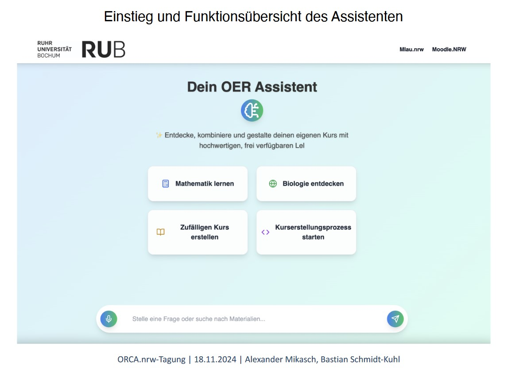
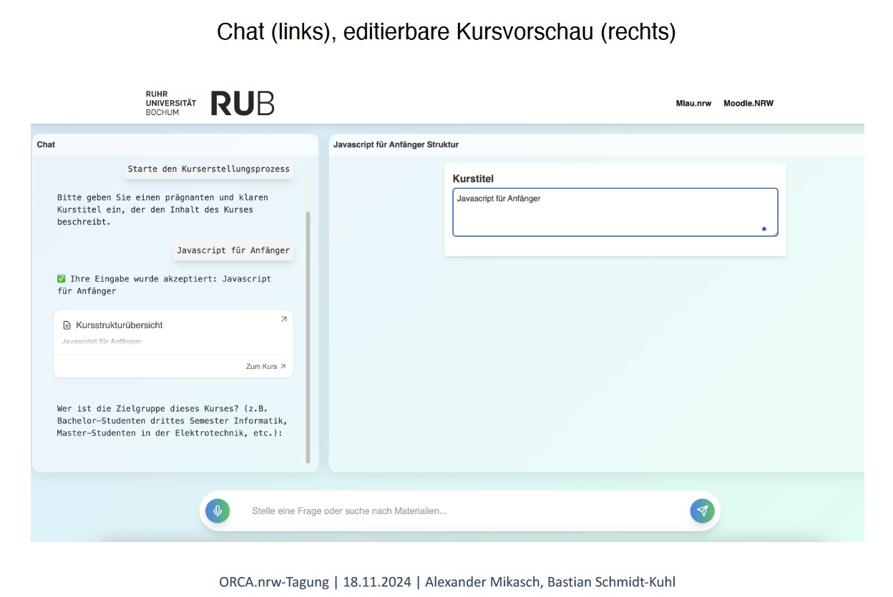
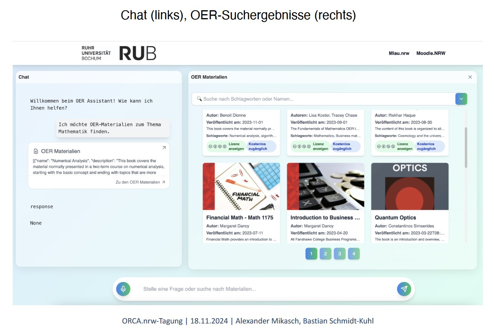
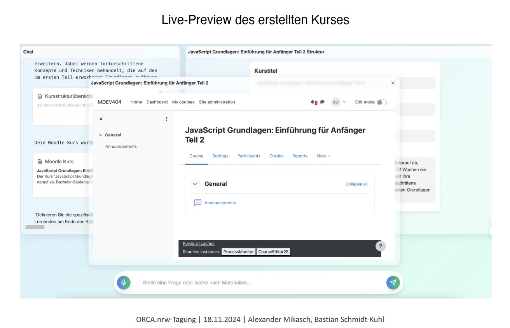

Ausblick: 
-	Erstellen von mehr Kursinhalten ermöglichen
-	RAG Chat in Kurs über OER Inhalt
-	Spracheingabe im Service
-	Export des Kurses wieder direkt zu OER-Repository (Bspw. ZOERR)

Für uns wäre interessant, inwieweit auch Metadaten automatisiert generiert werden könnten und ob die einzelnen Inhalte/Kurse auch plattformübergreifend über Moodle hinaus geteilt werden könnten. Unsere Idee: Ein OER-KI-Assistent spezifisch für die Relgionspädagogik, was meint ihr?

### 2. ABBA: Automatisierte Erstellung und Personalisierung interaktiver OER-Lernbücher mit KI – Ein Prototyp zur dynamischen Generierung digitaler Bildungsmedien – Dr. Stefan Pietrusky (PH Heidelberg)

Das Thema KI ist wenig überraschend hoch im Kurs! Auch bei ABBA, einer App zur automatisierten Erstellung von Lehrbüchern und weiteren Bildungsmedien. Auch hierbei ist das Ziel, Lehrende zu entlasten, indem neben der Inhaltserstellung auch Antworten von Lernenden ausgewertet werden können und sie direktes Feedback erhalten. Das Niveau kann angepasst werden, um eine Binnendifferenzierung innerhalb von Lerngruppen zu ermöglichen. Momentan ist die Anwendung noch geschlossen und soll im nächsten Semester erprobt werden. Von den Veranstaltungsteilnehmenden wurde unter dem Stichwort „Türschwellendidaktik“ mehr Begleitforschung zur Motivation und Akzeptanz von Lernenden bei KI-generierten Inhalten gefordert.

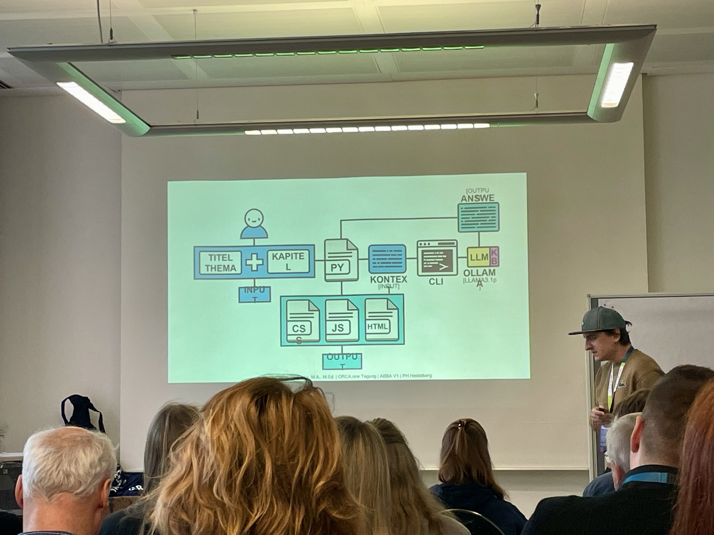
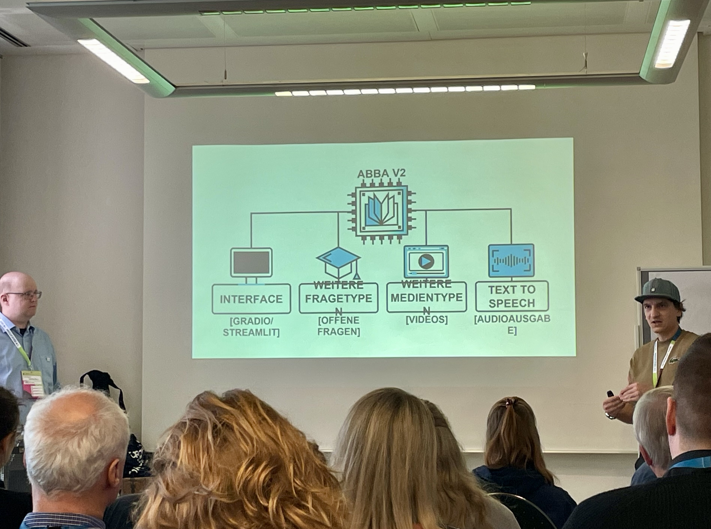

### 3. [A Young Lady’s Illustrated Primer – OER als Utopie](https://www.orca.nrw/wp-content/uploads/2024/11/A-Young-Lady%C2%B4s-Illustrated-Primer.pdf) – Gunnar Sandkühler (Ruhr-Universität Bochum)

Ein deutlicher Bruch zu den vorherigen technischen Beiträgen bot das 1995 in Deutschland erschienene Werk von Neal Stephenson aus dem Genre Science-Fiction / Steampunk, in dem das Mädchen Nell mit einer Fibel interagiert. Die Fibel ist adaptiv (in Echtzeit und im Lernmodell), multimedial, interaktiv, allgemeinbildend / enzyklopädisch, fachspezifisch und erzeugt „generative“ Inhalte – quasi KI at it´s beginning. Die Fibel ist allerdings kein OER, aber sollte es vielleicht sein!

### 4. Forschungsdatenmanagement in Studium und Lehre – Ergebnisse des Projekts FDM@Studium.nrw – Dr. Torsten Rathmann (Bergische Universität Wuppertal) und Ceren Yildiz (Universität Duisburg-Essen)

Mitte 2021 startete das Projekt zu Forschungsdatenmanagement (FDM) in Studium und Lehre mit dem Ziel, die bisherige Zielgruppe von Schulungs- und Unterstützungsmaßnahmen zum FDM bestehend aus Promivierenden, PostDocs und arrivierten Wissenschaftler:innen um Studierende zu erweitern. Dazu wurden didaktisch aufbereitete Bildungsressourcen zur Vermittlung von Grundlagen im Forschungsdatenmanagement für ein Selbststudium und zur Nachnutzung durch Lehrende entwickelt. 

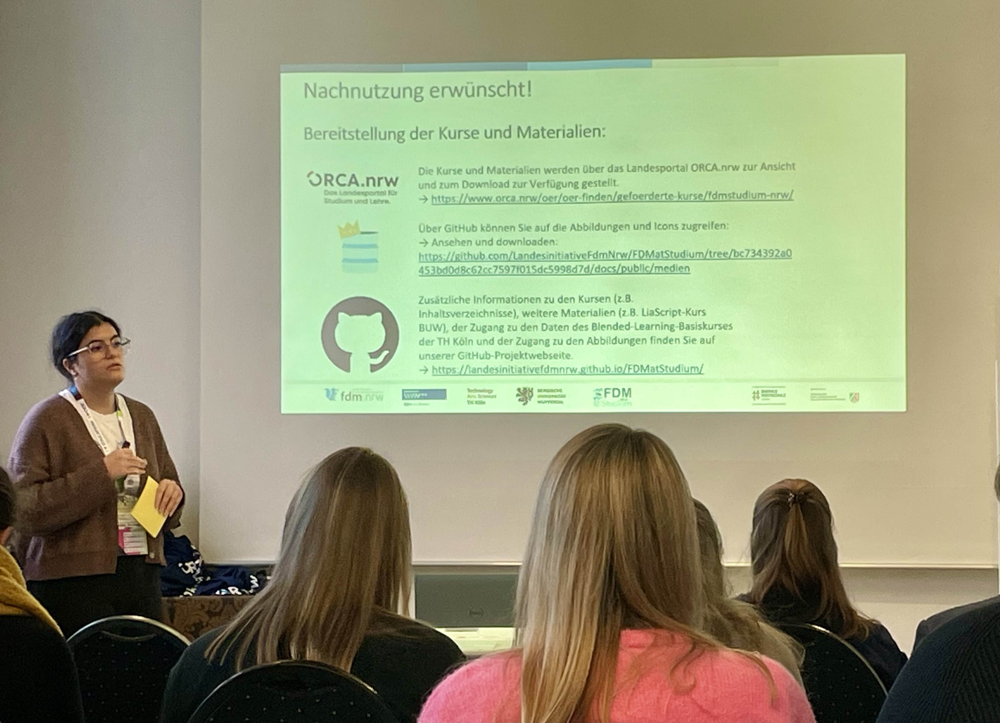

### 5. STACK.nrw: Git-basierter Aufgabenpool für STACK-Aufgaben – Dr. Benjamin H. Schulz-Rosenberger und Dr. Michael Kallweit (Ruhr-Universität Bochum)

Git-basiertes Arbeiten - da schlägt unser FOERBICO-Herz doch gleich höher, denn auch wir versuchen unsere Arbeit über Git als Open Source Versionsverwaltungssystem anschlüssfähig, nachhaltig und transparent zu gestalten (schaut gerne in unser [Repo](https://git.rpi-virtuell.de/Comenius-Institut/FOERBICO/) rein 😉). Das Projekt [STACK.nrw](https://www.ruhr-uni-bochum.de/stack-nrw/) hat anders als wir allerdings keinen Religionsbezug, sondern legt den Fokus auf den mathematischen Bereich. Sie möchten eine zentrale und dezentrale Infrastruktur schaffen, um einen qualitätsgesicherten OER-Matheaufgabenpool, die mit [STACK](https://stack-assessment.org/) erstellt wurden, aufzubauen. Darüber hinaus zielen sie auch auf Vernetzung und Wissensaustausch von Lehrenden bzw. Hochschulen in NRW. 

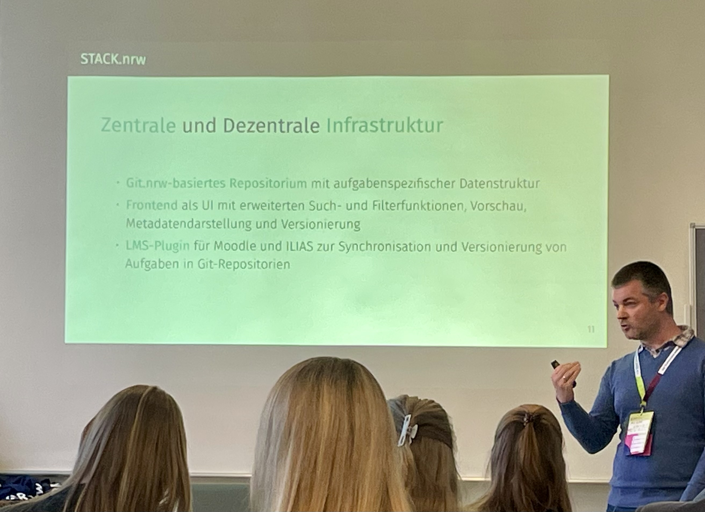
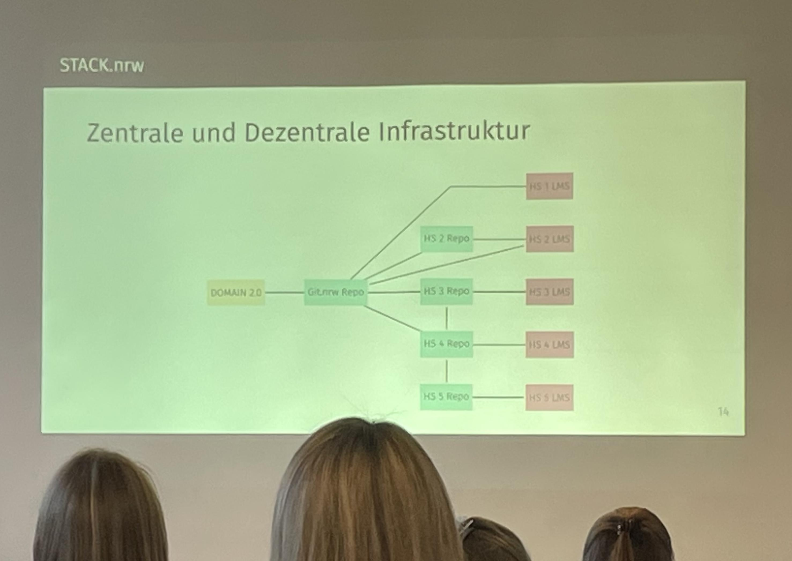
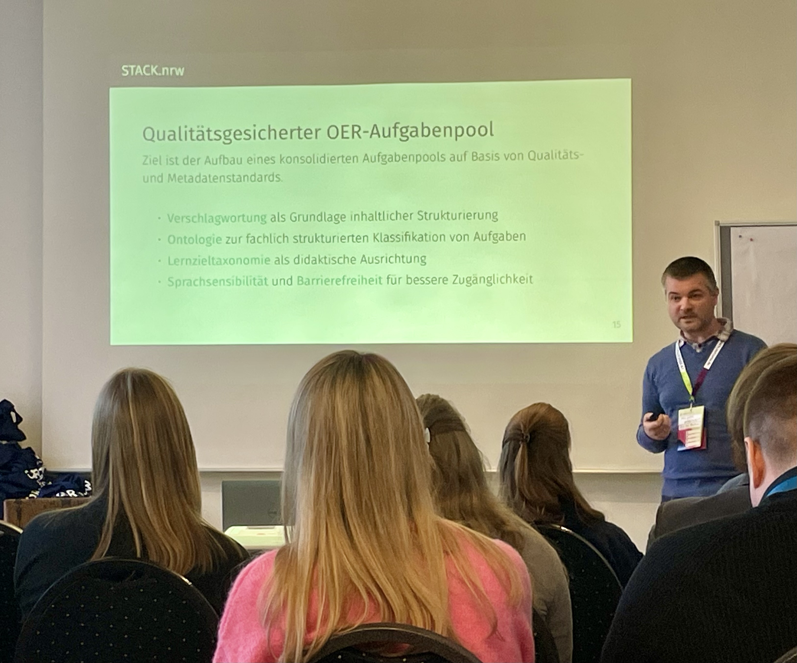
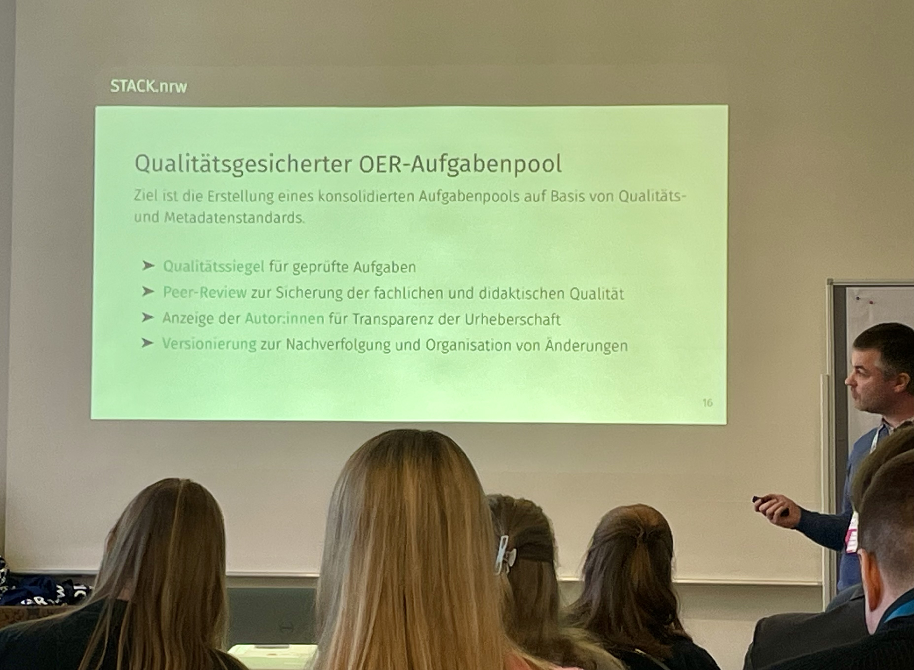

### 6. [Vorstellung und Evaluation des Projekts „DigStat – Digitale Lerneinheiten in der Statistik“](https://www.orca.nrw/wp-content/uploads/2024/11/OER_Tagung_Razeghpour_Mueller.pdf) – Farhad Razeghpour (Ruhr-Universität Bochum) und Christian Müller (Universität Düssseldorf)

Mathematisch und auch mit STACK ging es weiter: Wie kann man Studierende und Lehrende im Bereich Statistik unterstützen? Dem widmet sich das Projekt „[DigStat – Digitale Lerneinheiten in der Statistik](https://oer-stochastik-nrw.de/)“ und hat anwendungsnahe und illustrative digitale OER-Materialien entwickelt, um Grundkenntnisse von statistischen Methoden sowie Anwendungskompetenzen auf fachnahe reale Datensätze zu erwerben. 

Der erste Teil brachte bereits viel neuen Input! Nach der Mittagspause wurden vier parallele Sessions angeboten. Gina entschied sich für den Slot „OER in der Lehrkräftebildung“ von unserem Co-Projekt [digiLL_COM](https://digill.de/) aus der [OE_COM-Förderrichtlinie](https://www.oer-strategie.de/foerdern/foerderrichtlinien/):

Welche OER-Angebote gibt es im Bereich der Lehrkräftebildung? Wie setze ich OER sinnvoll in die eigene Lehre ein und wie kann ich eigene Inhalte als OER bereitstellen? Mit diesen Fragen beschäftigt sich das Projekt digiLL und möchte bereits in der Ausbildung von Lehrkräften ansetzen, um offene Bildungspraktiken zu vermitteln. Dabei werden verschiedene Hochschulstandorte miteinander vernetzt und im Bereich der Hochschullehre ein Wahlpflichtkurs entwickelt sowie [Lernmodule](https://digill.de/lernmodule/) zur Verfügung gestellt. Ihr Ansatz: Lernende bzw. Lehramtsstudierende als Produzierende einbeziehen! 

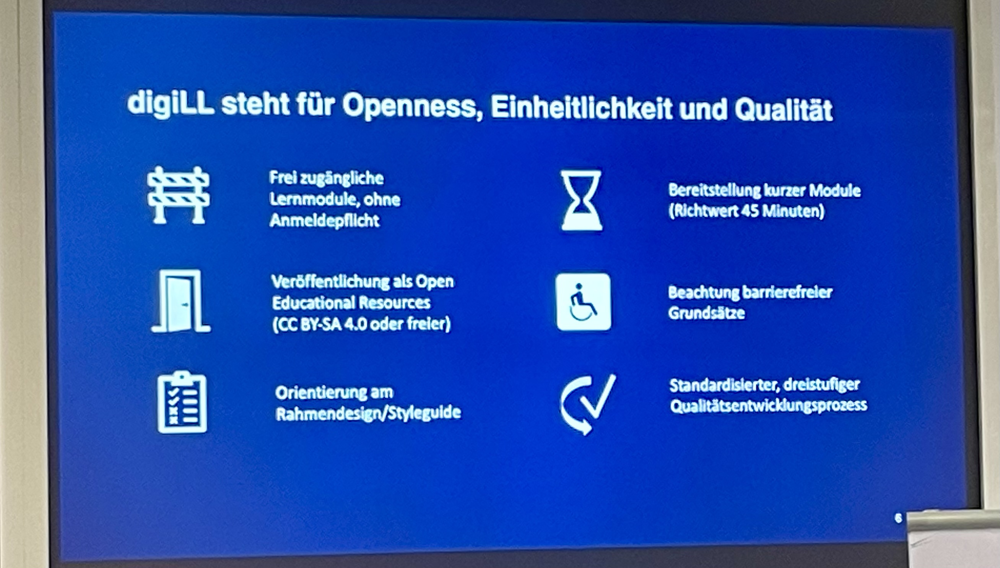

Mit dem Abendprogramm „10 Jahre [Bündnis Freie Bildung](https://buendnis-freie-bildung.de/): Feiern & Zukunft gestalten!“ endete der erste Tag voll spannender Impluse und netten Gesprächen!

# Tag 2
## Start der Barcamp-Sessions: Die Qual der Wahl

Es sind tatsächlich 55 Sessions an Tag 2 zusammengekommen, da fällt die Entscheidung nicht leicht! Gina entschied sich für folgende Sessions:

### Flexible Erstellung von Lehrmaterial

Wie kann ich als angehende Lehrkraft im Lehr-Lernkontext mit OER arbeiten? Welche Skills brauche ich und wo bekomme ich die her? Die Anzahl an Plattformen ist historisch gewachsen, aber dadurch teilweise unübersichtlich geworden. In der Session wurde diskutiert, welche Anlaufstellen es gibt, um sich einen ersten Überblick zu verschaffen, da über Suchmaschinen wie Google kaum OER gefunden werden. [OERinfo](https://open-educational-resources.de/) bündelt alles und wurde somit als Anlaufstelle Nr.1 genannt. Außerdem gilt es selbst als Multiplikator:in tätig zu sein, Fortbildungen zu nutzen, aber auch Universitäten und andere Anbieter können Zugänge über kleine Informationsangebote leisten. Weitere Vorschläge: Padlet / Taskcards als Lernbegleiter entlang der [5R (5V)](https://open-educational-resources.de/oerklaert-5v-freiheiten-in-der-gegenueberstellung-erklaert/) oder ein gemeinsames Wiki als Tool. Auch Feedbackfunktion für Materialien ist vielen wichtig! Einzelne Plattformen wie EduTags erlauben Feedback bereits, dennoch stellt sich die Frage, wie wir Communities und Feedbackstrukturen aufbauen können. 

Mehr dazu 👉 https://go.oercamp.de/24essen/talk/FRBH3E/

### Mit OER bessere Zukünfte möglich machen - ein Einstieg ins Design Futuring!

Design Futuring ist ein kreativer Ansatz, um Zukünfte zu entwerfen und zu verhandeln sowie um heutige Entscheidungen zu beeinflussen und aktiv zu werden. Nele Hirsch (ebildungslabor) hat in der Session drei Methoden vorgestellt, die wir gemeinsam erkunden und in Kleingruppen anhand konkreter Ideenentwicklungen ausprobieren konnten. 

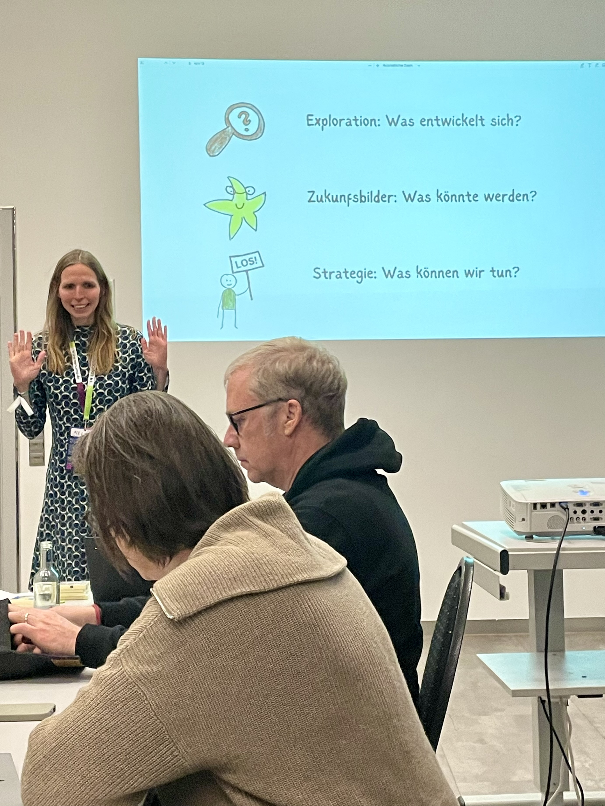

Die Slides dazu findet ihr hier:
https://ebildungslabor.de/slides/designfuturing.pdf

Mehr Infos zum Hintergrund und zum Vorgehen in der Session hier:
https://ebildungslabor.de/blog/design-futuring-aus-oer-perspektive/

### OER-Autorensysteme

Im Rahmen des [digiLL](https://digill.de/)-Projektes sollen bei der OER-Erstellung auch externe Autorinnen und Autoren einbezogen werden. In der Session sind wir der Frage nachgegangen, wie die Partizipation möglichst institutions- und bereichsübergreifend sowie plattformunabhängig gelingen kann. 

Mehr dazu 👉 https://go.oercamp.de/24essen/talk/E7FYZ8/ 

### edufeed - Soziale Bildungsinfrastrukturen

Wie ermächtigen wir Akteure ihre entwickelten Bildungsmaterialien eigenständig bereitzustellen? Dazu hat Steffen Rörtgen (FWU Institut für Film und Bild gGmbH) [edufeed](https://www.edufeed.org/) als Konzept einer sozialen Bildungsinfrastruktur vorgestellt, die es einerseits ermöglicht, Daten zu Bildungsmaterialien zu teilen und andererseits wie bei Mastodon in soziale Interaktion zu treten. Wir finden das klingt nach einem interessanten Konzept und unterstützen Steffen bei der Entwicklung!

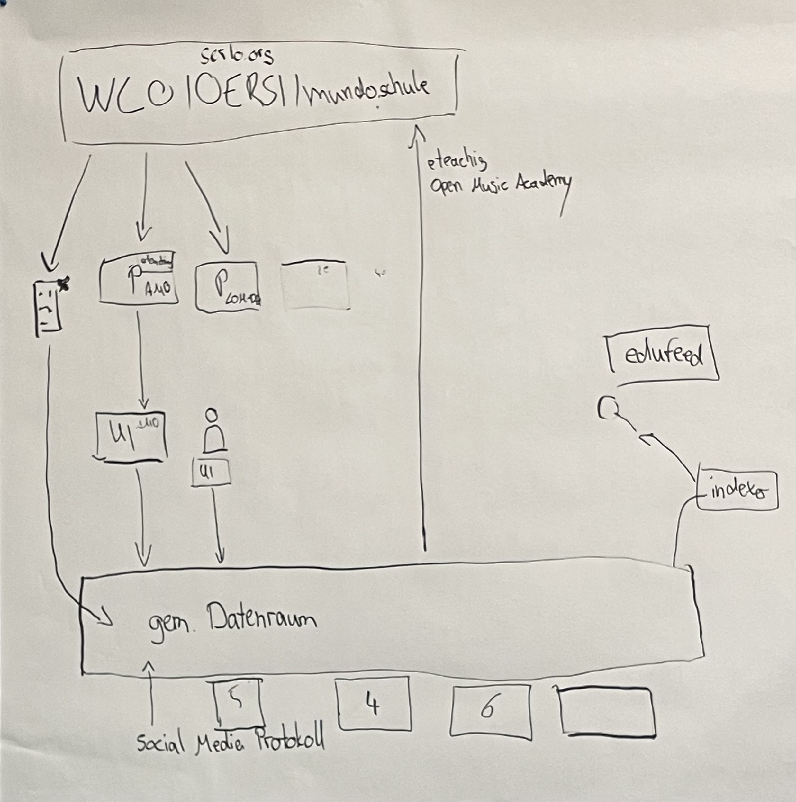

Mehr dazu 👉 https://go.oercamp.de/24essen/talk/PQHR8U/

### Narratives Communitybuilding

In der letzten Session des ersten Tages ging es darum, mit welchen Geschichten und Narrativen wir im Sinne des Storytellings verschiedene Zielgruppen erreichen und unsere jeweilige Community gestalten können. Eins wurde schnell klar: Wortspiele mit OER ziehen nicht, da der Begriff OER gar nicht unbedingt bekannt ist. Außerdem wurde überlegt, wie Vorteile von Offenheit so kommuniziert werden können, dass sie die Lebenswelt der heterogenen Bildungsakteure erreicht und zur Partizipation einladen. Ein schwieriges Thema… 

Ein Highlight noch zum Schluss „Dubai Calling“: Bei der [3rd OER World Congress](https://www.unesco.org/en/articles/3rd-unesco-world-oer-congress) in Dubai wurde die [OER-Strategie](https://www.oer-strategie.de/) des Bundes vorgestellt und Jöran Muuß-Merholz (Agentur J&K) als OERcamp-Korrespondent wurde live zugeschaltet. 

# Tag 3
## Beratschlagung zum Thema „OER im Kontext generativer Künstlicher Intelligenz (KI)“ (Schwerpunkt beim 3rd World Congress in Dubai)

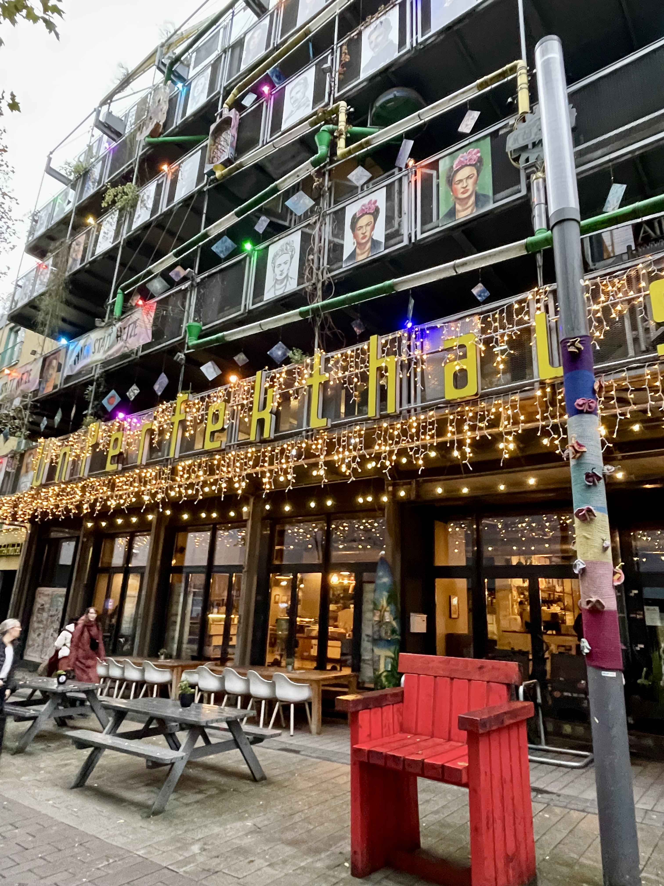
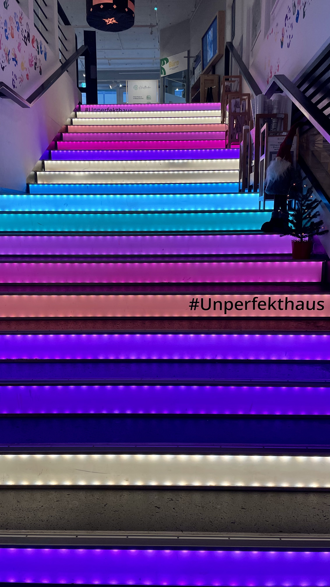

Der letzte Tag startete im Unperfekthaus in Essen mit drei XXL-Sessions im Barcamp-Format. Gina entschied sich für die Session moderiert von Frank Homp und Nele Hirsch zu Community-Beratschlagung zum Thema „OER im Kontext generativer Künstlicher Intelligenz (KI)“. Dabei wurde in Kleingruppen anhand folgender Leitfragen gebrainstormt:

1.	Wie kann die OER-Community von der aktuellen KI-Entwicklung profitieren?

2.	Was kann die OER-Community im Rahmen der aktuellen KI-Debatte beitragen?

Die Ergebnisse findet ihr unter https://www.oercamp.de/24/offene-ki/ 

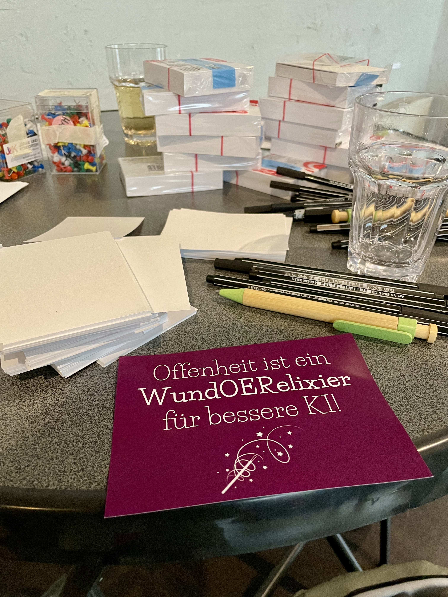
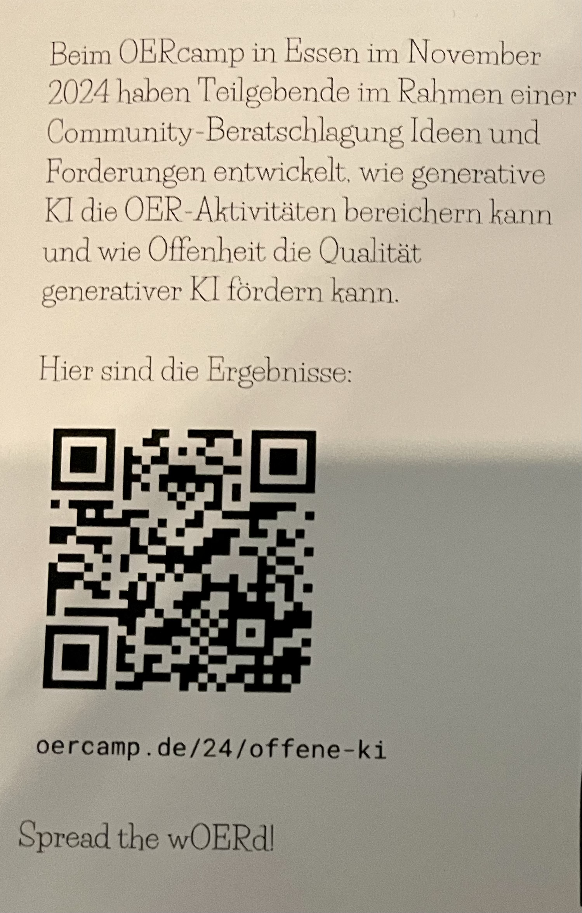

Zum Abschluss des OERcamps fanden noch drei Workshops des Bündnisses Freie Bildung zu Organisationsentwicklung, Offenheitskompetenzen und zukunftsweisende Bildungspolitik statt. Gina nahm am Workshop „Organisationsentwicklung“ von Celestine Kleinesper (Bündnis freie Bildung) & Matthias Kostrzewa (digiLL) teil. 

Worum es ging, erfahrt ihr hier 🎥

[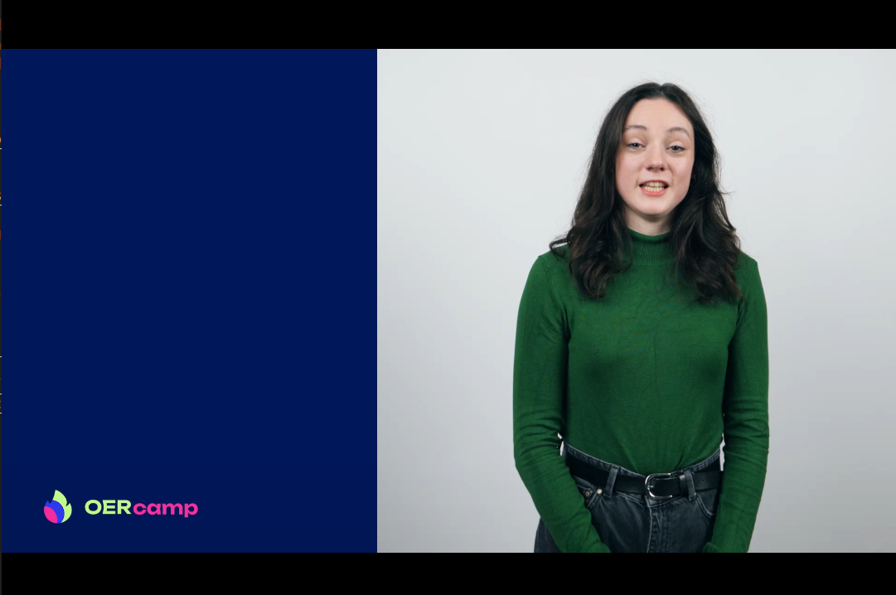](https://www.youtube.com/watch?v=gnNOrjSEwdk)

Mehr dazu 👉 https://go.oercamp.de/24essen/talk/DYGB3F/ 

Damit ging das OERcamp zu Ende! Es hat großen Spaß gemacht und der Kopf raucht vor lauter neuen Impulsen und Ideen, die wir in unserem FOERBICO-Projekt mit einfließen lassen wollen 🤯 Wir freuen uns auf´s nächste Mal 🤩

**Ihr findet das klingt spannend und wollt mit dabei sein?  
Hier die OERcamp-Termine für 2025:**

- [How-to-Barcamp Workshop](https://www.oercamp.de/25/howto-barcamp-kompakt/) | online | 16.01.2025 | 13:00 bis 16:00 Uhr
- [OERcamp 2025](https://www.oercamp.de/25/hannover/) | Hannover | 4. bis 6. September 2025
- [OERcamp.global 2025](https://www.oercamp.de/global/25/) | online | November 25-26, 2025 - 24 hours around the Globe | globally | via Zoom