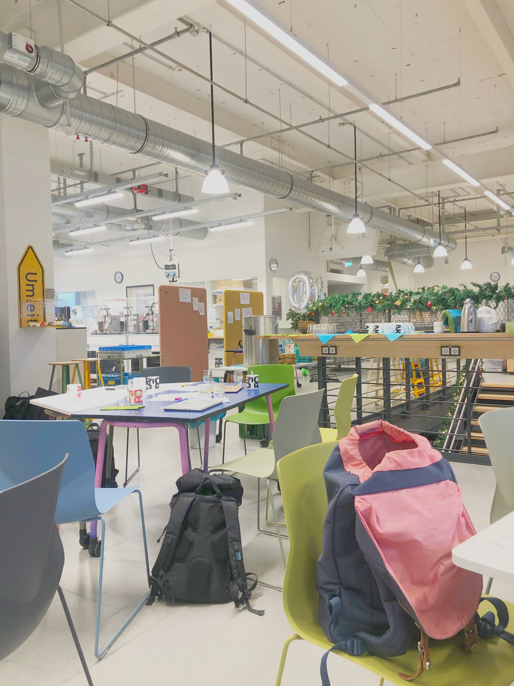
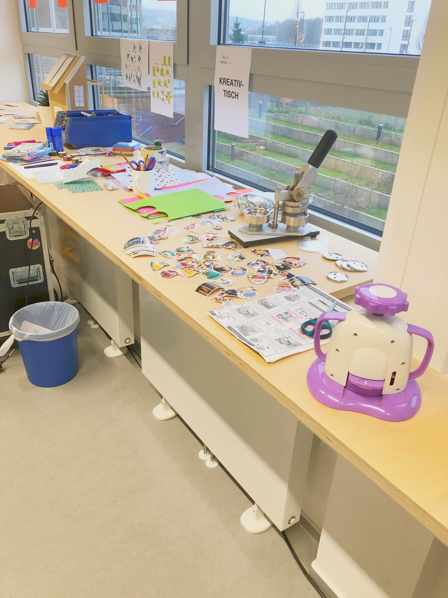

---
#commonMetadata:
'@context': https://schema.org/
creativeWorkStatus: Published
type: LearningResource
name: OEP ist nunmal eine Praxis
description: >-
  Im Dezember 2024 war Phillip Angelina aus dem FOERBICO Team zu Besuch bei der
  OER-Werkstatt von digiLL in Bochum.
license: https://creativecommons.org/licenses/by/4.0/deed.de
creator:
  - givenName: Phillip
    familyName: Angelina
    id: https://orcid.org/0000-0002-6905-5523
    type: Person
    affiliation:
      name: Friedrich-Alexander-Universität Erlangen-Nürnberg
      id: https://ror.org/00f7hpc57
      type: Organization
keywords:
  - OER
  - OEP
  - Openness
  - Open Educational Recourses
  - Open Educational Practices
inLanguage:
  - de
about:
  - https://w3id.org/kim/hochschulfaechersystematik/n544
  - https://w3id.org/kim/hochschulfaechersystematik/n545
educationalLevel:
  - https://w3id.org/kim/educationalLevel/level_A
  - https://w3id.org/kim/educationalLevel/level_C
#staticSiteGenerator:
author:
  - Phillip Angelina
title: OEP ist nunmal eine Praxis
cover:
  relative: true
  image: kreativtisch-ausschnitt.jpg
  hiddenInSingle: true
summary: |
  Vom 10. bis zum 11. Dezember 2024 fand eine OER-Werkstatt eines unserer Partnerprojekte [digiLL_COM](https://www.oer-strategie.de/projects/digill_com-projektsteckbrief/) in Bochum statt. Phillip vom FOERBICO-Team nahm daran teil und berichtet in diesem Beitrag über seine Erfahrungen. Zudem geht er der Frage nach, um was es sich bei Open Educational Practices (OEP) handelt.
url: oer-werkstatt-digill-com-projekt
---

## Werkstatt-Prinzip
Es gab viele kleine Tischgruppen, die an verschiedenen kleineren und größeren OER-Projekten arbeiten konnten. Es ermöglicht Menschen schnell in die Praxis zu kommen und miteinander kollaborativ zu arbeiten. Es gab zu verschiedensten Themen Expert:innen, die auch kurze *lightning-Talks* angeboten haben und sonst als Unterstützung für die Arbeitsgruppen dienten. [digiLL](https://digill.de/) ermöglichte einen Raum, in dem Menschen ins Tun kommen konnten. Teilnehmende waren Studierende, Lehrkräfte, Wissenschaftler:innen und Menschen die in anderen Formen in der Bildungsarbeit tätig sind. 

## Was ist eigentlich OEP?

Open Educational Practices beinhalten mehr als *nur* Materialien, die unter einer offenen Lizenz verfügbar sind. *Openness* ist in dem Fall ein Sammelbegriff der neben Ressourcen auch Praktiken, Arbeitsweisen und auch Technologien beinhaltet. Das Teilen von Wissen und Expertise trägt zu offenen Communities bei und ermöglicht OEP [(Van Allen & Kratz 2023: 1f.)](http://dx.doi.org/10.25304/rlt.v31.2829). OEP sind für Cronin, 
>»...collaborative practices that include the creation, use, and reuse of OER, as well as pedagogical practices employing participatory technologies and social networks for interaction, peer-learning, knowledge creation, and empowerment of learners« [(Cronin 2017: 4)](https://www.irrodl.org/index.php/irrodl/article/view/3096). 

OEP richtet den Fokus auf eine Prozessorientierung und somit weg von einer Materialorientierung [(Van Allen & Kratz 2023: 2)](http://dx.doi.org/10.25304/rlt.v31.2829). 

>»Open pedagogy deconstructs the traditional student–teacher relationship by providing space for and empowering students to actively engage in dialogue about concepts, curation of resources and co-creation of content« [(Van Allen & Kratz 2023: 4)](http://dx.doi.org/10.25304/rlt.v31.2829).

OEP erlaubt einen pädagogischen Wandel in der Lehrende und Lernende Co-Ersteller:in werden für das zu lernende Thema. Damit ändert sich der Fokus von einem klassischen Lehrenden-Lernenden Verhältnis hin zu einer Lerncommunity, oder auch eine Community of Practice [(Geeser 2007: 37ff.)](https://www.olcos.org/cms/upload/docs/olcos_roadmap.pdf). Diese Definition und Ausführung zeigt aber auch, dass es sich bei OEP nicht um eine spezielle pädagogische Praktik, sondern um eine Grundhaltung des Lehrens und Lernens handelt. Dies macht OEP auch sehr schwierig greifbar und wir von FOERBICO sowie andere Projekte, die zu OERs und OEPs forschen fragen sich: wie kommen wir von OER zu OEP? In ihrer Studie hält auch Cronin fest, dass OEP als Begriff und Konzept unbekannt ist [(Cronin 2017: 8)](https://www.irrodl.org/index.php/irrodl/article/view/3096). 
Dies deckt sich auch mit den Ergebnissen unserer qualitativen Erhebung, in denen nicht allen Interview-Teilnehmer:innen das Konzept bekannt war. Eine Erklärung kann darin liegen, dass OEP noch relativ neu ist und Menschen, die mit OER arbeiten, gerne von offenen Lernformen reden. Eine andere Möglichkeit kann aber auch darin liegen, dass OEP ein doch sehr theoretisches und nicht immer fassbares Konzept ist. Eine OER-Werkstatt wie die von digiLL zeigt, wie sich OEP in der Praxis gestalten lassen kann, zugleich können auch Formen von Cafés oder Fortbildungen Möglichkeiten sein, um OEP zu leben. Dieser Punkt kann nicht stark genug betont werden, denn OEP fordert zu einer neu gelebten Praxis heraus.

### OEP-Landkarte
Wie können wir individuelles Lernen mit OER fördern und zugleich OEP unterstützen? Ein Startup, das versucht OEP zu ermöglichen, ist [Learngraph](learngraph.org). Mit ihrer Lernkarte wollen sie Abhilfe schaffen. Man muss es sich als ein Googlemaps fürs Lernen vorstellen. Lernende können ihren Startweg und ihr Ziel eingeben, also ihren aktuellen Kenntnisstand und ihr Lernziel und Learngraph zeigt Menschen verschiedene Lernwege, die genommen werden können. Zudem soll eine Vernetzung mit anderen Mitlernenden oder Expert:innen ermöglicht werden, damit eine *temporäre* Community of Practice entstehen kann. 
Innerhalb unserer Gruppe haben wir viele Ideen gesammelt, um zu überlegen wie man die technischen Grundlagen didaktisch ausgestalten kann. Es kam auch zur Sprache, dass OEP als Konzept nicht so bekannt ist, aber auch die Hürden, die so einem innovativen Projekt strukturell im Wege stehen.

## Weitere Themen die diksutiert wurden
### OER und der Goldstandard
Weitere Diskussionen, die sich im Laufe der Tage ereigneten, drehten sich um die Chancen und Hürden von OER. Hier gab es viele Punkte die jeweils ihre eigenen Beiträge verdienen würden. Besprochene Themen waren: 
- Schule als ein System, welches Kräfte so bündelt, dass Lehrende leider nicht die Kapazitäten haben um sich in neue Arbeitsformen oder Systemen auseinander setzen.
- Der Goldstandard, welcher vor allem individuelle Erstellende überfordern kann, insbesondere im Bezug auf rechtliche Expertise-Mangel und Zeitressourcen, führt dazu, dass Menschen Material gar nicht oder zumindest nicht unter OER veröffentlichen.
- OER können neue Lern- und Prüfungsmöglichkeiten im universitären Kontext bieten, was gerade in Zeiten von KI zum Erlernen der 21. Century Skills relevant wird.
- Zudem wurde eine Frage aufgebracht, die mich wirklich zum Nachdenken über OER gebracht hat: *Wird in Zukunft nicht eigentlich das Remixen, also das Vermischen immer wichtiger*? Dabei geht es um den wichtigen Aspekt, ob nicht gerade dieser Punkt für OER-User:innen erleichtert werden muss.
- In einem weiteren Austausch zu OEP kam die Frage auf, ob es den Begriff OEP wirklich brauche, da viele dies in der Praxis anscheinend nicht fehlen würde und digitales Lernen häufig auf dieser Grundlage stattfände. Ein nennenswerter Punkt gegen diesen Einwand war, dass auf struktureller Ebene eine bessere theoretische Fundierung von OEP helfen könne von einer *Prozessorientierung zur Ergebnisorientierung* zu kommen. 

## Resumè
Alles in allem bot die OER-Werkstatt von digill_com viele Möglichkeiten OER zu erstellen, weiterzuentwickeln und förderte den Austausch innerhalb der Community. Viele Impulse aber auch offene Fragen konnte man mitnehmen. Die Werkstatt kann als gelebte OEP zusammengefasst werden, so schwer dieser Begriff wissenschaftlich festzuhalten ist, eröffnete die Werkstatt das Erleben von OEP in dem man es tat. 
      id: https://ror.org/00f7hpc57
      type: Organization
keywords:
  - OER
  - OEP
  - Openness
  - Open Educational Recourses
  - Open Educational Practices
  - ''
inLanguage:
  - de
about:
  - https://w3id.org/kim/hochschulfaechersystematik/n544
  - https://w3id.org/kim/hochschulfaechersystematik/n545
educationalLevel:
  - https://w3id.org/kim/educationalLevel/level_A
  - https://w3id.org/kim/educationalLevel/level_C
---

# OEP ist nunmal eine Praxis
Vom 10. bis zum 11.12.2024 fand eine OER-Werkstatt von einen unserer Partnerprojekte [digiLL_COM](https://www.oer-strategie.de/projects/digill_com-projektsteckbrief/) in Bochum statt. Phillip vom FOERBICO-Team nahm daran Teil und berichtet in diesem Beitrag über seine Erfahrungen und geht der Frage nach, um was es sich bei Open Educational Practices (OEP) handelt.

## Werkstatt-Prinzip
Es gab viele kleine Tischgruppen, die an verschiedenen kleineren und größeren OER-Projekten arbeiten konnten. Es ermöglicht Menschen schnell in die Praxis zu kommen und miteinander kollaborativ zu arbeiten. Es gab zu verschiedensten Themen Expert:innen, die auch kurze *lightning-Talks* angeboten haben und sonst als Unterstützung für die Arbeitsgruppen dienten. [digiLL](https://digill.de/) ermöglichte einen Raum, in dem Menschen ins Tun kommen konnten. Teilnehmende waren Studierende, Lehrkräfte, Wissenschaftler:innen und Menschen die in anderen Formen in der Bildungsarbeit tätig sind. 

## Was ist eigentlich OEP?

Open Educational Practices beinhalten mehr als *nur* Materialien, die unter einer offenen Lizenz verfügbar sind. *Openness* ist in dem Fall ein Sammelbegriff der neben Ressourcen auch Praktiken, Arbeitsweisen und auch Technologien beinhaltet. Das Teilen von Wissen und Expertise trägt zu offenen Communities bei und ermöglicht OEP [(Van Allen & Kratz 2023: 1f.)](http://dx.doi.org/10.25304/rlt.v31.2829). OEP sind für Cronin, 
>»...collaborative practices that include the creation, use, and reuse of OER, as well as pedagogical practices employing participatory technologies and social networks for interaction, peer-learning, knowledge creation, and empowerment of learners« [(Cronin 2017: 4)](https://www.irrodl.org/index.php/irrodl/article/view/3096). 

OEP richtet den Fokus auf eine Prozessorientierung und somit weg von einer Materialorientierung [(Van Allen & Kratz 2023: 2)](http://dx.doi.org/10.25304/rlt.v31.2829). 

>»Open pedagogy deconstructs the traditional student–teacher relationship by providing space for and empowering students to actively engage in dialogue about concepts, curation of resources and co-creation of content« [(Van Allen & Kratz 2023: 4)](http://dx.doi.org/10.25304/rlt.v31.2829).

OEP erlaubt einen pädagogischen Wandel in der Lehrende und Lernende Co-Ersteller:in werden für das zu lernende Thema. Damit ändert sich der Fokus von einem klassischen Lehrenden-Lernenden Verhältnis hin zu einer Lerncommunity, oder auch eine Community of Practice [(Geeser 2007: 37ff.)](https://www.olcos.org/cms/upload/docs/olcos_roadmap.pdf). Diese Definition und Ausführung zeigt aber auch, dass es sich bei OEP nicht um eine spezielle pädagogische Praktik, sondern um eine Grundhaltung des Lehrens und Lernens handelt. Dies macht OEP auch sehr schwierig greifbar und wir von FOERBICO sowie andere Projekte, die zu OERs und OEPs forschen fragen sich: wie kommen wir von OER zu OEP? In ihrer Studie hält auch Cronin fest, dass OEP als Begriff und Konzept unbekannt ist [(Cronin 2017: 8)](https://www.irrodl.org/index.php/irrodl/article/view/3096). 
Dies deckt sich auch mit den Ergebnissen unserer qualitativen Erhebung, in denen nicht allen Interview-Teilnehmer:innen das Konzept bekannt war. Eine Erklärung kann darin liegen, dass OEP noch relativ neu ist und Menschen, die mit OER arbeiten, gerne von offenen Lernformen reden. Eine andere Möglichkeit kann aber auch darin liegen, dass OEP ein doch sehr theoretisches und nicht immer fassbares Konzept ist. Eine OER-Werkstatt wie die von digiLL zeigt, wie sich OEP in der Praxis gestalten lassen kann, zugleich können auch Formen von Cafés oder Fortbildungen Möglichkeiten sein, um OEP zu leben. Dieser Punkt kann nicht stark genug betont werden, denn OEP fordert zu einer neu gelebten Praxis heraus.

### OEP-Landkarte
Wie können wir individuelles Lernen mit OER fördern und zugleich OEP unterstützen? Ein Startup, das versucht OEP zu ermöglichen, ist [Learngraph](learngraph.org). Mit ihrer Lernkarte wollen sie Abhilfe schaffen. Man muss es sich als ein Googlemaps fürs Lernen vorstellen. Lernende können ihren Startweg und ihr Ziel eingeben, also ihren aktuellen Kenntnisstand und ihr Lernziel und Learngraph zeigt Menschen verschiedene Lernwege, die genommen werden können. Zudem soll eine Vernetzung mit anderen Mitlernenden oder Expert:innen ermöglicht werden, damit eine *temporäre* Community of Practice entstehen kann. 
Innerhalb unserer Gruppe haben wir viele Ideen gesammelt, um zu überlegen wie man die technischen Grundlagen didaktisch ausgestalten kann. Es kam auch zur Sprache, dass OEP als Konzept nicht so bekannt ist, aber auch die Hürden, die so einem innovativen Projekt strukturell im Wege stehen.

## Weitere Themen die diksutiert wurden
### OER und der Goldstandard
Weitere Diskussionen, die sich im Laufe der Tage ereigneten, drehten sich um die Chancen und Hürden von OER. Hier gab es viele Punkte die jeweils ihre eigenen Beiträge verdienen würden. Besprochene Themen waren: 
- Schule als ein System, welches Kräfte so bündelt, dass Lehrende leider nicht die Kapazitäten haben um sich in neue Arbeitsformen oder Systemen auseinander setzen.
- Der Goldstandard, welcher vor allem individuelle Erstellende überfordern kann, insbesondere im Bezug auf rechtliche Expertise-Mangel und Zeitressourcen, führt dazu, dass Menschen Material gar nicht oder zumindest nicht unter OER veröffentlichen.
- OER können neue Lern- und Prüfungsmöglichkeiten im universitären Kontext bieten, was gerade in Zeiten von KI zum Erlernen der 21. Century Skills relevant wird.
- Zudem wurde eine Frage aufgebracht, die mich wirklich zum Nachdenken über OER gebracht hat: *Wird in Zukunft nicht eigentlich das Remixen, also das Vermischen immer wichtiger*? Dabei geht es um den wichtigen Aspekt, ob nicht gerade dieser Punkt für OER-User:innen erleichtert werden muss.
- In einem weiteren Austausch zu OEP kam die Frage auf, ob es den Begriff OEP wirklich brauche, da viele dies in der Praxis anscheinend nicht fehlen würde und digitales Lernen häufig auf dieser Grundlage stattfände. Ein nennenswerter Punkt gegen diesen Einwand war, dass auf struktureller Ebene eine bessere theoretische Fundierung von OEP helfen könne von einer *Prozessorientierung zur Ergebnisorientierung* zu kommen. 

## Resumè
Alles in allem bot die OER-Werkstatt von digill_com viele Möglichkeiten OER zu erstellen, weiterzuentwickeln und förderte den Austausch innerhalb der Community. Viele Impulse aber auch offene Fragen konnte man mitnehmen. Die Werkstatt kann als gelebte OEP zusammengefasst werden, so schwer dieser Begriff wissenschaftlich festzuhalten ist, eröffnete die Werkstatt das Erleben von OEP in dem man es tat. 