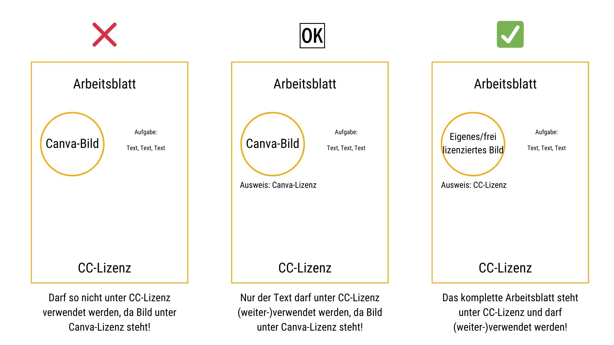

---
#commonMetadata:
'@context': https://schema.org/
creativeWorkStatus: Published
type: LearningResource
name: Canva für OER? Eine Entscheidungshilfe für Bildungsakteure
description: >-
  Open Educational Resources (OER) sind eine Möglichkeit Wissen frei zu teilen, zugänglich für alle zu machen und setzen kreative Freiräume. Viele Bildungsakteure greifen auf das Gestaltungstool Canva zurück. Der Blogbeitrag soll Bildungsakteuren als Entscheidungshilfe dienen und bietet Infos und Tipps zur Orientierung!
license: https://creativecommons.org/licenses/by/4.0/deed.de
id: https://oer.community/canva
creator:
  - givenName: Gina
    familyName: Buchwald-Chassée
    type: Person
    organisation:
      name: Comenius-Institut
      id: https://ror.org/025e8aw85
      type: Organization
  - givenName: Corinna
    familyName: Ullmann
    type: Person
    organisation:
      name: Comenius-Institut
      id: https://ror.org/025e8aw85
      type: Organization
keywords:
  - Rechtsfragen
  - OER
  - Bildlizenzen
  - Bildrechte
  - Canva
inLanguage:
  - de
about:
  - Canva
  - Open Educational Resources
image: https://oer.community/canva/Canva-OER-KI-generiert.jpg
learningResourceType:
  - https://w3id.org/kim/hcrt/text
  - https://w3id.org/kim/hcrt/web_page
datePublished: '2024-12-19'
#staticSiteGenerator:
author:
  - Gina Buchwald-Chassée
  - Corinna Ullmann
title: 'Canva für OER? Eine Entscheidungshilfe für Bildungsakteure'
cover:
  relative: true
  image: Canva-OER-KI-generiert.jpg
  hiddenInSingle: false
summary: |
  Open Educational Resources (OER) sind eine Möglichkeit Wissen frei zu teilen,
  zugänglich für alle zu machen und setzen kreative Freiräume. Viele Bildungsakteure
  greifen auf das Tool [Canva](https://www.canva.com/) zurück, ein beliebtes
  Design-Tool mit dem Workshop-Handouts, Präsentationen und Social-Media-Posts
  im Handumdrehen erstellt sind. Doch sind die Designs, Vorlagen, Bilder einfach für OER nutzbar?
  Ein [Artikel von irights-Info](https://irights.info/artikel/canva-oer/32239) machte uns auf die Problematik aufmerksam,
  doch die Richtlinien von Canva enthielten dazu keinen eindeutigen Verweis.
  Also haben wir bei der [Rechtinformationsstelle von ORCA.nrw](https://www.orca.nrw/oer/oer-erstellen/rechtsinformation/) angefragt und
  hier die wichtigsten Infos und Tipps als Orientierung für euch zusammengefasst!
url: canva
---

## Sind die Designs, Vorlagen, Bilder von [Canva](https://www.canva.com/) einfach für OER nutzbar?

 Ein [Artikel von irights-Info](https://irights.info/artikel/canva-oer/32239) machte uns auf diese Problematik aufmerksam. Die Richtlinien von Canva enthielten dazu keinen eindeutigen Verweis. Deswegen haben wir bei der [Rechtinformationsstelle von ORCA.nrw](https://www.orca.nrw/oer/oer-erstellen/rechtsinformation/) angefragt und
  hier die wichtigsten Infos und Tipps als Orientierung für euch zusammengefasst!

## Stolperstein: Ihr habt nur ein Nutzungsrecht

Canva ist zwar ein tolles Gestaltungstool, aber die Inhalte, die ihr dort findet – sei es eine hübsche Vorlage, ein Stockfoto oder ein Icon – sind urheberrechtlich geschützt unter der Canva-Lizenz. Und das bedeutet: Kostenlos ≠ frei verfügbar! Ihr habt nur ein Nutzungsrecht, keine freie Lizenz. Für OER braucht ihr allerdings Inhalte, die unter einer [Creative Commons-Lizenz (CC-Lizenz)](https://creativecommons.org/share-your-work/cclicenses/) oder einer anderen freien Lizenz stehen.

### Ein Beispiel:

Ihr erstellt mit Canva ein Handout und nutzt ein schönes Stockfoto aus der Bibliothek. Das Foto ist aber nur für eure private oder berufliche Nutzung unter der Canva-Lizenz freigegeben. Sobald ihr das Handout als OER hochladet und zur freien Nutzung anbietet, verstößt ihr gegen die Nutzungsbedingungen – das Foto ist nämlich immer noch durch das Urheberrecht geschützt!

 

### Tipp:

Bei Lizenznachweisen haltet euch am besten an die [TULLUBA-Regel](https://www.orca.nrw/oer/oer-nutzen/tulluba-regel/):

- **T**itel des Werks (wenn vorhanden)
- **U**rheber*innen des Werks
- **L**izenz des Werks (inkl. Version der Lizenz)
- **L**ink zum Lizenztext
- **U**rsprungsort des Werks (Link zum Original)
- **B**earbeitungen des Werks
- **A**usnahmen

## Einfach und rechtssicher: So klappt’s mit OER

Damit ihr rechtlichen Fallstricke umgeht, hier ein paar Tipps, um "save" zu sein:

### Nutzt freie Alternativen zu Canva 🎨

Tools wie [Penpot](https://penpot.app) oder [Krita](https://krita.org/de/) bieten euch die Möglichkeit, Designs zu erstellen – und das ganz ohne Lizenzprobleme. Klar, der Funktionsumfang ist anders, aber für OER seid ihr auf der sicheren Seite.

### Setzt auf eigene Inhalte 📸

Selbst erstellte Fotos, Zeichnungen oder Icons sind die beste Wahl. Noch besser: Ihr könnt diese Inhalte dann selbst unter einer freien Lizenz veröffentlichen und anderen zur Nutzung zur Verfügung stellen.

### Nutzt freie Bilddatenbanken 🖼️

Plattformen wie [Wikimedia Commons](https://commons.wikimedia.org/wiki/Hauptseite), [Openverse](https://openverse.org/de), [CocoMaterial](https://cocomaterial.com/), [Public Domain Image Archive](https://pdimagearchive.org/) oder teilweise [Pexels](https://www.pexels.com/de-de/) und [Europeana](https://www.europeana.eu) bieten beispielsweise viele Inhalte unter CC-Lizenz. Achtet dabei immer auf die genaue Lizenzangabe! Aber wie steht es um KI-generierte Bilder? Auch hier gilt es die Nutzungslizenzen der verschiedenen Anbieter zu beachten, hier ein paar Beispiele:

**DALL·E (OpenAI):** Kann für OER genutzt werden, sofern die generierten Bilder vom Nutzenden unter eine CC-Lizenz gestellt werden.

**Stable Diffusion:** Generierte Bilder sind in der Regel frei nutzbar, solange keine verbotenen Inhalte erstellt wurden (z. B. gewaltverherrlichende oder urheberrechtlich geschützte Werke kopiert) und sind somit für OER geeignet.

**MidJourney**: Die Lizenzierung für OER hängt von der jeweiligen Mitgliedschaft und den entsprechenden Nutzungsrechten und Lizenzbedingungen ab.

**Canva KI-Generator**: KI-generierte Inhalte unterliegen den Canva-Lizenzbedingungen. Eine Weitergabe unter CC-Lizenzen ist meistens nicht gestattet! Schaut euch dazu am besten die [Lizenzbestimmungen](https://www.canva.com/de_de/richtlinien/free-media/) und die [Nutzungsbedingungen](https://www.canva.com/de_de/richtlinien/ai-product-terms/) von Canva an.

### Wählt Schriftarten sorgfältig aus ✍️ 

Standard-Schriftarten wie Arial oder Times New Roman sind kein Problem. Bei ausgefallenen Schriften schaut lieber einmal mehr auf die Lizenz – oder greift auf freie Schriftarten von [Google Fonts](https://fonts.google.com/), [Font Library](https://fontlibrary.org/) oder [Open Foundry](https://open-foundry.com/) zurück.

### Geometrische oder standardisierte Formen? Kein Problem! 🟦 

Einfache Figuren wie Kreise oder Rechtecke und Linien genießen keinen urheberrechtlichen Schutz. Diese dürfen somit auch für die Gestaltung von OER-Materialien ohne Angabe einer Lizenz vewendet werden!

### So sieht euer rechtssicheres OER-Material aus!

Am Ende sollte euer OER-Material so gestaltet sein, dass ihr keinerlei urheberrechtlich geschützte Inhalte verwendet, die unter einer geschlossenen Lizenz stehen. Materialien für die OER-Erstellung erhaltet ihr z.B. bei [ORCA.nrw](https://www.orca.nrw/oer/oer-erstellen/materialien-oer-erstellung/). bei Stellt euch einfach die Frage: „Kann das, was ich hier gestalte, bedenkenlos von jeder Person weiterverwendet werden?“
Wenn ja: Perfekt, euer Werk ist OER-ready!

Ihr möchtet freie Bildungsmaterialien erstellen, seid aber nach wie vor unsicher bezüglich der Nutzungsrechte? Dann laden wir euch herzlich in unseren offenen Element-Raum "[OER-Rechtsfragen](https://matrix.to/#/#oer-rechtsfragen:rpi-virtuell.de)" ein!