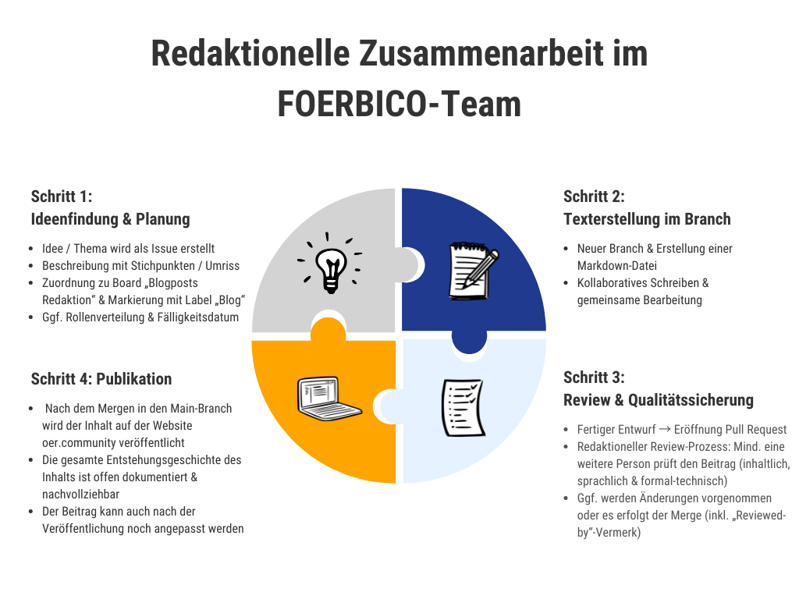
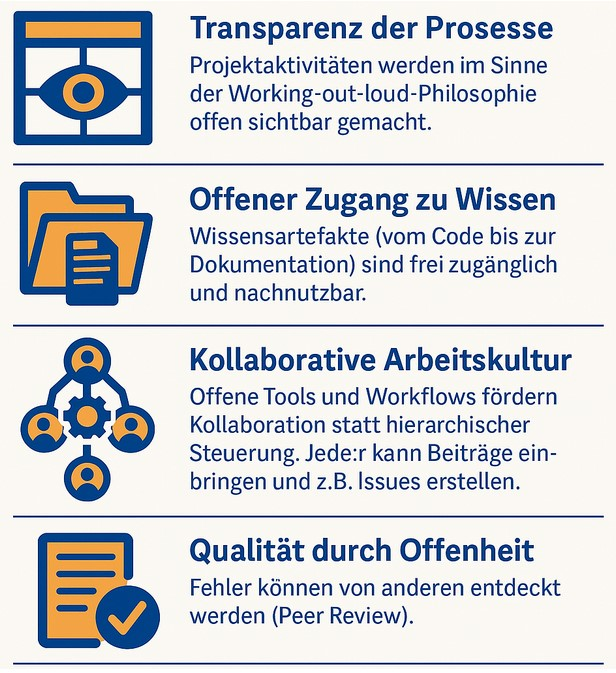

# So arbeiten wir in der oer.community

## Vorweg: Offene Projektkultur im Kontext von FOERBICO

Das Projekt **FOERBICO** (Förderung offener Bildungspraktiken in religionsbezogenen Communities durch die Entwicklung eines koordinierten OER-Ökosystems) wird vom [Comenius-Institut](https://comenius.de/2024/03/28/foerderung-offener-bildungspraktiken-in-religionsbezogenen-communities-durch-die-entwicklung-eines-koordinierten-oer-oekosystems-foerbico/) in Kooperation mit der Goethe-Universität Frankfurt (GU) und der Friedrich-Alexander-Universität Erlangen-Nürnberg (FAU) durchgeführt. Ziel ist es, bislang isolierte Aktivitäten in OER-Communities zu vernetzen und offene Bildungspraktiken (Open Educational Practices, *OEP*) zu stärken. Diese offene Ausrichtung spiegelt sich nicht nur in den Projektzielen wider, sondern auch in der Art und Weise, **wie wir im Projekt zusammenarbeiten**. Alle Arbeitsprozesse – von der technischen Entwicklung bis zur inhaltlichen Redaktion – erfolgen transparent, kollaborativ und unter Nutzung offener und nachnutzbarer digitaler Werkzeuge unter freien Nutzungslizenzen. Im Folgenden dokumentieren wir unsere Arbeitsweise als Team, um Beteiligten und Fördernden einen Einblick in unsere Methoden zu geben. Gleichzeitig soll dieser Beitrag neuen Mitarbeitenden als Anleitung dienen.

Wir nutzen konsequent eine offene, git-basierte Infrastruktur zur Organisation des Projekts. Das bedeutet, dass *alle* Projektmaterialien, Aufgaben und Ergebnisse in **Versionkontrollrepositories (Git)** verwaltet werden und somit für das Team (und wo immer dies datenschutzkonform möglich ist, weitestgehend auch für die Öffentlichkeit) einsehbar sind. Dadurch gewährleisten wir Transparenz über den Projektfortschritt und ermöglichen Zusammenarbeit über Institutionsgrenzen hinweg. Im Sinne von OEP fördern wir eine Kultur des Teilens und der gemeinsamen Verantwortung: Inhalte werden als Open Educational Resources (OER) unter freier Lizenz erstellt, und auch die Prozesse zu ihrer Entstehung sind offen nachvollziehbar. Im Folgenden beschreiben wir die zentralen technischen Abläufe (Git-Workflows, Branching, Merge-Strategien, Continuous Integration) und die redaktionelle Zusammenarbeit (Texterstellung, Review, Aufgabenverteilung) im Projekt. Abschließend heben wir hervor, wie diese Praktiken zur offenen Bildungsarbeit beitragen, und geben praktische Hinweise für den Einstieg neuer Teammitglieder und zu Kooperationsmöglichkeiten beispielsweise in der [OER-Strategie](https://www.oer-strategie.de/).

## Versionsverwaltung und Repository-Struktur

Im FOERBICO-Projekt setzen wir auf Git als zentrales Werkzeug für Versionsverwaltung und Kollaboration. Unsere Projektmaterialien liegen in einem Git-Repository auf der Plattform [**git.rpi-virtuell.de**](https://git.rpi-virtuell.de/) ([Forgejo](https://forgejo.org/)-basiert). Ein Git-Repository kann man sich als einen Ablageort von Dateien vorstellen, an dem man leicht verschiedene Bearbeitungsstände (Versionen) verwalten kann. [Dieses Hauptrepository](https://git.rpi-virtuell.de/Comenius-Institut/FOERBICO) enthält den gesamten Quelltext der Projekt-Website sowie begleitende Dokumentation und Bildungsinhalte. Der Repository-Titel sowie die Beschreibung machen unseren Projektauftrag direkt ersichtlich. Mit derzeit 16 Branches und über 600 Commits (Stand: April 2025) zeigt sich zunehmend eine rege Entwicklungs- und Redaktionstätigkeit. Ein Branch (wörtlich "Zweig") ist die Sammlung von Änderungen ab einem gewissen Bearbeitungsstand. Durch einen Commit lässt sich ein Bearbeitungsstand festlegen, der einen Zwischenstand aller erfolgten Änderungen enthält. So ein Commit lässt sich später z. B. veröffentlichen ("push"), wiederherstellen, abändern oder "weiterreichen". Die Nutzung von Git ermöglicht uns sehr flexibel und genau, **Änderungen an Dateien nachzuverfolgen**, frühere Versionen wiederherzustellen und parallel an verschiedenen Inhalten (durch mehrere Branches) zu arbeiten, ohne Datenverlust oder Konflikte.

**Struktur des Repositories:** Wir haben im Repository eine klare Ordnerstruktur etabliert, welche technische Komponenten und redaktionelle Inhalte trennt. Beispielsweise liegen Quellcode und Design der Website im Ordner `Website/` und `design/`, während Anleitungen, Präsentationen sowie Lehr- und Lernmaterialien in Markdown-Dateien in sich entwickelnden Verzeichnisstrukturen abgelegt sind. Zusätzliche Verzeichnisse wie `assets/` dienen der Ablage von Bildern und Medien. Außerdem existiert ein Verzeichnis `archiv/`, in dem wir projektbezogene Berichte und archivierte Dokumente versioniert ablegen (z. B. Projektzwischenberichte als Markdown). Zentrale Übersichts- und Planungsdokumente sind als Markdown-Dateien vorhanden, darunter `README.md` (Einstiegsinformationen), `Ziele.md` (Projektziele), `Meilensteine.md` (Übersicht der Arbeitspakete). So ist es beispielsweise möglich, dass wir [ein sich aktualisierendes Gantt-Chart der Projektplanung hier interaktiv](https://projekt.oer.community/gantt/) direkt mit den Meilensteinen und zugeordneten Aufgaben erschließbar machen können. Aus der Datei `FOERBICO-Workflow.drawio` lässt sich kooperativ und versionierbar [hier ein Diagramm unserer internen Arbeitsabläufe](https://app.diagrams.net/?src=about#Uhttps%3A%2F%2Fgit.rpi-virtuell.de%2FComenius-Institut%2FFOERBICO%2Fraw%2Fbranch%2Fmain%2FFOERBICO-Workflow.drawio) transparent entwickeln. Durch diese offene Dokumentation direkt im Repository sind alle Teammitglieder stets auf demselben Stand bezüglich Zielsetzungen, Zeitplanung und Verantwortlichkeiten.

**Offene Lizenzierung:** Sämtliche Inhalte im Repository unterliegen offenen Lizenzen. Wir verwenden vornehmlich die [*Creative Commons BY 4.0*](https://creativecommons.org/licenses/by/4.0/deed.de)-Lizenz, wie in unseren [Mitwirkungsrichtlinien](https://git.rpi-virtuell.de/Comenius-Institut/FOERBICO/src/branch/main/contributing.md) festgehalten. Das bedeutet, dass alle von uns neu erstellten oder bearbeiteten Materialien offen nachnutzbar sind, sofern Urheberschaft genannt wird. Diese Lizenz ist im Repository durch die Datei [`LICENSE`](https://git.rpi-virtuell.de/Comenius-Institut/FOERBICO/src/branch/main/LICENSE) und entsprechende Hinweise in den Beitragsrichtlinien verankert. Damit stellen wir sicher, dass nicht nur unsere Prozesse offen sind, sondern auch die entstehenden Bildungsressourcen frei verwendet werden dürfen – ein Kernprinzip von Open Educational Resources.

Zusätzlich zum Hauptrepository existieren weitere spezialisierte Repositories innerhalb der selbstgehosteten Git-Plattform sowie auf gitlab und github, etwa für die Verwaltung von Metadaten. Ein Beispiel ist das [**OERSI-Datensatz**-Repository](https://gitlab.com/comenius-institut/foerbico/oersi-datensatz), über das wir Metadaten zu unseren OER-Inhalten für den übergreifenden OER-Search-Index (OERSI) bereitstellen (dies wurde im Oktober 2024 angelegt und enthält strukturierte Metadaten). Solche Teil-Repositories ermöglichen es, technische Komponenten oder Datenbestände auszulagern und separat zu versionieren, während wir über das Hauptprojekt-Repository die Gesamtkoordination behalten. Alle Repositories unter dem FOERBICO-Dach sind im Comenius-Institut Gitlab/Forgejo aufgeführt und mit dem Projekt verknüpft, was eine konsistente Nutzung von Issues und Meilensteinen (siehe unten) über Projektgrenzen hinweg ermöglicht.

## Aufgabenverwaltung mit Issues, Labels und Meilensteinen

Zur **Organisation von Aufgaben und Projektmanagement** nutzen wir intensiv das integrierte Issue-Tracking-System der Git-Plattform. Jedes Arbeitspaket, jede Idee oder jedes Problem wird als **Issue** erfasst. Ein Issue darf man sich wie eine Karte auf einer Pinnwand vorstellen, auf der eine Frage, ein Thema oder Problem festeghalten ist und dort diskutiert wird. So wird eine transparente Diskussionen gefördert: alle Kommentare, Entscheidungen und Zuständigkeiten zu einer Aufgabe sind an einem Ort dokumentiert. Aktuell werden über 100 [offene Issues in unserem Hauptrepository](https://git.rpi-virtuell.de/Comenius-Institut/FOERBICO/issues) parallel verwaltet (Stand April 2025: z. B. 125 offene und 115 geschlossene Issues), was den aktiven Fortschritt und kontinuierlichen Abschluss von Aufgaben widerspiegelt.

**Label-System:** Um die Vielzahl an Issues übersichtlich zu halten, etablieren wir ein **System von Labels (Schlagworten)** und ordnen Zuständigkeiten sowie die Meilensteine aus den Arbeitspaketen unserer Projektplanung zu. Jedes Issue wird mit mindestens einem Label versehen, das seinen Typ oder Themenbereich kennzeichnet. Beispiele für Labelkategorien in unserem Projekt sind:

- **Inhaltliche Art:** *Blog* (für Blogartikel und redaktionelle Beiträge), *Events* (für Veranstaltungsorganisation), *Offene Frage* (Diskussions- oder Klärungsbedarf), *Verbesserung* (Vorschläge zur Weiterentwicklung), *Fehler/Bug* (technische Probleme).
- **Zuständigkeit/Team:** *technik* (für technische Aufgaben des Informatik-Teams), oder Labels mit Partnerkürzeln wie *FAU* bzw. *GU*, um Aufgaben der jeweiligen Hochschulpartner zu markieren. So ist sofort erkennbar, wer primär involviert ist.
- **Projektmitarbeitende einbinden:** Wir nutzen auch Labels, um die Einbindung neuer oder externer Mitwirkender zu erleichtern, etwa *gutes erstes Issue* (eine Einstiegsaufgabe für neue Mitglieder) und *Hilfe gesucht* (hier werden Beiträge aus der Community explizit erwünscht). Diese Markierungen im Sinne von OEP signalisieren unsere Offenheit über die eigene Projektgrenze hinweg: Interessierte Personen können sich niedrigschwellig einbringen, indem sie solche Issues übernehmen.

Durch die Kombination von Labels lassen sich Issues filtern (z. B. alle offenen technischen Bugs) und gezielt zuordnen. Das gesamte Team hat damit stets den Überblick, welche Aufgaben anstehen und welcher Natur sie sind.

**Meilensteine und Arbeitspakete:** Zur langfristigen Planung sind unseren Issues **Meilensteine** zugeordnet. Wir orientieren uns dabei an den formal definierten **Arbeitspaketen (AP)** des Projektantrags. Jedes Arbeitspaket (z. B. [*AP 11-1 Basiserhebung (FAU)*](https://git.rpi-virtuell.de/Comenius-Institut/FOERBICO/milestone/10)) wird als Meilenstein im System abgebildet. So werden zusammengehörige Aufgaben gebündelt und ihrem übergeordneten Ziel zugewiesen. Beispiel: Das Arbeitspaket [*AP 4-3 + 4-4: Metadaten-Generator für OEP/OER*](https://git.rpi-virtuell.de/Comenius-Institut/FOERBICO/milestone/90) umfasst mehrere technische Issues zur Entwicklung eines Tools – all diese Issues tragen den entsprechenden Meilenstein, wodurch Fortschritt und verbleibende To-Dos in diesem Bereich nachvollziehbar sind. Einige Meilensteine sind an bestimmte Projektphasen oder Zyklen gekoppelt (etwa Evaluationszyklen), was wir ebenfalls im Namen kenntlich machen. Sobald alle Issues eines Meilensteins erledigt sind, gilt das entsprechende Arbeitspaket als abgeschlossen und der Meilenstein wird geschlossen (beispielsweise wurde [*AP 9-3 Kollaborationsumgebung für das Projekt (CI)*](https://git.rpi-virtuell.de/Comenius-Institut/FOERBICO/milestone/4) bereits erfolgreich implementiert.

Die Verwendung von Meilensteinen stellt sicher, dass das **operative Issue-Tracking mit der strategischen Projektplanung** verzahnt ist. Projektleitung und Fördermittelgeber können so den Fortschritt je Arbeitspaket direkt im System mitverfolgen. Zudem können wir Fälligkeiten (Due-Dates) an Issues vergeben, um fristgebundene Entwicklungsziele zu steuern – etwa ist für gewisse Forschungsaufgaben eine Erledigung bis Projektende (z. B. August 2026) hinterlegt.

**Kanban-Projekttafeln:** Neben der linearen Liste aller Issues nutzen wir **Projekttafeln** (Boards), um Aufgaben innerhalb bestimmter Kontexte agil zu organisieren. Wir haben mehrere **Project Boards** eingerichtet, die thematisch oder teambezogen gruppiert sind.

- [*Blogposts Redaktion*](https://git.rpi-virtuell.de/Comenius-Institut/FOERBICO/projects/25): Board für alle Aufgaben rund um Blogartikel und redaktionelle Beiträge. Hier bewegen sich Issues typischerweise vom Stadium "Idee" über "In Arbeit" bis "Veröffentlicht".
- [*Projekt-Technik*](https://git.rpi-virtuell.de/Comenius-Institut/FOERBICO/projects/2): Board für technische Entwicklungsaufgaben (Software, Infrastruktur). Das Informatik-Team priorisiert hier Bugs und Features.
- [*Webseite oer.community*](https://git.rpi-virtuell.de/Comenius-Institut/FOERBICO/projects/38): Board spezifisch für Aufgaben zur Projekt-Website (Inhalte einpflegen, technische Anpassungen am Webauftritt).
- [*Austausch FOERBICO Team*](https://git.rpi-virtuell.de/Comenius-Institut/FOERBICO/projects/33): Board für allgemeine Team-Aufgaben und den regelmäßigen internen Austausch. Hier werden z. B. Vorbereitungspunkte für Teammeetings oder Workshops gesammelt.
- [*Empirische Begleitforschung*](https://git.rpi-virtuell.de/Comenius-Institut/FOERBICO/projects/41): Board für Forschungsaufgaben (Interviews, Erhebungen, Auswertungen) der wissenschaftlichen Verbundpartner.
- [*(biweekly)*](https://git.rpi-virtuell.de/Comenius-Institut/FOERBICO/projects/26): Ein Board namens "biweekly" nutzen wir für die 14-tägigen Sprints bzw. Meetings, in denen wir mit allen Projektbeteiligten Absprachen treffen und unsere Aufgaben planen und nachverfolgen.

Jede dieser Tafeln bietet Spalten wie "To Do", "In Bearbeitung" und "Erledigt". Die Teammitglieder verschieben ihre Issues entsprechend des Bearbeitungsstandes. Dieses visuelle Management hilft, **Arbeitsstände schnell zu überblicken** und Engpässe zu erkennen (z. B. wenn zu viele Aufgaben gleichzeitig in Bearbeitung sind). Beispielsweise sieht man auf einen Blick alle aktuell in Arbeit befindlichen Blogartikel im Board *Blogposts Redaktion*. Das fördert auch die Selbstorganisation: Teammitglieder können eigenständig neue Aufgaben aus dem Backlog ziehen, wenn Kapazität frei wird. Insgesamt ergänzen die Kanban-Tafeln das Issue-System um eine **dynamische, sprintorientierte Perspektive** und tragen zu einer agilen Projektsteuerung bei.

## Git-Workflow: Branching, Pull Requests und Continuous Integration

Für die praktische Zusammenarbeit am Repository folgen wir einem klar definierten **Git-Workflow**, der sowohl paralleles Arbeiten ermöglicht als auch Qualität durch Review sicherstellt.

**Branching-Strategie:** Wir arbeiten primär auf dem zentralen **Main-Branch**, der den jeweils aktuellen freigegebenen Projektstand repräsentiert. Neue Funktionen, Inhalte oder größere Änderungen entwickeln wir in eigenen **Feature-Branches**. Diese Branches werden aussagekräftig benannt, oft nach dem Inhalt oder der Issue-Nummer. Beispielsweise wurden Blogartikel in Branches wie `feature/blogartikel-nostr-dezentrale-oer-oep` vorbereitet. Durch diese Aufteilung kann ein Teammitglied an einem neuen Artikel oder einem Code-Feature arbeiten, ohne den Main-Branch (und damit die live sichtbare Website) zu beeinträchtigen. Mehrere Branches (aktuell ~16 parallel vorhandene) bedeuten, dass verschiedene Teammitglieder und Teilprojekte gleichzeitig voranschreiten.

**Zusammenführung via Pull Requests:** Ist eine Arbeit auf einem Branch abgeschlossen, stellen wir einen **Merge Request (Pull Request)**. Dieser Mechanismus ermöglicht es, die geplanten Änderungen vom Branch in den Main-Branch zu überführen, **nachdem eine Qualitätskontrolle stattgefunden hat**. Im Pull Request sehen alle Beteiligten den **diff** (die konkreten Änderungen) und eine **Diskussionsmöglichkeit**, um Feedback zu geben. Typischerweise muss mindestens eine andere Person den Request überprüfen und freigeben. FOERBICO hat hier einen hohen Qualitätsanspruch: Bei inhaltlichen Beiträgen (z. B. Blogposts) schauen oft sowohl jemand aus dem Redaktionsteam als auch jemand aus dem Technikteam drüber. Unser Repository vermerkt bei Merge-Commits explizit, wer den Beitrag gereviewt hat – so finden sich in den Commit-Metadaten *Reviewed-by*-Einträge mit Name und E-Mail der Reviewer. Erst wenn die Reviews positiv sind, wird der Pull Request gemergt (entweder automatisch durch das System oder manuell vom Repository-Owner). Dieses **Vier-Augen-Prinzip** stellt sicher, dass Fehler, Unklarheiten oder Unstimmigkeiten (sowohl inhaltlich als auch technisch) vor dem Livegang behoben werden.

Beim Merge führen wir in der Regel einen echten **Merge-Commit** durch, d.h. die History des Feature-Branches (ein oder mehrere Commits) wird in den Main-Branch integriert und mit einer Merge-Nachricht abgeschlossen. Dadurch bleibt die Entwicklungshistorie nachvollziehbar – man kann später sehen, welche einzelnen Commits zu einer Funktion oder einem Artikel gehörten und welche Diskussion dem Merge vorausging (der PR bleibt als Referenz erhalten, inkl. Issue-Nummer #XYZ im Commit-Kommentar). Für sehr kleine Änderungen nutzen wir fallweise auch "Squash and Merge", um die History kompakt zu halten, aber der Regelfall ist das normale Mergen mit allen Commits.

**Continuous Integration (CI) und Deployment:** Ein wesentlicher Bestandteil unseres Workflows ist die automatisierte **Continuous-Integration-Pipeline**. Bei jedem Push in das Repository (insbesondere bei Merge auf den Main-Branch) wird unser CI-System (**Woodpecker CI**) aktiviert. Eine definierte Pipeline (YAML-Konfiguration in `.woodpecker/`) führt verschiedene Schritte aus, um die Änderungen zu verarbeiten. Im FOERBICO-Projekt umfasst dies insbesondere das **Bauen und Bereitstellen der Website**. Konkret stößt der Pipeline-Schritt *build_and_copy_website* den Prozess an, aus den Markdown-Inhalten und Quellcodes die aktualisierte Webseite zu generieren und auf den Webserver zu kopieren. So werden neu geschriebene Blogartikel oder geänderte Seiten **automatisch online gestellt**, sobald sie in `main` gemergt sind. Die erfolgreiche Ausführung der Pipeline wird im Repository angezeigt („All checks were successful“); im Fehlerfall würde das Team sofort eine Benachrichtigung erhalten und könnte eingreifen. Diese CI-Integration fördert schnelle Rückmeldungen: Teammitglieder sehen umgehend, ob ihre Änderungen buildbar sind und wie sie live aussehen. Außerdem minimiert sie manuellen Aufwand – das Deployment erfolgt künftig dann auf Knopfdruck, was menschliche Fehler z.B. beim Hochladen vermeidet.

Neben dem Webseiten-Build können in der Pipeline auch weitere Aktionen definiert sein, etwa das Validieren von Metadaten oder Tests für Skripte. Beispielsweise haben wir Aufgaben, OER-Metadaten im OERSI-Format bereitzustellen; hier könnte der CI-Prozess prüfen, ob neue Beiträge Metadaten enthalten und ggf. automatisiert YAML-Dateien aktualisieren. Hier wollen wir eine Routine entwickeln, die aus den Blogposts Maschinendaten erzeugt und z.B. ans OERSI-GitLab sendet – solche Integrationen lassen sich elegant über CI-Skripte realisieren. Auch die Anbindung an offene Forschungsdaten-Repositorien wird angestrebt: So wurde in unserem Workflow-Diagramm bereits die Einbindung von **OSF (Open Science Framework) und Zenodo** vorgesehen, um Projektergebnisse oder Datensätze parallel auch dort publizieren zu können. Die technische Infrastruktur von FOERBICO ist damit konsequent auf Offenheit und Automatisierung ausgerichtet.

Zusammenfassend garantiert der Git-Workflow mit Feature-Branches, Reviews und CI, dass **hohe Qualität und Aktualität** unserer Projektoutputs sichergestellt sind, ohne die Kollaborationsfähigkeit einzuschränken. Jeder im Team kann autonom arbeiten und Beiträge leisten, während Git und CI für saubere Integration sorgen. Transparenz ist auch hier ein Plus: Die CI-Logs sind für das Team einsehbar, so dass jeder z.B. den Verlauf eines Website-Deployments nachvollziehen kann.

## Redaktionelle Zusammenarbeit und Review-Prozesse

Die Erstellung von Texten und Bildungsinhalten im Projekt folgt ebenfalls einem strukturierten, offenen Prozess, der sich eng an Software-Entwicklungsworkflows anlehnt. **Redaktionelle Beiträge (z.B. Blogartikel, Handreichungen, Lehrmodule)** entstehen in Kollaboration über Git:

- **Ideenfindung und Planung:** Neue Inhalte starten häufig als *Issue*. Hat jemand z.B. die Idee für einen Blogbeitrag über ein Projektthema, wird ein Issue mit einem sprechenden Titel erstellt (z.B. der Issue [*"Blogbeitrag Workflow/Selbstmanagement darstellen"*](https://git.rpi-virtuell.de/Comenius-Institut/FOERBICO/issues/329), der zu diesem Artikel geführt hat. In der Beschreibung können bereits Stichpunkte oder ein grober Umriss festgehalten werden. Das Issue wird typischerweise dem Board *Blogposts Redaktion* zugeordnet und mit Label *Blog* markiert. So ist von Anfang an klar, dass es sich um eine redaktionelle Aufgabe handelt. Oft werden in der frühen Phase im Issue schon **Rollen verteilt** – etwa wer den ersten Entwurf schreibt und wer später gegenliest – und **Material gesammelt** (Quellen, Links, Abbildungen).

- **Texterstellung im Branch:** Die eigentliche Ausarbeitung erfolgt dann in einem eigenen Git-Branch, wie im vorherigen Abschnitt beschrieben. Der Autor oder die Autorin legt eine neue Markdown-Datei im `Website/`-Verzeichnis an, oft mit Datum und Thema im Dateinamen (etwa `2025-04-10-So-arbeiten-wir/index.md`). Beim Schreiben achten wir auf einheitliche Formatierung. Hilfreich ist unsere bereitgestellte **Markdown-Vorlage** ([`Markdownvorlage.md`](https://git.rpi-virtuell.de/Comenius-Institut/FOERBICO/src/branch/main/Markdownvorlage.md) im Repo) mit Beispielen für Überschriften, Listen, Zitate etc., damit alle Beiträge einen konsistenten Aufbau haben. Während der Schreibphase können auch weitere Commits von anderen Teammitgliedern auf den Branch kommen – beispielsweise um bereits Rechtschreibfehler zu korrigieren oder Inhalte zu ergänzen. Git erleichtert hier die **gleichzeitige Mitarbeit**: Konflikte sind selten, da Textabschnitte separat bearbeitet werden können.

- **Review und Qualitätssicherung:** Ist der Entwurf fertig, wird ein Pull Request (PR) eröffnet, um den Artikel nach *main* zu mergen. Jetzt startet der **redaktionelle Review-Prozess**. Mindestens eine zweite Person liest den Artikel kritisch gegen. Dabei achten wir sowohl auf fachliche Richtigkeit und Didaktik als auch auf sprachliche und formale Qualität sowie auf standardisierte Metadaten. Änderungen aus dem Review werden wiederum als Commits auf dem Feature-Branch eingepflegt – der PR aktualisiert sich automatisch. Ein Beispiel: In einem PR zu einem Blogartikel wurden in zwei Commits kleine Verbesserungen vorgenommen (*"fix typos and header format"*, *"Artikel an bisherige Logik anpassen, Emoji als Unicode"*) bevor gemergt wurde [(PR #284)](https://git.rpi-virtuell.de/Comenius-Institut/FOERBICO/pulls/284). So sieht man lückenlos, welche Anpassungen der Review ergeben hat. Gegebenenfalls wird auch die Projektkoordination oder weitere Fachexpertise hinzugezogen, gerade wenn es um sensiblere Inhalte oder externe Publikationen geht. Erst wenn Konsens über die Qualität besteht, erfolgt der Merge (inkl. „Reviewed-by“-Vermerken, siehe oben).

- **Publikation:** Durch das Merge in den Main-Branch und die CI-Pipeline ist der neue Inhalt kurz darauf auf der Website veröffentlicht. Bei Blogartikeln erfolgt die Veröffentlichung praktisch sofort automatisiert. Bei anderen Materialien, etwa einem ausführlichen Leitfaden als Markdown-Dokument, würde analog verfahren: nach dem Merge wäre das Dokument z.B. im Repository (oder der Website zum Download) verfügbar. Wichtig ist: **Die gesamte Entstehungsgeschichte des Inhalts ist offen nachvollziehbar**. Von der ersten Idee im Issue über die verschiedenen Entwurfsstände bis zur finalen Veröffentlichung bleibt alles dokumentiert. Dies ermöglicht nicht nur Transparenz nach außen, sondern erleichtert auch intern die Nachvollziehbarkeit von Entscheidungen (z.B. warum ein Absatz gestrichen oder geändert wurde).

Ergänzend zu Git nutzen wir für die redaktionelle Zusammenarbeit auch Kommunikationstools wie z.B. den dezentralen Messenger Matrix/Element, die Nextcloud oder E-Mail, aber alle finalen inhaltlichen Änderungen fließen wieder ins Repository zurück. Auf diese Weise geht kein Wissensstand verloren – es gibt *eine zentrale Quelle der Wahrheit* für jeden Text: die Version im Git. So bleibt jede Mitarbeit in der Beitrags-Historie und damit auch das beteiligte Wissen im Repository erhalten.

**Aufgabenverteilung im Redaktionsteam:** Durch das offene Issue-Board können sich Teammitglieder aktiv Aufgaben zuweisen. Oft wird das im Issue selbst vermerkt („@username übernimmt den ersten Entwurf“). Das System erlaubt auch formale Zuweisung eines Issues an eine Person (*Zuständige*), was wir nutzen, um Verantwortlichkeiten zu dokumentieren. In der Praxis herrscht aber eine flexible Haltung: jede/r darf kommentieren und beitragen, auch wenn er/sie nicht offiziell zugewiesen ist. Die Labels nach Partner (z.B. FAU, GU) markieren primär die Federführung, schließen Kollaboration aber nicht aus. Durch wöchentliche/ zweiwöchentliche Team-Calls (deren Ergebnisse im Board *biweekly* nachgehalten werden) erfolgt Abstimmung darüber, wer welche Prioritäten übernimmt. Somit ist die *Aufgabenverteilung* sowohl klar (jede Aufgabe hat einen verantwortlichen Bearbeiter) als auch offen für Mitarbeit (jede/r darf Vorschläge einbringen).

**Externe Zusammenarbeit:** Im Sinne von OEP beziehen wir nicht nur interne Projektmitglieder ein, sondern öffnen die redaktionelle Arbeit auch für externe Mitwirkende, soweit möglich. Unser Repository ist öffentlich lesbar, und wir haben niederschwellige Mitwirkungsrichtlinien formuliert, um interessierte Personen anzusprechen. Darin laden wir ausdrücklich dazu ein, neue Inhalte beizutragen, bestehende Inhalte zu verbessern oder zu übersetzen. Externe können über den Issue-Tracker Feedback geben oder eigene Vorschläge als Issues einstellen. Kommt es zu externen Pull Requests, behandeln wir diese analog zu internen: via Review und Merge. Da alle Inhalte unter offener Lizenz stehen, ist es für Außenstehende attraktiv und erlaubt, unsere Materialien weiterzuverwenden und Verbesserungen zurückzumelden. Dieser fließende Übergang zwischen interner Redaktion und Community-Beiträgen bereichert die Qualität unserer OER und verbreitert die Autorenschaft – ganz im Sinne kollaborativer Content-Erstellung.

## Offene Praktiken (OEP) und Transparenz im Arbeitsprozess

Unsere Arbeitsweise verkörpert **Open Educational Practices** auf mehreren Ebenen. OEP bedeutet, dass nicht nur die Endprodukte offen sind, sondern der gesamte Prozess auf Offenheit, Partizipation und kontinuierlichem Lernen ausgelegt ist. Im Projekt FOERBICO setzen wir dies folgendermaßen um:

- **Transparenz der Prozesse:** Alle Projektaktivitäten werden offen sichtbar gemacht. Das Issue-Tracking ist – abgesehen von eventuell sensiblen Einträgen – öffentlich einsehbar. Externe können nachvollziehen, woran das Team arbeitet, welche Probleme diskutiert und wie Lösungen gefunden werden. Diese *Working-out-loud*-Philosophie fördert Vertrauen und lässt Stakeholder am Fortschritt teilhaben, ohne dass wir für Berichte extra geschlossene Kreisläufe brauchen. Selbst unsere Zeitplanung (Meilensteine) und Dokumentation sind als Dateien öffentlich versioniert, nicht in internen Ordnern versteckt. Das erhöht auch die *Verbindlichkeit*: Was einmal im Issue festgehalten ist, wird nicht übersehen.

- **Offener Zugang zu Wissen:** Durch die zentrale Nutzung von Git und Markdown sind alle Wissensartefakte (von Code bis Dokumentation) frei zugänglich. Neue Teammitglieder oder interessierte Kollegen aus den Partnerinstitutionen können sich eigenständig ins Projekt einlesen, indem sie das Repository und die Wiki/Dateien durchstöbern. Wir haben z.B. eine offene Nextcloud-Kalenderintegration, in der alle Termine und Meilensteine eingetragen sind, die sogar über die Webseite eingebettet öffentlich sind. Das bedeutet, auch Projektevents oder wichtige Deadlines sind transparent. Die Hemmschwelle Informationen zu erbitten sinkt, weil vieles proaktiv geteilt wird.

- **Kollaborative Arbeitskultur:** Die gewählten Tools und Workflows fördern *Kollaboration statt hierarchischer Steuerung*. Jeder kann Vorschläge machen (Issue erstellen), jeder Beitrag wird wertgeschätzt und geprüft (Pull-Request-Reviews). Unsere Labels *“Hilfe gesucht”* und *“gutes erstes Issue”* signalisieren, dass wir ausdrücklich Mitstreiter willkommen heißen. Auch interne Hierarchien (verschiedene Qualifikationsniveaus und Rechte im Team) entwickeln sich durch den einheitlichen Workflow zu einer heterarchischen und gleichberechtigten Arbeitsweise – ein Beitrag einer studentischen Hilfskraft durchläuft den gleichen Reviewprozess wie der eines Lehrstuhlinhabers, und beide erhalten konstruktives Feedback. Das gemeinsame Repository schafft ein Gefühl von *Co-Ownership* an den Materialien: Es sind nicht „meine“ oder „deine“ Dokumente, sondern unsere gemeinsamen OER.

- **Qualität durch Offenheit:** Indem wir unsere Inhalte offen erarbeiten, unterziehen wir sie automatisch einem breiteren Feedback und Qualitätscheck. Fehler können von anderen entdeckt werden (Peer Review). Die Offenheit motiviert zur Sorgfalt – man schreibt anders, wenn man weiß, dass die ganze Community potentiell mitliest. Zudem ermöglichen die offenen Arbeitsprozesse **kontinuierliches Lernen im Team**: z.B. können weniger erfahrene Mitglieder durch das Review der Erfahrenen viel über guten Stil, Didaktik oder sauberen Code lernen, weil alle Änderungen sichtbar sind. Dieses *Learning by Doing in Public* steigert langfristig die Kompetenzen aller Beteiligten.

- **Nachhaltigkeit und Nachnutzbarkeit:** Alle Zwischenergebnisse bleiben erhalten. Wenn in Zukunft neue Projekte an unsere Arbeit anknüpfen, können sie die Repository-Historie einsehen und verstehen, *warum* wir bestimmte Entscheidungen getroffen haben. Unsere offen lizenzierten Materialien lassen sich direkt übernehmen oder adaptieren, ohne rechtliche Hürden. Durch die Versionierung ist auch Zitierbarkeit gegeben (ein bestimmter Stand der Materialien kann per Commit-ID referenziert werden, was in wissenschaftlichen Kontexten wichtig ist – sogar ein BibTeX-Zitat des gesamten Repos ist generierbar. Außerdem werden wichtige Ergebnisse zusätzlich auf Dauerarchiven (z.B. Zenodo, github, WLO, Edusharing, OSF) veröffentlicht, was in der Pipeline schon vorgesehen ist. Somit sichern wir, dass die Arbeit von FOERBICO über das Projektende hinaus offen verfügbar bleibt.

Kurzum, FOERBICO will eine *offene Projektkultur* leben: interne Transparenz (im Team) geht nahtlos über in externe Transparenz (gegenüber der Community). Dieses intendierte OEP-Modell fördert nicht nur bessere Materialien, sondern auch eine Haltung der Zusammenarbeit und des Teilens, die für offene Bildung unabdingbar ist.

Zum Abschluss sei betont: **„Offenheit“ bedeutet für uns auch ständige Verbesserung**. Wir evaluieren unsere Arbeitsprozesse fortlaufend. Feedback – sowohl intern als auch von externen Beobachtern – nehmen wir ernst, um unsere Kollaborationspraktiken zu optimieren. So wächst FOERBICO nicht nur an seinen inhaltlichen Ergebnissen, sondern auch daran, *wie* wir diese Ergebnisse erzielen. Die transparente Dokumentation unserer Arbeitsweise (wie in diesem Beitrag) ist Teil dieses Reflexionsprozesses und soll als Referenz für ähnliche Projekte dienen, die Open Educational Practices implementieren möchten.

Durch diese offene, git-basierte Arbeitsorganisation ist es uns gelungen, über Institutions- und Fachgrenzen hinweg effizient zusammenzuarbeiten. **“So arbeiten wir”** – und wir laden alle ein, sich davon inspirieren zu lassen und mitzumachen, um offene Bildungsressourcen gemeinsam voranzubringen.

---

**Quellen:** Die oben beschriebenen Abläufe und Beispiele beziehen sich auf das [git-Repositorium *Comenius-Institut/FOERBICO*](https://git.rpi-virtuell.de/Comenius-Institut/FOERBICO/) und dessen öffentlich einsehbare Repository-Daten (Issues, Commits, Dateien). Relevante Ausschnitte sind direkt im Text referenziert, um die Transparenz unserer Beschreibung zu unterstreichen.
