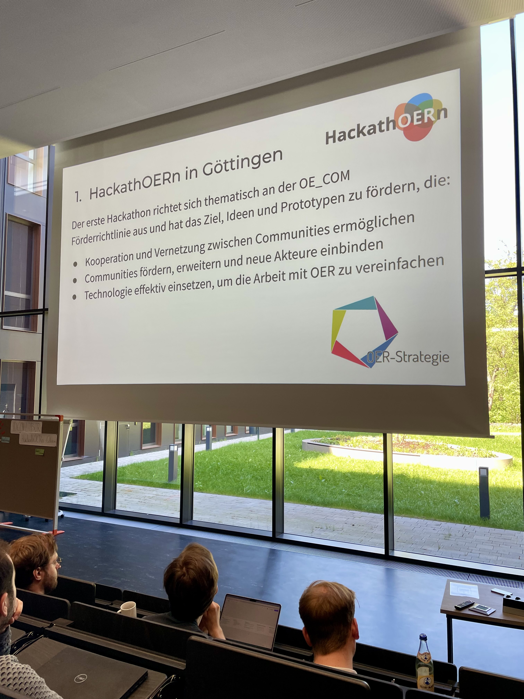
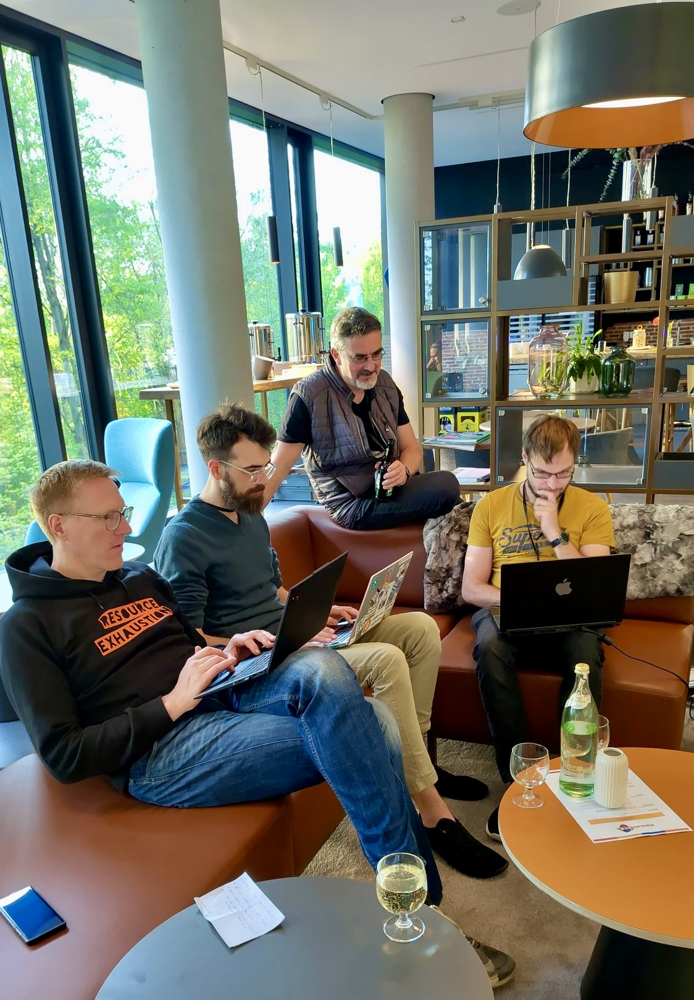
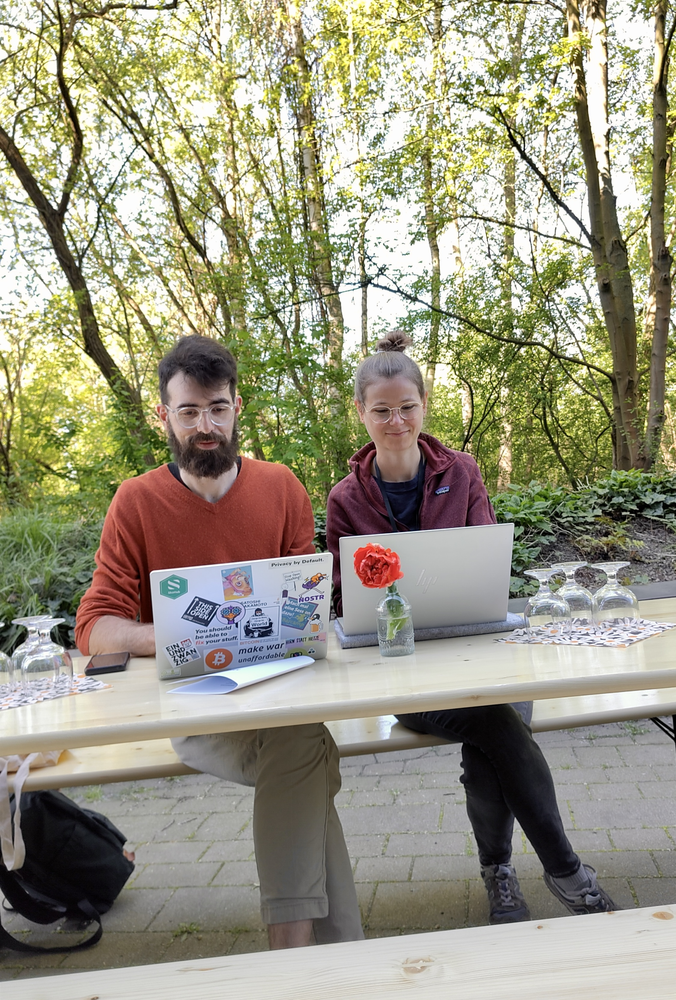

---
#commonMetadata:
'@context': https://schema.org/
type: LearningResource
id: https://oer.community/HackathOERn
name: Rückblick auf den HackathOERn in Göttingen: Gemeinsam für starke OER-Infrastrukturen
description: >-
Beim ersten HackathOERn von edu-sharing diskutierten und entwickelten Expert:innen, Entwickler:innen und OER-Interessierte vom 28. bis 30. April 2025 in Göttingen, wie digitale Infrastrukturen für Open Educational Resources (OER) und Open Educational Practices (OEP) in Deutschland gestärkt werden können.
inLanguage: de
license: https://creativecommons.org/licenses/by/4.0/
creator:
  - givenName: Gina
    familyName: Buchwald-Chassée
    type: Person
    affiliation:
      name: Comenius-Institut
      id: https://ror.org/025e8aw85
      type: Organization
  - givenName: Jörg
    familyName: Lohrer
    id: https://orcid.org/0000-0002-9282-0406
    type: Person
    affiliation:
      name: Comenius-Institut
      id: https://ror.org/025e8aw85
      type: Organization
  - givenName: Ludger
    familyName: Sicking
    type: Person
    affiliation:
      name: Comenius-Institut
      id: https://ror.org/025e8aw85
      type: Organization
keywords:
  - Hackathon
  - Vernetzung
  - OER
  - Infrastruktur
  - Edufeed
  - Interoperabilität
about:
  - https://w3id.org/kim/hochschulfaechersystematik/n0
image: https://oer.community/HacktahOERn/attachment0oHLo7.jpg
learningResourceType:
  - https://w3id.org/kim/hcrt/text
educationalLevel:
  - https://w3id.org/kim/educationalLevel/level_A
datePublished: '2025-05-09'
#staticSiteGenerator:
author:
  - Jörg Lohrer
  - Gina Buchwald-Chassée
  - Ludger Sicking
title: Rückblick auf den HackathOERn in Göttingen: Gemeinsam für starke OER-Infrastrukturen
cover:
  relative: true
  image: attachment0oHLo7.jpg
  caption: "Ludger, Jörg und Gina vom Comenius-Institut für das FOERBICO-Team beim HackathOERn in Göttingen"
summary: >-
Vom 28. bis 30. April 2025 kamen beim ersten HackathOERn von edu-sharing in Göttingen Akteur:innen aus dem OER-Bereich zusammen, um gemeinsam an digitalen Lösungen zur Stärkung von Open Educational Resources (OER) und Open Educational Practices (OEP) zu arbeiten. Im Mittelpunkt standen Vernetzung, Wissenstransfer und die kollaborative Weiterentwicklung eingereichter Projektideen bis hin zu ersten Prototypen.
url: HackathOERn
tags:
  - Digitalisierung
  - Vernetzung
  - Plattformen
  - OER
  - Edufeed
  - UX Design
---

# Rückblick auf den HackathOERn in Göttingen: Gemeinsam für starke OER-Infrastrukturen

Wie können wir digitale Infrastrukturen stärken, um Open Educational Resources (OER) und Open Educational Practices (OEP) in Deutschland voranzubringen? Mit dieser zentralen Frage im Gepäck kamen vom 28. bis 30. April 2025 Expert:innen, Entwickler:innen und OER-Interessierte beim ersten [HackathOERn von edu-sharing](https://edu-sharing-network.org/projekt-hackathoern/) in den inspirierenden Räumen der [Gesellschaft für wissenschaftliche Datenverarbeitung mbH (GWDG)](https://gwdg.de/) in Göttingen zusammen.

Im Fokus standen: Vernetzung, Wissenstransfer und das gemeinsame Tüfteln an digitalen Lösungen und ersten Prototypen. Bereits im Vorfeld wurden Projektideen eingereicht, die beim HackathOERn kollaborativ weiterentwickelt wurden.

## Die Projektideen im Überblick

### 01: Ideendatenbank

Eine zentrale Anlaufstelle für OER-Visionen: Die Ideendatenbank von [edu-sharing](https://edu-sharing-network.org/) sammelt Herausforderungen, Lösungsideen und Chancen – befüllt durch die Community, Stakeholder und Projektteams. Die Integration in WirLernenOnline (WLO) soll aktiven OER-Nutzer:innen ermöglichen, an Softwareentwicklungsprozessen direkt mitzuwirken.

### 02: LearnGraph – Interaktive Wissenslandkarte für OER

Es gibt immer mehr Wege, die du nicht gegangen bist, als die, die du gegangen bist. LearnGraph ermöglicht dir all die unbekannten Wege zu sehen und direkt an das Ziel zu springen! [LearnGraph](https://learngraph.org/) ist eine interaktive Wissenslandkarte, die Open Educational Resources (OER) strukturiert und verknüpft. Durch Crowdsourcing, KI-gestützte Empfehlungen und intuitive Visualisierung ermöglicht sie einen barrierefreien Zugang zu Bildungsinhalten. Ähnlich einem Routenplaner (für Fahrzeuge auf Straßen) möchte die Karte Wege (auch verschiedene Routen) zu Bildungsinhalten aufzeigen. Als Open-Source-Projekt fördert LearnGraph die globale Zusammenarbeit und ermöglicht praxisnahe Bildung.

### 03: Edufeed

Die deutsche Bildungsinfrastruktur zeigt sich stark fragmentiert, was die Zusammenarbeit über Plattformen hinweg erschwert. Mit Nostr - einem einfachen und leichtgewichtigen Protokoll für dezentrale Kommunikation - gibt es eine Lösung, die Interaktionen in einer offenen und verteilten Architektur ermöglicht. Im HackathOERn wollen wir untersuchen, wie dieses dezentrale Protokoll als Grundlage für einen interoperablen und freien Daten- und Kollaborationsraum für OER genutzt werden kann.

### 04: OER im Doppelpack: Qualitätsgesichert bereitstellen – einfach produzieren

Der Universitätsverbund [digiLL](https://digill.de) entwickelt eine innovative Plattform, die qualitätsgesicherte Veröffentlichung und niederschwellige Materialerstellung miteinander vereint. Im Hackathon erarbeiten wir pragmatische Lösungen, die die Bedarfe der Akteur:innen berücksichtigen – unter Nutzung der bestehenden digiLL-Plattform, des Netzwerks und vorhandener Materialien. Das Team hat sich mit dem Team zum Edufeed zusammengeschlossen.

### 05: OER Exporter für LiaScript

[LiaScript](https://liascript.github.io/) ist eine offene Markdown-Sprache zur Erstellung interaktiver OER- Kurse. Der aktuelle Exporter wandelt Inhalte in verschiedene Ausgabe-Formate um, erfordert jedoch gewisse technische Vorkenntnisse. Unser Projekt transformiert ihn in eine benutzerfreundliche Server-App mit intuitiver Oberfläche, Mehrsprachigkeit und flexibler Bereitstellung – ideal für Lehrkräfte und Bildungseinrichtungen. Das Team hat entschieden, sich ebenfalls beim Edufeed anzuschließen und das Nostr-Protokoll in LiaScript als Use-Case zu implementieren.

### 06: OER Finder Plugin: Open Source Erweiterung zur Suche und Integration von OER Bildern

Eine Herausforderung von OER ist das Auffinden geeigneter Ressourcen und die Berücksichtigung der Lizenzbedingungen. Eine nutzerfreundliche Lösung ist die Integration der Suche in Endnutzer-Programme mittels Plugins. TipTap ist ein beliebter Open-Source-Editor, der sich um ein solches Plugin erweitern lassen könnte, um das Finden und Integrieren von OER-Bildern einfacher zu gestalten.

### 07: Lernraumradar - Kooperationen messbar machen

[Lernraumradar](https://lernraumradar.de/) ist eine Plattform, die schulische Kooperationen mit zivilgesellschaftlichen Akteuren auf Basis von Angeboten wie OEPs erfasst. Dies stärkt die Sichtbarkeit der Zivilgesellschaft, erleichtert Reporting für Organisationen und ermöglicht Land und Kommunen Monitoring und Steuerung. Zudem erlaubt es die Verknüpfung mit Schuldaten, um Wirkung von Kooperationen wissenschaftlich zu untersuchen.

### 08: B3– der Barcamp-Beratungs-Bot

OER-Communities brauchen innovative Formen für Zusammenarbeit, Austausch und Vernetzung – beispielsweise in Peer-to-Peer-Lernformaten. Wer solche Verbindungen aus OER, OEP und Fortbildungen konzipieren und organisieren will, hat Fragen. Der [Barcamp-Beratungs-Bot](https://www.selbstlernen.net/der-barcamp-beratungs-bot/) gibt Antworten, fachlich fundiert, ausführlich und individuell und vor allem: immer genau dann verfügbar, wenn die Fragen sich ergeben.

Wir vom FOERBICO-Team haben das Projekt Edufeed mit eingereicht und entsprechend dort weiter gehackt!

## Lightning Talk: OER-IT-Community

Jörg aus unserem FOERBICO-Team brachte die Idee einer OER-IT-Community als Zusammenschluss aus Informatiker:innen, Entwickler:innen und sonstigen IT-Interessierten ein, um gemeinsam an technischen OER-Lösungen (weiter) zu arbeiten (z.B. OER-Editor, Metadaten, KI-Implementierungen…). Am Beispiel des HackathOERns zeigt sich, dass synchrone Arbeitstreffen zur Vernetzung und dem Austausch von Ideen und Impulsen wertvoll sind, aber wie geht es danach weiter? Wie kann man den Weg zusammen weitergehen und die Pfade auch für andere, die nicht vor Ort waren, begehbar machen? Für die asynchrone Zusammenarbeit wurde daher ein Matrix-Raum angelegt, zu dem wir _alle_ herzlich einladen, nicht nur nOERds 😉: https://matrix.to/#/#oer-it:academiccloud.de

Diesen und alle weiteren Lightning-Talks findet ihr [hier](https://drive.google.com/drive/folders/1HhWJqs4aCL7LZN4GFpAxdcvqLMJKF4GQ).

## Let´s hack: Weiterentwicklung vom Edufeed

Bereits letztes Jahr beim [IT-Sommercamp in Weimar](https://oer.community/einblicke-zum-oer-it-sommercamp-its-jointly-2024/) präsentierte Steffen Rörtgen (FWU Institut für Film und Bild gGmbH) die Idee eines dezentralen und interoperablen Datenraums basierend auf dem Social Media Protokoll [Nostr](https://nostr.how/). Das Protokoll basiert auf sehr einfachen und flexiblen Event-Objekten (die als einfaches JSON weitergegeben werden) und verwendet einen offenen Standard für Schlüssel und Signierung. Im Rahmen des Hackathons haben wir überlegt, wie man dieses Protokoll auf den Bildungsbereich anwenden könnte, um plattformunabhängiger zu werden und haben [Edufeed](https://www.edufeed.org/) als ersten Prototypen weiterentwickelt.

Beim HackathOERn wollten wir zum einen Use-Cases in den Blick nehmen (z.B. OpenCards als „Task-Card-Klon“ oder die Erweiterung um soziale Komponenten wie Likes und Kommentare) und zum anderen die komplexe und sehr technische Idee im Sinne eines „Letter to Grandma“ auch Personen vermitteln, die nicht aus dem IT-Bereich kommen. Kein leichtes Unterfangen! Doch da unsere Gruppe sehr interdisziplinär zusammengesetzt war und vielfältige Perspektiven einbringen konnte, wurde in zwei Tagen ordentlich getüftelt und einiges auf die Beine gestellt!

## Pitch Perfect: Hackathon-Ergebnisse auf der Bühne

Stolz präsentierten wir unsere Vision vom [Edufeed](https://www.edufeed.org/) anhand einer kleinen Story:

Stellt euch vor, jede Bildungsplattform in Deutschland wäre eine eigene Insel. Und von diesen Inseln gibt es nicht nur ein paar, sondern über 16.000, verteilt im weiten Meer des deutschen Bildungssystems. Das Problem: Diese Inseln sind größtenteils voneinander isoliert. Es gibt zwar hin und wieder kleine Brücken, die zwei Plattformen miteinander verbinden – etwa Metadatenbrücken zwischen Serlo und anderen Plattformen – doch um auf die ZUM-Insel zu gelangen, braucht es eine ganz andere Inhaltsbrücke. Jede neue Verbindung muss mühsam gebaut werden. Der Aufwand ist enorm und oft nicht nachhaltig.

Ein Beispiel zur Veranschaulichung:

Mary ist Mathelehrerin, die sich auf der WirLernenOnline-Insel heimisch fühlt. Dort produziert sie ein aufwändiges Mathe-Erklärvideo für ihre Schüler:innen – ein echtes Herzensprojekt. Sie möchte es gern mit anderen teilen, doch das Video bleibt auf ihrer Insel – nur dort ist es auffindbar. Gleichzeitig sitzt Mathelehrer Bob auf der Mundo-Insel. Er sucht genau solch ein Video für seinen Unterricht, findet Marys Werk aber nicht. Die Mühe, alle Inseln zu durchsuchen, sich zu registrieren und durchzuklicken, ist zu groß – also produziert er kurzerhand ein eigenes Video. Beide investieren Zeit in identische Inhalte, ohne voneinander zu wissen.

Doch was passiert, wenn eine dieser Inseln plötzlich verschwindet – zum Beispiel durch einen metaphorischen „Tsunami“ wie eine abgeschaltete Plattform? Dann sind viele wertvolle Materialien auf einen Schlag verloren. Genau hier setzt [Edufeed](https://www.edufeed.org/) an.

Mit [Edufeed](https://www.edufeed.org/) bauen wir keine weiteren Brücken, sondern Wasserrohre unter der Oberfläche, durch die Inhalte von Insel zu Insel fließen können – unabhängig von der Plattform. Mary kann ihr Video weiterhin auf WirLernenOnline veröffentlichen, wo sie sich wohlfühlt. Gleichzeitig landet es aber auch in einem dezentralen, offenen Feed, auf den Bob von der Mundo-Insel zugreifen kann – ohne sich neu registrieren zu müssen. Sollte WirLernenOnline irgendwann offline gehen, bleibt Marys Video über den Feed dennoch auffindbar und nutzbar.

Das bringt enorme Vorteile: Marys Video wird nicht nur lokal, sondern deutschlandweit verwendet. Bob muss kein eigenes Video mehr erstellen, sondern kann es direkt nutzen oder anpassen. Wenn er es wiederum auf Mundo hochlädt, gelangt es ebenfalls in den Feed – und vielleicht entdeckt es Mary dort erneut und kann es weiterverwenden. So entsteht ein zirkulärer Austausch von OER über Plattformgrenzen hinweg.

Und dann ist da noch der Zeitfaktor: Mary investiert ca. 5 Stunden in ihr Erklärvideo. Wenn 25.000 andere Mathelehrkräfte davon profitieren, bedeutet das 125.000 Stunden eingesparte Zeit – durch nur eine einzige Ressource! Hochgerechnet auf die etwa 12.000 existierenden OER-Mathematerialien ergibt sich eine beeindruckende Summe an eingesparter Arbeitszeit und multiplizierter Wirkung.

[Edufeed](https://www.edufeed.org/) macht also nicht nur den Austausch von OER einfacher, sondern effizienter, nachhaltiger und plattformunabhängig – und leistet damit einen entscheidenden Beitrag für eine vernetzte und zukunftsfähige Bildungslandschaft.

## Wie geht es weiter?

Wir vom [Edufeed](https://www.edufeed.org/)-Team haben entschieden an der Idee weiterzuarbeiten. Dazu haben wir einen eigenen Matrix-Raum eingerichtet. In dem Raum geht es u. a. um die Nutzung des Nostr-Protokolls, die Weiterentwicklung einer dezentralen offenen Alternative zu TaskCard / Padlet, der Sammlung von Ideen in einer dezentralen Datenbankstruktur... Wer mitdenken und mitentwickeln möchte ist herzlich eingeladen: https://matrix.to/#/#OERSTR:rpi-virtuell.de

Ansonsten wird der **2. HackathOERn vom 25.-27.08.2025 in Weimar** stattfinden, also save-the-Date 📅 Wir hatten auf jeden Fall eine gute Zeit und jede Menge Spaß #HappyHacking!

