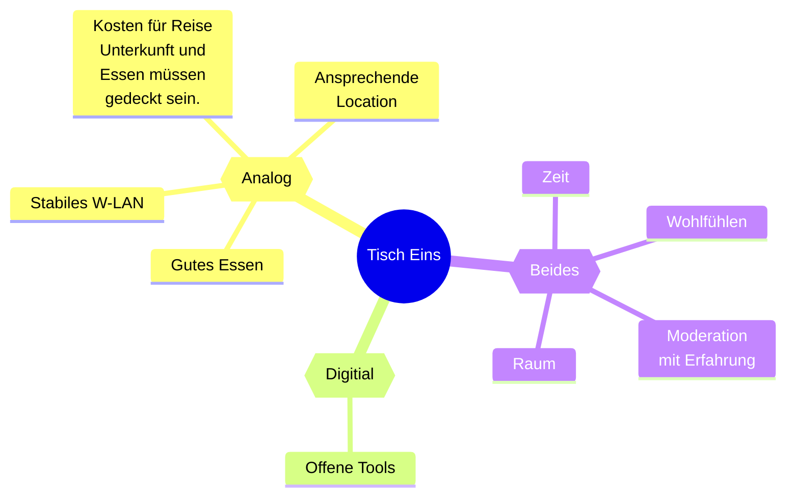
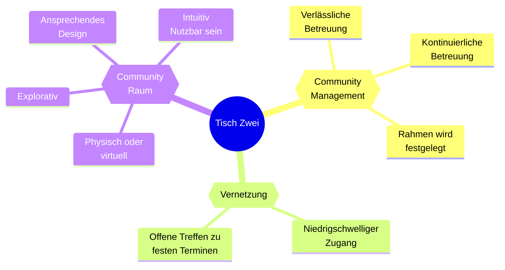
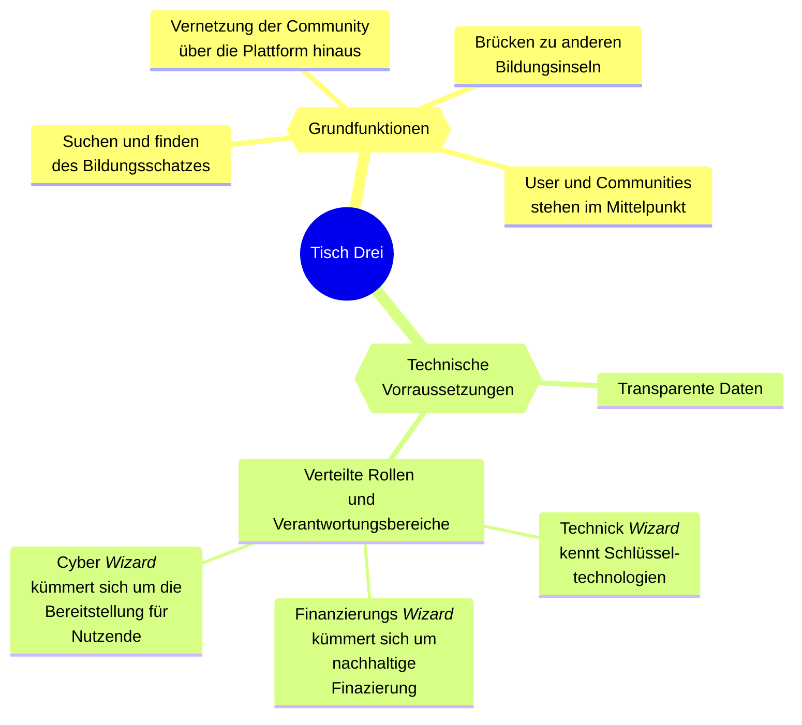
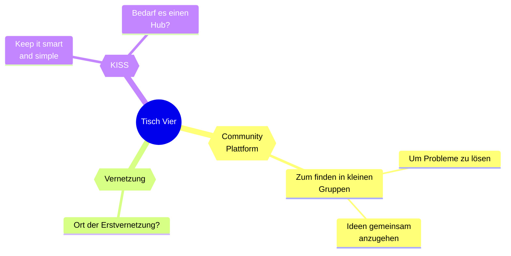

# Mindmaps von den Gruppenkarten

```mermaid
mindmap
  root((Tisch Eins))
    {{Analog}}
      Gutes Essen
      Stabiles W-LAN 
      Ansprechende </br> Location
      Kosten für Reise</br>Unterkunft und</br>Essen müssen</br>gedeckt sein.
    {{Digitial}}
      Offene Tools
    {{Beides}}
      Wohlfühlen
      Zeit
      Raum
      Moderation</br>mit Erfahrung
```

---

```mermaid
mindmap
  root((Tisch Zwei))
    {{Community </br> Management}}
      Verlässliche</br> Betreuung
      Kontinuierliche </br> Betreuung 
      Rahmen wird </br> festgelegt
    {{Vernetzung}}
      Niedrigschwelliger</br>Zugang
      Offene Treffen zu </br>festen Terminen
    {{Community</br>Raum}}
      Physisch oder </br>virtuell
      Explorativ
      Ansprechendes</br>Design
      Intuitiv</br> Nutzbar sein
```
---

```mermaid
mindmap
  root((Tisch Drei))
    {{Grundfunktionen}}
      Suchen und finden</br> des Bildungsschatzes
      Vernetzung der Community </br> über die Plattform hinaus 
      Brücken zu anderen </br> Bildungsinseln
      User und Communities</br>stehen im Mittelpunkt
    {{Technische </br> Vorraussetzungen}}
      Transparente Daten
      Verteilte Rollen </br> und Verantwortungsbereiche
        Technick *Wizard*</br>kennt Schlüssel-</br>technologien
        Finanzierungs *Wizard*</br>kümmert sich um</br>nachhaltige</br> Finazierung
        Cyber *Wizard*</br>kümmert sich um die</br>Bereitstellung für </br>Nutzende
```
---

```mermaid
mindmap
  root((Tisch Vier))
    {{Community </br> Plattform}}
      Zum finden in kleinen</br>Gruppen 
         Um Probleme zu lösen
         Ideen gemeinsam </br>anzugehen
    {{Vernetzung}}
      Ort der Erstvernetzung?
    {{KISS}}
      Keep it smart </br>and simple
      Bedarf es einen </br> Hub?
```