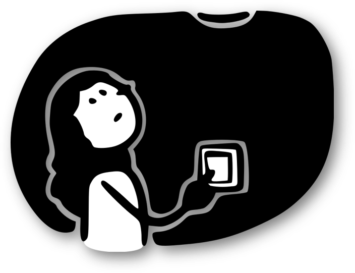
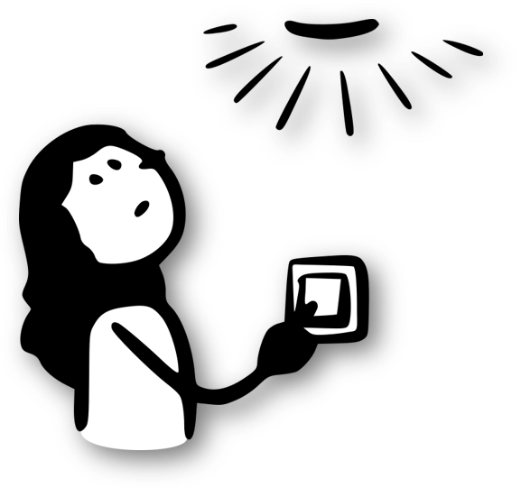

---
#Titelbild 
# Rückblick: OER im Blick 2025
#commonMetadata:
datePublished: '2025-05-15'
#staticSiteGenerator:
author:
  - Phillip Angelina
title: 'Rückblick: OER im Blick 2025'
cover:
  relative: true
  image: IMG_9713.jpg
summary: >-
  Ein Rückblick auf die Veranstaltung "OER im Blick" im Mai 2025 in Jena im Rahmen der OER Strategie des Bundes
url: oer-im-blick-2025
tags:
  - Vernetzung
  - Plattformen
  - Open Educational Resources (OER)
---

Nach der Auftaktkonferenz letztes Jahr in Frankfurt am Main (siehe [Blogbeitrag](https://oer.community/rueckblick-auftaktkonferenz-oer-im-blick/))
ging es am 13. und 14. Mai 2025 nach Jena, genauer: Zur [Imaginata](https://imaginata.de/), einem ehemaligen Umspannwerk. Unter dem Motto Back to basics kamen Projekte der [OER-Strategie](https://www.oer-strategie.de/) sowie alle Interessierten für offene Bildung zusammen, um gemeinsam in den Blick zu nehmen, welche Rollen und Aufgaben OER und OEP angesichts drängender bildungspolitischer und gesellschaftlicher Herausforderungen leisten können? Neben der Vorstellung des Status Quos der Projekte gab es auch die Möglichkeit zur Vernetzung und zum Austausch. Wir von FOERBICO waren mit dabei, in diesem Blogbeitrag erhaltet ihr unsere Einblicke zur Konferenz!

## Pre-Workshop: Was sind eigentlich Open Educational Practices?

Grafik: https://cocomaterial.com/ unter [CC0](https://creativecommons.org/publicdomain/zero/1.0/deed.de)

Offene Bildungspraktiken fördern – das haben wir uns als OE_COM-Projekte auf die Fahne geschrieben, aber wie erklären wir das im Austausch mit verschiedenen Communities? Für viele sind Open Educational Parctices (OEP) eine BlackBox, manche haben eine vages Bild und andere eine konkrete Vorstellung. Mit dem Ziel ein gemeinsames Grundverständnis zu OEP zu entwickeln und dieses in Form eines Arbeitspapiers als Handreichung auch für andere zugänglich zu machen, hat sich eine Arbeitsgruppe einiger OE_COM-Projekte zusammengefunden und versucht auf einen gemeinsamen Nenner zu kommen.

Grafik: https://cocomaterial.com/ unter [CC0](https://creativecommons.org/publicdomain/zero/1.0/deed.de)

**In Kleingruppen haben wir über folgende Aussagen nachgedacht:**

1: OEP geht über die reine Bereitstellung hinaus …
2: OEP ist etwas anderes als Frontalunterricht …
3: Eine Praktik, die ich mit OER tun kann …
4: OEP sind in keinem Fall …

**Wie geht es weiter?**

Bei einem nächsten Online-Treffen sollen die Ergebnisse des Workshops weiter diskutiert werden:
📅 7. Juli 2025, 14-15 Uhr
🔗 https://unibox.uni-rostock.de/getlink/fiS9pCpDmDVmXgddsBBo9K/OE_com%20Arbeitspapier%20OEP.docx

Alle, die Lust haben an einem Arbeitspapier weiterzuarbeiten sind herzlich eingeladen!

## Keynote: „OER in Zeiten der Disruption: Why Ideas Do Not Float Freely“ von Prof. Dr. Daniel Otto, Europäische Hochschule für Innovation und Perspektive

Francis Fukuyamas Theorie vom „Ende der Geschichte“ stand für das Vertrauen in die Demokratie nach dem Kalten Krieg. Doch seit den 1990ern ist diese Zustimmung rückläufig. Schon früh kritisierte Risse-Lappen: Ideen wie Demokratie müssen erstritten werden – sie sind nie selbstverständlich.
Maqueen (2001) definiert eine Community als eine Gruppe mit sozialen Bindungen, gemeinsamen Perspektiven und kollektiven Handlungen. In der OER-Gemeinschaft ist vor allem die affektive Komponente entscheidend: Engagement entsteht aus Verbundenheit – nicht nur aus Struktur.

> Ich würde es vielleicht den oberen Teil umformulieren: "Ausgehend aus allgemeinen gesellschaftlichen Entwicklungen seit den 1990ern hält Otto fest, das wir in Zeiten von Disruption leben. Die sogenannten Sicherheiten der frühen 1990er Jahre wie Fukuyama es unter dem Schlagwort „Ende der Geschichte“ titelte ist heute nicht viel übrig geblieben. Er arbeitet heraus, was eine Komponente sein könnte, warum Menschen sich trotz dieser unsicherheiten in Communities engagieren. Entscheiden ist für das Engegament und den Zusammenhalt von OER-Gemeinschaften die affektive Komponente. Denn wenn aus dem Engagement Verbundenheit entsteht, dann bildet dies sich nicht nur in der Struktur ab, sondern verbindet die Mitglieder untereinander.

**OER trifft auf KI – Widerspruch oder Potenzial?**
OER und generative KI könnten unterschiedlicher kaum sein: Offenheit vs. Proprietät, Kollaboration vs. Black Box. Ist KI also das Ende von OER?
Nicht unbedingt. Bildung entsteht durch Reibung, nicht durch Perfektion. Oder wie Biesta (2003) sagt:

> *Education always involves an interruption - of what we do not yet know, of what we have not planned, of what we cannot control.*

> Vielleicht danach noch hinzufügen: Wissen und Information leicht zugänglich machen, ist nicht mit Bildung gleich zu setzen. Denn Bildung erfordert eine kritische Auseinandersetzung und Übung mit dem zu erlernenden Stoff.

**Kompetenzdebatte: Kurzlebige Skills vs. nachhaltige Haltungen**
Die Diskussion um „zukünftige Kompetenzen“ greift oft zu kurz. Was heute wichtig scheint – etwa Prompting – kann morgen schon überholt sein. In der OER-Kultur hingegen zählen Kompetenzen, die Technik überdauern: Offenheit, Kritikfähigkeit, Nachhaltigkeit. Früher fragte man: Ist ein offenes Lehrbuch besser als ein geschlossenes? Solche Vergleiche greifen zu kurz. Es ist nicht das Medium allein, das Bildung verbessert, sondern die pädagogische Gestaltung. Im aktuellen Diskurs sind wir stark auf die Frage der Überprüfung und Bewertung fokussiert. Die Frage ist: Was folgt daraus?
> Ich frage mich ob hier noch ein kurzer Satz dazu kommen sollte wie: Was in dieser Diskussion untergeht, ist der Lernprozess sowie Möglichkeitsräume die beispielsweise Open Textbooks dür Lehrende und Lernende eröffnet wird.

**OER ist die Antwort – aber was war die Frage?**
Nicht der Austausch von Materialien macht OER stark, sondern die damit verbundene Haltung: Vertrauen, Partizipation, Offenheit. Offenheit in der Bildung ist kein Tool, sondern eine Praxis. Nach Giddens (1986) braucht es sowohl Akteure mit Gestaltungswillen als auch Strukturen, die Wandel ermöglichen. Veränderung beginnt an beiden Enden. OER und OEP sind demnach kein fertiges Modell, sondern ein kultureller Prozess. Offenheit, Irritation und gemeinsames Handeln sind dabei keine Nebenprodukte, sondern Kern der Idee. Ob mit oder ohne KI – das Fundament bleibt: Bildung braucht Haltung.

## Workshop: Synergien schaffen, Gemeinschaft stärken - Der Community-HUB als Innovationsraum nachhaltiger Zusammenarbeit

Wie können verschiedene Communities und Netzwerkakteurinnen und -akteure erfolgreich vernetzt werden? Neben bestehenden Communities, Repositorien und Suchmaschinen zu OER bedarf es eines Hubs als Knotenpunkt, der Expertisen bündelt, Projekte verbindet und Ressourcen zugänglich macht. Der Community-Hub soll eine klare Zielgruppenorientierung sowie synchrone und asynchrone Formate zur nachhaltigen Vernetzung bieten. Im FOERBICO-Projekt wird daher eine „Community of Communities“ angestrebt – ein zentraler Ort für Kollaboration, Begegnung und Austausch. Unsere ersten Schritte auf dem Weg zum Community-Hub findet ihr [hier](https://oer.community/recap-konzeptionstage/). Im 45-minütigen Workshop wurden die 16 Teilnehmenden dazu eingeladen, an der Idee eines Community-Hubs mitzugestalten. Der Arbeitsauftrag lautete, einen möglichst idealen Ort Austausch, Kollaboration und Netzwerk zu entwickeln und möglichst plastisch zu gestalten. Hierfür teilten sich die Teilnehmenden in vier Kleingruppen auf und entwickelten mit Lego Education Sets unterschiedliche Orte mit vielen Eigenschaften, die ein Community-Hub unbedingt aufweisen sollte.

### Gruppenergebnisse

Die Ergebnisse wurden in Schlagworten auf Moderationskarten festgehalten und in einem anschließenden Galery-Walk den anderen Teilnehmenden präsentiert.

#### Tisch 1

In dieser Gruppe haben die Teilnehemenden unterschieden zwischen **analogen Treffen**, **digitalen Treffen** und Aspekte die für **beide** gelten sollten. Jede:r in dem Hub hat einen unterschiedlichen Verantwortungsbereich, dieser kann aber fluide wechseln und sie sind durch die Kette miteinander verbunden. Ein Hub sollte zudem den Raum bieten, um gemeinsam zu experimentieren (siehe die zwei Figuren am unteren rechten Rand des Hubs).
**Analoger Raum**: Sollte gutes Essen, stabiles WLAN, schöne Räumlichkeiten, eine niedrigschwellige Anmeldung sowie generell Barrierefreiheit und diverse Gruppen bieten.

**Beides**: Sowohl im digitalen als auch im analogen Raum sollte man sich wohlfühlen, einen offenen & einfachen Zugang haben. Zudem braucht es Sichtbarkeit, eine Moderation und ein gemeinsames Interesse/Ziel. Außerdem geht es nicht ohne ein Commitment und es braucht Ressourcen – vor allem zeitlich und monetär. Auch wichtig: Man darf auch etwas kaputt machen! Der offene und einfache Zugang wird durch das große Tor dargestellt. Zusätzlich ist auch eine transparente Einsicht in allem wichtig.

**Digital**: Es braucht möglichst offene Tools mit einer einfachen Handhabung. Auch die Bereitschaft, sich in die Karten schauen zu lassen gilt als Grundvoraussetzung. Das hat die Gruppe anhand des Sichtglases dargestellt, durch das gesehen werden kann, wie die Menschen/Community im Hub gemeinsam arbeiten können.

#### Tisch 2

Auch hier wurde ein digitaler und analoger Raum vorgeschlagen, die sich aufeinander zu bewegen. Der Hub sollte ein Raum sollte explorativ sein, indem auch die Barrieren klein gemacht und ein barrierefreier Zugang ermöglicht werden.

OER wurden hier als zarte Pflänzchen dargestellt, um die man sich gemeinsam kümmert, damit sie wachsen. Es muss jedoch auch Menschen geben, die den Hut aufhaben. Außerdem braucht es feste Termine für Treffen und einen strukturieren Rahmen, den der Hub bieten sollte. 

Neben der Funktion muss auch die Ästhetik des virtuellen Raums in Betracht gezogen werden. Dieser bedarf auch der Pflege. Ein Hub kann eine Roadmap zur Orientierung bieten. Es sollte auch zusammengearbeitet werden und Wissen aus dem Elfenbeiturm herausgeholt werden und hierarchisches Denken sollte dort bleiben.

Ein Hub bedarf eine Infrastruktur und Werkzeuge der Zusammenarbeit und muss sich selbst als einen dynamischen Prozess verstehen. Zugleich muss in einem Hub die auf Aktualität geachtet werden. Eine Reinigungsfunktion sollte möglich sein, damit 'Müll' aussortiert werden kann.

#### Tisch 3

Ein Hub kann als eigene Bildungsinsel mit anderen Bildungsinseln miteinander verbunden und vernetzt sein. Zum Datenaustausch bedarf es transparente 'Drehscheiben'. Damit man einsehen kann, was wie auf welcher Basis geschehen kann.

In einem Hub dürfen verschiedene Rollen verteilt werden: Technik-Wizard, Finanzierungswizard (Communities dürfen mitsprechen), Digital-Wizard der am besten vernetzt ist und das wachende Auge vom Bundesministerium. Communities dürfen in dem Hub in einen Austausch treten und Verantwortungsbereiche aufteilen.

#### Tisch 4

Ein Hub sollte ein möglichst offener Raum ohne Wände sein. Welche den Erstkontakt erleichtern und ein Ort sein in den Ideen gefunden werden können. Die Wege in diesen Raum sind vielfältig.

**Kiss - Keep it smart and simple:**
Eine Frage aus der Gruppe war: Braucht es überhaupt einen Hub? Diese sind bis jetzt nicht entwickelt worden, da es diese bis jetzt nicht gebraucht hat. Sollten wir stattdessen nicht vorhandene Strukturen nutzen? Die Gruppe ist bei diesen Fragen noch zu keinem Ergebnis gekommen.

## Fazit

Für uns war die Konferenz eine tolle Möglichkeit zur Begegnung und Vernetzung. Wir nehmen aus den Workshops, Vorträgen und Gesprächen viele spannende Impulse für die weitere Arbeit mit!
