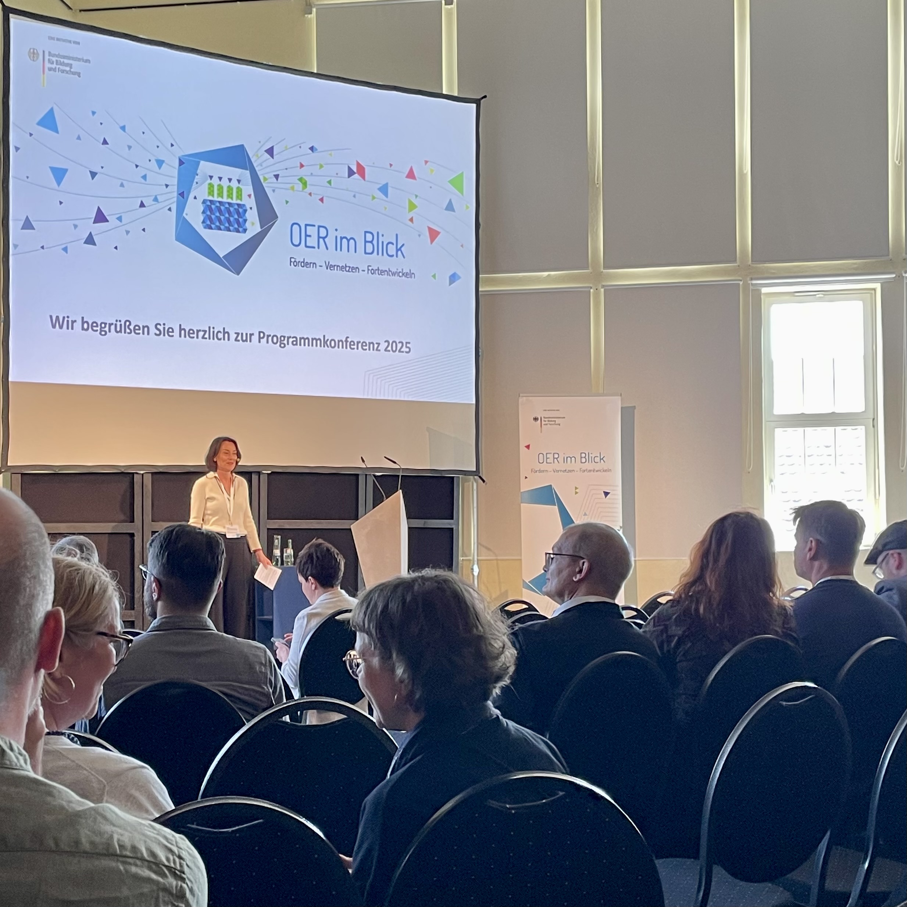
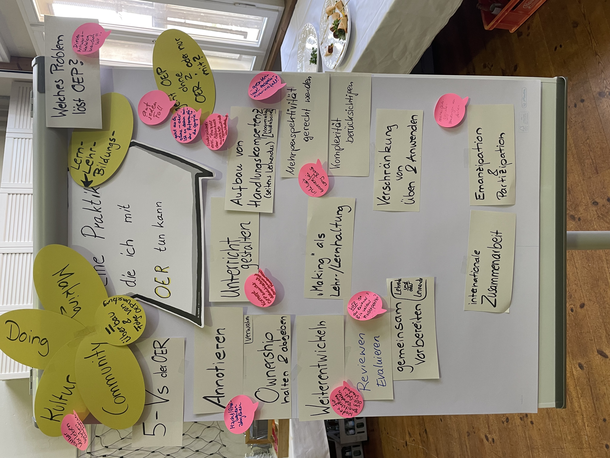
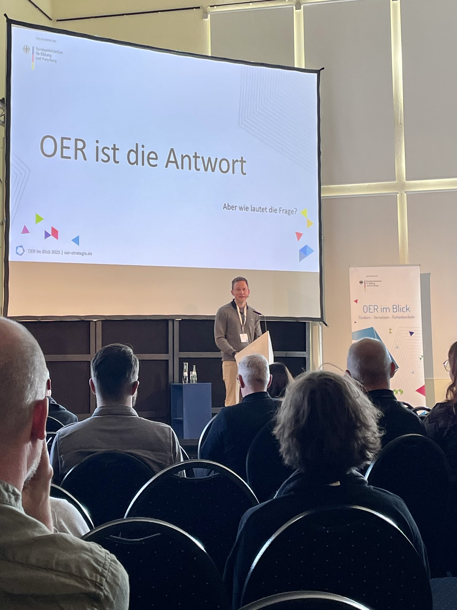
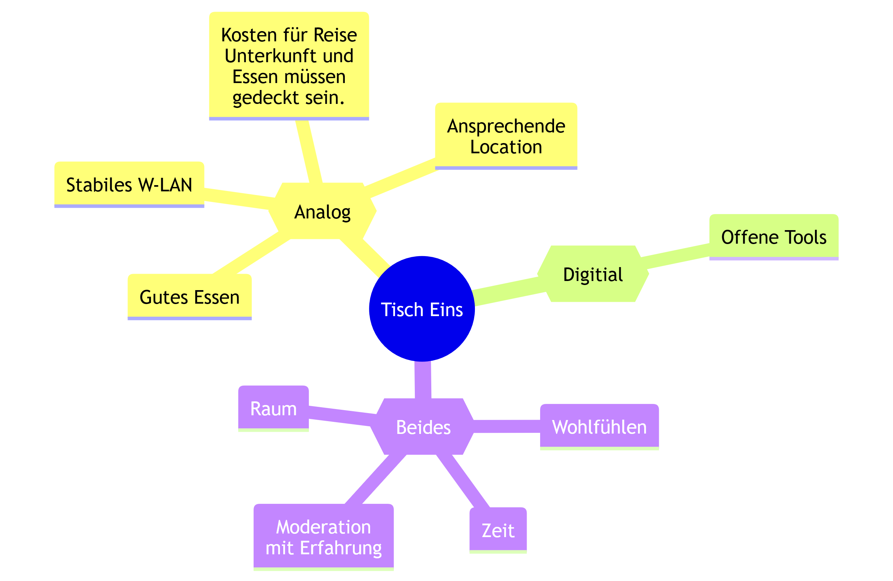
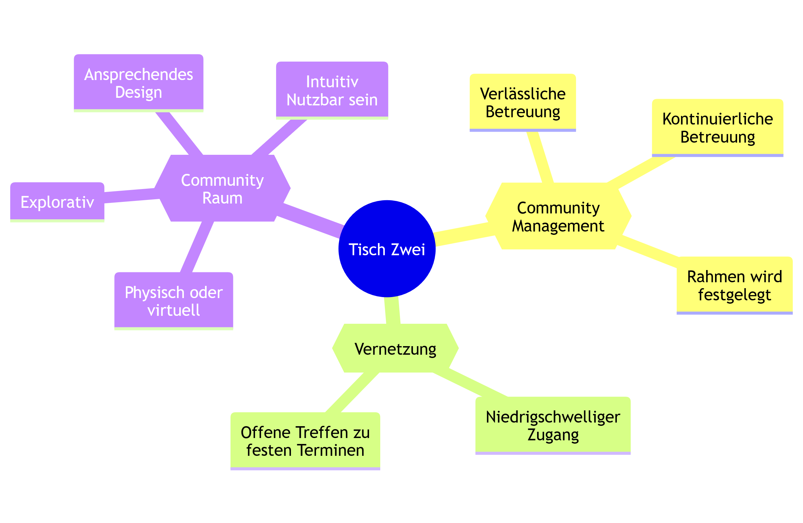
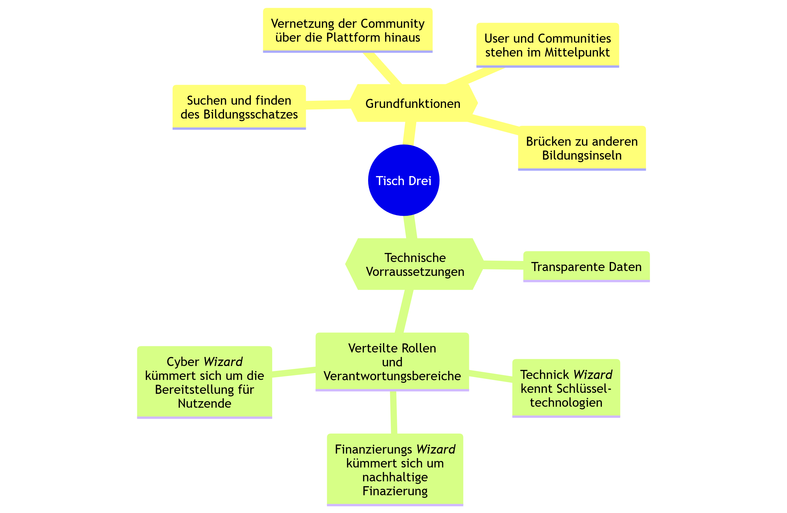
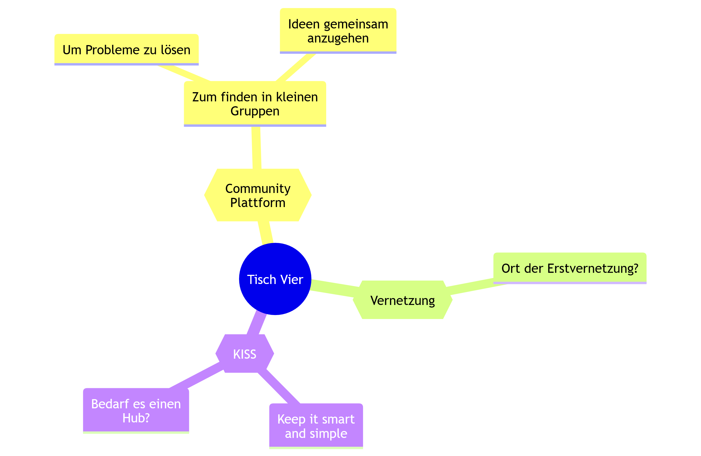

---
#Titelbild 
# Rückblick: OER im Blick 2025
#commonMetadata:
'@context': https://schema.org/
type: ScholarlyArticle
id: https://oer.community/oer-im-blick-2025
name: 'Rückblick: OER im Blick 2025'
description: >-
  Nach der erfolgreichen Auftaktkonferenz in Frankfurt 2024 fand das diesjährige Treffen der OER-Strategie am 13. und 14. Mai 2025 in der Jenaer Imaginata statt. Unter dem Motto "Back to basics" kamen Projekte und Interessierte aus dem Bereich offene Bildung zusammen, um über die Rolle von OER und OEP in aktuellen gesellschaftlichen und bildungspolitischen Kontexten zu diskutieren. Neben Projektupdates standen vor allem Austausch und Vernetzung im Mittelpunkt. FOERBICO war vor Ort und teilt im Blogbeitrag Eindrücke und Highlights der Konferenz. 
inLanguage: de
license: https://creativecommons.org/licenses/by/4.0/
creator:
  - givenName: Gina
    familyName: Buchwald-Chassée
    type: Person
    affiliation:
      name: Comenius-Institut
      id: https://ror.org/025e8aw85
      type: Organization
  - givenName: Laura
    familyName: Mößle
    id: https://orcid.org/0000-0001-5255-8063
    type: Person
    affiliation:
      name: Johann Wolfgang Goethe-Universität Frankfurt
      id: https://ror.org/04cvxnb49
      type: Organization
  - givenName: Phillip
    familyName: Angelina
    id: https://orcid.org/0000-0002-6905-5523
    type: Person
    affiliation:
      name: Friedrich-Alexander-Universität Erlangen-Nürnberg
      id: https://ror.org/00f7hpc57
      type: Organization
keywords:
  - Community-Hub
  - Event
  - Workshop
  - Vernetzung
image: https://oer.community/oer-im-blick-2025/IMG_9713.jpg
learningResourceType:
  - https://w3id.org/kim/hcrt/article
datePublished: '2025-05-21'
#staticSiteGenerator:
author:
  - Gina Buchwald-Chassée
  - Dr. Laura Mößle
  - Phillip Angelina
title: 'Rückblick: OER im Blick 2025'
cover:
  relative: true
  image: IMG_9713.jpg
summary: >-
  Ein Rückblick auf die Veranstaltung "OER im Blick" im Mai 2025 in Jena im Rahmen der OER Strategie des Bundes.
url: oer-im-blick-2025
tags:
  - Vernetzung
  - Plattformen
  - Open Educational Resources (OER)
---

Nach der Auftaktkonferenz letztes Jahr in Frankfurt am Main (siehe [Blogbeitrag](https://oer.community/rueckblick-auftaktkonferenz-oer-im-blick/))
ging es am 13. und 14. Mai 2025 nach Jena, genauer: Zur [Imaginata](https://imaginata.de/), einem ehemaligen Umspannwerk. Unter dem Motto Back to basics kamen Projekte der [OER-Strategie](https://www.oer-strategie.de/) sowie alle Interessierten für offene Bildung zusammen, um gemeinsam in den Blick zu nehmen, welche Rollen und Aufgaben OER und OEP angesichts drängender bildungspolitischer und gesellschaftlicher Herausforderungen leisten können. Neben der Vorstellung des Status Quos der Projekte gab es auch die Möglichkeit zur Vernetzung und zum Austausch. Wir von FOERBICO waren mit dabei, in diesem Blogbeitrag erhaltet ihr unsere Einblicke zur Konferenz!

## Pre-Workshop: Was sind eigentlich Open Educational Practices?

Offene Bildungspraktiken fördern – das haben wir uns als OE_COM-Projekte auf die Fahne geschrieben, aber wie erklären wir das im Austausch mit verschiedenen Communities? Für viele sind Open Educational Parctices (OEP) eine BlackBox, manche haben eine vages Bild und andere eine konkrete Vorstellung. Mit dem Ziel ein gemeinsames Grundverständnis zu OEP zu entwickeln und dieses in Form eines Arbeitspapiers als Handreichung auch für andere zugänglich zu machen, hat sich eine Arbeitsgruppe einiger OE_COM-Projekte zusammengefunden und versucht auf einen gemeinsamen Nenner zu kommen.

**In Kleingruppen haben wir über folgende Aussagen nachgedacht:**

1: OEP geht über die reine Bereitstellung hinaus …

2: OEP ist etwas anderes als Frontalunterricht …

3: Eine Praktik, die ich mit OER tun kann …

4: OEP sind in keinem Fall …

**Wie geht es weiter?**

Bei einem nächsten Online-Treffen sollen die Ergebnisse des Workshops weiter diskutiert werden:

📅 7. Juli 2025, 14-15 Uhr

🔗 https://unibox.uni-rostock.de/getlink/fiS9pCpDmDVmXgddsBBo9K/OE_com%20Arbeitspapier%20OEP.docx

Alle, die Lust haben an einem Arbeitspapier weiterzuarbeiten sind herzlich eingeladen!

## Keynote: „OER in Zeiten der Disruption: Why Ideas Do Not Float Freely“ von Prof. Dr. Daniel Otto, Europäische Hochschule für Innovation und Perspektive

 
Ausgehend aus allgemeinen gesellschaftlichen Entwicklungen seit den 1990ern hält Otto fest, dass wir in Zeiten von Disruption leben. Von den sogenannten Sicherheiten der frühen 1990er Jahre wie Fukuyama es unter dem Schlagwort „Ende der Geschichte“ titelte, ist heute nicht viel übrig geblieben. Er arbeitet heraus, warum Menschen sich trotz dieser Unsicherheiten in Communities engagieren. Entscheidend für das Engagement und den Zusammenhalt von OER-Communities ist die affektive Komponente. Denn wenn aus dem Engagement Verbundenheit entsteht, dann bildet sich dies nicht nur in der Struktur ab, sondern verbindet die Mitglieder untereinander.

**OER trifft auf KI – Widerspruch oder Potenzial?**
Otto setzte auch wichtige Impulse in der Debatte von OER und KI. Er problematisierte, dass OER und generative KI unterschiedlicher kaum sein könnten: Offenheit vs. Proprietät, Kollaboration vs. Black Box. Ist KI also das Ende von OER?
Nicht unbedingt. Bildung entsteht durch Reibung, nicht durch Perfektion. Oder wie Biesta (2003) sagt:

> *Education always involves an interruption - of what we do not yet know, of what we have not planned, of what we cannot control.*

Wissen und Informationen leicht zugänglich zu machen, ist nicht mit Bildung gleichzusetzen. Denn Bildung erfordert eine kritische Auseinandersetzung und Übung mit dem zu erlernenden Stoff.

**Kompetenzdebatte: Kurzlebige Skills vs. nachhaltige Haltungen**
Otto kam auch auf die Kompetenzdebatte mit Blick auf zukünftige Herausforderungen zu sprechen. Die Diskussion um „zukünftige Kompetenzen“ greift seiner Ansicht nach oft zu kurz. Was heute wichtig scheint – etwa Prompting – kann morgen schon überholt sein. In der OER-Kultur hingegen zählen Kompetenzen, die Technik überdauern: Offenheit, Kritikfähigkeit, Nachhaltigkeit. Früher fragte man: Ist ein offenes Lehrbuch besser als ein geschlossenes? Solche Vergleiche greifen zu kurz. Es ist nicht das Medium allein, das Bildung verbessert, sondern die pädagogische Gestaltung. Im aktuellen Diskurs sind wir stark auf die Frage der Überprüfung und Bewertung fokussiert. Die Frage ist: Was folgt daraus? Was in dieser Diskussion untergeht, ist der Lernprozess sowie Möglichkeitsräume, die beispielsweise Open Textbooks für Lehrende und Lernende eröffnet.

**OER ist die Antwort – aber was war die Frage?**
Zuletzt betonte Otto noch, dass nicht der Austausch von Materialien macht OER stark mache, sondern die damit verbundene Haltung: Vertrauen, Partizipation und Offenheit. Offenheit in der Bildung ist kein Tool, sondern eine Praxis. Nach Giddens (1986) brauche es sowohl Akteure mit Gestaltungswillen als auch Strukturen, die Wandel ermöglichen. Veränderung beginnt an beiden Enden. OER und OEP sind demnach kein fertiges Modell, sondern ein kultureller Prozess. Offenheit, Irritation und gemeinsames Handeln sind dabei keine Nebenprodukte, sondern Kern der Idee. Ob mit oder ohne KI – das Fundament bleibt: Bildung braucht Haltung.

## Workshop: Synergien schaffen, Gemeinschaft stärken - Der Community-HUB als Innovationsraum nachhaltiger Zusammenarbeit

Anschließend ging es in Workshopphasen, auch wir vom FOERBICO-Team waren mit einem Workshop zum Community-Hub vertreten. Dort wurden die 16 Teilnehmenden dazu eingeladen, an der Idee eines Community-Hubs mitzugestalten. Der Arbeitsauftrag lautete, einen möglichst idealen Ort Austausch, Kollaboration und Netzwerk zu entwickeln und möglichst plastisch zu gestalten. Hierfür teilten sich die Teilnehmenden in vier Kleingruppen auf und entwickelten mit Lego Education Sets unterschiedliche Orte mit vielen Eigenschaften, die ein Community-Hub unbedingt aufweisen sollte. Unter anderem gingen sie der Frage nach: Wie können verschiedene Communities und Netzwerkakteure erfolgreich vernetzt werden?  Im FOERBICO-Projekt zielen wir eine „Community of Communities“ an – ein zentraler Ort für Kollaboration, Begegnung und Austausch. Unsere ersten Schritte auf dem Weg zum Community-Hub findet ihr [hier](https://oer.community/recap-konzeptionstage/). 

Die spannenden Ergebnisse aus den Gruppen wollen wir euch hier genauer vorstellen: 

### Gruppenergebnisse

Neben den eindrücklichen plastischen Ergebnissen, hielten die Teilnehmenden die Ergebnisse ihrer Arbeit in Schlagworten auf Moderationskarten fest, um sie in einem anschließenden Galery-Walk den anderen Teilnehmenden zu präsentieren.

#### Tisch 1

In dieser Gruppe unterschieden die Teilnehemenden zwischen **analogen Treffen**, **digitalen Treffen** und Aspekte, die für **beide** gelten sollten. In diesem Hub hat jede:r einen unterschiedlichen Verantwortungsbereich, dieser kann aber fluide wechseln. Die Teilnehmenden sind miteinander verbunden, was durch die Kette symbolisiert wird. Ein Hub sollte zudem den Raum bieten, um gemeinsam zu experimentieren (siehe die zwei Figuren am unteren rechten Rand des Hubs). Im analogen sollte gutes Essen, stabiles WLAN, schöne Räumlichkeiten vorhabenden sein, eine niedrigschwellige Anmeldung sowie generell Barrierefreiheit und diverse Gruppen sind ebenfalls wünschenswert.
 Sowohl im digitalen als auch im analogen Raum sollte man sich wohlfühlen, einen offenen und einfachen Zugang haben. Zudem braucht es Sichtbarkeit, eine Moderation und ein gemeinsames Interesse und Ziel. Außerdem geht es nicht ohne ein Commitment und es braucht Ressourcen – vor allem zeitlich und monetär. Auch wichtig: Man darf auch etwas kaputt machen! Der offene und einfache Zugang wird durch das große Tor dargestellt. Zusätzlich ist auch eine transparente Einsicht in allem wichtig.
Im digitalen Raum braucht möglichst offene Tools mit einer einfachen Handhabung. Auch die Bereitschaft, sich in die Karten schauen zu lassen gilt als Grundvoraussetzung. Das hat die Gruppe anhand des Sichtglases dargestellt, durch das gesehen werden kann, wie die Menschen/Community im Hub gemeinsam arbeiten können.

#### Tisch 2

Auch hier wurde ein digitaler und analoger Raum vorgeschlagen, die sich aufeinander zu bewegen. Der Hub sollte ein Raum sollte explorativ sein, indem auch die Barrieren klein gemacht und ein barrierefreier Zugang ermöglicht werden.
OER wurden hier als zarte Pflänzchen dargestellt, um die man sich gemeinsam kümmert, damit sie wachsen. Es muss jedoch auch Menschen geben, die den Hut aufhaben. Außerdem braucht es feste Termine für Treffen und einen strukturieren Rahmen, den der Hub bieten sollte. 
Neben der Funktion muss auch die Ästhetik des virtuellen Raums in Betracht gezogen werden. Dieser bedarf auch der Pflege. Ein Hub kann eine Roadmap zur Orientierung bieten. Es sollte auch zusammengearbeitet werden und Wissen aus dem Elfenbeiturm herausgeholt werden und hierarchisches Denken sollte dort bleiben.
Ein Hub bedarf eine Infrastruktur und Werkzeuge der Zusammenarbeit und muss sich selbst als einen dynamischen Prozess verstehen. Zugleich muss in einem Hub die auf Aktualität geachtet werden. Eine Reinigungsfunktion sollte möglich sein, damit 'Müll' aussortiert werden kann.

#### Tisch 3

Ein Hub kann als eigene Bildungsinsel mit anderen Bildungsinseln verbunden und vernetzt sein. Zum Datenaustausch bedarf es transparente 'Drehscheiben'. Damit man einsehen kann, was wie auf welcher Basis geschieht. Innerhalb eines Hubs können verschiedene Rollen mit spezifischen Verantwortlichkeiten vergeben werden, darunter beispielsweise eine Technikverantwortlicher, eine Expertin für Finanzierung (unter Einbeziehung der Mitgestaltung durch die Community), eine für digitale Infrastruktur zuständige Person mit einem weitreichenden Netzwerk sowie eine übergeordnete Instanz zur Beobachtung und Steuerung, etwa durch das zuständige Bundesministerium. Der Hub dient darüber hinaus als Plattform für den Austausch zwischen den beteiligten Communities und ermöglicht eine partizipative Aufteilung von Zuständigkeiten.

#### Tisch 4

Hier wurde der Hub als möglichst offener, niederschwelliger Raum konzipiert, der den Erstkontakt erleichtert und den Austausch sowie die Entwicklung von Ideen fördert. Der Zugang zu diesem Raum sollte vielfältig gestaltet sein, um unterschiedliche Akteursgruppen einzubinden und partizipative Prozesse zu ermöglichen.

*Prinzip „KISS – Keep it Smart and Simple“:*
Innerhalb der vierten Gruppe wurde die grundlegende Frage diskutiert, ob die Einrichtung eines Hubs überhaupt notwendig ist. Bisher wurden entsprechende Strukturen nicht entwickelt, möglicherweise weil kein unmittelbarer Bedarf bestand. Vor diesem Hintergrund wurde in Erwägung gezogen, ob bestehende Infrastrukturen und Netzwerke nicht effizienter genutzt werden könnten. Zu dieser Fragestellung konnte bislang jedoch keine abschließende Position innerhalb der Gruppe gefunden werden.

## Fazit
Die Auswertung der Ergebnisse der Teilnehmenden verdeutlicht den Bedarf an einem zentralen Hub als Knotenpunkt für OER. Ein solcher Community-Hub soll als Infrastruktur dienen, um bestehende Communities, Repositorien und Suchmaschinen miteinander zu vernetzen, Expertise zu bündeln, Projekte zu koordinieren und offene Bildungsressourcen zugänglich zu machen. Dabei wird besonderer Wert auf eine klare Zielgruppenorientierung sowie auf die Integration synchroner und asynchroner Austauschformate gelegt, um eine nachhaltige und wirkungsvolle Vernetzung zu gewährleisten.

Insgesamt stellt die Konferenz für die Beteiligten eine wertvolle Gelegenheit zum fachlichen Austausch und zur Netzwerkbildung dar. Aus den Workshops, Vorträgen und Gesprächen konnten wir vom FOERBICO-Team zahlreiche praxisrelevante Impulse für unsere zukünftige Arbeit mitnehmen.
