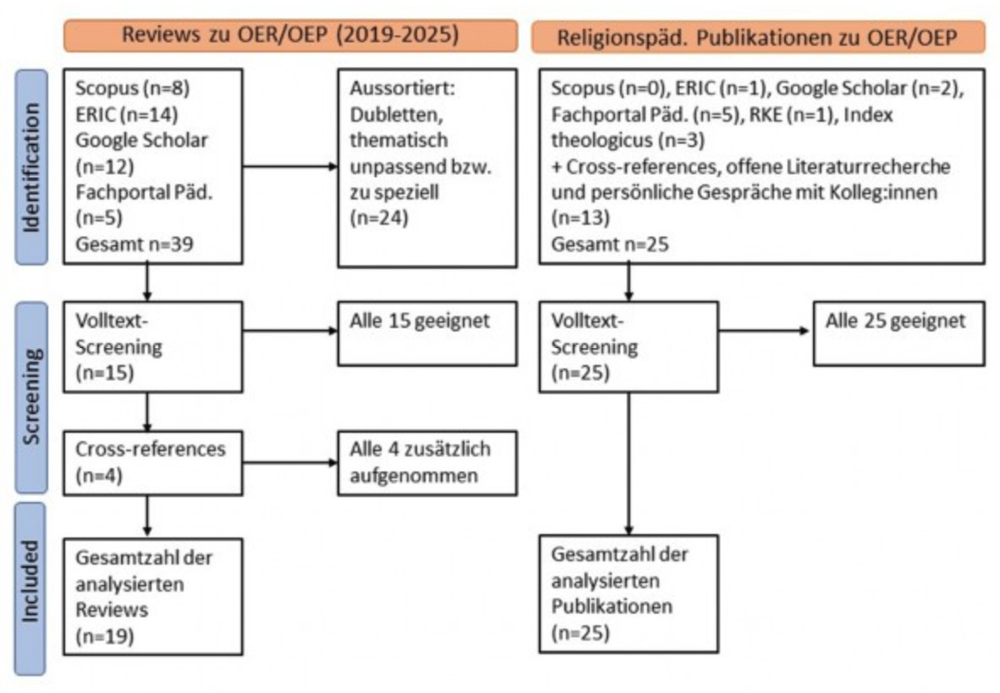

# Open Educational Resources und Open Educational Practices – ein systematischer Literaturbericht im religionspädagogischen Horizont

Viera Pirker / Manfred L. Pirner

### Zusammenfassung

Open Educational Resources (OER) und Open Educational Practices (OEP) haben sich als zentrale Elemente der strategischen Entwicklung digitaler Bildungspraktiken etabliert, bleiben jedoch in der religionspädagogischen Forschung bislang weitgehend unbeachtet. Der vorliegende systematische Literaturbericht untersucht die empirische Evidenz zu OER/OEP hinsichtlich Bildungsgerechtigkeit, Inklusion und Ǫualität sowie deren Wechselwirkung, insbesondere im Hochschulkontext. Methodisch folgt die Analyse den PRISMA-Leitlinien und kombiniert induktive mit deduktiven Auswertungsansätzen. Die Ergebnisse zeigen ambivalente Befunde: Sie weisen auf strategische, infrastrukturelle und kulturelle Herausforderungen hin, unterstreichen aber das perspektivische Potenzial von OER/OEP für eine partizipationsorientierte, digitale und pädagogisch wie theologisch verantwortete religionspädagogische Bildungslandschaft.

Schlagwörter: Literaturbericht, Ǫualitätsentwicklung, Open Educational Resources Open Educational Practices (OEP), Religionspädagogik

  

# Open Educational Resources and Open Educational Practices – a systematic literature review in the context of religious education

  

### Abstract

Open Educational Resources (OER) and Open Educational Practices (OEP) have become central elements in the strategic development of digital educational practices but remain largely overlooked in religious education research. This systematic literature review examines empirical evidence on OER/OEP concerning educational equity, inclusion, and quality, as well as their interrelation, particularly in the context of higher education. Methodologically, the analysis follows the PRISMA guidelines and combines inductive and deductive evaluation approaches. The findings present ambivalent results: they highlight strategic, infrastructural, and cultural challenges but also underscore the prospective potential of OER/OEP for a participatory, digital, and pedagogically as well as theologically reflected religious education landscape.

Keywords: Literature Review, Ǫuality Development, Open Education, Open Educational Resources (OER), Open Educational Practices (OEP), Religious Education
 

## 1 Einführung

Open Educational Resources (OER) gelten seit mittlerweile über 20 Jahren im internationalen wie im deutschsprachigen Kontext als ein Schlüsselelement für die Weiterentwicklung öffentlicher Bildung, haben aber erst in den letzten Jahren noch einmal stark an Bedeutung gewonnen. Nach der UNESCO, der Bildungs- und Kulturorganisation der UN, sind OER „Bildungsmaterialien jeglicher Art und in jedem Medium, die unter einer offenen Lizenz veröffentlicht werden“, die „den kostenlosen Zugang sowie die kostenlose Nutzung, Bearbeitung und Weiterverbreitung durch Andere ohne oder mit geringfügigen Einschränkungen“ ermöglicht (Deutsche UNESCO- Kommission, o. D.). Die UNESCO nimmt für sich in Anspruch, schon frühzeitig das Potenzial von OER erkannt zu haben, Chancengerechtigkeit (auch im Hinblick auf Entwicklungsländer), Inklusion und Bildungsqualität in besonderem Maße zu fördern, im Sinne einer (kostenfreien) Bildung für alle, an der zudem alle mitwirken können. OER werden als wichtiges Instrument gesehen, dem Menschenrecht auf Bildung sowie dem Sustainable Development Goal (SDG) Nr. 4 – „hochwertige Bildung“ („inclusive and equitable quality education“) – gerecht zu werden. Die Offenheit solcher Lernmaterialien ermögliche zudem ihre gemeinsame, an differenzierten Lernbedürfnissen ausgerichtete Weiterentwicklung durch Lernende und Lehrende, womit OER „maßgeblich zu einer neuen, offenen Lernkultur bei\[tragen\], einer Kultur des Teilens und der Zusammenarbeit“ (Deutsche UNESCO-Kommission, o. D.), was auch demokratischen Grundwerten entspricht. Solche Open Educational Practices (OEP) werden also durch OER einerseits gefördert, andererseits werden OEP eben als jene Bildungspraktiken verstanden, die wiederum die Verbreitung, Nutzung und Ǫualitätsentwicklung von OER fördern (vgl. z.B. Koschorrek, 2018a). Das wechselseitige Zusammenwirken von Materialien und Praktiken, so wurde immer wieder festgestellt, erfordert strategische und institutionelle Verankerung (vgl. Ehlers, 2011).

Die politische Tragweite der OER/OEP-Thematik wird darin deutlich, dass nach der Etablierung des Konzepts der offenen Bildungsressourcen im Verlauf eines UNESCO- Forums 2002, dem Erstarken der OER-Bewegung in den Folgejahren und dem ersten OER-Weltkongress der UNESCO 2012 die UNESCO-Generalkonferenz 2019 eine Empfehlung verabschiedet hat, nach der _alle öffentlich finanzierten Bildungsmaterialien unter eine offene Lizenz gestellt werden sollen_. Außerdem wurden etliche konkrete Maßnahmen zur Förderung von OER empfohlen, u.a. die Förderung von wissenschaftlicher Forschung zu OER, die Harmonisierung von OER-Policies mit anderen Open Policies wie zum Beispiel Open Access oder Open Science und die Förderung von internationaler Zusammenarbeit im Bereich OER. Im November 2024 fand in Dubai der dritte OER-Weltkongress statt, in dessen thematischem Fokus diesmal die so genannten „digital public goods“ (DPGs) standen, die von der „Roadmap for Digital Cooperation“ des UN-Generalsekretärs definiert wurden als „open-source software, open data, open AI models, open standards and open content that adhere to privacy and other applicable laws and best practices, do no harm, and help attain the sustainable development goals (SDGs)“. Zentrales Ergebnis des Kongresses stellt die „Dubai Declaration on Open Educational Resources (OER)“ dar (UNESCO, 2024). Darin werden Empfehlungen gegeben, wie mittels neuer Technologien, insbesondere KI, die weitere, rechtssichere und ethisch verantwortliche Verbreitung und Ǫualitätsentwicklung von OER vorangebracht werden können.

Für Deutschland hatte eine erste Bestandsaufnahme für die Hochschullandschaft ergeben, dass OER hier „noch eine nachgeordnete Rolle“ spielten (Goertz, Johannig & Michel, 2007, S. 1). Im darauffolgenden Jahr untersuchte Braun (2008) die „Optionen und Hürden für Lehrende an deutschen Hochschulen“ eingehend qualitativ. Seither hat sich die Situation allmählich gewandelt. Während die erste Initiative „Opening Up Education“ der Europäischen Kommission 2013 in Deutschland wenig Resonanz erhielt, nimmt sich seit 2015 v.a. das Bundesministerium für Bildung und Forschung (BMBF) des OER-Anliegens an, u.a. mit einer ersten Richtlinie zur Förderung von Offenen Bildungsmaterialien (BMBF, 2016) und der darauf fußenden Förderlinie 2016–2020. Im Jahr 2022 wurde dann ein „OER-Strategie“-Papier veröffentlicht (BMBF, 2022), und inzwischen wurden und werden zahlreiche Förderprojekte in verschiedenen Bildungsbereichen auf den Weg gebracht, die noch weiter ausgebaut werden sollen. In der BMBF-Strategie wird das Thema OER dezidiert mit dem Thema digitale Bildung verknüpft und OER eine wichtige Funktion für eine „chancengerechte Bildung“ bescheinigt (BMBF, 2022, S. 2). Eine besondere Rolle bei der Vernetzung von deutschlandweiten OER-bezogenen Initiativen und Aktivitäten spielt die beim Leibniz- Institut für Bildungsforschung und Bildungsinformation (DIPF) angesiedelte und vom BMBF seit 2016 aufgebaute und finanzierte „Informationsstelle Open Educational Resources“ (OER-Info; https://open-educational-resources.de/).

Angesichts der aufgezeigten zunehmenden Bedeutung, die OER und OEP in der aktuellen internationalen wie nationalen Bildungspolitik und – wie noch zu zeigen sein wird – in der Bildungsforschung haben, ist es überraschend, wie wenig Aufmerksamkeit diese Themen bislang in der religionspädagogischen Forschung bekommen haben. Das Erstaunen darüber wird umso größer, wenn man sich klar macht, dass mit dem Comenius-Institut ein religionspädagogischer Akteur – besonders über seine ‚Marke‘ rpi-virtuell – mit zu den Vorreitern der deutschen OER-Bewegung gezählt werden kann (vgl. Neumann & Muuß-Merholz, 2016) und seit den 2000er Jahren kontinuierlich Fachkompetenzen im Bereich OER/OEP, im Unterhalt entsprechender Plattformen sowie im Management von OER-Communities (wie z.B. relilab, RELImentar, narrt, schule-evangelisch-digital und neuerdings reliGlobal) aufgebaut hat. Ebenso hat das Medienhaus des Verbandes der Diözesen Deutschlands mit der Plattform rpp- katholisch vergleichsweise früh begonnen, digitale Bildungsmedien für religionspädagogische Nutzung bereitzustellen und offen zugänglich zu machen – auch wenn sie bislang nicht im „Open“-Diskurs verankert sind (vgl. Blum, 2016).

Vor diesem Hintergrund ist es das Ziel des vorliegenden Beitrags, in der Form eines systematischen Literaturberichts („systematic review“) a) einen groben allgemeinen Überblick über den internationalen Stand der aktuellen Forschung zu geben und b) den speziellen Sachstand in der Religionspädagogik zu diesem Gegenstandsbereich zu sondieren. Für beide Bereiche a) und b) wurde die Such- und Analyseperspektive zunächst durch die offene _Forschungsfrage_ geleitet, _welche empirischen Befunde sowie welche Chancen und Probleme von OER und OEP in wissenschaftlichen Studien und Diskursen im Vordergrund stehen_. Der Literaturbericht soll zudem als Unterstützung für das vom BMBF geförderte Verbundprojekt FOERBICO fungieren, das gegenwärtig vom Comenius-Institut in Kooperation mit den religionspädagogischen Professuren der Universitäten Frankfurt (Prof. Pirker) und Erlangen-Nürnberg (Prof. Pirner) durchgeführt wird.

## 2 Theoriehintergrund und Methodik

Methodisch orientiert sich dieser Literaturbericht im Sinn eines „systematic reviews“ an den mittlerweile gut etablierten Leitlinien der „Preferred Reporting Items for Systematic reviews and Meta-Analyses“ (PRISMA, 2024), die eine möglichst genaue, differenzierte Auskunft über das methodische Vorgehen, aber auch die theoretische Verortung des Reviews vorsehen.

Bezüglich der theoretischen Verortung ist zunächst festzuhalten, dass die allermeisten der sondierten Publikationen (überwiegend „systematic reviews“ vorhandener Studien) keine theoretische Fundierung für ihre Systematisierungen anbieten, sondern eher pragmatisch bzw. induktiv vorgehen. Thompson (2023, S. 8) verweist darauf, dass der Begriff „openness“ „ill-defined, opaque, and under-theorized“ ist. In diesem Sinn monieren auch Mullen und Hoffman (2023, S. 72): „Existing reviews lack a theoretical framework for analyzing OER research.“ Sie selbst verwenden die bekannte Self-Determination Theory von Decy und Ryan zur Einordnung und Interpretation der Befunde, indem sie Bezüge zwischen den drei Motivationsdimensionen Autonomie, Kompetenz sowie soziale Verbundenheit und den OER herstellen. So interessant diese Idee ist, bleibt sie u. E. insofern einseitig, als sie eben die _Motivation_ zur Nutzung von OER in den Mittelpunkt stellt, also die Akzeptanz, Attraktivität und Wirksamkeit von OER (rein) motivationspsychologisch zu erklären versucht.

Demgegenüber wird unser Forschungsinteresse bestimmt vom Ziel des erwähnten FOERBICO-Projekts, zur konstruktiven Weiterentwicklung offener Bildungsmaterialien und -praktiken in bestehenden und entstehenden Communities beizutragen. Mit diesem Ziel lässt sich das FOERBICO-Projekt wiederum einordnen in den theoretisch- konzeptionellen Kontext einer Öffentlichen Theologie bzw. einer Öffentlichen Religionspädagogik (vgl. z.B. Grümme & Pirner, 2023). Ihr geht es primär darum, die wertvollen Bestände der christlichen Tradition allen Menschen zugänglich zu machen und so zu erschließen, dass sie als kritisch-konstruktive Beiträge zum öffentlichen Diskurs das Gemeinwohl aller, unabhängig von deren religiöser oder nichtreligiöser Orientierung, fördern. Dies impliziert das Eintreten für einen möglichst partizipativen, kompetenten öffentlichen Diskurs, der sich an der regulativen Idee einer demokratisch- deliberativen Öffentlichkeit orientiert (vgl. z.B. Bedford-Strohm, Höhne & Zeyher- Ǫuattlender, 2019). Es liegt auf der Hand, dass in diesem Zusammenhang offene Bildungsmaterialien eine wichtige, allerdings bislang in theologisch- religionspädagogischen Kontexten zu wenig erkannte Bedeutung haben. Hier bestehen auch Zusammenhänge mit den in jüngerer Zeit entwickelten Ansätzen einer Digitalen Theologie (vgl. Haberer, 2015; van Oorschot, 2023) sowie einer religiösen Bildung im Kontext der Digitalität (Kirchenamt der EKD, 2022; Nord & Pirner, 2022; 2023; Pirker, 2021; 2022; Pirner, 2022b; 2023a; 2023b). Ein weiterer, gleichsam konkretisierender Link von der Öffentlichen Theologie und Religionspädagogik zu den OER besteht darin, dass die theologisch intendierte Förderung aller Menschen den Einsatz für eine gehaltvolle, subjektorientierte und für alle verfügbare Bildung impliziert – weshalb sich Theolog:innen und beide große Kirchen wiederholt mit eigenen Akzenten in den öffentlichen Bildungsdiskurs einbracht haben (vgl. z.B. DBK 2016; EKD, 2003; Kirchenamt der EKD, 2016). Für den vorliegenden Literaturbericht bedeutet dies einen besonderen Aufmerksamkeitshorizont für solche Befunde und wissenschaftliche Diskursbeiträge, in denen gemäß einem christlich orientierten Bildungsverständnis das Menschsein bzw. die Personalität des Menschen im Zentrum stehen – was v. a. bei den oben angesprochenen menschenrechtlichen Aspekten der Fall ist.

Inhaltlich legt das FOERBICO-Projekt einen besonderen Fokus auf religionspädagogische und hochschulische Kontexte sowie Communities. Indem es anknüpft an das Strategiepapier des BMBF, kann es im weiten Sinn als strategiegeleitetes Entwicklungsprojekt verstanden werden, für das der vorliegende Literaturbericht – ebenso wie die bereits erfolgte Befragung von OER-Community- Verantwortlichen (Angelina & Pirner, 2025) – Informationen zur realistischen Wahrnehmung des Ist-Standes der OER/OEP-Kultur(en) und damit einhergehend auch eine kritische Überprüfung der normativen Soll-Erwartungen erbringen soll. Dazu lässt sich kaum sinnvoll eine kohärente Theoriebasis heranziehen; wohl aber lassen sich systematisch-theoriegeleitet Faktoren und Aspekte benennen, welche die Auswertung der zu sondierenden Literatur strukturieren können. Während die eingangs formulierte offene Forschungsfrage auf eine eher induktive Erhebung zielt, beruhen die im Folgenden benannten konkretisierenden Differenzierungen auf eher deduktiven, aus unserem Forschungsinteresse abgeleiteten Frageperspektiven. Damit ergibt sich ein methodisches Vorgehen in Anlehnung an die inhaltlich-strukturierende qualitative Inhaltsanalyse nach Kuckartz (2018), in der deduktiv vorgegebene Auswertungskategorien durch induktiv erhobene zusätzliche bzw. ausdifferenzierende (Sub-)Kategorien ergänzt werden können. Die erwähnten konkretisierend- differenzierenden Frageperspektiven strukturieren auch die Ergebnispräsentationen der nachfolgenden Abschnitte.

1.  Inwiefern werden die starken normativen Erwartungen (v.a. Förderung von Chancengerechtigkeit, Inklusion und Bildungsqualität) gegenüber OER/OEP empirisch-faktisch erfüllt? (Abschnitt 3)   
2.  Inwiefern stehen OER und OEP empirisch-faktisch in dem häufig behaupteten fruchtbaren Wechselverhältnis? (Abschnitt 4)
3.  Inwieweit sind OER und OEP in hochschulischen Kontexten, insbesondere in Deutschland, verbreitet und welche Rolle nehmen sie hier ein? (Abschnitt 5)  
4.  Welche Faktoren erweisen sich für die Ǫualitätsentwicklung von OER und OEP als unterstützend und welche als hinderlich? (Abschnitt 6)
5.  Wie stellt sich der Sachstand zu OER/OEP in der internationalen wie nationalen Religionspädagogik dar? (Abschnitt 7)
    
Diese Forschungsfragen weisen unseren Literaturbericht auch als spezifisch gegenüber den bereits vorliegenden Reviews aus, von denen gleich noch genauer die Rede sein wird. Zudem lassen diese vorliegenden Reviews durchaus unterschiedliche Akzentuierungen, Ǫualitäten und Auswertungsverfahren erkennen, sodass es sinnvoll erscheint, hier ein eigenes, an unseren charakteristischen Forschungsfragen orientiertes (Meta-)Review vorzulegen.

Für die Recherche sind wir von den Datenbanken Scopus, ERIC, Google Scholar und dem Fachportal Pädagogik des DIPF ausgegangen. Zu a) (allgemeiner Überblick) haben wir uns auf die erwähnten bereits (zahlreich) vorhandenen Literaturberichte („systematic reviews“) zu „open educational resources“ bzw. „OER“ (im Titel) konzentriert; OEP wurde nicht als eigene Suchkategorie abgefragt, da wir davon ausgehen konnten – und dies auch noch einmal überprüft haben –, dass Publikationen zu OEP immer auch Bezüge zu OER enthalten. Der hohen Dynamik des Themenfeldes entsprechend haben wir die Suche eingeschränkt auf die (englisch- und deutschsprachige) Literatur der letzten fünf Jahre (2019–2024/2025). Diese Suche ergab in Scopus 8 Titel, in ERIC 14, in Google Scholar 12 und im Fachportal Pädagogik 5 Treffer. Nach dem Ausscheiden von Dubletten, thematisch unpassenden oder sehr speziellen Artikeln (z.B. zu OER im Bereich „Nursing“ oder zum engen regionalen Bezug auf China, Thailand oder Afrika) verblieben 15 Publikationen; durch die Auswertung von cross-references wurden weitere 4 Reviews ausfindig gemacht, sodass insgesamt 19 Reviews ausführlich analysiert wurden. Einen Überblick über den Sondierungs- und Auswahlprozess gibt Abbildung 1; eine Auflistung der für den vorliegenden Literaturbericht ausgewählten Publikationen findet sich am Ende des Artikels vor dem Gesamt-Literaturverzeichnis.

Abb. 1: Überblick über den Recherche- und Auswahlprozess, orientiert an PRISMA, adaptiert von Page, McKenzie, Bossuyt, Boutron, Hoffman, Mulrow & Moher (2021

In den Reviews genannte besonders wichtige Studien wurden eigens gesichtet. Anzumerken ist, dass die Ǫualität der gesichteten Reviews recht unterschiedlich ist, was sich natürlich auf ihre Gewichtung für den vorliegenden Literaturbericht auswirkt. Einige Reviews beschränken sich weitgehend auf den Ausweis quantitativer Daten und sind wenig aussagekräftig (z.B. Fulgencio & Asino, 2021; Sandoussi, Hnida, Daoudi & Ajhoun, 2022; Sousa, Pedro & Santos, 2023). Andere bleiben inhaltlich blass oder unscharf und unterscheiden teilweise nicht deutlich genug zwischen empirisch validierten Forschungsergebnissen und thetischen Aussagen (z.B. Aksoy, Kurşun & Zawacki\-Richter, 2025; Swain & Pathak, 2024); was soll man etwa mit der Aussage anfangen, „social media are also considered good examples of OERs“ (Swain & Pathak, 2024)? Generell kann im Hinblick auf die in den Reviews analysierten Studien mit Thompson (2023, S. 42) festgestellt werden: „much of the field lacks theoretical grounding or statistical power.“

Da die Forschung zu OER im _deutschsprachigen_ Bereich noch deutlich unterentwickelt ist, haben wir hier auch weiter zurückliegende Beiträge einbezogen und uns zusätzlich an den Literaturangaben einschlägiger programmatischer Veröffentlichungen zu OER orientiert. So bietet z.B. der Artikel von Otto, Schröder, Diekmann und Sander (2021) einen wichtigen Überblick über den „Stand der internationalen evidenzbasierten Forschung zu Open Education Resources (OER)“, enthält aber keinen der gewählten Suchbegriffe („review“, „Literaturbericht“). Für die Recherche nach englisch- und deutschsprachiger _religionspädagogischer_ Literatur zu OER wurde keinerlei Zeitbegrenzung angesetzt. Außerdem wurde nicht nur nach forschungsbezogener Literatur gesucht, sondern nach jeglichen Publikationen, welche die Kombination von „OER“ und „religious education/religion“ bzw. „Religionsunterricht/Religionsdidaktik/Religionspädagogik“ aufwiesen. Dazu ergaben sich in Scopus keine Treffer, in ERIC 1, in Google Scholar 2 und im Fachportal Pädagogik keine Treffer. Es war eine intensive Suche auf verschiedenen Wegen nötig, um doch noch die eine oder andere Publikation zum Thema zu finden. Unter anderem wurde auch auf die Bibliografie-Datenbank „Religionspädagogik, Kirchliche Bildungsarbeit, Erziehungswissenschaft“ (RKE) des Comenius-Instituts (https://eopac.net/comenius-institut/) zurückgegriffen – die allerdings zur Kombination „OER“ und „Religionsunterricht“ auch nur einen einzigen Treffer auswies – sowie auf die theologisch- religionswissenschaftliche Fachdatenbank Index Theologicus, in der die Suche nach „Open Educational Resources“ zu weiteren 3 relevanten Titeln führte.

Für die hier angestrebte überblicksmäßige Sondierung des Terrains erschien uns eine primär qualitative Auswertung am sinnvollsten. Die Literaturtitel wurden dazu kategorisiert und die jeweiligen Ergebnisse den entsprechenden kategoriengeleiteten Textabschnitten zugeordnet; die Zuordnungen und Ergebnisdarstellungen wurden jeweils von dem/der anderen Autor:in kritisch gegengelesen und strittige Fälle diskutiert. Alle ausgewählten Literaturtitel finden sich, aufgeteilt auf beiden Reviewbereiche, vor der Gesamtliteraturliste am Ende des Artikels.

## 3 Erfüllen OER die ihnen entgegengebrachten Erwartungen? Empirische Evidenz und wissenchaftliche Diskussion

### 3.1 De-Professionalisierung durch den Lehrkräftemangel – domänenübergreifend

Bezüglich der Frage, inwieweit OER empirisch nachweisbar zu dem politisch angestrebten Ziel beitragen, die Chancengerechtigkeit, Inklusion und Partizipation zu verbessern sowie Demokratiebildung zu fördern, gibt es nach wie vor große Forschungsdefizite (Iniesto & Bossu, 2023; Moon & Park, 2021; Moreno, Caro & Cabedo, 2018; Müller, 2021; Zhang, Tlili, Nascimbeni, Burgos, Huang, Chang, Jemni & Khribi, 2020). Häufig wird in der Literatur bereits die kostenlose Verfügbarkeit von OER als entscheidender Vorzug im Hinblick auf Bildungsgerechtigkeit gesehen, aber auch generell als Hauptmotivation für die Nutzung von OER sowohl durch Individuen als auch durch Institutionen benannt (z.B. Clinton-Lissel, 2021). Mullens und Hoffman (2023, S. 26) berichten darüber hinaus von Studien, in denen die freie Zugänglichkeit der OER von Studierenden aus niedrigen Einkommensverhältnissen und Nicht-Akademiker-Familien besonders geschätzt wurde und ihnen offenbar bessere Chancen ermöglicht, ihre Bildungsziele zu erreichen. Allerdings zitiert Sadruddin (2022, S. 5) zustimmend Farrow, de los Arcos, Pitt und Weller (2015): „OERs are still mainly used by well-educated learners residing in the global north, and most OERs are offered in English”. Von einer substanziell verbesserten Chancengerechtigkeit zwischen reichen westlichen Industriestaaten und Entwicklungsländern durch OER kann – auch wenn frühe Aufbrüche auf allen Kontinenten zu beobachten waren (Goertz, Johanning & Michel, 2007) – nach den vorliegenden Befunden nicht die Rede sein; in letzteren fehlt es häufig an technologischen Möglichkeiten ebenso wie an der digitalen Kompetenz, sie zu nutzen und v.a. nicht nur passiv OER zu konsumieren, sondern auch selbst zu ihrer Produktion, Modifikation und Verbreitung beizutragen (vgl. in Bezug auf afrikanische Staaten Tlili, Altinay, Huang, Altinay, Olivier, Mishra, Jemni & Burgos, 2022).

Trotz des unbestrittenen Potenzials von OER gerade auch für Menschen mit besonderem Förderbedarf durch deren flexibel gestaltbare Zugänglichkeit und Differenzierbarkeit (vgl. Müller, 2016), fällt der aktuelle empirische Befund eher ernüchternd aus. Nach den Reviews von Moreno et al. (2018), Moon und Park (2021), Sadruddin (2022) und Zhang et al. (2020) sind OER in inklusiven Formaten kaum verfügbar. Moon und Park (2021, S. 314) stellen fest: „Learners with disabilities are likely to experience challenges in interacting with OER due to their modality constraints“ – und dies, obwohl es bereits seit vielen Jahren die „Leitlinien für zugängliche Information“ der European Agency for Special Needs and Inclusive Education (2015) (vgl. auch Altinay, Ossiannilsson, Kalaç, Basari, Aktepebasi & Altinay, 2016) sowie für die USA das „Protocol for Curating Accessible OER“ (National Center on Accessible Educational Materials, 2021) gibt. Zhang et al. (2020) stellen fest: „\[A\]ccessibility is still in its infancy“; die Potenziale von Assistenztechnologien für Menschen mit Behinderungen hätten bislang auch im OER-Bereich nur wenig Beachtung gefunden. Selbst unter akademischen Bibliothekar:innen weltweit, die mit OER arbeiten, achten nach einer Survey-Studie weniger als die Hälfte darauf, dass sie eine barrierefreie Zugänglichkeit der Materialien ermöglichen (Schultz & Azadbakht, 2021).

### 3.2 Bildungsqualität

In der internationalen wissenschaftlichen Forschung zu OER gibt es einige Evidenz dafür, dass OER sich sowohl auf die _Nutzung, Wahrnehmung und Einstellungen_ der Lehrenden (vgl. z.B. Baas, van der Rist, Huizinga, van den Berg & Admiraal, 2022; Schroeder & Donat, 2023) als auch auf die Bildungsprozesse der Lernenden (vgl. z.B. Al Abri, Bannan & Dabbagh, 2022; Hilton, 2020) positiv auswirken können, auch wenn die Effekte häufig gering sind. Auf der Basis von 62 Forschungsartikeln stellen Chiappe, Díaz und Ramirez-Montoya (2024) fest, dass die Einführung von offenen Lernmaterialien sowohl von den Lehrenden als auch den Lernenden ganz überwiegend positiv wahrgenommen wurde; Gleiches bestätigen auch Mullens und Hoffman (2023) aufgrund ihrer Auswertung von 97 Studien. Letztere Autoren erwähnen aber auch vier Studien, in denen diejenigen Dozierenden, die OER nicht in ihre Lehre aufgenommen hatten, negative Einstellungen und auch Sorge über die möglicherweise geringere Ǫualität der OER-Materialien gegenüber kommerziellem Lernmaterial äußerten.

Was den _Lernerfolg_ betrifft, stellen Luo, Hostetler, Freeman und Stefaniak (2020) in ihrem Review von 51 Studien keine signifikanten Unterschiede zwischen „learning outcomes“ mit oder ohne OER fest. Tlili et al. (2023) konnten in ihrer Meta-Studie (25 Studien) zwar signifikante, aber in ihrer Effektgröße vernachlässigbare Auswirkungen auf den Lernerfolg der Teilnehmenden finden. Nach dem Literaturbericht von Otto et al. (2021, S. 1076) weisen etliche Studien darauf hin, „dass die Nutzung offener versus geschlossener Materialien keinen signifikanten Einfluss auf den Lernerfolg (Noten, Abschlussquote, Abbruchquote) hat“, dass OER also im Vergleich zumindest keine Nachteile mit sich bringen. Mullens und Hoffman (2023) differenzieren, dass gemessen sowohl an Kursnoten, Examensnoten und bestandenen Abschlüssen ein größerer Teil der Studien keine Unterschiede bei Lernenden, die OER genutzt haben, im Vergleich zu anderen feststellte, während ein kleinerer Teil der Studien ein besseres Abschneiden der OER-Nutzer:innen konstatierte; in zwei Studien wird von schlechteren Leistungen der OER-Studierenden berichtet. Am Beispiel von Kursnoten: „Results from 19 studies (59 %) indicated no difference in final course grades between students using OER and commercial materials while results of 11 studies determined students using OER earned higher grades than students using commercial materials“ (Mullens & Hoffman, 2023, S. 28).

Ein positiver Effekt wird dem Lernen mit OER häufig hinsichtlich _digitaler Bildung_ zugeschrieben; dieser konnte auch empirisch belegt werden. So berichten Chiappe et al. (2024), dass über 72 % der von ihnen untersuchten 62 Studien positive Effekte sowohl auf die allgemeine Lese- und Schreibkompetenz („literacy“) als auch auf die „digital literacy skills“ der Lernenden durch die Implementierung von OER beschreiben. Dabei spielen die Openness-Aspekte „adaptation/reuse“, „collaboration“ und „sharing“ eine besonders bedeutsame Rolle.

## 4 Befunde zu Wechselwirkungen zwischen OER und OEP
    
Zur Frage, inwieweit sich der im internationalen Diskurs angestrebte und auch vom BMBF gewünschte Wandel „von OER als ‚purer Materialerstellung‘ hin zu OEP als ‚Nutzungsstrategie zur Gestaltung neuer Unterrichtsformen und Gestaltungsprozesse‘“ (BMBF, 2022, S. 11) bereits in der Praxis wiederfinden lässt, also inwieweit das „transformative Potenzial“ von OER (Deutsche UNESCO-Kommission, 2015, S. 7) tatsächlich besteht und sich auswirkt, kann die Forschungslage bislang als unbefriedigend bezeichnet werden. In ihrem Literature Review von 31 Forschungsarbeiten zu OEP in europäischen Hochschulen haben Bellinger und Mayrberger (2019, S. 19) festgestellt, dass die Verbindung von OER und OEP in Theorie und Forschung „noch relativ unterrepräsentiert“ ist. Der Review von Swain und Pathak (2024) stellt – auf der Basis von 40 Artikeln – allerdings fest: „There is a positive correlation between the use of open and interactive learning methods and the adoption of OER.“ Ähnlich formulieren Farrow, Iniesto, Pitt, Weller und Bossu (2024, S. 9): „Innovative pedagogical practices are key to driving OER innovation.“ Und umgekehrt fördern OER innovative pädagogische (OEP-)Praktiken.
    
In der internationalen Fachdiskussion werden zwei Hauptperspektiven auf OEP deutlich: „\[e\]ine enger an OER orientierte, die OEP nicht ohne OER für realisierbar hält und eine am pädagogischen Konzept einer Open Pedagogy \[Hegarty, 2015\] orientierte Perspektive, die nicht zwingend OER für OEP voraussetzt“ (Bellinger & Mayrberger, 2019, S. 26). OER intendiert grundlegend Partizipation im Kontext eines „Open Education“- bzw. „Open Pedagogy“-Ansatzes, in dem OER „als digitale Fortsetzung der Open- Education-Bewegung“ (Deimann, 2014, S. 185) im Sinne einer „partizipativen Medienkultur“ (Biermann, Fromme & Verständig, 2014) gilt, dass sich für Lehrende durch die Arbeit in beziehungsorientierten Settings Kreativität, Offenheit und Kollaboration eigene Kraft entfaltet (Nerantzi, Chatzidamianos, Stathopoulou & Karaouza, 2021). Clinton-Lisell (2021) schließt sich David Wiley an und verwendet „Open Pedagogy“ dezidiert für eine Praxis, die erst durch OER überhaupt möglich wird (und damit synonym zu OEP) und „not possible with traditional copyrighted materials“ (S. 255) wäre, insbesondere die kreative Bearbeitung von Materialien, die dann wieder für andere zur freien Nutzung zur Verfügung stehen. Fast alle der von ihr reviewten 18 Studien berichten, dass die Lernenden die offenen Bildungspraktiken als lernförderlich, die eigene Selbstwirksamkeit stärkend und das kritische Denkvermögen fördernd schätzen. Die zwei Studien, die auch die Leistungsergebnisse der Lernenden mit Kontrollgruppen verglichen, stellten allerdings keine signifikanten Unterschiede fest. In manchen Studien zeigten sich auch negative Nebenwirkungen der Open Pedagogy, u.a. durch mehr Leistungsangst, Unwohlsein bei kollaborativen Aufgaben wegen der damit verbundenen Abhängigkeit vom Kooperationspartner und Unsicherheit im Umgang mit den digitalen Technologien.
    
Baas, Schuwer, van den Berg, Huizinga, van der Rijst und Admiraal (2023, S. 1000) berichten von Befunden, die belegen, dass OER „Initiativen zur Verbesserung von Lehren und Lernen unterstützen \[können\] (Orr, Rimini & van Damme, 2015) \[…\], die kritische Reflexion der Lehrkräfte über ihre Praktiken verbessert wird (Weller, de los Arcos, Farrow, Pitt & McAndrew, 2015) oder die Zusammenarbeit zwischen Lehrkräften über Institutsgrenzen hinweg gefördert wird (Chae & Jenkins, 2015)“. Littlejohn und Hood fanden in einer Studie unter Erwachsenenbildnern in Großbritannien Hinweise darauf, dass die durch OER veränderten professionellen Praktiken auch die Rolle der Lehrenden und der Lernenden verändern (Littlejohn & Hood, 2016, S. 506; vgl. auch die Reviews in Wilmers, Anda, Keller & Rittberger, 2020; sowie Keller, 2021). Auch Schule-Buskase und Gruhn (2024) verweisen auf die Potenziale von OER, zu einer offenen inklusiven Bildung beizutragen, die sie allerdings im Hinblick auf Menschen mit besonderem Förderbedarf zu wenig genutzt sehen, weshalb sie etwas provokant auch von OEP „trotz“ OER sprechen.
    
Eine Studie aus den USA gibt Anhaltspunkte dafür, dass sich der Übergang von OER zu OEP durch eine DBR-Begleitforschung gut unterstützen lässt (Al Abri, Bannan & Dabbagh, 2022).

## 5 OER/OEP in Hochschul-Kontexten

Wie bereits deutlich wurde, stammen die meisten internationalen wissenschaftlichen Studien zu OER/OEP aus dem Bereich der „Higher Education“ (Hochschulen, Colleges und polytechnische Ausbildungsinstitute). Da die Weiterentwicklung von OER/OEP im (theologisch-religionspädagogischen) Hochschulkontext ein eigenes Arbeitsziel des eingangs erwähnten BMBF-Projekts darstellt, wird dem diesbezüglichen Forschungsstand im Folgenden eigens Beachtung geschenkt.

Anders als im internationalen Bereich stehen bezogen auf Hochschulen OER im deutschsprachigen Bereich erst seit wenigen Jahren stärker im Fokus (Kopp, Neuböck, Gröblinger & Schön, 2021, S. 179). Dazu haben entsprechende Whitepapers wie z.B. Deimann, Neumann und Muuß-Merholz (2015), Empfehlungen wie die der UNESCO (Deutsche UNESCO-Kommission, 2015) und Strategiepapiere wie Mayrberger und Zawacki-Richter (2017) ebenso beigetragen wie die Verzahnung von OER-/OEP- Strategien mit der Open-Science-Bewegung und der Open-Access-Strategie öffentlicher Forschungsförderung. Das BMBF-Strategiepapier betont die wichtige Funktion von Hochschulen, die als Forschungs- und Bildungsinstitutionen „Innovationen im Bereich OER zum einen in die eigene OEP der Hochschullehre überführen“ und zum anderen „mit OEP verbundene Handlungspraktiken in der Aus- und Weiterbildung zukünftiger Lehrkräfte und deren pädagogischer Praxis“ etablieren können (BMBF, 2022, S. 8, 11).

Vielfältige strategische Unterstützungen erfolgen durch die Plattformförderungen der Bundesländer und auch des Bundes. Breitenwirksam ist die bereits 2014 gestartete Initiative der hochschulübergreifenden Hamburg Open Online University. Im Kooperationsnetzwerk OER-förderliche Infrastrukturen und -Dienste (KNOER) sind neun Bundesländer vernetzt und ermöglichen eine Interoperabilität der jeweiligen Content- Netzwerke, in denen hochschuldidaktische Inhalte als Open Educational Resources zur Verfügung gestellt und zumeist auch über den Suchindex OERSI (Open Educational Resources Search Index \[https://oersi.org/\]) zugänglich gemacht werden. Derzeit sind dort 86.349 Materialien gelistet, von denen aber nur 16 Materialien der Evangelischen Theologie, 13 Materialien der Katholischen Theologie und 6 Materialien den Islamischen Studien zugeordnet sind (Abruf: 09.08.2024).

## 6 Qualitätsentwicklung im OER/OEP-Bereich

### 6.1 Was behindert und was fördert die Nutzung von OER sowie eine entsprechende pädagogische Praxis?

Eine qualitative Felderschließung mit dem Ansatz der Innovationsforschung zeigt bereits zu einem frühen Zeitpunkt grundsätzliche Rahmenbedingungen, Beweggründe, Motivationen und Schwierigkeiten der OEP-Bewegung, insbesondere der Produktion und Integration von OER in Deutschland (Braun, 2008). Die ausführlichsten Auswertungen zu „barriers“ bzw. „challenges“ und „incentives“/„chances“/„drivers“/„enablers“ im OER- Bereich liefern indes die Reviews von Farrow et al. (2024), Luo et al. (2020), Mullens und Hoffman (2023) sowie Swain und Pathak (2024).

#### Zu den Hindernissen und beeinträchtigenden Faktoren

In mehreren Studien gaben die Lernenden an, gedruckte Materialien zu bevorzugen, u.a. weil diese _angenehmer zu lesen und besser zu bearbeiten seien und nicht so viel Ablenkung mit sich brächten_ wie Materialien, die auf digitalen Endgeräten rezipiert werden müssen (Mullens & Hoffmann, 2023, S. 23). Manche Untersuchungen zeigten, dass insbesondere Schulkinder aus einkommensschwachen Familien _Nachteile beim Internetzugang sowie in der Ausstattung_ mit angemessenen digitalen Endgeräten hatten (Mullens & Hoffmann, 2023, S. 23).

Sowohl Lehrende als auch Lernende empfanden teilweise _umständliche, wenig intuitive OER-Repositorien und -suchmaschinen_ sowie fehlende oder wenig effektive Ǫualitätskontrollsysteme als ein Problem, was zu einem geringen Vertrauen in die Ǫualität von OER-Material beitragen kann (Farrow et al., 2024, S. 11). Lehrende berichteten zudem, dass der Prozess, passende OER zu finden und sie für die eigenen Zwecke anzupassen, im Vergleich zu kommerziellen Materialien zu zeitraubend sei (z.B. Mullens & Hoffman, 2023, S. 24). Farrow et al. (2024) sowie Swain und Pathak (2024) sprechen generell zusammenfassend von _„lack of training, lack of motivation, lack of awareness“_ bei den Lehrenden in „Higher Education“; viele Lehrende setzen OER einfach mit jeglichen digital verfügbaren Materialien gleich.

Ein ebenfalls immer wieder genanntes Hemmnis ist die _mangelhafte institutionelle Unterstützung_, etwa im technischen Bereich oder durch OER-Expert:innen, fehlende oder unbefriedigende digitale Infrastruktur sowie generell die zu geringe Wertschätzung von OER im Arbeitsumfeld. Dies alles bedingt auch die mangelhafte Nachhaltigkeit (sustainability) im Umgang mit OER (vgl. z.B. Luo et al., 2020, S. 143).

Während Hindernisse für die _Nutzung_ von OER durch Lehrende und Lernende häufig erhoben wurden, waren zu Hindernissen für die _Erstellung_ von OER nur wenige Aussagen zu finden. Swain und Pathak (2024) berichten die Tendenz der Lehrenden, zwar OER zu nutzen, aber nicht selbst zu produzieren und zu veröffentlichen. Als Hindernis nennen sie u.a. „intellectual property issues“; in anderen Studien wird eine generelle Unsicherheit bezüglich rechtlicher Fragen thematisiert, sowohl was die Lizenzierung generell betrifft als auch was das Risiko einer kommerziellen oder ideologisch problematischen Nutzung der selbst erstellten OER angeht.

Zudem ist in hochschulischen Kontexten die _Produktion von Lehrmaterialien weniger anerkannt als Forschungspublikationen_. Kommerzielle Vermarktungsmöglichkeiten werden von Forschenden vorgezogen, eine Kultur des Teilens wird im deutschsprachigen Raum bezüglich der Lehre tendenziell als unerwünscht betrachtet – man lasse sich ungern in die eigenen Karten sehen (vgl. Braun, 2008, S. 65–66). Nach Swain und Pathak (2024) ist die aktive Zusammenarbeit in einer Gruppe bzw. Community zur Erstellung und Verbreitung von OER der beste Weg, rechtliche Bedenken und Ängste vor einem Missbrauch der Materialien zu reduzieren; allerdings ist eine effektive Kooperation durchaus auch mit eigenen Herausforderungen verbunden, die sowohl technischer als auch institutioneller Art sein können, z.B. ein genereller Widerstand gegenüber Neuerungen (Farrow et al., 2024).

#### Zu den Chancen und förderlichen Faktoren

Die Reviews von Mullens und Hoffman (2023) sowie von Swain und Parthak (2024) bestätigen, dass sowohl für Lernende als auch für Lehrende die _Kostenersparnis die primäre Motivation_ für die Nutzung von OER war. Die kostenfreie und _zeitige Bereitstellung_ der Lernmaterialien sowie deren _permanente Verfügbarkeit_ wird insbesondere von Studierenden als erhebliche, auch stressreduzierende Entlastung empfunden (vgl. auch Farrow et al., 2024, S. 6); zudem beurteilen sie Dozierende, die OER einsetzen, als netter, ermutigender und kreativer. Da die OER _genau auf ihren Kurs zugeschnitten_ waren, empfanden viele Studierende sie als mindestens so hilfreich oder hilfreicher als andere Materialien. Wie oben bereits erwähnt, wird die _Bedeutung von Communities_ in mehreren Studien hervorgehoben. Farrow et al. (2024, S. 7) fassen zusammen: „Community engagement and advocacy are crucial for promoting OER innovation.“ Dies gilt sowohl für institutionenbasierte als auch freiwillige Grassroot-Communities. Für Institutionen wie Universitäten sind klare Strategien und Visionen sowie die Entwicklung und Nachhaltigkeit von entsprechender Infrastruktur, bei der oftmals die Uni-Bibliotheken eine wichtige Rolle spielen, entscheidende förderliche Faktoren für die Implementierung von OER.

Unter 4. wurde bereits angesprochen, wie Lehrende in mehreren Studien davon berichteten, dass sich ihre _Lehre durch die Nutzung von OER verbessert_ habe – was für sie eine bestätigende Motivation war, sie auch weiterhin einzusetzen. Diese empfundenen Verbesserungen werden darauf zurückgeführt, dass OER adaptierbar sind, ihr Gebrauch mehr zur Reflexion und Innovation der eigenen Lehre anregt, ein stärkeres Selbstwirksamkeitserleben fördert, mehr Flexibilität ermöglicht und die Lernenden stärker zur Mitarbeit, Eigentätigkeit und Zusammenarbeit motiviert. Farrow et al. (2024, S. 8) bezeichnen OER als „collaboration catalyst“, die sowohl die Zusammenarbeit der Lehrenden als auch der Lernenden untereinander sowie der Lehrenden und Lernenden miteinander fördern können.

### 6.2 Wie wird die Qualität von OER und OEP bestimmt?

„Forty-eight studies examined student perceptions of OER. Across studies, students believed that OER are as good as or better in quality than materials they used in other courses. These studies do not define quality and leave interpretation to respondents“ (Mullens & Hoffman, 2023, S. 22). Diese Tendenz besteht über alle gesichteten Reviews hinweg. Immerhin weisen Mullens & Hoffmann (2023, S. 22) auf drei Ǫualitätskriterien hin, die mehrfach genannt werden: a) die Nützlichkeit und Relevanz des Materials für die eigene Lehre, b) seine Vorteile für die Lernenden und c) die Kompatibilität des Materials mit den eigenen pädagogischen Überzeugungen.

Die Machbarkeitsstudie zu OER-Infrastrukturen von Blees, Hirschmann, Kühnlenz, Rittberger und Schulte (2016) hat vorgeschlagen, die Ǫualität von OER-Materialien an den drei Kriterien a) inhaltliche und sachliche Richtigkeit, b) rechtliche Absicherung der Lizenzen sowie c) Einhaltung technischer Standards zu orientieren und sieht grundsätzlich folgende vier Möglichkeiten der Materialprüfung: a) durch übergeordnete Einrichtungen, b) durch eine Redaktion, c) durch Peer-Review-Verfahren und d) durch die Nutzer:innen selbst (Blees et al., 2016, S. 50).

Im „OER-Whitepaper Weiterbildung“ haben Blees, Deimann, Seipel, Hirschmann und Muuß-Merholz (2015) ein modulares Ǫualitätssicherungssystem mit folgenden Modulen vorgeschlagen: „Angaben zur Herkunft der Ressourcen (Verlage, Bildungseinrichtungen, Trainer/Dozenten …), Informationen zur Reputation der beitragenden Akteure, Kriterienkataloge zur Beurteilung von Interessenneutralität, sachlicher Richtigkeit, medialer und didaktischer Aufbereitung, Redaktionen für OER-Sammelstellen (‚zentrale Plattformen‘ s.o.), die die Ressourcen nach genannten Kriterien ausweisen, sowie \[…\] Beteiligung der Fachcommunity, die Ressourcen bewertet und kontextualisiert“ (Blees et al., 2015, S. 62). Fey (2015) hat in einer Monographie das von ihm so genannte „Augsburger Analyse- und Evaluationsraster für analoge und digitale Bildungsmedien“ entwickelt, das mittlerweile u.a. von mehreren Fachdidaktiken, auch aus religionsdidaktischer Perspektive, getestet und als brauchbar eingeschätzt wurde (Fey & Matthes, 2017) – wobei verschiedene Vorschläge für eine Weiterentwicklung sowie fachdidaktische Ergänzungen gemacht wurden (Streitberger & Ohl, 2017; Graf & Kürzinger, 2019).

Eine weitere Studie zu Instrumenten der Ǫualitätssicherung von OER wurde von Mayrberger und Zawacki-Richter (2017) vorgelegt, die Ansätze zur Ǫualitätssicherung und -entwicklung von OER im deutschsprachigen Raum systematisierten. Auf dieser Basis entwickelten sie einen eigenen Vorschlag zur Erstellung eines Ǫualitätssicherungsinstruments (Mayrberger, Zawacki-Richter & Müskens, 2018; siehe Abb. 2). Sie unterscheiden dabei zwischen pädagogisch-didaktischen Kriterien (Inhalt und didaktische Konzeption) und technischen Kriterien (Zugänglichkeit und Usability).

Abb. 2: Vorschlag für [Ǫualitätskriterien von OER von Mayrberger, Zawacki-Richter & Müskens, 2018, S. 29](https://www.synergie.uni-hamburg.de/media/sonderbaende/qualitaetsentwicklung-von-oer-2018.pdf#page=29)
