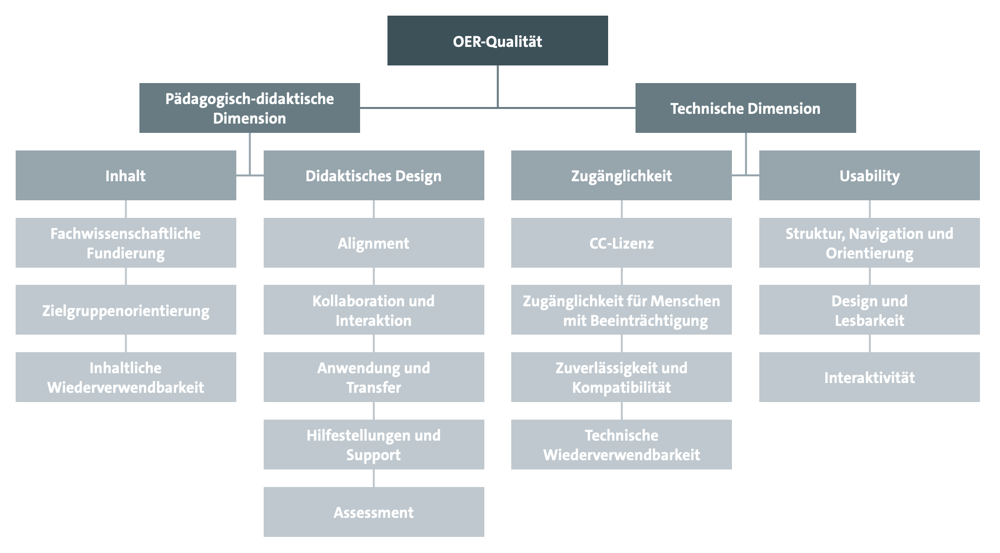

# Open Educational Resources und Open Educational Practices – ein systematischer Literaturbericht im religionspädagogischen Horizont

Viera Pirker / Manfred L. Pirner

### Zusammenfassung

Open Educational Resources (OER) und Open Educational Practices (OEP) haben sich als zentrale Elemente der strategischen Entwicklung digitaler Bildungspraktiken etabliert, bleiben jedoch in der religionspädagogischen Forschung bislang weitgehend unbeachtet. Der vorliegende systematische Literaturbericht untersucht die empirische Evidenz zu OER/OEP hinsichtlich Bildungsgerechtigkeit, Inklusion und Ǫualität sowie deren Wechselwirkung, insbesondere im Hochschulkontext. Methodisch folgt die Analyse den PRISMA-Leitlinien und kombiniert induktive mit deduktiven Auswertungsansätzen. Die Ergebnisse zeigen ambivalente Befunde: Sie weisen auf strategische, infrastrukturelle und kulturelle Herausforderungen hin, unterstreichen aber das perspektivische Potenzial von OER/OEP für eine partizipationsorientierte, digitale und pädagogisch wie theologisch verantwortete religionspädagogische Bildungslandschaft.

Schlagwörter: Literaturbericht, Ǫualitätsentwicklung, Open Educational Resources Open Educational Practices (OEP), Religionspädagogik

  

# Open Educational Resources and Open Educational Practices – a systematic literature review in the context of religious education

  

### Abstract

Open Educational Resources (OER) and Open Educational Practices (OEP) have become central elements in the strategic development of digital educational practices but remain largely overlooked in religious education research. This systematic literature review examines empirical evidence on OER/OEP concerning educational equity, inclusion, and quality, as well as their interrelation, particularly in the context of higher education. Methodologically, the analysis follows the PRISMA guidelines and combines inductive and deductive evaluation approaches. The findings present ambivalent results: they highlight strategic, infrastructural, and cultural challenges but also underscore the prospective potential of OER/OEP for a participatory, digital, and pedagogically as well as theologically reflected religious education landscape.

Keywords: Literature Review, Ǫuality Development, Open Education, Open Educational Resources (OER), Open Educational Practices (OEP), Religious Education
 

## 1 Einführung

Open Educational Resources (OER) gelten seit mittlerweile über 20 Jahren im internationalen wie im deutschsprachigen Kontext als ein Schlüsselelement für die Weiterentwicklung öffentlicher Bildung, haben aber erst in den letzten Jahren noch einmal stark an Bedeutung gewonnen. Nach der UNESCO, der Bildungs- und Kulturorganisation der UN, sind OER „Bildungsmaterialien jeglicher Art und in jedem Medium, die unter einer offenen Lizenz veröffentlicht werden“, die „den kostenlosen Zugang sowie die kostenlose Nutzung, Bearbeitung und Weiterverbreitung durch Andere ohne oder mit geringfügigen Einschränkungen“ ermöglicht (Deutsche UNESCO- Kommission, o. D.). Die UNESCO nimmt für sich in Anspruch, schon frühzeitig das Potenzial von OER erkannt zu haben, Chancengerechtigkeit (auch im Hinblick auf Entwicklungsländer), Inklusion und Bildungsqualität in besonderem Maße zu fördern, im Sinne einer (kostenfreien) Bildung für alle, an der zudem alle mitwirken können. OER werden als wichtiges Instrument gesehen, dem Menschenrecht auf Bildung sowie dem Sustainable Development Goal (SDG) Nr. 4 – „hochwertige Bildung“ („inclusive and equitable quality education“) – gerecht zu werden. Die Offenheit solcher Lernmaterialien ermögliche zudem ihre gemeinsame, an differenzierten Lernbedürfnissen ausgerichtete Weiterentwicklung durch Lernende und Lehrende, womit OER „maßgeblich zu einer neuen, offenen Lernkultur bei\[tragen\], einer Kultur des Teilens und der Zusammenarbeit“ (Deutsche UNESCO-Kommission, o. D.), was auch demokratischen Grundwerten entspricht. Solche Open Educational Practices (OEP) werden also durch OER einerseits gefördert, andererseits werden OEP eben als jene Bildungspraktiken verstanden, die wiederum die Verbreitung, Nutzung und Ǫualitätsentwicklung von OER fördern (vgl. z.B. Koschorrek, 2018a). Das wechselseitige Zusammenwirken von Materialien und Praktiken, so wurde immer wieder festgestellt, erfordert strategische und institutionelle Verankerung (vgl. Ehlers, 2011).

Die politische Tragweite der OER/OEP-Thematik wird darin deutlich, dass nach der Etablierung des Konzepts der offenen Bildungsressourcen im Verlauf eines UNESCO- Forums 2002, dem Erstarken der OER-Bewegung in den Folgejahren und dem ersten OER-Weltkongress der UNESCO 2012 die UNESCO-Generalkonferenz 2019 eine Empfehlung verabschiedet hat, nach der _alle öffentlich finanzierten Bildungsmaterialien unter eine offene Lizenz gestellt werden sollen_. Außerdem wurden etliche konkrete Maßnahmen zur Förderung von OER empfohlen, u.a. die Förderung von wissenschaftlicher Forschung zu OER, die Harmonisierung von OER-Policies mit anderen Open Policies wie zum Beispiel Open Access oder Open Science und die Förderung von internationaler Zusammenarbeit im Bereich OER. Im November 2024 fand in Dubai der dritte OER-Weltkongress statt, in dessen thematischem Fokus diesmal die so genannten „digital public goods“ (DPGs) standen, die von der „Roadmap for Digital Cooperation“ des UN-Generalsekretärs definiert wurden als „open-source software, open data, open AI models, open standards and open content that adhere to privacy and other applicable laws and best practices, do no harm, and help attain the sustainable development goals (SDGs)“. Zentrales Ergebnis des Kongresses stellt die „Dubai Declaration on Open Educational Resources (OER)“ dar (UNESCO, 2024). Darin werden Empfehlungen gegeben, wie mittels neuer Technologien, insbesondere KI, die weitere, rechtssichere und ethisch verantwortliche Verbreitung und Ǫualitätsentwicklung von OER vorangebracht werden können.

Für Deutschland hatte eine erste Bestandsaufnahme für die Hochschullandschaft ergeben, dass OER hier „noch eine nachgeordnete Rolle“ spielten (Goertz, Johannig & Michel, 2007, S. 1). Im darauffolgenden Jahr untersuchte Braun (2008) die „Optionen und Hürden für Lehrende an deutschen Hochschulen“ eingehend qualitativ. Seither hat sich die Situation allmählich gewandelt. Während die erste Initiative „Opening Up Education“ der Europäischen Kommission 2013 in Deutschland wenig Resonanz erhielt, nimmt sich seit 2015 v.a. das Bundesministerium für Bildung und Forschung (BMBF) des OER-Anliegens an, u.a. mit einer ersten Richtlinie zur Förderung von Offenen Bildungsmaterialien (BMBF, 2016) und der darauf fußenden Förderlinie 2016–2020. Im Jahr 2022 wurde dann ein „OER-Strategie“-Papier veröffentlicht (BMBF, 2022), und inzwischen wurden und werden zahlreiche Förderprojekte in verschiedenen Bildungsbereichen auf den Weg gebracht, die noch weiter ausgebaut werden sollen. In der BMBF-Strategie wird das Thema OER dezidiert mit dem Thema digitale Bildung verknüpft und OER eine wichtige Funktion für eine „chancengerechte Bildung“ bescheinigt (BMBF, 2022, S. 2). Eine besondere Rolle bei der Vernetzung von deutschlandweiten OER-bezogenen Initiativen und Aktivitäten spielt die beim Leibniz- Institut für Bildungsforschung und Bildungsinformation (DIPF) angesiedelte und vom BMBF seit 2016 aufgebaute und finanzierte „Informationsstelle Open Educational Resources“ (OER-Info; https://open-educational-resources.de/).

Angesichts der aufgezeigten zunehmenden Bedeutung, die OER und OEP in der aktuellen internationalen wie nationalen Bildungspolitik und – wie noch zu zeigen sein wird – in der Bildungsforschung haben, ist es überraschend, wie wenig Aufmerksamkeit diese Themen bislang in der religionspädagogischen Forschung bekommen haben. Das Erstaunen darüber wird umso größer, wenn man sich klar macht, dass mit dem Comenius-Institut ein religionspädagogischer Akteur – besonders über seine ‚Marke‘ rpi-virtuell – mit zu den Vorreitern der deutschen OER-Bewegung gezählt werden kann (vgl. Neumann & Muuß-Merholz, 2016) und seit den 2000er Jahren kontinuierlich Fachkompetenzen im Bereich OER/OEP, im Unterhalt entsprechender Plattformen sowie im Management von OER-Communities (wie z.B. relilab, RELImentar, narrt, schule-evangelisch-digital und neuerdings reliGlobal) aufgebaut hat. Ebenso hat das Medienhaus des Verbandes der Diözesen Deutschlands mit der Plattform rpp- katholisch vergleichsweise früh begonnen, digitale Bildungsmedien für religionspädagogische Nutzung bereitzustellen und offen zugänglich zu machen – auch wenn sie bislang nicht im „Open“-Diskurs verankert sind (vgl. Blum, 2016).

Vor diesem Hintergrund ist es das Ziel des vorliegenden Beitrags, in der Form eines systematischen Literaturberichts („systematic review“) a) einen groben allgemeinen Überblick über den internationalen Stand der aktuellen Forschung zu geben und b) den speziellen Sachstand in der Religionspädagogik zu diesem Gegenstandsbereich zu sondieren. Für beide Bereiche a) und b) wurde die Such- und Analyseperspektive zunächst durch die offene _Forschungsfrage_ geleitet, _welche empirischen Befunde sowie welche Chancen und Probleme von OER und OEP in wissenschaftlichen Studien und Diskursen im Vordergrund stehen_. Der Literaturbericht soll zudem als Unterstützung für das vom BMBF geförderte Verbundprojekt FOERBICO fungieren, das gegenwärtig vom Comenius-Institut in Kooperation mit den religionspädagogischen Professuren der Universitäten Frankfurt (Prof. Pirker) und Erlangen-Nürnberg (Prof. Pirner) durchgeführt wird.

## 2 Theoriehintergrund und Methodik

Methodisch orientiert sich dieser Literaturbericht im Sinn eines „systematic reviews“ an den mittlerweile gut etablierten Leitlinien der „Preferred Reporting Items for Systematic reviews and Meta-Analyses“ (PRISMA, 2024), die eine möglichst genaue, differenzierte Auskunft über das methodische Vorgehen, aber auch die theoretische Verortung des Reviews vorsehen.

Bezüglich der theoretischen Verortung ist zunächst festzuhalten, dass die allermeisten der sondierten Publikationen (überwiegend „systematic reviews“ vorhandener Studien) keine theoretische Fundierung für ihre Systematisierungen anbieten, sondern eher pragmatisch bzw. induktiv vorgehen. Thompson (2023, S. 8) verweist darauf, dass der Begriff „openness“ „ill-defined, opaque, and under-theorized“ ist. In diesem Sinn monieren auch Mullen und Hoffman (2023, S. 72): „Existing reviews lack a theoretical framework for analyzing OER research.“ Sie selbst verwenden die bekannte Self-Determination Theory von Decy und Ryan zur Einordnung und Interpretation der Befunde, indem sie Bezüge zwischen den drei Motivationsdimensionen Autonomie, Kompetenz sowie soziale Verbundenheit und den OER herstellen. So interessant diese Idee ist, bleibt sie u. E. insofern einseitig, als sie eben die _Motivation_ zur Nutzung von OER in den Mittelpunkt stellt, also die Akzeptanz, Attraktivität und Wirksamkeit von OER (rein) motivationspsychologisch zu erklären versucht.

Demgegenüber wird unser Forschungsinteresse bestimmt vom Ziel des erwähnten FOERBICO-Projekts, zur konstruktiven Weiterentwicklung offener Bildungsmaterialien und -praktiken in bestehenden und entstehenden Communities beizutragen. Mit diesem Ziel lässt sich das FOERBICO-Projekt wiederum einordnen in den theoretisch- konzeptionellen Kontext einer Öffentlichen Theologie bzw. einer Öffentlichen Religionspädagogik (vgl. z.B. Grümme & Pirner, 2023). Ihr geht es primär darum, die wertvollen Bestände der christlichen Tradition allen Menschen zugänglich zu machen und so zu erschließen, dass sie als kritisch-konstruktive Beiträge zum öffentlichen Diskurs das Gemeinwohl aller, unabhängig von deren religiöser oder nichtreligiöser Orientierung, fördern. Dies impliziert das Eintreten für einen möglichst partizipativen, kompetenten öffentlichen Diskurs, der sich an der regulativen Idee einer demokratisch- deliberativen Öffentlichkeit orientiert (vgl. z.B. Bedford-Strohm, Höhne & Zeyher- Ǫuattlender, 2019). Es liegt auf der Hand, dass in diesem Zusammenhang offene Bildungsmaterialien eine wichtige, allerdings bislang in theologisch- religionspädagogischen Kontexten zu wenig erkannte Bedeutung haben. Hier bestehen auch Zusammenhänge mit den in jüngerer Zeit entwickelten Ansätzen einer Digitalen Theologie (vgl. Haberer, 2015; van Oorschot, 2023) sowie einer religiösen Bildung im Kontext der Digitalität (Kirchenamt der EKD, 2022; Nord & Pirner, 2022; 2023; Pirker, 2021; 2022; Pirner, 2022b; 2023a; 2023b). Ein weiterer, gleichsam konkretisierender Link von der Öffentlichen Theologie und Religionspädagogik zu den OER besteht darin, dass die theologisch intendierte Förderung aller Menschen den Einsatz für eine gehaltvolle, subjektorientierte und für alle verfügbare Bildung impliziert – weshalb sich Theolog:innen und beide große Kirchen wiederholt mit eigenen Akzenten in den öffentlichen Bildungsdiskurs einbracht haben (vgl. z.B. DBK 2016; EKD, 2003; Kirchenamt der EKD, 2016). Für den vorliegenden Literaturbericht bedeutet dies einen besonderen Aufmerksamkeitshorizont für solche Befunde und wissenschaftliche Diskursbeiträge, in denen gemäß einem christlich orientierten Bildungsverständnis das Menschsein bzw. die Personalität des Menschen im Zentrum stehen – was v. a. bei den oben angesprochenen menschenrechtlichen Aspekten der Fall ist.

Inhaltlich legt das FOERBICO-Projekt einen besonderen Fokus auf religionspädagogische und hochschulische Kontexte sowie Communities. Indem es anknüpft an das Strategiepapier des BMBF, kann es im weiten Sinn als strategiegeleitetes Entwicklungsprojekt verstanden werden, für das der vorliegende Literaturbericht – ebenso wie die bereits erfolgte Befragung von OER-Community- Verantwortlichen (Angelina & Pirner, 2025) – Informationen zur realistischen Wahrnehmung des Ist-Standes der OER/OEP-Kultur(en) und damit einhergehend auch eine kritische Überprüfung der normativen Soll-Erwartungen erbringen soll. Dazu lässt sich kaum sinnvoll eine kohärente Theoriebasis heranziehen; wohl aber lassen sich systematisch-theoriegeleitet Faktoren und Aspekte benennen, welche die Auswertung der zu sondierenden Literatur strukturieren können. Während die eingangs formulierte offene Forschungsfrage auf eine eher induktive Erhebung zielt, beruhen die im Folgenden benannten konkretisierenden Differenzierungen auf eher deduktiven, aus unserem Forschungsinteresse abgeleiteten Frageperspektiven. Damit ergibt sich ein methodisches Vorgehen in Anlehnung an die inhaltlich-strukturierende qualitative Inhaltsanalyse nach Kuckartz (2018), in der deduktiv vorgegebene Auswertungskategorien durch induktiv erhobene zusätzliche bzw. ausdifferenzierende (Sub-)Kategorien ergänzt werden können. Die erwähnten konkretisierend- differenzierenden Frageperspektiven strukturieren auch die Ergebnispräsentationen der nachfolgenden Abschnitte.

1.  Inwiefern werden die starken normativen Erwartungen (v.a. Förderung von Chancengerechtigkeit, Inklusion und Bildungsqualität) gegenüber OER/OEP empirisch-faktisch erfüllt? (Abschnitt 3)   
2.  Inwiefern stehen OER und OEP empirisch-faktisch in dem häufig behaupteten fruchtbaren Wechselverhältnis? (Abschnitt 4)
3.  Inwieweit sind OER und OEP in hochschulischen Kontexten, insbesondere in Deutschland, verbreitet und welche Rolle nehmen sie hier ein? (Abschnitt 5)  
4.  Welche Faktoren erweisen sich für die Ǫualitätsentwicklung von OER und OEP als unterstützend und welche als hinderlich? (Abschnitt 6)
5.  Wie stellt sich der Sachstand zu OER/OEP in der internationalen wie nationalen Religionspädagogik dar? (Abschnitt 7)
    
Diese Forschungsfragen weisen unseren Literaturbericht auch als spezifisch gegenüber den bereits vorliegenden Reviews aus, von denen gleich noch genauer die Rede sein wird. Zudem lassen diese vorliegenden Reviews durchaus unterschiedliche Akzentuierungen, Ǫualitäten und Auswertungsverfahren erkennen, sodass es sinnvoll erscheint, hier ein eigenes, an unseren charakteristischen Forschungsfragen orientiertes (Meta-)Review vorzulegen.

Für die Recherche sind wir von den Datenbanken Scopus, ERIC, Google Scholar und dem Fachportal Pädagogik des DIPF ausgegangen. Zu a) (allgemeiner Überblick) haben wir uns auf die erwähnten bereits (zahlreich) vorhandenen Literaturberichte („systematic reviews“) zu „open educational resources“ bzw. „OER“ (im Titel) konzentriert; OEP wurde nicht als eigene Suchkategorie abgefragt, da wir davon ausgehen konnten – und dies auch noch einmal überprüft haben –, dass Publikationen zu OEP immer auch Bezüge zu OER enthalten. Der hohen Dynamik des Themenfeldes entsprechend haben wir die Suche eingeschränkt auf die (englisch- und deutschsprachige) Literatur der letzten fünf Jahre (2019–2024/2025). Diese Suche ergab in Scopus 8 Titel, in ERIC 14, in Google Scholar 12 und im Fachportal Pädagogik 5 Treffer. Nach dem Ausscheiden von Dubletten, thematisch unpassenden oder sehr speziellen Artikeln (z.B. zu OER im Bereich „Nursing“ oder zum engen regionalen Bezug auf China, Thailand oder Afrika) verblieben 15 Publikationen; durch die Auswertung von cross-references wurden weitere 4 Reviews ausfindig gemacht, sodass insgesamt 19 Reviews ausführlich analysiert wurden. Einen Überblick über den Sondierungs- und Auswahlprozess gibt Abbildung 1; eine Auflistung der für den vorliegenden Literaturbericht ausgewählten Publikationen findet sich am Ende des Artikels vor dem Gesamt-Literaturverzeichnis.

Abb. 2: Vorschlag für [Ǫualitätskriterien von OER von Mayrberger, Zawacki-Richter & Müskens, 2018, S. 29](https://www.synergie.uni-hamburg.de/media/sonderbaende/qualitaetsentwicklung-von-oer-2018.pdf#page=29)
