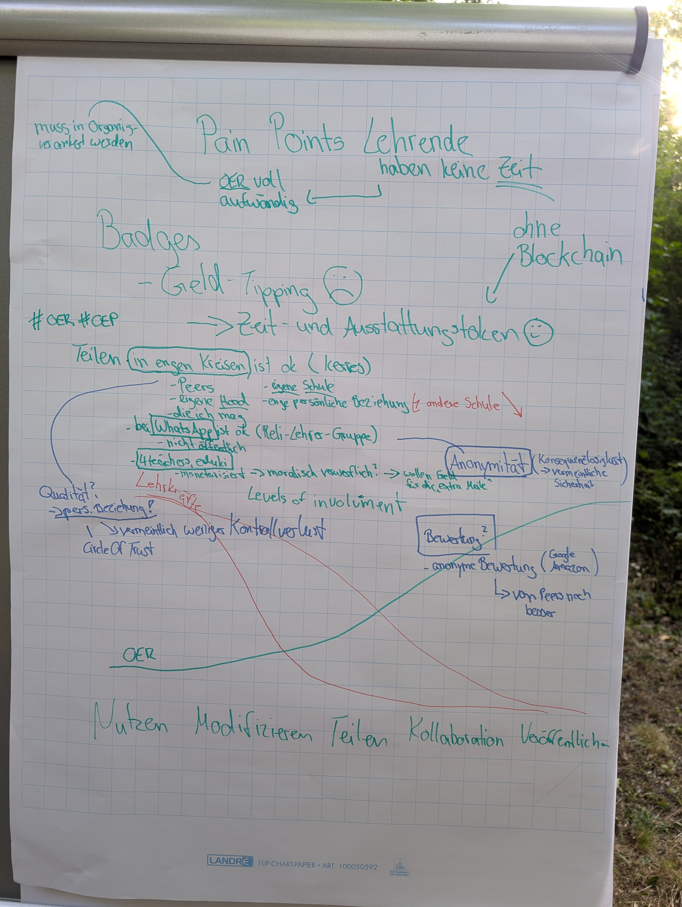
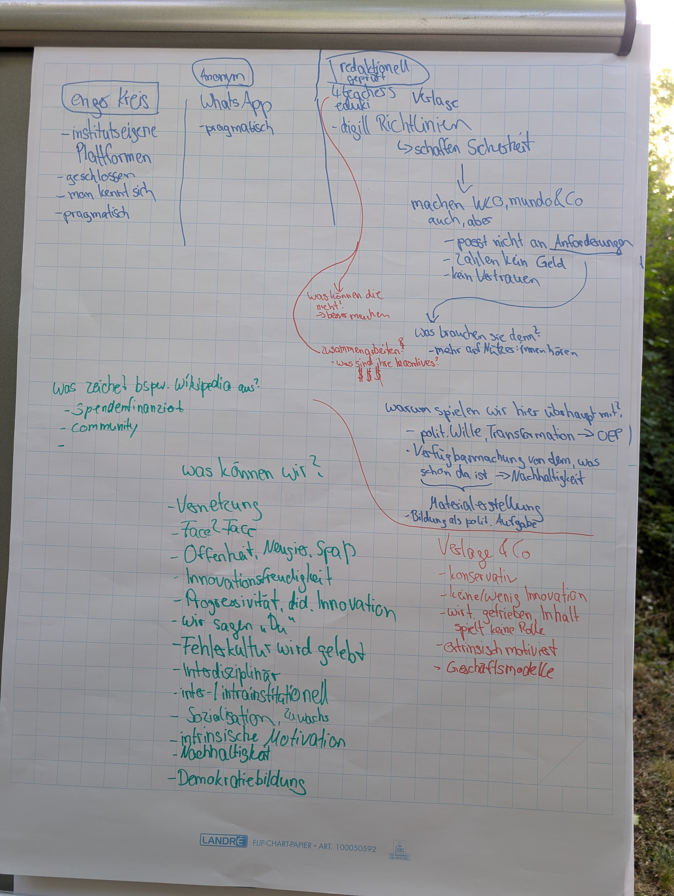
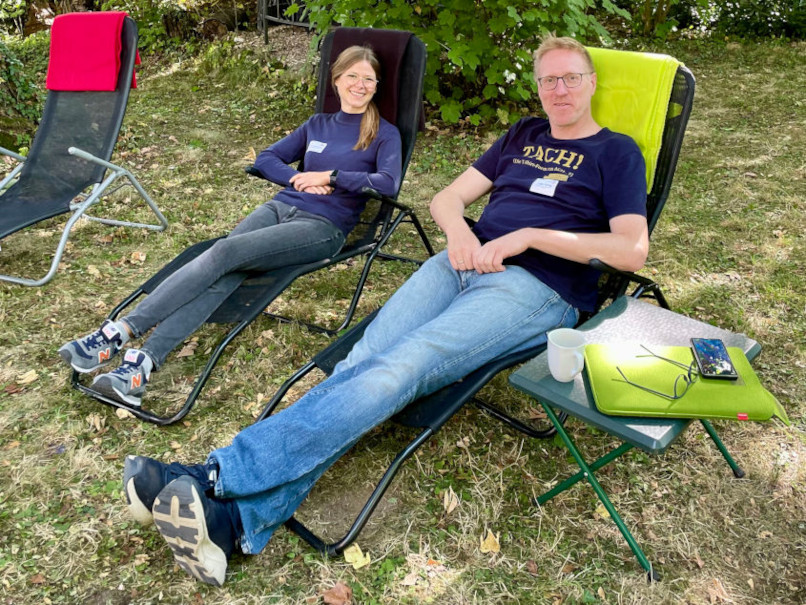
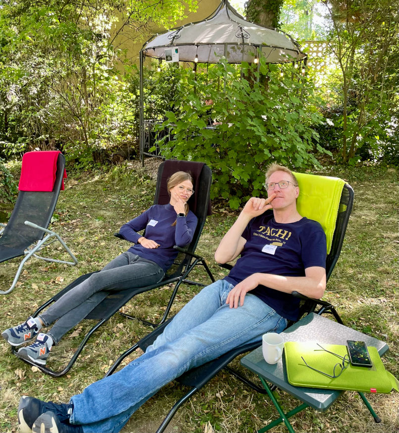
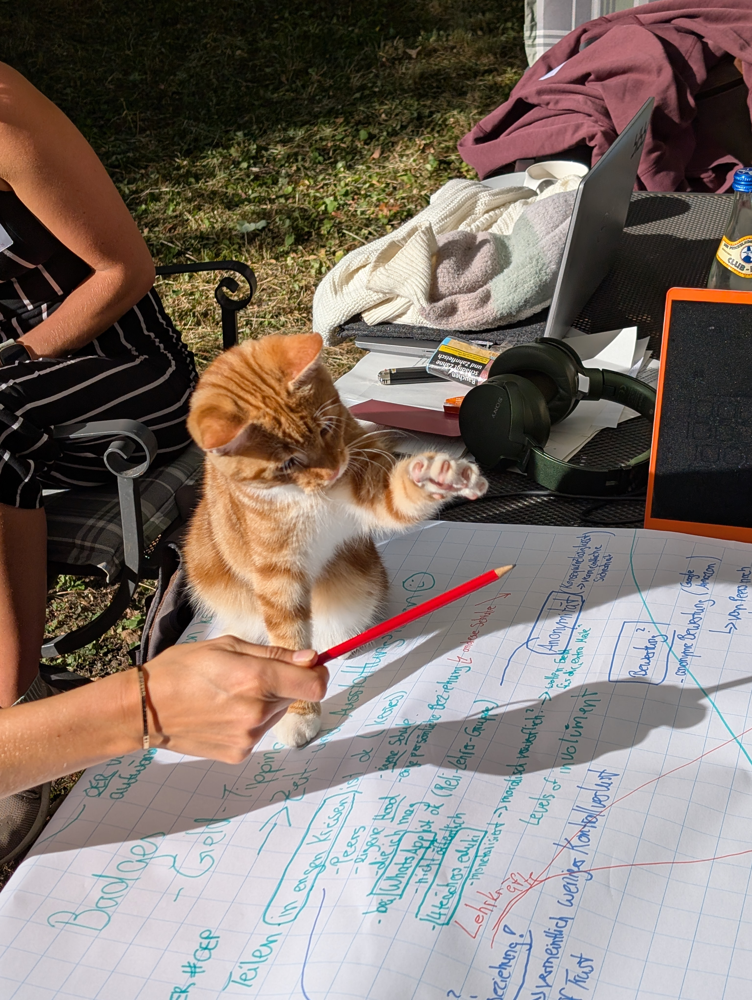

---
#commonMetadata:
'@context': https://schema.org/
type: LearningResource
id: https://oer.community/oer-it-sommercamp-2025
name: 'HackathOERn goes OER/IT-Sommercamp in Weimar'
description: >-
  Vom 25.–27. August 2025 tüftelten Ludger & Gina vom FOERBICO-Team beim OER/IT-Sommercamp in Weimar gemeinsam mit IT-Profis, OER-Enthusiasten und Gestalter:innen an Ideen für OER- und OEP-förderliche Infrastrukturen.
inLanguage: de
license: https://creativecommons.org/licenses/by/4.0/
creator:
  - givenName: Gina
    familyName: Buchwald-Chassée
    type: Person
    affiliation:
      name: Comenius-Institut
      id: https://ror.org/025e8aw85
      type: Organization
  - givenName: Ludger
    familyName: Sicking
    type: Person
    affiliation:
      name: Comenius-Institut
      id: https://ror.org/025e8aw85
      type: Organization
about:
  - https://w3id.org/kim/hochschulfaechersystematik/n0
image: https://oer.community/oer-it-sommercamp-2025/IMG_1664.jpg
learningResourceType:
  - https://w3id.org/kim/hcrt/text
educationalLevel:
  - https://w3id.org/kim/educationalLevel/level_A
datePublished: '2025-08-31'
#staticSiteGenerator:
author:
  - Gina Buchwald-Chassée
  - Ludger Sicking
title: 'HackathOERn goes OER/IT-Sommercamp in Weimar'
cover:
  relative: true
  image: IMG_1664.jpg
summary: >-
  Vom 25.–27. August 2025 tüftelten Ludger & Gina vom FOERBICO-Team beim OER/IT-Sommercamp in der Goethe-Stadt Weimar gemeinsam mit vielen weiteren IT-Profis, OER-Enthusiasten und Gestalter:innen an Ideen, Lösungsansätzen und Konzepten für OER- und OEP-förderliche Infrastrukturen. Bereits letztes Jahr waren wir mit dabei (siehe [Blogbeitrag](https://oer.community/einblicke-zum-oer-it-sommercamp-its-jointly-2024/)) und wollten uns das Event auch dieses Mal nicht entgehen lassen!
url: hackathoern
tags:
  - Vernetzung
  - Open Educational Resources (OER)
  - Infrastruktur
  - Edufeed
  - Nostr
  - interoperabel
  - Digitalisierung
---

## Pre-Event zum OER-/IT-Sommercamp 🤝

Bereits am 11. August fand ein erstes virtuelles Vernetzungstreffen zum Kennenlernen und einer ersten Vorstellung von Ideen statt.

### Die ersten Ideen als Impulse 💡

- EduFeed: Plattformübergreifende Kollaboraton mit Nostr - Kuratierung & Austausch von OER-Inhalten
- KI-Infrastrukturen und API-Austausch in vernetzten OER-Infrastrukturen 
- Themenseiten: Bausteine für die Zukunft: modulare Lösungen für OER-Redaktionen
- Metadaten-Mapping und Generierung in vernetzten OER-Infrastrukturen 
- Synchrone Kollaboration von Editoren
- Open-Source-Chatbot zur Stärkung der Auffindbarkeit, Zugänglichkeit und Nutzung von OER
- Das Klexikon im KI-Zeitalter – smarter Anschluss an Bildungsplattformen und Schulclouds
- OER-Celebration - Gratulations-Feature beim erfolgreichen Hochladen eines OERs
- Und von uns aus dem FOERBICO-Projekt noch spontan eingebracht: Matrix - Einführung in das Open Source Kommunikations-Tool der OER-Community

Slides zu den Ideenpitches findet ihr [hier](https://drive.google.com/drive/folders/1W4izKiS2GEoHvvV-lsyF8rkf__WbkoJJ). 

## Startschuss: Tag 1 beim Sommercamp 🚀

Los ging es mit einem ersten Ankommen und einer kleinen Vorstellungsrunde zum gegenseitigen Kennenlernen. Anschließend wurden die verschiedenen Ideen nochmal kurz gepitcht, damit man sich je nach Interesse der jeweiligen Workshops zu den Ideen zuordnen konnte. 

Eine Übersicht der Workshops findet ihr [hier](https://drive.google.com/drive/folders/1frMVJzUQPevLTRHoptXI_fO-y0DBY60N).

Wir vom FOERBICO-Team waren vorwiegend beim Edufeed-Workshop, um mit weiteren Interessierten weiter an der Idee einer dezentralen Bildungsinfrastruktur zu denken. Dazu haben wir zunächst überlegt, wo das Teilen von Bildungsmaterialien schon funktioniert und sind zu folgenden Ergebnissen gekommen:

1. Im vertrauten Umfeld (Peer-to-Peer), z.B. im Rahmen von Fachcommunities bzw. mit konkreten Leuten, die ich kenne.
2. Anonym in großen geschlossenen Gruppen, z.B. in WhatsApp-Gruppen, wo ich unkompliziert Links einstellen kann und keine Angst vor Konsequenzen haben muss.
3. Redaktionell geprüft bzw. mit Geschäftsmodell im Hintergrund, da man darauf vertraut, dass Inhalte geprüft wurden und qualitativ hochwertig sind, da ich ja dafür bezahle oder wie bei Plattformen wie eduki monetäre Wertschätzung erfahre, wenn ich Materialien dort einstelle.

Darauf aufbauend haben wir überlegt, wie wir mit unseren OER-Plattformen mithalten können oder wollen. Unser Fazit: Da kein Business-Modell dahinter steht, spielen wir vielfach in einer anderen Liga und können in punkto Marketing etc. nicht unbedingt mithalten. Danach sind wir der Frage nachgegangen, was denn die OER-Community stark macht/auszeichnet. Hier die losen Ergebnisse:

Highlights des Abends: Burger-Grillabend und der große Auftritt der OER-Band 🍔🎶

## Tag 2: Weiteres Happy Hacking 👨‍💻

Am nächsten Tag haben wir nach einer ersten Runde Lightning-Talks im Edufeed-Workshop von Steffen Rörtgen eine Einführung in das Nostr-Protokoll erhalten. Mit dem offenen Social Media Protokoll ist es möglich, Materialien/Inhalte über Relays quasi als Datenbanken vergleichbar mit E-Mailservern plattformübergreifend verfügbar zu machen und an verschiedenen Orten abzulegen, um sie nachhaltig zu sichern, falls eine Plattform ausfallen sollte. Doch die Grundidee und das Protokoll sind gerade für Nicht-Techies komplex und nicht selbsterklärend. Wir brauchen eine Geschichte, um die Idee einer Nostr-basierten OER-Infrastruktur den unterschiedlichen Stakeholdern, z.B. Entscheider:innen, Plattformbetreiber:innen, OER-Ersteller:innen etc. erklären zu können. Kein leichtes Unterfangen, wie wir in der Gruppe festgestellt haben - die Köpfe waren auf jeden Fall ordentlich am Rauchen 🤔🤯

Kreative Denkpausen, Fun-Time und (informeller) Austausch durften daher auch nicht zu kurz kommen!

## Finale an Tag 3: Abschlusspräsentationen der Projekte🎤

Der letzte Tag startete wieder mit spannenden Lightnins-Talks! Alle Präsentationen der Lightning-Talks findet ihr [hier](https://drive.google.com/drive/folders/1h8wMCIcYOSS4vXD-t7aUONM8rj9uokQ1). Dann ging es weiter in die Vorbereitung der Abschlusspräsentation und wie das immer so ist, ging die Zeit doch schneller rum, als man denkt. Wir haben uns als Story überlegt, Maxi Muster als Lehrkraft in den Fokus zu rücken und zu schauen, welche Probleme sie aktuell hat (wenig Zeit, findet keine passenden Materialien, Austauschbedarf...) und anhand dessen zu schauen, inwieweit Edufeed eine Lösung dieser "Pain Points" sein könnte. Außerdem haben wir gemeinsam mit dem Team von [edu-sharing](https://edu-sharing-network.org/) geschaut, wie Plattformbetreibende ins Boot geholt werden könnten und Nostr an bestehende Lösungen angedockt werden könnte. 

Die Ergebnisse der Workshops findet ihr [hier](https://drive.google.com/drive/folders/1uZA_X4-Ek3yjntFGf9uHuxQtiDU4jaJI).

Drei aufregende Tage gingen damit zu Ende und wir möchten uns riesig beim [HackathOERn-Team](https://edu-sharing-network.org/projekt-hackathoern/) für die tolle Organisation bedanken 🙏 Es war eine super Stimmung und wir freuen uns aufs nächste Jahr! 

### Was natürlich nicht fehlen darf: Cat Content 🐈

