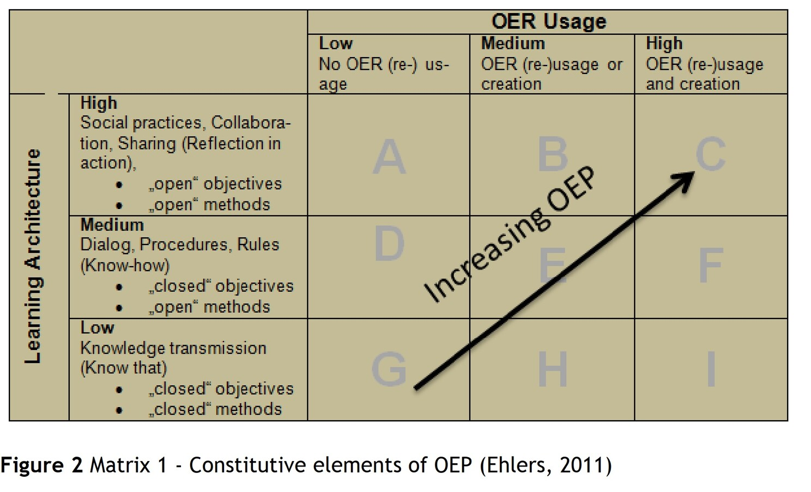

---

#commonMetadata:
'@context': https://schema.org/
creativeWorkStatus: Published
type: LearningResource
name: "Open Educational Practices - Von Ressourcen zu Praktiken"
description: >-
  Ein Rückblick von Ulf-Daniel Ehlers auf die Entstehung und Entwicklung von Open Educational Practices (OEP). Im Zentrum steht die Verschiebung des Diskurses von Open Educational Resources (OER) hin zu offenen Lehr- und Lernpraktiken, bei denen Partizipation, Ko-Kreation und didaktische Innovation entscheidend sind.
license: https://creativecommons.org/licenses/by/4.0/deed.de
id: https://oer.community/oep-von-ressourcen-zu-praktiken
creator:
  - givenName: Ehlers
    familyName: Ulf-Daniel
    id: https://orcid.org/0000-0003-1730-0256
    type: Person
    affiliation:
      name: Baden-Wuerttemberg Cooperative State University
      id: https://ror.org/02xdzy536
      type: Organization
inLanguage:
  - de
about:
  - https://w3id.org/kim/hochschulfaechersystematik/n052
  - https://w3id.org/kim/hochschulfaechersystematik/n079
image: https://oer.community/oep-von-ressourcen-zu-praktiken/oer-cube.jpg
learningResourceType:
  - https://w3id.org/kim/hcrt/text
  - https://w3id.org/kim/hcrt/web_page
educationalLevel:
  - https://w3id.org/kim/educationalLevel/level_A
datePublished: '2025-09-11'

#staticSiteGenerator:
author:
  - Prof. Dr. Ulf-Daniel Ehlers
title: 'Open Educational Practices - Von Ressourcen zu Praktiken'
cover:
  relative: true
  image: oer-cube.jpg
  caption: "Symbolbild: Der Würfel aus Bildern symbolisiert die Vielfalt offener Bildungsressourcen (OER) und die Vernetzung in Open Educational Practices (OEP) - frei kombinierbar, zugänglich und gemeinschaftlich gestaltbar"
  alt: "Ein 3D-Bild eines schwarzen Würfels, dessen Flächen aus vielen rechteckigen Screens bestehen. Auf jedem Screen ist ein Foto oder Bild dargestellt, z. B. Landschaften, Architektur, Tiere, Kunstwerke, Symbole und Objekte in kräftigen Farben. Der Würfel ist leicht gedreht im Raum schwebend, mit blauer Hintergrundbeleuchtung, sodass er futuristisch und modern wirkt. Der Stil soll fotorealistisch und detailreich sein, wie eine digitale Collage aus kleinen Monitoren."
  hiddenInSingle: true
summary: |
  Ein Rückblick von Ulf-Daniel Ehlers auf die Entstehung und Entwicklung von Open Educational Practices (OEP). Im Zentrum steht die Verschiebung des Diskurses von Open Educational Resources (OER) hin zu offenen Lehr- und Lernpraktiken, bei denen Partizipation, Ko-Kreation und didaktische Innovation entscheidend sind.
url: oep-von-ressourcen-zu-praktiken
tags:
  - Open Educational Resources (OER)
  - Open Educational Practices (OEP)

---

CC BY [Prof. Dr. Ulf-Daniel Ehlers (NextEducation)](https://next-education.org/de/team/meet-the-team/prof-dr-ulf-daniel-ehlers/)

Es ist nun mehr als anderthalb Jahrzehnte her, dass ich als (damals) junger Wissenschaftler an der europäischen OPAL-Initiative mitwirken durfte. Damals begann die internationale Debatte, den Fokus von Open Educational Resources (OER) auf die pädagogischen Praktiken selbst zu lenken (Open Pedagogy). Rückblickend sehe ich mich heute fast in einer Art "Gedächtnis" dieser Entwicklungen – wissend, dass vieles, was damals grundgelegt wurde, heute in den aktuellen Diskussionen wiederkehrt. Interessant ist dabei auch der Blick nach Österreich: Kolleg:innen rund um Sandra Schön und Martin Ebner u.a. entwickelten in Projekten wie **OLCOS (Open eLearning Content Observatory Services, 2006–2007)** Impulse, die den europäischen Diskurs stark prägten. OLCOS stellte früh heraus, dass die eigentliche Innovation in der offenen Didaktik liegt, nicht allein in der Produktion freier Materialien (Geser, 2007). Diese Spur griffen wir in OPAL (Open Educational Quality Initiative, 2010–2011) auf und führten sie weiter – und damit entstand das, was wir heute als **Open Educational Practices (OEP)** diskutieren.

### Von OER zu OEP: Unsere Definition (Ehlers 2010/2011)

Unsere Definition von OEP entstand um 2010/2011 in der Arbeit mit OPAL: **„Praktiken, die die (Wieder-)Verwendung und Produktion von OER durch institutionelle Richtlinien unterstützen, innovative pädagogische Modelle fördern und Lernende als Mitgestalter auf ihrem lebenslangen Lernweg respektieren und stärken“** (Ehlers, 2011, zit. in Wikipedia, 2024; EduTechWiki, 2024).

Das Entscheidende war: Qualität ergibt sich nicht aus der Ressource selbst, sondern aus der Art und Weise, wie sie in den Lernprozess eingebettet wird. OEP betont daher die **Beteiligung aller Akteure**, den **Prozess der Ko-Kreation** und die **didaktische Innovation**. Dieser Perspektivwechsel verschob die Debatte weg von der reinen Materialproduktion hin zu einem Verständnis von Bildung als gestaltendem Miteinander.

### Die Qualitätsdebatte im OER-Bereich

In den frühen 2010er Jahren dominierten Qualitätsdiskussionen, die Lernmaterialien selbst bewerten wollten – anhand von Checklisten, Zertifikaten oder Metadaten. Doch diese Sichtweise erwies sich als unzureichend: Qualität ist kein statisches Merkmal eines Dokuments, sondern entsteht im **Kontext seiner Nutzung** – in den Interaktionen zwischen Lehrenden, Lernenden und den eingesetzten OER (Ehlers, 2011; Ehlers, 2018).

Die zentrale Einsicht: Offenheit und Partizipation im praktischen Einsatz entscheiden über Lernerfolg und Bildungsinnovation. Qualität ist dynamisch, relational und praxisgebunden – nicht auf Papier zu fixieren, sondern nur im pädagogischen Handeln erlebbar.

### Augmentational Practices: Ein neuer Qualitätsbegriff

Im Rahmen der OPAL-Initiative diskutierten wir damals, dass es für pädagogische Praxis, die OER nutzt eigentlich so etwas wie eine Kennzeichnung der Offenheit geben müsse, etwas was man vielleicht als **„Augmentational Practices“** bezeichnen könnte, ein Begriff, der sich aber nie durchsetzte. Damit wollten wir verdeutlichen, dass die Qualität von OER nicht im Material selbst liegt, sondern in der kreativen, kontextbezogenen **Anreicherung durch Lehrende und Lernende -** eben den **Open Educational Practices**. Das offene Lehr-Lern-Szenario – und die Art, wie Ressourcen dort integriert, adaptiert und erweitert werden – ist die eigentliche Quelle für Bildungsinnovation (Ehlers, 2011).

Dieser Gedanke war ein Bruch mit der Vorstellung, Qualität sei messbar wie bei einem standardisierten Produkt. Stattdessen wurde klar: Qualität „emergiert“ aus Praxis – aus dem offenen, kooperativen Umgang mit Wissen.

### Die Dimensionen offener Bildungspraktiken

Um OEP analytisch fassbar zu machen, haben wir damals ein Modell mit **zwei Grunddimensionen** entwickelt (Ehlers, 2011):

1.  **Nutzung von OER** – in 3 Stufen von geringer bis intensiver Einsatz offener Ressourcen.
2.  **Gestaltung der Lernarchitektur** – in 3 Stufen von geschlossenen hin zu offenen, partizipativen und kollaborativen Lernsettings.

Je stärker beide Dimensionen ausgeprägt sind, desto größer wird die Offenheit in Lehr- und Lernpraktiken. Auf dieser Basis lassen sich weitere Handlungsfelder identifizieren: institutionelle Regelungen, Lehrinnovationen, Lernendenpartizipation und offene Kulturen des Teilens (Ehlers, 2018; Conole & Ehlers, 2010).

OEP ist also nicht nur eine didaktische Technik, sondern ein **ganzheitlicher Ansatz**: Wissen, Einstellungen und Fähigkeiten verbinden sich zu einer offenen Lernkultur.

  

### Vergleichende Modelle: Cronin, Hegarty, UNESCO

Die Begriffsbildung ging international weiter. So hat **Catherine Cronin (2017)** OEP als kollaborative Praktiken beschrieben, die nicht nur OER einbeziehen, sondern auch soziale Netzwerke, Peer-Learning und Empowerment betonen. **Judith Hegarty** wiederum definierte offene Pädagogik über acht Eigenschaften, von Kreativität über Kooperation bis hin zu Reflexion (Hegarty, 2015).

UNESCO und David Wiley rückten stärker die **5R-Freiheiten** (Retain, Reuse, Revise, Remix, Redistribute) in den Mittelpunkt – allerdings immer eingebettet in eine offene, partizipative Kultur (Wiley, 2014).

So zeigt sich: OEP ist ein **Schirmbegriff**, unter dem unterschiedliche Modelle – ressourcenorientiert, sozial-kollaborativ oder strategisch – koexistieren. Der gemeinsame Nenner ist die enge Verbindung von Offenheit, Partizipation und Bildungsinnovation.

* * *

### Wirkungen und aktuelle Debatte

Die Wirkungen von OEP sind je nach Modell unterschiedlich:

-   Nach **Ehlers** steht die Innovationskraft im Unterricht und die Aktivierung von Lehrenden und Lernenden im Vordergrund.
-   Bei **Cronin** und **UNESCO** geht es stärker um soziale Teilhabe, Empowerment und Bildungsgerechtigkeit.
-   Strategische Ansätze wiederum fördern Communities of Practice und nachhaltige Kompetenzentwicklung (Bundesministerium für Bildung, 2023).

Heute – 15 bis 17 Jahre nach den ersten OEP-Debatten – rückt die Diskussion wieder verstärkt auf die Praxis: Wie können Lehrende und Lernende Ressourcen schaffen, teilen, anpassen und gemeinsam nutzen? Welche Kompetenzen – Offenheit, Kollaboration, Reflexion – sind nötig, damit Materialien überhaupt erst ihren Wert entfalten (NextEducation, 2018)?

Der rote Faden bleibt: Qualität entsteht nicht durch Dinge, sondern durch **Praxis**.

* * *

### Persönliches Fazit

Wenn ich heute auf die frühen 2010er zurückblicke, sehe ich mich als (damals) junger Wissenschaftler inmitten einer Debatte, die damals visionär erschien. Heute ist sie zum Mainstream geworden – und doch bleibt ihre Radikalität aktuell: **Open Education ist keine Frage der Ressourcen, sondern der Haltung.**

Ich empfinde es als Privileg, dass ich damals Impulse setzen durfte, die heute in internationalen Diskursen weiterleben. OEP erinnert uns daran, dass Bildung eine soziale Praxis ist – offen, kollaborativ und stets in Bewegung.

  

### Literatur

Conole, G., & Ehlers, U.-D. (2010). _Open Educational Practices: Unleashing the power of OER_. OPAL Project. [http://qualityresources.pbworks.com/w/file/fetch/64788227/OPAL-paper-ehlers.doc](http://qualityresources.pbworks.com/w/file/fetch/64788227/OPAL-paper-ehlers.doc)

Cronin, C. (2017). Openness and praxis: Exploring the use of open educational practices in higher education. _The International Review of Research in Open and Distributed Learning, 18_(5), 15–34. [https://doi.org/10.19173/irrodl.v18i5.3096](https://doi.org/10.19173/irrodl.v18i5.3096)

Ehlers, U.-D. (2011). Extending the territory: From open educational resources to open educational practices. In _Journal of Open Education_. [https://www.academia.edu/35107201](https://www.academia.edu/35107201)

Ehlers, U.-D. (2018). Qualität von Open Education, Open Educational Practices und Open Educational Resources. [https://ulf-ehlers.de/uncategorized/qualitat-von-open-education-open-educational-practices-und-open-educational-resources/](https://ulf-ehlers.de/uncategorized/qualitat-von-open-education-open-educational-practices-und-open-educational-resources/)

Geser, G. (2007). _Open educational practices and resources: OLCOS Roadmap 2012_. Salzburg Research, EduMedia Group. [http://www.olcos.org](http://www.olcos.org/)

Hegarty, J. (2015). Attributes of open pedagogy: A model for using open educational resources. _Educational Technology, 55_(4), 3–13.

NextEducation. (2018). Publications. [https://next-education.org/en/publications/2018/prof-dr-ulf-daniel-ehlers/](https://next-education.org/en/publications/2018/prof-dr-ulf-daniel-ehlers/)

Wiley, D. (2014). The access compromise and the 5th R. _Iterating toward openness_. [https://opencontent.org/blog/](https://opencontent.org/blog/)

Wikipedia. (2024). _Open educational practices_. [https://en.wikipedia.org/wiki/Open\_educational\_practices](https://en.wikipedia.org/wiki/Open_educational_practices)

