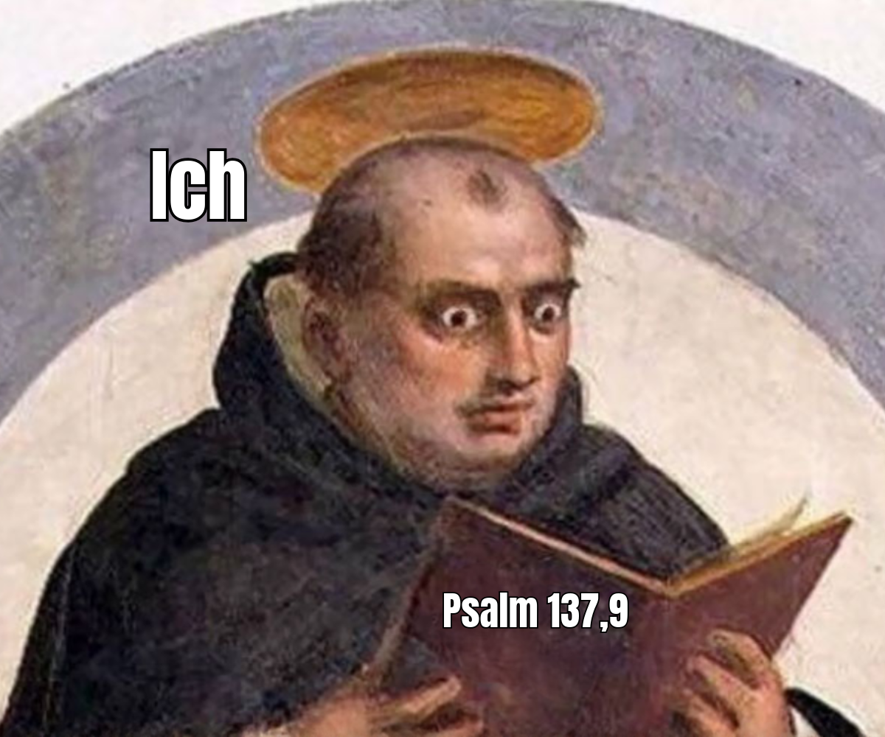
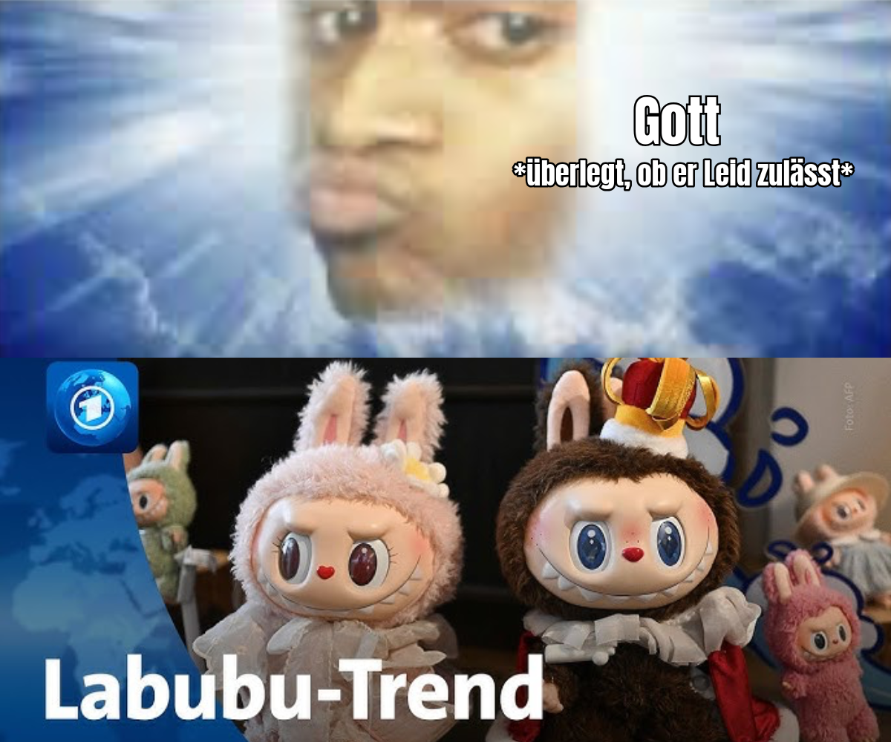

---
#commonMetadata:
'@context': https://schema.org/
type: LearningResource
id: https://oer.community/theologie-memes
name: 'Theologie trifft TikTok: Wie Memes eine neue Stimme für Glaubensfragen schaffen'
description: >-
  An der Uni Vechta wird vom Lehrstuhl Katholische Theologie erprobt, wie sich theologische Inhalte auf TikTok kreativ und humorvoll vermitteln lassen. Memes dienen dabei nicht nur zur Unterhaltung, sondern auch als didaktisches Werkzeug.
inLanguage: de
license: https://creativecommons.org/licenses/by/4.0/
creator:
  - givenName: Gina
    familyName: Buchwald-Chassée
    type: Person
    affiliation:
      name: Comenius-Institut
      id: https://ror.org/025e8aw85
      type: Organization
  - givenName: Corinna
    familyName: Ullmann
    type: Person
    affiliation:
      name: Comenius-Institut
      id: https://ror.org/025e8aw85
      type: Organization
  - givenName: Jonas
    familyName: Breuer
    type: Person
    affiliation:
      name: Universität Vechta
      id: https://ror.org/045y6d111
      type: Organization
about:
  - https://w3id.org/kim/hochschulfaechersystematik/n0
image: Social-Media-Logo-Uni-Vechta.jpg
learningResourceType:
  - https://w3id.org/kim/hcrt/text
educationalLevel:
  - https://w3id.org/kim/educationalLevel/level_A
datePublished: '2025-10-06'
#staticSiteGenerator:
author:
  - Gina Buchwald-Chassée
  - Corinna Ullmann
  - Jonas Breuer
title: 'Theologie trifft TikTok: Wie Memes eine neue Stimme für Glaubensfragen schaffen'
cover:
  relative: true
  image: Social-Media-Logo-Uni-Vechta.jpg
summary: >-
  Tanzvideos, Rezepte, Comedy – und jetzt auch Theologie? An der Universität Vechta wird ausprobiert, wie sich akademisch-theologische Inhalte auf TikTok kreativ und humorvoll vermitteln lassen. Memes spielen dabei eine Schlüsselrolle – sie sind nicht nur Unterhaltung, sondern auch didaktisches Werkzeug.
url: theologie-memes
tags:
  - Theologie
  - TikTok
  - Hochschuldidaktik
  - Hochschulen
---

Wer durch TikTok scrollt, denkt vermutlich nicht sofort an Glaubensfragen. Doch genau das wagt das Institut für Katholische Theologie an der Universität Vechta (IKT): Es bringt theologische Inhalte aus dem Seminarraum und vom Schreibtisch in die sozialen Medien – auf TikTok, Instagram und YouTube.
Der Account erreicht mit bisher ca. 25 Posts seit April jeden Monat bis zu 20.000 Menschen. Die Followerschaft ist hauptsächlich zwischen 18 und 40 Jahre alt – und die Rückmeldungen sind durchweg positiv.

Verantwortlich dafür ist Jonas Benedict Breuer, wissenschaftlicher Mitarbeiter und Social-Media-Manager. Unterstützt von zwei studentischen Hilfskräften entwickelt er Formate, die aktuelle religiös-theologische Phänomene wissenschaftlich aufbereiten und ins Social Web übersetzen – mal argumentativ, mal alltagspraktisch, mal augenzwinkernd.

👉 Hinweis: Die Katholische Theologie an der Universität Vechta wagt ein Experiment mit ihrem TikTok-Account @theologie.univechta

## Warum Social Media für Theologie?

Das erste Ziel der Social-Media-Arbeit des Instituts ist, Studieninteressierte für ein Studium der Katholischen Theologie an der Universität Vechta zu begeistern – sie dort ansprechen, wo sie einen Teil ihrer Freizeit verbringen und sich informieren. 

Bei der Analyse der Social-Media-Arbeit vergleichbarer Einrichtungen im Vorfeld des Strategieworkshops fiel außerdem auf, dass universitäre Institutionen vor allem auf TikTok unterrepräsentiert sind. Zum Vergleich: Auf TikTok ist neben dem IKT Vechta bislang nur die Theologische Fakultät der Universität Wien aktiv, akademische Stimmen aus der Theologie sind selten. Wissenschaftlich fundierte Produktionen wie Info-Posts, diskursive Videos oder Rezensionen von Aufsätzen, die eigens auf Soziale Medien zugeschnitten sind, sind insgesamt in Social Media deutlich seltener zu finden als Veranstaltungsrückblicke und Einladungen zu Ringvorlesungen, die die eigene Community bedienen. 

Teil der Social-Media-Strategie des IKT ist deshalb, Soziale Medien nicht nur als wichtigen Baustein der Akquise von Studierenden zu sehen, sondern Theologie ,,im Feld’’ zu zeigen, vielleicht sogar Debatten im Social Web wahrnehmbar mitzugestalten, wo es Stimmen aus der Wissenschaft braucht. Und zwar in einer Weise, die daran anschließt, wie diese Debatten schon geführt werden: durch Kurzvideos, in einer erkennbaren Handschrift, mit Memes, ohne die Differenzierung auf der Sachebene zu vernachlässigen. Universitäre Theologie soll nicht nur im Seminarraum oder innerhalb der Scientific Community vermittelt werden. Sie wird in ihrer Vielfalt außerhalb gebraucht und dazu gehören auch Instagram, TikTok, Youtube! Natürlich gibt es vielfältige theologische Inhalte auf Social Media, die von häufig kirchlich verorteten Creator:innen erstellt werden, die sich teilweise in Netzwerken organisieren. Vergleichbares gibt es im universitären Bereich allerdings nicht.

## Memes als Türöffner: Humor mit Tiefgang

Herzstück vieler Clips sind Memes. Mit bekannten Bildern aus der Internetkultur werden theologische Pointen gesetzt. Nicht nur werden abstrakte Sachverhalte (ein Champagner trinkender Leonardo di Caprio in seiner Rolle als Jay Gatsby stellt augenzwinkernd die Theologie als Wissenschaft dar oder Pettersson und Findus beim Torteessen im Garten illustrieren das Gottesreich) durch die Bilder darstellbar, die popkulturellen Anspielungen fügen ihnen eine Symbolebene hinzu und machen sie zugänglich. Treffen Sie den Humor der Zuschauer:innen, machen sie die theologischen Inhalte insgesamt anschlussfähiger. 

## Memes als didaktisches Werkzeug

Memes in ihrer Bildsprache sind mehr als Beiwerk: Sie können didaktisch eingesetzt werden. Sie komprimieren komplexe Inhalte in ein leicht zugängliches Format, sie erzeugen Humor und Resonanz – und verknüpfen theologische Sprache mit Alltagskultur.
So entsteht ein digitales Storytelling, das Emotionen weckt, Neugier erzeugt und den Zugang zu abstrakten Fragen erleichtert, ohne die Sachebene aufzugeben.

## TikTok: Herausforderungen & Chancen für Institutionen

Die Plattform-Realität stellt eigene Regeln auf: TikTok ist schnelllebiger als Instagram, Clips müssen kurz und prägnant sein. Während Community-Pflege auf Instagram gelingt, ist Bindung auf TikTok und YouTube schwieriger – die Aufmerksamkeitsspanne ist geringer, der Konsumdruck höher.

Gerade die jüngere Generation nutzt soziale Plattformen als virtuelle Bibliothek und Dopamintankstelle. Für die Theologie bedeutet das: Inhalte müssen so produziert und erzählt werden, dass sie möglichst lange angesehen werden und dadurch mehr Reichweite gewinnen.

Aus didaktischer Perspektive heißt das: Reduktion mit Substanz. Theologische Inhalte sollten auf ihre Kernaussagen verdichtet, zugleich aber mit Quellen und Kontext versehen werden. Herausfordernd bleibt der hohe Arbeitsaufwand.

Beispiel Theo-Grundkurs: Pro Video muss viel Arbeit vor allem für eine solide wissenschaftliche Recherche, die Texterstellung und die Bilder-Suche aufgewendet werden. Hinzu kommt das Schneiden und Einsprechen. Je nach Thema braucht es für eine mehrteilige Folge mehrere dutzend Arbeitsstunden. Und das, obwohl ein einzelnes Video mit maximal 400 Wörter auskommen muss, weil es sonst zu lang ist, nicht ganz angesehen und deshalb weniger ausgespielt wird. Unter jedem Video werden Quellenangaben in die Kommentare gepostet. Das hat neben der Frage von Nutzungsrechten für Bilder auch damit zu tun, dass Interessierte mit den Videos weiterarbeiten können sollen. Wenn möglich, werden die theologischen Autor:innen und ihre Institutionen auf Instagram hinter der bibliographischen Angabe ihres Werkes verlinkt – auch das gehört zur Wissenschaftsvermittlung. Hinzu kommt die Notwendigkeit von Absprachen und Freigaben im universitären Kontext.

Auch in der Hochschul-Community gibt es Vorbehalte: die Angst, in die „Katzenvideo-Ecke“ gestellt zu werden oder Inhalte zu stark zu vereinfachen. Doch die bisherigen Erfahrungen zeigen: Humorvolle, pointierte Formate finden Anerkennung, wenn sie wissenschaftlich sauber herausgearbeitet sind.

Gleichzeitig bietet Social Media die Chance, da präsent zu sein, wo zentrale Debatten stattfinden: zu Demokratie, Konsum als Religion oder Menschsein im Digitalen. Breuer bringt es auf den Punkt: „Theologie darf als Wissenschaft auf Social Media auch humorvoll sein, ohne Tiefe zu verlieren. Aber sie muss ihre Stimme erheben, gerade dort, wo Diskurse stattfinden.“ 

Neue Formate sind geplant: Follow me around, Professor:innen kennenlernen, Booktalks – vielleicht irgendwann auch „A Day in the Life of a Prof“. Wichtig ist, die Arbeit realistisch in den Uni-Alltag zu integrieren.

## Didaktischer Ausblick: TikTok-Videos als Lernprodukte im Seminar?

Die Arbeit mit Social Media eröffnet nicht nur neue Wege der Wissenschaftskommunikation nach außen – sie kann auch innerhalb der Lehre produktiv gemacht werden.

TikTok-Videos oder Memes verstehen sich als Lernprodukte, die Studierende im Seminar selbst entwickeln können.

### Das bietet mehrere Chancen:

- Aktive Aneignung: Studierende müssen theologische Inhalte so verdichten, dass sie in 60 Sekunden oder einem Bild verständlich bleiben. Das zwingt dazu, Kernthesen herauszuarbeiten.

- Transferleistung: Komplexe theologische Konzepte (z. B. „Reich Gottes“, „Erlösung“, „Schöpfung“) werden in eine Alltagssprache und Bildwelt übertragen – ein kreativer Brückenschlag zwischen Theorie und Lebenswelt.

- Medienkompetenz: Studierende lernen, mit Bildrechten, Quellenangaben und Plattformlogiken umzugehen – Fähigkeiten, die über das Studium hinaus wichtig sind.

- Reflexion: Die Grenzen des Formats werden sichtbar. Nicht alles passt in 400 Zeichen oder 60 Sekunden. Gerade im Vergleich mit klassischen Hausarbeiten oder Referaten entsteht so ein didaktischer Mehrwert: Welche Tiefe geht verloren, welche Anschlussfähigkeit wird gewonnen?

### Konkret könnte eine Lernaufgabe lauten:

„Erstellen Sie ein 60-Sekunden-Video, in dem Sie ein theologisches Konzept in einer für TikTok typischen Form erklären. Begründen Sie anschließend schriftlich, welche Entscheidungen Sie getroffen haben, welche Vereinfachungen notwendig waren und wie Sie mit Quellen umgegangen sind.“

So werden digitale Formate nicht zum Selbstzweck, sondern zu einem Reflexionsinstrument: Sie fordern eine präzise, kreative Auseinandersetzung mit Inhalten – und verknüpfen theologische Wissenschaft mit den Kommunikationsweisen einer jungen Generation.

Hier konkrete Meme-Beispiele aus dem IKT der Universität Vechta, um theologische Inhalte zu vermitteln:

Copyright: Katholische Theologie der Universität Vechta

Copyright: Katholische Theologie der Universität Vechta

Copyright: Katholische Theologie der Universität Vechta

**Blick nach vorn: Storytelling als didaktisches Labor**

Solche Konzepte machen deutlich: Theologie wird nicht nur gelehrt, sie wird gelebt – und digitale Medien können diesen Prozess sichtbar machen. Dabei lassen sich zentrale didaktische Prinzipien ablesen, die auch für die Hochschullehre relevant sind:

- Komplexitätsreduktion: Inhalte müssen klar auf den Punkt gebracht werden, ohne ihre argumentative Tiefe zu verlieren.

- Visualisierung: Bilder, Memes und Clips sind demokratisierte Alltagsprodukte, die jede:r erstellen kann. Sie fungieren als Anker, die abstrakte Konzepte greifbar machen. 

- Emotionalisierung: Storytelling und der für Memes typische absurde Humor binden Aufmerksamkeit und schaffen Resonanzräume, die reine Textlektüre oft nicht eröffnen.

- Anschlussfähigkeit: Sprache und Formen werden gewählt, die an die Lebenswelt der Studierenden anschließen – ein Prinzip, das ebenso für Vorlesungen und Seminare gilt. Für die Meme-Erstellung heißt das: Die Referenz eines Bildes muss bei seiner Memefizierung entweder bekannt oder das Meme in Variationen in der Internetkultur schon etabliert sein, damit es keine Übersetzungsleistung braucht.

So wird Social Media zum didaktischen Labor: ein Ort, an dem erprobt wird, wie theologische Sprache in alltagsnahe Narrative übersetzt werden kann.

### Fazit: Theologie mutig ins Netz 

Erste Erfahrungen zeigen: Humorvolle Formate mit Memes erreichen viele und schaffen positive Resonanz.

Aber: Zeitaufwand und Ressourcen sind limitiert.

Was kann die Zukunft bringen? Mehr Kollaboration auch unter akademischen Institutionen, gegenseitige Unterstützung, und ein stärkeres Selbstbewusstsein, theologische Stimmen in Social Media einzubringen.

Theologie kann auf TikTok, Instagram und Co. Räume öffnen für Diskussionen und kritische Reflexion – genau dort, wo junge Menschen unterwegs sind.

Noch steht die Theologie in Vechta am Anfang ihres TikTok-Abenteuers. Doch schon jetzt wird deutlich: Mit Humor, Memes und einem klaren Gespür für die Plattform lassen sich theologische Inhalte erfolgreich platzieren.

Die entscheidende Frage ist also nicht mehr, ob (akademische) Theologie in soziale Medien gehört, sondern: Wie mutig trauen wir uns, dort eine eigene Stimme zu entwickeln?

👉 Beispiele gibt’s direkt auf den Social-Media-Kanälen der Theologie an der Uni Vechta:

- [YouTube-Kanal](https://youtube.com/@theologie.univechta?si=ekAYg_B6nivpMRli)
- [TikTok-Kanal](https://www.tiktok.com/@theologie.univechta)
- [Instagram-Kanal](https://www.instagram.com/theologie.univechta)