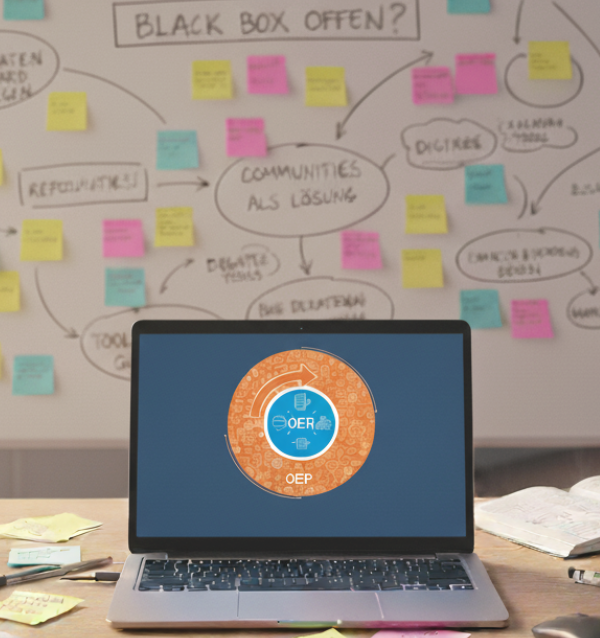

# Interview mit Daniel Otto

Auf unserer Zwischenfazittagung *Mit OER zu einer Kultur des Teilens* wird Prof. Dr. Daniel Otto die Keynote halten. Wir vom FOERBICO-Team konnten im Vorhinein ein Interview mit ihm durchführen. Zuerst wollen wir ihn euch, liebe Lesende, kurz vorstellen.

## Kurzvorstellung

Prof. Dr. Daniel Otto ist Professor für Mediendidaktik und digitale Bildung an der Europäischen Hochschule für Innovation und Perspektive in Backnang. Zu seinen Forschungsinteressen gehören unter anderem: E-Learning, Digital Storytelling, Open Educational Resources (OER) und gestaltungsorientierte Mediendidaktik. Er beschäftigt sich und veröffentlicht seit Mitte der 2010er Jahre zum Thema Offene Bildung und OER, darunter Otto, D. et al. (2021). Offen gemacht: Der Stand der internationalen evidenzbasierten Forschung zu Open Educational Resources (OER); Otto, D. (2022). Die Förderung von Open Educational Resources (OER) in der Hochschule und Bozkurt, A. et. al. (2023). Openness in Education as a Praxis: From Individual Testimonials to Collective Voices. Er ist Mitglied im OER-Beirat des Bundesministeriums für Bildung, Familie, Senioren, Frauen und Jugend (siehe https://www.oer-strategie.de/fortentwickeln/der-oer-beirat/). Zudem hielt Herr Otto die Keynote bei der OER im Blick-Tagung 2025.
Und wir als FOERBICO-Team freuen uns , mit ihm ein Interview in Vorbereitung der  Tagung zu führen.

## Interview
F: „Bildung ist keine Vorbereitung auf das Leben; Bildung ist das Leben selbst.“ – John Dewey.
Dieses Zitat steht über Ihrer Vita auf der Hochschulseite, wie würden Sie dieses Zitat auf OER und OEP beziehen?

O: Für mich steckt in diesem Zitat vor allem die Idee, dass Bildung kein abgeschlossener Prozess ist, sondern etwas, das wir ein Leben lang praktizieren. Wenn ich das auf OER und OEP beziehe, dann sehe ich eine ähnliche Logik: Lehr-Lernmaterialien und pädagogisches Handeln werden hier nicht als etwas Fertiges oder Starres konzipiert, sondern als etwas prinzipiell Veränderbares, Aushandelbares und Weiterentwickelbares. OER und OEP stehen damit für ein Verständnis von Bildung, in dem Menschen gemeinsam an Inhalten arbeiten, sie an neue Kontexte anpassen und Bildung als lebendigen, geteilten Prozess begreifen – ganz im Sinne von Deweys Idee, dass Bildung das Leben selbst ist.

F: Können Sie sich noch an Ihre erste Begegnung mit OER erinnern und uns davon erzählen?

O: Ich hatte damals gerade als Postdoktorand am Learning Lab der Universität Duisburg-Essen angefangen, als mir eine Kollegin das OERinfo-Projekt übertrug. Ehrlich gesagt konnte ich mit dem Konzept zu diesem Zeitpunkt noch nicht besonders viel anfangen. Rückblickend war das für mich als neugierigen empirischen Forscher aber eher ein Vorteil. Ich musste mich zunächst grundlegend fragen, was an OER und OEP überhaupt das Besondere sein soll. Und genau aus dieser Irritation heraus sind dann viele meiner späteren Forschungsfragen entstanden.

F: Was macht für Sie den Reiz von OER und OEP aus?

O: Mich reizt vor allem die ihnen inhärente Idee, dass Bildung anders gestaltet werden kann: kollaborativer, transparenter und stärker als gemeinschaftlicher Prozess. Es geht nicht nur darum, Materialien frei zugänglich zu machen, sondern darum, wie wir Lehren und Lernen organisieren. Wer darf mitgestalten, wie Wissen zirkuliert und welche Rolle öffentliche Güter im Bildungssystem spielen. Genau darin liegt für mich das große Potenzial, aber auch die Hürde. OER und OEP fordern etablierte Routinen, Rollenbilder und Geschäftsmodelle heraus; das macht sie attraktiv, aber erklärt auch, warum die Akzeptanz in vielen Bereichen noch begrenzt ist.

F: Was waren ihre größten “Aha-Momente” sowie ihre wichtigsten “Learnings” in Bezug auf OER und OEP?

O: Einer meiner wichtigsten Aha-Momente war die Einsicht, OER nicht nur als eine weitere digitale Ressource zu betrachten, sondern als eine Bildungstechnologie sui generis. OER sind für mich untrennbar mit einer Community-Logik und mit normativen Vorstellungen verknüpft. Es geht um Offenheit, um geteilte Verantwortung für Bildungsressourcen und um die Idee von Bildung als öffentliches Gut. Diese Verflechtung aus Technologie, Gemeinschaft und Normativität unterscheidet OER deutlich von vielen anderen medientechnischen Innovationen, die eher funktional oder effizienzorientiert diskutiert werden. Trotzdem kann sich auch OER diesen Anforderungen nicht ganz entziehen. 

F: Die OER-Strategie des Bundes fördert OER und OEP. Welche Entwicklungen oder Veränderungen nehmen Sie seither wahr?

O: Die OER-Strategie des Bundes lese ich zunächst als deutliches Signal: OER und OEP sind in der bildungspolitischen Landschaft angekommen und sollen perspektivisch nicht mehr Randthemen engagierter Einzelner bleiben. Gleichzeitig macht die Strategie für mich sichtbar, dass wir aus der gewachsenen OER-Community herausdenken müssen. Wenn OER und OEP dauerhaft Wirkung entfalten sollen, brauchen sie Anschluss an Curricula, Qualifizierungsstrukturen, technische Infrastrukturen und Governance-Fragen. Unsere Aufgabe wird es sein, die Anliegen von OER und OEP so zu formulieren, dass sie in den unterschiedlichen Bildungsbereichen anschlussfähig werden, ohne den normativen Kern preiszugeben.

F: Auf der Tagung OER im Blick 2025 in Jena betonten Sie, dass OER und OEP nachhaltige Haltungen fördern, während KI eher kurzfristige Skills adressiert. Welche Schritte müssen bei OER und OEP gemacht werden, damit diese sich nicht vor KI verstecken müssen, sondern ihren Mehrwert für die Bildung entfalten können?

O: Ich würde OER/OEP und KI nicht als Gegensätze inszenieren. Die rasante Entwicklung im Bereich generativer KI zwingt uns vielmehr, grundsätzliche Fragen zu stellen: Was verstehen wir unter Bildung, wenn Informationen jederzeit verfügbar und automatisiert generierbar sind? In meinem Vortrag habe ich versucht zu zeigen, dass OER und OEP hier ein wichtiges Fundament bilden. Sie rücken menschliche Kollaboration, geteilte Verantwortung und die öffentliche Aushandlung von Wissen in den Mittelpunkt. Vielleicht ist die Chance darin zu sehen, KI-Technologien so zu gestalten und zu regulieren, dass sie diese Prinzipien unterstützen, etwa indem OER zu einem Referenzpunkt für transparente, nachvollziehbare und überprüfbare Inhalte werden, anstatt Bildung auf kurzfristig verwertbare Skills zu reduzieren.

F: Herr Otto Sie halten die Keynote auf unserer Zwischenfazit-Tagung „Mit OER zu einer Kultur des Teilens“. Worauf können sich unsere Teilnehmenden hinsichtlich Ihrer Keynote freuen und was erhoffen Sie sich von unserer Tagung?

O: Ich möchte in meiner Keynote Impulse aus meiner Rolle als empirischer Bildungsforscher geben, der Entwicklungen kritisch hinterfragt. Dabei werde ich auch Ergebnisse einer gemeinsam mit Kolleg:innen durchgeführten Studie präsentieren. Zugleich bin ich aber davon überzeugt, dass OER und OEP zentrale Bausteine für eine zukunftsfähige Bildung sind.
Die Tagung verkörpert für mich genau das, was KI aktuell noch nicht leisten kann: den unmittelbaren zwischenmenschlichen Austausch, zufällige Begegnungen, kontroverse Diskussionen und – im Sinne von Biesta gedacht – auch die eine oder andere produktive Irritation. Wenn es uns gelingt, OER und OEP aus dieser Praxis heraus weiterzudenken, wäre für mich viel gewonnen.

Vielen Dank für Ihre Zeit. Wir freuen uns schon jetzt auf Ihre Keynote in Nürnberg.

Ihr möchtet diese Keynote auf keinen Fall verpassen? Dann seid am 24. & 25. Februar 2026 bei unserer Zwischenfazit-Tagung ‚Mit OER zu einer Kultur des Teilens‘ in Nürnberg dabei!

## Mit OER zu einer Kultur des Teilens

Unter diesem Titel steht unsere Tagung und darin sollen die Ergebnisse nicht nur diskutiert, sondern auf deren Grundlage dieser Überlegungen angestellt werden, wie die Arbeit an OER OEP fördern kann.
Wir laden herzlich dazu ein, einen Einblick in die Alltagsrealität von OER-Communities zu gewinnen und gegebenenfalls eigene Erfahrungen oder Forschungsbefunde beizusteuern:
Wie wird dort konkret zusammengearbeitet? Welche unterschiedlichen Formen von Communities existieren? Und welche Rolle spielen Institutionen wie Schulen oder Kirchen bei ihrer Entwicklung und Verstetigung?

Gemeinsam – und mit einer Haltung der Offenheit – möchten wir uns diesen Fragen nähern und das Phänomen OER-Community aus unterschiedlichen Blickwinkeln beleuchten. Wir wollen den Wünschen und Bedürfnissen der Communities Raum geben und gemeinsam überlegen, wie Hürden abgebaut werden können. Damit eine kollaborative Arbeit an OER noch stärker gefördert wird und OEP eine Grundlage für die Communities bildet.  

Anmeldemöglichkeit und das vorläufige Programm finden Sie hier: [.png)](https://www.evrel.phil.fau.de/foerbico-tagung-2026/)

Für Rückfragen wenden Sie sich gerne an Phillip Angelina: tagung-foerbico2026@fau.de. 
