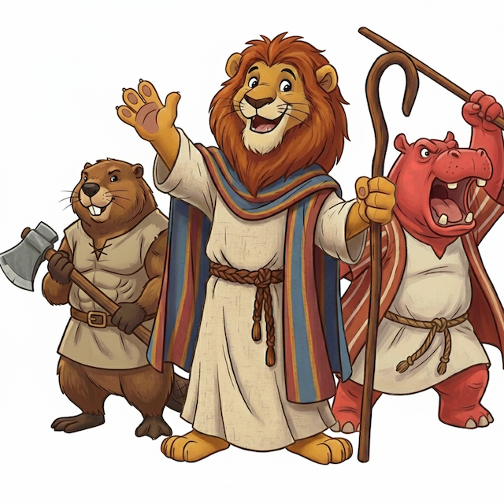

# Wenn der Löwe Schwierigkeiten bereitet

  *Bildquelle: Gemini* 

Es ist kurz vor Weihnachten, als ein Verlag ein Werk entdeckt, das eine vielversprechende Idee bietet und auf ein profitables Unterfangen hoffen lässt. Die Idee ist eine Kinderbibel, die im Stil von Disneyfilmen illustriert ist. Tiere nehmen darin die Rollen von Menschen ein. Die Promotion für dieses Buch ist in vollen Zügen, doch aufgrund von Kritik aus verschiedenen Richtungen sieht sich der Verlag gezwungen, das Werk zu depublizieren.

Das geschah im Dezember 2025 der Deutschen Bibelgesellschaft mit dem Werk "*Der Löwe von Juda*". In ihrer [Mitteilung](https://www.die-bibel.de/bibel-in-der-praxis/bibel-fuer-kinder/kinderbibelwelten/loewe-von-juda) zur Depublikation steht: 
> »Bestimmte Passagen zeigten sich als problematisch im Blick auf den jüdisch-christlichen Dialog. Dazu kam Kritik an der stereotypen Darstellung von Geschlechterrollen und der Visualisierung von Gewalt.« 

Dieser etwas längere Blogartikel widmet sich exemplarisch den hier genannten *problematischen Passagen* und zieht im Anschluss eine Zusammenfassung. Zudem werden Chancen in Hinblick für OER benannt. Wenn man nicht die längeren Ausführungen dieses Artikels lesen möchte, da diese auch in einem theologischen Diskurs stattfinden, findet im Folgenden eine kurze Zusammenfassung der Ergebnisse:
- Im Blick auf den jüdisch-christlichen Dialog ist vor allem die Bewertung des Gesetzes sowie die christliche Deutung der hebräischen Bibel problematisch. Denn das Gesetz wird als eine Last und nicht als eine Gnade dargestellt. Zudem wird die hebräische Bibel konsequent von Jesus Christus her gedeutet. Dies führt zu einer falschen Gegenüberstellung der hebräischen Bibel mit dem christlichen Neuen Testament.
- Die stereotype Darstellung der Geschlechter zeigt sich darin, dass Frauen, bzw. weiblich zu lesende Tiere, entweder als Verführerin oder als sorgende Mütter abgebildet wurden. Während die Männer meist muskulös, groß und kämpferisch illustriert wurden. Zudem wurden auch wichtige weibliche Figuren aus der hebräischen Bibel gar nicht erwähnt.
- Gewalt wird in "Der Löwe von Juda" durchgehend als etwas Heroisches dargestellt. Die guten Männer Gottes kämpfen kriegerisch gegen die Feinde der Hebräer bzw. Gott. Dabei wird die kritische Auseinandersetzung von Gewalt in der hebräischen Bibel nicht erwähnt.

## Ein kurzes Vorwort

Zur Veröffentlichung von "Der Löwe von Juda" wurde auf der Instagramseite der Deutschen Bibelgesellschaft vom Programmleiter folgendes Statement abgegeben:
> »Mit der Löwe von Juda schaffen wir einen neuen Zugang: liebevoll illustriert, verständlich erzählt, einzigartig gestaltet und zugleich bibeltheologisch verantwortet. Die Tierfiguren sind dabei mehr als ein gestalterisches Mittel: Sie sind Brücken zwischen der Welt der Kinder und der Welt der Bibel. Diese Darstellungen sind nicht willkürlich, sondern symbolisch aufgeladen und medienpädagogisch fundiert. Sie ermöglichen Kindern, sich mit den Figuren zu identifizieren, ohne durch kulturelle und soziale Merkmale ausgeschlossen zu werden.«

Dieses Zitat ist für die weiterführende Auseinandersetzung mit der Kinderbibel "Der Löwe von Juda" von besonderer Bedeutung, da bewusst Entscheidungen darüber getroffen wurden, welche Texte die Kinderbibel behandelt und welche nicht. Ebenso wurden Entscheidungen über das Aussehen der Tiere, ihre sprachliche Darstellung sowie über die Art der Illustration der Geschichten getroffen.

 Screenshot von Instagram

[Zum Instagram-Beitrag der Deutschen Bibelgesellschaft](https://www.instagram.com/p/DQB3hZZjKqV/)

## Das 'schwere' Gesetz

Die erste *Problematik* im Blick auf den jüdisch-christlichen Dialog zeigt sich beispielhaft an den Zehn Geboten.
Zu sehen ist ein Bild auf dem ein [Schafan](https://www.die-bibel.de/ressourcen/wibilex/altes-testament/schafan), der Klippdachs, durch die Kinderbibel führt. Schafan versucht zwei große steinerne Tafeln, auf den die Zehn Gebote geschrieben stehen, zu bewegen. Dabei sagt er: »Puh, das Gesetz ist furchtbar schwer!«. Hierbei wird eine Unterscheidung zwischen Gesetz und Evangelium, welche Luther stark machte, unreflektiert übernommen. Diese Unterscheidung stellt die hebräische Bibel und das Neue Testament dualistisch gegenüber und zudem wird das Gesetz als etwas Erdrückendes und nicht als etwas Wegweisendes dargestellt ([Boschki & Schlag 2016](https://doi.org/10.23768/wirelex.Gesetz_und_Evangelium_Evangelium_und_Thora.100171)). Das Aufzeigen von der Schwere des Gesetzes impliziert »falsche gnadentheologische Oppositionsfiguren« von Evangelium und Gesetz ([Hailer 2025](https://publikationen.uni-tuebingen.de/xmlui/handle/10900/164233)). Es wird bei ihrer Einführung impliziert, dass Menschen sich nicht daran halten könnten, da es so schwer sei.
> »Das Gesetz Gottes halten zu dürfen, das ist die Gnade der Erwählung, die das Judentum in seinen Festen feiert und die in das Leben der jüdischen Gemeinde ausstrahlt.« ([Evangelische Kirche in Deutschland 2015, 63](https://www.ekd.de/pm101_2015_grundlagentext_religioese_vielfalt.htm)). 

Jedoch wird das Gesetz in diesem Beispiel nicht als Gnade, sondern im Bild als Last beschrieben. Somit wird der Sinn der Tora stark verkürzt und der jüdische Glauben als eine Gesetzesreligion bzw. als eine Religion der Werkgerechtigkeit reduziert ([Boschki & Schlag 2016](https://doi.org/10.23768/wirelex.Gesetz_und_Evangelium_Evangelium_und_Thora.100171)).  
Die zweite *Problematik* liegt in der Christianisierung der hebräischen Texte. Theologische Grundlagenwerke wie beispielsweise Härles *Dogmatik*, Leonhardts *Grundinformationen Dogmatik* sowie Joest und Lüpkes *Dogmatik I* weisen alle auf einen wichtigen Aspekt hin: **Die hebräische Bibel, Altes Testament, hat ihre Autorität in sich**. 
 Jede Form der Gegenüberstellung der beiden biblischen Bücher oder auch christologische Deutungen der hebräischen Bibel sind konstruiert (Härle 2012, 124-127; Leonhardt 2009, 192; Joest & Lüpke, 71). Die Autoren des Neuen Testaments bauen zwar auf der hebräischen Bibel auf und deuten dies zum Teil auf Christus hin (Joest & Lüpke 2010, 67), in "Der Löwe von Juda" sieht man jedoch beim ersten [Pessach](https://www.religionen-entdecken.de/lexikon/p/pessach) ein Kreuz auf einer Tür gemalt, und somit wird das erste Pessach auf Christus hin gedeutet. Dabei wird die jüdische Tradition in ihrer Einzigartigkeit weder gesehen noch gewürdigt, sondern immer in einem bestimmten Heilsgeschehen als eine Vorstufe zum Christentum dargestellt. Im Neuen Testament selbst findet sich bereits die Spannung, dass die Texte der hebräischen Bibel unterschiedlich von den christlichen und jüdischen Gemeinden gedeutet wurden ([Evangelische Kirche in Deutschland 2015, 68](https://www.ekd.de/pm101_2015_grundlagentext_religioese_vielfalt.htm)). In der Geschichte führte dieser Gedanke zur Substitutionsthese, also, dass der Bund Gottes mit Israels aufgehoben wurde und die Kirche den Platz des jüdischen Volkes eingenommen hat. Dieses theologische Bild hat seine Mitverantwortung an [Pogromen](https://www.bpb.de/themen/antisemitismus/dossier-antisemitismus/was-heisst-antisemitismus/glossar-antisemitismus/559894/pogrom/) bis hin zur [Shoa](https://www.demokratiewebstatt.at/thema/thema-holocaust-shoah/shoah-holocaust-churban-was-ist-damit-gemeint) und wird explizit nach dem 2. Weltkrieg nicht mehr vertreten ([Evangelische Kirche in Deutschland 2002, 67f.](https://www.ekd.de/christen_und_juden_i_bis_iii.htm)):
 Das Herabwürdigen der Gesetze als „schwer" und das gemalte Kreuz beim ersten Pessach – als implizite Vorbereitung auf einen Erlöser, der in Jesus Christus erscheinen wird (Löwe von Juda) – ist eine falsche Gegenüberstellung, welche aus einer antijüdischen Auslegungstradition stammt ([Evangelische Kirche in Deutschland 2002, 70ff.](https://www.ekd.de/christen_und_juden_i_bis_iii.htm)).

## Die weiblichen Frauen und die männlichen Männer

Neben der Problematik des Bezugs von jüdischer Tradition und christlicher Interpretation ist die Darstellung von *stereotypen Geschlechterrollen* vor allem in den Hauptcharakteren zu sehen. Diese repräsentieren ein Idealbild. Im Kontext von Repräsentation stellt sich dabei die Frage, „wer spricht wie, wo und wann für wen?“ ([Winkler 2025](https://publikationen.uni-tuebingen.de/xmlui/handle/10900/164615)).
Zunächst ist festzuhalten, dass innerhalb dieser Kinderbibel vier weibliche biblische Figuren bildlich dargestellt werden: [Eva](https://www.bibelkommentare.de/lexikon/1393/eva), [Sara](https://www.die-bibel.de/ressourcen/wibilex/altes-testament/sarai-sara), [Potifars Frau](https://de.wikipedia.org/wiki/Yusuf_und_Zulaicha) und die [Tochter des Pharaos](https://www.die-bibel.de/ressourcen/wibilex/altes-testament/tochter-pharaos). Zwar nehmen Männer in den biblischen Texten insgesamt eine zentrale Rolle ein, dennoch ist von Bedeutung, wie weibliche biblische Figuren dargestellt werden oder an welchen Stellen sie fehlen. Auffällig ist insbesondere das Fehlen der Figuren Lea und Mirjam. Lea, die erste Frau Jakobs, wird damit angedeutet, dass Jakob Rahel nur durch eine List später heiraten konnte. Somit wird der tiefere Zusammenhang, warum Jakob seinen Sohn Josef mehr liebte als seine anderen Kinder, ausgeblendet ([Lux 2013](https://www.die-bibel.de/ressourcen/wibilex/altes-testament/josef-josefsgeschichte)). Auch die Schwester von Mose Mirjam, deren Lobgesang für die Exodusgeschichte von Bedeutung ist, kommt nicht vor. 
Die dargestellten Frauen sind in zwei Stereotype abgebildet: **Mutter oder Verführerin**. 

Abrahams Frau Sara sowie die Tochter des Pharaos, die Mose aus dem Korb rettet, werden als fürsorgliche, mütterliche Figuren dargestellt. Demgegenüber erscheint die Frau des Potifar in einer lasziven Körperhaltung und wird mit den Worten „Komm her zu mir, Josef“ wiedergegeben. Diese Gegenüberstellung verstärkt eine dichotome Darstellung weiblicher Figuren.

Auf einer Seite, die die Folgen der Sünde thematisiert und dabei offenbar die Erbsündenlehre voraussetzt, werden verschiedene Tiere gezeigt, die sündiges Verhalten verkörpern. Auffällig ist, dass lediglich ein weiblich konnotiertes Tier dargestellt wird, das in einer lasziven Pose erscheint. Diese Darstellung ruft kulturell geprägte Assoziationen hervor, in denen Sexualität mit Sünde gleichgesetzt wird. Auf diese Weise vermittelt die Kinderbibel eine sexualmoralische Vorstellung, in der Sexualität überwiegend negativ konnotiert ist ([Schreiber 2025](https://doi.org/10.15496/publikation-105145)). 
 Es gibt anscheinend in der Welt von *Der Löwe von Juda* nur zwei Arten von Weiblichkeit. Diese verkürzte Sicht von Frauen reproduziert patriarchale Strukturen, welche unterdrücken, und nimmt wichtige Impulse aus der feministischen Theologie nicht wahr ([Jäger 2025](https://doi.org/10.15496/publikation-114126)). Zugleich widerspricht diese verkürzte Darstellung einigen Geschichten von Frauen aus dem [Pentateuch](https://www.die-bibel.de/ressourcen/wibilex/altes-testament/pentateuch) vehement.

Männer werden als muskulös und körperlich stark sowie recht groß dargestellt. Hierbei bildet der junge Josef eine Ausnahme, der jedoch im Laufe der Geschichte an Kraft zunimmt. Noah, der als Biber dargestellt wird, erscheint derart muskulös, dass er gegen Schauspieler Jason Momoa beim Armdrücken bestehen könnte. Mose, als Nilpferd visualisiert, tritt dem Pharao aggressiv entgegen und fordert lautstark die Freilassung seines Volkes, wodurch das biblische Motiv der „schweren Zunge“ weitgehend entfällt. Josua, als bunter Wolf, und der kanaanäische Hund Kaleb kämpfen sich wie die Marvel-Avengers durch Horden von Feinden und Monstern, die ihnen keinerlei ernsthafte Bedrohung darstellen. 
Die männlichen Charaktere erinnern stärker an Superhelden oder an John Wayne als an die Urväter in der Bibel. 

## Gewalt

 Screenshot von Instagram

Diese Superheldenlogik führt zum dritten kritischen Punkt: **die unkritische Darstellung von Gewalt**.

Gewalt ist ein ambivalentes menschliches Verhalten, jeder Mensch steht in der Gefahr Gewalt auszuüben und ihr ausgeliefert zu sein ([Bezold 2021](https://www.die-bibel.de/ressourcen/wibilex/altes-testament/gewalt-at)). Die hebräische Bibel enthält viele Geschichten, in denen Gewalt vorkommt; dabei wäre es jedoch falsch, daraus abzuleiten, dass jegliche Form von Gewalt gutgeheißen wird. Beispielsweise der Brudermord von Kain an Abel zeigt auf, welche zerstörerische Kraft in menschlicher Gewalt liegt ([Bezold 2021](https://www.die-bibel.de/ressourcen/wibilex/altes-testament/gewalt-at)). Diese zu Beginn des Pentateuchs so wichtige Geschichte ist eine, die in "Der Löwe von Juda" nicht vorkommt. Dadurch werden jedwede Darstellungen von Gewalt in einen heroischen Kontext gesetzt, indem das Böse nur mit Gewalt zerstört werden kann. 

Die Darstellung von Josua und Kaleb und die Landeinnahme sprechen eine interessante Bildsprache: Meist werden, der bunte Wolf Josua und der kanaanäische Hund Kaleb im Kampf recht groß und heldenhaft gezeigt, in Posen, die Stärke und Souveränität vermitteln. Zudem scheinen sie nie die Fassung zu verlieren und können jede Anzahl an Gegner selbstständig besiegen. Somit wird in "Der Löwe von Juda" die Spannung von Gewalt und auch die Ambiguität, welche beispielsweise im Gesetzesbuch Deuteronomium ausgehandelt wird ([Bezold 2021](https://www.die-bibel.de/ressourcen/wibilex/altes-testament/gewalt-at)), nicht reflektiert. Es muss dabei erwähnt werden, dass die Landeinnahme-Geschichte in der hebräischen Bibel sich von Gewaltgeschichten der altorientalischen Umwelt kaum unterscheidet ([Bezold 2021](https://www.die-bibel.de/ressourcen/wibilex/altes-testament/gewalt-at)). Es werden jedoch die illegitimen Formen von Gewalt sowie ihre Auswirkungen für die Gemeinschaft nicht thematisiert. Dass Gewalt Opfer hervorbringt ([Gronover 2024](https://doi.org/10.23768/wirelex.200591)), wird vor allem in der Josua Erzählung nicht deutlich, denn die Feinde, werden unter anderem als Monster oder Dinosaurier, also als die Inkarnation des Bösen dargestellt. Die Feinde werden *enttierlicht*.
 Der Gewaltverzicht Gottes in der Urgeschichte ([Theuer 2024](https://doi.org/10.23768/wirelex.400013)) kommt in der Geschichte der Vertreibung Adam und Evas aus dem Garten zwar vor, jedoch wird dies beiläufig erwähnt. 
In der Löwe von Juda findet keine kritische Auseinandersetzung mit dem Thema Gewalt statt, gerade der innerbiblische Konflikt lädt religionspädagogisch dazu ein ([Theuer 2024](https://doi.org/10.23768/wirelex.400013)).

## Weitere theologische Schwierigkeiten

Ein weiteres Problem, welches in der Stellungnahme nur implizit in der Mitteilung erwähnt wird, ist, dass in "Der Löwe von Juda" **die Theologie** der Kinderbibel doch sehr einseitig ist. Diese soll an dieser Stelle nur kurz erwähnt werden.

### Dualistisches Weltbild 

Der Löwe von Juda ist von einem Dualismus von Gut und Böse durchzogen. Die Schlange taucht an mehreren Stellen als die Inkarnation des Bösen auf und wird mit dem Satan gleichgesetzt. Dies ist eine genuin christliche Interpretation. Dabei wird diese innerhalb der zweiten Schöpfungsgeschichte nicht als böse, sondern als listig betitelt ([Gen. 3, 1](https://www.die-bibel.de/bibel/LU17/GEN.3)). Zudem werden die moralischen Grautöne, welche in den biblischen Geschichten existieren, von einer klaren normativen Einteilung, welche textfremd ist, überstrahlt. Beispielsweise, dass Abraham vor dem Pharao verheimlicht, dass Sara seine Frau sei ([Gen 12, 10-20](https://www.die-bibel.de/bibel/LU17/GEN.12)). Es ist selbstredend, dass es bei einer Kinderbibel zu einer didaktischen Reduktion kommen muss. Jedoch kann auch diese das einfache *gut* gegen *böse* Schema kindgerecht durchbrechen. 

### Gottesbild

Die verschiedenen Gottesbilder der hebräischen Bibel werden aufgegeben für ein klares Gottesbild von einem Gott, der von Beginn einen Plan über das gesamte Weltgeschehen hat.
So heißt es in "Der Löwe von Juda", nach der Vertreibung aus dem Paradies:
> »Doch Gott gab seine Geschöpfe nicht auf. Er hatte sie doch selbst geschaffen! Daher wollte er sie vor Sünde und Tod retten.«

Dies ist nicht nur ein weiterer Beleg von der Christianiserung der hebräischen Bibel, sondern auch eine Reduktion des Gottesbildes. Dass Gott beispielsweise Reue zeigt ([Gen. 6](https://www.die-bibel.de/bibel/LU17/GEN.6)) oder Menschen mit Gott diskutieren können ([Gen. 18, 16-33](https://www.die-bibel.de/bibel/LU17/GEN.18)).

## Resümee und Bedeutung für OER

Leider verfehlt "Der Löwe von Juda" aus den oben genannten Gründen das selbst gewählte Ziel der Deutschen Bibelgesellschaft:
> »Als Deutsche Bibelgesellschaft ist es unser Ziel, Menschen eine Begegnung mit der Bibel zu ermöglichen, die theologisch verantwortet und dialogfähig ist.«

Trotz all dieser Kritikpunkte am Werk ist es der deutschen Bibelgesellschaft hoch anzurechnen, dass kurz vor Weihnachten der Vertrieb dieser Kinderbibel eingestellt wurde. Am Beispiel von der Veröffentlichung und Depublizierung von *Der Löwe von Juda* kann man über Haltung reflektieren sowie über die Bewertung von Eingeständnissen.

### Haltung

Es ist nicht selbstverständlich, dass die Deutsche Bibelgesellschaft in dieser Weise mit der Kritik umgeht und an einem Prozess des Austausches mit ihren Kritiker:innen teilnimmt. Sie hätte auch einen anderen Weg einschlagen und auf den weiteren Verkauf der Kinderbibel beharren können. An der Kritik von verschiedenen Seiten zeigt sich aber, dass selbst Expert:innen in ihrer Einschätzung Fehler machen. Der Openness-Gedanke geht grundsätzlich davon aus, dass Material und Ressourcen nicht perfekt sind und ständiger Kommentierung und Weiterverarbeitung bedarf. Dabei wird die Hoffnung auf Schwarmintelligenz als redaktionelle Schleife gelegt. Openness ist eine Haltung ([Mößle & Gregorio, 2025](https://oer.community/open-ist-eine-haltung/)), welche in OER und OEP normativ gesetzt wird ([Interview mit Daniel Otto, 2025](https://oer.community/interview-daniel-otto/)).  
 Gerade auf Seiten von Verlagen wird die Qualität von OER in Zweifel gezogen, da es dem Material an einer institutionalisierten Redaktion fehle. Mit diesen Gedanken wurden wir von FOERBICO bei der Erstellung der Qualitätskriterien konfrontiert. Es ist unter anderem ein Grund, warum die Qualitätskriterien recht ausführlich geworden sind und das Thema von stereotypischer Darstellung und Replizierung von Vorurteilen verhandelt werden ([Mößle, 2025](https://oer.community/qualitaetskriterien-checkliste/) und [Angelina et al., 2025](https://git.rpi-virtuell.de/Comenius-Institut/FOERBICO_und_rpi-virtuell/src/branch/main/qualitaetskriterien/handreichung-qualitaetskriterien.md)).
 An diesem prominenten Beispiel wird ein Aspekt deutlich, der auch im schulischen Alltag von Lehrkräften regelmäßig diskutiert wird: *Nur weil es im Schulbuch steht, heißt es nicht, dass es gut ist*. Redaktionelle Prüfung ist wichtig, doch an den aufgelisteten Kritikpunkten in diesem Beispiel zeigt sich, dass jede lehrende Person selber Material prüfen sollte und dass die Redaktion durch Communities auch ein redaktioneller Weg sein kann. 

### Bewertung von Eingeständnissen

Es wäre naheliegend, die Depublizierung von Der Löwe von Juda zum Anlass zu nehmen, aus einer OER-Perspektive grundsätzlich Kritik am Verlagswesen zu üben. Eine solche pauschale Haltung widerspräche jedoch dem Openness-Gedanken. Die im vorliegenden Fall gemachten Fehler sind kritisch zu benennen; zugleich eröffnet sich die Möglichkeit, den Schritt der Deutschen Bibelgesellschaft als verantwortungsbewusstes Handeln anzuerkennen. Es war und ist bestimmt kein einfacher Prozess eine solche Entscheidung zu treffen. Es scheint, dass eine Haltung des Hörens und das Eingestehen von Fehlern dem winkenden ökonomischen Vorteil überwogen hat. Dies ist kein Zeichen von Schwäche, sondern erfordert Mut und Stärke. Zudem können wir dies auch als eine Lernmöglichkeit sehen.
 *Fehler* als eine Lernmöglichkeit zu sehen, ist ein Grundgedanke von OER und OEP. Vor diesem Hintergrund wäre es wünschenswert, dass fachliche Communities in den Aufarbeitungsprozess einbezogen werden und dieser transparent gestaltet wird. Auf diese Weise könnte ein gemeinsamer Lernprozess entstehen, von dem alle Beteiligten profitieren.
 

## Literatur
Angelina, Phillip, Buchwald-Chassée, Gina, Gregorio Rodrigo, Paula, Mößle, Laura & Ullmann, Corinna. 2025. Open Educational Resources in der Religionspädagogik erstellen: Rechtliche, technische, pädagogisch-didaktische und religionspädagogische Qualitätskriterien. FOERBICO-Handreichung. https://git.rpi-virtuell.de/Comenius-Institut/FOERBICO_und_rpi-virtuell/src/branch/main/qualitaetskriterien/handreichung-qualitaetskriterien.md

Bezold, Helge. 2021. „Gewalt (AT)“. Das Wissenschaftliche Bibellexikon im Internet (www.wibilex.de). https://www.die-bibel.de/ressourcen/wibilex/altes-testament/gewalt-at.

Boschki, Reinhold, und Thomas Schlag. 2016. „Gesetz und Evangelium – Evangelium und Tora“. Das wissenschaftlich-reli‐ gionspädagogische Lexikon im Internet (www.wirelex.de), Februar. https://doi.org/10.23768/wirelex.Gesetz_und_Evangelium_Evangelium_und_Thora.100171.

Brinkmann, Frank Thomas. 2025. „Antisemitismus/ Antijudaismus (religionsphilosophisch)“. Onlinelexikon Systematische Theologie, Online-Vorab-Publikation, Mai 1. https://doi.org/10.15496/publikation-104588.

Christoph Dahling-Sander. 2016. Dialog der Religionen, evangelische Sicht. Herausgegeben von Mirjam Zimmermann und Heike Lindner im Wissenschaftlich-Religionspädagogisches Lexikon (WiReLex). Deutsche Bibelgesellschaft. https://doi.org/10.23768/wirelex.Dialog_der_Religionen_evangelische_Sicht.100181.

Evangelische Kirche in Deutschland. 2002. Christen und Juden I-III: die Studien der Evangelischen Kirche in Deutschland 1975-2000. Herausgegeben von Evangelische Kirche in Deutschland. Christen und Juden : eine Studie der Evangelischen Kirche in Deutschland / [im Auftr. des Rates der Evangelischen Kirche in Deutschland hrsg. vom Kirchenamt der EKD] 1/3. Gütersloher Verlagshaus.

Evangelische Kirche in Deutschland. 2015. Christlicher Glaube und religiöse Vielfalt in evangelischer Perspektive: ein Grundlagentext des Rates der Evangelischen Kirche in Deutschland (EKD). 1. Aufl. Herausgegeben von Evangelische Kirche in Deutschland. Gütersloher Verl.-Haus.

Gronover, Matthias. 2024. „Gewalt“. Das wissenschaftlich-reli‐ gionspädagogische Lexikon im Internet (www.wirelex.de), Online-Vorab-Publikation. https://doi.org/10.23768/wirelex.200591.

Hailer, Martin. 2025. „Gnade“. Onlinelexikon Systematische Theologie, Online-Vorab-Publikation, Mai 1. https://doi.org/10.15496/PUBLIKATION-105562.

Härle, Wilfried. 2012. Dogmatik. 4. Aufl. De Gruyter Studium. Walter de Gruyter GmbH Co.KG.

Huber, Wolfgang. 2009. Der christliche Glaube: eine evangelische Orientierung. 2. Aufl. Gütersloher Verlagshaus.

Jäger, Sarah. 2025. „Feministische Theologien“. Onlinelexikon Systematische Theologie, Online-Vorab-Publikation, Dezember 3. https://doi.org/
10.15496/publikation-114126.

Joest, Wilfried. 2010. Dogmatik Bd. 1: Die Wirklichkeit Gottes. 5., Völlig neu bearb. Aufl. UTB Theologie, Religion 1336. Vandenhoeck & Ruprecht.

Johrendt, Lukas. 2025. „Gesetz“. Onlinelexikon Systematische Theologie, Online-Vorab-Publikation, Mai 1. https://doi.org/10.15496/publikation-104663.

Karlo Meyer und Monika Tautz. 2018. „Gewalt, als Thema der abrahamischen Religionen“. Wissenschaftlich Religionspädagogisches Lexikon im Internet (www.wirelex.de), Oktober 5. https://doi.org/10.23768/wirelex.Gewalt_als_Thema_der_abrahamischen_Religionen.200590.

Koch, Elisa. 2025. „Antisemitismus/ Antijudaismus (ethisch)“. Onlinelexikon Systematische Theologie, Online-Vorab-Publikation, Mai 1. https://doi.org/10.15496/PUBLIKATION-105789.

Kraus, Wolfgang. 2023. „Bund (NT)“. In Das Wissenschaftliche Bibellexikon im Internet (www.wibilex.de). https://www.die-bibel.de/ressourcen/wibilex/neues-testament/bund-nt.

Krauter, Stefan. 2013. „Gesetz / Tora (NT)“. In Das Wissenschaftliche Bibellexikon im Internet (www.wibilex.de). https://www.die-bibel.de/ressourcen/wibilex/neues-testament/gesetz-tora-nt.

Leonhardt, Rochus. 2009. Grundinformation Dogmatik: ein Lehr- und Arbeitsbuch für das Studium der Theologie. 4. durchgesehene Auflage. UTB Theologie, Religion 2214. Vandenhoeck & Ruprecht.

Lux, Rüdiger. 2013. „Josef / Josefsgeschichte“. Das Wissenschaftliche Bibellexikon im Internet (www.wibilex.de). https://www.die-bibel.de/ressourcen/wibilex/altes-testament/josef-josefsgeschichte.

Mößle, Laura. 2025. "Offenheit ist kein Gegensatz zu Qualität. Religionspädagogische Qualitätskriterien für OER". FOERBICO-Blog (oer.community). https://oer.community/qualitaetskriterien-checkliste/

Mößle, Laura & Gregorio Rodrigo, Paula. 2025. "Open ist eine Haltung: Wie Lehrkräfte mit OER umgehen". FOERBICO-Blog (oer.community). https://oer.community/open-ist-eine-haltung/

Ruding, Thilo Alexander. 2012. „Schoah“. Das Wissenschaftliche Bibellexikon im Internet (www.wibilex.de). https://www.die-bibel.de/ressourcen/wibilex/altes-testament/schoah.

Schreiber, Gerhard. 2025. „Sexualität“. Onlinelexikon Systematische Theologie, Online-Vorab-Publikation. https://doi.org/10.15496/publikation-105145.

Theuer, Gabriele. 2024. „Gott und Gewalt, bibeldidaktisch“. Das wissenschaftlich-reli‐ gionspädagogische Lexikon im Internet (www.wirelex.de), Online-Vorab-Publikation. https://doi.org/10.23768/wirelex.400013.

Winkler, Katja. 2025. „Repräsentation“. Onlinelexikon Systematische Theologie, Online-Vorab-Publikation, Mai 1. https://doi.org/10.15496/publikation-105944.