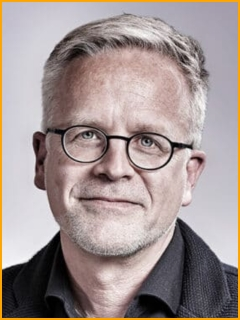
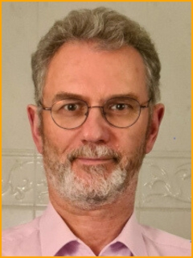

---
#commonMetadata:
#staticSiteGenerator:
title: Unser Team
url: unser-team
weight: 100
# line break after 76 characters
#...........3456789012345678901234567890123456789012345678901234567890123456)
---

## Comenius-Institut

Das Comenius-Institut, Evangelische Arbeitsstätte für Erziehungswissenschaft e.V.,
fördert Bildung und Erziehung aus evangelischer Verantwortung. Es versteht sich als
Wissenschafts-, Kompetenz- und Forschungseinrichtung sowie als Impuls- und
Dienstleistungszentrum im Blick auf grundlegende Fragen evangelischen Bildungshandelns.

**Dr. Jens Dechow**

Jens ist Direktor des Comenius-Institutes und verantwortet FOERBICO.
Zudem ist er für die Kommunikation mit dem Projektträger zuständig.

**Jörg Lohrer**

Jörg ist Projektkoordinator und unterstützt das Community-Management.
Er verfügt durch seine Tätigkeit im Leitungsteam von rpi-virtuell und beim
relilab bereits über langjährige Erfahrung in der Netzwerkarbeit.

**Gina Buchwald-Chassée**

Gina ist studierte Kommunikationswissenschaftlerin und unterstützt das Projekt
im Community-Management und ist für die Öffentlichkeitsarbeit verantwortlich.
Sie hat zuvor das Netzwerk schule-evangelisch-digital koordiniert.

**Ludger Sicking**

Ludger hat Mathematik und Sonderpädagogik studiert und arbeitet u. a. als
Softwareentwickler im Automobilbereich. Im FOERBICO Projekt  unterstützt er
bei der technischen Umsetzung.

## Goethe-Universität Frankfurt

Die Professur für Religionspädagogik und Mediendidaktik an der Goethe-Universität
Frankfurt widmet sich der Erforschung und Lehre der religiösen Bildung in Schulen
und anderen Bildungseinrichtungen. Sie kombiniert dabei die traditionellen Ansätze
der Religionspädagogik mit modernen Mediendidaktiken, um die Vermittlung religiöser
Inhalte in einer digitalisierten Welt zu verbessern. Schwerpunkte liegen auf der
Entwicklung neuer didaktischer Konzepte und der Förderung einer reflektierten Mediennutzung
im Kontext der religiösen Bildung.

**Prof. Dr. Viera Pirker**

Viera forscht und lehrt an der Professur für Religionspädagogik und Mediendidaktik an
der Goethe-Universität Frankfurt in den Bereichen religiöse Bildung, interreligiöses
Lernen, sowie Medienbildung und -didaktik. Ihre Arbeit konzentriert sich darauf, wie
Religion in einer zunehmend digitalisierten und medial geprägten Welt vermittelt
werden kann. Prof. Dr. Pirker ist zudem in zahlreichen Forschungsprojekten und Publikationen
aktiv.

**Dr. Laura Mößle**

Laura ist promovierte Religonspädagogin und ist als wissenschaftliche Mitarbeiterin bei
Prof. Dr. Viera Pirker an der Professur für Religionspädagogik und Mediendidaktik am
Fachbereich Katholische Theologie an der Goethe-Universität tätig. Sie unterstützt FOERBICO
bei der Vernetzung und im Community-Aufbau in der Wissenschaft.

## Friedrich-Alexander-Universität Erlangen-Nürnberg

Der Lehrstuhl für Religionspädagogik und Didaktik des Evangelischen Religionsunterrichts an
der Friedrich-Alexander-Universität Erlangen-Nürnberg (FAU) beschäftigt sich mit der Theorie
und Praxis des evangelischen Religionsunterrichts sowie mit Fragen der religiösen Bildung.
Der Schwerpunkt liegt auf der Vermittlung religiöser Inhalte in der Schule, der Entwicklung
didaktischer Modelle und Methoden sowie der Forschung zu religiösen Lernprozessen. Ziel ist es,
Studierende auf eine reflektierte und praxisnahe Tätigkeit im Religionsunterricht vorzubereiten
und zur Weiterentwicklung dieses Bildungsbereichs beizutragen.

**Prof. Dr. Manfred Pirner**

Prof. Dr. Manfred Pirner ist Professor für Religionspädagogik und Didaktik des Evangelischen
Religionsunterrichts an der FAU. Seine Forschungsschwerpunkte liegen in der religiösen Bildung,
der religiösen Sozialisation und der interkulturellen und interreligiösen Bildung. Dabei
beschäftigt er sich intensiv mit Fragen der Religionspädagogik in pluralistischen Gesellschaften
und der Rolle von Religion im öffentlichen Raum. Er engagiert sich auch in der Entwicklung von
innovativen didaktischen Ansätzen für den Religionsunterricht.

**Phillip Angelina**

Phillip ist wissenschaftlicher Mitarbeiter bei Prof. Dr. Manfred Pirner am Lehrstuhl für
Religionspädagogik und Didaktik des evangelischen Religionsunterrichts / Forschungsstelle für
Öffentliche Religionspädagogik. Sein Schwerpunkt im FOERBICO-Projekt ist die Empirische
Begleitforschung.