<!--
Spec zum Neuaufbau des Markdown-zu-Nostr-Publishings.
Stand: 2026-09-15. Messwerte gegen den damaligen Repo-Stand und die
produktiven Relays erhoben.

Diese Datei ist die Quelle der Wahrheit. Sie wird hier im Repo gepflegt
und nicht mehr aus einer externen Planungsdatei erzeugt.
Umsetzungsreihenfolge der Module: scripts/nostr-sync/README.md
-->

# Markdown → Nostr Publishing neu aufsetzen (Greenfield)

## Kontext

Heute publiziert `.github/workflows/nostr-sync.yml` die Blogposts aus `Website/content/`
nach Nostr, indem es ein **externes Repo** (`edufeed-org/mdparser`) auscheckt und dessen
Deno-Modul `sync/` ausführt. Drei Probleme motivieren den Neubau:

**1. Fragile Änderungserkennung.** `mdparser/sync/core/change-detection.ts` rekonstruiert
„was hat sich geändert" aus der Git-History (`GITHUB_EVENT_BEFORE`, `fetch-depth: 0`). Das
bricht bei Squash-Merges, Force-Pushes und manuellen Re-Runs. Der Code enthält deshalb in
`core/summary.ts` eine eigene „still gescheitert"-Erkennung — der Kommentar dort beschreibt
den Fall wörtlich: *„Redaktion pusht einen Post, die Action meldet Erfolg, auf Nostr kommt
nichts an."* Das Symptom wird gemeldet, die Ursache bleibt.

**2. Viel eigener Protokoll-Code.** Signieren (NIP-46), Relay-Publishing, Blossom-Upload
(BUD-01), Hashing — über 1000 Zeilen, die gepflegt werden müssen, obwohl sie nichts
projektspezifisches tun.

**3. Schlagwort-Datenlage ist unbemerkt inkonsistent.** `core/parser.ts` liest ausschließlich
den `# commonMetadata`-Block und verwirft den `# staticSiteGenerator`-Block ausdrücklich
(„Hugo-Reste, werden ignoriert"). Publiziert werden nur `commonMetadata.keywords`. Die
Konvention dazu steht im Repo — `Orga/oer-community-webseite-orga/wissensgrundlagen/schlagworte.yaml`:

> *„Kanonische Liste aller gültigen Tags/Keywords. Nur diese Schreibweisen verwenden – in
> `keywords` (commonMetadata) und identisch in `tags` (staticSiteGenerator)."*

Auswertung über alle 98 Posts mit Frontmatter zeigt, dass diese Konvention selten eingehalten wird:

| | Posts | Wirkung |
|---|---|---|
| A — `commonMetadata.keywords` gefüllt und konsistent | 22 | `t`-Tags landen im Event |
| B — Schlagworte vorhanden, aber **nicht** in `commonMetadata.keywords` | **60** | erreichen Nostr nicht |
| C — beide Felder gefüllt, aber inhaltlich abweichend | 1 | teils publiziert, teils nicht |
| D — gar keine Schlagworte | 15 | nichts zu übertragen |

Verteilung der Felder: `commonMetadata.keywords` 23×, `commonMetadata.tags` 2×,
`staticSiteGenerator.keywords` 1×, **`staticSiteGenerator.tags` 81×** — die Schlagworte
leben faktisch im Hugo-Block. Nachprüfbar an den Live-Events: `2025-06-02-RPT25`
(Slug `ki-und-religionspaedagogik`) hat 6 Schlagworte in der Datei, das Relay-Event hat
`t_tags: []`.

**Ziel:** Eine skriptbasierte, modulare Lösung in diesem Repo, die deutlich weniger eigenen
Code hat, idempotent ist (grün heißt: nachweislich publiziert) und Datenprobleme wie oben
**sichtbar macht**, statt sie stillschweigend zu übergehen.

## Getroffene Entscheidungen

| Thema | Entscheidung |
|---|---|
| Ort | **Dieses Repo**, `scripts/nostr-sync/` — kein externes Repo-Checkout mehr |
| Umfang | **Volle Parität**: kind:30023, kind:30142, kind:1063 + Blossom, Änderungserkennung, Job-Summary |
| Signing | **NIP-46 Bunker beibehalten** → Publisher-Identität (Pubkey) bleibt unverändert |
| Protokoll-Engine | **`nak`** (Version gepinnt), gekapselt in **genau einem** Modul |
| Zustandsmodell | **Relay ist die Wahrheit** (idempotent); Git-Diff nur noch Vorfilter in der Workflow-YAML |
| Frontmatter-Schema | **Unverändert** |
| Schlagworte | **Keine Zusammenführung.** `t`-Tags kommen weiterhin ausschließlich aus `commonMetadata.keywords`. Abweichungen werden **protokolliert** (siehe unten) |
| Schema-Validierung | **Pflicht** — fehlplatzierte/unbekannte Felder werden gemeldet, nicht verschluckt |
| Publisher | **Immer unser Pubkey** (`AUTHOR_PUBKEY_HEX` via Bunker). Events fremder Pubkeys werden nie angefasst, nie ersetzt, nur gemeldet |
| Bilder | **Verhalten unverändert.** Blossom-Upload und kind:1063 nur für Hash-URLs. Relative Pfade und Nicht-Hash-URLs werden **protokolliert** (siehe unten) |
| Glue-Sprache | **Python 3 + Pydantic** (entschieden), `pytest` für Tests, `requirements.txt` im CI |
| Dopplung mit `md2blossom` | **Eingefroren, dann entfernt.** `md2blossom.mjs` wird jetzt nicht angefasst, damit sich sein Ergebnis nicht als Nebenwirkung der Umstellung ändert. Pflicht bis dahin: `kind:1063` zeichengleich zu `md2blossom` (Vergleichstest als Abnahmekriterium). Entfernt wird es, sobald der Sync produktiv ist und keine exklusive Ausgabe mehr übrig bleibt |

### Sprachentscheidung: Python 3 + Pydantic

Gewählt, weil das Team weder Python noch TypeScript aktiv schreibt: Der Code wird überwiegend
**gelesen und reviewt**, nicht täglich geändert. Dafür ist Python die zugänglichere Sprache,
und der Subprozess-Aufruf an `nak` ist damit knapper als mit Denos `Command`-API.

Pydantic übernimmt die Schema-Validierung des Frontmatters — das ist der eigentliche Gewinn,
weil statische Typen allein die Klasse von Fehlern, die hier real auftritt (Feld steht im
falschen Block, YAML liefert ein `Date` statt eines Strings), **nicht** abfangen.

Stack: Python 3.13, `pydantic`, `PyYAML`, `pytest`, projektlokale venv unter
`scripts/nostr-sync/.venv` (gitignored), Abhängigkeiten gepinnt in
`scripts/nostr-sync/requirements.txt`.

## Schlagwort-Abweichungen protokollieren (statt zusammenführen)

Der Sync **ändert nichts** am publizierten Ergebnis: `t`-Tags entstehen wie bisher nur aus
`commonMetadata.keywords`. Zusätzlich liest er den `# staticSiteGenerator`-Block **nur zum
Vergleich** und schreibt ein Protokoll, wenn die Felder der dokumentierten Konvention
widersprechen:

| Fall | Meldung | Erwartete Menge |
|---|---|---|
| `commonMetadata.keywords` leer, aber Schlagworte in `commonMetadata.tags` / `staticSiteGenerator.keywords` / `staticSiteGenerator.tags` | „Schlagworte vorhanden, erreichen Nostr aber nicht" | 60 Posts |
| Beide gefüllt, Inhalte weichen ab | „Felder weichen voneinander ab" + Differenzmenge in beide Richtungen | 1 Post (`2026-06-25-Personal-Learning-Environments`) |

Das Protokoll gehört in die Job-Summary (kompakte Zähler + betroffene Slugs) und vollständig
in das Run-Log-Artefakt. **Es blockiert das Publizieren nicht** — es ist ein Datenqualitäts-
Signal für die Redaktion, kein Fehler.

## Bilder: was genau passiert

Der Bilder-Schritt läuft **nach** dem Publizieren des Artikels und blockiert ihn nie
(„Git ist die Wahrheit, die URL steht schon im Beitrag"). Er betrachtet Cover
(`commonMetadata.image`) und alle Fließtextbilder, aber er **greift nur bei URLs mit einem
SHA-256 im Pfad** (`https://blossom.edufeed.org/<64-hex>.jpg`):

1. `nak blossom check` → liegt der Blob schon auf dem Mediaserver?
2. Wenn nicht: Datei mit demselben Hash im Post-Ordner suchen → `nak blossom upload`
   (BUD-01, Auth-Event kind:24242, signiert über den Bunker). Datei fehlt → Warnung.
3. Passenden Eintrag im `# bilder`-Block suchen (über Dateiname oder URL). Fehlt er, oder
   fehlt darin `licenceUrl` → Warnung, **kein** 1063.
4. kind:1063 bauen, jüngsten vorhandenen Nachweis per `nak req -k 1063 -a <pubkey> -t x=<hash>`
   holen, Tags vergleichen → nur bei Abweichung publizieren.

### Was mit welchem URL-Typ passiert

| URL-Typ | `x`-Tag im 30023 | Blossom-Upload | kind:1063 | Ergebnis für Leser*innen |
|---|---|---|---|---|
| `https://blossom.edufeed.org/<hash>.jpg` | ja | ja | ja (wenn `# bilder`-Eintrag vorhanden) | auflösbar, lizenzbelegt |
| andere absolute URL (`https://oer.community/…`) | nein | nein | nein | auflösbar, ohne Nachweis |
| relativer Pfad (`bild.jpg`) | nein | nein | nein | **im Nostr-Client kaputt** |

### Die Cover-`x`-Konvention (positionsabhaengig — Vorsicht)

`events/article.ts` schreibt die `x`-Tags in genau dieser Reihenfolge:

1. `["image", <url>]`, direkt gefolgt von `["x", <cover-hash>]` — **das erste `x` IST der Cover-Hash**
2. danach je ein `x` pro Fließtextbild mit Hash-URL, in Auftretensreihenfolge, dedupliziert
   (zeigt der Text das Cover erneut, gibt es trotzdem nur ein `x`)

Es gibt kein Label und keinen Marker — die Bedeutung entsteht **allein aus der Position**.
edufeeds ArticleView und der Hub lesen das erste `x` als Cover. Wird die Tag-Reihenfolge
irgendwo sortiert oder umgruppiert, ist still ein anderes Bild das Cover. Deshalb ist im
Vorab-Check bestaetigt, dass `nak` die Tags unveraendert durchreicht.

**Risikonotiz:** Der `x`-Tag ist in einem 30023 nicht standardisiert — nostrbook kennt keine
`x`-Tag-Doku; `x` ist in NIP-94 als SHA-256 einer Datei **im kind:1063** definiert. Die
Verwendung im Artikel-Event ist eine edufeed-Absprache vom 07.09.2026. Robuster waere die von
NIP-94 fuer den `image`-Tag bereits vorgesehene Form `["image", <url>, <hash>]` — oder der **NIP-92-`imeta`-Tag**, den andere Implementierungen dafuer nutzen (`["imeta", "url …", "m …", "alt …", "dim …"]`). Aenderbar ist
das nur gemeinsam mit edufeed, da ArticleView und Hub auf der jetzigen Form aufsetzen.

### NIP-94-Abweichungen unserer 1063-Events

NIP-94 fuehrt `url`, `m` und `x` als **required**. `bilder.ts` setzt `m` und `size` aber nur,
wenn die Datei bekannt ist — fehlt die Bilddatei im Post-Ordner, entsteht ein 1063 **ohne
`m`** und verletzt die Spezifikation. Beim Neubau: `m` aus der URL-Endung ableiten, wenn die
Datei fehlt, sonst den Nachweis gar nicht erst schreiben. Nicht standardisiert (aber erlaubt)
sind zusaetzlich `title`, `license`, `credit`, `authorUrl`, `modification`, `ai`; `alt` und
`summary` sind NIP-94-konform.

### Datenlage (alle 98 Posts gemessen)

| | Anzahl |
|---|---|
| Posts mit `# bilder`-Block | 16 |
| Posts mit mindestens einer Blossom-Hash-URL | **16** — nur hier tut der Blossom-Schritt überhaupt etwas |
| Cover-Bilder (`commonMetadata.image`) | 80 — davon 15 Blossom, 64 andere URLs (65× `oer.community`), 1 relativ |
| Fließtextbilder | 236 — davon 25 Blossom, **197 relative Pfade** |

Live-Beleg: Der Publisher `5a12b41e…` hat am 07.09.2026 das Event
`rueckblick-auftaktkonferenz-oer-im-blick` publiziert, dessen Inhalt ``
enthält — ein relativer Pfad. Auf der Hugo-Website funktioniert das (Page Bundle), in einem
Nostr-Client nicht.

### Entscheidung: nur protokollieren

Der Sync **ändert am Bildverhalten nichts** — konsistent zur Schlagwort-Entscheidung: erst
sichtbar machen, dann in einer eigenen Ausbaustufe beheben. Protokolliert wird pro Post:

| Fall | Meldung |
|---|---|
| Relative Bildpfade im Content | „N relative Bildpfade — im Nostr-Event nicht auflösbar" |
| Absolute Nicht-Hash-URLs | „N Bilder ohne Blossom-Hash — kein Lizenznachweis möglich" |
| Hash-URL ohne `# bilder`-Eintrag oder ohne `licenceUrl` | „kein Nachweis für <hash>" (wie bisher) |
| Hash-URL, Blob fehlt und keine Datei mit dem Hash im Ordner | „Blob fehlt auf Blossom" (wie bisher) |

Auch hier gilt: **kein Fehler, kein Abbruch** — ein Datenqualitäts-Signal für die Redaktion.

## Bilder, deren lokale Datei nicht mehr zum Nachweis passt

Beim Golden-Abgleich der 1063-Nachweise aufgefallen (2026-09-15): 33 von 34 sind
zeichengleich, einer weicht ab — `2025-07-02-nostr-schrein`. Die lokale Datei
`nosTr-schrein.jpg` hasht zu `27ad98ea…` bei 146795 Bytes, referenziert und attestiert ist
aber `a2a54ea5…` mit 146385 Bytes. Die Datei wurde nach dem Attestieren neu kodiert.

Der Builder verhaelt sich dabei richtig: Ohne passende Datei kennt er die Groesse nicht und
schreibt **kein** `size`-Tag statt einer falschen Zahl — so verlangt es auch mdparsers
eigener Test (*„Groesse unbekannt → kein size-Tag statt falscher Zahl"*, mit exakt diesem
Hash als Fixture).

**Daraus folgt eine Regel fuer `publish.py`:** Findet sich im Beitragsordner **keine Datei
mit dem attestierten Hash**, wird der vorhandene Nachweis **nicht neu gebaut**. Begruendung:
Wir haetten strikt weniger Information als der bestehende Nachweis (`size` fehlt), und
kind:1063 ist nicht ersetzbar — ein Republish erzeugt ein Duplikat, das niemand mehr
zuordnen kann. Der bestehende Nachweis bleibt unangetastet, der Fall wird als Warnung
gemeldet.

Ohne diese Regel entstuende bei jedem Lauf ein weiteres Duplikat zu diesem Bild. Das gilt
auch fuer die heutige Loesung — dort ist die Situation bislang nur nicht aufgefallen.

## Fremde Pubkeys: nur melden, nichts ändern

Zum Slug `rueckblick-auftaktkonferenz-oer-im-blick` liegen zwei 30023-Events von zwei
verschiedenen Pubkeys auf dem Relay: unseres (`5a12b41e…`) und ein älteres (`5491c218…`) mit
absoluten `news.rpi-virtuell.de`-URLs. Technisch kollidieren sie nicht, weil der Pubkey Teil
der Adresse `kind:pubkey:d` ist — Leser*innen sehen den Beitrag aber doppelt.

**Festlegung:**

- Der Sync publiziert **ausschliesslich unter unserem Pubkey** (`AUTHOR_PUBKEY_HEX`, signiert
  ueber den Bunker). Events fremder Pubkeys werden nie ueberschrieben, geloescht oder sonstwie
  angefasst — das ist kryptografisch ohnehin unmoeglich.
- Der Idempotenz-Check fragt deshalb **immer mit `-a <unser-pubkey>`** ab. Ein fremdes Event
  zum selben `d`-Wert darf niemals als bereits publiziert durchgehen.
- Findet der Sync zu einem Slug zusaetzlich Events **anderer** Pubkeys, meldet er das in der
  Job-Summary: `Slug X existiert auch unter Pubkey Y (created_at Z)`. Rein informativ, kein
  Fehler, keine Aktion.
- Ob und wie alte Publisher bereinigt werden, ist eine eigene redaktionelle Frage ausserhalb
  dieses Umbaus.

## Wie Events eindeutig wiedererkannt werden

Grundlage des Idempotenz-Checks:

**30023 und 30142** sind *addressable/replaceable events* (Kind 30000–39999). Identität ist
ein Dreier-Tupel, nicht ein einzelner Tag:

```
kind : pubkey : d-Wert          z.B.  30023:5a12b41e…aedf:just-calling-it-open-is-not-enough
```

- Der `d`-Tag allein ist **nicht** eindeutig — erst zusammen mit `kind` und `pubkey`. Genau
  deshalb duerfen 30023 und 30142 denselben `d`-Wert tragen.
- **Der `a`-Tag hat mit der Identitaet nichts zu tun.** Laut nostrbook ist 30023 *Addressable*
  allein durch den Kind-Bereich 30000-39999 plus `d`-Tag; der `a`-Tag ist dort als *optional*
  gelistet und bedeutet *Referenced addressable events* — ein Zeiger auf ein **anderes**
  Event. In unseren Events existiert er nur als Querverweis 30023 <-> 30142 mit den
  edufeed-eigenen Markern `amb-metadata` / `content`.
- Ein neues Event mit demselben Tupel **ersetzt** das alte; das Relay behält nur das jüngste.
- Der `d`-Wert ist der **Pfad** von `commonMetadata.id` ohne fuehrenden und abschliessenden
  Schraegstrich (`extractSlug`: `pathname.replace(/^\//,'').replace(/\/$/,'')`) — innere
  Schraegstriche bleiben erhalten, aus `https://oer.community/en/our-team` wird also
  `en/our-team`, **nicht** `our-team`. **Damit ist das `id`-Feld
  der Identitätsanker.** Wird es geändert, entsteht ein neues Event und das alte bleibt als
  Waise auf dem Relay.

**1063** ist ein *regular event* — nicht ersetzbar, keine Adresse. Wiedererkennung nur über
die Kombination `pubkey` + `x`-Tag (SHA-256 des Bildes), wobei das **jüngste `created_at`
gewinnt**. Das Relay behält alle 1063 zum selben Hash — deshalb muss vor dem Publizieren
verglichen werden, sonst sammeln sich Duplikate.

Die Event-`id` ist global eindeutig, ändert sich aber bei jedem Republish — als
Wiedererkennung für „derselbe Post" unbrauchbar.

## Risiko: drei Implementierungen derselben Konventionen

`md2blossom.mjs` baut bereits vollstaendige 30023- und 1063-Events, `mdparser/sync` baut
dieselben Events noch einmal, und `events.py` waere die dritte Implementierung. Die beiden
**bestehenden** stimmen schon heute nicht ueberein — aus derselben Datei entstehen
unterschiedliche Events:

| Aspekt | `md2blossom.mjs` | `mdparser/sync` |
|---|---|---|
| Frontmatter | `YAML.parse(fm[1])` — **das ganze Dokument**, alle Bloecke flach zusammen (die `#`-Marker sind nur YAML-Kommentare) | schneidet am naechsten Marker ab, nur `commonMetadata` |
| Schlagworte | `meta.keywords ?? meta.tags` — **faellt auf `tags` zurueck** | nur `metadata.keywords` |
| `t`-Werte | `String(k).toLowerCase()` — **kleingeschrieben** | unveraendert uebernommen |
| `title` | `meta.title \|\| meta.name` — nimmt den **Hugo-Titel** zuerst | `metadata.name` (AMB) |
| `slug` (`d`-Tag!) | `meta.url \|\| Ordnername ohne Datumspraefix` — **woertlich**, inkl. fuehrendem Schraegstrich | Pfad von `commonMetadata.id` ohne Rand-Schraegstriche |

Die letzte Zeile ist die gefaehrlichste: Weichen `meta.url` und `commonMetadata.id`
voneinander ab, adressieren die beiden Werkzeuge **verschiedene Events**.

Praktisch ist bisher wenig passiert, weil die 30023-Vorlage von `md2blossom` unter
`Website/_nostr/` liegt (gitignored) und nicht publiziert wird — die CI baut ihr eigenes
Event. Die **1063-Vorlagen** werden dagegen von `blossom-bunker.ts publish` tatsaechlich
signiert und publiziert.

### Gemessene Divergenz (2026-09-14, 95 Posts mit Frontmatter)

| Aspekt | Betroffen | Bewertung |
|---|---|---|
| `d`-Tag weicht ab | **3 Posts** — `md2blossom` nimmt `meta.url` woertlich (`/en/conference`, **mit** fuehrendem Schraegstrich), `mdparser` strippt ihn (`en/conference`) | echte Divergenz, aber alle drei sind Seiten unter `Website/content/en/`, keine Posts, und ihnen fehlen Pflichtfelder — auf dem Relay existiert zu keiner Variante ein Event |
| `id` mehrsegmentig | 4 Posts (`oer-und-oep/lernmodul`, `en/conference`, `en/oer-and-oep`, `en/our-team`) | keiner davon ist publiziert; die Slug-Regel ist in Produktion also noch nie getestet worden |
| `title`-Tag weicht ab | 1 Post (`2026-03-03-OER-erstellen`) | Hugo-`title` != AMB-`name` |
| `t`-Werte weichen ab | **alle 23 Posts mit Schlagworten** | `md2blossom` kleinschreibt konsequent, `mdparser` nicht — betrifft also jeden Post, der ueberhaupt Schlagworte hat |

**Entscheidender Befund:** In den **publizierten** Daten gibt es bislang keine Divergenz.
Der Grund: `md2blossom` erzeugt `<slug>.30023.json` und `<slug>.amb.json`, aber
**niemand konsumiert sie** — `blossom-bunker.ts publish` signiert ausschliesslich die
`1063`-Vorlagen, und der eigene Kopfkommentar sagt es ausdruecklich: *„Den 30023 publiziert
die CI (mdparser/sync) nach dem Merge auf main."* Die Divergenz ist also latent: Sie wuerde
erst schaden, wenn jemand diese Vorlagen doch einmal publiziert.

Bei den 1063-Vorlagen gibt es keine Divergenz — die Tag-Abbildung ist in beiden Werkzeugen
zeichengleich.

Zahlen zu den 1063-Events unseres Pubkeys auf `relay-rpi.edufeed.org`: **40 Stueck**, alle
zwischen 2026-09-03 und 2026-09-10 (2 / 2 / 6 / 6 / 24). Die 24 vom 10.09. decken sich exakt
mit `bildmigration.md` (*„24 Bilder auf Blossom mit Nachweis"*). Die 10 Events vor dem
09.09. entstanden noch ueber `blossom-bunker publish`, weil die CI den Bilderschritt erst
seit dem 09.09. hat. Nach Inhalt unterscheidbar sind die Herkuenfte nicht — gleicher Pubkey,
gleiche Tag-Form.

### Entscheidung: `md2blossom` friert ein und wird danach entfernt

**Jetzt nicht anfassen.** Keine Zeile in `md2blossom.mjs` wird geaendert, solange unser Sync
nicht getestet und lauffaehig ist. Grund ist nicht, dass die Dopplung wuenschenswert waere,
sondern: Das Werkzeug ist im redaktionellen Einsatz, und sein Ergebnis darf sich nicht als
**Nebenwirkung** unserer Umstellung veraendern. Erst laeuft der Neubau, dann wird aufgeraeumt.

**Harte Anforderung: keine doppelten, nicht unterscheidbaren Ausgaben.**

Hier liegt eine konkrete Gefahr, die aus der Dopplung entstehen kann. `kind:1063` ist ein
*regular event* — nicht ersetzbar, Nachweise **akkumulieren** auf dem Relay. Beide Wege
publizieren unter demselben Pubkey und mit derselben Tag-Form, sind also nach Inhalt nicht
auseinanderzuhalten. Bauen `events.py` und `md2blossom` fuer dasselbe Bild auch nur minimal
unterschiedliche Tags, dann gilt:

1. `blossom-bunker publish` legt Variante A ab
2. der Sync liest A, vergleicht mit seiner Variante B, sieht eine Abweichung und publiziert B
3. der naechste manuelle Lauf legt wieder A ab — und so weiter

Ergebnis: ein Pingpong doppelter Lizenznachweise, die niemand mehr einer Quelle zuordnen kann.

Daraus folgt eine **Pflicht, keine Option**: Solange beide Werkzeuge existieren, muss
`events.py` fuer `kind:1063` zeichengleiche Tags liefern wie `md2blossom.mjs`. Abgesichert
durch einen Vergleichstest, der fuer denselben Beitrag beide Ausgaben baut und die Tag-Saetze
gegeneinander prueft. Dieser Test ist **Abnahmekriterium**, nicht Kuer. Er darf erst
wegfallen, wenn `md2blossom` entfernt ist.

Fuer `kind:30023` besteht diese Pflicht nicht, weil die Vorlage von `md2blossom` nie
publiziert wird — dort bleiben die gemessenen Abweichungen bestehen und werden nur
dokumentiert.

**Kopfkommentar fuer `events.py`:**

```python
"""Baut die Nostr-Events aus den Frontmatter-Metadaten.

UEBERGANGSZUSTAND — zweite Implementierung derselben Konventionen:
Website/scripts/md2blossom.mjs baut ebenfalls kind:30023 und kind:1063.
Das Werkzeug wird bewusst nicht angepasst, solange dieser Sync nicht
getestet und produktiv ist; danach wird es entfernt.

PFLICHT bis dahin: Die kind:1063-Tags dieses Moduls muessen zeichengleich
zu md2blossom.mjs bleiben. 1063 ist nicht ersetzbar — weichen die beiden
ab, publizieren sie sich wechselseitig ueber und die Nachweise
akkumulieren, ohne einer Quelle zuordenbar zu sein.
Abgesichert durch test_events.py::test_1063_byte_identical_to_md2blossom.

Bekannte Abweichungen bei kind:30023 (gemessen 2026-09-14) — unkritisch,
weil md2blossoms 30023-Vorlage nie publiziert wird:

  Aspekt         md2blossom.mjs                  dieses Modul
  ------------   -----------------------------   ------------------------------
  Frontmatter    ganzes Dokument flach           nur der commonMetadata-Block
  Schlagworte    keywords ?? tags                nur keywords
  t-Werte        .toLowerCase()                  unveraendert
  title-Tag      Hugo-title vor AMB-name         AMB-name
  d-Tag/Slug     meta.url woertlich              id-Pfad ohne Rand-Schraegstriche

Hintergrund: docs/superpowers/specs/2026-09-14-md-to-nostr-sync-neu-design.md
"""
```

**Abbaupfad: `md2blossom` entfernen.** Sobald beides zutrifft:

1. Der neue Sync ist getestet und produktiv im Einsatz, und
2. `md2blossom` erzeugt keine Ausgabe mehr, die sonst niemand erzeugt.

**Achtung, Abhaengigkeit fuer Punkt 2:** Eine Leistung von `md2blossom` deckt unser Plan
ausdruecklich **nicht** ab — das Umschreiben relativer Bildpfade auf Blossom-Hash-URLs im
Markdown. Fuer Bilder ist festgelegt: nur protokollieren, nichts veraendern. `md2blossom`
kann also erst verschwinden, wenn die Bildmigration durch ist (Stand 2026-09-10: 70 Beitraege
offen) **oder** dieser Schritt in den Sync gewandert ist (Ausbaustufe 3). Wird es vorher
entfernt, verlieren die restlichen Beitraege ihren Migrationsweg.

Mit `md2blossom` entfallen dann auch `blossom-bunker.ts` (dessen `publish` nur dessen
Vorlagen verarbeitet) und der Vergleichstest.

**Offene Frage vor dem Abbau:** `md2blossom` schreibt `<slug>.amb.json` erklaertermaßen fuer
das externe Werkzeug `amb-convert amb:nostr`. Im Repo gibt es dazu keinen Task, keinen
Workflow und keine weitere Erwaehnung — ob das jemand von Hand nutzt, ist von aussen nicht
feststellbar. Vor dem Entfernen zu klaeren, sonst faellt still ein Arbeitsschritt weg.

## Erkenntnisse aus verwandten Projekten

Drei fremde Werkzeuge geprueft (2026-09-15). Ergebnis in einem Satz: Eines bestaetigt unsere
Architektur unabhaengig und liefert vier konkrete Anleihen, zwei sind fuer uns ohne Nutzen.

### `941design/emacs-nostr-publish` — Python, NIP-23 + NIP-46, GPL-3.0

Loest dieselbe Aufgabe in derselben Sprache und ist **unabhaengig bei derselben Architektur
gelandet**: Python-Wrapper plus `nak` als Protokoll-Engine, ohne jede Nostr-Bibliothek
(Abhaengigkeiten: nur `PyYAML` und `Pillow`). Der eigene Architekturtext nennt das
*Composition Over Reimplementation*: „Delegates cryptography to nak — no direct NIP-46 or
signing implementation." Auch die Modulaufteilung deckt sich fast deckungsgleich mit unserer
(`frontmatter` · `validator` · `event` · `nak`), ebenso *Fail-Fast Validation* mit
Zurueckweisung unbekannter Felder und deterministische Tag-Reihenfolge.

Vier Dinge sind uebernehmenswert:

1. **`nak encode naddr` fuer die Artikeladresse.** Nach dem Publizieren wird die NIP-19-Adresse
   erzeugt und ausgegeben — mit `nak` selbst, ohne zusaetzliche Abhaengigkeit, und
   ausdruecklich **nicht fatal**: schlaegt das Encoding fehl, bleibt der Publish gueltig.
   Fuer uns: je publiziertem Beitrag ein `naddr1…` in der Job-Summary, damit die Redaktion den
   Beitrag direkt in einem Client oeffnen kann. Fehlt in unserem Entwurf bisher komplett.
2. **EXIF-Strippen vor dem Blossom-Upload — dort ein MUST mit Abbruch.** Wir laden Bilddateien
   heute unveraendert hoch. Bei einem oeffentlich finanzierten Projekt mit oeffentlichem
   Mediaserver ist das datenschutzrelevant: GPS-Koordinaten, Kameraseriennummern und
   Urheberfelder wandern ungeprueft mit. Siehe Ausbaustufe 3.
3. **NIP-92 `imeta`** ist der *standardisierte* Weg, Bildmetadaten am Event zu fuehren
   (`["imeta", "url …", "m …", "alt …", "dim …"]`). Das ist der Gegenentwurf zur
   edufeed-eigenen `x`-Tag-Konvention und gehoert als Kontext in die dortige Risikonotiz:
   Es gibt einen Standard, andere Implementierungen nutzen ihn.
4. **Relays kommen nie aus dem Inhalt.** Dort dient die CLI als Allowlist gegen die
   Frontmatter-Angaben — „prevents accidentally publishing to wrong relays". Bei uns stehen
   die Relays ohnehin in der Konfiguration; das Prinzip gehoert trotzdem festgehalten.

**Lizenzhinweis:** GPL-3.0. Ideen und Architektur sind frei uebernehmbar, **Code nicht** —
kopierte Zeilen wuerden unser Repo unter die GPL zwingen. Alles oben ist deshalb
nachzubauen, nicht zu uebernehmen.

### `novospes/shoutstr` — JavaScript, MIT

Chrome-Erweiterung zum Cross-Posting nach Medium, Substack und Nostr, mit eigenem Editor.
Anderes Problem (Autorenwerkzeug statt CI-Strecke), und zwei Entscheidungen laufen unseren
zuwider: der `nsec` liegt im Local Storage des Browsers, Bilder gehen nach `nostr.build`.
Nichts zu uebernehmen.

### `talvasconcelos/postr` — Svelte, ohne Lizenz

Browser-Editor von 2023, Stand NIP-33, seit drei Jahren unveraendert, README 78 Byte, **keine
Lizenzdatei**. Ohne Lizenz ist selbst das Kopieren einzelner Zeilen rechtlich nicht gedeckt.
Nichts zu uebernehmen.

## Architektur

Zehn Module unter `scripts/nostr-sync/`, je ein `test_*.py` daneben. Zugeschnitten nach
**Verantwortlichkeit**, nicht nach dem Ablauf der Verarbeitung: Jede Datei beantwortet genau
eine Frage, und die Frage steht im Modul-Docstring.

| Modul | Die eine Aufgabe | Seiteneffekte | ~Zeilen |
|---|---|---|---|
| `models.py` | Beschreiben, wie die Daten aussehen: Pydantic-Schemas plus `Finding` (Schweregrad **und** Herkunft) und `PostResult` | keine | 170 |
| `frontmatter.py` | Das Drei-Block-Format lesen und Werte normalisieren | keine | 160 |
| `references.py` | Aus Inhalt und Metadaten Bezeichner und Medienverweise ableiten: Slug, SHA-256 aus Blossom-URL, `a`-Koordinate, Bildliste in Reihenfolge | keine | 170 |
| `error_checks.py` | Prüfungen, die **blockieren** | keine | 140 |
| `warning_checks.py` | Prüfungen, die nur **melden** | keine | 120 |
| `events.py` | Events bauen (30023, 30142, 1063) und vergleichen | keine | 210 |
| `nak.py` | **Die einzige Subprozess-Grenze**: Relays, Blossom, `naddr` | ja | 220 |
| `publish.py` | Pro Beitrag entscheiden: publizieren, überspringen, scheitern. Bekommt die `nak`-Operationen als **Funktionsparameter** hineingereicht — kein Framework, keine Interfaces, nur Argumente — damit jede Entscheidungs-Verzweigung ohne Relay testbar ist | via `nak.py` | 150 |
| `report.py` | Ergebnisse in Markdown gießen — entscheidet nichts. Die Exit-Code-Regel liegt in `publish.py` (`exit_code(results)`), `cli.py` ruft sie nur auf | keine | 180 |
| `cli.py` | Einstieg: Argumente, Verdrahtung, Exit-Code | ruft die anderen | 80 |

**Abhängigkeiten zeigen in eine Richtung.** `models` ← reine Module (`frontmatter`,
`references`, `events`, `*_checks`) ← Adapter (`nak`) ← `publish` ← `cli`; `report` kennt nur
`models`. Die eine Regel, die das absichert und als Test prüfbar ist: **kein reines Modul
importiert `nak`.** Bricht die Schichtung, wird der Test rot statt dass es jemandem auffallen
muss.

**Regeln nach Schweregrad getrennt, Herkunft im Befund.** `error_checks` und `warning_checks`
trennen nach der Folge — blockiert es oder nicht —, weil das die Frage ist, die beim Lesen
der Job-Summary zählt. Woher eine Regel stammt, steht nicht im Dateinamen, sondern im
`Finding` selbst und damit in jeder Logzeile: `NIP-23`, `NIP-94` oder
`FOERBICO-Konvention (schlagworte.yaml)`.

**Bewusst nicht weiter zerlegt.** Drei Trennungen habe ich erwogen und verworfen, weil sie
das Nachvollziehen erschweren statt es zu erleichtern: Vergleichen bleibt bei `events.py`
(es ist dieselbe Datenform, nur andere Richtung); `kind:1063` bleibt bei den anderen Events
(alle drei sind Nostr-Events aus demselben Beitrag); und `nak.py` bleibt eine Datei, weil
„wir rufen genau ein fremdes Werkzeug auf" die Grenze ist, die man verstehen muss — nicht,
welche zwei Serverarten dahinter stehen.

### Code-Stil: Lesbarkeit vor Kürze

Python wurde gewählt, weil der Code überwiegend **gelesen** wird. Daraus folgen verbindliche
Grenzen und ein paar Regeln, die das absichern:

| Grenze | Wert |
|---|---|
| Funktion | Obergrenze 100 Zeilen — die meisten werden 10–30 Zeilen lang |
| Datei | bis 300, im Ausnahmefall 400 Zeilen. Kleiner ist besser, aber nicht immer sinnvoller: eine kohärente lange Datei schlägt zwei künstlich getrennte |

Nähert sich eine Funktion der Obergrenze, ist das kein Anlass zum Verdichten, sondern das
Signal, dass sie mehrere Schritte erledigt.

**Wie der Code geschrieben wird:**

- Sprechende Namen statt Kommentare. Kommentare nur dort, wo das *Warum* nicht im Code steht —
  eine Protokollregel, ein Fallstrick, eine bewusste Abweichung.
- Keine verdichteten Einzeiler, keine verschachtelten Comprehensions über mehrere Ebenen.
  Eine Schleife, die man laut vorlesen kann, schlägt einen cleveren Ausdruck.
- Flache Verschachtelung: früh zurückkehren statt `else`-Treppen.
- Jedes Modul beginnt mit einem kurzen Docstring: welche **eine** Frage es beantwortet und was
  es ausdrücklich *nicht* tut.
- Typannotationen an allen öffentlichen Funktionen — hier Dokumentation, nicht Zierde.

**Bezeichner auf Englisch**: `extract_slug`, `tags_equal`, `image_urls`, `check_html`.
Protokollbegriffe ohnehin: `kind`, `tags`, `pubkey`, `naddr`. Deutsch bleibt den Texten
vorbehalten — Docstrings, Logmeldungen und die Job-Summary richten sich an die Redaktion.

### Datenfluss

```mermaid
flowchart TD
    P["Push auf main<br/>PR-Merge oder Direkt-Commit"] --> G{"Dateien unter<br/>Website/content/** geaendert?"}
    G -->|nein| X0(["Workflow startet nicht"])
    G -->|ja| S["nostr-sync.yml<br/>Checkout fetch-depth 0 ·<br/>nak-Binary gepinnt + Checksum ·<br/>Python + requirements.txt"]

    S --> D{"github.event.before<br/>brauchbar?"}
    D -->|ja| D1["git diff --name-only<br/>before..sha -- Website/content"]
    D -->|"nein / 0000…"| D2["Fallback --all<br/>alle index.md"]
    D1 --> FM
    D2 --> FM

    FM["frontmatter.py + models.py<br/>Bloecke trennen · Schema ·<br/>Werte normalisieren"] --> SK{"AMB-Pflichtfelder<br/>vollstaendig?"}
    SK -->|nein| SKIP(["uebersprungen<br/>Grund benannt · Job bleibt gruen"])
    SK -->|ja| V{"error_checks.py<br/>NIP-01 / 23 / 94"}
    V -->|Verstoss| ERR["FEHLER<br/>Event wird NICHT publiziert ·<br/>Post gilt als fehlgeschlagen"]
    V -->|ok| EV["events.py<br/>kind:30023<br/>+ kind:30142 wenn LearningResource"]

    EV --> RQ["nak req -k 30023 -a unser-pubkey -d slug<br/>das Relay ist die Wahrheit"]
    RQ --> RE{"Relay erreichbar?"}
    RE -->|nein| ERR
    RE -->|ja| EQ{"Tag-Saetze identisch?"}
    EQ -->|ja| UNCH(["unchanged<br/>nichts publizieren"])
    EQ -->|nein| PUB["nak event --sec bunker://…<br/>ein Aufruf je Relay"]
    PUB --> AK{"acks >= MIN_RELAY_ACKS?"}
    AK -->|nein| ERR
    AK -->|ja| OKP(["publiziert"])

    UNCH --> IMG["publish.py + references.py — je Bild mit Hash-URL<br/>nak blossom check → ggf. upload BUD-01 ·<br/>kind:1063 bauen, mit juengstem Nachweis vergleichen,<br/>nur bei Abweichung publizieren"]
    OKP --> IMG
    IMG --> W["Protokoll sammeln<br/>Schlagworte im falschen Block ·<br/>relative Bildpfade · fremde Pubkeys<br/>Warnung, kein Abbruch"]

    W --> SUM["report.py<br/>GITHUB_STEP_SUMMARY + Log-Artefakt"]
    ERR --> SUM
    SUM --> EX{"jeder Post publiziert oder<br/>nachweislich unveraendert?"}
    EX -->|ja| Z0(["Exit 0 — Job gruen"])
    EX -->|nein| Z1(["Exit != 0 — Job rot"])

    classDef fehler fill:#fde8e8,stroke:#c0392b,color:#7b1b12
    classDef gut fill:#e8f6ec,stroke:#2e7d4f,color:#14512f
    classDef neutral fill:#eef2f7,stroke:#5b6b7f,color:#22303f
    class ERR,Z1 fehler
    class OKP,UNCH,Z0 gut
    class SKIP neutral
    class X0 neutral
```



Die Schleife laeuft je Post. Ein einzelner fehlgeschlagener Post bricht den Lauf **nicht** ab
— die uebrigen werden weiter abgearbeitet, der Exit-Code steht erst am Ende fest.

Der Git-Diff ist dabei nur **Vorfilter** fuer die Geschwindigkeit, nicht der Mechanismus fuer
Korrektheit: Ob publiziert wird, entscheidet allein der Vergleich mit dem Relay. Ein Lauf mit
`--all` muss deshalb zum selben Ergebnis fuehren wie ein Lauf mit Diff.

### Idempotenz je Event-Typ

| Kind | Abfrage | Regel |
|---|---|---|
| 30023 | `nak req -k 30023 -a <pubkey> -d <slug> <relay>` | replaceable → Tag-Sets vergleichen, bei Gleichheit skip. **`-a` ist Pflicht**, sonst gilt ein fremdes Event faelschlich als publiziert |
| 30142 | `nak req -k 30142 -a <pubkey> -d <slug> <amb-relay>` | dito |
| 1063 | `nak req -k 1063 -a <pubkey> -t x=<hash> <relay>` | nicht replaceable → jüngsten holen, vergleichen, nur bei Abweichung neu publizieren |

Verglichen werden **nur Tags und `content`**, nie `created_at`/`id`/`sig`. Dieselbe Regel,
die `mdparser/sync/core/bilder.ts:nachweisGleich` heute schon für 1063 anwendet — hier auf
alle Kinds verallgemeinert.

## Schweregrade: Spezifikationsverletzungen brechen ab

Zwei Stufen, getrennt nach der Folge — blockiert es oder nicht. Die Herkunft der Regel
(NIP oder eigene Konvention) steht in jedem Befund, nicht in der Stufe:

| Stufe | Ausloeser | Verhalten |
|---|---|---|
| **FEHLER** | **Spezifikationsverletzung** (NIP/BUD) oder Betriebsfehler | Event wird **nicht publiziert**. Post gilt als fehlgeschlagen. Job-Exit != 0. In der Summary ganz oben als `> [!CAUTION]`-Block mit Datei, Feld und verletzter Regel |
| **WARNUNG** | Verletzung **unserer eigenen** Konventionen, oder ein unbekanntes Feld im Frontmatter | Wird publiziert, aber mit eigenem, sichtbarem Abschnitt in der Job-Summary (`> [!WARNING]`) |
| **UEBERSPRUNGEN** | Pflichtfelder des AMB-Schemas fehlen — der Beitrag ist (noch) nicht fuer Nostr vorgesehen | Wird **nicht** publiziert, erscheint mit Grund in der Summary, **Job bleibt gruen**. Wie `mdparser` es heute haelt (`skip-missing-fields`) |

**Warum eine Spezifikationsverletzung nicht publiziert werden darf:** 30023 und 30142 sind
*replaceable*. Ein fehlerhaftes Event **ersetzt die bisher funktionierende Version** auf dem
Relay und liegt dort dauerhaft. Ein kaputtes Event zu publizieren ist damit schlechter, als
gar nichts zu tun — es zerstoert einen guten Stand.

**Kein Abbruch des ganzen Laufs:** Der betroffene Post wird uebersprungen, die uebrigen laufen
weiter, am Ende steht der Exit-Code != 0. Sonst blockiert ein einziger kaputter Post alle
nachfolgenden.

### Prueflisten

**Spezifikations-Checks vor dem Signieren (Verstoss = FEHLER):**

| Regel | Quelle |
|---|---|
| Alle Tag-Werte sind Strings — kein Date-Objekt, keine Zahl, kein `null` | NIP-01 |
| `d`-Tag vorhanden und nicht leer | NIP-01 (addressable) |
| `published_at` ist eine positive Ganzzahl als String (nie `NaN`, nie leer) | NIP-23 |
| `datePublished` liegt strikt als `YYYY-MM-DD` vor | intern, siehe Fallstrick 3 |
| kind:1063 hat `url`, `m` **und** `x` | NIP-94 (alle drei *required*) |
| `x` ist genau 64 Hex-Zeichen in Kleinschreibung | NIP-94 |
| `a`-Tag-Wert hat die Form `kind:pubkey:d` | NIP-01 |
| `content` ist ein String | NIP-01 |
| `content` enthaelt **kein HTML** | NIP-23 (*MUST NOT support adding HTML to Markdown*) |
| `content` hat **keine harten Absatzumbrueche** | NIP-23 (*MUST NOT hard line-break paragraphs*) |

### NIP-23-Inhaltsregeln: beides FEHLER, mit handlungsfaehiger Meldung

Beide `content`-Regeln aus NIP-23 blockieren die Veroeffentlichung des betroffenen Beitrags.
Damit das nicht in eine Sackgasse fuehrt, muss die Meldung so konkret sein, dass die
Redaktion sie ohne Rueckfrage beheben kann — Datei, Zeilen, Fundstelle, Regel, Fix:

```
FEHLER  NIP-23: HTML im content
  Datei:    Website/content/de/posts/2026-02-04-loewe-von-juda/index.md
  Zeilen:   70, 92, 93, 104, 111, 118, 154, 157
  Gefunden: <br>, </br>
  Regel:    NIP-23 — "MUST NOT support adding HTML to Markdown"
  Fix:      <br> durch eine Leerzeile ersetzen (= neuer Absatz).
            </br> ist ausserdem kein gueltiges HTML.
  Folge:    Beitrag wird nicht publiziert, bis das behoben ist.
```

**Erkennungsregeln — bewusst genau festgelegt, weil ein Fehlalarm eine korrekte
Veroeffentlichung aufhaelt.** Beim Entwerfen sind mir drei Fehlerquellen begegnet, die in der
Implementierung zu beachten sind:

*HTML (exakt, keine Heuristik):* Tag-artige Muster im `content`, **ausserhalb** von
Codebloecken (``` ``` ```). Codebloecke sind ausgenommen, dort ist HTML legitimer Inhalt.

*Harte Absatzumbrueche (heuristisch, deshalb streng eingegrenzt):* Eine Fliesstextzeile endet
**mitten im Satz** und die naechste setzt ihn fort. Konkret alle Bedingungen zugleich:

- Zeile endet **nicht** auf Satzzeichen — die Liste muss die deutschen Schlusszeichen
  enthalten: `. ! ? : ; » « “ ” ’ " ' ) ]`. **Fallstrick:** Deutsch schliesst mit `“`
  (U+201C), nicht mit `”` (U+201D). Fehlt U+201C in der Liste, meldet der Check
  `2025-10-06-Reformation` falsch, wo zwei vollstaendige Zitatfragen auf eigenen Zeilen stehen.
- naechste Zeile beginnt klein oder mit einem oeffnenden Anfuehrungszeichen (Satzfortsetzung)
- keine der beiden Zeilen beginnt einen Block (`#` `-` `*` `>` `|` `!` `[` ``` ``` ``` , Nummerierung)
- die Zeile endet nicht auf zwei Leerzeichen (= gewollter Markdown-Umbruch)

**Verworfen bei der Umsetzung: die Ausnahme fuer Adresszeilen.** Geplant war, Zeilen mit
E-Mail, `http`, PLZ oder `Tel` auszunehmen, damit Impressum und Datenschutz ihre
Anschriftenbloecke nicht melden. Gemessen aendert diese Ausnahme die Menge betroffener
**Dateien** nicht (3 Beitraege, 3 Seiten mit wie ohne) — sie unterdrueckt nur Treffer
innerhalb ohnehin betroffener Dateien. Und diese Treffer sind echt: Markdown verschmilzt
aufeinanderfolgende Zeilen zu einem Absatz, aus der Anschrift wird
„Marco Tessendorf procado Consulting 10243 Berlin". Der Block braucht eine Liste oder
gewollte Umbrueche. Die Ausnahme haette also richtige Befunde versteckt, ohne etwas zu
entscheiden — deshalb gibt es sie nicht.

**Fallstrick, der zuerst naheliegt und nicht funktioniert:** Ein Laengenkriterium
(„drei Zeilen zwischen 60 und 90 Zeichen") produziert Fehlalarme bei absichtlich
zeilenweise gesetztem Text. Nicht verwenden.

**Arbeitsliste vor dem Cutover.** Mit der fertigen Implementierung nachgemessen
(2026-09-15): Genau **4 Beitraege** werden blockiert. Solange diese Stellen offen sind,
werden sie nicht mehr aktualisiert.

| Beitrag | Befund | Zeilen |
|---|---|---|
| `de/posts/2026-02-04-loewe-von-juda` | HTML im content (`<br>`, `</br>`) | 8 |
| `de/posts/2024-10-30-Austausch-digiLL` | harte Absatzumbrueche | 18 |
| `de/posts/2025-08-26-Edufeed-Pitch` | harte Absatzumbrueche | 3 |
| `de/posts/2025-12-08-Lichtmomente` | harte Absatzumbrueche | 2 |

Die Seiten `unser-team`, `impressum` und `datenschutz` haben ebenfalls harte Umbrueche,
erreichen die NIP-Pruefung aber nie: Ihnen fehlen die AMB-Pflichtfelder, sie werden vorher
uebersprungen. Die Reihenfolge *erst ueberspringen, dann pruefen* ist damit belegt.

**Konventions-Checks (Verstoss = WARNUNG):** Schlagworte im falschen Block, Schlagwort-Felder
weichen voneinander ab, relative Bildpfade, Bild-URL ohne Blossom-Hash, Hash-URL ohne
`# bilder`-Eintrag oder ohne `licenceUrl`, Slug existiert zusaetzlich unter fremdem Pubkey.

### Beim Bauen gefunden: 19 Events tragen live den falschen Sprach-Tag

`inLanguage: de` steht in **19 Beitraegen** als Skalar statt als Liste. `mdparser` nimmt dort
`metadata.inLanguage?.[0]` — und indiziert damit den **String**. Auf dem Relay steht bei
diesen Beitraegen `["inLanguage", "d"]` und `["summary", "…", "d"]`: der Buchstabe statt der
Sprache. Nachgeprueft am Live-Event von `hackathoern`.

`mdparser/sync/core/validation.ts` konnte das nicht sehen, weil es nur auf **Praesenz** prueft
(`isEmpty`), nicht auf den Typ. Ein nicht-leerer String besteht diese Pruefung.

**Entscheidung:** Das Pydantic-Schema liest den Skalar als einelementige Liste und repariert
die 19 Events beim ersten Lauf. Bewusst eng begrenzt auf `inLanguage` — `about`, `keywords`,
`learningResourceType`, `educationalLevel` und `creator` sind in allen 95 Beitraegen echte
Listen, dort waere eine Umwandlung spekulativ.

**Folge fuer den Cutover:** Die Erwartung „unchanged fuer alle Posts" gilt nicht mehr. Erwartet
werden **19 benannte Aenderungen** (Sprach-Tag korrigiert) und sonst nichts.

### Schema-Strenge: unbekannte Felder melden, nicht blockieren

Gemessen: **8 von 95 Beitraegen** haben Felder, die das AMB-Schema nicht kennt — 6x `@type`,
dazu `tags`, `url`, `author`, `cover`, `summary`, `title`. Das Schema laesst sie zu
(`extra="allow"`) und bewahrt sie auf; `unknown_fields()` liefert die Namen, `warning_checks`
macht daraus eine sichtbare Meldung mit Datei und Feldnamen. Begruendung: Ein Zusatzfeld
beschaedigt kein Event, es wird nur nicht in Tags uebersetzt.

Nach dieser Regel bleiben **13 Beitraege uebersprungen**: 10 Seiten ohne AMB-Metadaten
(Impressum, Datenschutz, Team — nie fuer Nostr gedacht) und **3 Beitraege mit echten
Datenfehlern**, die redaktionell zu beheben sind:

| Beitrag | Problem |
|---|---|
| `2025-03-04-dezentrale-oep-oer` | dritter Creator: `affiliation` ist kein Mapping |
| ein Beitrag mit unvollstaendigem Creator | `givenName` und `familyName` fehlen |
| `2025-06-26-Save_the_Date` | `id` fehlt im commonMetadata-Block |

### Drei Fallstricke, empirisch bestaetigt

Alle drei wuerden heute unbemerkt durchgehen — sie sind der Grund fuer die Spec-Checks oben:

1. **YAML-Autotyping macht aus Datumsangaben Objekte.** `datePublished: 2026-08-12`
   (ohne Anfuehrungszeichen) liefert mit Denos `@std/yaml` ein **`Date`-Objekt**, nicht den
   String `"2026-08-12"`. Im Tag stuende dann `"2026-08-12T00:00:00.000Z"` — oder das Event
   waere gleich ungueltig. Dass die Live-Events heute sauber aussehen, liegt allein daran,
   dass `mdparser` das npm-Paket `yaml` nutzt, das Zeitstempel als String zurueckgibt.
   **Die YAML-Bibliothek ist also keine neutrale Wahl.** Das `frontmatter`-Modul muss alle
   Werte explizit zu Strings normalisieren und nicht-konvertierbare ablehnen.
2. **Zahlen in Listen bleiben Zahlen.** `keywords: [2026, Bibel]` ergibt `[2026, "Bibel"]` —
   ein numerischer Tag-Wert verletzt NIP-01.
3. **NIP-23 verbietet HTML und harte Absatzumbrueche im `content` — beides kommt vor.**
   Das Original-NIP formuliert zwei **MUST NOT**, die in keiner bisherigen Pruefliste standen.
   Gemessen ueber 95 Beitraege: **1 Beitrag mit HTML** —
   `2026-02-04-loewe-von-juda` (Slug `der-loewe-schwierigkeiten`) nutzt zehnmal `<br>` bzw.
   `</br>` als Absatztrenner und Bildunterschrift, publiziert und live. **4 Beitraege** mit
   hart umbrochenen Absaetzen. Immerhin: **kein einziger Hugo-Shortcode** im Fliesstext, dort
   drohte der groessere Schaden.
4. **`Date.parse` raet stillschweigend falsch.** `Date.parse("12.08.2026")` — gemeint als
   12. August — ergibt den **7./8. Dezember 2026**. Vier Monate daneben, ohne jede Meldung.
   `Date.parse("")` ergibt `NaN`, und `String(NaN/1000)` schreibt woertlich `"NaN"` in den
   `published_at`-Tag. Deshalb: striktes `YYYY-MM-DD`-Parsing, kein `Date.parse` als Fallback.

### naddr-Ausgabe je publiziertem Beitrag

Nach jedem erfolgreichen Publish erzeugt `report.py` die NIP-19-Adresse des Beitrags und
stellt sie mit Client-Links in die Job-Summary — damit die Redaktion das Ergebnis direkt
oeffnen und ansehen kann, statt es auf einem Relay suchen zu muessen.

Erzeugt wird sie mit `nak` selbst, ohne zusaetzliche Abhaengigkeit:

```bash
nak encode naddr -k 30023 -p <pubkey> -d <slug> --relay wss://relay-rpi.edufeed.org
```

Gegen nak v0.17.3 verifiziert: Der Relay-Hinweis landet tatsaechlich im Code (mit
`nak decode` geprueft). **Zwei Fallstricke:** `--relay` ist in `nak encode naddr --help`
**nicht dokumentiert**, funktioniert aber — bei einem Versionssprung erneut pruefen. Und wie
bei jedem `nak`-Aufruf muss stdin explizit gesetzt werden, sonst bricht das Kommando ab.

Client-Links in der Form, die `mdparser/sync/publish-single.ts` bereits verwendet:

| Client | URL |
|---|---|
| Habla | `https://habla.news/a/<naddr>` |
| Yakihonne | `https://yakihonne.com/article/<naddr>` |

**Nicht fatal.** Schlaegt das Encoding fehl, bleibt der Publish gueltig; die Summary vermerkt
lediglich, dass die Adresse fehlt. Ein Darstellungsdetail darf keinen gruenen Lauf rot faerben.

### Fehlerbehandlung — der „silent no-op"-Fix

Kernregel: **Jeder ausgewählte Post muss in genau einem von drei benannten Zuständen enden** —
„publiziert (mit ≥ `MIN_RELAY_ACKS` Bestätigungen)", „nachweislich unverändert auf dem Relay"
oder „übersprungen, Grund benannt". Alles andere ist ein harter Fehler mit Exit-Code ≠ 0.

Der Unterschied zwischen *übersprungen* und *Fehler* ist der Ort der Ursache: Fehlen die
AMB-Pflichtfelder, war der Beitrag nie für Nostr gedacht — das ist kein Defekt, sondern eine
Aussage. Bricht dagegen das Publizieren ab oder verletzt ein gebautes Event die Spezifikation,
ist etwas kaputt.

- `nak`-Exit-Code ≠ 0 pro Relay → wird gezählt; `acks < MIN_RELAY_ACKS` (2) → Post gilt als
  fehlgeschlagen.
- **Relay bei der Idempotenz-Abfrage nicht erreichbar → harter Fehler.** Nicht „dann
  publiziere ich sicherheitshalber" (Spam) und nicht „dann nehme ich unverändert an"
  (stiller Verlust).
- Schema- und Spezifikationsverletzungen → Post wird nicht publiziert, Grund als
  `> [!CAUTION]`-Block in der Summary, Exit-Code != 0.
- Konventionsverletzungen (Schlagworte, Bilder) → **sichtbare Warnung**, aber publiziert.

Damit wird der Fall, den `summary.ts` heute nachträglich meldet, strukturell unmöglich.

## Kritische Dateien

**Neu:**
- `scripts/nostr-sync/` — die zehn Module oben, je ein `test_*.py` daneben, Fixtures unter
  `scripts/nostr-sync/fixtures/`

**Umbauen:**
- `.github/workflows/nostr-sync.yml` — externes `mdparser`-Checkout entfernen; `nak`-Binary
  in gepinnter Version + Checksum installieren; geänderte Pfade per `git diff --name-only`
  ermitteln und als Argumente übergeben; `--all` bei `workflow_dispatch`. Secrets bleiben:
  `BUNKER_URL`, `AUTHOR_PUBKEY_HEX` (für `a`-Tags und 1063-Abfragen), `CLIENT_SECRET_HEX`
  (→ `nak --connect-as`).

**Als Referenz lesen (nicht kopieren):**
- `docs/nostr-events/kind-30023.md`, `kind-30142.md`, `kind-1063.md` — dokumentierte
  Feld-Mappings plus echte Live-Events, dienen als Golden Fixtures
- `Orga/oer-community-webseite-orga/wissensgrundlagen/schlagworte.yaml` — kanonische
  Schlagwortliste (50 Begriffe) und die dokumentierte Konvention
- `Website/content/de/posts/2026-08-12-Just-calling-it-open-is-not-enough/index.md` —
  Referenz-Frontmatter mit drei Creators
- `Website/content/de/posts/2026-06-25-Personal-Learning-Environments/index.md` — der
  einzige Post mit abweichenden Schlagwort-Listen (Testfall Fall C)
- `Website/content/de/posts/2026-03-03-OER-erstellen/index.md` — Sonderfall: **keine**
  Block-Marker, ganzes Frontmatter gilt als commonMetadata (Testfall für den Parser)

## Domänenwissen aus `mdparser` übernehmen

Nicht den Code portieren, aber diese Regeln sind hart erarbeitet und müssen erhalten bleiben
(Quelle: `github.com/edufeed-org/mdparser`, Ordner `sync/`):

| Quelle | Zu übernehmende Regel |
|---|---|
| `core/parser.ts` | Block-Marker-Logik, `extractSlug` (Slug = ganzer Pfad von `id` ohne Rand-Schraegstriche, innere bleiben) |
| `events/article.ts` | `hashAusUrl` (SHA-256 aus Blossom-URL); Cover-`x` zuerst, direkt nach `image`; Fließtextbilder dedupliziert; **kein** `x` bei URL ohne Hash im Pfad |
| `events/amb.ts` | Reihenfolge und Namen der `creator:*`-Tags; `license:id`, `about:id`, `learningResourceType:id`, `educationalLevel:id` |
| `core/bilder.ts` | `nachweisEvent`-Tag-Mapping (`title`/`license`/`credit`/`alt`/`source`/`authorUrl`/`modification`/`p`/`ai`); `licenceUrl` ist Pflicht; KI-Werte nur `generated`/`modified` |
| `core/validation.ts` | Pflichtfelder (`id`, `name`, `description`, `license`, `creator`, `inLanguage`, `datePublished`); `id` muss mit `https://oer.community/` beginnen |
| `core/summary.ts` | `isSilentNoop`-Idee, Aufbau der Job-Summary, Relay-ohne-Bestätigung-Abschnitt |

## Teststrategie

1. **Unit (rein):** Block-Zerlegung inkl. Edge-Cases (kein Marker vorhanden, fehlender
   `# bilder`-Block, auskommentiertes Frontmatter); **Schlagwort-Abweichungserkennung**
   (Fälle A–D); Event-Builder (Tag-Reihenfolge, `x`-Tags dedupliziert und Cover zuerst,
   kein 30142 ohne `LearningResource`); `tags_equal`; Summary-Rendering.
2. **Golden-Fixture-Regression:** Aus dem Referenz-Post die Events bauen und gegen die
   Live-Events vergleichen (`created_at`/`id`/`sig` ausgenommen). Muss **Byte-gleiche
   Tag-Sets** ergeben. Die Fixtures liegen als **vollständige JSON-Dateien** unter
   `scripts/nostr-sync/fixtures/`, direkt mit `nak req` vom Relay geholt — **nicht** die
   Beispiele in `docs/nostr-events/`: dort sind `summary` und `content` zur Lesbarkeit mit
   `[…]` gekürzt und taugen nicht für einen Byte-Vergleich.
3. **Integration, offline, isoliert:** Ein pytest-Fixture startet `nak serve --blossom` auf
   einem **freien, zufälligen Port** (kein fest verdrahteter 10547 in Tests) und räumt ihn am
   Ende ab. Jeder Test signiert mit einem **eigenen Wegwerf-Key** (`nak key generate`), damit
   Events verschiedener Tests nicht kollidieren — sonst sind die Tests nicht unabhängig und
   die Reihenfolge entscheidet über grün oder rot. Kein Mocking; die reale `nak`-Strecke wird
   durchlaufen. Zweiter Lauf desselben Beitrags muss „unchanged" ergeben.
4. **Schema-Validierung:** Fehlplatzierte oder unbekannte Felder erzeugen einen klaren,
   benannten Hinweis in der Summary statt still zu verschwinden.
5. **Vergleichstest gegen `md2blossom` — Abnahmekriterium.**
   `test_events.py::test_1063_byte_identical_to_md2blossom` baut für denselben Beitrag den
   `kind:1063` beider Implementierungen und vergleicht die Tag-Sätze zeichengenau. Schlägt er
   fehl, darf nicht ausgeliefert werden: 1063 ist nicht ersetzbar, abweichende Varianten
   würden sich wechselseitig überpublizieren und als nicht zuordenbare Duplikate akkumulieren.
   Weil er `node` und die Abhängigkeiten von `md2blossom.mjs` braucht, trägt er den Marker
   `@pytest.mark.md2blossom`: lokal wird er **übersprungen**, wenn `node` fehlt, damit die
   Kernsuite schnell und umgebungsunabhängig bleibt — **in der CI ist er Pflicht** und darf
   nicht übersprungen werden. Er fällt erst mit `md2blossom` selbst weg.

## Prüfung gegen `dev-principles` (2026-09-15)

Der Plan wurde gegen die Prinzipien TDD/FIRST, KISS, YAGNI, DRY, SOLID, SoC geprüft. Sechs
Befunde, alle eingearbeitet:

| Prinzip | Befund | Korrektur |
|---|---|---|
| Verifikation | Die Golden Fixtures in `docs/nostr-events/` sind mit `[…]` gekürzt — ein „Byte-Vergleich" dagegen hätte nie funktioniert | Vollständige JSON-Fixtures unter `tests/fixtures/`, per `nak req` geholt |
| FIRST · Independent | Integrationstests teilten sich einen Relay auf festem Port; Events eines Tests wären im nächsten sichtbar | Zufälliger Port je Session, eigener Key je Test |
| FIRST · Fast | Der `md2blossom`-Vergleich zieht `node` in die Python-Suite | Marker, lokal überspringbar, in CI Pflicht |
| DIP | „Kein DI" war zu absolut: `publish.py` wäre nur mit laufendem Relay testbar gewesen | `nak`-Operationen als Funktionsparameter, kein Framework |
| YAGNI | Stufe HINWEIS hatte keine einzige Regel | Gestrichen; zwei Stufen, bis eine dritte gebraucht wird |
| DRY · eine Wahrheit | Die Spec wurde aus dem lokalen Plan regeneriert; Änderungen im Repo wären überschrieben worden | **Ab jetzt ist die Spec im Repo die Quelle**, der lokale Plan ist Arbeitsnotiz |

## Was wegfällt

- Checkout des externen `edufeed-org/mdparser`-Repos
- Eigenes Change-Detection-Modul → eine Zeile `git diff` in der Workflow-YAML
- DI-Gerüst (`BilderDeps`, `standardDeps`) → echter lokaler Relay in Tests
- Eigener Signer-, Relay- und Blossom-Code → `nak`
- Der komplette `applesauce`-Abhängigkeitsbaum

## Vorab-Checks gegen `nak serve` — erledigt (nak v0.17.3)

| Frage | Ergebnis |
|---|---|
| Füllt `nak event` bei einem Teil-Event auf stdin `pubkey`/`id`/`sig`? | **Ja.** Wir liefern nur `kind`, `tags`, `content`. Tags bleiben in exakt der übergebenen Reihenfolge erhalten. |
| Wird ein falsch gesetzter `pubkey` überschrieben? | **Ja**, durch den Pubkey des Signers — kein Mismatch-Risiko. |
| Bleibt ein selbst gesetztes `created_at` erhalten? | **Ja.** Weglassen = jetzt. Wir lassen es weg. |
| `nak blossom check` | Blob fehlt → **Exit 2** + klare stderr-Meldung; vorhanden → Exit 0, Hash auf stdout. |
| `nak blossom upload` | Erfolg → Exit 0 + **JSON-Blob-Descriptor** auf stdout (`url`, `sha256`, `size`, `type`, `uploaded`) — maschinenlesbar. |
| `nak req -k 1063 -a <pub> -t x=<hash>` | Findet den Nachweis wie erwartet, Exit 0. |
| Publish-Rückmeldung | Exit 0, stderr `publishing to ws://… success.` je Relay. |

**Wichtige Fallstricke für das `nak`-Modul:**

1. **stdin muss bei JEDEM Aufruf explizit gesetzt werden.** Erbt `nak` ein Nicht-TTY-stdin
   (wie in jedem Skript-Subprozess), hält es das für eine Pipe und bricht ab:
   `do not pass arguments when piping from stdin` (Exit 1). Also: Event-JSON für `nak event`,
   `/dev/null` für alle anderen Aufrufe.

   **Beim Bauen ist eine zweite, stillere Variante aufgetreten (2026-09-15):** In Python ist
   `subprocess.run(..., input="")` **nicht** dasselbe wie keine Eingabe. Der leere String
   erzeugt eine Pipe; `nak req` liest daraus einen leeren Filter und liefert dann
   **nichts zurueck — mit Exit 0**. Kein Fehler, keine Meldung. Im Idempotenz-Check heisst
   „nichts gefunden" aber „noch nicht publiziert": Der Sync haette bei **jedem** Lauf alle
   Beitraege neu publiziert, ohne dass irgendetwas angeschlagen haette. Richtig ist
   `stdin=subprocess.DEVNULL`. Der Fallstrick war in dieser Spec bereits beschrieben — und
   trotzdem passiert, weil `input=""` aussieht wie „keine Eingabe". Die Begruendung steht
   deshalb jetzt direkt an der Codestelle in `nak.py:_run`.

   Nebenwirkung derselben Falle beim Messen: Eine Zwischendiagnose lautete, `nak serve`
   speichere publizierte Events nicht — und stellte die ganze Teststrategie infrage. Die
   Messung war vom selben Fehler verfaelscht. Eine Gegenprobe mit einem unabhaengigen
   WebSocket-Skript zeigte, dass der Relay korrekt ausliefert. **Lehre:** Wenn ein Werkzeug
   sich unerwartet verhaelt, erst mit einem zweiten, unabhaengigen Weg nachmessen, bevor
   daraus eine Festlegung wird.
2. **`-s/--server` und `--sec` gehören an das Elternkommando `nak blossom`**, vor das
   Unterkommando: `nak blossom -s <url> --sec <key> upload <datei>`.

## Cutover

1. Neues Skript mit `--dry-run --all` über alle 98 Posts laufen lassen.
2. **Erwartung: „unchanged" bis auf 19 benannte Aenderungen.** Die Schlagwort-Regel wurde
   absichtlich *nicht* geaendert; geaendert wird nur der kaputte Sprach-Tag in den 19
   Beitraegen mit skalarem `inLanguage`. Dazu **13 uebersprungene** (10 Seiten, 3 mit
   Datenfehlern) und **1 ohne Frontmatter** (`2026-01-27-pilgern-im-ru`, 0 Byte). Jede
   *andere* Abweichung ist verdaechtig und einzeln zu pruefen. Zusätzlich erwartet: 61
   Schlagwort-Protokolleinträge (60× Fall B, 1× Fall C) sowie die Bild-Protokolle
   (197 relative Pfade, 64 Nicht-Hash-Cover).
3. Vergleichstest gegen `md2blossom` (Teststrategie Punkt 5) muss gruen sein — sonst drohen
   nicht zuordenbare 1063-Duplikate.
4. Die NIP-23-Inhaltsverstoesse aus der Arbeitsliste beheben (4 Beitraege). Sie sind jetzt
   FEHLER — unbehoben wuerden diese Beitraege nach der Umstellung nicht mehr aktualisiert.
5. Erst wenn die Abweichungsliste leer bzw. erklaert ist, die Workflow-YAML umstellen.
6. `md2blossom.mjs` bleibt bis hierher **unangetastet**. Sein Abbau ist eine eigene, spaetere
   Etappe und an die zwei Bedingungen im Abschnitt *Entscheidung: `md2blossom` friert ein*
   gebunden — insbesondere daran, dass die Bildmigration durch ist oder ihr Handschritt im
   Sync steckt.

## Später: Ausbaustufe 2 — Schlagwort-Übernahme mit Glossar-Abgleich

Separates Skript, eigener PR, **nicht** Teil dieses Umbaus. Aufgabe: die Schlagworte der
60 Posts aus Fall B nach `commonMetadata.keywords` übernehmen, damit sie nach Nostr gelangen.

Vorgehen:
1. Quelle wählen: Fehlt `commonMetadata.tags`, aber `staticSiteGenerator.keywords`/`tags` ist
   gefüllt, dann von dort übernehmen (und umgekehrt).
2. **Gegen das Glossar abgleichen** (`Orga/oer-community-webseite-orga/wissensgrundlagen/schlagworte.yaml`,
   50 kanonische Begriffe). Befund der Vorab-Analyse: von 93 tatsächlich verwendeten Begriffen
   sind **44 nicht im Glossar**. Darunter:
   - reine Schreibweisen-Abweichungen, z. B. `Dezentral` vs. kanonisch `dezentral`
   - ein **leerer** Schlagwort-Eintrag (irgendwo ein leeres Listenelement)
   - inhaltlich neue Begriffe (`Bildungsinfrastruktur`, `Interoperabilität`, `Edufeed`,
     `Künstliche Intelligenz`, …), über die redaktionell entschieden werden muss:
     ins Glossar aufnehmen oder auf einen bestehenden Begriff abbilden
3. `Orga/oer-community-webseite-orga/wissensgrundlagen/schlagwort-glossar.md` enthält bereits
   redaktionelle Überarbeitungsvorschläge (z. B. „CC-Lizenzen → Creative Commons + Lizenzen",
   „Community-Building → Community") — diese Mapping-Tabelle ist die Grundlage für die
   Normalisierung und sollte maschinenlesbar werden.
4. Ausgabe zuerst als Vorschlag (Diff/Report) zur redaktionellen Prüfung, erst danach
   schreibend über die Content-Dateien.

Erst wenn das gelaufen ist, publiziert der Sync die zusätzlichen `t`-Tags — als normale
Änderung, die der Idempotenz-Check von selbst erkennt.

## Später: Ausbaustufe 3 — Bilder nach Blossom überführen

Separates Vorhaben, eigener PR, **nicht** Teil dieses Umbaus. Ziel: die 197 relativen
Bildpfade und 64 Nicht-Hash-Cover auflösbar und lizenzbelegt machen.

Der eigentliche Engpass ist nicht die Technik, sondern die **Lizenzdaten**: ein `# bilder`-
Eintrag mit `licenceUrl` existiert erst für 16 von 98 Posts. Ohne ihn darf kein kind:1063
entstehen. Das ist redaktionelle Arbeit, kein Skript-Problem — dieselbe Form wie bei den
Schlagworten.

Vorgehen:
1. Inventar: pro Post die Bilddateien im Page-Bundle auflisten, SHA-256 berechnen, mit den
   im Markdown referenzierten Pfaden abgleichen.
2. Lizenzdaten erfassen — hier hilft das bereits vorhandene `docs/bildlizenzgenerator.html`
   („OER Bildlizenzgenerator – TULLU+B"), das genau die Felder produziert, die der
   `# bilder`-Block braucht (Titel, Urheber, Lizenz, Link, Ursprungsort, Bearbeitung).
3. **EXIF strippen, bevor ein Bild auf Blossom landet.** Heute werden Dateien unveraendert
   hochgeladen — GPS-Koordinaten, Kameraseriennummern und Urheberfelder inklusive, auf einen
   oeffentlichen Mediaserver. `emacs-nostr-publish` behandelt das als MUST und bricht ab, wenn
   das Strippen scheitert; fuer ein oeffentlich finanziertes Projekt ist das die richtige
   Strenge. Achtung: Strippen aendert den Dateiinhalt und damit den SHA-256 — es muss also
   **vor** der Hash-Bildung passieren, sonst zeigen bestehende Hash-URLs ins Leere.
4. Blobs nach Blossom hochladen (`nak blossom upload`), Markdown-Referenzen und
   `commonMetadata.image` auf die Hash-URLs umschreiben.
5. Erst danach publiziert der Sync `x`-Tags und kind:1063 — als normale Änderung, die der
   Idempotenz-Check von selbst erkennt.

**Korrektur (2026-09-14):** Das Werkzeug existiert bereits in **diesem** Repo, samt Tests
und einem Gegenstueck mit Schluesselzugriff:

| Datei | Rolle |
|---|---|
| `Website/scripts/md2blossom.mjs` | Node-Skript: hasht die Bilddateien, schreibt relative Pfade im Markdown auf Blossom-Hash-URLs um, setzt Captions nach `bildattribution.md`, korrigiert `image` / `cover.relative` / `cover.image` im Frontmatter. Legt unsignierte Event-Vorlagen unter `Website/_nostr/<post>/` ab. **Laedt nicht hoch, signiert nicht, publiziert nicht.** Meldet Bilder ohne `# bilder`-Eintrag als `TODO:LICENSE` (Exit 2) und druckt eine Blockvorlage |
| `Website/scripts/blossom-bunker.ts` | Deno-Gegenstueck mit dem FOERBICO-Key ueber den NIP-46-Bunker: `upload <post-dir>` (BUD-01) und `publish <_nostr-dir>` (1063 signieren und publizieren) |
| `Website/scripts/test/md2blossom.test.mjs` | Tests dazu |
| `Orga/oer-community-webseite-orga/bildmigration.md` | Die Arbeitsliste: Stand 2026-09-10 warten **70 Beitraege mit 198 Bildern** auf ihren `# bilder`-Block, samt fertig vorbereiteter YAML-Vorlage je Beitrag |
| `Orga/oer-community-webseite-orga/wissensgrundlagen/bildattribution.md` | Feldkonvention des `# bilder`-Blocks inkl. Stolpersteine |

Die Migration laeuft also bereits redaktionell. Meine Messung deckt sich damit: 16 Posts mit
Block, 197 relative Fliesstextbilder — die Arbeitsliste nennt 70 offene Beitraege mit 198
Bildern.

**Der Ablauf je Beitrag ist dort dokumentiert:**

1. `# bilder`-Block aus `bildmigration.md` ins Frontmatter uebernehmen, Lizenzangaben pruefen
2. `alt` und `title` ausfuellen
3. `cd Website/scripts && node md2blossom.mjs ../content/de/posts/<ordner> --write`
   — **der einzige Handschritt, den die CI nicht uebernimmt.** Ohne ihn bleiben relative
   Dateinamen stehen, und die CI findet keine Hash-URL, zu der sie Blob und Nachweis anlegen
   koennte. Alternativ macht der `foerbico-editor` denselben Schritt im Browser.
4. Commit, PR, Merge — danach erledigt die CI Upload, 1063 und 30023

Fuer Ausbaustufe 3 bleibt damit **kein Werkzeugbau uebrig**, sondern nur: die Migration
weiterfuehren und den Handschritt aus Punkt 3 perspektivisch in die CI ziehen.

**Offene Kopplung:** `blossom-bunker.ts` liest seine `.env` aus `../../../mdparser/` — es
setzt also voraus, dass das mdparser-Repo als Geschwisterordner ausgecheckt ist. Wenn der
Workflow mdparser loswird, sollte diese Abhaengigkeit mit umziehen.

## Verifikation

```bash
# Unit- und Golden-Fixture-Tests
cd scripts/nostr-sync && .venv/bin/python -m pytest -q

# Integrationstests (starten den Relay selbst, freier Port, eigener Key je Test)
cd scripts/nostr-sync && .venv/bin/python -m pytest -q -k integration

# Dry-Run gegen echte Daten, ohne zu publizieren
#   Skript mit --dry-run --all → erwartet: ausschließlich "unchanged"
#                                 + 61 Schlagwort-Protokolleinträge

# Live-Zustand zum Vergleich
nak req -k 30023 -d just-calling-it-open-is-not-enough wss://relay-rpi.edufeed.org | jq '.tags'
nak req -k 30142 -d just-calling-it-open-is-not-enough wss://amb-relay.edufeed.org  | jq '.tags'
```

## Voraussetzung

`nostrbook.dev`-MCP ist eingerichtet (`claude mcp add nostrbook -- npx -y @nostrbook/mcp@latest`),
damit NIP-Spezifikationen (NIP-23, NIP-46, NIP-94, BUD-01) beim Implementieren nachgeschlagen
werden statt aus dem Gedächtnis.
